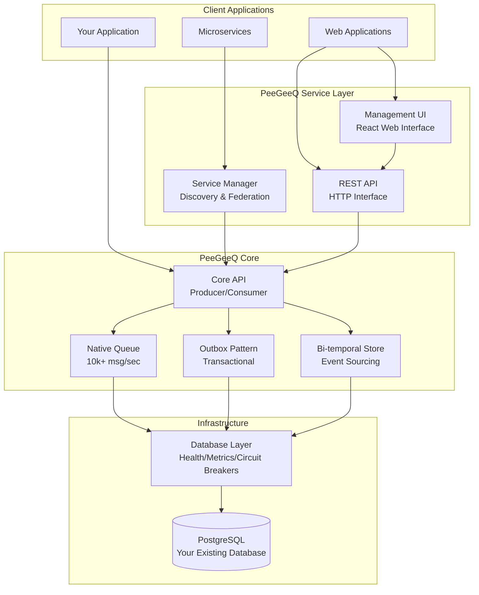

# PeeGeeQ - PostgreSQL as a Message Queue

<div align="center">
  
</div>

[](https://openjdk.java.net/projects/jdk/23/)
[](https://vertx.io/)
[](https://maven.apache.org/)
[](https://opensource.org/licenses/Apache-2.0)

#### © Mark Andrew Ray-Smith Cityline Ltd 2025

**PeeGeeQ** is a production-ready message queue system built on PostgreSQL that provides both high-performance real-time messaging and transactional messaging patterns.

## Quick Start (30 seconds)

```bash
# Clone and run the self-contained demo
git clone <repository-url>
cd peegeeq

# Unix/Linux/macOS
./run-self-contained-demo.sh

# Windows
run-self-contained-demo.bat
```

This demo shows:
- **Native queue** with real-time processing (10,000+ msg/sec)
- **Outbox pattern** with transactional guarantees (5,000+ msg/sec)
- **Bi-temporal event store** with temporal queries
- All running in Docker with automatic cleanup

## Key Features

- **High Performance**: 10,000+ messages/second with <10ms latency (native queue)
- **Transactional**: ACID compliance with business data (outbox pattern)
- **Bi-temporal Event Store**: Event sourcing with temporal queries and corrections
- **Production Ready**: Health checks, metrics, circuit breakers, dead letter queues
- **Message Priority**: Priority-based message processing with 5 configurable levels (CRITICAL, HIGH, NORMAL, LOW, BULK)
- **Enterprise-Grade Error Handling**: Sophisticated filter error handling with intelligent error classification, circuit breaker protection, async retry mechanisms, and dead letter queue integration
- **Security**: SSL/TLS encryption, certificate management, GDPR/SOX/HIPAA compliance features
- **Performance Optimization**: Connection pooling, batch processing, memory optimization, throughput benchmarking
- **Integration Patterns**: Request-reply, pub-sub, message routing, enterprise integration patterns
- **Service Discovery**: Multi-instance coordination with health monitoring and federation
- **REST API & Streaming**: HTTP interface with WebSocket and Server-Sent Events support
- **Management UI**: Modern React-based web interface for monitoring and administration
- **Consumer Groups**: Advanced load balancing with filtering, scaling, and fault tolerance
- **Comprehensive Examples**: 21 examples covering all features with detailed code snippets
- **Zero Dependencies**: Uses your existing PostgreSQL infrastructure

## Documentation

Complete documentation is available in the [`docs/`](docs/) directory:

### **Start Here**
- **[Complete Guide](docs/PeeGeeQ-Complete-Guide.md)** - What is PeeGeeQ, quick demo, core concepts
- **[Examples Guide](docs/PeeGeeQ-Examples-Guide.md)** - 21 comprehensive examples covering all features

### **For Developers**
- **[Architecture & API Reference](docs/PeeGeeQ-Architecture-API-Reference.md)** - System design, API documentation
- **[Development & Testing](docs/PeeGeeQ-Development-Testing.md)** - Development setup, testing, contribution guidelines

### **For Production**
- **[Advanced Features & Production](docs/PeeGeeQ-Advanced-Features.md)** - Enterprise features, monitoring, deployment
- **[Service Manager Guide](docs/PeeGeeQ-Service-Manager-Guide.md)** - Multi-instance deployment and federation
- **[Filter Error Handling Migration](docs/FILTER_ERROR_HANDLING_MIGRATION.md)** - Migration guide for enterprise-grade error handling
- **[Implementation Notes](docs/PeeGeeQ-Implementation-Notes.md)** - Troubleshooting, performance tuning, known issues

## Examples Overview

The [`peegeeq-examples/`](peegeeq-examples/) directory contains **21 comprehensive examples**.

For sample message files, templates, and configuration examples, see the [`examples/`](examples/) directory:
- **Message samples** for testing REST API endpoints
- **Templates** showing expected message formats
- **Configuration files** for demo setups

### Core Examples
- **PeeGeeQSelfContainedDemo** - Complete demonstration with Docker
- **PeeGeeQExample** - Basic producer/consumer patterns
- **BiTemporalEventStoreExample** - Event sourcing with temporal queries
- **ConsumerGroupExample** - Load balancing and consumer groups
- **SimpleConsumerGroupTest** - Basic consumer group testing

### REST API & Integration Examples
- **RestApiExample** - HTTP interface usage and management
- **RestApiStreamingExample** - WebSocket and Server-Sent Events
- **ServiceDiscoveryExample** - Multi-instance deployment with Consul

### Advanced Features Examples
- **MessagePriorityExample** - Priority-based processing (CRITICAL, HIGH, NORMAL, LOW, BULK)
- **EnhancedErrorHandlingExample** - 5 error strategies with exponential backoff
- **RetryAndFailureHandlingExample** - Comprehensive failure handling patterns
- **SecurityConfigurationExample** - SSL/TLS and compliance features
- **PerformanceTuningExample** - Optimization techniques and benchmarking
- **IntegrationPatternsExample** - Enterprise integration patterns

### Configuration & Deployment Examples
- **AdvancedConfigurationExample** - Production configuration patterns
- **MultiConfigurationExample** - Multi-environment setup
- **SystemPropertiesConfigurationExample** - System properties configuration

### Performance & Comparison Examples
- **NativeVsOutboxComparisonExample** - Performance comparison and benchmarking
- **PerformanceComparisonExample** - Detailed performance analysis
- **TransactionalBiTemporalExample** - Transactions with event sourcing

### Example Runner
- **PeeGeeQExampleRunner** - Run all examples sequentially with comprehensive reporting

### Running Examples
```bash
# Run ALL examples sequentially (recommended)
mvn compile exec:java -pl peegeeq-examples

# List all available examples
mvn compile exec:java@list-examples -pl peegeeq-examples

# Run specific examples
mvn compile exec:java -Dexec.mainClass="dev.mars.peegeeq.examples.PeeGeeQSelfContainedDemo" -pl peegeeq-examples
mvn compile exec:java -Dexec.mainClass="dev.mars.peegeeq.examples.MessagePriorityExample" -pl peegeeq-examples
mvn compile exec:java -Dexec.mainClass="dev.mars.peegeeq.examples.EnhancedErrorHandlingExample" -pl peegeeq-examples
mvn compile exec:java -Dexec.mainClass="dev.mars.peegeeq.examples.SecurityConfigurationExample" -pl peegeeq-examples
```

## Architecture



## Project Structure

```
peegeeq/
├── peegeeq-api/                    # Core API interfaces
├── peegeeq-db/                     # Database layer with health checks, metrics, circuit breakers
├── peegeeq-native/                 # High-performance native queue (10k+ msg/sec)
├── peegeeq-outbox/                 # Transactional outbox pattern (5k+ msg/sec)
├── peegeeq-bitemporal/             # Bi-temporal event store (3k+ msg/sec)
├── peegeeq-rest/                   # REST API with WebSocket/SSE support
├── peegeeq-service-manager/        # Service discovery and federation
├── peegeeq-management-ui/          # React-based web management interface
├── peegeeq-examples/               # 21 comprehensive examples
└── docs/                           # Complete documentation
```

## Prerequisites

- **Java 21+** (OpenJDK or Oracle JDK)
- **Maven 3.8+** for building
- **PostgreSQL 12+** for the database
- **Docker** (optional, for examples and testing)
- **Node.js 18+** (optional, for Management UI development)

## Getting Started

### 1. Run the Demo
```bash
./run-self-contained-demo.sh    # Unix/Linux/macOS
run-self-contained-demo.bat     # Windows
```

### 2. Explore Examples
```bash
# Run ALL examples with comprehensive reporting (recommended)
mvn compile exec:java -pl peegeeq-examples

# Or run specific examples:
# Message priority handling (5 priority levels)
mvn compile exec:java -Dexec.mainClass="dev.mars.peegeeq.examples.MessagePriorityExample" -pl peegeeq-examples

# Error handling patterns (5 error strategies)
mvn compile exec:java -Dexec.mainClass="dev.mars.peegeeq.examples.EnhancedErrorHandlingExample" -pl peegeeq-examples

# Performance optimization and benchmarking
mvn compile exec:java -Dexec.mainClass="dev.mars.peegeeq.examples.PerformanceTuningExample" -pl peegeeq-examples
```

### 3. Management UI
```bash
# Start the REST API server (using the convenience utility)
mvn compile exec:java -Dexec.mainClass="dev.mars.peegeeq.rest.StartRestServer" -pl peegeeq-rest

# In another terminal, start the Management UI
cd peegeeq-management-ui
npm install
npm run dev

# Open browser to http://localhost:5173
```

### 4. Basic Usage
```java
// Initialize PeeGeeQ
PeeGeeQManager manager = new PeeGeeQManager(
    new PeeGeeQConfiguration("development"), 
    new SimpleMeterRegistry());
manager.start();

// Create producer and consumer
QueueFactory factory = new PgQueueFactoryProvider()
    .createFactory("native", new PgDatabaseService(manager));

MessageProducer<String> producer = factory.createProducer("orders", String.class);
MessageConsumer<String> consumer = factory.createConsumer("orders", String.class);

// Send and receive messages
producer.send("Order #12345 created");

consumer.subscribe(message -> {
    System.out.println("Received: " + message.getPayload());
    return CompletableFuture.completedFuture(null);
});
```

## Performance

| Queue Type | Throughput | Latency | Use Case | Features |
|------------|------------|---------|----------|----------|
| Native | 10,000+ msg/sec | <10ms | Real-time, high-frequency | PostgreSQL LISTEN/NOTIFY |
| Outbox | 5,000+ msg/sec | <50ms | Transactional, reliable | ACID compliance, competing consumers |
| Bi-temporal | 3,000+ msg/sec | <100ms | Event sourcing, audit | Temporal queries, corrections |

*Performance measured on standard hardware with PostgreSQL 15. Results may vary based on configuration and workload.*

## Contributing

We welcome contributions! Please see our [Development & Testing Guide](docs/PeeGeeQ-Development-Testing.md) for:

- Development environment setup
- Build system and Maven commands
- Testing strategies and guidelines
- Code quality standards
- Contribution workflow

## License

PeeGeeQ is licensed under the Apache License, Version 2.0. See the [LICENSE](../LICENSE) file for details.

## Support

- **Documentation**: Complete guides in the [`docs/`](docs/) directory
- **Examples**: 21 comprehensive examples in [`peegeeq-examples/`](peegeeq-examples/)
- **Example Runner**: Use `mvn compile exec:java -pl peegeeq-examples` to run all examples
- **Management UI**: Modern React-based web interface in [`peegeeq-management-ui/`](peegeeq-management-ui/)
- **Issues**: Report bugs and feature requests via GitHub issues
- **Troubleshooting**: See [Implementation Notes](docs/PeeGeeQ-Implementation-Notes.md)

---

**Ready to get started?** Run the [30-second demo](#quick-start-30-seconds) or explore all [21 examples](#examples-overview)!
