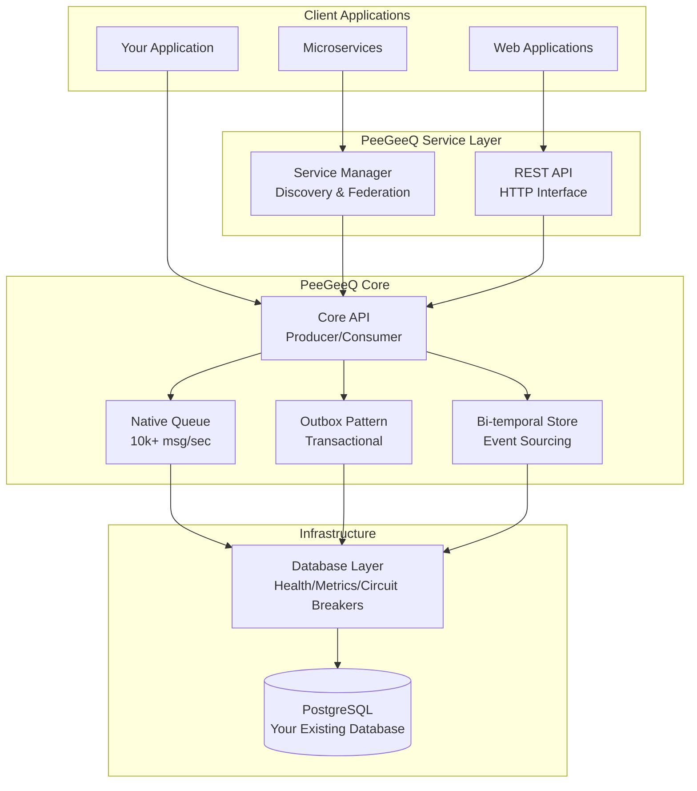

# PeeGeeQ - PostgreSQL as a Message Queue
#### © Mark Andrew Ray-Smith Cityline Ltd 2025

**PeeGeeQ** is a production-ready message queue system built on PostgreSQL that provides both high-performance real-time messaging and transactional messaging patterns.

## Quick Start (30 seconds)

```bash
# Clone and run the self-contained demo
git clone <repository-url>
cd peegeeq

# Unix/Linux/macOS
./run-self-contained-demo.sh

# Windows
run-self-contained-demo.bat
```

This demo shows:
- **Native queue** with real-time processing (10,000+ msg/sec)
- **Outbox pattern** with transactional guarantees (5,000+ msg/sec)
- **Bi-temporal event store** with temporal queries
- All running in Docker with automatic cleanup

## Key Features

- **High Performance**: 10,000+ messages/second with <10ms latency (native queue)
- **Transactional**: ACID compliance with business data (outbox pattern)
- **Bi-temporal Event Store**: Event sourcing with temporal queries
- **Production Ready**: Health checks, metrics, circuit breakers, dead letter queues
- **Message Priority**: Priority-based message processing with configurable levels
- **Advanced Error Handling**: Retry strategies, circuit breakers, poison message detection
- **Security**: SSL/TLS encryption, certificate management, compliance features
- **Performance Optimization**: Connection pooling, batch processing, memory optimization
- **Integration Patterns**: Request-reply, pub-sub, message routing, distributed transactions
- **Service Discovery**: Consul integration for multi-instance deployments
- **REST API**: HTTP interface for all operations
- **Zero Dependencies**: Uses your existing PostgreSQL infrastructure

## Documentation

Complete documentation is available in the [`docs/`](docs/) directory:

### **Start Here**
- **[Complete Guide](PeeGeeQ-Complete-Guide.md)** - What is PeeGeeQ, quick demo, core concepts
- **[Examples Guide](PeeGeeQ-Examples-Guide.md)** - 17 comprehensive examples covering 95-98% of functionality

### **For Developers**
- **[Architecture & API Reference](PeeGeeQ-Architecture-API-Reference.md)** - System design, API documentation
- **[Development & Testing](PeeGeeQ-Development-Testing.md)** - Development setup, testing, contribution guidelines

### **For Production**
- **[Advanced Features & Production](PeeGeeQ-Advanced-Features-Production.md)** - Enterprise features, monitoring, deployment
- **[Implementation Notes](PeeGeeQ-Implementation-Notes.md)** - Troubleshooting, performance tuning, known issues

## Examples Overview

The [`peegeeq-examples/`](peegeeq-examples/) directory contains **17 comprehensive examples**:

### Core Examples
- **PeeGeeQSelfContainedDemo** - Complete demonstration
- **PeeGeeQExample** - Basic producer/consumer patterns
- **BiTemporalEventStoreExample** - Event sourcing with temporal queries
- **ConsumerGroupExample** - Load balancing and consumer groups
- **RestApiExample** - HTTP interface usage
- **ServiceDiscoveryExample** - Multi-instance deployment

### Advanced Examples (NEW)
- **MessagePriorityExample** - Priority-based processing with real-world scenarios
- **EnhancedErrorHandlingExample** - Sophisticated error handling patterns
- **SecurityConfigurationExample** - SSL/TLS and security best practices
- **PerformanceTuningExample** - Optimization techniques and benchmarking
- **IntegrationPatternsExample** - Distributed system integration patterns

### Specialized Examples
- **TransactionalBiTemporalExample** - Transactions with event sourcing
- **RestApiStreamingExample** - WebSocket and Server-Sent Events
- **NativeVsOutboxComparisonExample** - Performance comparison
- **AdvancedConfigurationExample** - Production configuration patterns
- **MultiConfigurationExample** - Multi-environment setup
- **SimpleConsumerGroupTest** - Basic consumer group testing

### Running Examples
```bash
# Run any example
mvn compile exec:java -Dexec.mainClass="dev.mars.peegeeq.examples.ExampleName" -pl peegeeq-examples

# Specific examples
mvn compile exec:java -Dexec.mainClass="dev.mars.peegeeq.examples.MessagePriorityExample" -pl peegeeq-examples
mvn compile exec:java -Dexec.mainClass="dev.mars.peegeeq.examples.EnhancedErrorHandlingExample" -pl peegeeq-examples
mvn compile exec:java -Dexec.mainClass="dev.mars.peegeeq.examples.SecurityConfigurationExample" -pl peegeeq-examples
```

## Architecture



## Prerequisites

- **Java 21+** (OpenJDK or Oracle JDK)
- **Maven 3.8+** for building
- **PostgreSQL 12+** for the database
- **Docker** (optional, for examples and testing)

## Getting Started

### 1. Run the Demo
```bash
./run-self-contained-demo.sh    # Unix/Linux/macOS
run-self-contained-demo.bat     # Windows
```

### 2. Explore Examples
```bash
# Message priority handling
mvn compile exec:java -Dexec.mainClass="dev.mars.peegeeq.examples.MessagePriorityExample" -pl peegeeq-examples

# Error handling patterns
mvn compile exec:java -Dexec.mainClass="dev.mars.peegeeq.examples.EnhancedErrorHandlingExample" -pl peegeeq-examples

# Performance optimization
mvn compile exec:java -Dexec.mainClass="dev.mars.peegeeq.examples.PerformanceTuningExample" -pl peegeeq-examples
```

### 3. Basic Usage
```java
// Initialize PeeGeeQ
PeeGeeQManager manager = new PeeGeeQManager(
    new PeeGeeQConfiguration("development"), 
    new SimpleMeterRegistry());
manager.start();

// Create producer and consumer
QueueFactory factory = new PgQueueFactoryProvider()
    .createFactory("native", new PgDatabaseService(manager));

MessageProducer<String> producer = factory.createProducer("orders", String.class);
MessageConsumer<String> consumer = factory.createConsumer("orders", String.class);

// Send and receive messages
producer.send("Order #12345 created");

consumer.subscribe(message -> {
    System.out.println("Received: " + message.getPayload());
    return CompletableFuture.completedFuture(null);
});
```

## Performance

| Queue Type | Throughput | Latency | Use Case |
|------------|------------|---------|----------|
| Native | 10,000+ msg/sec | <10ms | Real-time, high-frequency |
| Outbox | 5,000+ msg/sec | <50ms | Transactional, reliable |
| Bi-temporal | 3,000+ msg/sec | <100ms | Event sourcing, audit |

## Contributing

We welcome contributions! Please see our [Development & Testing Guide](PeeGeeQ-Development-Testing.md) for:

- Development environment setup
- Build system and Maven commands
- Testing strategies and guidelines
- Code quality standards
- Contribution workflow

## License

PeeGeeQ is licensed under the Apache License, Version 2.0. See the [LICENSE](../LICENSE) file for details.

## Support

- **Documentation**: Complete guides in the [`docs/`](docs/) directory
- **Examples**: 17 comprehensive examples in [`peegeeq-examples/`](peegeeq-examples/)
- **Issues**: Report bugs and feature requests via GitHub issues
- **Troubleshooting**: See [Implementation Notes](PeeGeeQ-Implementation-Notes.md)

---

**Ready to get started?** Run the [30-second demo](#quick-start-30-seconds) or explore the [Examples Guide](PeeGeeQ-Examples-Guide.md)!
