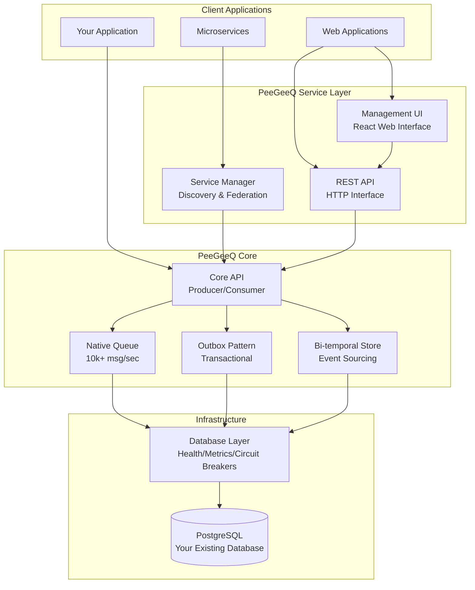

# PeeGeeQ - PostgreSQL as a Message Queue

<div align="center">
  
</div>

[](https://openjdk.java.net/projects/jdk/23/)
[](https://www.postgresql.org/)
[](https://vertx.io/)
[](https://reactjs.org/)
[](https://maven.apache.org/)
[](https://github.com/mraysmit/peegeeq/actions)
[](https://opensource.org/licenses/Apache-2.0)

#### © Mark Andrew Ray-Smith Cityline Ltd 2025

**PeeGeeQ** is a high-performance message queue system built on PostgreSQL, providing real-time messaging with transactional guarantees, event sourcing, and enterprise-grade features.

## Quick Start

```bash
# Clone and run the self-contained demo
git clone <repository-url>
cd peegeeq

# Unix/Linux/macOS
./run-self-contained-demo.sh

# Windows
run-self-contained-demo.bat
```

This demo demonstrates:
- **Native queue** with real-time processing (10,000+ msg/sec)
- **Outbox pattern** with transactional guarantees (5,000+ msg/sec)
- **Bi-temporal event store** with temporal queries
- All components running in Docker with automatic cleanup

## Key Features

- **High Performance**: 10,000+ messages/second with <10ms latency
- **ACID Compliance**: Transactional guarantees with business data
- **Bi-temporal Event Store**: Event sourcing with temporal queries and corrections
- **Production Ready**: Health checks, metrics, circuit breakers, dead letter queues
- **Message Priority**: 5 configurable priority levels (CRITICAL to BULK)
- **Enterprise Error Handling**: Circuit breakers, async retry, intelligent classification
- **Security**: SSL/TLS encryption, certificate management, compliance features
- **Performance Optimization**: Connection pooling, batch processing, memory optimization
- **Integration Patterns**: Request-reply, pub-sub, message routing
- **Service Discovery**: Multi-instance coordination with health monitoring
- **REST API & Streaming**: HTTP interface with WebSocket and SSE support
- **Management UI**: React-based web interface for monitoring and administration
- **Consumer Groups**: Advanced load balancing with filtering and fault tolerance
- **Zero Dependencies**: Uses your existing PostgreSQL infrastructure

## Architecture



## Project Structure

```
peegeeq/
├── peegeeq-api/                    # Core API interfaces
├── peegeeq-db/                     # Database layer with health checks and metrics
├── peegeeq-native/                 # High-performance native queue (10k+ msg/sec)
├── peegeeq-outbox/                 # Transactional outbox pattern (5k+ msg/sec)
├── peegeeq-bitemporal/             # Bi-temporal event store (3k+ msg/sec)
├── peegeeq-rest/                   # REST API with WebSocket/SSE support
├── peegeeq-service-manager/        # Service discovery and federation
├── peegeeq-management-ui/          # React-based web management interface
├── peegeeq-examples/               # Comprehensive examples and demos
└── docs/                           # Documentation
```

## Prerequisites

- **Java 21+** (OpenJDK or Oracle JDK)
- **Maven 3.8+** for building
- **PostgreSQL 12+** for the database
- **Docker** (optional, for examples and testing)
- **Node.js 18+** (optional, for Management UI development)

## Getting Started

### 1. Run the Demo
```bash
./run-self-contained-demo.sh    # Unix/Linux/macOS
run-self-contained-demo.bat     # Windows
```

### 2. Explore Examples
```bash
# Run ALL examples with comprehensive reporting
mvn compile exec:java -pl peegeeq-examples

# Or run specific examples
mvn compile exec:java -Dexec.mainClass="dev.mars.peegeeq.examples.MessagePriorityExample" -pl peegeeq-examples
mvn compile exec:java -Dexec.mainClass="dev.mars.peegeeq.examples.EnhancedErrorHandlingExample" -pl peegeeq-examples
mvn compile exec:java -Dexec.mainClass="dev.mars.peegeeq.examples.PerformanceTuningExample" -pl peegeeq-examples
```

### 3. Management UI
```bash
# Start the REST API server
mvn compile exec:java -Dexec.mainClass="dev.mars.peegeeq.rest.StartRestServer" -pl peegeeq-rest

# In another terminal, start the Management UI
cd peegeeq-management-ui
npm install
npm run dev

# Open browser to http://localhost:5173
```

### 4. Basic Usage
```java
// Initialize PeeGeeQ
PeeGeeQManager manager = new PeeGeeQManager(
    new PeeGeeQConfiguration("development"), 
    new SimpleMeterRegistry());
manager.start();

// Create producer and consumer
QueueFactory factory = new PgQueueFactoryProvider()
    .createFactory("native", new PgDatabaseService(manager));

MessageProducer<String> producer = factory.createProducer("orders", String.class);
MessageConsumer<String> consumer = factory.createConsumer("orders", String.class);

// Send and receive messages
producer.send("Order #12345 created");

consumer.subscribe(message -> {
    System.out.println("Received: " + message.getPayload());
    return CompletableFuture.completedFuture(null);
});
```

## Performance

| Queue Type | Throughput | Latency | Use Case |
|------------|------------|---------|----------|
| Native | 10,000+ msg/sec | <10ms | Real-time, high-frequency |
| Outbox | 5,000+ msg/sec | <50ms | Transactional, reliable |
| Bi-temporal | 3,000+ msg/sec | <100ms | Event sourcing, audit |

*Performance measured on standard hardware with PostgreSQL 15. Results may vary based on configuration and workload.*

## Testing

```bash
# Quick development testing (~30 seconds)
./scripts/run-tests.sh core

# Smoke tests for basic validation (~15 seconds)
./scripts/run-tests.sh smoke

# Single module testing
./scripts/run-tests.sh core peegeeq-outbox

# Integration tests with TestContainers (~10-15 minutes)
./scripts/run-tests.sh integration

# Performance benchmarks (~20-30 minutes)
./scripts/run-tests.sh performance

# All tests (~45+ minutes)
./scripts/run-tests.sh all
```

## License

PeeGeeQ is licensed under the Apache License, Version 2.0. See the [LICENSE](LICENSE) file for details.

## Support

- **Examples**: 21 comprehensive examples in `peegeeq-examples/`
- **Documentation**: Complete guides in `docs/` directory
- **Management UI**: React-based web interface in `peegeeq-management-ui/`
- **Issues**: Report bugs and feature requests via GitHub issues
