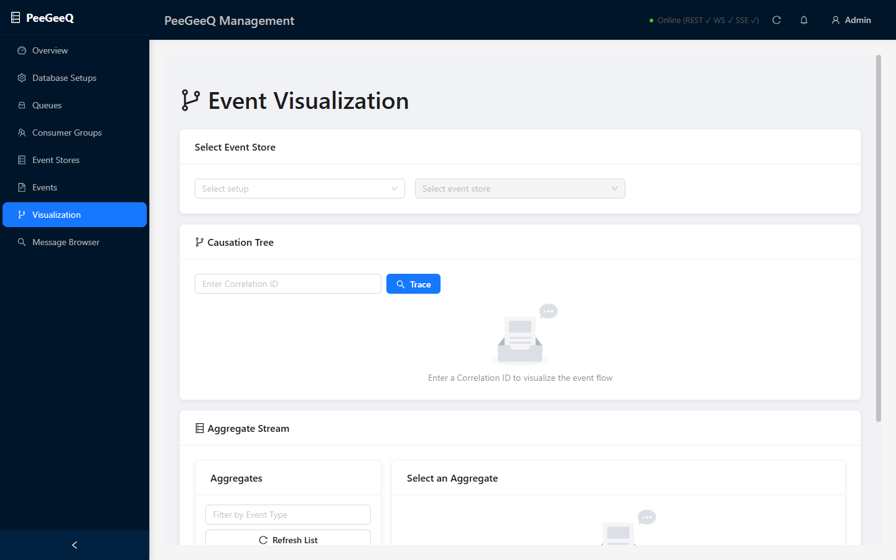
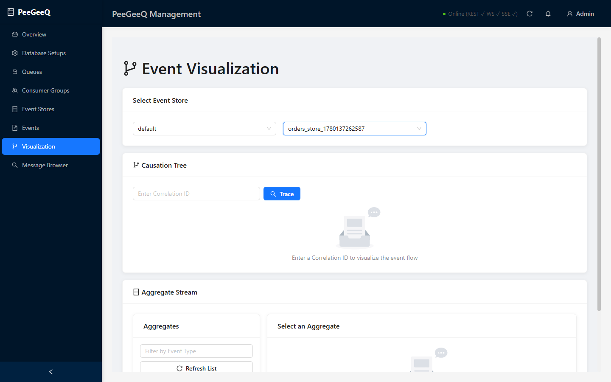
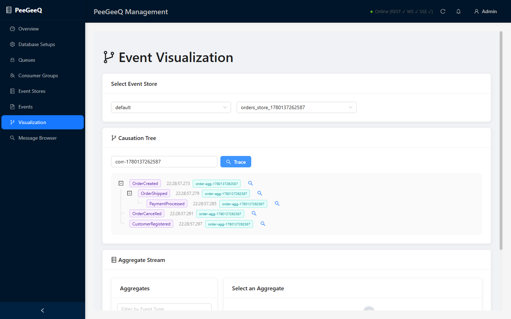
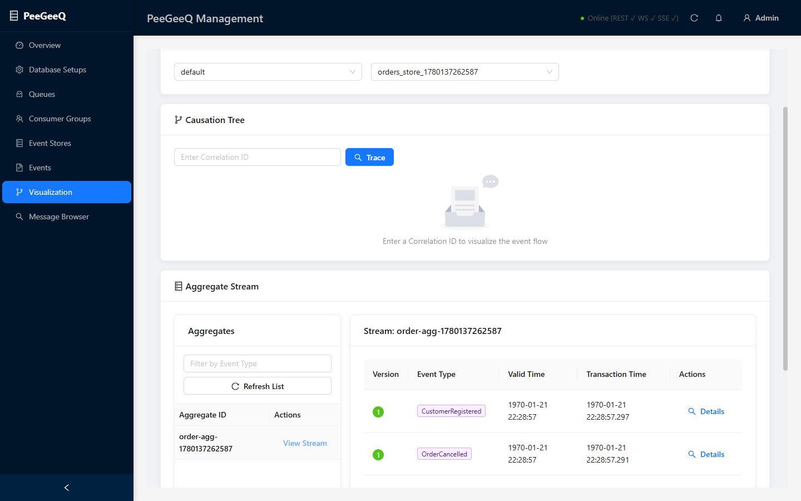

# PeeGeeQ Management UI — Enhancement Plan

**Date**: 2026-05-30  
**Status**: Draft for review  
**Scope**: Frontend (`peegeeq-management-ui`) only. Backend REST/WS/SSE contracts are treated as given.

---

## 0. Complete Functionality Inventory

Every piece of functionality on every screen, as implemented.

---

### Overview (`/`)

**Stats cards (top row)**
- Total Queues count
- Active Consumers count
- Messages Today count
- System Status indicator

**Real-time charts**
- Throughput chart — live line/area chart of messages per second, driven by WebSocket (`/ws/monitoring`) and SSE (`/sse/metrics`)
- Active Connections chart — live line/area chart of connection count over time

**System status banner**
- `WebSocket: Connected / Disconnected` tag (`data-testid="websocket-status"`)
- `SSE: Connected / Disconnected` tag (`data-testid="sse-status"`)

**Queue summary table**
- Lists all queues with: name, setup ID tag, type tag, message count, consumer count, message rate, error rate, status tag
- Columns are sortable

**Recent Activity table**
- Timestamp, Action, Resource, Status tag (success/warning/error), Details

**Refresh button** — manual refresh of all data

---

### Database Setups (`/database-setups`)

**Stats cards**
- Total Setups, Active Setups, Total Queues across all setups, Total Event Stores across all setups

**Setups table**
- Columns: Setup ID, Database Name, Host, Port, Queues count, Event Stores count, Status tag (active/creating/failed), Created At
- Per-row actions menu (three-dot): **View Details**, **Delete**

**Create Setup button** → modal with fields:
- Setup ID (required, no hyphens)
- Host (default: localhost)
- Port (default: 5432)
- Database Name (required)
- Username (required)
- Password (required)
- Schema (required)
- SSL checkbox
- Submit triggers backend schema creation + Flyway migrations (up to 60 s)

**Delete Setup** — confirmation modal listing: database name, queue count, event store count, irreversibility warning

---

### Queues (`/queues`)

**Stats cards**
- Total Queues, Active Queues, Total Messages, Avg Message Rate

**Filter toolbar** (FilterBar component)
- Search by queue name (text input)
- Filter by Type (native / outbox / dlq) — multi-select dropdown
- Filter by Status (active / paused / error) — multi-select dropdown
- Clear Filters button

**Queues table**
- Columns: Queue Name (link to details) + Setup ID tag + Type tag, Messages, Consumers, Message Rate (msg/s), Error Rate (coloured green/orange/red), Status tag, Actions
- Sortable columns: Queue Name, Messages, Message Rate
- Pagination with page-size selector and quick-jumper
- Clicking Queue Name navigates to Queue Details

**Per-row actions menu (three-dot)**
- View Details (navigates to `/queues/:setupId/:queueName`)
- Purge Messages
- Delete Queue (confirmation modal)

**Create Queue button** → modal with fields:
- Queue Name (required)
- Setup dropdown (with Refresh Setups button)
- Queue Type (defaults to `native`)

---

### Queue Details (`/queues/:setupId/:queueName`)

**Breadcrumb** — Queues › {setupId} › {queueName}

**Header actions**
- Refresh button
- Actions menu (three-dot): Pause / Resume, Purge Messages, Delete Queue — each with a confirmation modal

**Tab: Overview**
- Queue Information card: Setup ID, Queue Name, Type tag, Status tag, Created At, Updated At
- Performance Metrics card (StatCard components): Message Rate (msg/s), Consumer Count, Error Count, Avg Processing Time

**Tab: Consumers**
- Table of active/idle consumer connections
- Columns: Consumer ID, Name, Status tag (ACTIVE/IDLE/DISCONNECTED), Connected At, Last Heartbeat, Messages Processed, Messages/sec, Error Count, Avg Processing Time

**Tab: Messages**
- Table of messages currently in the queue
- Columns: Message ID (truncated tag), Type, Priority, Delivery Count, Timestamp
- **Publish Message button** → modal with fields: Payload (JSON textarea), Headers (JSON textarea), Priority (number), Delay Seconds (number)
- **Get Messages button** → modal: Count input → fetches and displays messages inline

**Tab: Bindings**
- Table of routing-key bindings configured for the queue

---

### Event Stores (`/event-stores`)

**Stats cards**
- Total Event Stores, Active Stores, Total Events, Unique Aggregates, Storage Used (estimated)

**Event Stores table**
- Columns: Store Name, Setup ID, Event Count, Aggregate Count (streams), Status tag, Last Event At, Storage (estimated), Actions
- Per-row actions menu: **View Details** (modal), **Delete** (confirmation modal)

**View Details modal**
- Store name, Setup ID, status, event count, stream count, created at, last event at
- Aggregate types list, event types list

**Create Event Store button** → modal with fields:
- Event Store Name (required)
- Setup dropdown (with Refresh Setups button)

**Delete Event Store** — confirmation modal noting all events will be permanently deleted

**Causation Tree section** (stacked below table)
- Correlation ID text input
- Trace button — fetches events by correlation ID, builds directed tree grouped by causation ID
- Ant Design Tree component showing nodes: event type tag, transaction time, aggregate ID tag, Details button (opens drawer)
- Tree is fully expanded by default

**Aggregate Stream section** (stacked below Causation Tree)
- Event Type filter input (filters the aggregate ID list)
- Refresh List button — fetches unique aggregate IDs
- Aggregates table: Aggregate ID, View Stream button
- Clicking View Stream loads the full event stream for that aggregate into the right-side stream table
- Stream table columns: Version (green badge), Event Type (purple tag), Valid Time, Transaction Time, Details button (opens drawer)

**Event Details drawer** (shared by both sections)
- Full event details: Event ID, Event Type, Aggregate ID, Version, Valid Time, Transaction Time, Correlation ID, Causation ID, Event Data (JSON), Metadata/Headers (JSON)

---

### Events (`/events`)

**Post Event card**
- Setup dropdown (required)
- Event Store dropdown (required, filtered by selected setup — shows event count per store)
- Event Type text input (required)
- Event Data JSON textarea (required, validated as valid JSON)
- **Show / Hide Advanced toggle button**

  *Advanced — Temporal section*
  - Valid Time date-time picker (business time — when event actually happened)

  *Advanced — Event Sourcing section*
  - Aggregate ID input
  - Correlation ID input
  - Causation ID input

  *Advanced — Metadata section*
  - Headers JSON textarea (validated as valid JSON)

- **Clear Form button** — resets all fields and hides advanced sections
- **Post Event button** — submits, shows success toast with event ID, or error toast

**Query Events card**
- Setup dropdown (`data-testid="query-setup-select"`)
- Event Store dropdown (`data-testid="query-eventstore-select"`, disabled until setup selected)
- **Load Events button** — fetches up to 1000 events, shows success toast with count
- **Refresh button** — re-fetches with same selection

**Filter Loaded Events card** (client-side, no re-query)
- Event Type text filter (prefix icon, clearable)
- Aggregate Type text filter
- Correlation / Causation ID text filter — also auto-populated by clicking a correlation/causation ID link in the table
- Valid Time range picker (date-from / date-to with time)

**Events table**
- Columns: Event # (row number), Event Type (purple tag), Aggregate ID + Aggregate Type (cyan tag + code), Version badge, Valid Time, Transaction Time, Correlation ID link (clickable → auto-fills filter), Causation ID link (clickable → auto-fills filter), Actions
- Pagination: 20 per page, page-size selector, quick-jumper, total count label
- Table footer shows: `Total Events: N` and `(Showing M filtered)` when filter is active
- Empty state shows instruction to select setup + event store

**Per-row action: View Details button** → modal with:
- Event Information card: Event ID, Event Type, Aggregate ID, Aggregate Type, Version, Valid Time, Transaction Time, Event Number, Correlation ID, Causation ID
- Event Data card: formatted JSON
- Metadata / Headers card: formatted JSON
- Export button (footer)

---

### Consumer Groups (`/consumer-groups`)

**Stats cards**
- Total Groups, Active Groups, Total Members, Total Processed Messages

**Consumer Groups table**
- Columns: Group Name, Setup ID, Queue, Members / Max Members, Load Balancing Strategy tag, Status tag (active/inactive/rebalancing/error), Messages/sec, Last Rebalance, Actions
- Per-row actions menu: **View Details** (modal), **Delete** (confirmation)

**Create Consumer Group button** → modal with fields:
- Group Name, Setup dropdown, Queue dropdown, Max Members, Load Balancing Strategy (ROUND_ROBIN / RANGE / STICKY / RANDOM), Session Timeout

**View Details modal**
- Group details: Group ID, Name, Setup, Queue, Status, Strategy, Session Timeout, Created At, Last Rebalance
- Members table: Member ID, Name, Status tag, Joined At, Last Heartbeat, Assigned Partitions, Messages Processed, Error Count

---

### Message Browser (`/messages`)

**Toolbar**
- Setup dropdown filter
- Queue dropdown filter (populated from all queues)
- Message Type text filter
- Status dropdown filter (pending / processing / completed / failed)
- Search text input (searches payload content)
- Date range picker (from / to with time)
- **Search button**
- **Refresh button**
- **Advanced Filters button** → slide-out drawer with additional filters
- **Export button** — download filtered messages
- **Clear button** — reset all filters

**Messages table**
- Columns: Message ID (truncated), Queue, Setup, Type, Status tag, Priority, Size, Timestamp, Correlation ID, Actions
- Pagination
- Row click or View button → Message Detail modal

**Message Detail modal**
- Message ID, Queue, Setup, Type, Status, Priority, Size, Timestamp, Correlation ID, Causation ID
- Payload card (formatted JSON)
- Headers card (formatted JSON)
- Consumer Info card (if consumed): Consumer ID, Consumer Group, Processed At

---

### Event Visualization (`/event-visualization`)

**Select Event Store card**
- Setup dropdown (`data-testid="viz-setup-select"`)
- Event Store dropdown (`data-testid="viz-eventstore-select"`, disabled until setup selected, shows only stores for selected setup)

*(Below this, the `EventVisualization` component renders — same component also embedded in Event Stores page)*

**Causation Tree card**
- Correlation ID input (press Enter or click Trace)
- **Trace button** — fetches all events sharing that correlation ID, builds tree by causation-parent links
- Ant Design Tree component: each node shows event type tag, transaction time (HH:mm:ss.SSS), aggregate ID tag, magnifier button to open Details drawer
- Tree expanded by default; expand/collapse all nodes

**Aggregate Stream card**
- Event Type filter input — narrows the aggregate ID list
- **Refresh List button** — fetches unique aggregate IDs from backend (`getUniqueAggregates`)
- Left panel (aggregates table): Aggregate ID, View Stream button
- Right panel (stream table, shown after clicking View Stream): Version badge (green), Event Type tag (purple), Valid Time, Transaction Time, Details button

**Event Details drawer** (shared)
- Full event: Event ID, Event Type, Aggregate ID, Version, Valid Time, Transaction Time, Correlation ID, Causation ID, Event Data (JSON formatted), Metadata (JSON formatted)

---

### Settings (`/settings`)

**Connection Status card**
- Current connection state badge (Connected / Disconnected / Checking)
- Live check runs on load

**Backend Configuration form** (`data-testid="settings-form"`)
- API URL input (`data-testid="api-url-input"`) — base REST URL
- WebSocket URL input (`data-testid="ws-url-input"`) — optional override
- **Save Configuration button**
- **Reset to Defaults button**

**REST API health section**
- **Ping REST button** — calls `GET /api/v1/health`, shows success/fail result with timestamp
- Auto-ping toggle + interval (seconds) input
- Last result badge (green tick / red cross + timestamp)

**WebSocket health section**
- **Ping WS button** — opens `ws://host/ws/health`, shows success/fail with timestamp
- Auto-ping toggle + interval input
- Last result badge

**SSE health section**
- **Ping SSE button** — calls `GET /api/v1/sse/health`, shows success/fail with timestamp
- Auto-ping toggle + interval input
- Last result badge

---

### Header (all pages)

- Page title (current page name)
- Connection status badge: Online (REST ✓ WS ✓ SSE ✓) / Offline / Checking — polls `/api/v1/health` and `/ws/health`
- Refresh button
- Notifications bell (badge count hardcoded 0, no backend — inert)
- User menu

### Sidebar (all pages)

Nav items (in order):
1. Overview (`/`) — DashboardOutlined icon
2. Database Setups (`/database-setups`) — SettingOutlined icon
3. Queues (`/queues`) — InboxOutlined icon
4. Consumer Groups (`/consumer-groups`) — TeamOutlined icon
5. Event Stores (`/event-stores`) — DatabaseOutlined icon
6. Events (`/events`) — FileTextOutlined icon
7. Visualization (`/event-visualization`) — BranchesOutlined icon
8. Message Browser (`/messages`) — SearchOutlined icon

Collapsible — collapse/expand trigger at bottom.

---


### 1.1 Pages and navigation

| Page | Route | Status |
|---|---|---|
| Overview | `/` | Working — loads stats, queue summary, recent activity, real-time charts |
| Database Setups | `/database-setups` | Working — create, list setups |
| Queues | `/queues` | Working — create, list, delete queues per setup |
| Consumer Groups | `/consumer-groups` | Working |
| Event Stores | `/event-stores` | Working — create, list event stores |
| Events | `/events` | Working — post events, query and filter events |
| Event Visualization | `/event-visualization` | Working — causation tree and aggregate stream |
| Message Browser | `/messages` | Working |
| Settings | `/settings` | Working — configure backend URL, test connection, reset to defaults |

#### Overview page


*System Overview — stats cards, live throughput and connections charts, queue summary table, recent activity table. WebSocket and SSE status tags are visible in the system status banner.*

#### Header bar


*Header shows the current page title, the connection status badge, the refresh button, the notification bell (currently inert — see Section 1.4), and the user menu.*

#### WebSocket and SSE status


*The system status banner on the Overview page shows `WebSocket: Connected` and `SSE: Connected` tags (green) when both the `/ws/monitoring` WebSocket and `/sse/metrics` SSE channels are established. These are the `data-testid="websocket-status"` and `data-testid="sse-status"` elements asserted by the `websocket-sse-connection.spec.ts` E2E test.*

#### Queues page


*The Queues page shows per-queue stats cards (total, active, messages, avg rate), a search/filter toolbar, and the queues table with sortable columns. The **Create Queue** button opens a modal with setup selection and queue configuration.*

#### Queues — Create Queue modal


*The Create Queue modal requires selecting a database setup from the dropdown and entering a queue name. Queue type defaults to `native`.*

#### Database Setups page


*Database Setups lists all configured PostgreSQL connections. Each setup has its own isolated schema. The **Create Setup** button opens the creation form.*

#### Create Setup modal


*The Create Setup form collects Setup ID (identifier, no hyphens), host, port, database name, username, password, schema, and SSL flag. Creating a setup triggers schema creation and Flyway migrations on the backend — this is why the modal timeout in E2E tests is set to 60 seconds.*

#### Event Stores page


*The Event Stores page shows aggregate stats (stores, active, total events, unique aggregates, storage used) and lists all configured event stores with status, event count, and storage.*

#### Event Stores — details modal


*The per-row actions menu (three-dot button) offers View Details, Edit, and Delete. The View Details modal shows the full event store configuration including connection details and schema.*

#### Events page — post form (empty)


*The Events page provides a Post Event form (setup, event store, event type, and JSON payload) together with a Query Events panel and a Filter Loaded Events toolbar.*

#### Events page — events loaded


*After selecting a setup and event store and clicking Load Events, the results table shows all events with type tags, aggregate ID, version, bi-temporal columns, and correlation/causation chain links.*

#### Events page — filtered by event type


*The Filter Loaded Events toolbar narrows the visible rows by event type without re-querying the backend.*

#### Events page — event detail modal


*Clicking the view action on any event row opens the event detail modal, showing the full JSON payload, all bi-temporal timestamps, and the correlation/causation chain.*

#### Events page — advanced options expanded


*Clicking Show Advanced reveals three optional sections: Temporal (valid time range), Event Sourcing (aggregate ID, correlation ID, causation ID), and Metadata (arbitrary JSON headers).*

#### Settings page


*The Settings page configures the backend API URL and optional WebSocket URL. It includes individual health-check ping buttons for REST, WebSocket (`/ws/health`), and SSE (`/api/v1/sse/health`) channels, each with an auto-ping toggle.*

#### Consumer Groups page


*The Consumer Groups page lists all consumer group subscriptions across setups. Each group can be browsed for its queue assignments and offset positions.*

#### Message Browser page


*The Message Browser allows searching and inspecting messages across any queue in any setup. Filters by setup, queue, and message content.*

#### Event Visualization page — empty state



*The standalone **Event Visualization** page (`/event-visualization`) is accessible from the sidebar nav. Placeholder panels are shown until a setup and event store are selected from the top dropdowns.*

#### Event Visualization page — event store selected



*Once a setup and event store are selected, the Causation Tree and Aggregate Stream panels activate.*

#### Event Visualization page — causation tree traced



*After entering a Correlation ID and clicking Trace, the Causation Tree renders the full directed graph of events linked by causation ID.*

#### Event Visualization page — aggregate stream with data



*The Aggregate Stream section lists aggregate IDs on the left; clicking View Stream populates the right panel with the full ordered event stream for that aggregate.*

#### Queue Details — Overview tab

Queue Details is reached by clicking the View action on any row in the Queues list. The URL is `/queues/:setupId/:queueName`.


*The **Overview** tab shows a Queue Information card (setup ID, queue name, type tag, status tag, created/updated timestamps) and a Performance Metrics card (message rates, consumer count, error statistics).*

#### Queue Details — Consumers tab


*The **Consumers** tab lists all active and idle consumer connections for the queue, including consumer ID, name, status (ACTIVE/IDLE/DISCONNECTED), connected-at timestamp, last heartbeat, messages processed, messages per second, error count, and average processing time.*

#### Queue Details — Messages tab


*The **Messages** tab shows the messages currently in the queue. It supports filtering by state and includes a **Publish Message** button to send a message to the queue directly from the UI.*

#### Queue Details — Bindings tab


*The **Bindings** tab shows the routing-key bindings configured for this queue.*

### 1.2 Real-time channels in use

| Channel | Endpoint | Usage | Component |
|---|---|---|---|
| WebSocket monitoring | `ws://host/ws/monitoring` | System stats updates (`type: "system_stats"`) → throughput and connection charts | `Overview.tsx` via `createSystemMonitoringService` |
| SSE metrics | `http://host/sse/metrics` | Continuous metrics → same chart data path as WS monitoring | `Overview.tsx` via `createSystemMetricsSSE` |
| WS queue stream | `ws://host/ws/queues/{setupId}/{queueName}` | Factory exists in `websocketService.ts` (`createMessageStreamService`) | **Not connected to any page** |
| SSE queue stream | `http://host/api/v1/queues/{setupId}/{queueName}/stream` | No factory exists | **Not implemented in frontend** |
| SSE queue updates | `http://host/api/v1/sse/queues/{setupId}` | Factory exists (`createQueueUpdatesSSE`) | **Not connected to any page** |
| WS health | `ws://host/ws/health` | One-shot health check — used by `ConnectionStatus.tsx` for the ping indicator | Polled every N seconds |
| SSE health | `http://host/api/v1/sse/health` | One-shot event — available but not used by any component | Unused |

### 1.3 Connection status surfaces

- **`ConnectionStatus` component** (`src/components/common/ConnectionStatus.tsx`): embedded in the Header. Polls REST `/api/v1/health`, opens a WS to `/ws/health` to verify connectivity. Shows an Online / Offline / Checking badge. Appears in the header of every page.
- **Overview page status tags**: `data-testid="websocket-status"` and `data-testid="sse-status"`. Driven by `onConnect` / `onDisconnect` callbacks from the WS monitoring and SSE metrics services. Turn green when the respective channel is established.

### 1.4 Notification bell

`Header.tsx` renders:

```tsx
<Badge count={0} size="small">
  <Button data-testid="notifications-btn" type="text" icon={<BellOutlined />} title="Notifications" />
</Badge>
```

The `count` is a hardcoded literal `0`. There is no backend notification endpoint, no frontend store, and no event handler wired to this badge. The button does nothing when clicked.

### 1.5 E2E test coverage (as of 2026-05-30)

52 tests passing across 15 spec files with `workers: 1` (sequential execution).

| Spec file | Tests | What it covers |
|---|---|---|
| `setup-prerequisite.spec.ts` | — | Shared setup creation prerequisite |
| `database-setup.spec.ts` | — | Setup creation, table display |
| `queue-management.spec.ts` | — | Queue CRUD |
| `queue-messaging-workflow.spec.ts` | — | Send + receive messages via UI |
| `event-store-management.spec.ts` | — | Event store CRUD |
| `event-store-workflow.spec.ts` | — | Append + browse events |
| `event-visualization.spec.ts` | — | Visualization tab, charts |
| `settings.spec.ts` | — | Backend URL config, reset |
| `connection-status.spec.ts` | — | Offline/Online state, disconnect button |
| `websocket-sse-connection.spec.ts` | 1 | WS and SSE status tags show "Connected" on Overview |
| `overview-system-status.spec.ts` | — | Overview stats cards |
| `system-integration.spec.ts` | — | Cross-page integration smoke |
| `settings-ping-utilities.spec.ts` | — | Ping, test-connection utilities |
| `visualization-tab-smoke.spec.ts` | — | Visualization tab smoke |
| `visualization-isolated.spec.ts` | — | Isolated visualization render |

**Gaps in current test coverage**:
- No negative / error-recovery tests (duplicate names, invalid identifiers, bad credentials)
- No test that proves a message published to a queue is delivered to the browser via WS or SSE stream
- No test of the backend WS health or SSE health endpoints from the browser context
- Notification bell is untested beyond existence check (it has nothing to test yet)

### 1.6 Stub features — not yet implemented

The following features exist in the UI as placeholders or no-op stubs. None have backend API calls wired up.

#### Queue Details tabs

| Tab | Component | Status |
|---|---|---|
| **Consumers** | `QueueDetailsEnhanced.tsx` | Stub — shows info banner "Consumers Tab - Coming in Week 5". No API call, no data. |
| **Bindings** | `QueueDetailsEnhanced.tsx` | Stub — shows info banner "Bindings Tab - Coming in Week 5". No API call, no data. |
| **Charts** | `QueueDetailsEnhanced.tsx` | Stub — shows info banner "Charts Tab - Coming in Week 2". No API call, no data. |

#### Queues page — Purge action

The three-dot actions dropdown on each queue row includes a **Purge** item that fires `message.info('Purge functionality coming in Week 4')` and does nothing else. No API call is made.

#### Database Setups — View Details action

The actions dropdown on each setup row includes a **View Details** item that fires `message.info('View details coming soon')` and does nothing else.

#### Entire pages that are complete stubs

| Page | File | Placeholder text |
|---|---|---|
| Developer Portal | `DeveloperPortal.tsx` | "Developer Portal interface coming soon" |
| Schema Registry | `SchemaRegistry.tsx` | "Schema Registry interface coming soon" |
| Queue Designer | `QueueDesigner.tsx` | "Visual Queue Designer interface coming soon" |
| Monitoring | `Monitoring.tsx` | "Real-time Monitoring dashboards coming soon" |

Each of these pages renders only an Ant Design `<Empty>` component with no further content.

#### Header — user menu and authentication

- **Profile** menu item — click handler is a commented-out `console.log`. Does nothing.
- **Logout** menu item — click handler is a commented-out `console.log`. Does nothing.
- **Username** — hardcoded `"Admin"` literal in `Header.tsx`. No authentication layer supplies a real identity.
- **Notification bell** — see [Section 1.4](#14-notification-bell). Always shows `count={0}`, no click handler, no data source.

---

## 2. Proposed Enhancements

### 2.1 Wire the notification bell to a backend event stream  *(Priority: Medium)*

**Current state**: Bell badge hardcoded to `count={0}`, no handler, no backend source.

**Proposed**:
1. Add a new backend management-events WebSocket endpoint or piggyback on `/ws/monitoring` by adding `type: "management_event"` messages.
2. In `websocketService.ts` add `createManagementEventsService` factory.
3. In `Header.tsx` replace hardcoded `count={0}` with state from a Zustand slice that accumulates unread management events.
4. Clicking the bell opens an Ant Design `Drawer` listing events with timestamp, resource, and action.
5. Events could include: setup created/deleted, queue created/deleted, event store created/deleted, consumer group changed, backend health alerts.

**Files affected** (frontend only):
- `Header.tsx` — replace `count={0}` with reactive state
- `websocketService.ts` — new factory function
- `managementStore.ts` (or new `notificationStore.ts`) — new Zustand slice
- New `NotificationsDrawer.tsx` component

**Test coverage to add**:
- Unit test: `notificationStore` slice accumulates and clears events correctly
- E2E: bell badge increments after a resource creation; drawer opens and lists the event; badge resets to 0 when drawer is dismissed

---

### 2.2 Live queue message count in the Queues table  *(Priority: Medium)*

**Current state**: The queues table polls REST every 30 seconds. Message count is stale.

**Proposed**:
- `createQueueUpdatesSSE(setupId, ...)` already exists in `websocketService.ts` but is not wired to any page.
- Wire it in `Queues.tsx` and `QueueDetailsEnhanced.tsx`: subscribe to `GET /api/v1/sse/queues/{setupId}`, update the Zustand queue list on each event.
- Drop the 30-second polling interval for message count (keep it for initial load and fallback).

**Files affected**:
- `Queues.tsx` / `QueuesEnhanced.tsx` — subscribe to SSE on mount, unsubscribe on unmount
- `managementStore.ts` — `updateQueueMessageCount(queueName, count)` action

**Test coverage to add**:
- E2E: publish a message, assert the count in the queues table updates without a manual refresh within 5 seconds

---

### 2.3 Toast notifications on resource create / delete  *(Priority: Low)*

**Current state**: After creating a queue or event store, the modal closes silently. There is no success toast in most flows.

**Proposed**:
- Use Ant Design `message.success(...)` (already used in `Overview.tsx` for errors) uniformly after every successful resource creation, deletion, and configuration change.
- Standardise the pattern across all page components.

**Files affected**:
- `DatabaseSetups.tsx`, `Queues.tsx`/`QueuesEnhanced.tsx`, `EventStores.tsx`, `ConsumerGroups.tsx`

**Test coverage to add**:
- E2E assertion: `await expect(page.locator('.ant-message-success')).toBeVisible()` after each resource creation

---

### 2.4 Reconnection UI feedback  *(Priority: Low)*

**Current state**: When WS or SSE loses connection, the `websocket-status` and `sse-status` tags on the Overview page go dark (driven by `onDisconnect` callback). The `ConnectionStatus` header badge shows Offline. There is no "Reconnecting…" intermediate state.

**Proposed**:
- Add a `RECONNECTING` state to `managementStore` alongside the existing connected/disconnected booleans.
- `WebSocketService.scheduleReconnect()` already fires reconnect attempts — expose this via an `onReconnecting` callback.
- The header `ConnectionStatus` badge and the Overview status tags both render a yellow "Reconnecting…" tag while attempts are in progress.
- After `maxReconnectAttempts` (currently 10) is exhausted, show a persistent `Alert` banner on the Overview page prompting the user to check the backend and reload.

**Files affected**:
- `websocketService.ts` — add `onReconnecting` callback to `WebSocketConfig`
- `managementStore.ts` — add `wsReconnecting` / `sseReconnecting` state fields
- `Overview.tsx` — render "Reconnecting…" tag variant
- `ConnectionStatus.tsx` — render yellow badge variant

**Test coverage to add**:
- E2E: configure a bad backend URL in Settings, navigate to Overview, assert status tags transition from Connected → Reconnecting (yellow) → Offline within timeout

---

### 2.5 Queue stream subscription in Queue Details page  *(Priority: Medium)*

**Current state**: `createMessageStreamService` exists in `websocketService.ts` but nothing in the frontend calls it. `QueueDetails.tsx` and `QueueDetailsEnhanced.tsx` load messages by polling REST.

**Proposed**:
- In `QueueDetailsEnhanced.tsx`, subscribe to `ws://host/ws/queues/{setupId}/{queueName}` on mount.
- Each incoming WS message is prepended to the messages list in real time without requiring a manual refresh.
- Add a "Live" indicator badge (green dot) next to the queue name in the details header when the WS stream is open.

**Files affected**:
- `QueueDetailsEnhanced.tsx` — subscribe/unsubscribe WS stream
- `websocketService.ts` — expose `onConnect` / `onDisconnect` callbacks from `createMessageStreamService`

**Test coverage to add**:
- E2E: navigate to queue details, publish a message via REST API, assert the new message appears in the details table within 5 seconds without a page reload

---

## 3. Real-time Test Coverage — Planned New Specs

In addition to the 52 passing tests, the following test specifications are proposed.

### 3.1 Negative / error-recovery tests

**File**: additions to existing spec files

| Spec | Test | What to verify |
|---|---|---|
| `queue-management.spec.ts` | Duplicate queue name | Attempt to create a queue that already exists → error message visible inside the modal, modal stays open |
| `queue-management.spec.ts` | Invalid queue name (hyphens) | Submit name `bad-queue-name` → backend or frontend validation error shown |
| `event-store-management.spec.ts` | Duplicate event store name | Same name twice → error in modal |
| `database-setup.spec.ts` | Duplicate setup ID | Create `default` twice → error in modal |
| `database-setup.spec.ts` | Wrong DB credentials | Submit setup with incorrect password → backend returns error → error shown in modal |

### 3.2 Real-time WS/SSE receipt tests

**File**: new `realtime-notifications.spec.ts`

| Test | Mechanism | What to prove |
|---|---|---|
| WS health check delivers message | `page.evaluate` → native browser `WebSocket` to `/ws/health` | One message received with `status: "UP"` and `type: "websocket"` proves the WS channel is open end-to-end from the browser |
| SSE health check delivers event | `page.evaluate` → `fetch('/api/v1/sse/health')` reads the response stream | Body contains `"status":"UP"` and `"type":"sse"` |
| Overview WS/SSE status indicators | Navigate to `/`, assert `data-testid="websocket-status"` and `data-testid="sse-status"` contain "Connected" | UI state correctly reflects live channel status |
| Queue message delivered via SSE | Create setup + queue via REST API (not UI); open `EventSource` in `page.evaluate`; POST message; assert event received within 10 s | The SSE queue stream endpoint (`/api/v1/queues/{id}/{q}/stream`) works end-to-end |
| Queue message delivered via WebSocket | Same setup; open native `WebSocket` to `/ws/queues/{id}/{q}`; POST message; assert WS frame received within 5 s | The WS queue stream endpoint works end-to-end |

---

## 4. Worker and execution model rationale

`playwright.config.ts` sets `workers: 1`. This is intentional and must not be changed back to `undefined` (which defaults to half the available CPU cores).

The test suite shares a single `SETUP_ID = 'default'` across spec files. When multiple workers run in parallel:
- Two workers simultaneously attempt to create the `default` setup
- The first succeeds; the second hits a duplicate-ID error
- The second then continues with a setup that does not exist in its intended state
- Flaky failures cascade from that point forward

Single-worker execution makes the setup-creation step idempotent (one worker checks existence, creates if missing, moves on). All 52 tests pass reliably with `workers: 1`.

If parallelism is needed in future, the fix is to assign each spec file a unique `SETUP_ID` rather than reverting `workers`.

---

## 5. Open questions

1. **Management events backend endpoint**: Does the backend team plan to add a `type: "management_event"` message to `/ws/monitoring`, or is a separate `/ws/management` endpoint preferred? The frontend implementation of Enhancement 2.1 depends on this.
2. **SSE queue updates endpoint**: `GET /api/v1/sse/queues/{setupId}` is referenced in `websocketService.ts` but it is unclear whether this endpoint exists in the current backend or is planned. Needs confirmation before Enhancement 2.2 proceeds.
3. **Notification persistence**: Should dismissed notifications be stored in `localStorage` across page reloads, or only held in memory for the current session?
4. **Authentication**: The user menu currently shows a hardcoded "Admin" label with a logout item that does nothing. Is there a planned authentication layer that would supply a real username and drive the logout action?
