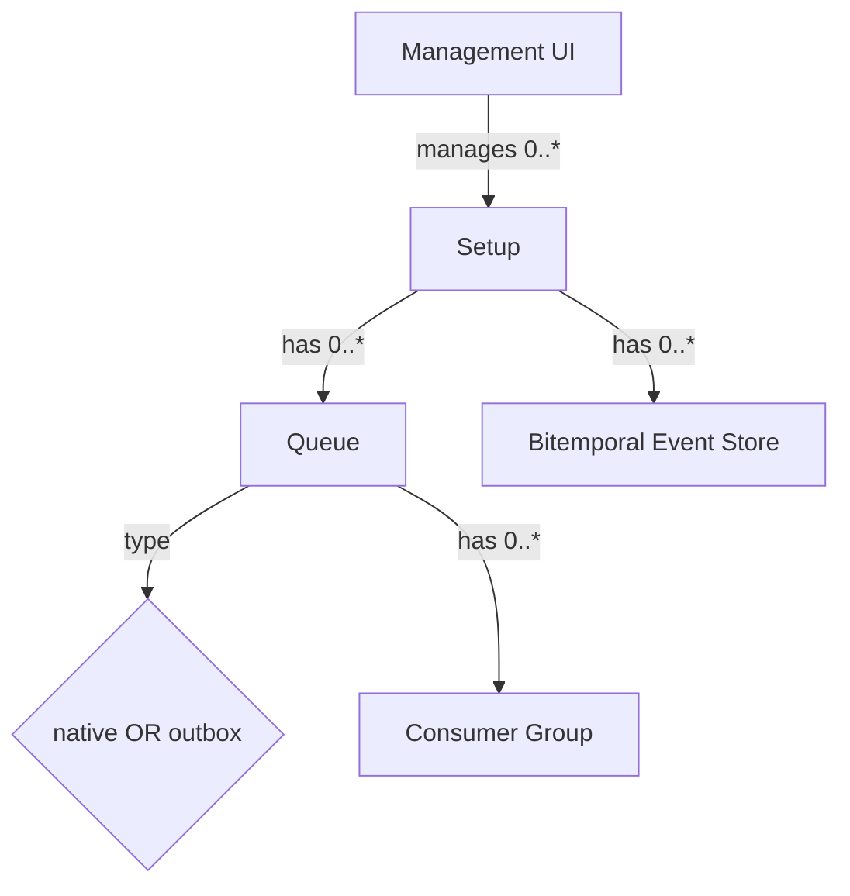

# Enhancement: Setup / Queue Scope Selectors on Every Page

Status: Implemented

> **Implementation notes (2026-06):** All 8 pages wired. `SetupSelector`, `QueueSelector`, and `SetupScopeBar` merged into a single `SetupScopeBar.tsx`. `ConsumerGroups.tsx` create-modal now loads real setup IDs from the API and pre-fills from the active selection. Events and Visualization pages have dual selectors (SetupScopeBar + legacy inline selector, both driving the same store state). Known gap: Events/Visualization legacy inline selectors (`query-setup-select`, `viz-setup-select`) can be removed once the optional store-migration follow-up (items 6-7) is done.
Module: `peegeeq-management-ui`
Author: Engineering
Date: 2026-06-01

## Summary

Add a persistent **Setup dropdown** to every page in the Management UI, plus a
dependent **Queue dropdown** on pages whose concept is queue-scoped (Consumer
Groups, Message Browser). The selected setup (and queue) is stored globally so it
carries across navigation and page reloads, and each page filters its data by the
active selection.

## Motivation

The PeeGeeQ domain is hierarchical, but the current UI is flat — every concept is
a sibling top-level page, and each page fetches a global list across all setups,
showing the owning setup only as a small tag column. The containment hierarchy is
not expressed in the layout.

### Domain hierarchy

- The **UI** manages **0..\* Setups** — these appear in the Setups list.
- A **Setup** has **0..\* Queues** (each queue is either **native** or **outbox**).
- A **Setup** has **0..\* Bitemporal Event Stores**.
- A **Queue** has **0..\* Consumer Groups**.

So **Setup is the top-level container**. Queues and Event Stores belong to a
setup; Consumer Groups belong to a queue.

## Requirements

- Every page — including System Overview — has either:
  - a **Setup** dropdown, or
  - a **Setup + Queue** dropdown (for queue-scoped pages).
- The selection persists across page navigation and browser reload.
- Queue dropdown lists only the queues of the currently selected setup, and is
  disabled until a setup is chosen.

## Page selector matrix

| Page | Selector |
| --- | --- |
| Overview | Setup |
| Queues | Setup |
| Event Stores | Setup |
| Events | Setup (+ Event Store) — already implemented, see Reference implementation |
| Visualization | Setup |
| Consumer Groups | Setup + Queue |
| Message Browser | Setup + Queue |
| Database Setups | none (this page is the setup list itself) |

## Reference implementation (already in the codebase)

The **Events** page (`src/pages/EventsPage.tsx`, "Query Events" card) already
implements the desired selector pattern and should be the template the shared
components are extracted from:

- A setup `Select` — `data-testid="query-setup-select"`, `allowClear`, value
  driven by `selectedSetup`.
- A dependent `Select` — `data-testid="query-eventstore-select"`, `disabled` until
  a setup is chosen, `allowClear`.
- Cascade-clear: changing the setup resets the dependent selection and clears the
  loaded data (`onChange={(value) => { setSelectedSetup(value); setSelectedEventStore(''); setEvents([]) }}`).
- Dependent options filtered by the selected setup
  (`eventStores.filter(store => store.setupId === selectedSetup)`).

Two deltas to generalize when extracting the shared components:

1. The Events page keeps selection in **local component state**; the shared
   version moves it to the **global persisted store** so it carries across pages.
2. The Events page's dependent dropdown is **Event Store**; the queue-scoped pages
   need a **Queue** dropdown instead. The selector mechanics are identical — only
   the data source and label differ.

## Design

### State

Extend the existing Zustand `managementStore` with shared selection state,
persisted to `localStorage` so the chosen setup/queue survives page changes and
refresh:

- `selectedSetupId: string | null`
- `selectedQueueName: string | null`
- `setSelectedSetup(setupId)` — clearing the setup also clears the queue
- `setSelectedQueue(queueName)`

### Components (new, under `src/components/common/`)

- **`SetupSelector`** — fetches `GET /setups` (the `setupIds` array), renders an
  Ant `Select`, writes to the store. Includes an "All setups" option for pages
  that can show an aggregate (e.g. Overview).
- **`QueueSelector`** — depends on the selected setup; fetches that setup's queues
  via `GET /setups/{setupId}` (`queueFactories`) and renders a second `Select`.
  Disabled until a setup is chosen.
- **`SetupScopeBar`** — thin toolbar that renders either `SetupSelector` alone or
  `SetupSelector + QueueSelector`, dropped at the top of each page.

### Data sources (existing endpoints, reused)

- `GET /setups` → `{ setupIds: string[] }`
- `GET /setups/{setupId}` → `{ queueFactories: [...], eventStores: [...], status }`

## Implementation steps

1. **Selection store** — add `selectedSetupId`, `selectedQueueName`,
   `setSelectedSetup()`, `setSelectedQueue()` to `managementStore.ts`, with
   `localStorage` persistence. Clearing the setup clears the queue.
2. **Setups data hook** — small hook/service to fetch the setup list and a
   setup's queues (reuse the `GET /setups` + `GET /setups/{setupId}` calls already
   used in `DatabaseSetups.tsx` and `Queues.tsx`). *Depends on step 1.*
3. **Reusable components** — create `SetupSelector`, `QueueSelector`,
   `SetupScopeBar`. *Depends on steps 1–2.*
4. **Wire setup-only pages** — Overview, Queues, Event Stores, Events,
   Visualization: add `SetupScopeBar` (setup mode) and filter fetch/render by
   `selectedSetupId`. *Parallel per page, depends on step 3.*
5. **Wire setup + queue pages** — Consumer Groups, Message Browser: add
   `SetupScopeBar` (setup+queue mode) and filter by `selectedSetupId` +
   `selectedQueueName`. *Parallel per page, depends on step 3.*
6. **Database Setups page** — no selector; leave as-is.
7. **Tests** — update affected Playwright page objects/specs (add selector
   test-ids) and add a spec asserting the selector appears and filters.

## Page-by-page plan

### Shared prerequisites (do first)

- **P0a — Store** — extend `managementStore` with `selectedSetupId`,
  `selectedQueueName`, `setSelectedSetup` (clears queue), `setSelectedQueue`,
  persisted to `localStorage`.
- **P0b — Components** — build `SetupSelector`, `QueueSelector` (fetches queues
  for the selected setup), and `SetupScopeBar` (renders setup-only or
  setup+queue), reading/writing the store. Auto-select when exactly one
  setup/queue exists.

### Per page

| # | Page | Current state | Work |
| --- | --- | --- | --- |
| 1 | **Overview** (`Overview.tsx`) | No selector; global `fetchSystemData`/`fetchQueues` | Add `SetupScopeBar` (setup-only, "All setups" default). Scope queue table + stats to the selected setup; "All setups" keeps the aggregate. |
| 2 | **Queues** (`QueuesEnhanced.tsx`) | Global RTK `useGetQueuesQuery`; setup only chosen in create-modal | Add `SetupScopeBar` (setup-only). Pass `selectedSetupId` into the query filter (`filters.setupId`). |
| 3 | **Event Stores** (`EventStores.tsx`) | Global `management/event-stores`; setup only in create-modal | Add `SetupScopeBar` (setup-only). Filter `eventStores` by `selectedSetupId`. |
| 4 | **Consumer Groups** (`ConsumerGroups.tsx`) | Global `management/consumer-groups`; "Setup" select only in create-modal; no top-level scope selector | Add `SetupScopeBar` (setup + queue). Filter groups by `selectedSetupId` + `selectedQueueName`. Pre-fill the create-modal from the active selection. |
| 5 | **Message Browser** (`MessageBrowser.tsx`) | Has local `selectedSetup`/`selectedQueue` + filtering, but pickers live in a filter drawer | Replace drawer's setup/queue pickers with `SetupScopeBar` (setup + queue) wired to the store; keep type/status/date filters in the drawer. |
| 6 | **Events** (`EventsPage.tsx`) | Already has setup + event-store selectors (local state) | Optional later: migrate local state -> store. No functional change required now. |
| 7 | **Visualization** (`EventVisualizationPage.tsx`) | Already has `viz-setup-select` + `viz-eventstore-select` (local state) | Optional later: migrate local state -> store. No functional change required now. |
| 8 | **Database Setups** (`DatabaseSetups.tsx`) | The setup list itself | No selector. Leave as-is. |

### Sequencing & parallelism

P0a -> P0b first. Then pages 1-5 are independent and can be done in any order
(each is an isolated page edit). Pages 6-7 are optional store-migration
follow-ups. Page 8 is no-op.

Per-page verification: after each page, `npm run build` (tsc) clean and the page
renders the dropdown(s) and filters correctly. Final gate: the full `-Pall-tests`
E2E run.

## Affected files

- `src/stores/managementStore.ts` — add selection state + persistence
- `src/components/common/SetupSelector.tsx` — new
- `src/components/common/QueueSelector.tsx` — new
- `src/components/common/SetupScopeBar.tsx` — new
- `src/pages/Overview.tsx`, `QueuesEnhanced.tsx`, `EventStores.tsx`,
  `EventsPage.tsx`, `EventVisualizationPage.tsx` — setup selector + filtering
- `src/pages/ConsumerGroups.tsx`, `MessageBrowser.tsx` — setup + queue selector +
  filtering
- `src/services/configService.ts` — reuse `getVersionedApiUrl` for setup/queue
  fetches
- `src/tests/e2e/page-objects/*`, `src/tests/e2e/specs/*` — add test-ids/assertions

## Decisions

- Per-page `SetupScopeBar` (not a header-global selector), because the two
  queue-scoped pages need an extra dropdown that doesn't belong on other pages.
- Selection is global + persisted, so the chosen setup/queue follows the user
  across pages.
- Database Setups page itself gets no selector.

## Open considerations

1. **Overview with no setup selected** — (A) show aggregate across all setups (add
   "All setups" default), or (B) require a setup and show empty until chosen.
   *Recommended: A.*
2. **Events / Visualization scoping** — these relate to *event stores*, not queues.
   (A) Setup dropdown only (matches the "setup or setup+queue" rule), or (B) Setup +
   Event Store dropdown. *Recommended: A.*
3. **Auto-select** — when only one setup exists (common in tests), auto-select it
   so pages aren't empty. *Recommended: yes.*

## Verification

1. `npm run build` (tsc) in `peegeeq-management-ui` passes with no type errors.
2. Manual: every page shows a Setup dropdown; Consumer Groups and Message Browser
   also show a Queue dropdown that only lists the selected setup's queues and is
   disabled until a setup is picked.
3. Selecting a setup on one page and navigating to another keeps the selection;
   reload keeps it (localStorage).
4. `mvn test -pl :peegeeq-management-ui -Pall-tests` — E2E suite green.
   (`peegeeq-utilities-ui` is unrelated; `:peegeeq-management-ui` is the correct
   module selector for this project.)
