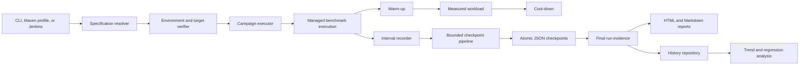

# PeeGeeQ Benchmarking Enhancement Implementation Plan

| Field | Value |
|---|---|
| Status | PROPOSED — NOT IMPLEMENTED |
| Last updated | 17 September 2026 |
| Target module | `peegeeq-benchmarking` |
| Delivery method | Test-driven development, one verified phase at a time |

## 1. Purpose

This plan evolves `peegeeq-benchmarking` from a collection of consolidated performance tests and utility classes into a repeatable benchmarking system. The completed system will run individual workloads or campaigns, capture the execution environment and hardware automatically, retain crash-safe machine-readable evidence, produce human-readable reports, and support defensible comparisons over time.

The plan is informed by a completed capability review of mature Java benchmark harnesses. Every proposed capability has been adapted to PeeGeeQ's reactive architecture, PostgreSQL-backed messaging model, Maven profiles, Jenkins pipeline, and testing rules.

This document is the implementation authority for the enhancement. It does not claim that the proposed features already exist.

## 2. Current Baseline

The new module already provides a useful foundation:

- the performance workloads are isolated from the product modules;
- 25 performance-tagged workload classes cover native queues, outbox, bi-temporal storage, fan-out, backfill, REST, and partitioned consumption;
- OSHI-based hardware discovery captures detailed host characteristics;
- runtime sampling can capture CPU, memory, JVM, disk, network, load, and thread observations;
- metrics snapshots, comparisons, H2 history support, and history analysis classes exist;
- Jenkins can run the performance suite and the partitioned-consumption release gate;
- Jenkins archives logs, host observations, Surefire reports, and generated performance-result files; and
- the partitioned-consumption gate already produces JSON and Markdown evidence.

The baseline does not yet provide a uniform benchmark lifecycle. Most workloads still construct, execute, record, and report measurements independently.

## 3. Findings to Address

| ID | Finding | Consequence |
|---|---|---|
| GAP-01 | Hardware and runtime observations are not automatically attached to every benchmark run. | Results can be retained without the context needed to compare them safely. |
| GAP-02 | Hardware-aware persistence is not part of the normal execution path. | The storage feature exists but does not guarantee retained evidence. |
| GAP-03 | The history schema declares a Git commit field, but normal inserts do not populate it. | Historical results lack source provenance. |
| GAP-04 | There is no canonical immutable benchmark specification or run-evidence model. | Each workload defines different metadata and output semantics. |
| GAP-05 | There are no benchmark-specific command-line entry points or focused execution profiles. | Automation depends on test-class knowledge and ad hoc properties. |
| GAP-06 | Warm-up, measurement, and cool-down phases are not standardized. | Measurements may include startup effects or omit cleanup observations. |
| GAP-07 | Interval telemetry and latency distributions are not standardized. | Averages can conceal stalls, tail latency, and instability. |
| GAP-08 | There is no campaign executor for parameter matrices, repetitions, or deterministic run ordering. | Comparative studies require manual orchestration and are difficult to reproduce. |
| GAP-09 | Measurement overhead is not calibrated. | The harness can materially distort short or high-throughput workloads. |
| GAP-10 | There is no atomic per-run checkpoint writer or bounded asynchronous checkpoint pipeline. | Process interruption can lose the only useful evidence or exhaust memory during a long run. |
| GAP-11 | Interrupted runs are not discovered and classified on the next execution. | Partial evidence is easy to overlook or misinterpret as final. |
| GAP-12 | There is no self-contained HTML evidence report. | Reviewing a run requires reading raw logs or several separate artifacts. |
| GAP-13 | Target capabilities, deployment identity, and target verification are not represented uniformly. | Unsupported observations and unsuitable targets can produce ambiguous failures. |
| GAP-14 | Retry, persistence, and managed-execution policies are not centralized. | Workloads can use inconsistent failure and cleanup behavior. |
| GAP-15 | Trend and regression analysis is isolated from the normal run lifecycle. | Historical comparison is optional instead of an automatic outcome. |
| GAP-16 | Git state, JVM arguments, toolchain, database identity, and container identity are not captured for every run. | Results cannot always be traced to the executable inputs that produced them. |
| GAP-17 | One example reports illustrative throughput and latency values that were not measured by that execution. | Synthetic values could be mistaken for benchmark evidence. |

## 4. Goals

The enhancement will provide:

1. One immutable specification for every benchmark invocation.
2. One immutable evidence model shared by all workloads.
3. Automatic environment, hardware, source, JVM, database, and container provenance.
4. Standard warm-up, measurement, and cool-down phases.
5. Standard interval telemetry, work counts, error counts, and latency distributions.
6. Crash-safe checkpoints throughout long-running measurements.
7. Explicit classification of completed, failed, aborted, invalid, and recovered runs.
8. Reproducible campaigns with a resolved manifest, parameter matrices, and repetitions.
9. Calibration of workload-generator and measurement-recorder overhead.
10. JSON as the canonical evidence format, with HTML and Markdown derived from it.
11. Automatic history persistence, comparison, and configurable regression assessment.
12. Direct Maven, command-line, and Jenkins entry points.
13. Migration of every existing performance workload to the common lifecycle.

## 5. Non-Goals

- No benchmark implementation code will be added to PeeGeeQ production modules.
- The benchmarking module will not become a runtime dependency of any product module.
- Performance thresholds will not be presented as universal guarantees across different hardware.
- Missing observations will not be represented as zero.
- Failed, interrupted, or invalid runs will not be included in a successful baseline silently.
- PostgreSQL behavior will not be simulated for database-bound benchmarks.
- Tests will not use mocking frameworks or blocking concurrency bridges.
- The work will not replace Java Microbenchmark Harness for isolated nanosecond-scale method benchmarking. This harness is for system and component behavior under realistic PeeGeeQ workloads.

## 6. Target Architecture



The JSON run evidence is the source of truth. Human-readable reports, persisted summaries, and CI decisions must be derived from it rather than independently reconstructed from console output.

## 7. Proposed Package Structure

All new types will live under `dev.mars.peegeeq.benchmark` so the new lifecycle can coexist with the currently migrated utilities while workloads are converted incrementally.

```text
dev.mars.peegeeq.benchmark
├── model
│   ├── BenchmarkSpecification
│   ├── BenchmarkRunEvidence
│   ├── BenchmarkRunStatus
│   ├── BenchmarkValidity
│   ├── BenchmarkDiagnostic
│   ├── BenchmarkInterval
│   ├── BenchmarkLatencyDistribution
│   └── BenchmarkWorkCounts
├── environment
│   ├── BenchmarkEnvironmentCapture
│   ├── BenchmarkEnvironment
│   ├── BenchmarkSourceProvenance
│   ├── BenchmarkTargetIdentity
│   └── BenchmarkCapabilityInventory
├── execution
│   ├── BenchmarkWorkload
│   ├── BenchmarkExecutionContext
│   ├── BenchmarkManagedExecution
│   ├── BenchmarkPhasePlan
│   ├── BenchmarkWorkloadScheduler
│   ├── BenchmarkRetryPolicy
│   └── BenchmarkPersistencePolicy
├── measurement
│   ├── BenchmarkIntervalRecorder
│   ├── BenchmarkLatencyRecorder
│   ├── BenchmarkResourceSampler
│   └── BenchmarkOverheadCalibration
├── evidence
│   ├── BenchmarkRunJsonWriter
│   ├── BenchmarkCheckpointWriter
│   ├── BenchmarkCheckpointPipeline
│   ├── BenchmarkCheckpointRecovery
│   ├── BenchmarkHtmlReportWriter
│   └── BenchmarkMarkdownReportWriter
├── campaign
│   ├── BenchmarkCampaignPlan
│   ├── BenchmarkCampaignManifest
│   ├── BenchmarkCampaignExecutor
│   └── BenchmarkCampaignRunner
├── target
│   ├── BenchmarkTargetVerifier
│   ├── PostgreSqlBenchmarkTargetVerifier
│   └── BenchmarkDeploymentIdentityResolver
├── analysis
│   ├── BenchmarkBaselineSelector
│   ├── BenchmarkTrendAnalyzer
│   ├── BenchmarkRegressionPolicy
│   └── BenchmarkAnalysisPublisher
└── cli
    ├── PeeGeeQBenchmarkMain
    ├── PeeGeeQBenchmarkCampaignMain
    ├── PeeGeeQBenchmarkCalibrationMain
    └── PeeGeeQBenchmarkReportMain
```

Names may change during implementation when an existing PeeGeeQ abstraction already expresses the same concept. The responsibilities and evidence contracts must remain intact.

## 8. Canonical Data Contracts

### 8.1 Benchmark specification

`BenchmarkSpecification` will be immutable and will contain at least:

- schema version;
- benchmark and scenario identifiers;
- workload type and adapter version;
- message count, payload size, concurrency, batch size, and rate limits;
- warm-up, measurement, and cool-down durations;
- interval duration;
- number of repetitions;
- random seed and resolved run order;
- target connection identity with secrets removed;
- retry and persistence policy identifiers;
- required and optional capabilities;
- threshold policy name;
- output location; and
- arbitrary typed workload parameters.

Validation must reject contradictory, missing, negative, or unsafe settings before resources are created.

### 8.2 Run evidence

`BenchmarkRunEvidence` will be immutable and versioned. It will contain:

- a unique run identifier;
- specification and specification hash;
- start, checkpoint, and completion timestamps;
- lifecycle status and validity classification;
- captured environment and target identity;
- source commit, branch, working-tree state, and sanitized remote identity;
- Java runtime, JVM arguments, Maven/toolchain, OS, architecture, and processor data;
- physical memory, effective process/container limits, and storage data;
- database version and material server settings;
- container runtime and image identity when applicable;
- interval measurements;
- aggregate throughput, work counts, errors, and latency distributions;
- calibration results and calculated observer overhead;
- diagnostics and capability limitations;
- baseline and regression-analysis output;
- finalization state; and
- evidence checksum.

### 8.3 Status and validity

Execution status and evidence validity are separate dimensions.

Execution status:

- `CREATED`
- `VERIFYING`
- `WARMING_UP`
- `MEASURING`
- `COOLING_DOWN`
- `COMPLETED`
- `FAILED`
- `ABORTED`
- `RECOVERED`

Evidence validity:

- `VALID`
- `VALID_WITH_LIMITATIONS`
- `INVALID_CONFIGURATION`
- `INVALID_TARGET`
- `INVALID_CALIBRATION`
- `INVALID_MEASUREMENT`
- `INCOMPLETE`

A completed execution is not automatically valid. Regression decisions may use only evidence accepted by the configured validity policy.

### 8.4 Interval and latency data

Each measurement interval will retain:

- monotonic interval boundaries and wall-clock timestamps;
- offered, accepted, completed, failed, retried, and timed-out work counts;
- achieved rate and backlog;
- latency count, minimum, maximum, mean, and configured percentiles;
- CPU, process CPU, heap, non-heap, resident memory, thread, disk, network, and load observations when available;
- event-loop or scheduler delay where applicable; and
- diagnostics explaining unavailable observations.

Latency distributions must use a bounded recorder suitable for concurrent writers. Reports must retain enough distribution data to recompute the published percentiles without parsing logs.

## 9. Hardware and Provenance Requirements

Hardware capture will become part of the benchmark lifecycle rather than an opt-in helper.

1. Capture stable environment attributes once before target verification.
2. Capture run-specific JVM and source provenance for every invocation.
3. Start resource sampling before warm-up and identify the phase for every sample.
4. Calculate headline performance metrics from the measurement phase only.
5. Retain warm-up and cool-down observations for diagnosis.
6. Record both host resources and effective container/process limits when they differ.
7. Record PostgreSQL identity and material settings used by the workload.
8. Record image digests or equivalent immutable container identity when containers are used.
9. Emit an explicit diagnostic when an observation cannot be obtained.
10. Compute a hardware fingerprint from stable attributes without including secrets or volatile usage.
11. Prevent automatic cross-hardware regression decisions unless the policy explicitly allows them.
12. Allow a deliberately supplied comparison group for known-equivalent CI agents.

The existing `HardwareProfiler`, `SystemResourceMonitor`, `HardwareProfile`, and `ResourceUsageSnapshot` will be adapted behind the new contracts rather than duplicated.

## 10. Workload Contract

Every workload will implement a common asynchronous contract with these responsibilities:

- declare its identifier, parameters, and required capabilities;
- create real resources during setup;
- perform a bounded warm-up;
- execute measured work and publish observations through the execution context;
- stop offering new work at the measurement boundary;
- drain accepted work according to its persistence policy;
- verify final counts and invariants;
- release resources; and
- surface setup, execution, verification, and cleanup failures.

The lifecycle coordinator owns phase transitions, evidence checkpoints, timing, and finalization. A workload must not write its own authoritative result document.

Initial adapters will cover:

- native queue producer and consumer workloads;
- transactional outbox workloads;
- bi-temporal event-store workloads;
- fan-out and backfill workloads;
- REST workloads;
- consumer-mode comparisons; and
- partitioned-consumption release scenarios.

Existing workload implementations will be wrapped first, then simplified after parity tests prove the adapter preserves their observable behavior.

## 11. Evidence and Recovery Guarantees

### 11.1 Output layout

Each execution will use an isolated directory:

```text
peegeeq-benchmarking/target/performance-results/
└── <build-identity>/
    └── <run-id>/
        ├── specification.json
        ├── environment.json
        ├── checkpoint-000001.json
        ├── checkpoint-000002.json
        ├── run.json
        ├── report.html
        ├── report.md
        └── diagnostics.log
```

Campaign output will add a resolved campaign manifest and an index linking every run.

### 11.2 Atomic writes

The checkpoint writer will:

- serialize a complete checkpoint to a file in the destination directory;
- flush and close the file successfully;
- replace the visible checkpoint using an atomic filesystem operation when supported;
- fall back to a validated replacement strategy with an explicit diagnostic otherwise;
- retain earlier numbered checkpoints until the final run is complete; and
- never publish a partially serialized file under a final name.

### 11.3 Bounded checkpoint pipeline

Long runs must not accumulate unlimited pending evidence. The pipeline will have configurable limits for pending item count and pending serialized bytes. When capacity is exhausted, it will apply the configured policy, record the event, and preserve run validity semantics. Silent loss is prohibited.

Pipeline closure must wait asynchronously for accepted checkpoints to finish, reject new submissions, and surface persistence failures to the owning execution.

### 11.4 Recovery

At startup, recovery will inspect non-final run directories and classify them as:

- finalized and already complete;
- recoverable but unfinalized;
- corrupt or internally inconsistent; or
- abandoned before useful evidence was written.

Recovery will not rewrite a run as successful. It will produce a recovery record and an owner-visible diagnostic. Recovered evidence remains distinguishable from normally finalized evidence.

## 12. Campaigns and Calibration

### 12.1 Campaigns

A campaign is a reproducible set of resolved benchmark specifications. The campaign layer will support:

- parameter matrices;
- include and exclude rules;
- repetitions;
- fixed or seeded randomized ordering;
- per-run and campaign-wide time budgets;
- stop-on-invalid and continue-on-failure policies;
- target reuse where safe;
- a manifest containing every resolved run before execution begins; and
- resumable execution that never silently repeats a completed run.

The manifest is immutable after the first run starts. Any change produces a new campaign identity.

### 12.2 Calibration

Calibration will measure harness overhead independently from product throughput. It will cover:

- workload scheduling overhead;
- timestamp and latency-recorder overhead;
- interval aggregation overhead;
- resource-sampling overhead;
- checkpoint serialization and persistence overhead; and
- a forked-JVM run using controlled heap and JVM arguments.

Calibration results will be attached to each compatible run or referenced by immutable identity. A run becomes invalid when its required calibration is missing, incompatible, or beyond the configured overhead limit.

## 13. Analysis and Regression Policy

The existing history and comparison classes will be brought into the normal completion path.

The completed analysis pipeline will:

1. persist only finalized evidence;
2. populate source commit and all other declared schema fields;
3. select comparable baselines by benchmark, scenario, configuration hash, target class, and hardware fingerprint;
4. compare throughput, error rate, and configured latency percentiles;
5. require a minimum number of valid samples before making a gating decision;
6. distinguish informational variation from a policy violation;
7. retain both the raw comparison and the decision policy;
8. reject comparisons across incompatible specifications; and
9. publish the analysis into JSON, HTML, Markdown, and Jenkins artifacts.

Thresholds will be benchmark-specific and version-controlled. No single percentage threshold will be applied indiscriminately to all workloads.

## 14. Command-Line, Maven, and Jenkins Interfaces

### 14.1 Command-line entry points

The module will expose separate commands for:

- one benchmark run;
- a resolved campaign;
- overhead calibration;
- report regeneration from existing JSON evidence; and
- inspection and classification of interrupted runs.

Every command will support a validation-only mode that resolves configuration and verifies the target without starting measured work.

### 14.2 Maven profiles

The existing `performance-tests` profile remains the JUnit performance suite. Focused module profiles will be added for executable operations:

- `benchmark-run`
- `benchmark-campaign`
- `benchmark-calibration`
- `benchmark-report`

Profile properties must map to a documented specification file or a small, explicit set of overrides. Jenkins must archive the resolved specification so the effective execution never depends on unrecorded command-line state.

### 14.3 Jenkins suites

Jenkins will expose these intentional modes:

| Suite | Purpose | Gate behavior |
|---|---|---|
| `performance-smoke` | Short lifecycle and evidence validation | Gating |
| `performance` | Existing workload coverage with retained evidence | Gating on correctness; performance informational initially |
| `performance-calibration` | Agent and recorder calibration | Gating on calibration validity |
| `performance-campaign` | Parameterized comparative study | Configurable |
| `partitioned-release` | Long-running partitioned-consumption release evidence | Gating |

Each suite will:

- run serially on an explicitly identified agent;
- use a suite-specific timeout;
- capture environment and target evidence before measured work;
- archive partial evidence even when the build fails or is interrupted;
- publish JUnit results separately from benchmark validity;
- publish the HTML report in Jenkins;
- retain JSON and the campaign manifest indefinitely according to the job policy; and
- make the final evidence path prominent in the console summary.

## 15. TDD and Verification Rules

Every phase follows red, green, refactor:

1. Add the smallest test that expresses the missing observable behavior.
2. Run that test and retain the expected failure output.
3. Implement the smallest production change that satisfies the test.
4. Rebuild the affected reactor slice.
5. Run the smallest relevant test scope.
6. Inspect per-class test counts and failures in the saved Maven log.
7. Refactor only while the focused tests remain green.
8. Run the complete `peegeeq-benchmarking` core suite for the phase.
9. Run the relevant performance scenario on Jenkins when real infrastructure or duration is material.
10. Update this plan's checklist and attach evidence before starting the next phase.

Mandatory test approach:

- use real implementations and lightweight purpose-built failure fixtures;
- use Testcontainers for PostgreSQL behavior;
- verify JSON by deserializing the written artifact;
- verify atomic persistence with real temporary directories and filesystem operations;
- exercise cleanup failures and combined execution/cleanup failures;
- verify asynchronous results with Vert.x test context patterns already established in the module;
- use deterministic clocks, seeds, and sample sources where time or operating-system observations would make a unit test unstable;
- reserve live hardware assertions for integration or performance profiles; and
- do not use blocking waits, timing sleeps, or mocked database connections.

After every Java or Maven change, rebuild before focused verification:

```powershell
mvn clean install -DskipTests -pl :peegeeq-benchmarking -am 2>&1 |
    Tee-Object -FilePath logs\benchmarking-phase-build.log
```

Run a focused core class without a profile:

```powershell
mvn test -pl :peegeeq-benchmarking -am -Dtest=BenchmarkRunJsonWriterTest 2>&1 |
    Tee-Object -FilePath logs\benchmarking-focused-core.log
```

Run a focused performance class with the performance profile:

```powershell
mvn test -Pperformance-tests -pl :peegeeq-benchmarking -am -Dtest=PeeGeeQPerformanceTest 2>&1 |
    Tee-Object -FilePath logs\benchmarking-focused-performance.log
```

The approximately 90-minute all-tests suite remains an explicitly requested release gate, not a normal phase loop.

## 16. Implementation Phases

### Phase 0 — Baseline Integrity and Synthetic-Result Remediation

**Objective:** Establish an honest, versioned baseline before adding new behavior.

Tasks:

- [ ] `BENCH-001` Inventory every performance-tagged class and map it to a workload category, infrastructure requirement, parameters, outputs, and assertions.
- [ ] `BENCH-002` Record the current core and performance test counts as migration controls.
- [ ] `BENCH-003` Convert the hard-coded performance-results example into an explicitly named synthetic serialization fixture, or remove it if it has no unique coverage.
- [ ] `BENCH-004` Add a repository check that prevents synthetic values from being published in the performance-results artifact tree.
- [ ] `BENCH-005` Add `schemaVersion` to all existing retained benchmark evidence.
- [ ] `BENCH-006` Add an evidence fixture policy distinguishing measured, synthetic, and recovered data.

Acceptance criteria:

- every existing workload appears once in the inventory;
- no example output can be confused with measured evidence;
- existing functionality and test counts are preserved; and
- the module's core suite is green.

### Phase 1 — Immutable Specification and Evidence Model

**Objective:** Create the common contracts without changing workload execution.

Tests first:

- specification validation and canonical hashing;
- immutable collection behavior;
- JSON round-trip compatibility;
- status transition legality;
- separation of execution status from evidence validity;
- forward-compatible unknown diagnostic fields; and
- secret redaction.

Tasks:

- [ ] `BENCH-101` Implement `BenchmarkSpecification` and validation.
- [ ] `BENCH-102` Implement run status, validity, diagnostic, interval, latency, and work-count value types.
- [ ] `BENCH-103` Implement `BenchmarkRunEvidence` with a versioned JSON contract.
- [ ] `BENCH-104` Define canonical serialization and specification hashing.
- [ ] `BENCH-105` Publish JSON schema examples under module test resources.

Acceptance criteria:

- invalid specifications fail before any external resource is acquired;
- secrets never appear in serialization or diagnostics;
- evidence can be serialized, deserialized, and compared deterministically; and
- no existing performance workload has been migrated yet.

### Phase 2 — Environment, Hardware, and Target Provenance

**Objective:** Attach complete environment evidence to every future execution.

Tests first:

- stable hardware fingerprinting;
- absent observation diagnostics;
- Git clean and dirty state representation;
- sanitized remote identity;
- JVM argument capture;
- container-limit precedence over host capacity;
- PostgreSQL identity and setting capture using Testcontainers; and
- compatibility classification between two environments.

Tasks:

- [ ] `BENCH-201` Adapt the existing OSHI hardware profiler into `BenchmarkEnvironmentCapture`.
- [ ] `BENCH-202` Capture Java runtime, JVM arguments, toolchain, operating system, and architecture.
- [ ] `BENCH-203` Capture source commit, branch, working-tree state, and sanitized remote identity.
- [ ] `BENCH-204` Capture host capacity and effective container/process limits.
- [ ] `BENCH-205` Implement PostgreSQL version and material-setting capture.
- [ ] `BENCH-206` Implement target and deployment identity.
- [ ] `BENCH-207` Define hardware and environment comparison compatibility.

Acceptance criteria:

- a generated environment document explains every unavailable field;
- no credential, token, or connection password is retained;
- hardware fingerprints are stable across repeated capture on one unchanged host; and
- Testcontainers evidence identifies the actual PostgreSQL instance used.

### Phase 3 — Measurement Lifecycle and Calibration

**Objective:** Standardize phases, interval telemetry, latency distributions, and observer-overhead checks.

Tests first:

- legal phase progression;
- monotonic interval boundaries;
- work-count conservation;
- percentile accuracy against known distributions;
- concurrent latency recording;
- missing sample handling;
- phase-aware resource aggregation;
- calibration compatibility; and
- invalidation when overhead exceeds policy.

Tasks:

- [ ] `BENCH-301` Implement phase plans and lifecycle transitions.
- [ ] `BENCH-302` Implement bounded latency distribution recording.
- [ ] `BENCH-303` Implement interval and work-count recording.
- [ ] `BENCH-304` Adapt the existing resource monitor to phase-labelled samples.
- [ ] `BENCH-305` Implement scheduler, recorder, sampling, and persistence calibration.
- [ ] `BENCH-306` Add a controlled forked-JVM calibration entry point.
- [ ] `BENCH-307` Attach calibration identity and validity to run evidence.

Acceptance criteria:

- headline results exclude warm-up and cool-down work;
- interval totals reconcile with aggregate totals;
- percentile output is backed by retained distribution data; and
- calibration can invalidate a measurement without misclassifying the execution as failed.

### Phase 4 — Durable Evidence, Checkpointing, and Recovery

**Objective:** Preserve useful evidence through failures and interruptions.

Tests first:

- atomic checkpoint replacement;
- serializer failure propagation;
- destination failure propagation;
- bounded item and byte capacity;
- close-and-drain behavior;
- rejection after closure;
- ordering of accepted checkpoints;
- discovery of partial runs;
- corruption classification;
- finalization idempotency; and
- HTML and Markdown generation solely from JSON evidence.

Tasks:

- [ ] `BENCH-401` Implement atomic JSON writing.
- [ ] `BENCH-402` Implement numbered checkpoint persistence.
- [ ] `BENCH-403` Implement the bounded asynchronous checkpoint pipeline.
- [ ] `BENCH-404` Implement interrupted-run discovery and classification.
- [ ] `BENCH-405` Implement final evidence checksums and idempotent finalization.
- [ ] `BENCH-406` Implement self-contained HTML evidence reports.
- [ ] `BENCH-407` Implement Markdown summary generation.

Acceptance criteria:

- forced termination after any completed checkpoint leaves readable evidence;
- persistence failure fails or invalidates the owning run according to policy;
- memory use is bounded by declared pipeline limits;
- final reports contain no values absent from the canonical JSON; and
- recovery never upgrades incomplete evidence to a normal success.

### Phase 5 — Managed Execution, Capabilities, and Target Verification

**Objective:** Give every workload the same safe setup, execution, verification, and cleanup behavior.

Tests first:

- setup failure cleanup;
- workload failure propagation;
- verification failure classification;
- cleanup failure visibility;
- combined primary and cleanup diagnostics;
- capability-supported, unsupported, and observation-unavailable outcomes;
- retry classification and limits;
- persistence/drain semantics; and
- target rejection before measured work.

Tasks:

- [ ] `BENCH-501` Define the workload and execution-context contract.
- [ ] `BENCH-502` Implement managed execution and resource ownership.
- [ ] `BENCH-503` Implement capability inventory and validation.
- [ ] `BENCH-504` Implement PostgreSQL target verification.
- [ ] `BENCH-505` Implement explicit retry and persistence policies.
- [ ] `BENCH-506` Implement workload scheduling and coordinated drain.
- [ ] `BENCH-507` Connect lifecycle events to checkpoint creation.

Acceptance criteria:

- every accepted asynchronous operation is observed;
- every acquired resource has deterministic cleanup;
- a missing optional capability produces a limitation, not a false measurement;
- a missing required capability prevents the run; and
- failure evidence preserves the original cause plus cleanup diagnostics.

### Phase 6 — Campaign Planning and Execution

**Objective:** Execute reproducible parameter studies without manual orchestration.

Tests first:

- matrix expansion;
- include and exclude rules;
- deterministic seeded ordering;
- stable campaign hashing;
- manifest immutability;
- repetition identity;
- campaign timeout behavior;
- stop and continue policies; and
- resume without duplicate successful runs.

Tasks:

- [ ] `BENCH-601` Implement campaign plan parsing and validation.
- [ ] `BENCH-602` Resolve plans into immutable manifests.
- [ ] `BENCH-603` Implement deterministic run ordering and repetitions.
- [ ] `BENCH-604` Implement sequential campaign execution.
- [ ] `BENCH-605` Implement safe target reuse rules.
- [ ] `BENCH-606` Implement campaign resume and index generation.

Acceptance criteria:

- the complete run set is knowable before execution begins;
- identical inputs and seed produce the same manifest;
- a resumed campaign does not silently rerun completed evidence; and
- every run remains independently reviewable.

### Phase 7 — History, Trends, and Regression Decisions

**Objective:** Make historical analysis an automatic, evidence-backed completion step.

Tests first:

- complete schema insertion including Git commit;
- comparable-baseline selection;
- incompatible-hardware rejection;
- minimum-sample enforcement;
- throughput and percentile regression calculation;
- noisy-sample treatment;
- informational versus gating outcomes; and
- analysis serialization.

Tasks:

- [ ] `BENCH-701` Migrate the history schema to the canonical run identity.
- [ ] `BENCH-702` Fix source-provenance persistence.
- [ ] `BENCH-703` Adapt existing comparison and history analysis to canonical evidence.
- [ ] `BENCH-704` Implement baseline selection and compatibility checks.
- [ ] `BENCH-705` Implement version-controlled benchmark-specific regression policies.
- [ ] `BENCH-706` Publish trend and decision output in every report format.

Acceptance criteria:

- every declared history column is populated or explicitly unavailable;
- regression decisions cite their baseline run identities and policy;
- incompatible runs are never compared automatically; and
- raw evidence remains accessible when a gate fails.

### Phase 8 — Existing Workload Migration

**Objective:** Move all current performance workloads onto the common lifecycle without losing coverage.

Migration order:

1. one native queue smoke-sized workload;
2. transactional outbox;
3. consumer-mode comparison;
4. REST;
5. bi-temporal event store;
6. fan-out and backfill;
7. connection-pool and database workloads;
8. remaining examples and validation workloads; and
9. partitioned-consumption release scenarios.

For each workload:

- [ ] add an adapter contract test first;
- [ ] prove setup and cleanup on success and failure;
- [ ] reconcile offered, accepted, completed, and persisted work;
- [ ] compare legacy headline metrics with canonical metrics for the same run;
- [ ] enable checkpoints and environment capture;
- [ ] replace independent authoritative output with canonical evidence;
- [ ] preserve workload-specific diagnostics; and
- [ ] remove the legacy path only after parity is demonstrated.

Tasks:

- [ ] `BENCH-801` Migrate native queue workloads.
- [ ] `BENCH-802` Migrate outbox workloads.
- [ ] `BENCH-803` Migrate consumer-mode workloads.
- [ ] `BENCH-804` Migrate REST workloads.
- [ ] `BENCH-805` Migrate bi-temporal workloads.
- [ ] `BENCH-806` Migrate fan-out and backfill workloads.
- [ ] `BENCH-807` Migrate database and connection-pool workloads.
- [ ] `BENCH-808` Migrate partitioned-consumption release scenarios.
- [ ] `BENCH-809` Remove superseded metrics and output code.

Acceptance criteria:

- every inventory entry from Phase 0 is migrated, intentionally reclassified, or removed with rationale;
- every measured run creates canonical JSON and environment evidence;
- all pre-migration correctness assertions remain represented;
- no workload reports unmeasured illustrative values; and
- the performance profile retains all expected workload classes.

### Phase 9 — CLI, Maven, and Jenkins Integration

**Objective:** Make all supported operations discoverable and repeatable in local and CI environments.

Tests first:

- argument and specification resolution;
- validation-only execution;
- exit-code mapping;
- redacted console summaries;
- Maven profile property mapping;
- Jenkins parameter-to-command mapping; and
- artifact presence on success, invalidity, failure, and interruption.

Tasks:

- [ ] `BENCH-901` Implement the four command-line entry points.
- [ ] `BENCH-902` Add focused Maven execution profiles.
- [ ] `BENCH-903` Add checked-in smoke, calibration, and campaign specifications.
- [ ] `BENCH-904` Add Jenkins suite parameters and stages.
- [ ] `BENCH-905` Publish HTML, Markdown, JSON, JUnit, and manifest artifacts.
- [ ] `BENCH-906` Add build-summary links and evidence identities.
- [ ] `BENCH-907` Configure retention and workspace cleanup without deleting archived evidence.

Acceptance criteria:

- a new operator can execute each mode from its documented command;
- Jenkins archives partial evidence on unsuccessful builds;
- each result is traceable to one resolved specification and source revision; and
- performance validity and JUnit success are shown as distinct outcomes.

### Phase 10 — Documentation and Release Validation

**Objective:** Complete operational documentation and prove the full system on the Jenkins benchmark host.

Tasks:

- [ ] `BENCH-1001` Update the module README with commands, lifecycle, and artifact layout.
- [ ] `BENCH-1002` Update the canonical test-command guide.
- [ ] `BENCH-1003` Update the performance-tuning guide to use canonical evidence.
- [ ] `BENCH-1004` Document campaign authoring and parameter safety limits.
- [ ] `BENCH-1005` Document calibration interpretation and invalidity rules.
- [ ] `BENCH-1006` Document interruption recovery and evidence retention.
- [ ] `BENCH-1007` Run the smoke lifecycle and inspect every artifact.
- [ ] `BENCH-1008` Run calibration on the Jenkins agent.
- [ ] `BENCH-1009` Run one representative campaign.
- [ ] `BENCH-1010` Run the partitioned-consumption release gate.
- [ ] `BENCH-1011` Run the explicitly authorized full repository release gate.
- [ ] `BENCH-1012` Record exact commands, durations, test counts, evidence identities, and Jenkins build URLs.

Acceptance criteria:

- all user-facing documentation agrees on commands and result locations;
- all release-validation runs retain complete evidence;
- recovery is demonstrated using a deliberately interrupted non-production run;
- no unresolved high-priority finding remains; and
- this document can be converted from a proposal to a completed implementation record.

## 17. Acceptance Matrix

| Finding | Completion evidence |
|---|---|
| GAP-01, GAP-02 | Every migrated run contains environment and phase-labelled resource evidence, and final evidence is persisted automatically. |
| GAP-03, GAP-16 | History rows and JSON contain source, JVM, target, database, and container provenance with redaction tests. |
| GAP-04 | All workloads consume the canonical specification and produce the canonical evidence model. |
| GAP-05 | Documented CLI commands, Maven profiles, and Jenkins suites execute without class-name knowledge. |
| GAP-06, GAP-07 | Reports contain distinct phases, interval telemetry, reconciled counts, and retained latency distributions. |
| GAP-08 | A resolved, immutable campaign manifest drives matrix execution and repetitions. |
| GAP-09 | Compatible calibration evidence is attached and overhead policy is enforced. |
| GAP-10, GAP-11 | Forced interruption leaves valid checkpoints that are classified on the next invocation. |
| GAP-12 | A self-contained HTML report is regenerated exclusively from canonical JSON. |
| GAP-13 | Capability and target verification results are present before warm-up. |
| GAP-14 | All workloads use managed execution, explicit retry policy, and explicit persistence/drain policy. |
| GAP-15 | Every finalized run receives a persisted trend analysis or a reason that no valid baseline exists. |
| GAP-17 | No retained measured artifact contains hard-coded illustrative performance values. |

## 18. Risks and Mitigations

| Risk | Mitigation |
|---|---|
| The harness changes the workload it measures. | Calibrate recorders and persistence, bound checkpoint work, and mark excessive observer overhead invalid. |
| More evidence increases memory or disk use. | Stream bounded intervals, configure retention, compress archived artifacts, and expose dropped/rejected evidence as a validity failure. |
| Hardware variation creates false regressions. | Fingerprint hardware and effective limits, restrict automatic baseline selection, and require explicit cross-host policy. |
| Migration changes existing workload behavior. | Wrap first, run legacy and canonical measurement in the same execution, reconcile metrics, then remove the legacy path. |
| Long jobs lose results when interrupted. | Persist numbered atomic checkpoints and archive partial results in Jenkins post-actions. |
| CI secrets leak into evidence. | Centralize redaction, test representative connection values, and persist sanitized identities only. |
| Performance gates become flaky. | Use repetitions, minimum sample counts, benchmark-specific policies, and separate informational results from release gates. |
| Host observations are unavailable in restricted environments. | Report explicit capability limitations and invalidate only when the missing observation is required. |
| Cleanup failure hides the primary failure. | Preserve the primary diagnostic and append cleanup diagnostics without replacing it. |

## 19. Definition of Done

This enhancement is complete only when all of the following are true:

- every current PeeGeeQ performance workload is accounted for and uses the common lifecycle;
- every measured run has a validated specification and immutable run identity;
- every run automatically captures hardware, environment, source, JVM, database, and applicable container provenance;
- interval counts reconcile with aggregates and published percentiles come from retained distributions;
- calibration is automatic and its compatibility is enforced;
- checkpoints are atomic, bounded, recoverable, and archived by Jenkins;
- JSON is the canonical source for HTML, Markdown, persistence, and regression analysis;
- incomplete, failed, invalid, recovered, and successful evidence are unmistakably different;
- history persistence includes every declared provenance field;
- campaigns are deterministic, resumable, and represented by immutable manifests;
- the CLI, Maven, and Jenkins interfaces are documented and verified;
- no illustrative number can be mistaken for measured performance;
- all focused, module, performance, and authorized release tests are green with retained logs and exact test counts;
- the repository contains no new prohibited asynchronous or testing patterns; and
- the final documentation describes implemented behavior only.

## 20. Delivery Checklist

- [ ] Phase 0 — Baseline integrity and synthetic-result remediation
- [ ] Phase 1 — Immutable specification and evidence model
- [ ] Phase 2 — Environment, hardware, and target provenance
- [ ] Phase 3 — Measurement lifecycle and calibration
- [ ] Phase 4 — Durable evidence, checkpointing, and recovery
- [ ] Phase 5 — Managed execution, capabilities, and target verification
- [ ] Phase 6 — Campaign planning and execution
- [ ] Phase 7 — History, trends, and regression decisions
- [ ] Phase 8 — Existing workload migration
- [ ] Phase 9 — CLI, Maven, and Jenkins integration
- [ ] Phase 10 — Documentation and release validation

No phase is marked complete until its focused tests, module verification, retained evidence, and acceptance criteria have been reviewed. The next implementation phase must not begin until the current phase is green and reported.
