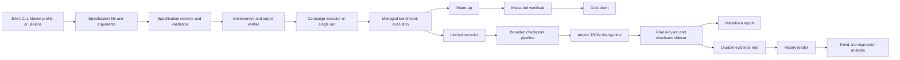

# PeeGeeQ Benchmarking Enhancement Implementation Plan

| Field | Value |
|---|---|
| Status | PROPOSED — NOT IMPLEMENTED |
| Last updated | 18 September 2026 |
| Target module | `peegeeq-benchmarking` |
| Delivery method | Test-driven development, one verified phase at a time |

## 1. Purpose

This plan evolves `peegeeq-benchmarking` from a collection of consolidated performance tests and utility classes into a repeatable benchmarking system. The completed system will run individual workloads or campaigns, capture the execution environment and hardware automatically, retain crash-safe machine-readable evidence, produce human-readable reports, and support defensible comparisons over time.

The plan is informed by a completed capability review of mature Java benchmark harnesses. Every proposed capability has been adapted to PeeGeeQ's reactive architecture, PostgreSQL-backed messaging model, Maven profiles, Jenkins pipeline, and testing rules.

This document is the implementation authority for the enhancement. It does not claim that the proposed features already exist.

## 2. Design Decisions

These decisions were made on 18 September 2026. They are binding on every phase. A later section that conflicts with this table is wrong and must be corrected.

| ID | Decision | Reason |
|---|---|---|
| DD-01 | No database stores benchmark data. History is the set of finalized `run.json` files in a durable evidence root. One JSON file per run. | One durable store is sufficient. The H2 store lived under `target` and was deleted by `mvn clean`. |
| DD-02 | Workloads live in `src/main`. A workload moves there when it is migrated to the workload contract. | A command-line `main` cannot load classes from `src/test`. |
| DD-03 | Both JUnit and command-line entry points exist. A JUnit performance class is a thin caller of the same workload the command line runs. | One workload implementation serves local tests, Jenkins, and operators. |
| DD-04 | Configuration reaches a run through a specification file path and explicit command-line arguments only. The benchmark JVM reads no system property and no environment variable for configuration. | System properties are banned for configuration in PeeGeeQ. |
| DD-05 | One native-queue workload is migrated end to end in Phase 3, before checkpointing, campaigns, and history are built. | Contracts designed without a consumer are wrong. |
| DD-06 | The specification and evidence model is extracted from `PartitionedConsumptionReleaseGate`. | It is the only working evidence writer in the module. |
| DD-07 | Aggregate throughput, counts, and percentiles are computed from interval data. They are not stored in `run.json`. | Derivable data is computed, never stored. |
| DD-08 | The specification hash is computed. It is not stored. | Derivable. |
| DD-09 | The specification and environment are held only inside `run.json` and the checkpoints. There is no `specification.json` or `environment.json`. | One copy. |
| DD-10 | The evidence checksum is a sidecar file, `run.json.sha256`. | A document cannot contain its own checksum. |
| DD-11 | There is no `RECOVERED` execution status. An interrupted run keeps its last checkpointed status. Recovery writes a separate `recovery.json`. | `RECOVERED` discards the phase in which the run stopped. |
| DD-12 | Calibration is deferred. It does not gate validity. | No measurement shows that harness overhead is material for PostgreSQL-bound workloads. |
| DD-13 | A campaign is a fixed-order sequential list of specifications with repetitions. Matrix expansion, seeded ordering, include and exclude rules, and resume are out of scope. | No current requirement needs them. |
| DD-14 | `ParameterizedPerformanceTestBase` and `ConsumerModePerformanceTestBase` are deleted when campaigns replace them. | A subsumed mechanism is deleted, not kept. |
| DD-15 | The legacy metrics classes are deleted: `PerformanceSnapshot`, `PerformanceComparison`, `PerformanceMetricsCollector`, `PerformanceTestResultsGenerator`, `HardwareAwarePerformanceResult`. Deletion starts after Phase 3 proves parity. Each class is deleted when its last caller is migrated. None remains after Phase 7. | A subsumed mechanism is deleted, not kept. |
| DD-16 | H2 is removed in Phase 0. `PerformanceHistoryRepository` and `PerformanceHistoryAnalyzer` are deleted together, because the analyzer reads from the repository. | One demonstration test uses them. They hold no durable data. |
| DD-17 | `PerformanceTestResultsExampleTest` is deleted. | It publishes hard-coded throughput values. |
| DD-18 | On Jenkins the evidence root is a directory on the agent outside the workspace. | Trend analysis needs prior runs on disk. Workspace cleanup must not delete them. |
| DD-19 | Every `run.json` is retained. Checkpoints are deleted after successful finalization. | `run.json` contains everything the checkpoints held. |
| DD-20 | When the checkpoint pipeline is full, the checkpoint is dropped, the event is recorded, and the run is marked `INVALID_MEASUREMENT`. The workload is not blocked and the run is not failed. | Blocking distorts the measurement. Failing discards a run that is still diagnostic. |
| DD-21 | Latency is recorded with HdrHistogram. The serialized histogram is stored per interval. | The full distribution is retained, so percentiles can be recomputed from `run.json`. |
| DD-22 | Baselines require an exact hardware-fingerprint match. A named comparison group is allowed only by explicit policy. | Hardware variation creates false regressions. |
| DD-23 | Regression decisions are informational at launch. A benchmark becomes gating only after it has the configured minimum number of valid samples. | A gate without samples is unstable. |
| DD-24 | The HTML report is deferred. Markdown is the only report format in this plan. | Markdown derived from `run.json` is sufficient for review. |
| DD-25 | The one-hour release gate is selected by specification after it is migrated. The non-Surefire class name is removed at that point. | Decision DD-03 makes class-name selection unnecessary. |

## 3. Current Baseline

Verified against the module on 18 September 2026 by reading source and by the command runs recorded in section 16.

- The performance workloads are isolated from the product modules.
- 25 classes carry the performance tag. 22 are workloads. Two are harness tests: `HardwareProfilingIntegrationTest` and `ConsumerModePerformanceTestBaseTest`. One is `PartitionedConsumptionReleaseGate`, which Surefire does not select by name.
- All workloads are in `src/test`. The product modules are `test` scope in the module pom.
- OSHI-based hardware discovery captures detailed host characteristics.
- Runtime sampling can capture CPU, memory, JVM, disk, network, load, and thread observations.
- Metrics snapshot, comparison, and collector classes exist.
- `PerformanceHistoryRepository` stores history in an H2 database under `target`. `PerformanceHistoryAnalyzer` reads from it. Only `ParameterizedPerformanceDemoTest` uses them. Only the benchmarking module uses H2.
- `HardwareAwarePerformanceStorage` was deleted in commit `52d349d7`. No hardware-aware persistence exists.
- Jenkins can run the performance suite and the partitioned-consumption release gate.
- Jenkins archives logs, host observations, Surefire reports, and generated performance-result files.
- `ParameterizedPerformanceDemoTest` carries only the `slow` tag. No profile selects `slow`. It runs only under `-Pall-tests`.
- Four classes come from `test-jar` dependencies and are used by 13 workload files:

  | Fixture | Source | Used by |
  |---|---|---|
  | `BaseIntegrationTest` | `peegeeq-db` tests | the seven `db/fanout` workloads and `OutboxPerformanceTest` |
  | `CompletionTracker` | `peegeeq-db` tests | `FanoutPerformanceValidationTest`, `P2_FanoutScalingTest`, `P3_MixedTopicsTest`, `P4_BackfillVsOLTPTest` |
  | `SharedPostgresTestExtension` | `peegeeq-db` tests | `db/examples/PerformanceComparisonExampleTest`, `PerformanceTuningExampleTest`, `PeeGeeQPerformanceTest`, `PeeGeeQReactiveConnectionPoolPerformanceTest` |
  | `SharedTestContainers` | `peegeeq-examples` tests | `HighFrequencyProducerConsumerTest` |

- The Jenkins pipeline runs on the agent labelled `peegeeq-linux` and ends with `deleteDir()`, which deletes the workspace after every build.

The partitioned-consumption release gate, read in full for DD-06:

- It writes `task6-partitioned-consumption.json` and a Markdown file. The JSON already carries `schemaVersion: 1`.
- It writes evidence only after every assertion has passed. `status` is the literal `"PASS"`. A failed or interrupted run writes nothing.
- It reads eight workload settings with `Integer.getInteger` and `Long.getLong`, the output directory with `System.getProperty`, and five build values (`BUILD_URL`, `BUILD_NUMBER`, `JOB_NAME`, `NODE_NAME`, `GIT_COMMIT`) with `System.getenv`. The Jenkinsfile passes five of the settings as `-D` properties. All of this conflicts with DD-04.
- Results are per tenant. Each tenant has one delivery-latency series per consumer group and one OLTP-probe latency series.
- Latency is recorded in a private 11-bucket histogram. A reported percentile is the upper bound of its bucket, not a measured value. An empty histogram reports `0`.
- The combined delivery percentile is the maximum of the per-group percentiles, not a percentile of the merged distribution.
- It records workload-specific database observations: pending, completed, swept, watermark, WAL bytes, live and dead tuples, and bloat.
- It records invariant results: order violations, cross-tenant deliveries, and assignments after shutdown.

The baseline does not provide a uniform benchmark lifecycle. Most workloads construct, execute, record, and report measurements independently.

## 4. Findings to Address

| ID | Finding | Consequence |
|---|---|---|
| GAP-01 | Hardware and runtime observations are not automatically attached to every benchmark run. | Results can be retained without the context needed to compare them safely. |
| GAP-02 | No hardware-aware persistence exists. The previous storage class was deleted during consolidation. | Hardware context is not retained with results. |
| GAP-03 | History is held in an H2 database under `target`, which `mvn clean` deletes. Its schema declares a Git commit field that inserts do not populate. Its read methods log `SQLException` and return empty results. One read method queries a `performance_summary` view that no code creates. | Historical results are not durable, lack source provenance, and cannot distinguish "no history" from "query failed". |
| GAP-04 | There is no canonical immutable benchmark specification or run-evidence model. | Each workload defines different metadata and output semantics. |
| GAP-05 | There are no benchmark-specific command-line entry points. Workloads are in `src/test` and cannot be loaded by a `main` class. | Automation depends on test-class knowledge and ad hoc properties. |
| GAP-06 | Warm-up, measurement, and cool-down phases are not standardized. | Measurements may include startup effects or omit cleanup observations. |
| GAP-07 | Interval telemetry and latency distributions are not standardized. | Averages can conceal stalls, tail latency, and instability. |
| GAP-08 | There is no campaign executor for ordered specification lists and repetitions. | Comparative studies require manual orchestration and are difficult to reproduce. |
| GAP-09 | Measurement overhead is not calibrated. | Deferred by DD-12. Reopened only when a measured run shows material harness overhead. |
| GAP-10 | There is no atomic per-run checkpoint writer or bounded asynchronous checkpoint pipeline. | Process interruption can lose the only useful evidence or exhaust memory during a long run. |
| GAP-11 | Interrupted runs are not discovered and classified on the next execution. | Partial evidence is easy to overlook or misinterpret as final. |
| GAP-12 | There is no single human-readable evidence report derived from canonical data. | Reviewing a run requires reading raw logs or several separate artifacts. |
| GAP-13 | Target capabilities, deployment identity, and target verification are not represented uniformly. | Unsupported observations and unsuitable targets can produce ambiguous failures. |
| GAP-14 | Retry, persistence, and managed-execution policies are not centralized. | Workloads can use inconsistent failure and cleanup behavior. |
| GAP-15 | Trend and regression analysis is isolated from the normal run lifecycle. | Historical comparison is optional instead of an automatic outcome. |
| GAP-16 | Git state, JVM arguments, toolchain, database identity, and container identity are not captured for every run. | Results cannot always be traced to the executable inputs that produced them. |
| GAP-17 | `PerformanceTestResultsExampleTest` reports hard-coded throughput and latency values that were not measured. | Synthetic values could be mistaken for benchmark evidence. |

## 5. Goals

The enhancement will provide:

1. One immutable specification for every benchmark invocation.
2. One immutable evidence model shared by all workloads.
3. Automatic environment, hardware, source, JVM, database, and container provenance.
4. Standard warm-up, measurement, and cool-down phases.
5. Standard interval telemetry, work counts, error counts, and latency distributions.
6. Crash-safe checkpoints throughout long-running measurements.
7. Explicit classification of completed, failed, aborted, invalid, and interrupted runs.
8. Reproducible campaigns defined as an ordered list of specifications with repetitions.
9. JSON as the canonical evidence format, with Markdown derived from it.
10. History read from the durable evidence root, with comparison and informational regression assessment.
11. JUnit, command-line, Maven, and Jenkins entry points that run the same workload code.
12. Migration of every existing performance workload to the common lifecycle.
13. Deletion of every mechanism the common lifecycle replaces.

## 6. Non-Goals

- No benchmark implementation code will be added to PeeGeeQ production modules.
- No database will store benchmark data. H2 and every other embedded or external history database are out of scope.
- The benchmarking module will not become a runtime dependency of any product module.
- Performance thresholds will not be presented as universal guarantees across different hardware.
- Missing observations will not be represented as zero.
- Failed, interrupted, or invalid runs will not be included in a successful baseline silently.
- PostgreSQL behavior will not be simulated for database-bound benchmarks.
- Tests will not use mocking frameworks or blocking concurrency bridges.
- The work will not replace Java Microbenchmark Harness for isolated nanosecond-scale method benchmarking. This harness is for system and component behavior under realistic PeeGeeQ workloads.

Deferred, not part of this plan:

- harness overhead calibration and a forked-JVM calibration entry point (DD-12);
- campaign matrix expansion, seeded ordering, include and exclude rules, time budgets, and resume (DD-13); and
- a self-contained HTML report (DD-24).

## 7. Target Architecture



The JSON run evidence is the source of truth. Reports, trend analysis, and CI decisions are derived from it. No second store holds a copy of run data.

## 8. Proposed Package Structure

All new types live under `dev.mars.peegeeq.benchmark` in `src/main`.

```text
dev.mars.peegeeq.benchmark
├── model
│   ├── BenchmarkSpecification
│   ├── BenchmarkRunEvidence
│   ├── BenchmarkRunStatus
│   ├── BenchmarkValidity
│   ├── BenchmarkDiagnostic
│   ├── BenchmarkInterval
│   ├── BenchmarkWorkCounts
│   └── BenchmarkEvidenceSummary
├── environment
│   ├── BenchmarkEnvironmentCapture
│   ├── BenchmarkEnvironment
│   ├── BenchmarkSourceProvenance
│   ├── BenchmarkTargetIdentity
│   └── BenchmarkCapabilityInventory
├── execution
│   ├── BenchmarkWorkload
│   ├── BenchmarkExecutionContext
│   ├── BenchmarkManagedExecution
│   ├── BenchmarkPhasePlan
│   ├── BenchmarkWorkloadScheduler
│   ├── BenchmarkRetryPolicy
│   └── BenchmarkPersistencePolicy
├── measurement
│   ├── BenchmarkIntervalRecorder
│   ├── BenchmarkLatencyRecorder
│   └── BenchmarkResourceSampler
├── evidence
│   ├── BenchmarkRunJsonWriter
│   ├── BenchmarkCheckpointWriter
│   ├── BenchmarkCheckpointPipeline
│   ├── BenchmarkCheckpointRecovery
│   └── BenchmarkMarkdownReportWriter
├── campaign
│   ├── BenchmarkCampaignPlan
│   ├── BenchmarkCampaignManifest
│   └── BenchmarkCampaignExecutor
├── target
│   ├── BenchmarkTargetVerifier
│   ├── PostgreSqlBenchmarkTargetVerifier
│   └── BenchmarkDeploymentIdentityResolver
├── analysis
│   ├── BenchmarkHistoryReader
│   ├── BenchmarkBaselineSelector
│   ├── BenchmarkTrendAnalyzer
│   └── BenchmarkRegressionPolicy
├── workload
│   └── one package per migrated workload family
└── cli
    ├── PeeGeeQBenchmarkMain
    ├── PeeGeeQBenchmarkCampaignMain
    ├── PeeGeeQBenchmarkReportMain
    └── PeeGeeQBenchmarkInspectMain
```

`BenchmarkEvidenceSummary` is a pure function over `BenchmarkRunEvidence`. It computes aggregate throughput, counts, merged latency distributions, and percentiles. Reports, analysis, and JUnit assertions all use it. It stores nothing.

Names may change during implementation when an existing PeeGeeQ abstraction already expresses the same concept. The responsibilities and evidence contracts must remain intact.

### 8.1 Module structure consequences of DD-02

- Product modules that a migrated workload exercises change from `test` scope to `compile` scope in the `peegeeq-benchmarking` pom, one module per migration.
- A migrated workload must not depend on a class that exists only in a `test-jar`. Section 3 lists the four fixtures and the 13 files that use them. Each fixture is either moved to `peegeeq-test-support`, or replaced by a fixture in the benchmarking module. The choice is recorded per fixture in the Phase 0 inventory.
- When no workload uses a `test-jar` dependency any longer, that dependency is removed from the `peegeeq-benchmarking` pom. When nothing else consumes the `test-jar`, its publication is removed from the `peegeeq-db` or `peegeeq-examples` pom.
- Each JUnit performance class stays in `src/test`. After migration it builds a specification, runs the workload through the managed execution, and asserts on `BenchmarkEvidenceSummary` and on validity.

## 9. Canonical Data Contracts

For every stored field this section states whether it is a source of truth or derived. Derived data is computed and never stored.

### 9.1 Benchmark specification

`BenchmarkSpecification` is immutable. Every field is a source of truth. It contains:

- schema version;
- benchmark and scenario identifiers;
- workload type and adapter version;
- message count, payload size, concurrency, batch size, and rate limits;
- warm-up, measurement, and cool-down durations;
- interval duration;
- number of repetitions;
- random seed for workload data;
- target connection identity with secrets removed;
- retry and persistence policy identifiers;
- required and optional capabilities;
- regression policy name;
- durable evidence root (section 9.5); and
- typed workload parameters.

Validation rejects contradictory, missing, negative, or unsafe settings before any resource is created.

The specification hash is computed from the canonical serialization when it is needed. It is not a field (DD-08).

### 9.2 Run evidence

`BenchmarkRunEvidence` is immutable and versioned.

| Content | Source of truth or derived |
|---|---|
| Schema version | Source of truth |
| Unique run identifier | Source of truth |
| Resolved specification | Source of truth. The only copy (DD-09). |
| Start, checkpoint, and completion timestamps | Source of truth |
| Execution status and evidence validity | Source of truth |
| Captured environment and target identity | Source of truth. The only copy (DD-09). |
| Source commit, branch, working-tree state, sanitized remote identity | Source of truth |
| Build identity | Source of truth |
| Java runtime, JVM arguments, Maven and toolchain, OS, architecture, processor data | Source of truth |
| Physical memory, effective process and container limits, storage data | Source of truth |
| Database version and material server settings | Source of truth |
| Container runtime and image identity when applicable | Source of truth |
| Interval measurements, each with work counts, resource samples, and serialized HdrHistograms by scope and series | Source of truth |
| Workload observations: named, typed values a workload reads from its target, by scope, with the phase boundary at which each was read | Source of truth |
| Invariant results: name, scope, expected value, observed value, and pass or fail | Source of truth |
| Diagnostics and capability limitations | Source of truth |
| Aggregate throughput, total counts, merged latency distribution, percentiles | Derived by `BenchmarkEvidenceSummary` (DD-07). Not stored. |
| Specification hash | Derived (DD-08). Not stored. |
| Evidence checksum | Derived. Written to `run.json.sha256` (DD-10). Not a field. |
| Baseline and regression analysis | Derived. Written to `analysis.json`, which cites run identifiers. Not a field. It changes when later runs and policies change. |
| Calibration | Not present (DD-12). |

### 9.3 Status and validity

Execution status and evidence validity are separate dimensions.

Execution status:

- `CREATED`
- `VERIFYING`
- `WARMING_UP`
- `MEASURING`
- `COOLING_DOWN`
- `COMPLETED`
- `FAILED`
- `ABORTED`

There is no `RECOVERED` status (DD-11). A run that was interrupted while `MEASURING` stays `MEASURING` in its last checkpoint. The absence of `run.json` and the presence of `recovery.json` show that it was interrupted and inspected.

Evidence validity:

- `VALID`
- `VALID_WITH_LIMITATIONS`
- `INVALID_CONFIGURATION`
- `INVALID_TARGET`
- `INVALID_MEASUREMENT`
- `INCOMPLETE`

A completed execution is not automatically valid. Regression decisions may use only evidence accepted by the configured validity policy.

### 9.4 Interval and latency data

Each measurement interval retains:

- the lifecycle phase it belongs to;
- monotonic interval boundaries and wall-clock timestamps;
- offered, accepted, completed, failed, retried, and timed-out work counts;
- backlog at the interval boundary;
- a serialized HdrHistogram of latencies recorded in the interval (DD-21);
- CPU, process CPU, heap, non-heap, resident memory, thread, disk, network, and load observations when available;
- event-loop or scheduler delay where applicable; and
- diagnostics explaining unavailable observations.

Achieved rate, latency count, minimum, maximum, mean, and percentiles for an interval are computed from its counts, boundaries, and histogram. They are not stored.

Scopes and series. The release gate shows that one run can measure several independent parties and several kinds of latency:

- A **scope** names an independent party inside one run, such as a tenant or a consumer group. A workload declares its scopes. A workload with one party has one scope.
- A **series** names one kind of measured latency, such as `delivery` or `oltp-probe`. A workload declares its series.
- Work counts and histograms are recorded per scope and series within each interval.
- A combined percentile across scopes is computed by merging histograms. It is never the maximum of per-scope percentiles.
- An empty histogram has no percentiles. A summary reports them as absent, never as `0`.

Workload observations and invariants. Values such as WAL bytes, tuple counts, watermark position, order violations, and cross-tenant deliveries are not latency or throughput. They are stored as workload observations and invariant results (section 9.2). A failed invariant sets validity to `INVALID_MEASUREMENT` and fails the JUnit caller.

The latency recorder is bounded and safe for concurrent writers. HdrHistogram is added as a dependency of `peegeeq-benchmarking` only.

### 9.5 Evidence root and history

Benchmark history is not a separate store. It is the set of finalized `run.json` files beneath the durable evidence root (DD-01).

| Item | Source of truth or derived | Rule |
|---|---|---|
| `run.json` | Source of truth | One file per run. Written once by the atomic writer at finalization. Never modified afterwards. |
| Evidence root path | Source of truth | A required field of the specification. Supplied in the specification file or overridden by a command-line argument. |
| Run index, per-benchmark summaries, baselines, trends | Derived | Computed by reading `run.json` files. Never written to the evidence root as a second record. |
| `analysis.json`, `report.md` | Derived | Regenerable from `run.json` files. Never read as input by any component. |

Evidence root rules:

- The evidence root has no default. Validation rejects a specification that omits it.
- It is not read from a system property or an environment variable (DD-04).
- A relative evidence root resolves against the directory that contains the specification file. It never resolves against the process working directory.
- Validation rejects a root inside a Maven `target` directory, because `mvn clean` deletes it.
- Validation rejects a root that does not exist or is not writable, before any resource is created.
- Run directories are written directly beneath the evidence root. Evidence is not written elsewhere and then copied.
- Checked-in local specifications name a Git-ignored `benchmark-evidence` directory at the repository root.
- Jenkins passes an evidence root on the agent outside the workspace (DD-18).

`BenchmarkHistoryReader` is the only component that reads history. It:

- lists run directories for one benchmark and scenario;
- deserializes each `run.json`, checks its `schemaVersion`, and verifies it against `run.json.sha256`;
- returns only finalized evidence that the validity policy accepts;
- reports every file it could not read, parse, or verify as a diagnostic that names the file and the cause; and
- fails the read when the evidence root itself cannot be listed. An unreadable root is never reported as empty history.

## 10. Hardware and Provenance Requirements

Hardware capture is part of the benchmark lifecycle, not an opt-in helper.

1. Capture stable environment attributes once before target verification.
2. Capture run-specific JVM and source provenance for every invocation.
3. Start resource sampling before warm-up and identify the phase for every sample.
4. Compute headline performance metrics from measurement-phase intervals only.
5. Retain warm-up and cool-down observations for diagnosis.
6. Record both host resources and effective container and process limits when they differ.
7. Record PostgreSQL identity and material settings used by the workload.
8. Record image digests or equivalent immutable container identity when containers are used.
9. Emit an explicit diagnostic when an observation cannot be obtained.
10. Compute a hardware fingerprint from stable attributes without including secrets or volatile usage. The fingerprint is computed from the stored environment. It is not stored.
11. Select baselines only from runs with an identical hardware fingerprint (DD-22).
12. Allow a named comparison group for known-equivalent CI agents only when the regression policy names it (DD-22).

Source provenance is obtained by running Git against the repository. It is not read from the `GIT_COMMIT` environment variable. Build identity is supplied as a command-line argument by Jenkins.

`HardwareProfiler` and `SystemResourceMonitor` are adapted behind the new contracts. `HardwareProfile` and `ResourceUsageSnapshot` are kept only if the environment model uses them directly; otherwise they are deleted with the legacy metrics classes (DD-15).

## 11. Workload Contract

Every workload implements a common asynchronous contract with these responsibilities:

- declare its identifier, parameters, and required capabilities;
- create real resources during setup;
- perform a bounded warm-up;
- execute measured work and publish observations through the execution context;
- stop offering new work at the measurement boundary;
- drain accepted work according to its persistence policy;
- verify final counts and invariants;
- release resources; and
- surface setup, execution, verification, and cleanup failures.

Evidence is written for every outcome. The release gate writes evidence only when every assertion has passed; the common lifecycle writes `run.json` for completed, failed, and aborted executions, with the failure recorded.

The lifecycle coordinator owns phase transitions, evidence checkpoints, timing, and finalization. A workload must not write its own result document.

The first workload is one smoke-sized native-queue producer and consumer workload (DD-05). The contract is designed against it in Phase 3. The remaining adapters are:

- transactional outbox workloads;
- bi-temporal event-store workloads;
- fan-out and backfill workloads;
- REST workloads;
- consumer-mode comparisons;
- connection-pool and database workloads; and
- partitioned-consumption release scenarios.

An existing workload is wrapped first. It is simplified after parity tests prove the adapter preserves its observable behavior.

## 12. Evidence and Recovery Guarantees

### 12.1 Output layout

Each execution uses an isolated directory beneath the durable evidence root defined in section 9.5:

```text
<evidence-root>/
├── <benchmark-id>/
│   └── <scenario-id>/
│       └── <run-id>/
│           ├── checkpoint-000001.json     deleted after finalization
│           ├── checkpoint-000002.json     deleted after finalization
│           ├── run.json                   source of truth
│           ├── run.json.sha256            checksum sidecar
│           ├── recovery.json              only for an inspected interrupted run
│           ├── analysis.json              derived, regenerable
│           ├── report.md                  derived, regenerable
│           └── diagnostics.log
└── campaigns/
    └── <campaign-id>/
        └── manifest.json
```

The build identity is a field inside `run.json`. It is not a directory level, so that all runs of one benchmark and scenario are found by listing one directory.

Every checkpoint is a complete evidence snapshot. It contains the specification and the environment, so an interrupted run is interpretable without any other file (DD-09).

A campaign manifest cites run identifiers. A campaign index is derived from the manifest and the run directories.

### 12.2 Atomic writes

The checkpoint writer will:

- serialize a complete checkpoint to a temporary file in the destination directory;
- flush and close the file successfully;
- move it to its final name using an atomic filesystem operation when supported;
- fall back to a validated replacement strategy with an explicit diagnostic otherwise;
- retain numbered checkpoints until `run.json` and `run.json.sha256` are written and verified;
- delete the checkpoints after successful finalization (DD-19); and
- never publish a partially serialized file under a final name.

A failure to delete a checkpoint after finalization is reported as a diagnostic and fails finalization. It is not ignored.

### 12.3 Bounded checkpoint pipeline

Long runs must not accumulate unlimited pending evidence. The pipeline has configurable limits for pending item count and pending serialized bytes.

When capacity is exhausted (DD-20):

- the submitted checkpoint is dropped;
- the drop is recorded as a diagnostic with the interval range it covered;
- the run validity becomes `INVALID_MEASUREMENT`;
- the workload is not blocked; and
- the execution is not failed.

Interval data is never dropped. Only the intermediate checkpoint file is skipped. The final `run.json` still contains every interval.

Pipeline closure waits asynchronously for accepted checkpoints to finish, rejects new submissions, and surfaces persistence failures to the owning execution.

### 12.4 Recovery

At startup, and on the inspect command, recovery inspects run directories that have no `run.json` and classifies them as:

- recoverable: at least one checkpoint is readable and internally consistent;
- corrupt: checkpoints exist and none is readable or consistent; or
- abandoned: no checkpoint was written.

Recovery writes `recovery.json` with the classification, the last readable checkpoint number, the last checkpointed execution status, and the inspection time. It produces an owner-visible diagnostic.

Recovery never writes `run.json`. It never changes a checkpoint. An interrupted run is never returned by `BenchmarkHistoryReader`.

## 13. Campaigns

A campaign is an ordered list of resolved benchmark specifications (DD-13). The campaign layer supports:

- an explicit ordered list of specification files or inline specifications;
- repetitions per entry;
- sequential execution in the listed order;
- a per-run timeout;
- stop-on-invalid and continue-on-failure policies;
- target reuse where safe; and
- a manifest containing every resolved run before execution begins.

The manifest is immutable after the first run starts. Any change produces a new campaign identity.

Campaigns replace the profile-iteration behavior of `ParameterizedPerformanceTestBase` and `ConsumerModePerformanceTestBase`. Both classes and their tests are deleted when their callers use campaigns (DD-14).

## 14. Analysis and Regression Policy

History is read from the durable evidence root through `BenchmarkHistoryReader` (section 9.5).

The analysis pipeline will:

1. read only finalized evidence that the validity policy accepts;
2. take source commit and all other provenance from `run.json`;
3. select comparable baselines by benchmark, scenario, computed specification hash, target class, and computed hardware fingerprint;
4. compare throughput, error rate, and configured latency percentiles, all computed by `BenchmarkEvidenceSummary`;
5. require the configured minimum number of valid samples before a decision can be gating;
6. report every decision as informational until that minimum exists (DD-23);
7. retain both the raw comparison and the decision policy in `analysis.json`;
8. reject comparisons across incompatible specifications or hardware fingerprints (DD-22); and
9. publish the analysis into `analysis.json`, `report.md`, and Jenkins artifacts.

Thresholds are benchmark-specific and version-controlled. No single percentage threshold is applied to all workloads.

## 15. JUnit, Command-Line, Maven, and Jenkins Interfaces

### 15.1 Configuration rule

Every entry point passes a specification file path. The command line also accepts an explicit, documented set of arguments: evidence root, build identity, and validation-only mode. The benchmark JVM reads no system property and no environment variable for configuration (DD-04).

The resolved specification, after arguments are applied, is what `run.json` stores.

### 15.2 JUnit entry points

Each JUnit performance class loads a checked-in specification from test resources, runs the workload through the managed execution, and asserts on validity and on `BenchmarkEvidenceSummary` (DD-03). The existing `performance-tests` profile continues to select these classes by tag.

### 15.3 Command-line entry points

The module exposes separate commands for:

- one benchmark run;
- one campaign;
- report and analysis regeneration from existing `run.json` files; and
- inspection and classification of interrupted runs.

Every command supports a validation-only mode that resolves configuration and verifies the target without starting measured work.

### 15.4 Maven profiles

The existing `performance-tests` profile remains the JUnit performance suite. Module profiles are added for executable operations:

- `benchmark-run`
- `benchmark-campaign`
- `benchmark-report`
- `benchmark-inspect`

Each profile runs the matching `main` class. A Maven property supplies the specification path and is passed to the `main` class as a program argument. It is not passed as a JVM system property.

### 15.5 Jenkins suites

| Suite | Purpose | Gate behavior |
|---|---|---|
| `performance-smoke` | Short lifecycle and evidence validation | Gating on correctness and validity |
| `performance` | Existing workload coverage with retained evidence | Gating on correctness; performance informational (DD-23) |
| `performance-campaign` | Ordered comparative study | Configurable |
| `partitioned-release` | Long-running partitioned-consumption release evidence | Gating |

Each suite will:

- run serially on an explicitly identified agent;
- pass an evidence root on the agent outside the Jenkins workspace (DD-18);
- pass the build identity as an argument;
- use a suite-specific timeout;
- capture environment and target evidence before measured work;
- archive the run directory from the evidence root, including partial evidence when the build fails or is interrupted;
- publish JUnit results separately from benchmark validity;
- retain every `run.json` in the evidence root (DD-19); and
- make the final evidence path prominent in the console summary.

After the release gate is migrated, `partitioned-release` selects it by specification. `PartitionedConsumptionReleaseGate` is then renamed to a normal JUnit caller or deleted (DD-25).

## 16. TDD and Verification Rules

Every phase follows red, green, refactor:

1. Add the smallest test that expresses the missing observable behavior.
2. Run that test and retain the expected failure output.
3. Implement the smallest production change that satisfies the test.
4. Rebuild the affected reactor slice.
5. Run the smallest relevant test scope.
6. Inspect per-class test counts and failures in the saved Maven log.
7. Refactor only while the focused tests remain green.
8. Run the complete `peegeeq-benchmarking` core suite for the phase.
9. Run the relevant performance scenario on Jenkins when real infrastructure or duration is material.
10. Update this plan's checklist and attach evidence before starting the next phase.

Before writing code that calls a dependency, list that dependency's failure modes and write one failing test per mode. For this plan the dependencies include the filesystem, the JSON serializer, Git, OSHI, PostgreSQL, and Testcontainers.

Mandatory test approach:

- use real implementations and lightweight purpose-built failure fixtures;
- use Testcontainers for PostgreSQL behavior;
- verify JSON by deserializing the written artifact;
- verify atomic persistence with real temporary directories and filesystem operations;
- exercise cleanup failures and combined execution and cleanup failures;
- verify asynchronous results with Vert.x test context patterns already established in the module;
- use deterministic clocks, seeds, and sample sources where time or operating-system observations would make a unit test unstable;
- reserve live hardware assertions for integration or performance profiles; and
- do not use blocking waits, timing sleeps, or mocked database connections.

After every Java or Maven change, rebuild before focused verification:

```powershell
mvn clean install -DskipTests -pl :peegeeq-benchmarking -am 2>&1 |
    Tee-Object -FilePath logs\benchmarking-phase-build.log
```

The rebuild installs the upstream modules, so focused test runs target the benchmarking module alone. `-am` is not combined with `-Dtest`, because Surefire fails upstream modules that contain no matching test.

Run a focused core class without a profile:

```powershell
mvn test -pl :peegeeq-benchmarking -Dtest=BenchmarkRunJsonWriterTest 2>&1 |
    Tee-Object -FilePath logs\benchmarking-focused-core.log
```

Run a focused performance class with the performance profile:

```powershell
mvn test -Pperformance-tests -pl :peegeeq-benchmarking -Dtest=PeeGeeQPerformanceTest 2>&1 |
    Tee-Object -FilePath logs\benchmarking-focused-performance.log
```

Command verification, 18 September 2026, on the development workstation:

| Command form | Result | Log |
|---|---|---|
| `mvn test -pl :peegeeq-benchmarking -Dtest=PerformanceSnapshotTest` | `PerformanceSnapshotTest` Tests run: 7, Failures: 0, Errors: 0, Skipped: 0. BUILD SUCCESS. | `logs\benchmarking-plan-check-focused-core.log` |
| The same with `-am` | BUILD FAILURE in `peegeeq-test-support`: `No tests matching pattern "PerformanceSnapshotTest" were executed`. | `logs\benchmarking-plan-check-focused-core-am.log` |
| `mvn test -Pperformance-tests -pl :peegeeq-benchmarking -Dtest=HardwareProfilingIntegrationTest` | Docker 29.7.2 running. `HardwareProfilingIntegrationTest` Tests run: 3, Failures: 0, Errors: 0, Skipped: 0. BUILD SUCCESS in 15.6 s. | `logs\benchmarking-plan-check-focused-performance.log` |

All three command forms are verified.

Logging defect found by that run: `peegeeq-benchmarking` has no `logback-test.xml`, so Logback runs at its default `DEBUG` level. The 3-test run wrote 3,693 log lines, of which 2,950 were `DEBUG`. Most came from the Docker client's HTTP wire and header loggers. `peegeeq-db`, `peegeeq-native`, and `peegeeq-test-support` each have a `logback-test.xml`. Unbounded debug logging during a measured run distorts the measurement and inflates the archived logs. `BENCH-003` fixes it.

The approximately 90-minute all-tests suite remains an explicitly requested release gate, not a normal phase loop.

## 17. Implementation Phases

### Phase 0 — Baseline Integrity, H2 Removal, and Synthetic-Result Removal

**Objective:** Establish an honest baseline and delete mechanisms that the plan does not carry forward.

Tasks:

- [ ] `BENCH-001` Inventory every performance-tagged class. Map it to a workload category, infrastructure requirement, parameters, outputs, assertions, legacy classes used, and `test-jar` fixtures used (section 8.1).
- [ ] `BENCH-002` Record the current core and performance test counts as migration controls.
- [ ] `BENCH-003` Add a `logback-test.xml` to `peegeeq-benchmarking`, mirroring the one in `peegeeq-db`. Rerun the focused performance command in section 16 and record the `DEBUG` line count before and after.
- [ ] `BENCH-004` Delete `PerformanceTestResultsExampleTest` (DD-17).
- [ ] `BENCH-005` Delete `PerformanceHistoryRepository` and `PerformanceHistoryAnalyzer`. Remove the H2 dependency from the `peegeeq-benchmarking` pom and from root dependency management. Remove the H2 and history usage from `ParameterizedPerformanceDemoTest` (DD-16).
- [ ] `BENCH-006` Update documents that describe the H2 store so they match the code after `BENCH-005`: `peegeeq-benchmarking/README.md`, `docs/PEEGEEQ_ARCHITECTURE_API_GUIDE.md`, `docs/PEEGEEQ_SYSTEM_MODULES_SEQUENCE_DIAGRAMS.md`, and the H2 sections of `docs-design/performance/PeeGeeQ-Performance-Tuning-Harness.md`.
- [ ] `BENCH-007` Add a repository check that fails when a hard-coded performance value is written into an evidence tree.
- [ ] `BENCH-008` Add `benchmark-evidence/` to `.gitignore`.
- [ ] `BENCH-009` Record in the inventory, per fixture in section 3, whether it moves to `peegeeq-test-support` or is replaced in the benchmarking module.

Acceptance criteria:

- every existing workload appears once in the inventory;
- no H2 class, schema, or dependency remains in the repository;
- no test publishes hard-coded performance values;
- the change in test counts equals the tests deliberately deleted, and each deletion is listed; and
- the module's core suite is green.

### Phase 1 — Specification and Evidence Model

**Objective:** Create the common contracts and the final evidence writer, extracted from the release gate (DD-06).

Tests first:

- specification validation and canonical hashing;
- evidence-root validation: omitted, under `target`, missing, not writable, relative path resolution;
- immutable collection behavior;
- JSON round-trip compatibility;
- status transition legality, including the absence of a recovered state;
- separation of execution status from evidence validity;
- forward-compatible unknown diagnostic fields;
- secret redaction;
- atomic final write, serializer failure propagation, destination failure propagation;
- checksum sidecar written and verified; and
- `BenchmarkEvidenceSummary` results against known interval data.

Tasks:

- [ ] `BENCH-101` Map every field of the release gate JSON (section 3) to the model in section 9: `build` to build identity and source provenance, `configuration` to the specification, `tenants` to scopes, the two latency blocks to series, `database` to workload observations, and the three integrity counters to invariant results. Record any field that does not fit and correct section 9 before implementing it.
- [ ] `BENCH-102` Implement `BenchmarkSpecification` and validation.
- [ ] `BENCH-103` Implement run status, validity, diagnostic, interval, and work-count value types.
- [ ] `BENCH-104` Implement `BenchmarkRunEvidence` with a versioned JSON contract.
- [ ] `BENCH-105` Define canonical serialization and computed specification hashing.
- [ ] `BENCH-106` Implement `BenchmarkRunJsonWriter` with atomic write and the `run.json.sha256` sidecar.
- [ ] `BENCH-107` Implement `BenchmarkEvidenceSummary`.
- [ ] `BENCH-108` Publish JSON examples under module test resources.

Acceptance criteria:

- invalid specifications fail before any external resource is acquired;
- secrets never appear in serialization or diagnostics;
- evidence can be serialized, deserialized, and compared deterministically;
- no derived value listed in section 9.2 is a stored field; and
- no existing performance workload has been migrated yet.

### Phase 2 — Environment, Hardware, and Target Provenance

**Objective:** Produce complete environment evidence for every future execution.

Tests first:

- stable hardware fingerprinting;
- absent observation diagnostics;
- Git clean and dirty state representation;
- Git failure modes: not a repository, Git not installed, detached head;
- sanitized remote identity;
- JVM argument capture;
- container-limit precedence over host capacity;
- PostgreSQL identity and setting capture using Testcontainers; and
- compatibility classification between two environments.

Tasks:

- [ ] `BENCH-201` Adapt the existing OSHI hardware profiler into `BenchmarkEnvironmentCapture`.
- [ ] `BENCH-202` Capture Java runtime, JVM arguments, toolchain, operating system, and architecture.
- [ ] `BENCH-203` Capture source commit, branch, working-tree state, and sanitized remote identity from Git.
- [ ] `BENCH-204` Capture host capacity and effective container and process limits.
- [ ] `BENCH-205` Implement PostgreSQL version and material-setting capture.
- [ ] `BENCH-206` Implement target and deployment identity.
- [ ] `BENCH-207` Define hardware and environment comparison compatibility with a computed fingerprint.

Acceptance criteria:

- a generated environment explains every unavailable field;
- no credential, token, or connection password is retained;
- hardware fingerprints are stable across repeated capture on one unchanged host; and
- Testcontainers evidence identifies the actual PostgreSQL instance used.

### Phase 3 — Lifecycle, Measurement, and the First Workload

**Objective:** Define the workload contract against one real workload and run it end to end from JUnit and from the command line (DD-02, DD-03, DD-05).

Tests first:

- legal phase progression;
- monotonic interval boundaries;
- work-count conservation;
- percentile accuracy against known distributions using HdrHistogram;
- histogram serialization round trip and merge;
- concurrent latency recording;
- missing sample handling;
- phase-aware resource sampling;
- setup failure cleanup;
- workload failure propagation;
- verification failure classification;
- cleanup failure visibility, and combined primary and cleanup diagnostics;
- adapter contract test for the native-queue workload;
- parity between legacy headline metrics and `BenchmarkEvidenceSummary` for the same run; and
- command-line argument and specification resolution, validation-only mode, and exit-code mapping.

Tasks:

- [ ] `BENCH-301` Define the workload and execution-context contract.
- [ ] `BENCH-302` Implement phase plans and lifecycle transitions.
- [ ] `BENCH-303` Implement HdrHistogram latency recording and add the dependency (DD-21).
- [ ] `BENCH-304` Implement interval and work-count recording.
- [ ] `BENCH-305` Adapt the existing resource monitor to phase-labelled samples.
- [ ] `BENCH-306` Implement managed execution and resource ownership.
- [ ] `BENCH-307` Move one smoke-sized native-queue workload to `src/main` behind the contract. Resolve its fixture dependencies (section 8.1).
- [ ] `BENCH-308` Convert its JUnit class to a thin caller.
- [ ] `BENCH-309` Implement `PeeGeeQBenchmarkMain` and the `benchmark-run` Maven profile.
- [ ] `BENCH-310` Implement `BenchmarkMarkdownReportWriter`.
- [ ] `BENCH-311` Add a checked-in smoke specification.
- [ ] `BENCH-312` Record every contract change the first workload forced, and correct sections 9 and 11.

Acceptance criteria:

- the workload runs from JUnit and from the command line with identical specifications and produces structurally identical evidence;
- headline results exclude warm-up and cool-down work;
- interval totals reconcile with computed aggregates;
- every published percentile is recomputable from the stored histograms;
- every accepted asynchronous operation is observed;
- every acquired resource has deterministic cleanup;
- failure evidence preserves the original cause plus cleanup diagnostics; and
- `report.md` contains no value absent from `run.json` or not computed from it.

### Phase 4 — Checkpointing and Recovery

**Objective:** Preserve useful evidence through failures and interruptions.

Tests first:

- atomic checkpoint replacement;
- serializer failure propagation;
- destination failure propagation;
- bounded item and byte capacity;
- drop on exhaustion marks `INVALID_MEASUREMENT`, records the diagnostic, and does not block the submitter (DD-20);
- no interval is missing from `run.json` after a dropped checkpoint;
- close-and-drain behavior;
- rejection after closure;
- ordering of accepted checkpoints;
- checkpoint deletion after verified finalization, and failure when deletion fails (DD-19);
- discovery of interrupted runs;
- recoverable, corrupt, and abandoned classification;
- `recovery.json` written and no `run.json` created (DD-11); and
- finalization idempotency.

Tasks:

- [ ] `BENCH-401` Implement numbered checkpoint persistence.
- [ ] `BENCH-402` Implement the bounded asynchronous checkpoint pipeline.
- [ ] `BENCH-403` Connect lifecycle events and intervals to checkpoint creation.
- [ ] `BENCH-404` Implement idempotent finalization with checkpoint deletion.
- [ ] `BENCH-405` Implement interrupted-run discovery, classification, and `recovery.json`.
- [ ] `BENCH-406` Implement `PeeGeeQBenchmarkInspectMain` and the `benchmark-inspect` profile.

Acceptance criteria:

- forced termination after any completed checkpoint leaves readable evidence;
- persistence failure fails or invalidates the owning run according to policy;
- memory use is bounded by declared pipeline limits; and
- recovery never produces `run.json` and never changes a checkpoint.

### Phase 5 — Capabilities, Target Verification, and Policies

**Objective:** Give every workload the same target checks and failure policies.

Tests first:

- capability-supported, unsupported, and observation-unavailable outcomes;
- retry classification and limits;
- persistence and drain semantics; and
- target rejection before measured work.

Tasks:

- [ ] `BENCH-501` Implement capability inventory and validation.
- [ ] `BENCH-502` Implement PostgreSQL target verification.
- [ ] `BENCH-503` Implement explicit retry and persistence policies.
- [ ] `BENCH-504` Implement workload scheduling and coordinated drain.

Acceptance criteria:

- a missing optional capability produces a limitation, not a false measurement;
- a missing required capability prevents the run; and
- target verification results are present in evidence before warm-up.

### Phase 6 — Sequential Campaigns

**Objective:** Execute an ordered list of specifications without manual orchestration (DD-13).

Tests first:

- plan parsing and validation;
- manifest resolution and immutability;
- stable campaign identity;
- repetition identity;
- execution in listed order;
- per-run timeout behavior; and
- stop-on-invalid and continue-on-failure policies.

Tasks:

- [ ] `BENCH-601` Implement campaign plan parsing and validation.
- [ ] `BENCH-602` Resolve plans into immutable manifests.
- [ ] `BENCH-603` Implement sequential execution with repetitions.
- [ ] `BENCH-604` Implement safe target reuse rules.
- [ ] `BENCH-605` Implement `PeeGeeQBenchmarkCampaignMain` and the `benchmark-campaign` profile.

Acceptance criteria:

- the complete run set is knowable before execution begins;
- identical inputs produce the same manifest; and
- every run remains independently reviewable.

### Phase 7 — Remaining Workload Migration and Legacy Deletion

**Objective:** Move all remaining workloads onto the common lifecycle and delete what it replaces (DD-14, DD-15, DD-25).

Migration order:

1. remaining native queue workloads;
2. transactional outbox;
3. consumer-mode comparison, using a campaign in place of `ConsumerModePerformanceTestBase`;
4. REST;
5. bi-temporal event store;
6. fan-out and backfill;
7. connection-pool and database workloads;
8. remaining examples and validation workloads, using a campaign in place of `ParameterizedPerformanceTestBase`; and
9. partitioned-consumption release scenarios.

For each workload:

- [ ] add an adapter contract test first;
- [ ] prove setup and cleanup on success and failure;
- [ ] reconcile offered, accepted, completed, and persisted work;
- [ ] compare legacy headline metrics with `BenchmarkEvidenceSummary` for the same run;
- [ ] move the workload to `src/main` and resolve its fixture dependencies;
- [ ] convert the JUnit class to a thin caller;
- [ ] preserve workload-specific diagnostics; and
- [ ] remove the legacy path after parity is demonstrated.

Tasks:

- [ ] `BENCH-701` Migrate remaining native queue workloads.
- [ ] `BENCH-702` Migrate outbox workloads.
- [ ] `BENCH-703` Migrate consumer-mode workloads. Delete `ConsumerModePerformanceTestBase`, `ConsumerModeTestScenario` if unused, and their tests.
- [ ] `BENCH-704` Migrate REST workloads.
- [ ] `BENCH-705` Migrate bi-temporal workloads.
- [ ] `BENCH-706` Migrate fan-out and backfill workloads.
- [ ] `BENCH-707` Migrate database and connection-pool workloads.
- [ ] `BENCH-708` Migrate remaining examples. Delete `ParameterizedPerformanceTestBase`, `ParameterizedPerformanceDemoTest`, and their tests.
- [ ] `BENCH-709` Migrate partitioned-consumption release scenarios. Select the release gate by specification and remove the non-Surefire class name (DD-25). Replace its eight system properties, its output-directory property, and its five environment reads with specification fields and arguments (DD-04). Remove the five `-Dpeegeeq.task6.*` properties from the Jenkinsfile. Delete its private `LatencyHistogram`. Its parity test asserts that each HdrHistogram percentile falls inside the legacy bucket that the old gate reported, because the old value is a bucket upper bound and the old combined value is a maximum across groups.
- [ ] `BENCH-710` Delete `PerformanceSnapshot`, `PerformanceComparison`, `PerformanceMetricsCollector`, `PerformanceTestResultsGenerator`, `HardwareAwarePerformanceResult`, and their tests. Delete `HardwareProfile` and `ResourceUsageSnapshot` if the environment model does not use them.

Acceptance criteria:

- every inventory entry from Phase 0 is migrated, intentionally reclassified, or removed with rationale;
- every measured run creates `run.json` with environment evidence;
- all pre-migration correctness assertions remain represented;
- no class named in DD-14 or DD-15 remains in the repository;
- no workload writes its own result document; and
- the performance profile retains all expected workload classes.

### Phase 8 — History, Trends, and Informational Regression Decisions

**Objective:** Make historical analysis an automatic completion step that reads the evidence root.

Tests first:

- history read returns the finalized, valid runs written by the Phase 1 writer into a real temporary evidence root;
- history read failure modes, one failing test per mode before the reader is written:
  - evidence root missing;
  - evidence root not listable;
  - `run.json` unreadable;
  - `run.json` truncated or not valid JSON;
  - `run.json` does not match `run.json.sha256`;
  - `run.json.sha256` missing;
  - unknown `schemaVersion`;
  - run directory with checkpoints and no `run.json`;
  - two run directories that declare the same run identifier;
- source commit present in every history entry;
- comparable-baseline selection;
- incompatible-hardware rejection and named comparison group acceptance (DD-22);
- minimum-sample enforcement;
- informational outcome below the minimum sample count, gating outcome at or above it (DD-23);
- throughput and percentile regression calculation;
- noisy-sample treatment; and
- `analysis.json` serialization and regeneration.

Tasks:

- [ ] `BENCH-801` Implement `BenchmarkHistoryReader` over the durable evidence root.
- [ ] `BENCH-802` Implement baseline selection and compatibility checks.
- [ ] `BENCH-803` Implement trend analysis over `BenchmarkEvidenceSummary` results.
- [ ] `BENCH-804` Implement version-controlled benchmark-specific regression policies.
- [ ] `BENCH-805` Write `analysis.json` and include the decision in `report.md`.
- [ ] `BENCH-806` Implement `PeeGeeQBenchmarkReportMain` and the `benchmark-report` profile.

Acceptance criteria:

- history survives `mvn clean` and Jenkins workspace cleanup;
- a history read failure is reported as a failure, never as empty history;
- no index or summary file duplicates data held in `run.json`;
- regression decisions cite their baseline run identities and policy;
- incompatible runs are never compared automatically; and
- deleting `analysis.json` and `report.md` and regenerating them produces the same content.

### Phase 9 — Jenkins Integration

**Objective:** Make all supported operations repeatable in CI.

Tests first:

- Jenkins parameter-to-command mapping;
- redacted console summaries; and
- artifact presence on success, invalidity, failure, and interruption.

Tasks:

- [ ] `BENCH-901` Provision the evidence root on the `peegeeq-linux` agent outside the workspace and document its location and ownership (DD-18). The pipeline's `deleteDir()` removes the workspace after every build, so a root inside it cannot hold history. The agent's actual remote root and free disk space must be read from the agent; the CI setup document only suggests `/srv/jenkins-agent`.
- [ ] `BENCH-902` Add checked-in smoke and campaign specifications for Jenkins.
- [ ] `BENCH-903` Add the `performance-smoke` and `performance-campaign` suite parameters and stages.
- [ ] `BENCH-904` Pass evidence root and build identity as arguments in every suite.
- [ ] `BENCH-905` Archive Markdown, JSON, checksum, JUnit, and manifest artifacts from the evidence root.
- [ ] `BENCH-906` Add build-summary links and evidence identities.
- [ ] `BENCH-907` Configure workspace cleanup so that it cannot reach the evidence root.

Acceptance criteria:

- Jenkins archives partial evidence on unsuccessful builds;
- each result is traceable to one resolved specification and source revision;
- a second build can read the first build's `run.json` as history; and
- performance validity and JUnit success are shown as distinct outcomes.

### Phase 10 — Documentation and Release Validation

**Objective:** Complete operational documentation and prove the full system on the Jenkins benchmark host.

Tasks:

- [ ] `BENCH-1001` Update the module README with commands, lifecycle, and artifact layout.
- [ ] `BENCH-1002` Update the canonical test-command guide.
- [ ] `BENCH-1003` Update the performance-tuning guide to use canonical evidence.
- [ ] `BENCH-1004` Document campaign authoring and parameter safety limits.
- [ ] `BENCH-1005` Document interruption recovery and evidence retention.
- [ ] `BENCH-1006` Run the smoke lifecycle and inspect every artifact.
- [ ] `BENCH-1007` Run one representative campaign.
- [ ] `BENCH-1008` Run the partitioned-consumption release gate.
- [ ] `BENCH-1009` Run the explicitly authorized full repository release gate.
- [ ] `BENCH-1010` Record exact commands, durations, test counts, evidence identities, and Jenkins build URLs.

Acceptance criteria:

- all user-facing documentation agrees on commands and result locations;
- all release-validation runs retain complete evidence;
- recovery is demonstrated using a deliberately interrupted non-production run;
- no unresolved high-priority finding remains; and
- this document can be converted from a proposal to a completed implementation record.

## 18. Acceptance Matrix

| Finding | Completion evidence |
|---|---|
| GAP-01, GAP-02 | Every migrated run contains environment and phase-labelled resource evidence inside `run.json`. |
| GAP-03, GAP-16 | No H2 class or dependency remains. Every `run.json` in the durable evidence root contains source, JVM, target, database, and container provenance with redaction tests. |
| GAP-04 | All workloads consume the canonical specification and produce the canonical evidence model. |
| GAP-05 | Workloads are in `src/main`. Documented CLI commands, Maven profiles, and Jenkins suites execute from a specification file without class-name knowledge. |
| GAP-06, GAP-07 | Evidence contains distinct phases, interval telemetry, reconciled counts, and stored HdrHistograms. |
| GAP-08 | An immutable campaign manifest drives ordered execution and repetitions. |
| GAP-09 | Deferred (DD-12). Not part of completion. |
| GAP-10, GAP-11 | Forced interruption leaves valid checkpoints that are classified on the next invocation and recorded in `recovery.json`. |
| GAP-12 | `report.md` is regenerated exclusively from `run.json` files. |
| GAP-13 | Capability and target verification results are present before warm-up. |
| GAP-14 | All workloads use managed execution, explicit retry policy, and explicit persistence and drain policy. |
| GAP-15 | Every finalized run receives an `analysis.json` or a recorded reason that no valid baseline exists. |
| GAP-17 | `PerformanceTestResultsExampleTest` is deleted and the repository check from `BENCH-007` is green. |

## 19. Risks and Mitigations

| Risk | Mitigation |
|---|---|
| The harness changes the workload it measures. | Bound checkpoint work and never block the workload (DD-20). Calibration is deferred (DD-12); reopen it if a measured run shows material overhead. |
| More evidence increases memory or disk use. | Stream bounded intervals, delete checkpoints after finalization, and expose dropped checkpoints as a validity failure. |
| The evidence root grows without limit. | `run.json` is retained by decision (DD-19). Directory layout keeps each history read to one benchmark and scenario. Review size during Phase 10. |
| Moving workloads to `src/main` pulls test fixtures into compile scope. | Record fixture use in the Phase 0 inventory and resolve it per workload (section 8.1). |
| Hardware variation creates false regressions. | Require identical fingerprints and explicit named comparison groups (DD-22). |
| Migration changes existing workload behavior. | Wrap first, run legacy and canonical measurement in the same execution, reconcile metrics, then remove the legacy path. |
| Long jobs lose results when interrupted. | Persist numbered atomic checkpoints and archive partial results in Jenkins post-actions. |
| CI secrets leak into evidence. | Centralize redaction, test representative connection values, and persist sanitized identities only. |
| Performance gates become flaky. | Decisions are informational until the minimum sample count exists (DD-23). Use repetitions and benchmark-specific policies. |
| Host observations are unavailable in restricted environments. | Report explicit capability limitations and invalidate only when the missing observation is required. |
| Cleanup failure hides the primary failure. | Preserve the primary diagnostic and append cleanup diagnostics without replacing it. |

## 20. Definition of Done

This enhancement is complete only when all of the following are true:

- every current PeeGeeQ performance workload is accounted for, lives in `src/main`, and uses the common lifecycle;
- every JUnit performance class is a thin caller of a workload that the command line can also run;
- every measured run has a validated specification and immutable run identity;
- every run automatically captures hardware, environment, source, JVM, database, and applicable container provenance;
- interval counts reconcile with computed aggregates, and published percentiles come from stored histograms;
- no derived value is stored in `run.json`;
- checkpoints are atomic, bounded, recoverable, and archived by Jenkins;
- `run.json` is the canonical source for Markdown reports and regression analysis;
- incomplete, failed, invalid, interrupted, and successful evidence are unmistakably different;
- history is the set of finalized `run.json` files in the durable evidence root, and no database stores benchmark data;
- campaigns are ordered, sequential, and represented by immutable manifests;
- no class named in DD-14, DD-15, DD-16, or DD-17 remains in the repository;
- the benchmark JVM reads no system property or environment variable for configuration;
- the JUnit, CLI, Maven, and Jenkins interfaces are documented and verified;
- no illustrative number can be mistaken for measured performance;
- all focused, module, performance, and authorized release tests are green with retained logs and exact test counts;
- the repository contains no new prohibited asynchronous or testing patterns; and
- the final documentation describes implemented behavior only.

## 21. Delivery Checklist

- [ ] Phase 0 — Baseline integrity, H2 removal, and synthetic-result removal
- [ ] Phase 1 — Specification and evidence model
- [ ] Phase 2 — Environment, hardware, and target provenance
- [ ] Phase 3 — Lifecycle, measurement, and the first workload
- [ ] Phase 4 — Checkpointing and recovery
- [ ] Phase 5 — Capabilities, target verification, and policies
- [ ] Phase 6 — Sequential campaigns
- [ ] Phase 7 — Remaining workload migration and legacy deletion
- [ ] Phase 8 — History, trends, and informational regression decisions
- [ ] Phase 9 — Jenkins integration
- [ ] Phase 10 — Documentation and release validation

No phase is marked complete until its focused tests, module verification, retained evidence, and acceptance criteria have been reviewed. The next implementation phase must not begin until the current phase is green and reported.
