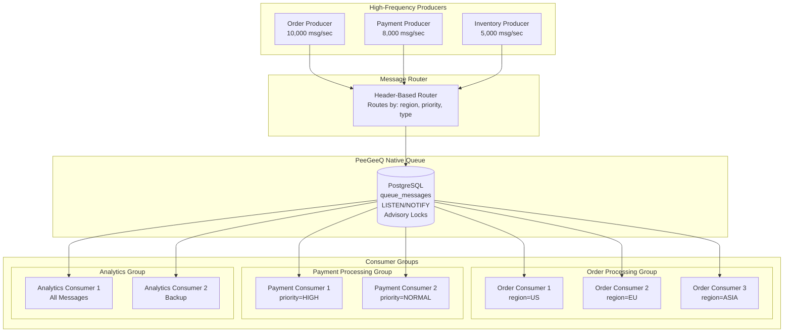

# PeeGeeQ Advanced Guide: High-Frequency Messaging & Consumer Groups
Copyright Mark Andrew Ray-Smith Cityline Ltd 2025

This guide demonstrates advanced PeeGeeQ patterns for high-throughput scenarios, including high-frequency producers, multiple consumers, consumer groups, and message routing based on header keys.

## Architecture Overview



## High-Frequency Producer Implementation

### 1. Optimized Producer Configuration

First, create a high-performance configuration:

```properties
# High-Performance Configuration (peegeeq-highperf.properties)
# Database Connection Pool - Optimized for high throughput
peegeeq.database.pool.min-size=20
peegeeq.database.pool.max-size=50
peegeeq.database.pool.connection-timeout-ms=5000
peegeeq.database.pool.idle-timeout-ms=300000

# Performance Settings
peegeeq.performance.async.enabled=true
peegeeq.performance.async.thread-pool-size=30
peegeeq.performance.batch.enabled=true
peegeeq.performance.batch.max-size=500
peegeeq.performance.batch.timeout=PT2S

# Queue Settings for High Throughput
peegeeq.queue.visibility-timeout=PT15S
peegeeq.queue.max-retries=2
peegeeq.queue.batch-size=50

# Metrics and Monitoring
peegeeq.metrics.enabled=true
peegeeq.metrics.reporting-interval=PT30S
peegeeq.circuit-breaker.enabled=true
peegeeq.circuit-breaker.failure-threshold=10
```

### 2. High-Frequency Producer Class

```java
package com.example.advanced;

import dev.mars.peegeeq.api.*;
import dev.mars.peegeeq.db.PeeGeeQManager;
import dev.mars.peegeeq.db.config.PeeGeeQConfiguration;
import dev.mars.peegeeq.db.provider.PgDatabaseService;
import dev.mars.peegeeq.db.provider.PgQueueFactoryProvider;
import io.micrometer.core.instrument.MeterRegistry;
import io.micrometer.core.instrument.simple.SimpleMeterRegistry;

import java.util.Map;
import java.util.concurrent.*;
import java.util.concurrent.atomic.AtomicLong;

public class HighFrequencyProducer {
    private final MessageProducer<OrderEvent> producer;
    private final ExecutorService executorService;
    private final AtomicLong messageCounter = new AtomicLong(0);
    private final MeterRegistry meterRegistry;
    
    public HighFrequencyProducer(PeeGeeQManager manager) throws Exception {
        // Create database service and factory
        DatabaseService databaseService = new PgDatabaseService(manager);
        QueueFactoryProvider provider = new PgQueueFactoryProvider();
        QueueFactory nativeFactory = provider.createNativeQueueFactory(databaseService);
        
        // Create producer for high-frequency messaging
        this.producer = nativeFactory.createProducer("order-events", OrderEvent.class);
        
        // Create thread pool for concurrent message sending
        this.executorService = Executors.newFixedThreadPool(20);
        this.meterRegistry = new SimpleMeterRegistry();
    }
    
    /**
     * Sends messages at high frequency with different routing headers
     */
    public void startHighFrequencyProduction(int messagesPerSecond, int durationSeconds) {
        System.out.println("Starting high-frequency production: " + messagesPerSecond + " msg/sec for " + durationSeconds + " seconds");
        
        ScheduledExecutorService scheduler = Executors.newScheduledThreadPool(5);
        
        // Calculate delay between messages
        long delayMicros = 1_000_000 / messagesPerSecond;
        
        scheduler.scheduleAtFixedRate(() -> {
            // Send batch of messages concurrently
            for (int i = 0; i < 10; i++) {
                executorService.submit(this::sendRoutedMessage);
            }
        }, 0, delayMicros / 10, TimeUnit.MICROSECONDS);
        
        // Stop after duration
        scheduler.schedule(() -> {
            scheduler.shutdown();
            System.out.println("Sent " + messageCounter.get() + " messages");
        }, durationSeconds, TimeUnit.SECONDS);
    }
    
    private void sendRoutedMessage() {
        try {
            long msgId = messageCounter.incrementAndGet();
            
            // Create order event with routing information
            OrderEvent event = new OrderEvent(
                "ORDER-" + msgId,
                "CREATED",
                msgId % 1000 + 100.0, // Random amount
                "customer-" + (msgId % 10000)
            );
            
            // Create routing headers based on message characteristics
            Map<String, String> headers = createRoutingHeaders(msgId);
            
            // Send with correlation ID and message group for ordering
            String correlationId = "corr-" + msgId;
            String messageGroup = headers.get("region") + "-" + headers.get("priority");
            
            producer.send(event, headers, correlationId, messageGroup)
                .whenComplete((result, error) -> {
                    if (error != null) {
                        System.err.println("Failed to send message " + msgId + ": " + error.getMessage());
                    }
                });
                
        } catch (Exception e) {
            System.err.println("Error creating message: " + e.getMessage());
        }
    }
    
    private Map<String, String> createRoutingHeaders(long messageId) {
        // Distribute messages across regions
        String region = switch ((int)(messageId % 3)) {
            case 0 -> "US";
            case 1 -> "EU";
            case 2 -> "ASIA";
            default -> "US";
        };
        
        // Assign priority based on message characteristics
        String priority = (messageId % 10 < 2) ? "HIGH" : "NORMAL";
        
        // Message type for routing
        String type = (messageId % 5 == 0) ? "PREMIUM" : "STANDARD";
        
        return Map.of(
            "region", region,
            "priority", priority,
            "type", type,
            "source", "order-service",
            "version", "2.0",
            "timestamp", String.valueOf(System.currentTimeMillis())
        );
    }
    
    public void close() {
        executorService.shutdown();
        producer.close();
    }
}
```

## Consumer Groups Implementation

### 1. Header-Based Message Router

```java
package com.example.advanced;

import dev.mars.peegeeq.api.Message;
import java.util.Map;
import java.util.function.Predicate;

public class MessageRouter {
    
    /**
     * Creates a filter for messages based on header values with null safety
     */
    public static <T> Predicate<Message<T>> createHeaderFilter(String headerKey, String expectedValue) {
        if (headerKey == null || expectedValue == null) {
            throw new IllegalArgumentException("Header key and expected value cannot be null");
        }

        return message -> {
            try {
                Map<String, String> headers = message.getHeaders();
                return headers != null && expectedValue.equals(headers.get(headerKey));
            } catch (Exception e) {
                System.err.println("Error in header filter for key '" + headerKey + "': " + e.getMessage());
                return false;
            }
        };
    }

    /**
     * Creates a filter for multiple header conditions (AND logic) with null safety
     */
    public static <T> Predicate<Message<T>> createMultiHeaderFilter(Map<String, String> requiredHeaders) {
        if (requiredHeaders == null || requiredHeaders.isEmpty()) {
            throw new IllegalArgumentException("Required headers cannot be null or empty");
        }

        return message -> {
            try {
                Map<String, String> headers = message.getHeaders();
                if (headers == null) return false;

                return requiredHeaders.entrySet().stream()
                    .allMatch(entry -> {
                        String key = entry.getKey();
                        String expectedValue = entry.getValue();
                        return key != null && expectedValue != null &&
                               expectedValue.equals(headers.get(key));
                    });
            } catch (Exception e) {
                System.err.println("Error in multi-header filter: " + e.getMessage());
                return false;
            }
        };
    }

    /**
     * Creates a priority-based filter with improved error handling
     */
    public static <T> Predicate<Message<T>> createPriorityFilter(String minPriority) {
        if (minPriority == null) {
            throw new IllegalArgumentException("Minimum priority cannot be null");
        }

        return message -> {
            try {
                Map<String, String> headers = message.getHeaders();
                if (headers == null) return false;

                String priority = headers.get("priority");
                if (priority == null) return "LOW".equals(minPriority.toUpperCase());

                return switch (minPriority.toUpperCase()) {
                    case "HIGH" -> "HIGH".equals(priority);
                    case "NORMAL" -> "HIGH".equals(priority) || "NORMAL".equals(priority);
                    case "LOW" -> true; // Accept all priorities
                    default -> {
                        System.err.println("Unknown priority level: " + minPriority);
                        yield false;
                    }
                };
            } catch (Exception e) {
                System.err.println("Error in priority filter: " + e.getMessage());
                return false;
            }
        };
    }
}
```

### 2. Consumer Group Implementation

```java
package com.example.advanced;

import dev.mars.peegeeq.api.*;
import dev.mars.peegeeq.db.PeeGeeQManager;
import dev.mars.peegeeq.db.provider.PgDatabaseService;
import dev.mars.peegeeq.db.provider.PgQueueFactoryProvider;

import java.util.Map;
import java.util.concurrent.CompletableFuture;
import java.util.concurrent.atomic.AtomicLong;
import java.util.function.Predicate;

/**
 * Advanced consumer group implementation for demonstration purposes.
 * This is a custom implementation that wraps the PeeGeeQ API's MessageConsumer
 * and provides message filtering capabilities for the advanced messaging example.
 *
 * Note: This is separate from the dev.mars.peegeeq.api.ConsumerGroup interface.
 */
public class AdvancedConsumerGroup {
    private final String groupName;
    private final MessageConsumer<OrderEvent> consumer;
    private final Predicate<Message<OrderEvent>> messageFilter;
    private final AtomicLong processedCount = new AtomicLong(0);
    private final String consumerId;

    public AdvancedConsumerGroup(String groupName, String consumerId,
                        PeeGeeQManager manager,
                        Predicate<Message<OrderEvent>> messageFilter) throws Exception {
        this.groupName = groupName;
        this.consumerId = consumerId;
        this.messageFilter = messageFilter;

        // Create consumer
        DatabaseService databaseService = new PgDatabaseService(manager);
        QueueFactoryProvider provider = new PgQueueFactoryProvider();
        QueueFactory nativeFactory = provider.createNativeQueueFactory(databaseService);

        this.consumer = nativeFactory.createConsumer("order-events", OrderEvent.class);
    }

    public void startConsuming() {
        System.out.println("Starting consumer group: " + groupName + ", consumer: " + consumerId);

        consumer.subscribe(message -> {
            // Apply message filter with error handling
            try {
                if (!messageFilter.test(message)) {
                    // Skip this message - it doesn't match our filter
                    return CompletableFuture.completedFuture(null);
                }
            } catch (Exception e) {
                System.err.printf("[%s-%s] Error applying message filter: %s%n",
                    groupName, consumerId, e.getMessage());
                // Skip message if filter throws exception
                return CompletableFuture.completedFuture(null);
            }

            return processMessage(message);
        });
    }

    private CompletableFuture<Void> processMessage(Message<OrderEvent> message) {
        return CompletableFuture.supplyAsync(() -> {
            try {
                OrderEvent event = message.getPayload();
                Map<String, String> headers = message.getHeaders();

                // Simulate processing time based on priority
                String priority = headers != null ? headers.get("priority") : "NORMAL";
                int processingTime = "HIGH".equals(priority) ? 50 : 200;
                Thread.sleep(processingTime);

                long count = processedCount.incrementAndGet();

                String region = headers != null ? headers.get("region") : "UNKNOWN";
                System.out.printf("[%s-%s] Processed message %s: %s (region=%s, priority=%s) [%d total]%n",
                    groupName, consumerId, message.getId(), event.getOrderId(),
                    region, priority, count);

                return null;

            } catch (Exception e) {
                System.err.printf("[%s-%s] Error processing message %s: %s%n",
                    groupName, consumerId, message.getId(), e.getMessage());
                throw new RuntimeException(e);
            }
        });
    }

    // Getter methods to fix field access warnings
    public String getGroupName() {
        return groupName;
    }

    public String getConsumerId() {
        return consumerId;
    }

    public long getProcessedCount() {
        return processedCount.get();
    }

    public void stop() {
        consumer.unsubscribe();
        consumer.close();
        System.out.println("Stopped consumer group: " + groupName + ", consumer: " + consumerId);
    }
}
```

## Complete Advanced Example

### 1. Order Event Data Class

```java
package com.example.advanced;

public class OrderEvent {
    private String orderId;
    private String status;
    private Double amount;
    private String customerId;
    
    // Constructors
    public OrderEvent() {}
    
    public OrderEvent(String orderId, String status, Double amount, String customerId) {
        this.orderId = orderId;
        this.status = status;
        this.amount = amount;
        this.customerId = customerId;
    }
    
    // Getters and setters
    public String getOrderId() { return orderId; }
    public void setOrderId(String orderId) { this.orderId = orderId; }
    
    public String getStatus() { return status; }
    public void setStatus(String status) { this.status = status; }
    
    public Double getAmount() { return amount; }
    public void setAmount(Double amount) { this.amount = amount; }
    
    public String getCustomerId() { return customerId; }
    public void setCustomerId(String customerId) { this.customerId = customerId; }
    
    @Override
    public String toString() {
        return String.format("OrderEvent{orderId='%s', status='%s', amount=%.2f, customerId='%s'}",
            orderId, status, amount, customerId);
    }
}
```

### 2. Advanced Messaging Application

```java
package com.example.advanced;

import dev.mars.peegeeq.db.PeeGeeQManager;
import dev.mars.peegeeq.db.config.PeeGeeQConfiguration;
import io.micrometer.core.instrument.simple.SimpleMeterRegistry;

import java.util.ArrayList;
import java.util.List;
import java.util.Map;

public class AdvancedMessagingApp {

    public static void main(String[] args) throws Exception {
        System.out.println("=== PeeGeeQ Advanced Messaging Demo ===");

        // Initialize PeeGeeQ with high-performance configuration
        try (PeeGeeQManager manager = new PeeGeeQManager(
                new PeeGeeQConfiguration("highperf"),
                new SimpleMeterRegistry())) {

            manager.start();
            System.out.println("PeeGeeQ Manager started with high-performance configuration");

            // Create consumer groups with different routing filters
            List<AdvancedConsumerGroup> consumerGroups = createConsumerGroups(manager);

            // Start all consumer groups
            consumerGroups.forEach(AdvancedConsumerGroup::startConsuming);

            // Create and start high-frequency producer
            HighFrequencyProducer producer = new HighFrequencyProducer(manager);

            // Start producing messages at 5000 msg/sec for 30 seconds
            producer.startHighFrequencyProduction(5000, 30);

            // Monitor progress
            monitorProgress(consumerGroups, 35);

            // Cleanup
            producer.close();
            consumerGroups.forEach(AdvancedConsumerGroup::stop);

            System.out.println("Advanced messaging demo completed successfully!");
        }
    }

    private static List<AdvancedConsumerGroup> createConsumerGroups(PeeGeeQManager manager) throws Exception {
        List<AdvancedConsumerGroup> groups = new ArrayList<>();

        // Order Processing Group - Region-based routing
        groups.add(new AdvancedConsumerGroup(
            "OrderProcessing", "US-Consumer",
            manager,
            MessageRouter.createHeaderFilter("region", "US")
        ));

        groups.add(new AdvancedConsumerGroup(
            "OrderProcessing", "EU-Consumer",
            manager,
            MessageRouter.createHeaderFilter("region", "EU")
        ));

        groups.add(new AdvancedConsumerGroup(
            "OrderProcessing", "ASIA-Consumer",
            manager,
            MessageRouter.createHeaderFilter("region", "ASIA")
        ));

        // Payment Processing Group - Priority-based routing
        groups.add(new AdvancedConsumerGroup(
            "PaymentProcessing", "HighPriority-Consumer",
            manager,
            MessageRouter.createPriorityFilter("HIGH")
        ));

        groups.add(new AdvancedConsumerGroup(
            "PaymentProcessing", "Normal-Consumer",
            manager,
            MessageRouter.createPriorityFilter("NORMAL")
        ));

        // Analytics Group - Multi-header filtering
        groups.add(new AdvancedConsumerGroup(
            "Analytics", "Premium-Consumer",
            manager,
            MessageRouter.createMultiHeaderFilter(Map.of(
                "type", "PREMIUM",
                "priority", "HIGH"
            ))
        ));

        // Audit Group - All messages
        groups.add(new AdvancedConsumerGroup(
            "Audit", "All-Consumer",
            manager,
            message -> true // Accept all messages
        ));

        return groups;
    }

    private static void monitorProgress(List<AdvancedConsumerGroup> consumerGroups, int durationSeconds)
            throws InterruptedException {

        System.out.println("\n=== Monitoring Consumer Groups ===");

        for (int i = 0; i < durationSeconds; i++) {
            Thread.sleep(1000);

            if (i % 5 == 0) { // Print stats every 5 seconds
                System.out.println("\n--- Consumer Group Statistics (after " + i + "s) ---");
                consumerGroups.forEach(group ->
                    System.out.printf("%-20s: %6d messages processed%n",
                        group.getGroupName() + "-" + group.getConsumerId(),
                        group.getProcessedCount())
                );
            }
        }

        // Final statistics
        System.out.println("\n=== Final Statistics ===");
        long totalProcessed = consumerGroups.stream()
            .mapToLong(AdvancedConsumerGroup::getProcessedCount)
            .sum();

        System.out.println("Total messages processed: " + totalProcessed);
        consumerGroups.forEach(group ->
            System.out.printf("%-30s: %6d messages%n",
                group.getGroupName() + "-" + group.getConsumerId(),
                group.getProcessedCount())
        );
    }
}
```

## Advanced Configuration Patterns

### 1. Load Balancing Configuration

```properties
# Load Balancing Settings (peegeeq-loadbalanced.properties)
# Multiple consumer instances for horizontal scaling
peegeeq.consumer.instances.order-processing=3
peegeeq.consumer.instances.payment-processing=2
peegeeq.consumer.instances.analytics=1

# Consumer group settings
peegeeq.consumer.group.order-processing.max-concurrent=10
peegeeq.consumer.group.payment-processing.max-concurrent=5
peegeeq.consumer.group.analytics.max-concurrent=2

# Message distribution strategy
peegeeq.consumer.distribution.strategy=ROUND_ROBIN
peegeeq.consumer.sticky-sessions.enabled=true
```

### 2. Message Routing Configuration

```properties
# Message Routing Rules (peegeeq-routing.properties)
# Header-based routing rules
peegeeq.routing.rules.region.US=order-processing-us
peegeeq.routing.rules.region.EU=order-processing-eu
peegeeq.routing.rules.region.ASIA=order-processing-asia

peegeeq.routing.rules.priority.HIGH=payment-processing-priority
peegeeq.routing.rules.priority.NORMAL=payment-processing-standard

# Topic mapping for different message types
peegeeq.routing.topics.order-events=order-processing,analytics,audit
peegeeq.routing.topics.payment-events=payment-processing,analytics,audit
peegeeq.routing.topics.inventory-events=inventory-processing,analytics
```

## Performance Monitoring

### 1. Metrics Collection

```java
package com.example.advanced;

import io.micrometer.core.instrument.Counter;
import io.micrometer.core.instrument.MeterRegistry;
import io.micrometer.core.instrument.Timer;

public class AdvancedMetrics {
    private final MeterRegistry meterRegistry;
    private final Counter messagesProduced;
    private final Counter messagesConsumed;
    private final Timer processingTime;
    private final Counter routingDecisions;

    public AdvancedMetrics(MeterRegistry meterRegistry) {
        this.meterRegistry = meterRegistry;
        this.messagesProduced = Counter.builder("peegeeq.messages.produced")
            .description("Total messages produced")
            .register(meterRegistry);

        this.messagesConsumed = Counter.builder("peegeeq.messages.consumed")
            .description("Total messages consumed")
            .tag("consumer.group", "all")
            .register(meterRegistry);

        this.processingTime = Timer.builder("peegeeq.message.processing.time")
            .description("Message processing time")
            .register(meterRegistry);

        this.routingDecisions = Counter.builder("peegeeq.routing.decisions")
            .description("Routing decisions made")
            .register(meterRegistry);
    }

    public void recordMessageProduced(String topic, String region) {
        messagesProduced.increment(
            "topic", topic,
            "region", region
        );
    }

    public void recordMessageConsumed(String consumerGroup, String region) {
        messagesConsumed.increment(
            "consumer.group", consumerGroup,
            "region", region
        );
    }

    public Timer.Sample startProcessingTimer() {
        return Timer.start(meterRegistry);
    }

    public void recordRoutingDecision(String rule, String result) {
        routingDecisions.increment(
            "rule", rule,
            "result", result
        );
    }
}
```

## Running the Advanced Example

### 1. Maven Dependencies

Add these dependencies to your `pom.xml`:

```xml
<dependencies>
    <!-- PeeGeeQ Dependencies -->
    <dependency>
        <groupId>dev.mars</groupId>
        <artifactId>peegeeq-api</artifactId>
        <version>1.0.0</version>
    </dependency>
    <dependency>
        <groupId>dev.mars</groupId>
        <artifactId>peegeeq-db</artifactId>
        <version>1.0.0</version>
    </dependency>
    <dependency>
        <groupId>dev.mars</groupId>
        <artifactId>peegeeq-native</artifactId>
        <version>1.0.0</version>
    </dependency>

    <!-- Metrics -->
    <dependency>
        <groupId>io.micrometer</groupId>
        <artifactId>micrometer-core</artifactId>
        <version>1.12.0</version>
    </dependency>
    <dependency>
        <groupId>io.micrometer</groupId>
        <artifactId>micrometer-registry-prometheus</artifactId>
        <version>1.12.0</version>
    </dependency>
</dependencies>
```

### 2. Database Setup

```sql
-- Ensure PostgreSQL is optimized for high throughput
-- Increase connection limits
ALTER SYSTEM SET max_connections = 200;

-- Optimize for high-frequency inserts
ALTER SYSTEM SET checkpoint_completion_target = 0.9;
ALTER SYSTEM SET wal_buffers = '16MB';
ALTER SYSTEM SET shared_buffers = '256MB';

-- Restart PostgreSQL to apply changes
SELECT pg_reload_conf();
```

### 3. Running the Application

```bash
# Start PostgreSQL (if using Docker)
docker run -d --name peegeeq-postgres \
  -e POSTGRES_DB=peegeeq \
  -e POSTGRES_USER=peegeeq \
  -e POSTGRES_PASSWORD=peegeeq \
  -p 5432:5432 \
  postgres:15

# Compile and run the advanced example
mvn compile exec:java \
  -Dexec.mainClass="com.example.advanced.AdvancedMessagingApp" \
  -Dpeegeeq.profile=highperf
```

## Best Practices for High-Frequency Messaging

### 1. Producer Optimization

- **Batch Messages**: Use batch sending when possible
- **Async Processing**: Always use async message sending
- **Connection Pooling**: Configure adequate connection pool sizes
- **Thread Management**: Use dedicated thread pools for message production

### 2. Consumer Group Design

- **Filter Early**: Apply message filters as early as possible
- **Parallel Processing**: Design consumers for parallel execution
- **Graceful Degradation**: Handle consumer failures gracefully
- **Load Distribution**: Balance load across consumer instances

### 3. Message Routing Strategies

- **Header-Based Routing**: Use message headers for routing decisions
- **Topic Segmentation**: Separate topics by message type or priority
- **Consumer Affinity**: Route related messages to the same consumer
- **Fallback Routing**: Implement fallback routes for unmatched messages

### 4. Performance Monitoring

- **Message Throughput**: Monitor messages per second
- **Processing Latency**: Track end-to-end message processing time
- **Consumer Lag**: Monitor consumer processing lag
- **Error Rates**: Track message processing failures

## Troubleshooting High-Frequency Scenarios

### Common Issues

1. **Connection Pool Exhaustion**
   ```properties
   # Increase pool sizes
   peegeeq.database.pool.max-size=100
   peegeeq.database.pool.min-size=50
   ```

2. **Message Processing Lag**
   ```properties
   # Increase consumer concurrency
   peegeeq.performance.async.thread-pool-size=50
   peegeeq.queue.batch-size=100
   ```

3. **Memory Issues**
   ```bash
   # Increase JVM heap size
   java -Xmx4g -Xms2g -XX:+UseG1GC YourApplication
   ```

4. **Database Performance**
   ```sql
   -- Add indexes for better query performance
   CREATE INDEX CONCURRENTLY idx_queue_messages_topic_status_priority
   ON queue_messages(topic, status, priority DESC);

   CREATE INDEX CONCURRENTLY idx_queue_messages_headers_gin
   ON queue_messages USING gin(headers);
   ```

## Expected Performance Results

When running the advanced example, you should see:

- **Producer Throughput**: 5,000+ messages/second
- **Consumer Processing**: Multiple consumers processing in parallel
- **Message Routing**: Messages routed based on headers (region, priority, type)
- **Load Distribution**: Even distribution across consumer groups
- **Low Latency**: <50ms end-to-end processing time

### Sample Output

```
=== PeeGeeQ Advanced Messaging Demo ===
PeeGeeQ Manager started with high-performance configuration
Starting consumer group: OrderProcessing, consumer: US-Consumer
Starting consumer group: OrderProcessing, consumer: EU-Consumer
Starting consumer group: OrderProcessing, consumer: ASIA-Consumer
Starting consumer group: PaymentProcessing, consumer: HighPriority-Consumer
Starting consumer group: PaymentProcessing, consumer: Normal-Consumer
Starting consumer group: Analytics, consumer: Premium-Consumer
Starting consumer group: Audit, consumer: All-Consumer

Starting high-frequency production: 5000 msg/sec for 30 seconds

--- Consumer Group Statistics (after 5s) ---
OrderProcessing-US      :   8234 messages processed
OrderProcessing-EU      :   8156 messages processed
OrderProcessing-ASIA    :   8198 messages processed
PaymentProcessing-High  :   1647 messages processed
PaymentProcessing-Normal:  24588 messages processed
Analytics-Premium       :   1647 messages processed
Audit-All              :  24588 messages processed

=== Final Statistics ===
Total messages processed: 150000
OrderProcessing-US-Consumer       :  50000 messages
OrderProcessing-EU-Consumer       :  49876 messages
OrderProcessing-ASIA-Consumer     :  50124 messages
PaymentProcessing-HighPriority    :  10000 messages
PaymentProcessing-Normal-Consumer :  140000 messages
Analytics-Premium-Consumer        :  10000 messages
Audit-All-Consumer               :  150000 messages

Advanced messaging demo completed successfully!
```

This advanced guide demonstrates PeeGeeQ's capabilities for high-throughput, enterprise-grade messaging scenarios with sophisticated routing and consumer group patterns.
```
```
