# APEX - Financial Services Guide

**Version:** 1.0
**Date:** 2025-09-06
**Author:** Mark Andrew Ray-Smith Cityline Ltd

## Overview

This guide provides comprehensive documentation for using APEX (Advanced Processing Engine for eXpressions) in financial services environments, with specific focus on post-trade settlement, regulatory compliance, OTC derivatives validation, and scenario-based configuration management for financial workflows.

## Financial Services Scenario Management

### Overview

APEX's scenario-based configuration system is particularly powerful for financial services organizations that need to manage complex processing pipelines for different instrument types, regulatory regimes, and business workflows. Scenarios provide a centralized way to route different financial data types to appropriate validation, enrichment, and processing rules.

### Financial Services Use Cases

#### 1. Derivatives Processing Scenarios

Different derivative instruments require different processing approaches:

```yaml
# config/data-type-scenarios.yaml
scenario-registry:
  - scenario-id: "otc-options-standard"
    config-file: "scenarios/derivatives/otc-options-scenario.yaml"
    data-types: ["OtcOption", "EquityOption", "FxOption"]
    description: "Standard validation and enrichment for OTC Options"
    business-domain: "Derivatives Trading"
    regulatory-scope: "EMIR, Dodd-Frank"
    owner: "derivatives.trading@firm.com"

  - scenario-id: "commodity-swaps-standard"
    config-file: "scenarios/derivatives/commodity-swaps-scenario.yaml"
    data-types: ["CommoditySwap", "CommodityTotalReturnSwap"]
    description: "Multi-layered validation for commodity derivatives"
    business-domain: "Commodity Derivatives"
    regulatory-scope: "EMIR, CFTC"
    owner: "commodity.trading@firm.com"

  - scenario-id: "credit-derivatives-standard"
    config-file: "scenarios/derivatives/credit-derivatives-scenario.yaml"
    data-types: ["CreditDefaultSwap", "TotalReturnSwap"]
    description: "Credit derivatives processing with counterparty risk"
    business-domain: "Credit Derivatives"
    regulatory-scope: "EMIR, Basel III"
    owner: "credit.trading@firm.com"
```

#### 2. Settlement Processing Scenarios

Different settlement workflows based on geography and instrument type:

```yaml
scenario-registry:
  - scenario-id: "settlement-auto-repair-asia"
    config-file: "scenarios/settlements/auto-repair-asia-scenario.yaml"
    data-types: ["SettlementInstruction", "CustodyInstruction"]
    description: "Auto-repair for failed settlements in Asian markets"
    business-domain: "Post-Trade Settlement"
    regulatory-scope: "Asian Markets (Japan, Hong Kong, Singapore)"
    owner: "settlements.asia@firm.com"

  - scenario-id: "settlement-auto-repair-europe"
    config-file: "scenarios/settlements/auto-repair-europe-scenario.yaml"
    data-types: ["SettlementInstruction", "T2SInstruction"]
    description: "Auto-repair for European settlement systems"
    business-domain: "Post-Trade Settlement"
    regulatory-scope: "European Union (T2S, CSDR)"
    owner: "settlements.europe@firm.com"
```

#### 3. Regulatory Reporting Scenarios

Different reporting requirements by jurisdiction:

```yaml
scenario-registry:
  - scenario-id: "emir-reporting"
    config-file: "scenarios/regulatory/emir-reporting-scenario.yaml"
    data-types: ["EmirReportableTransaction", "DerivativeTrade"]
    description: "EMIR regulatory reporting validation and enrichment"
    business-domain: "Regulatory Reporting"
    regulatory-scope: "European Union (EMIR)"
    owner: "regulatory.reporting@firm.com"

  - scenario-id: "cftc-reporting"
    config-file: "scenarios/regulatory/cftc-reporting-scenario.yaml"
    data-types: ["CftcReportableTransaction", "SwapTransaction"]
    description: "CFTC regulatory reporting for US jurisdiction"
    business-domain: "Regulatory Reporting"
    regulatory-scope: "United States (CFTC)"
    owner: "regulatory.reporting@firm.com"
```

### Example: OTC Options Processing Scenario

Here's a complete example of how to set up scenario-based processing for OTC Options:

**Scenario File** (`scenarios/derivatives/otc-options-scenario.yaml`):

```yaml
metadata:
  name: "OTC Options Processing Scenario"
  version: "1.0.0"
  description: "Complete processing pipeline for OTC Options including validation, enrichment, and regulatory checks"
  type: "scenario"
  business-domain: "Derivatives Trading"
  regulatory-scope: "EMIR, Dodd-Frank, MiFID II"
  owner: "derivatives.trading@firm.com"
  created: "2025-08-02"
  compliance-reviewed: true
  risk-approved: true

scenario:
  scenario-id: "otc-options-standard"
  name: "OTC Options Standard Processing"
  description: "Standard validation and enrichment pipeline for OTC Options"

  # Data types this scenario applies to
  data-types:
    - "com.firm.model.derivatives.OtcOption"
    - "com.firm.model.derivatives.EquityOption"
    - "com.firm.model.derivatives.FxOption"
    - "OtcOption"  # Short alias

  # Processing pipeline - order matters
  rule-configurations:
    - "config/derivatives/pre-trade-validation.yaml"      # Basic validation
    - "config/derivatives/counterparty-enrichment.yaml"   # Add counterparty data
    - "config/derivatives/market-data-enrichment.yaml"    # Add market data
    - "config/derivatives/risk-calculation.yaml"          # Calculate risk metrics
    - "config/derivatives/regulatory-validation.yaml"     # Regulatory compliance
    - "config/derivatives/post-trade-enrichment.yaml"     # Final enrichment
```

**Usage in Trading System**:

```java
@Service
public class DerivativesProcessingService {

    @Autowired
    private DataTypeScenarioService scenarioService;

    @Autowired
    private RuleEngineService ruleEngine;

    @Autowired
    private AuditService auditService;

    @Transactional
    public TradeProcessingResult processDerivativeTrade(Object trade) {
        try {
            // 1. Discover appropriate scenario
            ScenarioConfiguration scenario = scenarioService.getScenarioForData(trade);

            // 2. Log scenario selection for audit
            auditService.logScenarioSelection(trade, scenario.getScenarioId());

            // 3. Execute processing pipeline
            TradeProcessingResult result = new TradeProcessingResult();

            for (String ruleFile : scenario.getRuleConfigurations()) {
                RuleConfiguration rules = loadRuleConfiguration(ruleFile);
                RuleExecutionResult ruleResult = ruleEngine.execute(rules, trade);

                result.addStageResult(ruleFile, ruleResult);

                // Stop processing if critical validation fails
                if (ruleResult.hasCriticalErrors()) {
                    result.setStatus(ProcessingStatus.FAILED);
                    break;
                }
            }

            // 4. Final validation
            if (result.isSuccessful()) {
                validateFinalResult(trade, result);
            }

            return result;

        } catch (Exception e) {
            auditService.logProcessingError(trade, e);
            throw new TradeProcessingException("Failed to process derivative trade", e);
        }
    }
}
```

### Financial Services Metadata Requirements

#### Mandatory Metadata for Financial Services

All YAML files in financial services environments must include comprehensive metadata to support regulatory compliance, audit trails, and risk management:

**Universal Required Fields:**
```yaml
metadata:
  name: "Descriptive Name"                    # Required: Clear identification
  version: "1.0.0"                           # Required: Semantic versioning
  description: "Clear purpose description"   # Required: Functionality explanation
  type: "file-type"                          # Required: One of supported types
```

**Financial Services Specific Requirements:**

**For Scenario Files:**
```yaml
metadata:
  name: "OTC Options Processing Scenario"
  version: "1.0.0"
  description: "Complete processing pipeline for OTC Options"
  type: "scenario"
  business-domain: "Derivatives Trading"      # Required: Business context
  regulatory-scope: "EMIR, Dodd-Frank"       # Required: Applicable regulations
  owner: "derivatives.trading@firm.com"      # Required: Business owner
  compliance-reviewed: true                   # Required: Compliance approval
  compliance-reviewer: "compliance@firm.com" # Required: Who reviewed
  compliance-date: "2025-08-02"             # Required: When reviewed
  risk-approved: true                        # Required: Risk approval
  risk-reviewer: "risk@firm.com"             # Required: Risk approver
```

**For Rule Configuration Files:**
```yaml
metadata:
  name: "EMIR Reporting Validation Rules"
  version: "1.0.0"
  description: "Validation rules for EMIR regulatory reporting"
  type: "rule-config"
  author: "regulatory.team@firm.com"         # Required: Technical author
  business-domain: "Regulatory Reporting"    # Required: Business context
  regulatory-scope: "European Union (EMIR)" # Required: Regulatory context
  compliance-reviewed: true                  # Required: Compliance sign-off
  last-compliance-review: "2025-08-01"      # Required: Review date
```

**For Dataset Files:**
```yaml
metadata:
  name: "Counterparty Reference Data"
  version: "1.0.0"
  description: "Master counterparty data for derivatives trading"
  type: "dataset"
  source: "Legal Entity Identifier (LEI) Registry"  # Required: Data source
  data-classification: "Confidential"               # Required: Data sensitivity
  retention-period: "7 years"                       # Required: Regulatory retention
  last-updated: "2025-08-02"                       # Required: Data freshness
```

#### Validation and Compliance

**Automated Compliance Checks:**
- All financial services YAML files are validated for required compliance metadata
- Missing regulatory scope or compliance approval fields trigger validation errors
- Automated alerts for files approaching compliance review dates

**Regulatory Audit Support:**
- Complete metadata provides audit trail for regulatory examinations
- Version history tracks all changes with approval workflows
- Compliance metadata enables automated regulatory reporting

### Financial Services Best Practices

#### 1. Regulatory Compliance

**Scenario Metadata for Compliance**:
```yaml
metadata:
  regulatory-scope: "EMIR, MiFID II, CFTC"     # Applicable regulations
  compliance-reviewed: true                     # Compliance team approval
  compliance-reviewer: "compliance@firm.com"   # Who reviewed
  compliance-date: "2025-08-01"               # When reviewed
  risk-approved: true                          # Risk team approval
  risk-reviewer: "risk@firm.com"               # Who approved
  risk-date: "2025-08-01"                     # When approved
```

**Audit Trail Integration**:
```java
@Component
public class ComplianceAuditInterceptor {

    @EventListener
    public void onScenarioExecution(ScenarioExecutionEvent event) {
        ComplianceAuditRecord record = ComplianceAuditRecord.builder()
            .timestamp(Instant.now())
            .scenarioId(event.getScenarioId())
            .dataType(event.getDataType())
            .userId(event.getUserId())
            .regulatoryScope(event.getScenario().getRegulatoryScope())
            .processingResult(event.getResult())
            .build();

        complianceAuditRepository.save(record);
    }
}
```

#### 2. Risk Management

**Risk-Based Scenario Selection**:
```java
public class RiskAwareScenarioSelector {

    public ScenarioConfiguration selectScenario(Object trade, RiskContext riskContext) {
        String baseScenarioId = getBaseScenarioId(trade);

        // Enhanced validation for high-risk trades
        if (riskContext.isHighRisk()) {
            return scenarioService.getScenario(baseScenarioId + "-enhanced");
        }

        // Standard processing for normal trades
        return scenarioService.getScenario(baseScenarioId + "-standard");
    }
}
```

#### 3. Multi-Jurisdiction Support

**Jurisdiction-Specific Scenarios**:
```yaml
# scenarios/derivatives/otc-options-us-scenario.yaml
scenario:
  scenario-id: "otc-options-us"
  rule-configurations:
    - "config/derivatives/us/dodd-frank-validation.yaml"
    - "config/derivatives/us/cftc-reporting.yaml"
    - "config/derivatives/us/fed-risk-rules.yaml"

# scenarios/derivatives/otc-options-eu-scenario.yaml
scenario:
  scenario-id: "otc-options-eu"
  rule-configurations:
    - "config/derivatives/eu/emir-validation.yaml"
    - "config/derivatives/eu/mifid-reporting.yaml"
    - "config/derivatives/eu/eba-risk-rules.yaml"
```

#### 4. Performance Optimization

**Caching for High-Frequency Trading**:
```java
@Configuration
public class TradingSystemCacheConfig {

    @Bean
    public CacheManager tradingCacheManager() {
        CaffeineCacheManager cacheManager = new CaffeineCacheManager();
        cacheManager.setCaffeine(Caffeine.newBuilder()
            .maximumSize(10000)
            .expireAfterWrite(Duration.ofMinutes(5))  // Short TTL for trading data
            .recordStats());
        return cacheManager;
    }
}

@Service
public class HighFrequencyScenarioService {

    @Cacheable(value = "scenarios", key = "#dataType.simpleName")
    public ScenarioConfiguration getScenarioForDataType(Class<?> dataType) {
        return scenarioService.getScenarioForDataType(dataType);
    }
}
```

## External Data Source Integration for Financial Services

### Overview

Financial services organizations require access to diverse data sources including trade databases, market data APIs, regulatory reference files, and real-time pricing services. APEX's external data source integration provides enterprise-grade connectivity to these systems.

### Common Financial Data Sources

#### Trade Database Integration
Connect to trade repositories and transaction databases:

```yaml
dataSources:
  - name: "trade-database"
    type: "database"
    sourceType: "oracle"
    enabled: true
    description: "Primary trade repository"
    tags: ["production", "trades", "regulatory"]

    connection:
      host: "trade-db.firm.com"
      port: 1521
      serviceName: "TRADES"
      username: "trade_user"
      password: "${TRADE_DB_PASSWORD}"
      schema: "TRADE_SCHEMA"
      maxPoolSize: 50
      minPoolSize: 10
      sslEnabled: true

    queries:
      getTradeById: |
        SELECT trade_id, counterparty_lei, notional_amount,
               settlement_date, trade_date, instrument_type
        FROM trades
        WHERE trade_id = :tradeId

      getTradesByCounterparty: |
        SELECT * FROM trades
        WHERE counterparty_lei = :counterpartyLei
        AND trade_date >= :fromDate
        ORDER BY trade_date DESC

      getOpenTrades: |
        SELECT * FROM trades
        WHERE settlement_status = 'PENDING'
        AND settlement_date <= :businessDate

    parameterNames:
      - "tradeId"
      - "counterpartyLei"
      - "fromDate"
      - "businessDate"

    cache:
      enabled: true
      ttlSeconds: 300  # 5 minutes for trade data
      maxSize: 5000
      keyPrefix: "trades"
```

#### Market Data API Integration
Connect to real-time market data providers:

```yaml
dataSources:
  - name: "market-data-api"
    type: "rest-api"
    enabled: true
    description: "Bloomberg/Reuters market data API"
    tags: ["market-data", "pricing", "real-time"]

    connection:
      baseUrl: "https://api.marketdata.com/v2"
      timeout: 5000
      retryAttempts: 3
      retryDelay: 1000

    authentication:
      type: "oauth2"
      clientId: "${MARKET_DATA_CLIENT_ID}"
      clientSecret: "${MARKET_DATA_CLIENT_SECRET}"
      tokenUrl: "https://auth.marketdata.com/oauth/token"
      scope: "market-data:read pricing:read"

    endpoints:
      getCurrentPrice: "/instruments/{isin}/price"
      getHistoricalPrices: "/instruments/{isin}/history?from={fromDate}&to={toDate}"
      getCurrencyRate: "/fx/{fromCurrency}/{toCurrency}/rate"
      getVolatility: "/instruments/{isin}/volatility?period={period}"

    parameterNames:
      - "isin"
      - "fromDate"
      - "toDate"
      - "fromCurrency"
      - "toCurrency"
      - "period"

    circuitBreaker:
      enabled: true
      failureThreshold: 3
      recoveryTimeout: 15000

    cache:
      enabled: true
      ttlSeconds: 60  # 1 minute for market data
      maxSize: 10000
      keyPrefix: "market"
```

#### Regulatory Reference Files
Process regulatory reference data files:

```yaml
dataSources:
  - name: "regulatory-files"
    type: "file-system"
    enabled: true
    description: "ESMA/CFTC regulatory reference files"
    tags: ["regulatory", "reference-data", "compliance"]

    connection:
      basePath: "/data/regulatory"
      filePattern: "*.csv"
      watchForChanges: true
      encoding: "UTF-8"

    fileFormat:
      type: "csv"
      hasHeaderRow: true
      delimiter: ","

      columnMappings:
        "LEI": "legalEntityIdentifier"
        "Entity_Name": "entityName"
        "Jurisdiction": "jurisdiction"
        "Registration_Status": "registrationStatus"
        "Registration_Date": "registrationDate"

    parameterNames:
      - "filename"
      - "jurisdiction"

    cache:
      enabled: true
      ttlSeconds: 86400  # 24 hours for regulatory data
      maxSize: 100000
      keyPrefix: "regulatory"
```

#### High-Performance Cache for Reference Data
Cache frequently accessed reference data:

```yaml
dataSources:
  - name: "reference-cache"
    type: "cache"
    sourceType: "memory"
    enabled: true
    description: "High-performance reference data cache"
    tags: ["cache", "reference-data", "performance"]

    cache:
      enabled: true
      maxSize: 50000
      ttlSeconds: 3600  # 1 hour
      evictionPolicy: "LRU"
      keyPrefix: "ref"
      collectStatistics: true
```

### Financial Services Integration Patterns

#### Trade Validation with Multiple Data Sources
```java
// Initialize data sources
DataSourceConfigurationService configService = DataSourceConfigurationService.getInstance();
configService.initialize(loadFinancialConfig());

// Get data sources
ExternalDataSource tradeDb = configService.getDataSource("trade-database");
ExternalDataSource marketData = configService.getDataSource("market-data-api");
ExternalDataSource refCache = configService.getDataSource("reference-cache");

// Validate trade with multiple data sources
public ValidationResult validateTrade(String tradeId) {
    // 1. Get trade details from database
    Map<String, Object> tradeParams = Map.of("tradeId", tradeId);
    Object trade = tradeDb.queryForObject("getTradeById", tradeParams);

    // 2. Get current market price
    String isin = extractIsin(trade);
    Map<String, Object> priceParams = Map.of("isin", isin);
    Object currentPrice = marketData.queryForObject("getCurrentPrice", priceParams);

    // 3. Check reference data cache
    Object refData = refCache.get("instrument:" + isin);

    // 4. Apply validation rules
    return validateWithRules(trade, currentPrice, refData);
}
```

#### Real-Time Risk Monitoring
```yaml
# Risk monitoring rules with external data
rules:
  - id: "position-limit-check"
    name: "Position Limit Validation"
    condition: |
      dataSource('trade-database')
        .query('getTradesByCounterparty', {'counterpartyLei': #counterpartyLei, 'fromDate': #today})
        .stream()
        .mapToDouble(t -> t.notionalAmount)
        .sum() <= #positionLimit
    message: "Counterparty position limit exceeded"
    severity: "ERROR"

  - id: "market-risk-check"
    name: "Market Risk Validation"
    condition: |
      #currentPrice = dataSource('market-data-api')
        .queryForObject('getCurrentPrice', {'isin': #isin});
      #priceChange = (#currentPrice - #previousPrice) / #previousPrice;
      Math.abs(#priceChange) <= 0.10
    message: "Price movement exceeds 10% threshold"
    severity: "WARNING"
```

## Financial Services Use Cases

### Post-Trade Settlement Validation

The Rules Engine excels at validating complex financial transactions during post-trade processing:

```yaml
metadata:
  name: "Post-Trade Settlement Rules"
  domain: "Financial Services"
  purpose: "Post-trade settlement validation"

rules:
  - id: "settlement-date-validation"
    name: "Settlement Date Validation"
    condition: "#settlementDate != null && #settlementDate.isAfter(#tradeDate)"
    message: "Settlement date must be after trade date"
    severity: "ERROR"
    
  - id: "counterparty-validation"
    name: "Counterparty Validation"
    condition: "#counterpartyLEI != null && #counterpartyLEI.length() == 20"
    message: "Valid LEI required for counterparty"
    severity: "ERROR"
    
  - id: "notional-amount-validation"
    name: "Notional Amount Validation"
    condition: "#notionalAmount > 0 && #notionalAmount <= 100000000"
    message: "Notional amount must be positive and within limits"
    severity: "ERROR"
```

### OTC Commodity Total Return Swaps

Specialized validation for OTC derivatives:

```yaml
rules:
  - id: "commodity-swap-validation"
    name: "OTC Commodity Swap Validation"
    condition: |
      #instrumentType == 'COMMODITY_TRS' && 
      #underlyingCommodity != null && 
      #returnType in {'TOTAL_RETURN', 'PRICE_RETURN'} &&
      #paymentFrequency in {'MONTHLY', 'QUARTERLY', 'SEMI_ANNUAL', 'ANNUAL'}
    message: "Valid commodity TRS structure required"
    severity: "ERROR"
    
  - id: "commodity-reference-validation"
    name: "Commodity Reference Validation"
    condition: "#commodityReferencePrice != null && #commodityReferencePrice > 0"
    message: "Valid commodity reference price required"
    severity: "ERROR"
    depends-on: ["commodity-enrichment"]

enrichments:
  - id: "commodity-enrichment"
    type: "lookup-enrichment"
    condition: "['underlyingCommodity'] != null"
    lookup-config:
      lookup-dataset:
        type: "yaml-file"
        file-path: "datasets/commodities.yaml"
        key-field: "code"
        cache-enabled: true
    field-mappings:
      - source-field: "name"
        target-field: "commodityName"
      - source-field: "sector"
        target-field: "commoditySector"
      - source-field: "unit"
        target-field: "commodityUnit"
```

## Types of Enrichment for Financial Services

### 1. Reference Data Enrichment

#### Legal Entity Identifier (LEI) Enrichment
```yaml
enrichments:
  - id: "lei-enrichment"
    type: "lookup-enrichment"
    condition: "['counterpartyLEI'] != null"
    lookup-config:
      lookup-dataset:
        type: "yaml-file"
        file-path: "datasets/lei-registry.yaml"
        key-field: "lei"
        cache-enabled: true
        cache-ttl-seconds: 86400  # 24 hours
    field-mappings:
      - source-field: "legalName"
        target-field: "counterpartyName"
      - source-field: "jurisdiction"
        target-field: "counterpartyJurisdiction"
      - source-field: "status"
        target-field: "leiStatus"
```

#### ISIN/CUSIP/SEDOL Enrichment
```yaml
enrichments:
  - id: "security-identifier-enrichment"
    type: "lookup-enrichment"
    condition: "['isin'] != null || ['cusip'] != null || ['sedol'] != null"
    lookup-config:
      lookup-dataset:
        type: "yaml-file"
        file-path: "datasets/security-identifiers.yaml"
        key-field: "primaryId"
        cache-enabled: true
    field-mappings:
      - source-field: "securityName"
        target-field: "instrumentName"
      - source-field: "issuer"
        target-field: "issuerName"
      - source-field: "maturityDate"
        target-field: "maturityDate"
```

#### Market Identifier Codes (MIC)
```yaml
enrichments:
  - id: "mic-enrichment"
    type: "lookup-enrichment"
    condition: "['marketCode'] != null"
    lookup-config:
      lookup-dataset:
        type: "inline"
        key-field: "mic"
        data:
          - mic: "XNYS"
            name: "New York Stock Exchange"
            country: "US"
            timezone: "America/New_York"
          - mic: "XLON"
            name: "London Stock Exchange"
            country: "GB"
            timezone: "Europe/London"
          - mic: "XTKS"
            name: "Tokyo Stock Exchange"
            country: "JP"
            timezone: "Asia/Tokyo"
    field-mappings:
      - source-field: "name"
        target-field: "marketName"
      - source-field: "country"
        target-field: "marketCountry"
      - source-field: "timezone"
        target-field: "marketTimezone"
```

### 2. Counterparty Enrichment

#### Credit Rating Information
```yaml
enrichments:
  - id: "credit-rating-enrichment"
    type: "lookup-enrichment"
    condition: "['counterpartyLEI'] != null"
    lookup-config:
      lookup-dataset:
        type: "yaml-file"
        file-path: "datasets/credit-ratings.yaml"
        key-field: "lei"
        cache-enabled: true
    field-mappings:
      - source-field: "moodysRating"
        target-field: "moodysRating"
      - source-field: "spRating"
        target-field: "spRating"
      - source-field: "fitchRating"
        target-field: "fitchRating"
      - source-field: "riskTier"
        target-field: "counterpartyRiskTier"
```

#### Counterparty Classification
```yaml
enrichments:
  - id: "counterparty-classification"
    type: "lookup-enrichment"
    condition: "['counterpartyLEI'] != null"
    lookup-config:
      lookup-dataset:
        type: "inline"
        key-field: "lei"
        data:
          - lei: "LEI123456789012345678"
            type: "INVESTMENT_BANK"
            tier: "TIER_1"
            nettingAgreement: true
          - lei: "LEI987654321098765432"
            type: "HEDGE_FUND"
            tier: "TIER_2"
            nettingAgreement: false
    field-mappings:
      - source-field: "type"
        target-field: "counterpartyType"
      - source-field: "tier"
        target-field: "counterpartyTier"
      - source-field: "nettingAgreement"
        target-field: "hasNettingAgreement"
```

### 3. Regulatory Enrichment

#### Regulatory Reporting Flags
```yaml
enrichments:
  - id: "regulatory-flags-enrichment"
    type: "lookup-enrichment"
    condition: "['instrumentType'] != null && ['notionalAmount'] != null"
    lookup-config:
      lookup-dataset:
        type: "inline"
        key-field: "instrumentType"
        data:
          - instrumentType: "INTEREST_RATE_SWAP"
            mifidReporting: true
            emirReporting: true
            doddFrankReporting: true
            clearingMandatory: true
          - instrumentType: "COMMODITY_TRS"
            mifidReporting: true
            emirReporting: false
            doddFrankReporting: true
            clearingMandatory: false
          - instrumentType: "EQUITY_SWAP"
            mifidReporting: true
            emirReporting: true
            doddFrankReporting: false
            clearingMandatory: false
    field-mappings:
      - source-field: "mifidReporting"
        target-field: "requiresMiFIDReporting"
      - source-field: "emirReporting"
        target-field: "requiresEMIRReporting"
      - source-field: "doddFrankReporting"
        target-field: "requiresDoddFrankReporting"
      - source-field: "clearingMandatory"
        target-field: "clearingMandatory"
```

#### Transaction Reporting Fields
```yaml
rules:
  - id: "mifid-reporting-validation"
    name: "MiFID II Reporting Validation"
    condition: |
      #requiresMiFIDReporting == true implies (
        #uti != null && 
        #executionTimestamp != null && 
        #instrumentClassification != null
      )
    message: "MiFID II reporting requires UTI, execution timestamp, and instrument classification"
    severity: "ERROR"
    depends-on: ["regulatory-flags-enrichment"]
    
  - id: "emir-reporting-validation"
    name: "EMIR Reporting Validation"
    condition: |
      #requiresEMIRReporting == true implies (
        #uti != null && 
        #upi != null && 
        #counterpartyLEI != null
      )
    message: "EMIR reporting requires UTI, UPI, and counterparty LEI"
    severity: "ERROR"
    depends-on: ["regulatory-flags-enrichment"]
```

### 4. Risk Enrichment

#### Value-at-Risk (VaR) Metrics
```yaml
enrichments:
  - id: "var-enrichment"
    type: "lookup-enrichment"
    condition: "['instrumentType'] != null && ['notionalAmount'] != null"
    lookup-config:
      lookup-dataset:
        type: "yaml-file"
        file-path: "datasets/var-parameters.yaml"
        key-field: "instrumentType"
        cache-enabled: true
    field-mappings:
      - source-field: "varMultiplier"
        target-field: "varMultiplier"
      - source-field: "volatility"
        target-field: "impliedVolatility"
      - source-field: "correlationFactor"
        target-field: "correlationFactor"

rules:
  - id: "var-calculation"
    name: "VaR Calculation"
    condition: "true"  # Always calculate
    action: |
      #calculatedVaR = #notionalAmount * #varMultiplier * #impliedVolatility * 
                       sqrt(#holdingPeriod) * #correlationFactor
    depends-on: ["var-enrichment"]
    
  - id: "var-limit-check"
    name: "VaR Limit Validation"
    condition: "#calculatedVaR <= #varLimit"
    message: "Trade exceeds VaR limit"
    severity: "WARNING"
    depends-on: ["var-calculation"]
```

#### Margin Requirement Enrichment
```yaml
enrichments:
  - id: "margin-enrichment"
    type: "lookup-enrichment"
    condition: "['instrumentType'] != null"
    lookup-config:
      lookup-dataset:
        type: "inline"
        key-field: "instrumentType"
        data:
          - instrumentType: "INTEREST_RATE_SWAP"
            initialMarginRate: 0.02
            variationMarginThreshold: 500000
            minimumTransferAmount: 100000
          - instrumentType: "COMMODITY_TRS"
            initialMarginRate: 0.15
            variationMarginThreshold: 250000
            minimumTransferAmount: 50000
    field-mappings:
      - source-field: "initialMarginRate"
        target-field: "initialMarginRate"
      - source-field: "variationMarginThreshold"
        target-field: "vmThreshold"
      - source-field: "minimumTransferAmount"
        target-field: "minTransferAmount"

rules:
  - id: "initial-margin-calculation"
    name: "Initial Margin Calculation"
    condition: "true"
    action: "#initialMargin = #notionalAmount * #initialMarginRate"
    depends-on: ["margin-enrichment"]
```

## Financial Services Demonstrations & Examples

APEX includes comprehensive demonstrations specifically designed for financial services, showcasing real-world scenarios and best practices.

### 🎮 Interactive Playground for Financial Services

The APEX Playground provides an ideal environment for experimenting with financial services configurations:

```bash
# Start the playground
cd apex-playground
mvn spring-boot:run

# Access at http://localhost:8081/playground
```

**Financial Services Templates Available:**
- **OTC Derivatives Validation**: Complete validation rules for derivatives
- **Counterparty Risk Assessment**: Credit scoring and risk evaluation
- **Regulatory Compliance**: EMIR, MiFID II, and Dodd-Frank examples
- **Settlement Processing**: Trade settlement and repair workflows

### 🚀 Bootstrap Demonstrations

#### 1. OTC Options Bootstrap Demo
**File**: `OtcOptionsBootstrapDemo.java`
**Focus**: Complete OTC Options processing with multi-source enrichment

```bash
mvn exec:java -Dexec.mainClass="dev.mars.apex.demo.enrichment.OtcOptionsBootstrapDemo" -pl apex-demo
```

**What it demonstrates:**
- **Three data lookup methods**: Inline YAML, PostgreSQL database, external files
- **Complete infrastructure setup**: Automated database creation and data loading
- **Real-world financial instruments**: Natural gas, crude oil, precious metals options
- **Multi-layered validation**: Structural, business logic, and regulatory compliance
- **Performance optimization**: Sub-100ms processing with comprehensive metrics

#### 2. Commodity Swaps Bootstrap Demo
**File**: `CommoditySwapBootstrapDemo.java`
**Focus**: OTC Commodity Total Return Swaps processing

```bash
mvn exec:java -Dexec.mainClass="dev.mars.apex.demo.bootstrap.CommoditySwapBootstrapDemo" -pl apex-demo
```

**What it demonstrates:**
- **Complex derivatives validation**: Multi-tier validation framework
- **Regulatory compliance**: CFTC and EMIR reporting requirements
- **Risk management**: VaR calculation and position limit monitoring
- **Market data integration**: Real-time pricing and volatility data

#### 3. Trade Settlement Bootstrap Demo
**File**: `TradeSettlementBootstrapDemo.java`
**Focus**: Post-trade settlement processing and auto-repair

```bash
mvn exec:java -Dexec.mainClass="dev.mars.apex.demo.bootstrap.TradeSettlementBootstrapDemo" -pl apex-demo
```

**What it demonstrates:**
- **Settlement validation**: DVP, FOP, and custody instruction processing
- **Auto-repair workflows**: Failed settlement detection and correction
- **Multi-currency support**: Global settlement processing
- **Counterparty management**: LEI validation and credit assessment

#### 4. Risk Assessment Bootstrap Demo
**File**: `RiskAssessmentBootstrapDemo.java`
**Focus**: Comprehensive risk assessment and scoring

```bash
mvn exec:java -Dexec.mainClass="dev.mars.apex.demo.bootstrap.RiskAssessmentBootstrapDemo" -pl apex-demo
```

**What it demonstrates:**
- **Credit risk scoring**: Multi-factor credit assessment
- **Market risk calculation**: VaR and stress testing
- **Operational risk**: Settlement and counterparty risk
- **Regulatory capital**: Basel III and capital requirement calculations

### 🔍 Lookup Pattern Examples

#### 1. Simple Field Lookup - Currency Enrichment
**File**: `SimpleFieldLookupDemo.java`
**Pattern**: `#currencyCode`

```bash
mvn exec:java -Dexec.mainClass="dev.mars.apex.demo.lookups.SimpleFieldLookupDemo" -pl apex-demo
```

**Financial Services Use Case**: Enrich transactions with currency details, exchange rates, and regional information.

#### 2. Computed Expression Lookup - Risk Scoring
**File**: `ComputedExpressionLookupDemo.java`
**Pattern**: `#amount > 1000000 ? 'HIGH_VALUE' : 'STANDARD'`

```bash
mvn exec:java -Dexec.mainClass="dev.mars.apex.demo.examples.lookups.ComputedExpressionLookupDemo" -pl apex-demo
```

**Financial Services Use Case**: Dynamic risk categorization based on transaction amounts and counterparty ratings.

#### 3. Concatenated Field Lookup - Counterparty Identification
**File**: `ConcatenatedFieldLookupDemo.java`
**Pattern**: `#counterpartyLEI + '_' + #currency`

```bash
mvn exec:java -Dexec.mainClass="dev.mars.apex.demo.examples.lookups.ConcatenatedFieldLookupDemo" -pl apex-demo
```

**Financial Services Use Case**: Lookup settlement instructions using combined counterparty and currency keys.

#### 4. Conditional Expression Lookup - Regulatory Reporting
**File**: `ConditionalExpressionLookupDemo.java`
**Pattern**: `#jurisdiction == 'EU' ? #emirCode : #cftcCode`

```bash
mvn exec:java -Dexec.mainClass="dev.mars.apex.demo.examples.YamlDatasetDemo.ConditionalExpressionLookupDemo" -pl apex-demo
```

**Financial Services Use Case**: Jurisdiction-specific regulatory reporting requirements and compliance rules.

### ⚡ Advanced Financial Services Demos

#### 1. Dynamic Method Execution - Pricing Models
**File**: `DynamicMethodExecutionDemo.java`

```bash
mvn exec:java -Dexec.mainClass="dev.mars.apex.demo.evaluation.DynamicMethodExecutionDemo" -pl apex-demo
```

**Financial Services Application**: Dynamic pricing model selection based on instrument type and market conditions.

#### 2. Performance and Exception Handling - High-Frequency Trading
**File**: `PerformanceAndExceptionDemo.java`

```bash
mvn exec:java -Dexec.mainClass="dev.mars.apex.demo.evaluation.PerformanceAndExceptionDemo" -pl apex-demo
```

**Financial Services Application**: Sub-millisecond processing requirements with comprehensive error recovery.

#### 3. Data Service Manager - Market Data Integration
**File**: `DataServiceManagerDemo.java`

```bash
mvn exec:java -Dexec.mainClass="dev.mars.apex.demo.infrastructure.DataServiceManagerDemo" -pl apex-demo
```

**Financial Services Application**: Real-time market data feeds, reference data management, and failover handling.

### 📊 Financial Services Learning Path

#### **🎓 Beginner Path (2-3 hours)**
1. **APEX Playground** (45 minutes) - Try financial services templates
2. **Simple Field Lookup Demo** (15 minutes) - Currency enrichment
3. **OTC Options Bootstrap Demo** (45 minutes) - Complete derivatives workflow
4. **Trade Settlement Bootstrap Demo** (30 minutes) - Settlement processing

#### **🏗️ Developer Path (3-4 hours)**
1. **All Lookup Pattern Examples** (60 minutes) - Master data enrichment
2. **All Bootstrap Demonstrations** (120 minutes) - Complete financial workflows
3. **Dynamic Method Execution Demo** (30 minutes) - Advanced pricing models
4. **Performance Demo** (30 minutes) - High-frequency trading optimization

#### **🏢 Financial Services Architect Path (4-5 hours)**
1. **All Bootstrap Demonstrations** (150 minutes) - Complete scenario understanding
2. **All Advanced Demos** (120 minutes) - Technical architecture patterns
3. **Data Service Manager Demo** (45 minutes) - Market data integration
4. **Regulatory compliance examples** (45 minutes) - EMIR, MiFID II, Dodd-Frank

## Financial Services Templates

### Complete OTC Derivatives Validation

```yaml
metadata:
  name: "OTC Derivatives Validation Suite"
  version: "2.0.0"
  domain: "Financial Services"
  purpose: "Comprehensive OTC derivatives validation"

# Currency and market data enrichment
enrichments:
  - id: "currency-enrichment"
    type: "lookup-enrichment"
    condition: "['currency'] != null"
    lookup-config:
      lookup-dataset:
        type: "yaml-file"
        file-path: "datasets/currencies.yaml"
        key-field: "code"
    field-mappings:
      - source-field: "name"
        target-field: "currencyName"
      - source-field: "isActive"
        target-field: "currencyActive"

  - id: "counterparty-enrichment"
    type: "lookup-enrichment"
    condition: "['counterpartyLEI'] != null"
    lookup-config:
      lookup-dataset:
        type: "yaml-file"
        file-path: "datasets/counterparties.yaml"
        key-field: "lei"
    field-mappings:
      - source-field: "name"
        target-field: "counterpartyName"
      - source-field: "riskRating"
        target-field: "counterpartyRisk"

# Validation rules
rules:
  - id: "basic-trade-validation"
    name: "Basic Trade Validation"
    condition: |
      #tradeDate != null && 
      #notionalAmount > 0 && 
      #currency != null && 
      #counterpartyLEI != null
    message: "Basic trade information is required"
    severity: "ERROR"
    
  - id: "currency-active-check"
    name: "Currency Active Check"
    condition: "#currencyActive == true"
    message: "Currency must be active for trading"
    severity: "ERROR"
    depends-on: ["currency-enrichment"]
    
  - id: "counterparty-risk-check"
    name: "Counterparty Risk Check"
    condition: "#counterpartyRisk in {'A', 'B', 'C'}"
    message: "Counterparty risk rating must be acceptable"
    severity: "WARNING"
    depends-on: ["counterparty-enrichment"]
    
  - id: "notional-limit-check"
    name: "Notional Amount Limit"
    condition: "#notionalAmount <= 50000000"
    message: "Trade exceeds maximum notional limit"
    severity: "WARNING"
```

## Financial Services Rule Patterns

For complex financial workflows requiring rule dependencies and multi-stage processing, the Rules Engine supports sophisticated patterns specifically designed for financial services scenarios.


### Pattern 1: Trade Approval Workflow (Conditional Chaining)

Execute enhanced validation only for high-value trades that meet initial criteria:

```java
// Initial trade validation
Rule initialValidation = new Rule(
    "TradeValueCheck",
    "#notionalAmount > 1000000 && #counterpartyRating != 'UNRATED'",
    "High-value trade with rated counterparty"
);

List<RuleResult> initialResults = ruleEngineService.evaluateRules(
    Arrays.asList(initialValidation), createEvaluationContext(tradeContext));

// Enhanced validation only for qualifying trades
if (initialResults.get(0).isTriggered()) {
    Rule enhancedValidation = new Rule(
        "EnhancedTradeValidation",
        "#creditLimit >= #notionalAmount && #settlementDate <= #maxSettlementDate",
        "Enhanced validation for high-value trades"
    );

    List<RuleResult> enhancedResults = ruleEngineService.evaluateRules(
        Arrays.asList(enhancedValidation), createEvaluationContext(tradeContext));

    if (enhancedResults.get(0).isTriggered()) {
        System.out.println("APPROVED: High-value trade approved with enhanced validation");
    } else {
        System.out.println("REJECTED: Enhanced validation failed");
    }
} else {
    System.out.println("APPROVED: Standard trade processing");
}
```

### Pattern 2: Risk-Based Processing (Result-Based Routing)

Route trades to different validation paths based on risk assessment:

```java
// Risk assessment router
Rule riskAssessment = new Rule(
    "RiskAssessment",
    "#counterpartyRating == 'AAA' ? 'LOW_RISK' : " +
    "(#counterpartyRating == 'BBB' || #counterpartyRating == 'A' ? 'MEDIUM_RISK' : 'HIGH_RISK')",
    "Assess trade risk based on counterparty rating"
);

StandardEvaluationContext evalContext = createEvaluationContext(tradeContext);
String riskLevel = evaluatorService.evaluate(riskAssessment.getCondition(), evalContext, String.class);

// Route to appropriate validation set
switch (riskLevel) {
    case "LOW_RISK":
        // Minimal validation for AAA counterparties
        Rule basicValidation = new Rule("BasicValidation", "#notionalAmount > 0", "Basic amount check");
        executeTradeValidation(Arrays.asList(basicValidation), tradeContext);
        break;

    case "MEDIUM_RISK":
        // Standard validation for investment grade counterparties
        List<Rule> standardRules = Arrays.asList(
            new Rule("NotionalLimitCheck", "#notionalAmount <= 10000000", "Within standard limits"),
            new Rule("SettlementDateCheck", "#settlementDate <= #standardSettlementLimit", "Standard settlement")
        );
        executeTradeValidation(standardRules, tradeContext);
        break;

    case "HIGH_RISK":
        // Enhanced validation for sub-investment grade
        List<Rule> enhancedRules = Arrays.asList(
            new Rule("StrictNotionalLimit", "#notionalAmount <= 5000000", "Strict notional limits"),
            new Rule("CollateralRequirement", "#collateralPosted >= #requiredCollateral", "Collateral posted"),
            new Rule("ManualApprovalRequired", "#manualApprovalObtained == true", "Manual approval required")
        );
        executeTradeValidation(enhancedRules, tradeContext);
        break;
}
```

### Pattern 3: Settlement Processing Pipeline (Sequential Dependency)

Multi-stage settlement processing where each step builds upon the previous:

```java
Map<String, Object> settlementContext = new HashMap<>();
settlementContext.put("tradeAmount", new BigDecimal("5000000"));
settlementContext.put("currency", "USD");
settlementContext.put("counterparty", "BANK_A");
settlementContext.put("tradeDate", LocalDate.now());

// Stage 1: Calculate settlement date
Rule settlementDateRule = new Rule(
    "SettlementDateCalculation",
    "#currency == 'USD' ? #tradeDate.plusDays(2) : #tradeDate.plusDays(3)",
    "Calculate standard settlement date"
);

StandardEvaluationContext evalContext = createEvaluationContext(settlementContext);
LocalDate settlementDate = evaluatorService.evaluate(settlementDateRule.getCondition(), evalContext, LocalDate.class);
settlementContext.put("settlementDate", settlementDate);

// Stage 2: Determine settlement method (depends on Stage 1)
Rule settlementMethodRule = new Rule(
    "SettlementMethodDetermination",
    "#tradeAmount > 1000000 ? 'DVP' : 'FOP'",
    "Determine settlement method based on amount"
);

evalContext = createEvaluationContext(settlementContext);
String settlementMethod = evaluatorService.evaluate(settlementMethodRule.getCondition(), evalContext, String.class);
settlementContext.put("settlementMethod", settlementMethod);

// Stage 3: Calculate settlement fees (depends on Stage 2)
Rule settlementFeeRule = new Rule(
    "SettlementFeeCalculation",
    "#settlementMethod == 'DVP' ? #tradeAmount * 0.0001 : #tradeAmount * 0.00005",
    "Calculate settlement fees"
);

evalContext = createEvaluationContext(settlementContext);
BigDecimal settlementFee = evaluatorService.evaluate(settlementFeeRule.getCondition(), evalContext, BigDecimal.class);

System.out.println("Settlement Date: " + settlementDate);
System.out.println("Settlement Method: " + settlementMethod);
System.out.println("Settlement Fee: $" + settlementFee);
```

### Pattern 4: Regulatory Compliance Scoring (Accumulative Chaining)

Build up compliance scores across multiple regulatory requirements:

```java
Map<String, Object> complianceContext = new HashMap<>();
complianceContext.put("hasLEI", true);
complianceContext.put("kycCompleted", true);
complianceContext.put("sanctionsChecked", true);
complianceContext.put("mifidClassified", true);
complianceContext.put("complianceScore", 0);

// Rule 1: LEI Compliance
Rule leiRule = new Rule(
    "LEICompliance",
    "#hasLEI == true ? 25 : 0",
    "LEI identifier compliance"
);

StandardEvaluationContext evalContext = createEvaluationContext(complianceContext);
Integer leiScore = evaluatorService.evaluate(leiRule.getCondition(), evalContext, Integer.class);
complianceContext.put("complianceScore", (Integer)complianceContext.get("complianceScore") + leiScore);

// Rule 2: KYC Compliance
Rule kycRule = new Rule(
    "KYCCompliance",
    "#kycCompleted == true ? 25 : 0",
    "KYC completion compliance"
);

evalContext = createEvaluationContext(complianceContext);
Integer kycScore = evaluatorService.evaluate(kycRule.getCondition(), evalContext, Integer.class);
complianceContext.put("complianceScore", (Integer)complianceContext.get("complianceScore") + kycScore);

// Rule 3: Sanctions Screening
Rule sanctionsRule = new Rule(
    "SanctionsCompliance",
    "#sanctionsChecked == true ? 25 : 0",
    "Sanctions screening compliance"
);

evalContext = createEvaluationContext(complianceContext);
Integer sanctionsScore = evaluatorService.evaluate(sanctionsRule.getCondition(), evalContext, Integer.class);
complianceContext.put("complianceScore", (Integer)complianceContext.get("complianceScore") + sanctionsScore);

// Rule 4: MiFID II Classification
Rule mifidRule = new Rule(
    "MiFIDCompliance",
    "#mifidClassified == true ? 25 : 0",
    "MiFID II classification compliance"
);

evalContext = createEvaluationContext(complianceContext);
Integer mifidScore = evaluatorService.evaluate(mifidRule.getCondition(), evalContext, Integer.class);
complianceContext.put("complianceScore", (Integer)complianceContext.get("complianceScore") + mifidScore);

// Final compliance determination
Rule complianceDecision = new Rule(
    "ComplianceDecision",
    "#complianceScore >= 75 ? 'COMPLIANT' : (#complianceScore >= 50 ? 'CONDITIONAL' : 'NON_COMPLIANT')",
    "Final compliance determination"
);

evalContext = createEvaluationContext(complianceContext);
String complianceStatus = evaluatorService.evaluate(complianceDecision.getCondition(), evalContext, String.class);

System.out.println("Compliance Score: " + complianceContext.get("complianceScore") + "/100");
System.out.println("Compliance Status: " + complianceStatus);
```

### Pattern 4: Credit Risk Scoring with Intelligent Rule Selection

Build up credit risk scores across multiple financial criteria with weighted components and intelligent rule selection based on market conditions:

```mermaid
flowchart TD
    A[Counterparty Data] --> B[Market Conditions Assessment]
    B --> C{Market Volatility}

    C -->|HIGH| D[Strict Rule Selection<br/>Threshold: 0.8]
    C -->|NORMAL| E[Standard Rule Selection<br/>Threshold: 0.6]
    C -->|LOW| F[Comprehensive Analysis<br/>All Rules]

    D --> G[Execute Only Critical Rules]
    E --> H[Execute High & Medium Priority Rules]
    F --> I[Execute All Available Rules]

    G --> J[Credit Rating × 0.9<br/>Financial Strength × 0.8]
    H --> K[Credit Rating × 0.9<br/>Financial Strength × 0.8<br/>Leverage Ratio × 0.7]
    I --> L[All Components with Weights]

    J --> M[Weighted Score Calculation]
    K --> M
    L --> M

    M --> N[Final Credit Limit Decision]
    N --> O{Score >= Threshold?}
    O -->|Yes| P[APPROVED LIMIT]
    O -->|No| Q[RESTRICTED LIMIT]

    style A fill:#e1f5fe
    style B fill:#fff3e0
    style C fill:#f3e5f5
    style D fill:#ffebee
    style E fill:#fff8e1
    style F fill:#e8f5e8
    style M fill:#f1f8e9
    style P fill:#e8f5e8
    style Q fill:#fff8e1
```



**YAML Configuration for Dynamic Credit Risk Assessment:**

```yaml
rule-chains:
  - id: "dynamic-credit-risk-assessment"
    name: "Dynamic Credit Risk Assessment"
    pattern: "accumulative-chaining"
    enabled: true
    category: "credit-risk"
    configuration:
      accumulator-variable: "creditScore"
      initial-value: 0

      # Dynamic rule selection based on market conditions
      rule-selection:
        strategy: "dynamic-threshold"
        threshold-expression: "#marketVolatility > 0.3 ? 0.8 : (#marketVolatility > 0.15 ? 0.6 : 0.4)"

      accumulation-rules:
        - id: "credit-rating-assessment"
          condition: "#creditRating == 'AAA' ? 35 : (#creditRating == 'AA' ? 30 : (#creditRating == 'A' ? 25 : 15))"
          message: "Credit rating component"
          weight: 0.9      # Critical component - always executed
          priority: "HIGH"

        - id: "financial-strength-analysis"
          condition: "#totalEquity > 10000000000 ? 30 : (#totalEquity > 5000000000 ? 25 : 20)"
          message: "Financial strength assessment"
          weight: 0.8      # High importance
          priority: "HIGH"

        - id: "leverage-ratio-check"
          condition: "#leverageRatio < 0.1 ? 20 : (#leverageRatio < 0.2 ? 15 : 10)"
          message: "Leverage ratio evaluation"
          weight: 0.7      # Medium-high importance
          priority: "MEDIUM"

        - id: "liquidity-coverage-ratio"
          condition: "#liquidityCoverageRatio > 1.5 ? 15 : (#liquidityCoverageRatio > 1.2 ? 10 : 5)"
          message: "Liquidity coverage assessment"
          weight: 0.6      # Medium importance
          priority: "MEDIUM"

        - id: "market-risk-exposure"
          condition: "#marketRiskExposure < 500000000 ? 10 : (#marketRiskExposure < 1000000000 ? 0 : -10)"
          message: "Market risk exposure penalty"
          weight: 0.5      # Lower importance - may be skipped in high volatility
          priority: "LOW"

        - id: "operational-risk-factors"
          condition: "#operationalRiskEvents == 0 ? 5 : (#operationalRiskEvents <= 2 ? 0 : -5)"
          message: "Operational risk assessment"
          weight: 0.4      # Lowest importance - often skipped
          priority: "LOW"

      final-decision-rule:
        condition: "#creditScore >= 100 ? 'UNLIMITED' : (#creditScore >= 80 ? 'HIGH_LIMIT' : (#creditScore >= 60 ? 'MEDIUM_LIMIT' : 'RESTRICTED'))"
        message: "Final credit limit determination"
```

**Java Execution Example:**

```java
// Dynamic credit risk assessment with market-based rule selection
Map<String, Object> counterpartyData = Map.of(
    "creditRating", "AA",
    "totalEquity", new BigDecimal("7500000000"),  // $7.5B
    "leverageRatio", 0.15,
    "liquidityCoverageRatio", 1.35,
    "marketRiskExposure", new BigDecimal("750000000"),  // $750M
    "operationalRiskEvents", 1,
    "marketVolatility", 0.25  // Medium volatility
);

ChainedEvaluationContext context = new ChainedEvaluationContext(counterpartyData);
RuleChainResult result = ruleChainExecutor.executeRuleChain(creditRiskChain, context);

// Access rule selection and scoring results
Integer totalRules = (Integer) result.getStageResult("total_rules_available");
Integer selectedRules = (Integer) result.getStageResult("rules_selected_for_execution");
Double finalScore = (Double) result.getStageResult("creditScore_final");
String creditLimit = result.getFinalOutcome();

System.out.println("Market Volatility: 0.25 (Medium) -> Threshold: 0.6");
System.out.println("Total rules available: " + totalRules);        // 6
System.out.println("Rules selected: " + selectedRules);            // 4 (weight >= 0.6)
System.out.println("Final Credit Score: " + finalScore);           // Weighted sum of selected rules
System.out.println("Credit Limit: " + creditLimit);                // HIGH_LIMIT, MEDIUM_LIMIT, etc.
```

**Benefits of Weight-Based Rule Selection in Financial Services:**

1. **Market-Responsive**: Adjust rule execution based on market conditions
2. **Performance Optimization**: Skip less critical rules during high-stress periods
3. **Risk Management**: Focus on most important factors when volatility is high
4. **Regulatory Compliance**: Ensure critical compliance rules always execute
5. **Cost Efficiency**: Reduce computational overhead by executing only necessary rules

```yaml
rule-chains:
  - id: "counterparty-credit-scoring"
    name: "Counterparty Credit Risk Scoring"
    description: "Accumulate credit risk score across multiple financial metrics"
    pattern: "accumulative-chaining"
    enabled: true
    category: "credit-risk"
    configuration:
      accumulator-variable: "creditRiskScore"
      initial-value: 0
      accumulation-rules:
        - id: "credit-rating-component"
          condition: "#creditRating == 'AAA' ? 30 : (#creditRating == 'AA' ? 25 : (#creditRating == 'A' ? 20 : (#creditRating == 'BBB' ? 15 : 5)))"
          message: "Credit rating component"
          weight: 1.5  # Higher weight for credit rating
        - id: "financial-strength-component"
          condition: "#tangibleEquity > 10000000000 ? 25 : (#tangibleEquity > 5000000000 ? 20 : (#tangibleEquity > 1000000000 ? 15 : 10))"
          message: "Financial strength component based on tangible equity"
          weight: 1.0
        - id: "leverage-ratio-component"
          condition: "#leverageRatio < 0.1 ? 20 : (#leverageRatio < 0.2 ? 15 : (#leverageRatio < 0.3 ? 10 : 0))"
          message: "Leverage ratio component"
          weight: 1.0
        - id: "liquidity-coverage-component"
          condition: "#liquidityCoverageRatio > 1.5 ? 15 : (#liquidityCoverageRatio > 1.2 ? 10 : (#liquidityCoverageRatio > 1.0 ? 5 : -5))"
          message: "Liquidity coverage ratio component"
          weight: 1.0
        - id: "market-risk-penalty"
          condition: "#marketRiskExposure > 1000000000 ? -10 : (#marketRiskExposure > 500000000 ? -5 : 0)"
          message: "Market risk exposure penalty"
          weight: 1.0
        - id: "operational-risk-penalty"
          condition: "#operationalLosses > 100000000 ? -15 : (#operationalLosses > 50000000 ? -10 : 0)"
          message: "Operational risk penalty based on recent losses"
          weight: 1.0
      final-decision-rule:
        id: "credit-limit-determination"
        condition: "#creditRiskScore >= 80 ? 'UNLIMITED' : (#creditRiskScore >= 60 ? 'HIGH_LIMIT' : (#creditRiskScore >= 40 ? 'STANDARD_LIMIT' : (#creditRiskScore >= 20 ? 'LOW_LIMIT' : 'NO_CREDIT')))"
        message: "Credit limit category determination"
```

**Java Implementation Example:**

```java
Map<String, Object> counterpartyData = new HashMap<>();
counterpartyData.put("creditRating", "AA");
counterpartyData.put("tangibleEquity", new BigDecimal("7500000000")); // $7.5B
counterpartyData.put("leverageRatio", 0.15);
counterpartyData.put("liquidityCoverageRatio", 1.35);
counterpartyData.put("marketRiskExposure", new BigDecimal("750000000")); // $750M
counterpartyData.put("operationalLosses", new BigDecimal("25000000")); // $25M

ChainedEvaluationContext context = new ChainedEvaluationContext(counterpartyData);
RuleChainResult result = ruleChainExecutor.executeRuleChain(creditScoringChain, context);

// Access detailed scoring breakdown
System.out.println("Credit Rating Component: " + result.getStageResult("component_1_credit-rating-component_weighted"));
System.out.println("Financial Strength Component: " + result.getStageResult("component_2_financial-strength-component_weighted"));
System.out.println("Leverage Ratio Component: " + result.getStageResult("component_3_leverage-ratio-component_weighted"));
System.out.println("Liquidity Coverage Component: " + result.getStageResult("component_4_liquidity-coverage-component_weighted"));
System.out.println("Market Risk Penalty: " + result.getStageResult("component_5_market-risk-penalty_weighted"));
System.out.println("Operational Risk Penalty: " + result.getStageResult("component_6_operational-risk-penalty_weighted"));

System.out.println("Final Credit Risk Score: " + result.getStageResult("creditRiskScore_final"));
System.out.println("Credit Limit Category: " + result.getFinalOutcome());
```

**Investment Suitability Scoring:**

```yaml
rule-chains:
  - id: "investment-suitability-scoring"
    name: "Investment Product Suitability Scoring"
    pattern: "accumulative-chaining"
    configuration:
      accumulator-variable: "suitabilityScore"
      initial-value: 0
      accumulation-rules:
        - id: "risk-tolerance-alignment"
          condition: "#clientRiskTolerance == 'HIGH' && #productRiskLevel == 'HIGH' ? 25 : (#clientRiskTolerance == 'MEDIUM' && #productRiskLevel == 'MEDIUM' ? 20 : (#clientRiskTolerance == 'LOW' && #productRiskLevel == 'LOW' ? 15 : 0))"
          message: "Risk tolerance alignment component"
          weight: 2.0
        - id: "investment-horizon-match"
          condition: "#clientInvestmentHorizon >= #productRecommendedHorizon ? 20 : (#clientInvestmentHorizon >= (#productRecommendedHorizon * 0.8) ? 10 : 0)"
          message: "Investment horizon matching component"
          weight: 1.5
        - id: "liquidity-needs-assessment"
          condition: "#clientLiquidityNeeds == 'LOW' && #productLiquidity == 'LOW' ? 15 : (#clientLiquidityNeeds == 'HIGH' && #productLiquidity == 'HIGH' ? 15 : 5)"
          message: "Liquidity needs assessment component"
          weight: 1.0
        - id: "diversification-benefit"
          condition: "#portfolioDiversificationImprovement > 0.2 ? 15 : (#portfolioDiversificationImprovement > 0.1 ? 10 : 0)"
          message: "Portfolio diversification benefit"
          weight: 1.0
        - id: "cost-efficiency-factor"
          condition: "#productTotalExpenseRatio < 0.01 ? 10 : (#productTotalExpenseRatio < 0.02 ? 5 : 0)"
          message: "Cost efficiency factor"
          weight: 1.0
      final-decision-rule:
        id: "suitability-recommendation"
        condition: "#suitabilityScore >= 70 ? 'HIGHLY_SUITABLE' : (#suitabilityScore >= 50 ? 'SUITABLE' : (#suitabilityScore >= 30 ? 'MODERATELY_SUITABLE' : 'NOT_SUITABLE'))"
        message: "Investment suitability recommendation"
```

### Pattern 5: Complex Trade Processing Workflow

Multi-stage trade processing with dependencies and conditional execution for sophisticated financial workflows:


```yaml
rule-chains:
  - id: "otc-derivative-processing"
    name: "OTC Derivative Processing Workflow"
    pattern: "complex-workflow"
    enabled: true
    category: "trade-processing"
    configuration:
      stages:
        - stage: "trade-capture-validation"
          name: "Trade Capture Validation"
          rules:
            - condition: "#productType == 'SWAP' || #productType == 'OPTION'"
              message: "Valid OTC product type"
            - condition: "#notionalAmount != null && #notionalAmount > 0"
              message: "Valid notional amount"
            - condition: "#maturityDate != null"
              message: "Maturity date specified"
          failure-action: "terminate"
        - stage: "counterparty-validation"
          name: "Counterparty Validation"
          depends-on: ["trade-capture-validation"]
          rules:
            - condition: "#counterpartyRating != 'UNRATED' && #counterpartyRating != 'DEFAULT'"
              message: "Counterparty has valid rating"
          output-variable: "counterpartyValid"
        - stage: "risk-assessment"
          name: "Risk Assessment"
          depends-on: ["counterparty-validation"]
          rules:
            - condition: "#notionalAmount > 100000000 && #marketVolatility > 0.3 ? 'HIGH' : (#notionalAmount > 50000000 ? 'MEDIUM' : 'LOW')"
              message: "Risk level assessed"
          output-variable: "riskLevel"
        - stage: "regulatory-approval"
          name: "Regulatory Approval"
          depends-on: ["risk-assessment"]
          conditional-execution:
            condition: "#riskLevel == 'HIGH'"
            on-true:
              rules:
                - condition: "#regulatoryApproval == true && #complianceReview == true"
                  message: "High-risk trade requires regulatory approval"
            on-false:
              rules:
                - condition: "true"
                  message: "Standard regulatory processing"
        - stage: "settlement-processing"
          name: "Settlement Processing"
          depends-on: ["regulatory-approval"]
          rules:
            - condition: "#productType == 'SWAP' ? 2 : (#productType == 'OPTION' ? 1 : 3)"
              message: "Settlement days calculated"
          output-variable: "settlementDays"
```

**Java Execution Example:**

```java
Map<String, Object> tradeData = Map.of(
    "productType", "SWAP",
    "notionalAmount", new BigDecimal("75000000"),
    "maturityDate", LocalDate.now().plusYears(5),
    "counterpartyRating", "A",
    "marketVolatility", 0.25,
    "regulatoryApproval", true,
    "complianceReview", true
);

ChainedEvaluationContext context = new ChainedEvaluationContext(tradeData);
RuleChainResult result = ruleChainExecutor.executeRuleChain(otcWorkflowChain, context);

System.out.println("Trade Processing Result: " + result.getFinalOutcome());
System.out.println("Risk Level: " + result.getStageResult("riskLevel"));
System.out.println("Settlement Days: " + result.getStageResult("settlementDays"));
```

### Pattern 6: Investment Advisory Decision Tree

Complex decision tree for investment advisory recommendations using fluent builder pattern:

```yaml
rule-chains:
  - id: "investment-advisory-tree"
    name: "Investment Advisory Decision Tree"
    pattern: "fluent-builder"
    enabled: true
    category: "investment-advisory"
    configuration:
      root-rule:
        id: "client-risk-profile"
        condition: "#riskTolerance == 'HIGH' && #investmentHorizon > 10"
        message: "High-risk, long-term investor profile"
        on-success:
          rule:
            id: "portfolio-value-check"
            condition: "#portfolioValue > 1000000"
            message: "High net worth investor"
            on-success:
              rule:
                id: "alternative-investments"
                condition: "#accreditedInvestor == true"
                message: "Alternative investments recommended"
                on-success:
                  rule:
                    id: "hedge-fund-allocation"
                    condition: "true"
                    message: "Hedge fund allocation approved"
                on-failure:
                  rule:
                    id: "equity-heavy-portfolio"
                    condition: "true"
                    message: "Equity-heavy portfolio recommended"
            on-failure:
              rule:
                id: "growth-portfolio"
                condition: "true"
                message: "Growth-oriented portfolio recommended"
        on-failure:
          rule:
            id: "conservative-investor-check"
            condition: "#riskTolerance == 'LOW' || #investmentHorizon < 5"
            message: "Conservative investor profile"
            on-success:
              rule:
                id: "income-focused-portfolio"
                condition: "#currentAge > 55"
                message: "Income-focused portfolio for pre-retirement"
                on-success:
                  rule:
                    id: "bond-heavy-allocation"
                    condition: "true"
                    message: "Bond-heavy allocation recommended"
                on-failure:
                  rule:
                    id: "balanced-portfolio"
                    condition: "true"
                    message: "Balanced portfolio recommended"
            on-failure:
              rule:
                id: "moderate-portfolio"
                condition: "true"
                message: "Moderate risk portfolio recommended"
```

### Advanced Financial Workflow Capabilities

**All 6 Patterns Now Implemented:**

- ✅ **Conditional Chaining**: Execute expensive rules only when conditions are met
- ✅ **Sequential Dependency**: Build processing pipelines with stage dependencies
- ✅ **Result-Based Routing**: Route to different validation paths based on results
- ✅ **Accumulative Chaining**: Build up scores across multiple weighted criteria
- ✅ **Complex Financial Workflow**: Multi-stage processing with dependencies and conditional execution
- ✅ **Fluent Rule Builder**: Complex decision trees with conditional branching

**Enterprise Financial Features:**

1. **Dependency Management**: Automatic stage ordering and dependency resolution
2. **Conditional Execution**: Branch logic based on intermediate results
3. **Failure Handling**: Configurable failure actions (terminate vs. continue)
4. **Audit Trails**: Complete execution tracking for regulatory compliance
5. **Performance Monitoring**: Real-time performance metrics and bottleneck identification

### Financial Services Pattern Benefits

These patterns provide specific advantages for financial services:

- **Regulatory Compliance**: Structured approach to meeting complex regulatory requirements
- **Risk Management**: Dynamic risk-based processing with appropriate controls
- **Operational Efficiency**: Conditional execution reduces unnecessary processing
- **Audit Trail**: Clear execution paths for regulatory reporting
- **Scalability**: Patterns scale from simple validations to complex workflows
- **Maintainability**: Business logic separated from technical implementation

For complete technical details and additional patterns, see the **[Technical Reference Guide](TECHNICAL_REFERENCE.md)** section on "Nested Rules and Rule Chaining Patterns".

## Implementation Best Practices

### Dataset Organization
- **Separate datasets by domain**: currencies, counterparties, instruments
- **Use external files for reusable data**: avoid inline datasets for common reference data
- **Version control datasets**: track changes to reference data
- **Environment-specific datasets**: different data for dev/test/prod

### Performance Considerations
- **Enable caching for frequently accessed datasets**
- **Use appropriate cache TTL values** based on data volatility
- **Monitor cache hit ratios** and adjust cache sizes
- **Preload critical datasets** during application startup

### Regulatory Compliance
- **Maintain audit trails** for all rule changes
- **Document business rationale** for each rule
- **Version control configurations** for regulatory reporting
- **Test rule changes thoroughly** before production deployment

### Error Handling
- **Graceful degradation** when enrichment data is unavailable
- **Clear error messages** for business users
- **Comprehensive logging** for audit and debugging
- **Fallback strategies** for critical validations

## Additional Financial Services Enrichment Types

### 5. Settlement Enrichment

#### Standard Settlement Instructions (SSI)
```yaml
enrichments:
  - id: "ssi-enrichment"
    type: "lookup-enrichment"
    condition: "['counterpartyLEI'] != null && ['currency'] != null"
    lookup-config:
      lookup-dataset:
        type: "yaml-file"
        file-path: "datasets/settlement-instructions.yaml"
        key-field: "counterpartyLEI_currency"
        cache-enabled: true
    field-mappings:
      - source-field: "custodianBIC"
        target-field: "custodianBIC"
      - source-field: "accountNumber"
        target-field: "settlementAccount"
      - source-field: "settlementMethod"
        target-field: "settlementMethod"
```

#### BIC/SWIFT Code Enrichment
```yaml
enrichments:
  - id: "bic-enrichment"
    type: "lookup-enrichment"
    condition: "['custodianBIC'] != null"
    lookup-config:
      lookup-dataset:
        type: "inline"
        key-field: "bic"
        data:
          - bic: "CHASUS33"
            bankName: "JPMorgan Chase Bank"
            country: "US"
            city: "New York"
          - bic: "DEUTDEFF"
            bankName: "Deutsche Bank AG"
            country: "DE"
            city: "Frankfurt"
          - bic: "HBUKGB4B"
            bankName: "HSBC Bank plc"
            country: "GB"
            city: "London"
    field-mappings:
      - source-field: "bankName"
        target-field: "custodianName"
      - source-field: "country"
        target-field: "custodianCountry"
```

### 6. Pricing and Valuation Enrichment

#### Market Data Enrichment
```yaml
enrichments:
  - id: "market-data-enrichment"
    type: "lookup-enrichment"
    condition: "['underlyingAsset'] != null"
    lookup-config:
      lookup-dataset:
        type: "yaml-file"
        file-path: "datasets/market-data.yaml"
        key-field: "assetId"
        cache-enabled: true
        cache-ttl-seconds: 300  # 5 minutes for market data
    field-mappings:
      - source-field: "currentPrice"
        target-field: "marketPrice"
      - source-field: "volatility"
        target-field: "impliedVolatility"
      - source-field: "lastUpdated"
        target-field: "priceTimestamp"
```

#### Yield Curve Enrichment
```yaml
enrichments:
  - id: "yield-curve-enrichment"
    type: "lookup-enrichment"
    condition: "['currency'] != null && ['tenor'] != null"
    lookup-config:
      lookup-dataset:
        type: "yaml-file"
        file-path: "datasets/yield-curves.yaml"
        key-field: "currency_tenor"
        cache-enabled: true
        cache-ttl-seconds: 600  # 10 minutes
    field-mappings:
      - source-field: "rate"
        target-field: "benchmarkRate"
      - source-field: "spread"
        target-field: "creditSpread"
```

### 7. Compliance and Documentation Enrichment

#### ISDA/CSA Agreement Status
```yaml
enrichments:
  - id: "isda-agreement-enrichment"
    type: "lookup-enrichment"
    condition: "['counterpartyLEI'] != null"
    lookup-config:
      lookup-dataset:
        type: "yaml-file"
        file-path: "datasets/isda-agreements.yaml"
        key-field: "counterpartyLEI"
        cache-enabled: true
    field-mappings:
      - source-field: "masterAgreementDate"
        target-field: "isdaMasterDate"
      - source-field: "csaEffectiveDate"
        target-field: "csaEffectiveDate"
      - source-field: "governingLaw"
        target-field: "governingLaw"
      - source-field: "disputeResolution"
        target-field: "disputeResolution"

rules:
  - id: "isda-agreement-validation"
    name: "ISDA Agreement Validation"
    condition: "#isdaMasterDate != null && #isdaMasterDate.isBefore(#tradeDate)"
    message: "Valid ISDA Master Agreement required before trade date"
    severity: "ERROR"
    depends-on: ["isda-agreement-enrichment"]
```

#### Regulatory Capital Requirements
```yaml
enrichments:
  - id: "capital-requirements-enrichment"
    type: "lookup-enrichment"
    condition: "['instrumentType'] != null && ['counterpartyType'] != null"
    lookup-config:
      lookup-dataset:
        type: "inline"
        key-field: "instrumentType_counterpartyType"
        data:
          - instrumentType_counterpartyType: "INTEREST_RATE_SWAP_BANK"
            riskWeight: 0.02
            capitalCharge: 0.08
            leverageRatio: 0.03
          - instrumentType_counterpartyType: "COMMODITY_TRS_HEDGE_FUND"
            riskWeight: 0.15
            capitalCharge: 0.12
            leverageRatio: 0.05
    field-mappings:
      - source-field: "riskWeight"
        target-field: "regulatoryRiskWeight"
      - source-field: "capitalCharge"
        target-field: "capitalCharge"
      - source-field: "leverageRatio"
        target-field: "leverageRatio"
```

## Project Strategy and Market Analysis

### Technical Excellence vs Market Reality

APEX represents a high-quality, well-architected solution with innovative features that address real gaps in the rules engine market. However, it faces significant commercial challenges in a space dominated by mature, established players.

#### Strengths: What Sets This Project Apart

**1. Innovative Three-Layer API Design**
```java
// Layer 1: Ultra-Simple (90% of use cases)
boolean isAdult = Rules.check("#age >= 18", Map.of("age", 25));

// Layer 2: Template-Based (8% of use cases)
RulesEngine validation = RuleSet.validation().ageCheck(18).emailRequired().build();

// Layer 3: Advanced Configuration (2% of use cases)
RulesEngine engine = new RulesEngine(config);
```

**Innovation Score: 9/10** - Addresses the complexity gap that forces users to choose between overly simple or overly complex solutions.

**2. Enterprise-Grade Performance Monitoring**
- Automatic metrics collection with <1% overhead
- Real-time performance insights and bottleneck detection
- Memory usage tracking and complexity analysis
- Historical trend analysis and optimization recommendations

**Differentiation Score: 10/10** - Most open-source rule engines lack comprehensive performance monitoring.

**3. Financial Services Domain Expertise**
- OTC Commodity Total Return Swap validation
- Regulatory compliance rule templates (EMIR, Dodd-Frank)
- Post-trade settlement validation
- Static data enrichment for financial instruments

**Market Fit Score: 8/10** - Strong domain knowledge but limited market penetration.

#### Market Challenges

**1. Crowded Competitive Landscape**
- **Drools**: Dominant open-source player with massive ecosystem
- **Easy Rules**: Simple, lightweight alternative with strong adoption
- **Camunda DMN**: Enterprise-grade with BPM integration
- **Commercial Solutions**: IBM ODM, FICO Blaze Advisor, Progress Corticon

**2. Adoption Barriers**
- **Learning Curve**: Even with layered API, SpEL syntax requires learning
- **Ecosystem**: Limited third-party integrations and community resources
- **Documentation**: While comprehensive, lacks the breadth of established solutions
- **Risk Aversion**: Enterprise buyers prefer proven, widely-adopted solutions

### Strategic Recommendations

#### 1. Financial Services Specialization Strategy (Recommended)

**Focus Areas:**
- **Post-Trade Settlement**: Become the go-to solution for settlement validation
- **Regulatory Compliance**: Pre-built rule templates for major regulations
- **OTC Derivatives**: Specialized validation for complex derivatives
- **Risk Management**: Advanced risk calculation and monitoring capabilities

**Implementation:**
- Develop industry-specific rule libraries
- Create regulatory compliance templates
- Build partnerships with financial technology vendors
- Establish thought leadership through industry publications

#### 2. Performance Monitoring Differentiation

**Unique Value Proposition:**
- Only rules engine with built-in enterprise-grade performance monitoring
- Real-time insights into rule performance and optimization
- Automatic bottleneck detection and recommendations
- Historical trend analysis and capacity planning

**Target Market:**
- High-volume transaction processing systems
- Performance-critical applications
- Enterprise environments requiring observability

#### 3. Developer Experience Excellence

**Focus on Developer Productivity:**
- Enhanced IDE integration and tooling
- Comprehensive testing frameworks
- Advanced debugging capabilities
- Rich ecosystem of integrations

## Demo Module Analysis and Recommendations

### Current State Assessment

The current `rules-engine-demo` module has evolved organically and contains valuable functionality, but suffers from organizational complexity, inconsistent patterns, and mixed concerns.

#### Issues Identified:
1. **Organizational Complexity**: 10+ packages with unclear boundaries
2. **Inconsistent Patterns**: Mix of old and new API styles
3. **Mixed Concerns**: Business logic mixed with demo infrastructure
4. **Legacy Dependencies**: Outdated patterns and dependencies
5. **Documentation Gaps**: Limited inline documentation and examples

### Improvement Recommendations

#### Phase 1: Immediate Cleanup (Completed)
- ✅ Create `rules-engine-demo-basic` with clean patterns
- ✅ Establish consistent demo structure
- ✅ Implement comprehensive documentation

#### Phase 2: Legacy Package Rationalization
- **Remove redundant packages**: Eliminate duplicate functionality
- **Consolidate related functionality**: Group related demos together
- **Update to new patterns**: Migrate legacy code to new API styles
- **Improve error handling**: Consistent error handling across demos

#### Phase 3: Modularization Strategy
- **Core Demo Module**: Basic functionality and getting started
- **Financial Services Module**: Industry-specific examples
- **Performance Demo Module**: Performance monitoring examples
- **Integration Demo Module**: Framework integration examples

#### Phase 4: Enhanced Documentation
- **Comprehensive examples**: Dozens of examples from basic to complex
- **Reusable dataset patterns**: Show dataset reuse as primary approach
- **Best practices guide**: Implementation patterns and recommendations
- **Troubleshooting guide**: Common issues and solutions

### Migration Path for Existing Users

#### Step 1: Assessment
- Identify current usage patterns
- Document existing customizations
- Plan migration timeline

#### Step 2: Gradual Migration
- Start with new features using new patterns
- Gradually migrate existing functionality
- Maintain backward compatibility during transition

#### Step 3: Full Adoption
- Complete migration to new patterns
- Remove legacy dependencies
- Optimize for new capabilities

## Updated YAML Specification & Best Practices

### YAML Specification Changes in Version 2.0

The YAML specification has been updated to provide better structure, validation, and maintainability. Here are the key changes:

#### **Expression Syntax Updates**

**Old Specification (v1.0):**
```yaml
condition: "['fieldName'] != null"
lookup-key: "['counterpartyLEI']"
```

**New Specification (v2.0):**
```yaml
condition: "#fieldName != null"
lookup-key: "#counterpartyLEI"
```

**Key Changes:**
- ✅ **SpEL Expression Prefix**: Use `#` instead of `['fieldName']` for field references
- ✅ **Cleaner Syntax**: More readable and consistent with SpEL standards
- ✅ **Better Validation**: Improved syntax validation and error reporting

#### **Enhanced Enrichment Configuration**

**Old Specification:**
```yaml
enrichments:
  - id: "lei-enrichment"
    type: "lookup-enrichment"
    condition: "['counterpartyLEI'] != null"
    lookup-config:
      lookup-dataset:
        type: "yaml-file"
        file-path: "datasets/lei-registry.yaml"
        key-field: "lei"
```

**New Specification:**
```yaml
enrichments:
  - id: "lei-enrichment"
    name: "LEI Registry Enrichment"
    description: "Enrich counterparty data with Legal Entity Identifier information"
    type: "lookup-enrichment"
    enabled: true
    condition: "#counterpartyLEI != null && #counterpartyLEI.length() == 20"
    priority: 10

    lookup-config:
      lookup-key: "#counterpartyLEI"
      lookup-dataset:
        type: "yaml-file"
        file-path: "datasets/lei-registry.yaml"
        key-field: "lei"
        cache-enabled: true
        cache-ttl-seconds: 86400

    field-mappings:
      - source-field: "legalName"
        target-field: "counterpartyName"
        required: true
```

**Key Enhancements:**
- ✅ **Descriptive Metadata**: `name` and `description` fields for better documentation
- ✅ **Enable/Disable Control**: `enabled` flag for runtime control
- ✅ **Priority Ordering**: `priority` field for execution order control
- ✅ **Enhanced Validation**: More sophisticated condition expressions
- ✅ **Explicit Lookup Keys**: `lookup-key` field for complex key expressions
- ✅ **Cache Configuration**: Detailed caching control with TTL
- ✅ **Field Requirements**: `required` flag for field mappings

### Financial Services Best Practices

#### **1. Expression Design Patterns**

**✅ Defensive Programming:**
```yaml
condition: "#counterpartyLEI != null && #counterpartyLEI.length() == 20"
```

**✅ Multi-Condition Validation:**
```yaml
condition: "#amount > 0 && #currency != null && #currency.matches('[A-Z]{3}')"
```

**✅ Complex Business Logic:**
```yaml
condition: |
  #instrumentType == 'DERIVATIVE' &&
  #notionalAmount > 1000000 &&
  (#jurisdiction == 'EU' || #jurisdiction == 'US')
```

#### **2. Lookup Key Strategies**

**✅ Simple Field Lookup:**
```yaml
lookup-key: "#currencyCode"
```

**✅ Computed Expression Lookup:**
```yaml
lookup-key: "#amount > 1000000 ? 'HIGH_VALUE' : 'STANDARD'"
```

**✅ Concatenated Field Lookup:**
```yaml
lookup-key: "#counterpartyLEI + '_' + #currency"
```

**✅ Conditional Expression Lookup:**
```yaml
lookup-key: "#jurisdiction == 'EU' ? #emirCode : #cftcCode"
```

#### **3. Performance Optimization**

**✅ Cache Configuration:**
```yaml
lookup-config:
  lookup-dataset:
    cache-enabled: true
    cache-ttl-seconds: 3600  # 1 hour for reference data
```

**✅ Priority Ordering:**
```yaml
enrichments:
  - id: "critical-enrichment"
    priority: 10  # High priority
  - id: "optional-enrichment"
    priority: 50  # Lower priority
```

**✅ Conditional Execution:**
```yaml
condition: "#tradeType == 'DERIVATIVE' && #notionalAmount > 1000000"
```

#### **4. Error Handling and Validation**

**✅ Comprehensive Validation:**
```yaml
rules:
  - id: "lei-format-validation"
    name: "LEI Format Validation"
    condition: "#counterpartyLEI == null || #counterpartyLEI.matches('[A-Z0-9]{20}')"
    message: "LEI must be 20 alphanumeric characters"
    severity: "ERROR"
```

**✅ Dependency Management:**
```yaml
rules:
  - id: "counterparty-risk-check"
    name: "Counterparty Risk Assessment"
    condition: "#counterpartyRisk in {'A', 'B', 'C'}"
    message: "Counterparty risk rating must be acceptable"
    severity: "WARNING"
    depends-on: ["counterparty-enrichment"]
```

#### **5. Regulatory Compliance Patterns**

**✅ EMIR Compliance:**
```yaml
rules:
  - id: "emir-reporting-required"
    name: "EMIR Reporting Requirement"
    condition: |
      #jurisdiction == 'EU' &&
      #instrumentType == 'DERIVATIVE' &&
      #notionalAmount > 100000
    message: "Trade requires EMIR reporting"
    severity: "INFO"
```

**✅ MiFID II Compliance:**
```yaml
enrichments:
  - id: "mifid-classification"
    name: "MiFID II Client Classification"
    condition: "#jurisdiction == 'EU'"
    enrichmentType: "computed"
    computedFields:
      mifidClassification: |
        #clientType == 'PROFESSIONAL' ? 'PROFESSIONAL' :
        (#portfolioValue > 500000 ? 'ELECTIVE_PROFESSIONAL' : 'RETAIL')
```

### Migration Guide from v1.0 to v2.0

#### **Step 1: Update Expression Syntax**
```bash
# Find and replace in your YAML files
sed -i "s/\['\([^']*\)'\]/#\1/g" *.yaml
```

#### **Step 2: Add Required Metadata**
```yaml
# Add to each enrichment
name: "Descriptive Name"
description: "Clear description of purpose"
enabled: true
priority: 10
```

#### **Step 3: Update Lookup Configuration**
```yaml
# Add explicit lookup-key
lookup-config:
  lookup-key: "#fieldName"  # Add this line
  lookup-dataset:
    # existing configuration
```

#### **Step 4: Enhance Field Mappings**
```yaml
field-mappings:
  - source-field: "fieldName"
    target-field: "targetField"
    required: true  # Add this line
```

#### **Step 5: Test and Validate**
```bash
# Use the playground to test updated configurations
cd apex-playground
mvn spring-boot:run
# Access http://localhost:8081/playground
```

### Testing Your Updated Configurations

#### **1. YAML Validation**
```bash
# Validate YAML syntax
cd apex-demo
mvn test -Dtest="**/*YamlValidation*Test"
```

#### **2. Integration Testing**
```bash
# Run bootstrap demos to test complete workflows
mvn exec:java -Dexec.mainClass="dev.mars.apex.demo.enrichment.OtcOptionsBootstrapDemo" -pl apex-demo
```

#### **3. Performance Testing**
```bash
# Run performance tests
mvn exec:java -Dexec.mainClass="dev.mars.apex.demo.evaluation.PerformanceAndExceptionDemo" -pl apex-demo
```

---

## FpML and XML Schemas for OTC Financial Products

### Overview

This section provides comprehensive XML message formats and XSD schema definitions for Over-the-Counter (OTC) financial derivatives, following Financial products Markup Language (FpML) standards. These schemas enable standardized representation, validation, and processing of OTC derivatives within APEX-based financial systems.

### Core OTC Derivatives

#### Commodity Total Return Swap
A total return swap (TRS) is a derivative contract in which one party (the **total-return payer**) transfers to the other party (the **total-return receiver**) all the economic benefits and risks of a reference asset—both market-price changes and any income it generates—in exchange for periodic payments based on a fixed or floating financing rate on a notional amount. When the reference asset is a commodity or commodity index rather than equity or bonds, it is referred to as a **commodity total return swap**, allowing exposure to commodity price movements (and any lease yields) without taking delivery of the physical commodity.

#### Interest Rate Swap
An interest rate swap (IRS) is a linear OTC interest-rate derivative in which two counterparties agree to exchange streams of interest payments on a notional principal. Typically one leg pays a fixed rate and the other pays a floating rate tied to an interbank benchmark (e.g. LIBOR, EURIBOR), over a set schedule of dates. Each series of payments is called a "leg" of the swap, and the contract's value derives from the difference between the present values of those fixed and floating legs.

#### Over-the-Counter (OTC) Option
An OTC option is a bilateral, privately negotiated option contract (often called a "dealer option") that gives the holder the right—but not the obligation—to buy (a call) or sell (a put) a specified quantity of an underlying asset at a predetermined strike price on or before a specified expiration date. Unlike standardized exchange-listed options, OTC options can be fully customized in terms, underlying, expiration, settlement, etc., but they carry greater counterparty credit risk and typically aren't publicly reported.

### Additional Common OTC Products

#### Credit Default Swap (CDS)
A credit default swap is a financial derivative that allows an investor to "swap" or offset their credit risk with that of another investor. The buyer of a CDS makes periodic payments to the seller and, in return, receives a payoff if the underlying credit instrument defaults. CDSs are widely used for hedging credit risk or for speculative purposes.

#### Foreign Exchange Forward (FX Forward)
An FX forward is a contract to exchange one currency for another at a specified rate on a future date. Unlike FX futures, forwards are customizable and traded OTC. They are commonly used by corporations and investors to hedge against currency risk in international transactions.

#### Equity Swap
An equity swap is a financial derivative contract where a set of future cash flows are agreed to be exchanged between two counterparties at set dates in the future. One leg is typically based on equity returns while the other is based on a fixed or floating rate. This allows investors to gain exposure to equity returns without owning the underlying shares.

#### Cross-Currency Swap
A cross-currency swap involves the exchange of interest payments and principal in different currencies between two parties. It combines an interest rate swap with a foreign exchange transaction, allowing parties to manage both interest rate and currency risk simultaneously.

#### Swaption
A swaption is an option that gives the holder the right but not the obligation to enter into an interest rate swap. It can be either a payer swaption (right to pay fixed) or receiver swaption (right to receive fixed). Swaptions are used to hedge against interest rate volatility or to speculate on future rate movements.

### XML Message Examples

#### 1. Commodity Total Return Swap (Commodity TRS)

```xml
<CommodityTotalReturnSwap>
    <tradeDate>2025-06-28</tradeDate>
    <effectiveDate>2025-07-01</effectiveDate>
    <terminationDate>2026-07-01</terminationDate>
    <commodityReference>
        <commodity>Brent Crude Oil</commodity>
        <index>ICE Brent Index</index>
    </commodityReference>
    <notional currency="USD">5000000</notional>
    <payerParty>PartyA</payerParty>
    <receiverParty>PartyB</receiverParty>
    <financingRate type="floating" index="LIBOR">LIBOR+200bps</financingRate>
    <frequency>Quarterly</frequency>
</CommodityTotalReturnSwap>
```

#### 2. Interest Rate Swap (IRS)

```xml
<InterestRateSwap>
    <tradeDate>2025-06-28</tradeDate>
    <effectiveDate>2025-07-01</effectiveDate>
    <terminationDate>2030-07-01</terminationDate>
    <notional currency="USD">10000000</notional>
    <fixedLeg>
        <payer>PartyA</payer>
        <fixedRate>3.25</fixedRate>
        <dayCountConvention>30/360</dayCountConvention>
        <paymentFrequency>Annual</paymentFrequency>
    </fixedLeg>
    <floatingLeg>
        <payer>PartyB</payer>
        <floatingRateIndex>SOFR</floatingRateIndex>
        <spread>0.50</spread>
        <resetFrequency>Quarterly</resetFrequency>
        <dayCountConvention>Actual/360</dayCountConvention>
    </floatingLeg>
</InterestRateSwap>
```

#### 3. OTC Option (e.g., Commodity Call Option)

```xml
<OtcOption>
    <tradeDate>2025-06-28</tradeDate>
    <buyerParty>PartyA</buyerParty>
    <sellerParty>PartyB</sellerParty>
    <optionType>Call</optionType>
    <underlyingAsset>
        <commodity>Natural Gas</commodity>
        <unit>MMBtu</unit>
    </underlyingAsset>
    <strikePrice currency="USD">3.50</strikePrice>
    <notionalQuantity>10000</notionalQuantity>
    <expiryDate>2025-12-28</expiryDate>
    <settlementType>Cash</settlementType>
</OtcOption>
```

#### 4. Credit Default Swap (CDS)

```xml
<CreditDefaultSwap>
    <tradeDate>2025-06-28</tradeDate>
    <effectiveDate>2025-07-01</effectiveDate>
    <terminationDate>2030-07-01</terminationDate>
    <referenceEntity>
        <entityName>ABC Corporation</entityName>
        <entityId>ABC123</entityId>
        <sector>Technology</sector>
    </referenceEntity>
    <notional currency="USD">10000000</notional>
    <protectionBuyer>PartyA</protectionBuyer>
    <protectionSeller>PartyB</protectionSeller>
    <fixedRate>250</fixedRate> <!-- basis points -->
    <paymentFrequency>Quarterly</paymentFrequency>
    <recoveryRate>0.40</recoveryRate>
    <creditEvents>
        <bankruptcy>true</bankruptcy>
        <failureToPay>true</failureToPay>
        <restructuring>true</restructuring>
    </creditEvents>
</CreditDefaultSwap>
```

#### 5. Foreign Exchange Forward (FX Forward)

```xml
<FxForward>
    <tradeDate>2025-06-28</tradeDate>
    <valueDate>2025-09-28</valueDate>
    <buyerParty>PartyA</buyerParty>
    <sellerParty>PartyB</sellerParty>
    <baseCurrency>EUR</baseCurrency>
    <quoteCurrency>USD</quoteCurrency>
    <notionalAmount currency="EUR">5000000</notionalAmount>
    <forwardRate>1.0850</forwardRate>
    <settlementType>Physical</settlementType>
    <fixingDate>2025-09-26</fixingDate>
</FxForward>
```

#### 6. Equity Swap

```xml
<EquitySwap>
    <tradeDate>2025-06-28</tradeDate>
    <effectiveDate>2025-07-01</effectiveDate>
    <terminationDate>2026-07-01</terminationDate>
    <notional currency="USD">10000000</notional>
    <equityLeg>
        <payer>PartyA</payer>
        <underlyingEquity>
            <ticker>SPY</ticker>
            <name>SPDR S&P 500 ETF</name>
            <exchange>NYSE</exchange>
        </underlyingEquity>
        <returnType>Total</returnType> <!-- Price or Total -->
        <dividendTreatment>Reinvested</dividendTreatment>
    </equityLeg>
    <fundingLeg>
        <payer>PartyB</payer>
        <floatingRateIndex>SOFR</floatingRateIndex>
        <spread>150</spread> <!-- basis points -->
        <resetFrequency>Monthly</resetFrequency>
        <dayCountConvention>Actual/360</dayCountConvention>
    </fundingLeg>
    <paymentFrequency>Quarterly</paymentFrequency>
</EquitySwap>
```

#### 7. Cross-Currency Swap

```xml
<CrossCurrencySwap>
    <tradeDate>2025-06-28</tradeDate>
    <effectiveDate>2025-07-01</effectiveDate>
    <terminationDate>2030-07-01</terminationDate>
    <initialExchangeRate>1.0800</initialExchangeRate>
    <finalExchangeRate>AtMarket</finalExchangeRate>
    <baseCurrencyLeg>
        <currency>EUR</currency>
        <notional>10000000</notional>
        <payer>PartyA</payer>
        <rateType>Fixed</rateType>
        <fixedRate>2.75</fixedRate>
        <paymentFrequency>Annual</paymentFrequency>
        <dayCountConvention>30/360</dayCountConvention>
    </baseCurrencyLeg>
    <quoteCurrencyLeg>
        <currency>USD</currency>
        <notional>10800000</notional>
        <payer>PartyB</payer>
        <rateType>Floating</rateType>
        <floatingRateIndex>SOFR</floatingRateIndex>
        <spread>100</spread>
        <resetFrequency>Quarterly</resetFrequency>
        <dayCountConvention>Actual/360</dayCountConvention>
    </quoteCurrencyLeg>
</CrossCurrencySwap>
```

#### 8. Swaption

```xml
<Swaption>
    <tradeDate>2025-06-28</tradeDate>
    <buyerParty>PartyA</buyerParty>
    <sellerParty>PartyB</sellerParty>
    <optionType>Payer</optionType> <!-- Payer or Receiver -->
    <expiryDate>2025-12-28</expiryDate>
    <exerciseStyle>European</exerciseStyle>
    <premium currency="USD">250000</premium>
    <underlyingSwap>
        <effectiveDate>2026-01-02</effectiveDate>
        <terminationDate>2031-01-02</terminationDate>
        <notional currency="USD">50000000</notional>
        <fixedRate>3.50</fixedRate>
        <floatingRateIndex>SOFR</floatingRateIndex>
        <paymentFrequency>Quarterly</paymentFrequency>
    </underlyingSwap>
    <settlementType>Cash</settlementType>
</Swaption>
```

### XSD Schema Definitions

#### Core Product Types Schema

```xml
<xsd:schema xmlns:xsd="http://www.w3.org/2001/XMLSchema">
    <xsd:element name="Trade" type="TradeType"/>

    <xsd:complexType name="TradeType">
        <xsd:choice>
            <xsd:element name="CommodityTotalReturnSwap" type="CommodityTRSType"/>
            <xsd:element name="InterestRateSwap" type="InterestRateSwapType"/>
            <xsd:element name="OtcOption" type="OtcOptionType"/>
            <xsd:element name="CreditDefaultSwap" type="CreditDefaultSwapType"/>
            <xsd:element name="FxForward" type="FxForwardType"/>
            <xsd:element name="EquitySwap" type="EquitySwapType"/>
            <xsd:element name="CrossCurrencySwap" type="CrossCurrencySwapType"/>
            <xsd:element name="Swaption" type="SwaptionType"/>
        </xsd:choice>
    </xsd:complexType>

    <xsd:complexType name="CommodityTRSType">
        <xsd:sequence>
            <xsd:element name="tradeDate" type="xsd:date"/>
            <xsd:element name="effectiveDate" type="xsd:date"/>
            <xsd:element name="terminationDate" type="xsd:date"/>
            <xsd:element name="commodityReference">
                <xsd:complexType>
                    <xsd:sequence>
                        <xsd:element name="commodity" type="xsd:string"/>
                        <xsd:element name="index" type="xsd:string"/>
                    </xsd:sequence>
                </xsd:complexType>
            </xsd:element>
            <xsd:element name="notional" type="NotionalAmount"/>
            <xsd:element name="payerParty" type="xsd:string"/>
            <xsd:element name="receiverParty" type="xsd:string"/>
            <xsd:element name="financingRate" type="xsd:string"/>
            <xsd:element name="frequency" type="xsd:string"/>
        </xsd:sequence>
    </xsd:complexType>

    <xsd:complexType name="InterestRateSwapType">
        <xsd:sequence>
            <xsd:element name="tradeDate" type="xsd:date"/>
            <xsd:element name="effectiveDate" type="xsd:date"/>
            <xsd:element name="terminationDate" type="xsd:date"/>
            <xsd:element name="notional" type="NotionalAmount"/>
            <xsd:element name="fixedLeg" type="LegType"/>
            <xsd:element name="floatingLeg" type="FloatingLegType"/>
        </xsd:sequence>
    </xsd:complexType>

    <xsd:complexType name="OtcOptionType">
        <xsd:sequence>
            <xsd:element name="tradeDate" type="xsd:date"/>
            <xsd:element name="buyerParty" type="xsd:string"/>
            <xsd:element name="sellerParty" type="xsd:string"/>
            <xsd:element name="optionType" type="xsd:string"/>
            <xsd:element name="underlyingAsset">
                <xsd:complexType>
                    <xsd:sequence>
                        <xsd:element name="commodity" type="xsd:string"/>
                        <xsd:element name="unit" type="xsd:string"/>
                    </xsd:sequence>
                </xsd:complexType>
            </xsd:element>
            <xsd:element name="strikePrice" type="PriceType"/>
            <xsd:element name="notionalQuantity" type="xsd:decimal"/>
            <xsd:element name="expiryDate" type="xsd:date"/>
            <xsd:element name="settlementType" type="xsd:string"/>
        </xsd:sequence>
    </xsd:complexType>

    <xsd:complexType name="CreditDefaultSwapType">
        <xsd:sequence>
            <xsd:element name="tradeDate" type="xsd:date"/>
            <xsd:element name="effectiveDate" type="xsd:date"/>
            <xsd:element name="terminationDate" type="xsd:date"/>
            <xsd:element name="referenceEntity">
                <xsd:complexType>
                    <xsd:sequence>
                        <xsd:element name="entityName" type="xsd:string"/>
                        <xsd:element name="entityId" type="xsd:string"/>
                        <xsd:element name="sector" type="xsd:string"/>
                    </xsd:sequence>
                </xsd:complexType>
            </xsd:element>
            <xsd:element name="notional" type="NotionalAmount"/>
            <xsd:element name="protectionBuyer" type="xsd:string"/>
            <xsd:element name="protectionSeller" type="xsd:string"/>
            <xsd:element name="fixedRate" type="xsd:decimal"/>
            <xsd:element name="paymentFrequency" type="xsd:string"/>
            <xsd:element name="recoveryRate" type="xsd:decimal"/>
        </xsd:sequence>
    </xsd:complexType>

    <xsd:complexType name="FxForwardType">
        <xsd:sequence>
            <xsd:element name="tradeDate" type="xsd:date"/>
            <xsd:element name="valueDate" type="xsd:date"/>
            <xsd:element name="buyerParty" type="xsd:string"/>
            <xsd:element name="sellerParty" type="xsd:string"/>
            <xsd:element name="baseCurrency" type="xsd:string"/>
            <xsd:element name="quoteCurrency" type="xsd:string"/>
            <xsd:element name="notionalAmount" type="NotionalAmount"/>
            <xsd:element name="forwardRate" type="xsd:decimal"/>
            <xsd:element name="settlementType" type="xsd:string"/>
            <xsd:element name="fixingDate" type="xsd:date"/>
        </xsd:sequence>
    </xsd:complexType>

    <xsd:complexType name="EquitySwapType">
        <xsd:sequence>
            <xsd:element name="tradeDate" type="xsd:date"/>
            <xsd:element name="effectiveDate" type="xsd:date"/>
            <xsd:element name="terminationDate" type="xsd:date"/>
            <xsd:element name="notional" type="NotionalAmount"/>
            <xsd:element name="equityLeg">
                <xsd:complexType>
                    <xsd:sequence>
                        <xsd:element name="payer" type="xsd:string"/>
                        <xsd:element name="underlyingEquity">
                            <xsd:complexType>
                                <xsd:sequence>
                                    <xsd:element name="ticker" type="xsd:string"/>
                                    <xsd:element name="name" type="xsd:string"/>
                                    <xsd:element name="exchange" type="xsd:string"/>
                                </xsd:sequence>
                            </xsd:complexType>
                        </xsd:element>
                        <xsd:element name="returnType" type="xsd:string"/>
                        <xsd:element name="dividendTreatment" type="xsd:string"/>
                    </xsd:sequence>
                </xsd:complexType>
            </xsd:element>
            <xsd:element name="fundingLeg" type="FloatingLegType"/>
            <xsd:element name="paymentFrequency" type="xsd:string"/>
        </xsd:sequence>
    </xsd:complexType>

    <xsd:complexType name="CrossCurrencySwapType">
        <xsd:sequence>
            <xsd:element name="tradeDate" type="xsd:date"/>
            <xsd:element name="effectiveDate" type="xsd:date"/>
            <xsd:element name="terminationDate" type="xsd:date"/>
            <xsd:element name="initialExchangeRate" type="xsd:decimal"/>
            <xsd:element name="finalExchangeRate" type="xsd:string"/>
            <xsd:element name="baseCurrencyLeg">
                <xsd:complexType>
                    <xsd:sequence>
                        <xsd:element name="currency" type="xsd:string"/>
                        <xsd:element name="notional" type="xsd:decimal"/>
                        <xsd:element name="payer" type="xsd:string"/>
                        <xsd:element name="rateType" type="xsd:string"/>
                        <xsd:element name="fixedRate" type="xsd:decimal" minOccurs="0"/>
                        <xsd:element name="floatingRateIndex" type="xsd:string" minOccurs="0"/>
                        <xsd:element name="spread" type="xsd:decimal" minOccurs="0"/>
                        <xsd:element name="paymentFrequency" type="xsd:string"/>
                        <xsd:element name="dayCountConvention" type="xsd:string"/>
                    </xsd:sequence>
                </xsd:complexType>
            </xsd:element>
            <xsd:element name="quoteCurrencyLeg">
                <xsd:complexType>
                    <xsd:sequence>
                        <xsd:element name="currency" type="xsd:string"/>
                        <xsd:element name="notional" type="xsd:decimal"/>
                        <xsd:element name="payer" type="xsd:string"/>
                        <xsd:element name="rateType" type="xsd:string"/>
                        <xsd:element name="fixedRate" type="xsd:decimal" minOccurs="0"/>
                        <xsd:element name="floatingRateIndex" type="xsd:string" minOccurs="0"/>
                        <xsd:element name="spread" type="xsd:decimal" minOccurs="0"/>
                        <xsd:element name="resetFrequency" type="xsd:string" minOccurs="0"/>
                        <xsd:element name="dayCountConvention" type="xsd:string"/>
                    </xsd:sequence>
                </xsd:complexType>
            </xsd:element>
        </xsd:sequence>
    </xsd:complexType>

    <xsd:complexType name="SwaptionType">
        <xsd:sequence>
            <xsd:element name="tradeDate" type="xsd:date"/>
            <xsd:element name="buyerParty" type="xsd:string"/>
            <xsd:element name="sellerParty" type="xsd:string"/>
            <xsd:element name="optionType" type="xsd:string"/>
            <xsd:element name="expiryDate" type="xsd:date"/>
            <xsd:element name="exerciseStyle" type="xsd:string"/>
            <xsd:element name="premium" type="NotionalAmount"/>
            <xsd:element name="underlyingSwap">
                <xsd:complexType>
                    <xsd:sequence>
                        <xsd:element name="effectiveDate" type="xsd:date"/>
                        <xsd:element name="terminationDate" type="xsd:date"/>
                        <xsd:element name="notional" type="NotionalAmount"/>
                        <xsd:element name="fixedRate" type="xsd:decimal"/>
                        <xsd:element name="floatingRateIndex" type="xsd:string"/>
                        <xsd:element name="paymentFrequency" type="xsd:string"/>
                    </xsd:sequence>
                </xsd:complexType>
            </xsd:element>
            <xsd:element name="settlementType" type="xsd:string"/>
        </xsd:sequence>
    </xsd:complexType>

    <!-- Common Type Definitions -->
    <xsd:complexType name="NotionalAmount">
        <xsd:simpleContent>
            <xsd:extension base="xsd:decimal">
                <xsd:attribute name="currency" type="xsd:string" use="required"/>
            </xsd:extension>
        </xsd:simpleContent>
    </xsd:complexType>

    <xsd:complexType name="PriceType">
        <xsd:simpleContent>
            <xsd:extension base="xsd:decimal">
                <xsd:attribute name="currency" type="xsd:string" use="required"/>
            </xsd:extension>
        </xsd:simpleContent>
    </xsd:complexType>

    <xsd:complexType name="LegType">
        <xsd:sequence>
            <xsd:element name="payer" type="xsd:string"/>
            <xsd:element name="fixedRate" type="xsd:decimal"/>
            <xsd:element name="dayCountConvention" type="xsd:string"/>
            <xsd:element name="paymentFrequency" type="xsd:string"/>
        </xsd:sequence>
    </xsd:complexType>

    <xsd:complexType name="FloatingLegType">
        <xsd:sequence>
            <xsd:element name="payer" type="xsd:string"/>
            <xsd:element name="floatingRateIndex" type="xsd:string"/>
            <xsd:element name="spread" type="xsd:decimal"/>
            <xsd:element name="resetFrequency" type="xsd:string"/>
            <xsd:element name="dayCountConvention" type="xsd:string"/>
        </xsd:sequence>
    </xsd:complexType>
</xsd:schema>
```

### Implementation Benefits

**Why use this approach?**

* **Market Standards Alignment**: Aligns with established market standards (FpML) for OTC derivatives
* **Industry Compatibility**: XML/XSD are widely supported, flexible, extensible, and clear
* **System Integration**: Can easily interface with systems for validation, messaging, storage, and transmission
* **Regulatory Compliance**: Supports regulatory reporting requirements across multiple jurisdictions
* **Standardization**: Provides consistent message formats for all major OTC derivative types
* **Validation**: Built-in schema validation ensures data integrity and completeness
* **Extensibility**: Easy to extend for additional product types or custom fields

### APEX Integration with FpML Schemas

#### YAML Configuration for FpML Processing

```yaml
metadata:
  name: "FpML OTC Derivatives Processing"
  version: "1.0.0"
  description: "APEX processing rules for FpML-formatted OTC derivatives"
  type: "rule-config"
  business-domain: "OTC Derivatives Trading"
  regulatory-scope: "EMIR, MiFID II, Dodd-Frank"

# XML Schema Validation
xml-validation:
  enabled: true
  schema-location: "schemas/otc-derivatives.xsd"
  validate-on-input: true
  strict-validation: true

# Product-specific processing rules
rules:
  - id: "commodity-trs-validation"
    name: "Commodity TRS Validation"
    condition: |
      #productType == 'CommodityTotalReturnSwap' &&
      #notional > 0 &&
      #effectiveDate != null &&
      #terminationDate != null &&
      #terminationDate.isAfter(#effectiveDate)
    message: "Valid Commodity TRS structure required"
    severity: "ERROR"

  - id: "interest-rate-swap-validation"
    name: "Interest Rate Swap Validation"
    condition: |
      #productType == 'InterestRateSwap' &&
      #fixedLeg != null &&
      #floatingLeg != null &&
      #fixedLeg.fixedRate > 0 &&
      #floatingLeg.floatingRateIndex != null
    message: "Valid IRS leg structure required"
    severity: "ERROR"

  - id: "otc-option-validation"
    name: "OTC Option Validation"
    condition: |
      #productType == 'OtcOption' &&
      #optionType in {'Call', 'Put'} &&
      #strikePrice > 0 &&
      #expiryDate != null &&
      #expiryDate.isAfter(#tradeDate)
    message: "Valid OTC Option structure required"
    severity: "ERROR"

# Enrichment for regulatory reporting
enrichments:
  - id: "regulatory-classification"
    type: "lookup-enrichment"
    condition: "['productType'] != null"
    lookup-config:
      lookup-dataset:
        type: "inline"
        key-field: "productType"
        data:
          - productType: "CommodityTotalReturnSwap"
            assetClass: "COMMODITY"
            emirReporting: true
            mifidReporting: true
            clearingMandatory: false
          - productType: "InterestRateSwap"
            assetClass: "INTEREST_RATE"
            emirReporting: true
            mifidReporting: true
            clearingMandatory: true
          - productType: "OtcOption"
            assetClass: "COMMODITY"
            emirReporting: false
            mifidReporting: true
            clearingMandatory: false
    field-mappings:
      - source-field: "assetClass"
        target-field: "regulatoryAssetClass"
      - source-field: "emirReporting"
        target-field: "requiresEMIRReporting"
      - source-field: "mifidReporting"
        target-field: "requiresMiFIDReporting"
      - source-field: "clearingMandatory"
        target-field: "clearingMandatory"
```

This comprehensive FpML and XML schema section provides standardized message formats and validation schemas for all major OTC derivative types, enabling robust processing and regulatory compliance within APEX-based financial systems.

---

## Types of Enrichment Relevant for Financial Services Post-Trade Settlement

### Overview

This comprehensive section demonstrates various types of enrichment that are essential for financial services post-trade settlement, with detailed XML examples and YAML enrichment rules based on industry standards including ISO 20022, FIX Protocol, FpML, and SWIFT messaging formats.

### 1. Reference Data Enrichment

Reference data enrichment adds standardized identifiers and institutional information to trade records, ensuring proper identification and routing for settlement processing.

#### Example Source XML (Trade Confirmation)
```xml
<tradeConfirmation xmlns="http://www.fpml.org/FpML-5/confirmation">
  <header>
    <messageId>TRD-20241224-001</messageId>
    <sentBy>BANKGB2L</sentBy>
    <sendTo>DEUTDEFF</sendTo>
    <creationTimestamp>2024-12-24T10:30:00Z</creationTimestamp>
  </header>
  <trade>
    <tradeHeader>
      <partyTradeIdentifier>
        <partyReference href="party1"/>
        <tradeId>TRD-001-2024</tradeId>
      </partyTradeIdentifier>
      <tradeDate>2024-12-24</tradeDate>
    </tradeHeader>
    <security>
      <instrumentId>GB00B03MLX29</instrumentId>
      <instrumentType>EQUITY</instrumentType>
      <issuer>Royal Dutch Shell</issuer>
    </security>
    <counterparty>
      <partyId>PARTY123</partyId>
      <partyName>Deutsche Bank AG</partyName>
    </counterparty>
    <tradingVenue>XLON</tradingVenue>
    <quantity>10000</quantity>
    <price>2750.50</price>
    <currency>GBP</currency>
  </trade>
</tradeConfirmation>
```

#### Additional XML Examples

##### Example 2: Bond Trade Confirmation
```xml
<tradeConfirmation xmlns="http://www.fpml.org/FpML-5/confirmation">
  <header>
    <messageId>BOND-20241224-002</messageId>
    <sentBy>JPMUS33</sentBy>
    <sendTo>GSCCUS33</sendTo>
  </header>
  <trade>
    <tradeHeader>
      <partyTradeIdentifier>
        <tradeId>BOND-002-2024</tradeId>
      </partyTradeIdentifier>
      <tradeDate>2024-12-24</tradeDate>
    </tradeHeader>
    <security>
      <instrumentId>US912828XG93</instrumentId>
      <instrumentType>GOVERNMENT_BOND</instrumentType>
      <issuer>US Treasury</issuer>
      <maturityDate>2034-12-15</maturityDate>
      <couponRate>4.25</couponRate>
    </security>
    <counterparty>
      <partyId>GOLDMAN_SACHS</partyId>
      <partyName>Goldman Sachs Group Inc</partyName>
    </counterparty>
    <tradingVenue>BONDDESK</tradingVenue>
    <quantity>1000000</quantity>
    <price>98.75</price>
    <currency>USD</currency>
    <accruedInterest>1250.00</accruedInterest>
  </trade>
</tradeConfirmation>
```

##### Example 3: Derivative Trade Confirmation
```xml
<tradeConfirmation xmlns="http://www.fpml.org/FpML-5/confirmation">
  <header>
    <messageId>DERIV-20241224-003</messageId>
    <sentBy>DEUTDEFF</sentBy>
    <sendTo>BARCGB22</sendTo>
  </header>
  <trade>
    <tradeHeader>
      <partyTradeIdentifier>
        <tradeId>SWAP-003-2024</tradeId>
      </partyTradeIdentifier>
      <tradeDate>2024-12-24</tradeDate>
    </tradeHeader>
    <derivative>
      <productType>INTEREST_RATE_SWAP</productType>
      <underlyingIndex>USD-LIBOR-3M</underlyingIndex>
      <notionalAmount>50000000</notionalAmount>
      <fixedRate>3.75</fixedRate>
      <floatingRate>LIBOR+0.25</floatingRate>
      <maturityDate>2029-12-24</maturityDate>
    </derivative>
    <counterparty>
      <partyId>BARCLAYS_BANK</partyId>
      <partyName>Barclays Bank PLC</partyName>
    </counterparty>
    <tradingVenue>OTC</tradingVenue>
    <currency>USD</currency>
  </trade>
</tradeConfirmation>
```

#### YAML Enrichment Rules
```yaml
metadata:
  name: "Reference Data Enrichment"
  description: "Enrich trades with standardized reference data identifiers"
  version: "1.0.0"
  type: "rule-config"

rules:
  - id: "isin-format-validation"
    name: "ISIN Format Validation"
    condition: "#data.security != null && #data.security.instrumentId != null && #data.security.instrumentId.matches('^[A-Z]{2}[A-Z0-9]{9}[0-9]$')"
    message: "ISIN must follow format: 2 country letters + 9 alphanumeric + 1 check digit"
    severity: "ERROR"

enrichments:
  - id: "lei-enrichment"
    type: "lookup-enrichment"
    condition: "#data.counterparty != null && #data.counterparty.partyName != null"
    lookup-config:
      lookup-key: "counterparty.partyName"
      lookup-dataset:
        type: "inline"
        key-field: "partyName"
        data:
          - partyName: "Deutsche Bank AG"
            lei: "7LTWFZYICNSX8D621K86"
            jurisdiction: "DE"
          - partyName: "JPMorgan Chase"
            lei: "8EE8DF3643E15DBFDA05"
            jurisdiction: "US"
          - partyName: "Goldman Sachs"
            lei: "784F5XWPLTWKTBV3E584"
            jurisdiction: "US"
    field-mappings:
      - source-field: "lei"
        target-field: "counterparty.lei"
      - source-field: "jurisdiction"
        target-field: "counterparty.jurisdiction"

  - id: "isin-security-enrichment"
    type: "lookup-enrichment"
    condition: "#data.security != null && #data.security.instrumentId != null"
    lookup-config:
      lookup-key: "security.instrumentId"
      lookup-dataset:
        type: "inline"
        key-field: "isin"
        data:
          - isin: "GB00B03MLX29"
            cusip: "780259206"
            sedol: "B03MLX2"
            name: "Royal Dutch Shell PLC"
          - isin: "US0378331005"
            cusip: "037833100"
            sedol: "2046251"
            name: "Apple Inc"
    field-mappings:
      - source-field: "cusip"
        target-field: "security.cusip"
      - source-field: "sedol"
        target-field: "security.sedol"
      - source-field: "name"
        target-field: "security.name"

  - id: "mic-code-enrichment"
    type: "lookup-enrichment"
    condition: "#data.tradingVenue != null"
    lookup-config:
      lookup-key: "tradingVenue"
      lookup-dataset:
        type: "inline"
        key-field: "micCode"
        data:
          - micCode: "XLON"
            venueName: "London Stock Exchange"
            country: "GB"
          - micCode: "XNYS"
            venueName: "New York Stock Exchange"
            country: "US"
          - micCode: "XNAS"
            venueName: "NASDAQ"
            country: "US"
    field-mappings:
      - source-field: "venueName"
        target-field: "venue.venueName"
      - source-field: "country"
        target-field: "venue.country"

  - id: "bic-code-enrichment"
    type: "lookup-enrichment"
    condition: "#data.counterparty != null && #data.counterparty.partyName != null"
    lookup-config:
      lookup-key: "counterparty.partyName"
      lookup-dataset:
        type: "inline"
        key-field: "partyName"
        data:
          - partyName: "Deutsche Bank AG"
            bic: "DEUTDEFF"
          - partyName: "JPMorgan Chase"
            bic: "CHASUS33"
          - partyName: "Goldman Sachs"
            bic: "GSCCUS33"
    field-mappings:
      - source-field: "bic"
        target-field: "settlement.counterpartyBIC"

  - id: "ssi-enrichment"
    type: "lookup-enrichment"
    condition: "#data.counterparty != null && #data.counterparty.lei != null && #data.venue != null && #data.venue.country != null"
    lookup-config:
      lookup-key: "#counterparty.lei + '_' + #venue.country"
      lookup-dataset:
        type: "inline"
        key-field: "key"
        data:
          - key: "7LTWFZYICNSX8D621K86_GB"
            method: "CREST"
            account: "CREST001234"
            custodian: "Euroclear UK & Ireland"
            cutoffTime: "16:00 GMT"
          - key: "7LTWFZYICNSX8D621K86_US"
            method: "DTC"
            account: "DTC567890"
            custodian: "The Depository Trust Company"
            cutoffTime: "15:00 EST"
          - key: "8EE8DF3643E15DBFDA05_US"
            method: "DTC"
            account: "DTC123456"
            custodian: "The Depository Trust Company"
            cutoffTime: "15:00 EST"
          - key: "G5GSEF7VJP5I7OUK5573_GB"
            method: "CREST"
            account: "CREST998877"
            custodian: "Euroclear UK & Ireland"
            cutoffTime: "16:00 GMT"
    field-mappings:
      - source-field: "method"
        target-field: "settlement.method"
      - source-field: "account"
        target-field: "settlement.accountNumber"
      - source-field: "custodian"
        target-field: "settlement.custodian"
      - source-field: "cutoffTime"
        target-field: "settlement.cutoffTime"

  - id: "bond-specific-enrichment"
    type: "lookup-enrichment"
    condition: "#data.trade.security.instrumentType == 'GOVERNMENT_BOND'"
    lookup-config:
      lookup-key: "trade.security.instrumentId"
      lookup-dataset:
        type: "inline"
        key-field: "cusip"
        data:
          - cusip: "US912828XG93"
            bondType: "TREASURY_NOTE"
            creditRating: "AAA"
            duration: 8.5
            convexity: 0.85
            yieldToMaturity: 4.15
    field-mappings:
      - source-field: "bondType"
        target-field: "security.bondType"
      - source-field: "creditRating"
        target-field: "security.creditRating"
      - source-field: "duration"
        target-field: "security.duration"
      - source-field: "yieldToMaturity"
        target-field: "security.yieldToMaturity"

  - id: "derivative-enrichment"
    type: "lookup-enrichment"
    condition: "#data.trade.derivative != null && #data.trade.derivative.productType != null"
    lookup-config:
      lookup-key: "trade.derivative.productType"
      lookup-dataset:
        type: "inline"
        key-field: "productType"
        data:
          - productType: "INTEREST_RATE_SWAP"
            assetClass: "RATES"
            clearingEligible: true
            marginClass: "CLASS_1"
            regulatoryCategory: "CLEARED_DERIVATIVE"
            riskWeight: 0.02
          - productType: "CREDIT_DEFAULT_SWAP"
            assetClass: "CREDIT"
            clearingEligible: false
            marginClass: "CLASS_2"
            regulatoryCategory: "BILATERAL_DERIVATIVE"
            riskWeight: 0.08
    field-mappings:
      - source-field: "assetClass"
        target-field: "derivative.assetClass"
      - source-field: "clearingEligible"
        target-field: "derivative.clearingEligible"
      - source-field: "marginClass"
        target-field: "derivative.marginClass"
      - source-field: "riskWeight"
        target-field: "derivative.riskWeight"
```

### 2. Counterparty Enrichment

Counterparty enrichment adds critical information about trading partners, including credit ratings, classifications, and relationship details essential for risk management and settlement processing.

#### Example Source XML (Counterparty Data)
```xml
<counterpartyInfo xmlns="http://www.iso20022.org/counterparty">
  <counterpartyId>
    <lei>7LTWFZYICNSX8D621K86</lei>
    <partyName>Deutsche Bank AG</partyName>
    <jurisdiction>DE</jurisdiction>
  </counterpartyId>
  <contactInfo>
    <businessUnit>Prime Brokerage</businessUnit>
    <tradingDesk>Equity Trading</tradingDesk>
  </contactInfo>
  <accountInfo>
    <accountNumber>DB-PB-001234</accountNumber>
    <accountType>PRIME_BROKERAGE</accountType>
  </accountInfo>
</counterpartyInfo>
```

##### Example 2: Investment Manager Counterparty
```xml
<counterpartyInfo xmlns="http://www.iso20022.org/counterparty">
  <counterpartyId>
    <lei>549300E9W2RQMQRQZ748</lei>
    <partyName>BlackRock Fund Advisors</partyName>
    <jurisdiction>US</jurisdiction>
  </counterpartyId>
  <contactInfo>
    <businessUnit>Institutional Client Services</businessUnit>
    <tradingDesk>Fixed Income Trading</tradingDesk>
  </contactInfo>
  <accountInfo>
    <accountNumber>BR-ICS-567890</accountNumber>
    <accountType>INSTITUTIONAL_INVESTMENT</accountType>
  </accountInfo>
  <riskProfile>
    <clientType>ASSET_MANAGER</clientType>
    <aum>9500000000000</aum>
    <riskRating>LOW</riskRating>
  </riskProfile>
</counterpartyInfo>
```

##### Example 3: Hedge Fund Counterparty
```xml
<counterpartyInfo xmlns="http://www.iso20022.org/counterparty">
  <counterpartyId>
    <lei>5493000F4ZG1KEXQJL62</lei>
    <partyName>Bridgewater Associates LP</partyName>
    <jurisdiction>US</jurisdiction>
  </counterpartyId>
  <contactInfo>
    <businessUnit>Trading Operations</businessUnit>
    <tradingDesk>Multi-Asset Trading</tradingDesk>
  </contactInfo>
  <accountInfo>
    <accountNumber>BW-TO-123456</accountNumber>
    <accountType>HEDGE_FUND</accountType>
  </accountInfo>
  <riskProfile>
    <clientType>HEDGE_FUND</clientType>
    <aum>140000000000</aum>
    <riskRating>MEDIUM</riskRating>
    <leverageRatio>3.2</leverageRatio>
  </riskProfile>
</counterpartyInfo>
```

#### YAML Enrichment Rules
```yaml
metadata:
  name: "Counterparty Enrichment"
  description: "Enrich counterparty data with credit ratings, classifications, and relationship information"
  version: "1.0.0"
  type: "rule-config"

enrichments:
  - id: "credit-rating-enrichment"
    type: "lookup-enrichment"
    condition: "#data.counterpartyId != null && #data.counterpartyId.lei != null"
    lookup-config:
      lookup-key: "counterpartyId.lei"
      lookup-dataset:
        type: "inline"
        key-field: "lei"
        data:
          - lei: "7LTWFZYICNSX8D621K86"
            moodys: "A1"
            sp: "A+"
            fitch: "A+"
          - lei: "8EE8DF3643E15DBFDA05"
            moodys: "A2"
            sp: "A"
            fitch: "A"
          - lei: "784F5XWPLTWKTBV3E584"
            moodys: "A1"
            sp: "A+"
            fitch: "A"
    field-mappings:
      - source-field: "moodys"
        target-field: "creditRating.moodys"
      - source-field: "sp"
        target-field: "creditRating.sp"
      - source-field: "fitch"
        target-field: "creditRating.fitch"

  - id: "counterparty-classification"
    type: "lookup-enrichment"
    condition: "#data.counterpartyId != null && #data.counterpartyId.lei != null"
    lookup-config:
      lookup-key: "counterpartyId.lei"
      lookup-dataset:
        type: "inline"
        key-field: "lei"
        data:
          - lei: "7LTWFZYICNSX8D621K86"
            entityType: "BANK"
            businessModel: "UNIVERSAL_BANK"
            regulatoryStatus: "SYSTEMICALLY_IMPORTANT"
          - lei: "8EE8DF3643E15DBFDA05"
            entityType: "BANK"
            businessModel: "COMMERCIAL_BANK"
            regulatoryStatus: "SYSTEMICALLY_IMPORTANT"
          - lei: "784F5XWPLTWKTBV3E584"
            entityType: "INVESTMENT_BANK"
            businessModel: "INVESTMENT_BANK"
            regulatoryStatus: "SYSTEMICALLY_IMPORTANT"
    field-mappings:
      - source-field: "entityType"
        target-field: "classification.entityType"
      - source-field: "businessModel"
        target-field: "classification.businessModel"
      - source-field: "regulatoryStatus"
        target-field: "classification.regulatoryStatus"

  - id: "relationship-tier-enrichment"
    type: "lookup-enrichment"
    condition: "#data.accountInfo != null && #data.accountInfo.accountNumber != null"
    lookup-config:
      lookup-key: "accountInfo.accountNumber"
      lookup-dataset:
        type: "inline"
        key-field: "accountNumber"
        data:
          - accountNumber: "DB-PB-001234"
            tier: "TIER_1"
            status: "PREFERRED"
            creditLimit: 1000000000
          - accountNumber: "JPM-PB-005678"
            tier: "TIER_1"
            status: "PREFERRED"
            creditLimit: 750000000
          - accountNumber: "GS-PB-009876"
            tier: "TIER_2"
            status: "STANDARD"
            creditLimit: 500000000
    field-mappings:
      - source-field: "tier"
        target-field: "relationship.tier"
      - source-field: "status"
        target-field: "relationship.status"
      - source-field: "creditLimit"
        target-field: "relationship.creditLimit"
```

### 3. Regulatory Enrichment

Regulatory enrichment ensures compliance with financial regulations by adding required reporting fields, identifiers, and flags for various jurisdictions including MiFID II, EMIR, and Dodd-Frank.

#### Key Features:
- **UTI/UPI Generation**: Automatic generation of Unique Transaction Identifiers and Unique Product Identifiers
- **Jurisdiction-Specific Flags**: Automatic determination of applicable regulations based on counterparty and venue
- **Legal Documentation Status**: ISDA Master Agreement and CSA status tracking
- **Regulatory Threshold Checks**: Automatic threshold determination for reporting requirements

#### Example YAML Configuration:
```yaml
enrichments:
  - id: "regulatory-jurisdiction-flags"
    type: "calculation-enrichment"
    condition: "#data.reportHeader != null && #data.reportHeader.reportingEntity != null"
    calculations:
      - field: "regulatory.mifidII.applicable"
        expression: "#reportHeader.reportingEntity.jurisdiction == 'EU'"
      - field: "regulatory.emir.applicable"
        expression: "#reportHeader.reportingEntity.jurisdiction == 'EU'"
      - field: "regulatory.doddFrank.applicable"
        expression: "#counterparty != null && #counterparty.jurisdiction == 'US'"

  - id: "uti-generation"
    type: "calculation-enrichment"
    condition: "#data.transactionDetails != null && #data.transactionDetails.transactionId != null"
    calculations:
      - field: "regulatory.uti"
        expression: "#reportHeader.reportingEntity.lei + '-' + #transactionDetails.transactionId + '-' + T(java.time.LocalDate).now().format(T(java.time.format.DateTimeFormatter).ofPattern('yyyyMMdd'))"
```

### 4. Risk Enrichment

Risk enrichment adds critical risk metrics, exposure calculations, and margin requirements essential for risk management and regulatory capital calculations.

#### Key Features:
- **VaR Calculations**: Value-at-Risk calculations with configurable confidence levels
- **Counterparty Exposure**: Current and potential future exposure calculations
- **Margin Requirements**: Initial and variation margin calculations
- **Stress Testing**: Market crash and volatility shock scenarios
- **Regulatory Capital**: Risk-weighted assets and capital requirement calculations

#### Example YAML Configuration:
```yaml
enrichments:
  - id: "var-calculation"
    type: "calculation-enrichment"
    condition: "#data.positions != null && #data.positions.position != null"
    calculations:
      - field: "riskMetrics.var1Day99"
        expression: "#positions.position.marketValue * 0.025"
      - field: "riskMetrics.var10Day99"
        expression: "#riskMetrics.var1Day99 * T(java.lang.Math).sqrt(10)"

  - id: "counterparty-exposure-calculation"
    type: "calculation-enrichment"
    condition: "#data.counterparty != null && #data.positions != null"
    calculations:
      - field: "exposure.currentExposure"
        expression: "T(java.lang.Math).max(#positions.position.marketValue, 0)"
      - field: "exposure.potentialFutureExposure"
        expression: "#exposure.currentExposure * 1.4"
```

### 5. Settlement Enrichment

Settlement enrichment adds critical settlement processing information including dates, methods, priorities, and custodian details required for efficient trade settlement.

#### Key Features:
- **Standard Settlement Instructions (SSI)**: Automatic lookup of settlement instructions by counterparty and currency
- **Settlement Date Calculation**: Business day and market-specific settlement date calculations
- **Custodian Information**: Automatic enrichment with custodian details and account information
- **Settlement Priority**: Priority assignment based on trade characteristics and counterparty relationships

#### Example YAML Configuration:
```yaml
enrichments:
  - id: "settlement-date-calculation"
    type: "calculation-enrichment"
    condition: "#data.tradeDetails != null && #data.tradeDetails.tradeDate != null"
    calculations:
      - field: "settlement.settlementDate"
        expression: "#tradeDetails.tradeDate.plusDays(#venue.country == 'US' ? 2 : 3)"
      - field: "settlement.businessDaysToSettle"
        expression: "#venue.country == 'US' ? 2 : 3"

  - id: "ssi-lookup"
    type: "lookup-enrichment"
    condition: "#data.counterparty != null && #data.currency != null"
    lookup-config:
      lookup-key: "#counterparty.lei + '_' + #currency"
      lookup-dataset:
        type: "yaml-file"
        file-path: "datasets/settlement-instructions.yaml"
        key-field: "key"
    field-mappings:
      - source-field: "method"
        target-field: "settlement.method"
      - source-field: "account"
        target-field: "settlement.accountNumber"
      - source-field: "custodian"
        target-field: "settlement.custodian"
```

### Implementation Best Practices for Post-Trade Settlement

#### 1. Data Quality and Validation
- **Comprehensive Validation**: Implement validation rules for all critical fields before enrichment
- **Error Handling**: Graceful degradation when enrichment data is unavailable
- **Data Lineage**: Track the source and timestamp of all enriched data

#### 2. Performance Optimization
- **Caching Strategy**: Cache frequently accessed reference data with appropriate TTL
- **Batch Processing**: Process multiple trades together for efficiency
- **Asynchronous Processing**: Use asynchronous enrichment for non-critical data

#### 3. Regulatory Compliance
- **Audit Trails**: Maintain complete audit trails for all enrichment activities
- **Version Control**: Track changes to enrichment rules and reference data
- **Regulatory Reporting**: Ensure enriched data supports all required regulatory reports

#### 4. Monitoring and Alerting
- **Data Quality Monitoring**: Monitor enrichment success rates and data quality metrics
- **Performance Monitoring**: Track enrichment processing times and bottlenecks
- **Business Rule Monitoring**: Alert on unusual patterns or rule failures

This comprehensive post-trade settlement enrichment framework provides the foundation for robust, compliant, and efficient settlement processing in financial services environments.

## Conclusion

The SpEL Rules Engine provides a solid foundation for financial services applications with its innovative API design, comprehensive performance monitoring, and domain-specific features. Success in the competitive rules engine market will require focused specialization in financial services, continued innovation in performance monitoring, and excellent developer experience.

The consolidation of documentation into these three focused guides provides a clearer path for users to understand and adopt the technology based on their specific needs and roles.
