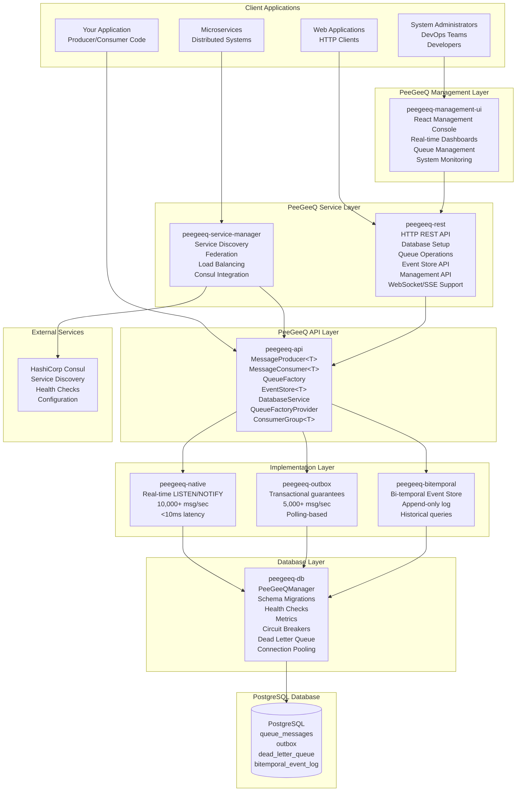
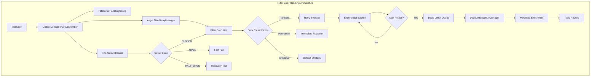
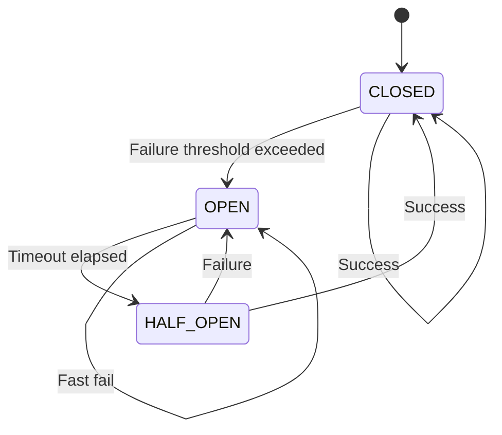

# PeeGeeQ Architecture & API Reference
#### © Mark Andrew Ray-Smith Cityline Ltd 2025
#### Version 0.9

**Technical reference documentation for PeeGeeQ system architecture, API specifications, and integration patterns.**

This document serves as a comprehensive technical reference for developers, architects, and system integrators who need detailed information about PeeGeeQ's internal architecture, API contracts, and integration capabilities.

> **New to PeeGeeQ?** Start with the [PeeGeeQ Complete Guide](PEEGEEQ_COMPLETE_GUIDE.md) for step-by-step tutorials and progressive learning.

## Document Scope

This reference covers:
- **System Architecture**: Internal design, module relationships, and data flow
- **API Specifications**: Complete interface definitions with method signatures
- **Database Schema**: Table structures, indexes, and relationships
- **Performance Characteristics**: Benchmarks, throughput, and latency metrics
- **Integration Patterns**: Technical integration examples for various platforms
- **Design Patterns**: Architectural patterns and implementation details

## Table of Contents

1. [System Architecture](#system-architecture)
2. [Module Structure](#module-structure)
3. [Core API Reference](#core-api-reference)
4. [Filter Error Handling Architecture](#filter-error-handling-architecture)
5. [Filter Error Handling API Reference](#filter-error-handling-api-reference)
6. [Database Schema](#database-schema)
7. [Design Patterns](#design-patterns)
8. [REST API Reference](#rest-api-reference)
9. [Management Console Architecture](#management-console-architecture)
10. [Performance Characteristics](#performance-characteristics)
11. [Integration Patterns](#integration-patterns)

## Related Documentation

- **[PeeGeeQ Complete Guide](PEEGEEQ_COMPLETE_GUIDE.md)** - Progressive learning guide with tutorials and examples
- **[Getting Started Tutorial](PEEGEEQ_COMPLETE_GUIDE.md#your-first-message-hello-world)** - Your first PeeGeeQ application
- **[Configuration Guide](PEEGEEQ_COMPLETE_GUIDE.md#configuration-management)** - Production configuration and tuning
- **[Troubleshooting Guide](PEEGEEQ_COMPLETE_GUIDE.md#common-issues--solutions)** - Common issues and solutions

## System Architecture

### High-Level Architecture

PeeGeeQ is built as a layered architecture that leverages PostgreSQL's advanced features for enterprise-grade messaging:



### Core Design Principles

1. **PostgreSQL-Native**: Leverages PostgreSQL's LISTEN/NOTIFY, advisory locks, and ACID transactions
2. **Type Safety**: Strongly typed APIs with generic support
3. **Pluggable Architecture**: Multiple queue implementations via factory pattern
4. **Production Ready**: Built-in health checks, metrics, circuit breakers, and monitoring
5. **Zero Dependencies**: No external message brokers required
6. **Transactional Consistency**: Full ACID compliance with business data

## Module Structure

PeeGeeQ consists of 9 core modules organized in a layered architecture:

### 1. peegeeq-api (Core Interfaces)

**Purpose**: Defines core contracts and interfaces
**Key Components**:
- `MessageProducer<T>` - Message publishing interface
- `MessageConsumer<T>` - Message consumption interface
- `Message<T>` - Message abstraction
- `EventStore<T>` - Bi-temporal event store interface
- `BiTemporalEvent<T>` - Bi-temporal event abstraction
- `DatabaseService` - Database operations interface
- `QueueFactoryProvider` - Factory provider interface

### 2. peegeeq-db (Database Management)

**Purpose**: Database infrastructure and management
**Key Components**:
- `PeeGeeQManager` - Main entry point and lifecycle management
- `PgDatabaseService` - Database operations and connection management
- `PeeGeeQDatabaseSetupService` - Database schema setup and initialization
- `DatabaseTemplateManager` - SQL template management
- `HealthCheckManager` - Multi-component health monitoring
- `PeeGeeQMetrics` - Metrics collection and reporting
- `CircuitBreakerManager` - Resilience patterns
- `DeadLetterQueueManager` - Failed message handling
- `StuckMessageRecoveryManager` - Automatic recovery of stuck messages

### 3. peegeeq-native (High-Performance Implementation)

**Purpose**: Real-time LISTEN/NOTIFY based messaging
**Key Components**:
- `PgNativeQueueFactory` - Factory for native queues
- `PgNativeQueueProducer<T>` - High-performance message producer
- `PgNativeQueueConsumer<T>` - Real-time message consumer
- `PgConnectionProvider` - Optimized connection management

**Performance**: 10,000+ msg/sec, <10ms latency

### 4. peegeeq-outbox (Transactional Implementation)

**Purpose**: Transactional outbox pattern implementation
**Key Components**:
- `OutboxFactory` - Factory for outbox queues
- `OutboxProducer<T>` - Transactional message producer
- `OutboxConsumer<T>` - Polling-based message consumer
- `StuckMessageRecoveryManager` - Automatic recovery of stuck messages

**Performance**: 5,000+ msg/sec, ACID compliance

### 5. peegeeq-bitemporal (Event Store)

**Purpose**: Bi-temporal event sourcing capabilities
**Key Components**:
- `BiTemporalEventStore<T>` - Main event store interface
- `PgBiTemporalEventStore<T>` - PostgreSQL implementation
- `BiTemporalEvent<T>` - Event with temporal metadata
- `EventQuery` - Query builder for temporal queries

### 6. peegeeq-rest (HTTP API)

**Purpose**: HTTP REST API server
**Key Components**:
- `PeeGeeQRestServer` - Vert.x based HTTP server
- `DatabaseSetupService` - Database setup via REST
- `QueueHandler` - Queue operations via HTTP
- `EventStoreHandler` - Event store operations via HTTP
- `WebSocketHandler` - WebSocket streaming support
- `ServerSentEventsHandler` - SSE streaming support
- `ConsumerGroupHandler` - Consumer group management
- `ManagementApiHandler` - Management API operations

### 7. peegeeq-service-manager (Service Discovery)

**Purpose**: Service discovery and federation
**Key Components**:
- `PeeGeeQServiceManager` - Main service manager
- `ConsulServiceDiscovery` - Consul integration
- `FederatedManagementHandler` - Multi-instance coordination
- `LoadBalancingStrategy` - Request routing
- `LoadBalancer` - Load balancing implementation
- `ConnectionRouter` - Connection routing

### 8. peegeeq-management-ui (Management Console)

**Purpose**: Web-based administration interface for PeeGeeQ system management
**Key Components**:
- `React Management Console` - Modern web interface inspired by RabbitMQ's admin console
- `System Overview Dashboard` - Real-time metrics and system health monitoring
- `Queue Management Interface` - Complete CRUD operations for queues
- `Consumer Group Management` - Visual consumer group coordination
- `Event Store Explorer` - Advanced event querying interface
- `Message Browser` - Visual message inspection and debugging
- `Real-time Monitoring` - Live dashboards with WebSocket updates
- `Developer Portal` - Interactive API documentation and testing

**Technology Stack**: React 18 + TypeScript + Ant Design + Vite
**Integration**: Served by PeeGeeQ REST server with management API endpoints

### 9. peegeeq-examples (Demonstrations)

**Purpose**: Comprehensive example applications and demonstrations covering all PeeGeeQ features

**Core Examples**:
- `PeeGeeQSelfContainedDemo` - Complete self-contained demonstration
- `PeeGeeQExample` - Basic producer/consumer patterns
- `BiTemporalEventStoreExample` - Event sourcing with temporal queries
- `ConsumerGroupExample` - Load balancing and consumer groups
- `RestApiExample` - HTTP interface usage
- `ServiceDiscoveryExample` - Multi-instance deployment

**Advanced Examples (Enhanced)**:
- `MessagePriorityExample` - Priority-based message processing with real-world scenarios
- `EnhancedErrorHandlingExample` - Retry strategies, circuit breakers, poison message handling
- `SecurityConfigurationExample` - SSL/TLS, certificate management, compliance features
- `PerformanceTuningExample` - Connection pooling, throughput optimization, memory tuning
- `IntegrationPatternsExample` - Request-reply, pub-sub, message routing, distributed patterns

**Specialized Examples**:
- `TransactionalBiTemporalExample` - Combining transactions with event sourcing
- `RestApiStreamingExample` - WebSocket and Server-Sent Events
- `NativeVsOutboxComparisonExample` - Performance comparison and use case guidance
- `AdvancedConfigurationExample` - Production configuration patterns
- `MultiConfigurationExample` - Multi-environment setup
- `SimpleConsumerGroupTest` - Basic consumer group testing

**Coverage**: 95-98% of PeeGeeQ functionality with production-ready patterns

## Core API Reference

### Message Interfaces

#### MessageProducer<T>
```java
public interface MessageProducer<T> extends AutoCloseable {
    /**
     * Send a message with the given payload
     */
    CompletableFuture<Void> send(T payload);

    /**
     * Send a message with the given payload and headers
     */
    CompletableFuture<Void> send(T payload, Map<String, String> headers);

    /**
     * Send a message with the given payload, headers, and correlation ID
     */
    CompletableFuture<Void> send(T payload, Map<String, String> headers, String correlationId);

    /**
     * Send a message with the given payload, headers, correlation ID, and message group
     */
    CompletableFuture<Void> send(T payload, Map<String, String> headers, String correlationId, String messageGroup);

    /**
     * Close the producer and release resources
     */
    @Override
    void close();
}
```

**Design Note: Why CompletableFuture?**

All `MessageProducer` methods return `CompletableFuture<Void>` rather than Vert.x `Future<Void>`. This is a deliberate design choice for interoperability:

- **Interoperability**: `CompletableFuture` is the Java standard and works seamlessly in both Spring Boot and Vert.x applications
- **Familiar API**: Most Java developers already know `CompletableFuture` methods
- **Simplicity**: Avoids doubling the API surface area with separate `Future`-returning methods
- **No Performance Penalty**: Works directly in Vert.x handlers without conversion overhead

For Vert.x developers composing with other `Future` operations, conversion is trivial and only needed in specific scenarios (see [PEEGEEQ_TRANSACTIONAL_OUTBOX_PATTERNS_GUIDE.md](PEEGEEQ_TRANSACTIONAL_OUTBOX_PATTERNS_GUIDE.md#why-completablefuture-instead-of-vertx-future) for details).

#### MessageConsumer<T>
```java
public interface MessageConsumer<T> extends AutoCloseable {
    /**
     * Subscribe to messages with the given handler
     */
    void subscribe(MessageHandler<T> handler);

    /**
     * Unsubscribe from message processing
     */
    void unsubscribe();

    /**
     * Close the consumer and release resources
     */
    @Override
    void close();
}
```

#### Message<T>
```java
public interface Message<T> {
    /**
     * Unique message identifier
     */
    String getId();
    
    /**
     * Message payload
     */
    T getPayload();
    
    /**
     * Message headers
     */
    Map<String, String> getHeaders();
    
    /**
     * Message priority (0-9, higher = more priority)
     */
    int getPriority();
    
    /**
     * Message creation timestamp
     */
    Instant getCreatedAt();
    
    /**
     * Correlation ID for message tracking
     */
    String getCorrelationId();
}
```

### Queue Factory Pattern

#### QueueFactoryProvider
```java
public interface QueueFactoryProvider {
    /**
     * Get the singleton instance
     */
    static QueueFactoryProvider getInstance();

    /**
     * Create a queue factory of the specified type with configuration
     */
    QueueFactory createFactory(String implementationType,
                              DatabaseService databaseService,
                              Map<String, Object> configuration);

    /**
     * Create a queue factory of the specified type with default configuration
     */
    QueueFactory createFactory(String implementationType, DatabaseService databaseService);

    /**
     * Get the set of supported implementation types
     */
    Set<String> getSupportedTypes();

    /**
     * Create a queue factory using a named configuration template
     */
    default QueueFactory createNamedFactory(String implementationType,
                                          String configurationName,
                                          DatabaseService databaseService,
                                          Map<String, Object> additionalConfig);
}
```

#### QueueFactory
```java
public interface QueueFactory extends AutoCloseable {
    /**
     * Create a message producer for the specified topic
     */
    <T> MessageProducer<T> createProducer(String topic, Class<T> payloadType);

    /**
     * Create a message consumer for the specified topic
     */
    <T> MessageConsumer<T> createConsumer(String topic, Class<T> payloadType);

    /**
     * Create a consumer group for the specified topic
     */
    <T> ConsumerGroup<T> createConsumerGroup(String groupName, String topic, Class<T> payloadType);

    /**
     * Get the implementation type of this factory
     */
    String getImplementationType();

    /**
     * Check if the factory is healthy and ready to create queues
     */
    boolean isHealthy();

    /**
     * Close factory and release resources
     */
    @Override
    void close() throws Exception;
}
```

### Database Service

#### DatabaseService
```java
/**
 * Database operations using Vert.x 5.x reactive patterns.
 * External API uses CompletableFuture for non-Vert.x consumers.
 */
public interface DatabaseService extends AutoCloseable {
    /**
     * Initializes the database service
     */
    CompletableFuture<Void> initialize();

    /**
     * Starts the database service
     */
    CompletableFuture<Void> start();

    /**
     * Stops the database service
     */
    CompletableFuture<Void> stop();

    /**
     * Reactive convenience method for initialize()
     * For Vert.x consumers who prefer Future-based APIs
     */
    default Future<Void> initializeReactive() {
        return Future.fromCompletionStage(initialize());
    }

    /**
     * Reactive convenience method for start()
     */
    default Future<Void> startReactive() {
        return Future.fromCompletionStage(start());
    }

    /**
     * Reactive convenience method for stop()
     */
    default Future<Void> stopReactive() {
        return Future.fromCompletionStage(stop());
    }

    /**
     * Check if the service is running
     */
    boolean isRunning();

    /**
     * Check if the database is healthy
     */
    boolean isHealthy();

    /**
     * Get the connection provider for database operations
     */
    ConnectionProvider getConnectionProvider();

    /**
     * Get the metrics provider for monitoring
     */
    MetricsProvider getMetricsProvider();

    /**
     * Run database migrations
     */
    CompletableFuture<Void> runMigrations();

    /**
     * Perform a health check
     */
    CompletableFuture<Boolean> performHealthCheck();
}
```

### Event Store API

#### EventStore<T>
```java
public interface EventStore<T> {
    /**
     * Append an event to the store
     */
    Future<BiTemporalEvent<T>> appendEvent(String aggregateId, T event);
    
    /**
     * Append an event with metadata
     */
    Future<BiTemporalEvent<T>> appendEvent(String aggregateId, T event, 
                                          Map<String, String> metadata);
    
    /**
     * Query events by aggregate ID
     */
    Future<List<BiTemporalEvent<T>>> queryByAggregateId(String aggregateId);
    
    /**
     * Query events by time range
     */
    Future<List<BiTemporalEvent<T>>> queryByTimeRange(Instant from, Instant to);
    
    /**
     * Query events as of a specific transaction time
     */
    Future<List<BiTemporalEvent<T>>> queryAsOfTransactionTime(Instant asOf);
    
    /**
     * Correct an existing event
     */
    Future<BiTemporalEvent<T>> correctEvent(String eventId, T correctedEvent, 
                                           String reason);
}
```

#### BiTemporalEvent<T>
```java
public interface BiTemporalEvent<T> {
    /**
     * Unique event identifier
     */
    String getEventId();

    /**
     * Event type identifier
     */
    String getEventType();

    /**
     * Event payload
     */
    T getPayload();

    /**
     * Valid time (business time) - when the event actually happened
     */
    Instant getValidTime();

    /**
     * Transaction time (system time) - when the event was recorded
     */
    Instant getTransactionTime();

    /**
     * Event version (for corrections)
     */
    long getVersion();

    /**
     * Previous version ID (for tracking corrections)
     */
    String getPreviousVersionId();

    /**
     * Event headers/metadata
     */
    Map<String, String> getHeaders();

    /**
     * Correlation ID for tracking related events
     */
    String getCorrelationId();

    /**
     * Aggregate identifier for grouping related events
     */
    String getAggregateId();

    /**
     * Whether this is a correction of a previous event
     */
    boolean isCorrection();

    /**
     * Reason for the correction (if applicable)
     */
    String getCorrectionReason();
}
```

### Configuration Classes

#### PeeGeeQConfiguration
```java
public class PeeGeeQConfiguration {
    // Database settings
    private String host = "localhost";
    private int port = 5432;
    private String database;
    private String username;
    private String password;
    
    // Connection pool settings
    private int maxPoolSize = 20;
    private int minPoolSize = 5;
    private Duration connectionTimeout = Duration.ofSeconds(30);
    
    // Queue settings
    private Duration visibilityTimeout = Duration.ofSeconds(30);
    private int maxRetries = 3;
    private boolean deadLetterEnabled = true;
    
    // Health check settings
    private boolean healthEnabled = true;
    private Duration healthInterval = Duration.ofSeconds(30);
    
    // Metrics settings
    private boolean metricsEnabled = true;
    private boolean jvmMetricsEnabled = true;
    
    // Builder pattern and factory methods
    public static Builder builder() { return new Builder(); }
    public static PeeGeeQConfiguration fromProperties(String filename);
    public static PeeGeeQConfiguration fromProperties(Properties properties);
}
```

#### ConsumerConfig
```java
public class ConsumerConfig {
    private int batchSize = 10;
    private Duration pollInterval = Duration.ofSeconds(1);
    private Duration visibilityTimeout = Duration.ofSeconds(30);
    private int maxRetries = 3;
    private boolean autoAcknowledge = true;
    private MessageFilter filter;
    private String consumerGroup;
    
    // Builder pattern
    public static Builder builder() { return new Builder(); }
}
```

## Filter Error Handling Architecture

### Overview

The PeeGeeQ Outbox system provides enterprise-grade filter error handling with sophisticated recovery patterns designed to maintain message reliability while providing graceful degradation under failure conditions. This system implements multiple layers of protection including error classification, circuit breakers, async retry mechanisms, and dead letter queue integration.

### Core Components



### Component Responsibilities

| Component | Responsibility |
|-----------|----------------|
| `FilterErrorHandlingConfig` | Configuration and error classification rules |
| `AsyncFilterRetryManager` | Non-blocking retry execution with backoff |
| `FilterCircuitBreaker` | Circuit breaker pattern implementation |
| `DeadLetterQueueManager` | Dead letter queue routing and management |
| `OutboxConsumerGroupMember` | Integration and orchestration |

### Error Classification System

The system automatically classifies errors into three categories:

#### 1. Transient Errors
**Characteristics**: Temporary failures that may succeed on retry
**Examples**: Network timeouts, connection failures, temporary resource unavailability
**Default Strategy**: `RETRY_THEN_REJECT` or `RETRY_THEN_DEAD_LETTER`

```java
// Configuration for transient errors
FilterErrorHandlingConfig config = FilterErrorHandlingConfig.builder()
    .addTransientErrorPattern("timeout")
    .addTransientErrorPattern("connection")
    .addTransientErrorPattern("network")
    .addTransientExceptionType(SocketTimeoutException.class)
    .addTransientExceptionType(ConnectException.class)
    .build();
```

#### 2. Permanent Errors
**Characteristics**: Persistent failures that won't succeed on retry
**Examples**: Invalid data format, authorization failures, malformed messages
**Default Strategy**: `REJECT_IMMEDIATELY` or `DEAD_LETTER_IMMEDIATELY`

```java
// Configuration for permanent errors
FilterErrorHandlingConfig config = FilterErrorHandlingConfig.builder()
    .addPermanentErrorPattern("invalid")
    .addPermanentErrorPattern("unauthorized")
    .addPermanentErrorPattern("malformed")
    .addPermanentExceptionType(IllegalArgumentException.class)
    .addPermanentExceptionType(SecurityException.class)
    .build();
```

#### 3. Unknown Errors
**Characteristics**: Errors that don't match predefined patterns
**Default Strategy**: Configurable via `defaultStrategy` setting

### Recovery Strategies

#### 1. Immediate Rejection (`REJECT_IMMEDIATELY`)
**Use Case**: Permanent errors or high-performance scenarios
**Behavior**: Rejects message immediately without retries
**Performance**: Highest throughput, lowest latency

#### 2. Retry Then Reject (`RETRY_THEN_REJECT`)
**Use Case**: Transient errors with graceful degradation
**Behavior**: Retries with exponential backoff, then rejects if max retries exceeded
**Performance**: Moderate throughput, higher reliability

#### 3. Retry Then Dead Letter (`RETRY_THEN_DEAD_LETTER`)
**Use Case**: Critical messages that must not be lost
**Behavior**: Retries with exponential backoff, then sends to DLQ if max retries exceeded
**Performance**: Lower throughput, highest reliability

#### 4. Dead Letter Immediately (`DEAD_LETTER_IMMEDIATELY`)
**Use Case**: Permanent errors requiring manual intervention
**Behavior**: Sends message directly to DLQ without retries
**Performance**: High throughput, immediate error isolation

### Circuit Breaker Pattern

The circuit breaker implements a three-state machine:



#### State Behaviors

**CLOSED State**
- Normal operation: All requests pass through to filter
- Failure tracking: Counts failures and requests
- Transition condition: Opens when failure threshold exceeded

**OPEN State**
- Fast fail: Rejects requests without calling filter
- Performance protection: Prevents cascading failures
- Transition condition: Transitions to HALF_OPEN after timeout

**HALF_OPEN State**
- Recovery testing: Allows single request to test filter
- Success: Transitions to CLOSED and resets counters
- Failure: Transitions back to OPEN

### Dead Letter Queue Integration

The system provides comprehensive DLQ support with:

- **Pluggable DLQ interface** for different message queue implementations
- **Metadata enrichment** with error classification, attempts, stack traces
- **Topic routing** based on error types and message characteristics
- **Comprehensive monitoring** with success rates and failure tracking
- **Graceful fallback** when DLQ operations fail

### Performance Characteristics

| Scenario | Throughput (msg/sec) | Latency Impact | Resource Usage |
|----------|---------------------|----------------|----------------|
| Normal Operation | >1000 | Minimal | Low |
| Filter Exceptions (20%) | >500 | Low | Medium |
| Circuit Breaker Open | >2000 | Minimal | Very Low |
| Async Retries Active | >300 | Medium | Medium |
| DLQ Operations | >100 | High | High |

## Database Schema

### Core Tables

#### queue_messages
```sql
CREATE TABLE queue_messages (
    id BIGSERIAL PRIMARY KEY,
    topic VARCHAR(255) NOT NULL,
    payload JSONB NOT NULL,
    visible_at TIMESTAMP WITH TIME ZONE DEFAULT NOW(),
    created_at TIMESTAMP WITH TIME ZONE DEFAULT NOW(),
    lock_id BIGINT,
    lock_until TIMESTAMP WITH TIME ZONE,
    retry_count INT DEFAULT 0,
    max_retries INT DEFAULT 3,
    status VARCHAR(50) DEFAULT 'AVAILABLE' CHECK (status IN ('AVAILABLE', 'LOCKED', 'PROCESSED', 'FAILED', 'DEAD_LETTER')),
    headers JSONB DEFAULT '{}',
    error_message TEXT,
    correlation_id VARCHAR(255),
    message_group VARCHAR(255),
    priority INT DEFAULT 5 CHECK (priority BETWEEN 1 AND 10)
);

-- Indexes
CREATE INDEX idx_queue_messages_topic_visible ON queue_messages(topic, visible_at, status);
CREATE INDEX idx_queue_messages_lock ON queue_messages(lock_id) WHERE lock_id IS NOT NULL;
CREATE INDEX idx_queue_messages_status ON queue_messages(status, created_at);
CREATE INDEX idx_queue_messages_correlation_id ON queue_messages(correlation_id) WHERE correlation_id IS NOT NULL;
CREATE INDEX idx_queue_messages_priority ON queue_messages(priority, created_at);
```

#### outbox
```sql
CREATE TABLE outbox (
    id BIGSERIAL PRIMARY KEY,
    topic VARCHAR(255) NOT NULL,
    payload JSONB NOT NULL,
    created_at TIMESTAMP WITH TIME ZONE DEFAULT NOW(),
    processed_at TIMESTAMP WITH TIME ZONE,
    processing_started_at TIMESTAMP WITH TIME ZONE,
    status VARCHAR(50) DEFAULT 'PENDING' CHECK (status IN ('PENDING', 'PROCESSING', 'COMPLETED', 'FAILED', 'DEAD_LETTER')),
    retry_count INT DEFAULT 0,
    max_retries INT DEFAULT 3,
    next_retry_at TIMESTAMP WITH TIME ZONE,
    version INT DEFAULT 0,
    headers JSONB DEFAULT '{}',
    error_message TEXT,
    correlation_id VARCHAR(255),
    message_group VARCHAR(255),
    priority INT DEFAULT 5 CHECK (priority BETWEEN 1 AND 10)
);

-- Indexes
CREATE INDEX idx_outbox_status_created ON outbox(status, created_at);
CREATE INDEX idx_outbox_next_retry ON outbox(status, next_retry_at) WHERE status = 'FAILED';
CREATE INDEX idx_outbox_topic ON outbox(topic);
CREATE INDEX idx_outbox_correlation_id ON outbox(correlation_id) WHERE correlation_id IS NOT NULL;
CREATE INDEX idx_outbox_message_group ON outbox(message_group) WHERE message_group IS NOT NULL;
CREATE INDEX idx_outbox_priority ON outbox(priority, created_at);
```

#### bitemporal_event_log
```sql
CREATE TABLE bitemporal_event_log (
    -- Primary key and identity
    id BIGSERIAL PRIMARY KEY,
    event_id VARCHAR(255) NOT NULL,
    event_type VARCHAR(255) NOT NULL,

    -- Bi-temporal dimensions
    valid_time TIMESTAMP WITH TIME ZONE NOT NULL,
    transaction_time TIMESTAMP WITH TIME ZONE DEFAULT NOW() NOT NULL,

    -- Event data
    payload JSONB NOT NULL,
    headers JSONB DEFAULT '{}',

    -- Versioning and corrections
    version BIGINT DEFAULT 1 NOT NULL,
    previous_version_id VARCHAR(255),
    is_correction BOOLEAN DEFAULT FALSE NOT NULL,
    correction_reason TEXT,

    -- Grouping and correlation
    correlation_id VARCHAR(255),
    aggregate_id VARCHAR(255),

    -- Metadata
    created_at TIMESTAMP WITH TIME ZONE DEFAULT NOW() NOT NULL
);

-- Comprehensive indexing strategy
CREATE INDEX idx_bitemporal_valid_time ON bitemporal_event_log(valid_time);
CREATE INDEX idx_bitemporal_transaction_time ON bitemporal_event_log(transaction_time);
CREATE INDEX idx_bitemporal_valid_transaction ON bitemporal_event_log(valid_time, transaction_time);
CREATE INDEX idx_bitemporal_event_id ON bitemporal_event_log(event_id);
CREATE INDEX idx_bitemporal_event_type ON bitemporal_event_log(event_type);
CREATE INDEX idx_bitemporal_aggregate_id ON bitemporal_event_log(aggregate_id) WHERE aggregate_id IS NOT NULL;
CREATE INDEX idx_bitemporal_correlation_id ON bitemporal_event_log(correlation_id) WHERE correlation_id IS NOT NULL;
CREATE INDEX idx_bitemporal_version_chain ON bitemporal_event_log(event_id, version);
CREATE INDEX idx_bitemporal_corrections ON bitemporal_event_log(is_correction, transaction_time) WHERE is_correction = TRUE;
CREATE INDEX idx_bitemporal_latest_events ON bitemporal_event_log(event_type, transaction_time DESC) WHERE is_correction = FALSE;

-- GIN indexes for JSONB queries
CREATE INDEX idx_bitemporal_payload_gin ON bitemporal_event_log USING GIN(payload);
CREATE INDEX idx_bitemporal_headers_gin ON bitemporal_event_log USING GIN(headers);
```

#### dead_letter_queue
```sql
CREATE TABLE dead_letter_queue (
    id BIGSERIAL PRIMARY KEY,
    original_table VARCHAR(50) NOT NULL,
    original_id BIGINT NOT NULL,
    topic VARCHAR(255) NOT NULL,
    payload JSONB NOT NULL,
    original_created_at TIMESTAMP WITH TIME ZONE NOT NULL,
    failed_at TIMESTAMP WITH TIME ZONE DEFAULT NOW(),
    failure_reason TEXT NOT NULL,
    retry_count INT NOT NULL,
    headers JSONB DEFAULT '{}',
    correlation_id VARCHAR(255),
    message_group VARCHAR(255)
);

-- Indexes
CREATE INDEX idx_dlq_original ON dead_letter_queue(original_table, original_id);
CREATE INDEX idx_dlq_topic ON dead_letter_queue(topic);
CREATE INDEX idx_dlq_failed_at ON dead_letter_queue(failed_at);
```

#### Additional Tables

##### outbox_consumer_groups
```sql
CREATE TABLE outbox_consumer_groups (
    id BIGSERIAL PRIMARY KEY,
    outbox_message_id BIGINT NOT NULL REFERENCES outbox(id) ON DELETE CASCADE,
    consumer_group_name VARCHAR(255) NOT NULL,
    status VARCHAR(50) DEFAULT 'PENDING' CHECK (status IN ('PENDING', 'PROCESSING', 'COMPLETED', 'FAILED')),
    processed_at TIMESTAMP WITH TIME ZONE,
    processing_started_at TIMESTAMP WITH TIME ZONE,
    retry_count INT DEFAULT 0,
    error_message TEXT,
    created_at TIMESTAMP WITH TIME ZONE DEFAULT NOW(),

    UNIQUE(outbox_message_id, consumer_group_name)
);
```

##### queue_metrics & connection_pool_metrics
```sql
CREATE TABLE queue_metrics (
    id BIGSERIAL PRIMARY KEY,
    metric_name VARCHAR(100) NOT NULL,
    metric_value DOUBLE PRECISION NOT NULL,
    tags JSONB DEFAULT '{}',
    timestamp TIMESTAMP WITH TIME ZONE DEFAULT NOW()
);

CREATE TABLE connection_pool_metrics (
    id BIGSERIAL PRIMARY KEY,
    pool_name VARCHAR(100) NOT NULL,
    active_connections INT NOT NULL,
    idle_connections INT NOT NULL,
    total_connections INT NOT NULL,
    pending_threads INT NOT NULL,
    timestamp TIMESTAMP WITH TIME ZONE DEFAULT NOW()
);
```

## Filter Error Handling API Reference

### FilterErrorHandlingConfig

The central configuration class for filter error handling behavior.

#### Constructor
```java
// Use builder pattern for configuration
FilterErrorHandlingConfig config = FilterErrorHandlingConfig.builder()
    .defaultStrategy(FilterErrorStrategy.RETRY_THEN_REJECT)
    .maxRetries(3)
    .build();
```

#### Key Methods

##### Error Classification Configuration
```java
// Add error patterns for classification
public Builder addTransientErrorPattern(String pattern)
public Builder addPermanentErrorPattern(String pattern)
public Builder addTransientExceptionType(Class<? extends Exception> exceptionType)
public Builder addPermanentExceptionType(Class<? extends Exception> exceptionType)

// Example usage
FilterErrorHandlingConfig config = FilterErrorHandlingConfig.builder()
    .addTransientErrorPattern("timeout")
    .addTransientErrorPattern("connection")
    .addPermanentErrorPattern("invalid")
    .addPermanentExceptionType(IllegalArgumentException.class)
    .build();
```

##### Strategy Configuration
```java
// Set default error handling strategy
public Builder defaultStrategy(FilterErrorStrategy strategy)

// Configure retry behavior
public Builder maxRetries(int maxRetries)
public Builder initialRetryDelay(Duration delay)
public Builder maxRetryDelay(Duration delay)
public Builder retryBackoffMultiplier(double multiplier)

// Example usage
FilterErrorHandlingConfig config = FilterErrorHandlingConfig.builder()
    .defaultStrategy(FilterErrorStrategy.RETRY_THEN_DEAD_LETTER)
    .maxRetries(5)
    .initialRetryDelay(Duration.ofMillis(100))
    .retryBackoffMultiplier(2.0)
    .build();
```

##### Circuit Breaker Configuration
```java
// Enable/disable circuit breaker
public Builder circuitBreakerEnabled(boolean enabled)

// Configure circuit breaker thresholds
public Builder circuitBreakerFailureThreshold(int threshold)
public Builder circuitBreakerMinimumRequests(int minimum)
public Builder circuitBreakerTimeout(Duration timeout)

// Example usage
FilterErrorHandlingConfig config = FilterErrorHandlingConfig.builder()
    .circuitBreakerEnabled(true)
    .circuitBreakerFailureThreshold(5)
    .circuitBreakerMinimumRequests(10)
    .circuitBreakerTimeout(Duration.ofMinutes(1))
    .build();
```

##### Dead Letter Queue Configuration
```java
// Enable/disable dead letter queue
public Builder deadLetterQueueEnabled(boolean enabled)
public Builder deadLetterQueueTopic(String topic)

// Example usage
FilterErrorHandlingConfig config = FilterErrorHandlingConfig.builder()
    .deadLetterQueueEnabled(true)
    .deadLetterQueueTopic("error-messages")
    .build();
```

#### Error Classification Methods
```java
// Classify an exception based on configured rules
public ErrorClassification classifyError(Exception exception)

// Get strategy for a specific error classification
public FilterErrorStrategy getStrategyForError(ErrorClassification classification)

// Example usage
ErrorClassification classification = config.classifyError(exception);
FilterErrorStrategy strategy = config.getStrategyForError(classification);
```

#### Predefined Configurations
```java
// Default configuration for general use
public static FilterErrorHandlingConfig defaultConfig()

// Configuration optimized for testing scenarios
public static FilterErrorHandlingConfig testingConfig()

// Example usage
FilterErrorHandlingConfig defaultConfig = FilterErrorHandlingConfig.defaultConfig();
FilterErrorHandlingConfig testConfig = FilterErrorHandlingConfig.testingConfig();
```

### AsyncFilterRetryManager

Manages asynchronous retry operations for filter errors.

#### Constructor
```java
public AsyncFilterRetryManager(String filterId, FilterErrorHandlingConfig config)

// Example usage
AsyncFilterRetryManager retryManager = new AsyncFilterRetryManager(
    "payment-filter", config);
```

#### Core Methods

##### Execute Filter with Retry
```java
public <T> CompletableFuture<FilterResult> executeFilterWithRetry(
    Message<T> message,
    Predicate<Message<T>> filter,
    FilterCircuitBreaker circuitBreaker)

// Example usage
CompletableFuture<FilterResult> result = retryManager.executeFilterWithRetry(
    message, filter, circuitBreaker);

result.thenAccept(filterResult -> {
    switch (filterResult.getStatus()) {
        case ACCEPTED:
            processMessage(message);
            break;
        case REJECTED:
            logRejection(message, filterResult.getReason());
            break;
        case DEAD_LETTER:
            logDeadLetter(message, filterResult.getReason());
            break;
    }
});
```

##### Metrics and Management
```java
// Get current retry metrics
public RetryMetrics getMetrics()

// Shutdown the retry manager
public void shutdown()

// Example usage
RetryMetrics metrics = retryManager.getMetrics();
logger.info("Retry success rate: {:.2f}%", metrics.getSuccessRate() * 100);

// Cleanup on application shutdown
retryManager.shutdown();
```

### FilterCircuitBreaker

Implements the circuit breaker pattern for filter operations.

#### Constructor
```java
public FilterCircuitBreaker(String filterId, FilterErrorHandlingConfig config)

// Example usage
FilterCircuitBreaker circuitBreaker = new FilterCircuitBreaker(
    "user-validation-filter", config);
```

#### Core Methods

##### Request Management
```java
// Check if circuit breaker allows request
public boolean allowRequest()

// Record successful operation
public void recordSuccess()

// Record failed operation
public void recordFailure()

// Example usage
if (circuitBreaker.allowRequest()) {
    try {
        boolean result = filter.test(message);
        circuitBreaker.recordSuccess();
        return result;
    } catch (Exception e) {
        circuitBreaker.recordFailure();
        throw e;
    }
} else {
    // Circuit is open, reject immediately
    return false;
}
```

### DeadLetterQueueManager

Manages dead letter queue operations for failed messages.

#### Constructor
```java
public DeadLetterQueueManager(FilterErrorHandlingConfig config)

// Example usage
DeadLetterQueueManager dlqManager = new DeadLetterQueueManager(config);
```

#### Core Methods

##### Send to Dead Letter Queue
```java
public <T> CompletableFuture<Void> sendToDeadLetter(
    Message<T> originalMessage,
    String filterId,
    String reason,
    int attempts,
    FilterErrorHandlingConfig.ErrorClassification errorClassification,
    Exception originalException)

// Example usage
dlqManager.sendToDeadLetter(
    message,
    "payment-filter",
    "Invalid payment format",
    3,
    ErrorClassification.PERMANENT,
    originalException
).thenRun(() -> {
    logger.info("Message {} sent to dead letter queue", message.getId());
}).exceptionally(throwable -> {
    logger.error("Failed to send message to DLQ: {}", throwable.getMessage());
    return null;
});
```

### Enums and Constants

#### FilterErrorStrategy
```java
public enum FilterErrorStrategy {
    REJECT_IMMEDIATELY,        // Reject without retries
    RETRY_THEN_REJECT,        // Retry, then reject if max retries exceeded
    RETRY_THEN_DEAD_LETTER,   // Retry, then send to DLQ if max retries exceeded
    DEAD_LETTER_IMMEDIATELY   // Send to DLQ without retries
}
```

#### ErrorClassification
```java
public enum ErrorClassification {
    TRANSIENT,    // Temporary errors that may succeed on retry
    PERMANENT,    // Persistent errors that won't succeed on retry
    UNKNOWN       // Errors that don't match predefined patterns
}
```

### StuckMessageRecoveryManager

Manages automatic recovery of messages stuck in PROCESSING state due to consumer crashes.

#### Constructor
```java
public StuckMessageRecoveryManager(DataSource dataSource, Duration processingTimeout, boolean enabled)

// Example usage with custom settings
StuckMessageRecoveryManager recoveryManager = new StuckMessageRecoveryManager(
    dataSource,
    Duration.ofMinutes(5),  // Processing timeout
    true                    // Enabled
);

// Example usage with default settings (5 minutes timeout, enabled)
StuckMessageRecoveryManager recoveryManager = new StuckMessageRecoveryManager(dataSource);
```

#### Core Methods

##### Recover Stuck Messages
```java
public int recoverStuckMessages()

// Example usage
int recoveredCount = recoveryManager.recoverStuckMessages();
System.out.println("Recovered " + recoveredCount + " stuck messages");
```

##### Get Recovery Statistics
```java
public RecoveryStats getRecoveryStats()

// Example usage
StuckMessageRecoveryManager.RecoveryStats stats = recoveryManager.getRecoveryStats();
System.out.println("Stuck messages: " + stats.getStuckMessagesCount());
System.out.println("Total processing: " + stats.getTotalProcessingCount());
System.out.println("Recovery enabled: " + stats.isEnabled());
```

#### RecoveryStats Class
```java
public static class RecoveryStats {
    public int getStuckMessagesCount()      // Number of currently stuck messages
    public int getTotalProcessingCount()    // Total messages in PROCESSING state
    public boolean isEnabled()              // Whether recovery is enabled
}
```

#### Configuration Integration
```java
// Recovery manager is automatically created and managed by PeeGeeQManager
PeeGeeQManager manager = new PeeGeeQManager(config);
StuckMessageRecoveryManager recoveryManager = manager.getStuckMessageRecoveryManager();

// Recovery runs automatically as a background task based on configuration:
// - peegeeq.queue.recovery.enabled (default: true)
// - peegeeq.queue.recovery.processing-timeout (default: PT5M)
// - peegeeq.queue.recovery.check-interval (default: PT10M)
```

#### Recovery Process
1. **Identification**: Finds messages in PROCESSING state longer than `processing-timeout`
2. **Validation**: Ensures messages are genuinely stuck (not actively being processed)
3. **Recovery**: Resets message status from PROCESSING to PENDING
4. **Logging**: Records recovery actions with message details for audit trails
5. **Preservation**: Maintains retry counts and error messages for proper handling

#### Production Considerations
- **Conservative Timeouts**: Use longer timeouts in production to avoid recovering actively processing messages
- **Monitoring**: Monitor recovery logs and statistics for operational insights
- **Performance**: Minimal overhead with configurable check intervals
- **Safety**: Recovery process is transactionally safe and preserves message integrity

#### Circuit Breaker States
```java
public enum State {
    CLOSED,       // Normal operation, requests pass through
    OPEN,         // Circuit is open, requests fail fast
    HALF_OPEN     // Testing recovery, limited requests allowed
}
```

## Design Patterns

### Factory Pattern

PeeGeeQ uses the Factory pattern to provide pluggable queue implementations:

```java
// Factory Provider (Singleton)
QueueFactoryProvider provider = QueueFactoryProvider.getInstance();

// Create specific factory implementations
QueueFactory nativeFactory = provider.createFactory("native", databaseService);
QueueFactory outboxFactory = provider.createFactory("outbox", databaseService);

// Factories create producers and consumers
MessageProducer<String> producer = nativeFactory.createProducer("orders", String.class);
MessageConsumer<String> consumer = nativeFactory.createConsumer("orders", String.class);
```

### Observer Pattern

Message consumption uses the Observer pattern with async callbacks:

```java
consumer.subscribe(message -> {
    // Process message
    processOrder(message.getPayload());
    
    // Return completion future
    return CompletableFuture.completedFuture(null);
});
```

### Template Method Pattern

Database operations use Vert.x 5.x reactive patterns with connection pooling:

```java
// Using ConnectionProvider for reactive database operations
ConnectionProvider connectionProvider = databaseService.getConnectionProvider();

// Execute within a transaction using Vert.x Pool
connectionProvider.getPool().withTransaction(conn -> {
    return conn.preparedQuery("INSERT INTO orders (id, data) VALUES ($1, $2)")
        .execute(Tuple.of(orderId, orderData))
        .compose(result -> {
            // Chain additional operations within the same transaction
            return conn.preparedQuery("UPDATE inventory SET quantity = quantity - $1 WHERE product_id = $2")
                .execute(Tuple.of(quantity, productId));
        });
}).toCompletionStage().toCompletableFuture();
```

### Circuit Breaker Pattern

Built-in resilience with circuit breakers:

```java
@CircuitBreaker(name = "database-operations", fallbackMethod = "fallbackMethod")
public void performDatabaseOperation() {
    // Database operation that might fail
}

public void fallbackMethod(Exception ex) {
    // Fallback logic when circuit is open
}
```

## REST API Reference

### Database Setup Endpoints

#### Create Database Setup
```http
POST /api/v1/database-setup/create
Content-Type: application/json

{
  "setupId": "my-setup",
  "databaseConfig": {
    "host": "localhost",
    "port": 5432,
    "databaseName": "my_app_db",
    "username": "postgres",
    "password": "password",
    "schema": "public"
  },
  "queues": [
    {
      "queueName": "orders",
      "maxRetries": 3,
      "visibilityTimeoutSeconds": 30
    }
  ],
  "eventStores": [
    {
      "eventStoreName": "order-events",
      "tableName": "order_events",
      "biTemporalEnabled": true
    }
  ]
}
```

#### Other Database Setup Endpoints
- `DELETE /api/v1/database-setup/{setupId}` - Destroy a database setup
- `GET /api/v1/database-setup/{setupId}/status` - Get setup status
- `POST /api/v1/database-setup/{setupId}/queues` - Add queue to setup
- `POST /api/v1/database-setup/{setupId}/eventstores` - Add event store to setup

### Queue Operations Endpoints

#### Send Message to Queue
```http
POST /api/v1/queues/{setupId}/{queueName}/messages
Content-Type: application/json

{
  "payload": {
    "orderId": "12345",
    "customerId": "67890",
    "amount": 99.99
  },
  "headers": {
    "source": "order-service",
    "version": "1.0"
  },
  "priority": 5,
  "correlationId": "order-12345"
}
```

#### Other Queue Endpoints
- `POST /api/v1/queues/{setupId}/{queueName}/messages/batch` - Send multiple messages
- `GET /api/v1/queues/{setupId}/{queueName}/stats` - Get queue statistics
- `GET /api/v1/queues/{setupId}/{queueName}/messages/next` - Get next message
- `GET /api/v1/queues/{setupId}/{queueName}/messages` - Get messages with filtering
- `DELETE /api/v1/queues/{setupId}/{queueName}/messages/{messageId}` - Acknowledge message

### Event Store Endpoints

#### Store Event
```http
POST /api/v1/eventstores/{setupId}/{eventStoreName}/events
Content-Type: application/json

{
  "aggregateId": "order-12345",
  "eventType": "OrderCreated",
  "payload": {
    "orderId": "12345",
    "customerId": "67890",
    "amount": 99.99
  },
  "validTime": "2025-08-23T10:00:00Z",
  "correlationId": "order-12345",
  "headers": {
    "source": "order-service"
  }
}
```

#### Query Events
- `GET /api/v1/eventstores/{setupId}/{eventStoreName}/events` - Query events with filters
- `GET /api/v1/eventstores/{setupId}/{eventStoreName}/events/{aggregateId}` - Get events by aggregate
- `GET /api/v1/eventstores/{setupId}/{eventStoreName}/stats` - Get event store statistics

### Management API Endpoints

#### System Health and Overview
- `GET /api/v1/health` - Health check endpoint
- `GET /api/v1/management/overview` - System overview dashboard data
- `GET /api/v1/management/queues` - Queue management data
- `GET /api/v1/management/metrics` - System metrics
- `GET /api/v1/management/consumer-groups` - Consumer group information
- `GET /api/v1/management/event-stores` - Event store management data

### Real-time Communication

#### WebSocket Endpoints
- `WS /ws/queues/{setupId}/{queueName}` - Real-time queue message streaming
- `WS /ws/monitoring` - System monitoring updates

#### Server-Sent Events (SSE)
- `GET /sse/metrics` - Real-time system metrics stream
- `GET /sse/queues/{setupId}` - Real-time queue updates stream
- `GET /api/v1/queues/{setupId}/{queueName}/stream` - Queue message stream

### Consumer Group Endpoints

#### Consumer Group Management
- `POST /api/v1/consumer-groups/{setupId}` - Create consumer group
- `GET /api/v1/consumer-groups/{setupId}` - List consumer groups
- `GET /api/v1/consumer-groups/{setupId}/{groupName}` - Get consumer group details
- `DELETE /api/v1/consumer-groups/{setupId}/{groupName}` - Delete consumer group
- `POST /api/v1/consumer-groups/{setupId}/{groupName}/consumers` - Add consumer to group

## Management Console Architecture

> **📖 For detailed Management Console usage and features**, see the [Management Console section](PEEGEEQ_COMPLETE_GUIDE.md#management-console) in the Complete Guide.

### Technical Architecture

The Management Console is built as a React 18 single-page application that integrates with PeeGeeQ's REST API and real-time communication endpoints.

#### **Component Architecture**
```
peegeeq-management-ui/
├── src/
│   ├── components/          # Reusable UI components
│   ├── pages/              # Main application pages
│   ├── services/           # API integration services
│   ├── hooks/              # Custom React hooks
│   ├── utils/              # Utility functions
│   └── types/              # TypeScript type definitions
├── public/                 # Static assets
└── dist/                   # Built application (served by REST server)
```

#### **Integration Points**
- **REST API**: `/api/v1/management/*` endpoints for data operations
- **WebSocket**: `/ws/monitoring` for real-time system updates
- **Server-Sent Events**: `/sse/metrics` for live metrics streaming
- **Static Serving**: Built application served at `/ui/` by PeeGeeQ REST server

#### **Technology Stack**
- **Frontend**: React 18 + TypeScript + Vite
- **UI Framework**: Ant Design 5.x
- **State Management**: Zustand
- **Charts**: Recharts for data visualization
- **Build Tool**: Vite for development and production builds

## Performance Characteristics

### Native Queue Performance

- **Throughput**: 10,000+ messages/second
- **Latency**: <10ms end-to-end
- **Mechanism**: PostgreSQL LISTEN/NOTIFY with advisory locks
- **Concurrency**: Multiple consumers with automatic load balancing
- **Scalability**: Horizontal scaling via consumer groups
- **Memory Usage**: Low memory footprint with streaming processing
- **Connection Efficiency**: Connection pooling with optimized pool sizes

### Outbox Pattern Performance

- **Throughput**: 5,000+ messages/second
- **Latency**: ~100ms (polling-based with configurable intervals)
- **Mechanism**: Database polling with ACID transactions
- **Consistency**: Full ACID compliance with business data
- **Reliability**: Exactly-once delivery guarantee
- **Durability**: Transactional outbox ensures no message loss
- **Retry Handling**: Configurable retry policies with exponential backoff
- **Recovery**: Automatic stuck message recovery prevents message loss from consumer crashes

### Bi-temporal Event Store Performance

- **Write Throughput**: 3,000+ events/second
- **Query Performance**: <50ms for typical temporal queries
- **Storage**: Append-only, optimized for time-series data
- **Indexing**: Multi-dimensional indexes for temporal and aggregate queries
- **Correction Support**: Efficient event correction with version tracking
- **Historical Queries**: Point-in-time queries with transaction time support
- **Aggregate Reconstruction**: Fast aggregate state reconstruction

### REST API Performance

- **HTTP Throughput**: 2,000+ requests/second
- **WebSocket Throughput**: 5,000+ messages/second per connection
- **SSE Throughput**: 3,000+ events/second per connection
- **Latency**: <50ms for REST operations, <20ms for WebSocket
- **Concurrent Connections**: 1,000+ simultaneous WebSocket connections
- **Management Operations**: Sub-second response times for admin operations

### Management Console Performance

- **UI Responsiveness**: <100ms for dashboard updates
- **Real-time Updates**: <500ms latency for live metrics
- **Data Visualization**: Handles 10,000+ data points in charts
- **Concurrent Users**: 50+ simultaneous admin users
- **Resource Usage**: <50MB memory footprint in browser

## Integration Patterns

### Integration Architecture Patterns

> **📖 For complete integration examples and tutorials**, see the [Integration Patterns section](PEEGEEQ_COMPLETE_GUIDE.md#integration-patterns) in the Complete Guide.

#### **Microservices Integration Pattern**
- **Producer Services**: Publish domain events after business operations
- **Consumer Services**: Subscribe to relevant events for cross-service coordination
- **Event-Driven Architecture**: Loose coupling through asynchronous messaging
- **Transactional Consistency**: Outbox pattern ensures message delivery with business data

#### **Spring Boot Integration Pattern**
- **Auto-Configuration**: Automatic bean creation and dependency injection
- **Configuration Properties**: External configuration through `application.properties`
- **Lifecycle Management**: Automatic startup/shutdown with Spring context
- **Health Checks**: Integration with Spring Boot Actuator

#### **REST API Integration Pattern**
- **HTTP Endpoints**: RESTful API for message operations
- **Async Processing**: Non-blocking message sending with CompletableFuture
- **Error Handling**: Structured error responses and exception mapping
- **Content Negotiation**: JSON request/response format

### Real-time Communication Protocols

#### **WebSocket Protocol Specification**
- **Endpoint Pattern**: `ws://host:port/ws/queues/{setupId}/{queueName}`
- **Message Format**: JSON-based protocol with type-based message routing
- **Connection Lifecycle**: Connect → Configure → Subscribe → Stream → Disconnect
- **Message Types**: `configure`, `subscribe`, `message`, `batch`, `ack`, `error`
- **Batch Support**: Configurable batch size and wait time parameters
- **Error Handling**: Structured error messages with error codes and descriptions

#### **Server-Sent Events (SSE) Specification**
- **Endpoint Pattern**: `/sse/{stream-type}` (metrics, queues, monitoring)
- **Event Types**: `message`, `queue-update`, `consumer-group-update`, `system-alert`
- **Data Format**: JSON payload in event data field
- **Connection Management**: Automatic reconnection with exponential backoff
- **Event Filtering**: Query parameters for event type and topic filtering

### Consumer Group Architecture

#### **Load Balancing Mechanism**
- **Round-Robin Distribution**: Messages distributed evenly across active consumers
- **Automatic Failover**: Failed consumers removed from rotation automatically
- **Dynamic Scaling**: Add/remove consumers without service interruption
- **Message Affinity**: Route messages based on headers or content patterns

#### **Consumer Group Lifecycle**
1. **Group Creation**: `QueueFactory.createConsumerGroup(groupName, topic, payloadType)`
2. **Consumer Registration**: `ConsumerGroup.addConsumer(handler, filter)`
3. **Group Activation**: `ConsumerGroup.start()` begins message distribution
4. **Load Balancing**: Messages distributed across registered consumers
5. **Health Monitoring**: Automatic detection and handling of consumer failures
6. **Graceful Shutdown**: `ConsumerGroup.stop()` completes in-flight messages

#### **Message Filtering Architecture**
- **Consumer-Level Filters**: Each consumer can specify message criteria
- **Group-Level Filters**: Apply filters to entire consumer group
- **Header-Based Routing**: Route messages based on header values
- **Content-Based Filtering**: Filter messages based on payload content
- **Filter Composition**: Combine multiple filters with AND/OR logic

### Event Store Architecture

#### **Bi-temporal Data Model**
- **Valid Time**: Business time when event was valid in real world
- **Transaction Time**: System time when event was recorded in database
- **Event Versioning**: Support for event corrections with version tracking
- **Aggregate Grouping**: Events grouped by aggregate ID for entity reconstruction

#### **Query Patterns**
- **Aggregate Queries**: `queryByAggregateId(aggregateId)` - All events for entity
- **Temporal Queries**: `queryByTimeRange(from, to)` - Events in time window
- **Point-in-Time Queries**: `queryAsOfTransactionTime(asOf)` - System state at specific time
- **Correction Queries**: `queryCorrections(eventId)` - Event correction history

---

