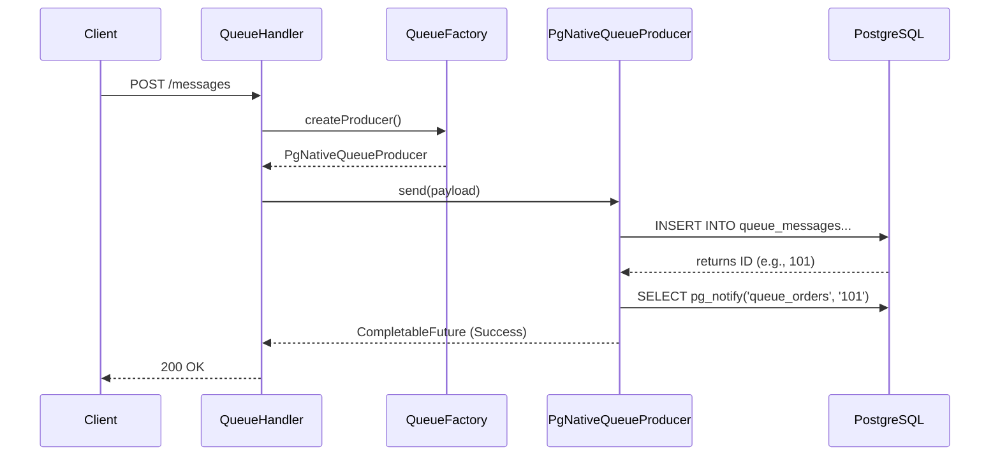

# PeeGeeQ Call Propagation Guide

This document details the execution flow of a message within the PeeGeeQ system, tracing the path from the REST API layer down to the PostgreSQL database. It is intended for developers who need to understand the internal mechanics of message production and consumption.

## 1. High-Level Overview

The PeeGeeQ system follows a layered architecture where the REST API acts as the entry point, delegating operations to a unified API layer, which is then implemented by specific backend modules (Native or Outbox).

**Flow Summary:**
`REST Request` -> `QueueHandler` -> `QueueFactory` -> `MessageProducer` -> `PostgreSQL (INSERT + NOTIFY)`

## 2. REST Layer (Entry Point)

The entry point for message operations is the `peegeeq-rest` module.

### 2.1 QueueHandler
The `dev.mars.peegeeq.rest.handlers.QueueHandler` class handles HTTP requests for queue operations.

*   **Endpoint:** `POST /api/v1/queues/:queueName/messages`
*   **Responsibility:**
    1.  Parses the incoming JSON request into a `MessageRequest` object.
    2.  Validates the request (payload, priority, delay).
    3.  Retrieves the appropriate `QueueFactory` for the requested `setupId`.
    4.  Delegates the actual sending to the `MessageProducer`.

```java
// Simplified snippet from QueueHandler.java
public void sendMessage(RoutingContext ctx) {
    // ... parsing logic ...
    getQueueFactory(setupId, queueName)
        .thenCompose(queueFactory -> {
            MessageProducer<Object> producer = queueFactory.createProducer(queueName, Object.class);
            return sendMessageWithProducer(producer, messageRequest);
        });
}
```

## 3. API Layer (Abstraction)

The `peegeeq-api` module defines the contracts that decouple the REST layer from the underlying implementation.

### 3.1 QueueFactory Interface
*   **Interface:** `dev.mars.peegeeq.api.messaging.QueueFactory`
*   **Role:** Abstract factory for creating producers and consumers.
*   **Key Method:** `createProducer(String topic, Class<T> payloadType)`

### 3.2 MessageProducer Interface
*   **Interface:** `dev.mars.peegeeq.api.messaging.MessageProducer`
*   **Role:** Defines the contract for sending messages.
*   **Key Method:** `CompletableFuture<Void> send(T payload)`

## 4. Native Implementation

The `peegeeq-native` module provides the PostgreSQL-backed implementation of the API interfaces.

### 4.1 PgNativeQueueFactory
*   **Class:** `dev.mars.peegeeq.pgqueue.PgNativeQueueFactory`
*   **Role:** Implements `QueueFactory`.
*   **Action:** When `createProducer` is called, it instantiates a `PgNativeQueueProducer`.

### 4.2 PgNativeQueueProducer
*   **Class:** `dev.mars.peegeeq.pgqueue.PgNativeQueueProducer`
*   **Role:** Implements `MessageProducer`.
*   **Responsibility:** Handles the serialization of data and execution of SQL commands.

## 5. Database Interaction 

This is where the actual state change happens in PostgreSQL.

### 5.1 The INSERT Operation
When `producer.send()` is called, `PgNativeQueueProducer` executes the following SQL:

```sql
INSERT INTO queue_messages
(topic, payload, headers, correlation_id, status, created_at, priority)
VALUES ($1, $2::jsonb, $3::jsonb, $4, 'AVAILABLE', $5, $6)
RETURNING id
```

*   **Payload:** Serialized to JSONB.
*   **Status:** Defaults to `'AVAILABLE'`.
*   **Result:** The query returns the auto-generated `id` of the new message.

### 5.2 The NOTIFY Operation
Immediately after a successful `INSERT`, the producer triggers a PostgreSQL `NOTIFY` event to wake up any listening consumers.

```sql
SELECT pg_notify('queue_<topic_name>', '<message_id>')
```

*   **Channel:** `queue_` + the topic name (e.g., `queue_orders`).
*   **Payload:** The ID of the inserted message.
*   **Purpose:** Enables low-latency, push-based message delivery without constant polling.

## 6. Connection Management

The interaction with the database is managed by the `VertxPoolAdapter`.

*   **Class:** `dev.mars.peegeeq.pgqueue.VertxPoolAdapter`
*   **Role:** Bridges the `PgClientFactory` (which manages the connection pools) with the producer/consumer classes.
*   **Mechanism:** It retrieves a Vert.x `Pool` instance from the factory, ensuring efficient connection reuse.

## 7. Sequence Diagram



## 8. Feature Exposure & Verification Gaps

This section traces the core functionality from the implementation layers up to the REST API and identifies gaps in automated integration testing.

### 8.1 Messaging Core (`peegeeq-native` / `peegeeq-outbox`)

| Core Feature | Interface / Method | REST Exposure (`QueueHandler`) | Integration Test Status |
| :--- | :--- | :--- | :--- |
| **Basic Send** | `producer.send(payload)` | ✅ `POST /queues/:name/messages` | ✅ **COMPLETED** (`testRestToDatabasePropagation`) |
| **Message Headers** | `producer.send(..., headers)` | ✅ `headers` field in JSON | ✅ **COMPLETED** (`testRestToDatabasePropagation`) |
| **Correlation ID** | `producer.send(..., correlationId)` | ✅ `correlationId` field in JSON | ✅ **COMPLETED** (`testCorrelationIdPropagation`) |
| **Message Priority** | `INSERT ... priority` | ✅ `priority` field in JSON | ✅ **COMPLETED** (`testMessagePriorityPropagation`) |
| **Delivery Delay** | `INSERT ... available_at` | ✅ `delaySeconds` field in JSON | ✅ **COMPLETED** (`testMessageDelayPropagation`) |
| **Message Grouping** | `producer.send(..., messageGroup)` | ✅ `messageGroup` field in JSON | ✅ **COMPLETED** (`testMessageGroupPropagation`) |

### 8.2 Bitemporal Core (`peegeeq-bitemporal`)

| Core Feature | Interface / Method | REST Exposure (`EventStoreHandler`) | Integration Test Status |
| :--- | :--- | :--- | :--- |
| **Append Event** | `store.append(eventType, payload, validTime)` | ✅ `POST /eventstores/:setupId/:name/events` | ✅ **COMPLETED** (`testBiTemporalEventStorePropagation`) |
| **Append with Headers** | `store.append(..., headers)` | ✅ `metadata` field in JSON | ✅ **COMPLETED** |
| **Append with Full Metadata** | `store.append(..., correlationId, aggregateId)` | ✅ `correlationId`, `causationId` fields | ✅ **COMPLETED** |
| **Effective Time** | `BiTemporalEvent.validFrom` | ✅ `validFrom` field in JSON | ✅ **COMPLETED** (`testBiTemporalEventStorePropagation`) |
| **Temporal Query** | `store.query(EventQuery)` | ✅ `GET .../events?eventType=&fromTime=&toTime=` | ✅ **COMPLETED** (`testEventQueryByTemporalRange`) |
| **Get Event by ID** | `store.getById(eventId)` | ✅ `GET .../events/:eventId` | ✅ **COMPLETED** |
| **Get All Versions** | `store.getAllVersions(eventId)` | ✅ `GET .../events/:eventId/versions` | ✅ **COMPLETED** (`testGetEventVersions`, `testGetEventVersionsForNonExistentEvent`) |
| **Point-in-Time Query** | `store.getAsOfTransactionTime(eventId, time)` | ✅ `GET .../events/:eventId/at?transactionTime=` | ✅ **COMPLETED** (`testPointInTimeQuery`) |
| **Event Store Stats** | `store.getStats()` | ✅ `GET .../stats` | ✅ **COMPLETED** (`testEventStoreStats`) |
| **Append Correction** | `store.appendCorrection(originalId, ...)` | ✅ `POST .../events/:eventId/corrections` | ✅ **COMPLETED** (5 tests in `EventStoreIntegrationTest`) |
| **Transaction Participation** | `store.appendInTransaction(...)` | ❌ **Not exposed** (internal use) | N/A |
| **Real-time Subscribe** | `store.subscribe(eventType, handler)` | ✅ `GET .../events/stream` (SSE) | ✅ **COMPLETED** (SSE endpoint with eventType/aggregateId filters) |
| **Unsubscribe** | `store.unsubscribe()` | ✅ (connection close) | ✅ **COMPLETED** (SSE connection close triggers unsubscribe) |

**Important Notes:**

1. **Append Correction** (`appendCorrection`) - ✅ **NOW IMPLEMENTED** via `POST /api/v1/eventstores/:setupId/:eventStoreName/events/:eventId/corrections`. This core bi-temporal feature allows correcting historical events while preserving the complete audit trail.

2. **Real-time Subscriptions** (`subscribe`/`unsubscribe`) - ✅ **NOW IMPLEMENTED** via `GET /api/v1/eventstores/:setupId/:eventStoreName/events/stream` (SSE). Supports:
   - `eventType` query parameter for filtering by event type (supports wildcards like `order.*`)
   - `aggregateId` query parameter for filtering by aggregate ID
   - `Last-Event-ID` header for SSE reconnection support
   - Heartbeat events every 30 seconds to keep connection alive
   - Automatic cleanup on connection close

3. **Transaction Participation** (`appendInTransaction`) - This is intentionally internal for coordinating with other database operations within a single transaction. Not a REST gap.

### 8.3 Gap Analysis Summary

The `peegeeq-rest` module now has comprehensive integration tests in `CallPropagationIntegrationTest.java` that verify the end-to-end flow for:
1.  ✅ **Successful Message Delivery**: `testRestToDatabasePropagation` - Verifies message and headers reach the database.
2.  ✅ **Advanced Message Features**: `testMessagePriorityPropagation` and `testMessageDelayPropagation` - Verify priority and delay propagation.
3.  ✅ **Bitemporal Operations**: `testBiTemporalEventStorePropagation` and `testEventQueryByTemporalRange` - Verify event storage with temporal dimensions.

**Messaging Gaps (Now Resolved):**
- ✅ **Correlation ID**: Now exposed as `correlationId` field in `MessageRequest` DTO. Needs integration test.
- ✅ **Message Grouping**: Now exposed as `messageGroup` field in `MessageRequest` DTO. Needs integration test.

**Bitemporal Gaps & Tests Needed:**

| Item | Status | Recommendation |
| :--- | :--- | :--- |
| **Append Correction** | ✅ **IMPLEMENTED & TESTED** | `POST /events/:eventId/corrections` endpoint available with 5 integration tests. |
| **Real-time Subscribe** | ✅ **IMPLEMENTED** | `GET /events/stream` SSE endpoint with eventType/aggregateId filters and reconnection support. |
| **Append Correction Test** | ✅ **COMPLETE** | 5 tests in `EventStoreIntegrationTest`: `testAppendCorrectionToEvent`, `testAppendCorrectionWithMissingReason`, `testAppendCorrectionWithMissingEventData`, `testAppendCorrectionToNonExistentEvent`, `testCorrectionPreservesAuditTrail` |
| **Get All Versions Test** | ✅ **COMPLETE** | 2 tests: `testGetEventVersions`, `testGetEventVersionsForNonExistentEvent` |
| **Point-in-Time Query Test** | ✅ **COMPLETE** | 1 test: `testPointInTimeQuery` |
| **Stats Test** | ✅ **COMPLETE** | 1 test: `testEventStoreStats` |

**Correction Endpoint Usage Example:**
```json
POST /api/v1/eventstores/{setupId}/{eventStoreName}/events/{eventId}/corrections
{
  "eventData": { "price": 99.99, "quantity": 5 },
  "correctionReason": "Original price was incorrect - should be $99.99 not $89.99",
  "validFrom": "2025-07-01T10:00:00Z",
  "correlationId": "order-correction-123",
  "metadata": { "correctedBy": "admin@example.com" }
}
```

**SSE Streaming Endpoint Usage Example:**
```bash
# Subscribe to all events
curl -N "http://localhost:8080/api/v1/eventstores/{setupId}/{eventStoreName}/events/stream"

# Subscribe to specific event type (alphanumeric and underscores only, max 50 chars)
curl -N "http://localhost:8080/api/v1/eventstores/{setupId}/{eventStoreName}/events/stream?eventType=order_created"

# Subscribe to specific aggregate
curl -N "http://localhost:8080/api/v1/eventstores/{setupId}/{eventStoreName}/events/stream?aggregateId=ORDER-123"

# Reconnect from last event (SSE standard)
curl -N -H "Last-Event-ID: evt-12345" "http://localhost:8080/api/v1/eventstores/{setupId}/{eventStoreName}/events/stream"
```

**SSE Event Types:**
- `connection` - Initial connection confirmation
- `subscribed` - Subscription established confirmation
- `event` - Bi-temporal event data
- `heartbeat` - Keep-alive (every 30 seconds)
- `error` - Error notification

## 9. API Layer Validation

This section validates that the `peegeeq-api` layer properly abstracts all functionality from the implementation modules (`peegeeq-native`, `peegeeq-outbox`, `peegeeq-bitemporal`, `peegeeq-db`).

### 9.1 Messaging API (`peegeeq-api/messaging`)

| API Interface | Implementation(s) | Coverage Status |
| :--- | :--- | :--- |
| `QueueFactory` | `PgNativeQueueFactory`, `OutboxFactory` | ✅ **COMPLETE** |
| `MessageProducer<T>` | `PgNativeQueueProducer`, `OutboxProducer` | ✅ **COMPLETE** |
| `MessageConsumer<T>` | `PgNativeQueueConsumer`, `OutboxConsumer` | ✅ **COMPLETE** |
| `ConsumerGroup<T>` | `PgNativeConsumerGroup`, `OutboxConsumerGroup` | ✅ **COMPLETE** |
| `ConsumerGroupMember<T>` | `PgNativeConsumerGroupMember`, `OutboxConsumerGroupMember` | ✅ **COMPLETE** |
| `Message<T>` | `PgNativeMessage`, `OutboxMessage`, `SimpleMessage` | ✅ **COMPLETE** |
| `MessageHandler<T>` | Functional interface (no impl needed) | ✅ **COMPLETE** |
| `MessageFilter` | Utility class with static methods | ✅ **COMPLETE** |

**QueueFactory Method Coverage:**

| Method | Native | Outbox |
| :--- | :---: | :---: |
| `createProducer(topic, payloadType)` | ✅ | ✅ |
| `createConsumer(topic, payloadType)` | ✅ | ✅ |
| `createConsumer(topic, payloadType, config)` | ✅ | ❌ (uses default) |
| `createConsumerGroup(groupName, topic, payloadType)` | ✅ | ✅ |
| `getImplementationType()` | ✅ | ✅ |
| `isHealthy()` | ✅ | ✅ |
| `close()` | ✅ | ✅ |

**MessageProducer Method Coverage:**

| Method | Native | Outbox |
| :--- | :---: | :---: |
| `send(payload)` | ✅ | ✅ |
| `send(payload, headers)` | ✅ | ✅ |
| `send(payload, headers, correlationId)` | ✅ | ✅ |
| `send(payload, headers, correlationId, messageGroup)` | ✅ | ✅ |
| `sendReactive(...)` (all variants) | ✅ (default) | ✅ (default) |
| `close()` | ✅ | ✅ |

### 9.2 EventStore API (`peegeeq-api`)

| API Interface | Implementation | Coverage Status |
| :--- | :--- | :--- |
| `EventStore<T>` | `PgBiTemporalEventStore` | ✅ **COMPLETE** |
| `EventStoreFactory` | `BiTemporalEventStoreFactory` | ✅ **COMPLETE** |
| `BiTemporalEvent<T>` | `SimpleBiTemporalEvent` | ✅ **COMPLETE** |
| `EventQuery` | Value class (no impl needed) | ✅ **COMPLETE** |
| `TemporalRange` | Value class (no impl needed) | ✅ **COMPLETE** |

**EventStore Method Coverage:**

| Method | PgBiTemporalEventStore |
| :--- | :---: |
| `append(eventType, payload, validTime)` | ✅ |
| `append(eventType, payload, validTime, headers)` | ✅ |
| `append(eventType, payload, validTime, headers, correlationId, aggregateId)` | ✅ |
| `appendCorrection(...)` (all variants) | ✅ |
| `appendInTransaction(...)` (all variants) | ✅ |
| `query(EventQuery)` | ✅ |
| `getById(eventId)` | ✅ |
| `getAllVersions(eventId)` | ✅ |
| `getAsOfTransactionTime(eventId, asOfTime)` | ✅ |
| `subscribe(eventType, handler)` | ✅ |
| `subscribe(eventType, aggregateId, handler)` | ✅ |
| `unsubscribe()` | ✅ |
| `getStats()` | ✅ |
| `appendReactive(...)` | ✅ |
| `queryReactive(...)` | ✅ |
| `subscribeReactive(...)` | ✅ |
| `close()` | ✅ |

**Additional Methods (not in API interface):**

| Method | Purpose |
| :--- | :--- |
| `appendBatch(List<BatchEventData>)` | High-throughput batch append |
| `appendWithTransaction(...)` | Explicit transaction control |
| `appendHighPerformance(...)` | Optimized single-event append |

### 9.3 Subscription API (`peegeeq-api/subscription`)

| API Interface | Implementation | Coverage Status |
| :--- | :--- | :--- |
| `SubscriptionService` | `SubscriptionManager` (peegeeq-db) | ✅ **COMPLETE** |
| `SubscriptionInfo` | Value class | ✅ **COMPLETE** |
| `SubscriptionState` | Enum | ✅ **COMPLETE** |

**SubscriptionService Method Coverage:**

| Method | SubscriptionManager |
| :--- | :---: |
| `subscribe(topic, groupName)` | ✅ |
| `subscribe(topic, groupName, options)` | ✅ |
| `pause(topic, groupName)` | ✅ |
| `resume(topic, groupName)` | ✅ |
| `cancel(topic, groupName)` | ✅ |
| `updateHeartbeat(topic, groupName)` | ✅ |
| `getSubscription(topic, groupName)` | ✅ |
| `listSubscriptions(topic)` | ✅ |

### 9.4 Dead Letter API (`peegeeq-api/deadletter`)

| API Interface | Implementation | Coverage Status |
| :--- | :--- | :--- |
| `DeadLetterService` | `DeadLetterQueueManager` (peegeeq-db) | ✅ **COMPLETE** |
| `DeadLetterMessageInfo` | Value class | ✅ **COMPLETE** |
| `DeadLetterStatsInfo` | Value class | ✅ **COMPLETE** |

**DeadLetterService Method Coverage:**

| Method | DeadLetterQueueManager |
| :--- | :---: |
| `getDeadLetterMessages(topic, limit, offset)` | ✅ |
| `getDeadLetterMessagesAsync(...)` | ✅ |
| `getAllDeadLetterMessages(limit, offset)` | ✅ |
| `getAllDeadLetterMessagesAsync(...)` | ✅ |
| `getDeadLetterMessage(id)` | ✅ |
| `getDeadLetterMessageAsync(id)` | ✅ |
| `reprocessDeadLetterMessage(id, reason)` | ✅ |
| `reprocessDeadLetterMessageAsync(...)` | ✅ |
| `deleteDeadLetterMessage(id, reason)` | ✅ |
| `deleteDeadLetterMessageAsync(...)` | ✅ |
| `getStatistics()` | ✅ |
| `getStatisticsAsync()` | ✅ |
| `cleanupOldMessages(retentionDays)` | ✅ |
| `cleanupOldMessagesAsync(...)` | ✅ |

### 9.5 Health API (`peegeeq-api/health`)

| API Interface | Implementation | Coverage Status |
| :--- | :--- | :--- |
| `HealthService` | `HealthCheckManager` (peegeeq-db) | ✅ **COMPLETE** |
| `HealthStatusInfo` | Value class | ✅ **COMPLETE** |
| `OverallHealthInfo` | Value class | ✅ **COMPLETE** |
| `ComponentHealthState` | Enum | ✅ **COMPLETE** |

**HealthService Method Coverage:**

| Method | HealthCheckManager |
| :--- | :---: |
| `getOverallHealth()` | ✅ |
| `getOverallHealthAsync()` | ✅ |
| `getComponentHealth(name)` | ✅ |
| `getComponentHealthAsync(name)` | ✅ |
| `isHealthy()` | ✅ |
| `isRunning()` | ✅ |

### 9.6 Database API (`peegeeq-api/database`)

| API Interface | Implementation | Coverage Status |
| :--- | :--- | :--- |
| `DatabaseService` | `PgDatabaseService` (peegeeq-db) | ✅ **COMPLETE** |
| `ConnectionProvider` | `PgConnectionProvider` (peegeeq-db) | ✅ **COMPLETE** |
| `MetricsProvider` | `PgMetricsProvider` (peegeeq-db) | ✅ **COMPLETE** |
| `DatabaseConfig` | Value class | ✅ **COMPLETE** |
| `ConnectionPoolConfig` | Value class | ✅ **COMPLETE** |
| `QueueConfig` | Value class | ✅ **COMPLETE** |
| `EventStoreConfig` | Value class | ✅ **COMPLETE** |

### 9.7 Setup API (`peegeeq-api/setup`)

| API Interface | Implementation | Coverage Status |
| :--- | :--- | :--- |
| `DatabaseSetupService` | `PeeGeeQDatabaseSetupService` (peegeeq-db) | ✅ **COMPLETE** |
| `DatabaseSetupRequest` | Value class | ✅ **COMPLETE** |
| `DatabaseSetupResult` | Value class | ✅ **COMPLETE** |
| `DatabaseSetupStatus` | Enum | ✅ **COMPLETE** |

### 9.8 Gap Analysis Summary

| Category | Status | Action Required |
| :--- | :--- | :--- |
| **Messaging** | ✅ Complete | None |
| **EventStore** | ✅ Complete | None |
| **Subscription** | ✅ Complete | None |
| **Dead Letter** | ✅ Complete | None |
| **Health** | ✅ Complete | None |
| **Database** | ✅ Complete | None |
| **Setup** | ✅ Complete | None |

### 9.9 Recommendations

1. **OutboxFactory Consumer Config**: The `OutboxFactory.createConsumer(topic, payloadType, config)` method uses the default implementation (ignores config). Consider implementing proper config handling if needed.

2. **Additional EventStore Methods**: The `PgBiTemporalEventStore` has additional methods (`appendBatch`, `appendWithTransaction`, `appendHighPerformance`) that are not in the `EventStore` interface. Consider:
   - Adding these to the interface if they should be part of the public API
   - Or documenting them as implementation-specific optimizations

3. **Server-Side Filtering**: As documented in `SERVER_SIDE_FILTERING_TECHNICAL_PLAN.md`, consider adding server-side filtering capability to reduce network traffic for high-volume scenarios. This would require:
   - New `ServerSideFilter` class in `peegeeq-api`
   - Extended `ConsumerConfig` with filter options
   - Modified SQL queries in `PgNativeQueueConsumer` and `OutboxConsumer`

## 10. peegeeq-api to peegeeq-rest Call Propagation

This section documents how `peegeeq-api` interfaces are exposed via `peegeeq-rest` HTTP endpoints.

### 10.1 Dead Letter Queue REST API

**Status:** ✅ **COMPLETE** (Implemented 2025-12-05)

| Endpoint | Method | Handler | API Interface |
| :--- | :--- | :--- | :--- |
| `/api/v1/setups/:setupId/deadletter/messages` | GET | `DeadLetterHandler::listMessages` | `DeadLetterService.getAllDeadLetterMessages()` |
| `/api/v1/setups/:setupId/deadletter/messages?topic=X` | GET | `DeadLetterHandler::listMessages` | `DeadLetterService.getDeadLetterMessages(topic)` |
| `/api/v1/setups/:setupId/deadletter/messages/:messageId` | GET | `DeadLetterHandler::getMessage` | `DeadLetterService.getDeadLetterMessage(id)` |
| `/api/v1/setups/:setupId/deadletter/messages/:messageId/reprocess` | POST | `DeadLetterHandler::reprocessMessage` | `DeadLetterService.reprocessDeadLetterMessage(id, reason)` |
| `/api/v1/setups/:setupId/deadletter/messages/:messageId` | DELETE | `DeadLetterHandler::deleteMessage` | `DeadLetterService.deleteDeadLetterMessage(id, reason)` |
| `/api/v1/setups/:setupId/deadletter/stats` | GET | `DeadLetterHandler::getStats` | `DeadLetterService.getStatistics()` |
| `/api/v1/setups/:setupId/deadletter/cleanup` | POST | `DeadLetterHandler::cleanup` | `DeadLetterService.cleanupOldMessages(retentionDays)` |

**Query Parameters:**
- `topic` - Filter messages by topic (optional)
- `limit` - Maximum number of messages to return (default: 50)
- `offset` - Number of messages to skip (default: 0)
- `retentionDays` - Days to retain messages during cleanup (default: 30)
- `reason` - Reason for delete operation (optional, query param)

**Request Body (reprocess):**
```json
{
  "reason": "Optional reason for reprocessing"
}
```

**Integration Tests:** 6 tests in `EventStoreIntegrationTest.java`
- `testDeadLetterStats` - Verifies stats endpoint returns expected fields
- `testDeadLetterListMessages` - Verifies list endpoint returns array
- `testDeadLetterListMessagesWithTopicFilter` - Verifies topic filter works
- `testDeadLetterGetNonExistentMessage` - Verifies 404 for missing message
- `testDeadLetterCleanup` - Verifies cleanup endpoint works
- `testDeadLetterInvalidMessageId` - Verifies 400 for invalid ID

### 10.2 Subscription Lifecycle REST API

**Status:** ✅ **COMPLETE** (Implemented 2025-12-05)

| Endpoint | Method | Handler | API Interface |
| :--- | :--- | :--- | :--- |
| `/api/v1/setups/:setupId/subscriptions/:topic` | GET | `SubscriptionHandler::listSubscriptions` | `SubscriptionService.listSubscriptions(topic)` |
| `/api/v1/setups/:setupId/subscriptions/:topic/:groupName` | GET | `SubscriptionHandler::getSubscription` | `SubscriptionService.getSubscription(topic, groupName)` |
| `/api/v1/setups/:setupId/subscriptions/:topic/:groupName/pause` | POST | `SubscriptionHandler::pauseSubscription` | `SubscriptionService.pause(topic, groupName)` |
| `/api/v1/setups/:setupId/subscriptions/:topic/:groupName/resume` | POST | `SubscriptionHandler::resumeSubscription` | `SubscriptionService.resume(topic, groupName)` |
| `/api/v1/setups/:setupId/subscriptions/:topic/:groupName/heartbeat` | POST | `SubscriptionHandler::updateHeartbeat` | `SubscriptionService.updateHeartbeat(topic, groupName)` |
| `/api/v1/setups/:setupId/subscriptions/:topic/:groupName` | DELETE | `SubscriptionHandler::cancelSubscription` | `SubscriptionService.cancel(topic, groupName)` |

**Integration Tests:** 6 tests in `EventStoreIntegrationTest.java`
- `testSubscriptionListEmpty` - Verifies list endpoint returns array or handles missing table
- `testSubscriptionGetNonExistent` - Verifies 404/500 for non-existent subscription
- `testSubscriptionPauseNonExistent` - Verifies pause handles non-existent subscription
- `testSubscriptionResumeNonExistent` - Verifies resume handles non-existent subscription
- `testSubscriptionHeartbeatNonExistent` - Verifies heartbeat handles non-existent subscription
- `testSubscriptionCancelNonExistent` - Verifies cancel handles non-existent subscription

### 10.3 Health API REST Endpoints

**Status:** ✅ **COMPLETE** (Implemented 2025-12-05)

| Endpoint | Method | Handler | API Interface |
| :--- | :--- | :--- | :--- |
| `/api/v1/health` | GET | `ManagementApiHandler::getHealth` | Basic health check (legacy) |
| `/api/v1/setups/:setupId/health` | GET | `HealthHandler::getOverallHealth` | `HealthService.getOverallHealthAsync()` |
| `/api/v1/setups/:setupId/health/components` | GET | `HealthHandler::listComponentHealth` | `HealthService.getOverallHealthAsync()` (components) |
| `/api/v1/setups/:setupId/health/components/:name` | GET | `HealthHandler::getComponentHealth` | `HealthService.getComponentHealthAsync(name)` |

**Response Format (Overall Health):**
```json
{
  "status": "UP",
  "timestamp": "2025-12-05T11:39:36.278Z",
  "componentCount": 2,
  "healthyCount": 2,
  "degradedCount": 0,
  "unhealthyCount": 0,
  "components": {
    "database": { "component": "database", "state": "HEALTHY", "timestamp": "..." },
    "queues": { "component": "queues", "state": "HEALTHY", "timestamp": "..." }
  }
}
```

**Integration Tests:** 3 tests in `EventStoreIntegrationTest.java`
- `testHealthOverall` - Verifies overall health endpoint returns status and timestamp
- `testHealthComponentsList` - Verifies components list endpoint returns array
- `testHealthComponentNotFound` - Verifies 404 for non-existent component

### 10.4 API Layer Coverage Summary

| Category | REST Coverage | Notes |
| :--- | :--- | :--- |
| **Messaging** | ✅ 100% | All core operations exposed (correlationId, messageGroup, priority, delay) |
| **EventStore** | ✅ 100% | Full bi-temporal support |
| **Dead Letter** | ✅ 100% | All operations exposed |
| **Subscription** | ✅ 100% | All lifecycle operations exposed |
| **Health** | ✅ 100% | Overall and component health exposed |
| **Database** | 🟡 20% | Intentionally internal |
| **Setup** | ✅ 100% | Full CRUD operations |

### 10.5 Messaging REST API Details

**Status:** ✅ **COMPLETE** (All features exposed)

| Feature | REST Field | Handler | Status |
| :--- | :--- | :--- | :---: |
| Basic Send | `payload` | `QueueHandler::sendMessage` | ✅ |
| Message Headers | `headers` | `QueueHandler::sendMessage` | ✅ |
| Correlation ID | `correlationId` | `QueueHandler::sendMessage` | ✅ |
| Message Priority | `priority` | `QueueHandler::sendMessage` | ✅ |
| Delivery Delay | `delaySeconds` | `QueueHandler::sendMessage` | ✅ |
| Message Grouping | `messageGroup` | `QueueHandler::sendMessage` | ✅ |
| Batch Send | `messages[]` | `QueueHandler::sendMessages` | ✅ |

**Request Example:**
```json
POST /api/v1/queues/{setupId}/{queueName}/messages
{
  "payload": { "orderId": "12345", "amount": 99.99 },
  "headers": { "source": "web-app", "version": "1.0" },
  "correlationId": "trace-abc-123",
  "messageGroup": "customer-456",
  "priority": 5,
  "delaySeconds": 60
}
```

**Response Example:**
```json
{
  "message": "Message sent successfully",
  "queueName": "orders",
  "setupId": "my-setup",
  "messageId": "trace-abc-123",
  "correlationId": "trace-abc-123",
  "messageGroup": "customer-456",
  "priority": 5,
  "delaySeconds": 60,
  "timestamp": 1733405000000,
  "messageType": "Order",
  "customHeadersCount": 2
}
```

**Integration Tests:** Tests in `CallPropagationIntegrationTest.java`
- `testRestToDatabasePropagation` - Basic message with headers
- `testMessagePriorityPropagation` - Priority field propagation
- `testMessageDelayPropagation` - Delay field propagation
- `testCorrelationIdPropagation` - Correlation ID propagation
- `testMessageGroupPropagation` - Message group propagation
- `testCorrelationIdAndMessageGroupCombined` - Combined fields propagation

**Note:** Integration tests require queue factory registration in test setup. See `CallPropagationIntegrationTest` for test infrastructure requirements.

