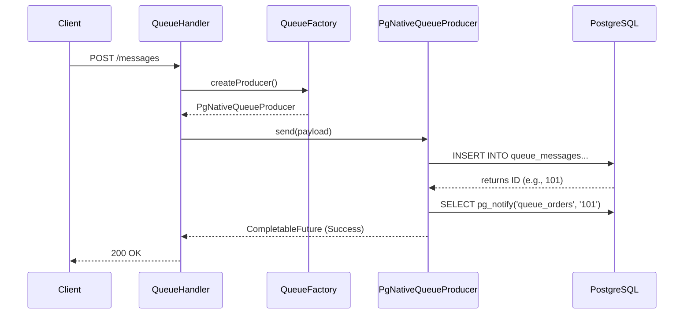

# PeeGeeQ Call Propagation Guide

This document details the execution flow of a message within the PeeGeeQ system, tracing the path from the REST API layer down to the PostgreSQL database. It is intended for developers who need to understand the internal mechanics of message production and consumption.

## 1. High-Level Overview

The PeeGeeQ system follows a layered architecture where the REST API acts as the entry point, delegating operations to a unified API layer, which is then implemented by specific backend modules (Native or Outbox).

**Flow Summary:**
`REST Request` -> `QueueHandler` -> `QueueFactory` -> `MessageProducer` -> `PostgreSQL (INSERT + NOTIFY)`

## 2. REST Layer (Entry Point)

The entry point for message operations is the `peegeeq-rest` module.

### 2.1 QueueHandler
The `dev.mars.peegeeq.rest.handlers.QueueHandler` class handles HTTP requests for queue operations.

*   **Endpoint:** `POST /api/v1/queues/:queueName/messages`
*   **Responsibility:**
    1.  Parses the incoming JSON request into a `MessageRequest` object.
    2.  Validates the request (payload, priority, delay).
    3.  Retrieves the appropriate `QueueFactory` for the requested `setupId`.
    4.  Delegates the actual sending to the `MessageProducer`.

```java
// Simplified snippet from QueueHandler.java
public void sendMessage(RoutingContext ctx) {
    // ... parsing logic ...
    getQueueFactory(setupId, queueName)
        .thenCompose(queueFactory -> {
            MessageProducer<Object> producer = queueFactory.createProducer(queueName, Object.class);
            return sendMessageWithProducer(producer, messageRequest);
        });
}
```

## 3. API Layer (Abstraction)

The `peegeeq-api` module defines the contracts that decouple the REST layer from the underlying implementation.

### 3.1 QueueFactory Interface
*   **Interface:** `dev.mars.peegeeq.api.messaging.QueueFactory`
*   **Role:** Abstract factory for creating producers and consumers.
*   **Key Method:** `createProducer(String topic, Class<T> payloadType)`

### 3.2 MessageProducer Interface
*   **Interface:** `dev.mars.peegeeq.api.messaging.MessageProducer`
*   **Role:** Defines the contract for sending messages.
*   **Key Method:** `CompletableFuture<Void> send(T payload)`

## 4. Native Implementation (The "Engine Room")

The `peegeeq-native` module provides the PostgreSQL-backed implementation of the API interfaces.

### 4.1 PgNativeQueueFactory
*   **Class:** `dev.mars.peegeeq.pgqueue.PgNativeQueueFactory`
*   **Role:** Implements `QueueFactory`.
*   **Action:** When `createProducer` is called, it instantiates a `PgNativeQueueProducer`.

### 4.2 PgNativeQueueProducer
*   **Class:** `dev.mars.peegeeq.pgqueue.PgNativeQueueProducer`
*   **Role:** Implements `MessageProducer`.
*   **Responsibility:** Handles the serialization of data and execution of SQL commands.

## 5. Database Interaction (The "Metal")

This is where the actual state change happens in PostgreSQL.

### 5.1 The INSERT Operation
When `producer.send()` is called, `PgNativeQueueProducer` executes the following SQL:

```sql
INSERT INTO queue_messages
(topic, payload, headers, correlation_id, status, created_at, priority)
VALUES ($1, $2::jsonb, $3::jsonb, $4, 'AVAILABLE', $5, $6)
RETURNING id
```

*   **Payload:** Serialized to JSONB.
*   **Status:** Defaults to `'AVAILABLE'`.
*   **Result:** The query returns the auto-generated `id` of the new message.

### 5.2 The NOTIFY Operation
Immediately after a successful `INSERT`, the producer triggers a PostgreSQL `NOTIFY` event to wake up any listening consumers.

```sql
SELECT pg_notify('queue_<topic_name>', '<message_id>')
```

*   **Channel:** `queue_` + the topic name (e.g., `queue_orders`).
*   **Payload:** The ID of the inserted message.
*   **Purpose:** Enables low-latency, push-based message delivery without constant polling.

## 6. Connection Management

The interaction with the database is managed by the `VertxPoolAdapter`.

*   **Class:** `dev.mars.peegeeq.pgqueue.VertxPoolAdapter`
*   **Role:** Bridges the `PgClientFactory` (which manages the connection pools) with the producer/consumer classes.
*   **Mechanism:** It retrieves a Vert.x `Pool` instance from the factory, ensuring efficient connection reuse.

## 7. Sequence Diagram



## 8. Feature Exposure & Verification Gaps

This section traces the core functionality from the implementation layers up to the REST API and identifies gaps in automated integration testing.

### 8.1 Messaging Core (`peegeeq-native` / `peegeeq-outbox`)

| Core Feature | Interface / Method | REST Exposure (`QueueHandler`) | Integration Test Status |
| :--- | :--- | :--- | :--- |
| **Basic Send** | `producer.send(payload)` | ✅ `POST /queues/:name/messages` | ✅ **COMPLETED** (`testRestToDatabasePropagation`) |
| **Message Headers** | `producer.send(..., headers)` | ✅ `headers` field in JSON | ✅ **COMPLETED** (`testRestToDatabasePropagation`) |
| **Correlation ID** | `producer.send(..., correlationId)` | ❌ Not exposed in `MessageRequest` | N/A |
| **Message Priority** | `INSERT ... priority` | ✅ `priority` field in JSON | ✅ **COMPLETED** (`testMessagePriorityPropagation`) |
| **Delivery Delay** | `INSERT ... available_at` | ✅ `delaySeconds` field in JSON | ✅ **COMPLETED** (`testMessageDelayPropagation`) |
| **Message Grouping** | `producer.send(..., messageGroup)` | ❌ Not exposed in `MessageRequest` | N/A |

### 8.2 Bitemporal Core (`peegeeq-bitemporal`)

| Core Feature | Interface / Method | REST Exposure (`EventStoreHandler`) | Integration Test Status |
| :--- | :--- | :--- | :--- |
| **Append Event** | `store.append(event)` | ✅ `POST /eventstores/:name/events` | ✅ **COMPLETED** (`testBiTemporalEventStorePropagation`) |
| **Effective Time** | `BiTemporalEvent.validFrom` | ✅ `validFrom` field in JSON | ✅ **COMPLETED** (`testBiTemporalEventStorePropagation`) |
| **Temporal Query** | `store.getHistory(id)` | ✅ `GET .../events` | ✅ **COMPLETED** (`testEventQueryByTemporalRange`) |

### 8.3 Gap Analysis Summary
The `peegeeq-rest` module now has comprehensive integration tests in `CallPropagationIntegrationTest.java` that verify the end-to-end flow for:
1.  ✅ **Successful Message Delivery**: `testRestToDatabasePropagation` - Verifies message and headers reach the database.
2.  ✅ **Advanced Message Features**: `testMessagePriorityPropagation` and `testMessageDelayPropagation` - Verify priority and delay propagation.
3.  ✅ **Bitemporal Operations**: `testBiTemporalEventStorePropagation` and `testEventQueryByTemporalRange` - Verify event storage with temporal dimensions.

**Remaining Gaps (Not Exposed in REST API):**
- **Correlation ID**: The `MessageRequest` DTO does not include a `correlationId` field, so this feature cannot be tested via REST.
- **Message Grouping**: The `MessageRequest` DTO does not include a `messageGroup` field, so this feature cannot be tested via REST.

**Recommendation:** These gaps are **design decisions** rather than test gaps. If correlation ID and message grouping should be exposed via REST, update `MessageRequest.java` and `QueueHandler.java` accordingly.

