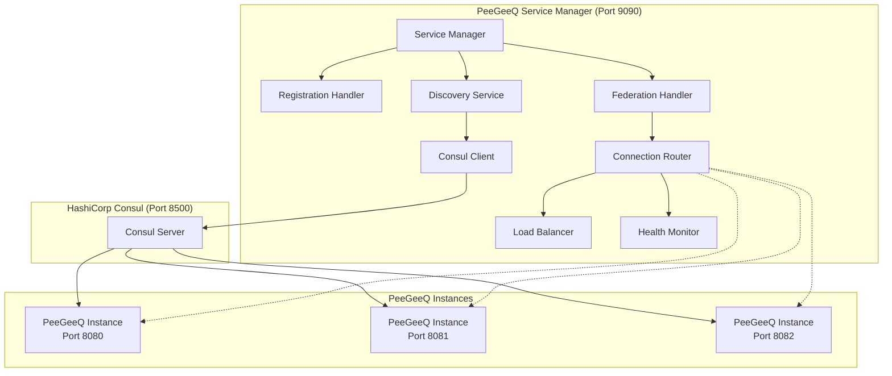

# PeeGeeQ Service Manager

#### © Mark Andrew Ray-Smith Cityline Ltd 2025

A service discovery and federation manager for PeeGeeQ instances using HashiCorp Consul.

## Features

### Implemented
- **Consul-based Service Discovery** - Automatic registration and discovery of PeeGeeQ instances
- **Instance Registration API** - REST endpoints for PeeGeeQ instances to register themselves
- **Federated Management API** - Unified API that aggregates data from all registered instances
- **Health Monitoring** - Automatic health checks and failover capabilities
- **Connection Routing** - Intelligent routing of requests to healthy instances
- **Multi-Environment Support** - Support for different environments and regions

## Architecture



## Getting Started

### Prerequisites
- Java 21+
- Maven 3.8+
- HashiCorp Consul running on localhost:8500

### Starting Consul
```bash
# Download and start Consul in development mode
consul agent -dev
```

### Starting the Service Manager
```bash
cd peegeeq-service-manager
mvn exec:java -Dexec.mainClass="dev.mars.peegeeq.servicemanager.PeeGeeQServiceManager" -Dexec.args="9090"
```

### Configuration
The service manager can be configured via system properties:

```bash
# Consul configuration
-Dconsul.host=localhost
-Dconsul.port=8500

# Service configuration
-Dservice.port=9090
-Denvironment=development
-Dregion=us-east-1

# Request configuration
-Drequest.timeout=10000
-Dcache.refresh.interval=30000
```

## API Endpoints

### Health Check
```http
GET /health
```

### Instance Registration
```http
POST /api/v1/instances/register
DELETE /api/v1/instances/{instanceId}/deregister
GET /api/v1/instances
GET /api/v1/instances/{instanceId}/health
```

### Federated Management
```http
GET /api/v1/federated/overview
GET /api/v1/federated/queues
GET /api/v1/federated/consumer-groups
GET /api/v1/federated/event-stores
GET /api/v1/federated/metrics
```

### Instance-Specific Routing
```http
GET /api/v1/instances/{instanceId}/overview
GET /api/v1/instances/{instanceId}/queues
GET /api/v1/instances/{instanceId}/consumer-groups
GET /api/v1/instances/{instanceId}/event-stores
GET /api/v1/instances/{instanceId}/metrics
```

## Usage Examples

### Register a PeeGeeQ Instance
```bash
curl -X POST http://localhost:9090/api/v1/instances/register \
  -H "Content-Type: application/json" \
  -d '{
    "instanceId": "peegeeq-prod-01",
    "host": "localhost",
    "port": 8080,
    "version": "1.0.0",
    "environment": "production",
    "region": "us-east-1",
    "metadata": {
      "datacenter": "dc1",
      "cluster": "main"
    }
  }'
```

### List All Registered Instances
```bash
curl http://localhost:9090/api/v1/instances
```

### Get Federated Overview
```bash
curl http://localhost:9090/api/v1/federated/overview
```

### Get Data from Specific Instance
```bash
curl http://localhost:9090/api/v1/instances/peegeeq-prod-01/queues
```

## Service Discovery

The service manager uses Consul for service discovery with the following features:

- **Automatic Registration** - PeeGeeQ instances register themselves on startup
- **Health Checks** - Consul performs HTTP health checks every 10 seconds
- **Service Deregistration** - Unhealthy services are automatically deregistered after 30 seconds
- **Load Balancing** - Requests are distributed across healthy instances
- **Failover** - Automatic failover to healthy instances when others fail

## Management Features

### Federated Data Aggregation
- Combines data from all healthy instances
- Provides cluster-wide metrics and statistics
- Handles partial failures gracefully

### Instance Routing
- Routes requests to specific instances by ID
- Validates instance health before routing
- Returns appropriate errors for unhealthy instances

### Environment and Region Support
- Filter instances by environment (dev, staging, prod)
- Filter instances by region (us-east-1, eu-west-1, etc.)
- Support for custom metadata tags

## Testing

### Manual Testing
```bash
# Start Consul
consul agent -dev

# Start Service Manager
mvn exec:java

# Register a test instance
curl -X POST http://localhost:9090/api/v1/instances/register \
  -H "Content-Type: application/json" \
  -d '{"instanceId": "test-01", "host": "localhost", "port": 8080}'

# Check registration
curl http://localhost:9090/api/v1/instances
```

### Integration Testing
```bash
mvn test
```

## Development

### Project Structure
```
peegeeq-service-manager/
├── src/main/java/dev/mars/peegeeq/servicemanager/
│   ├── PeeGeeQServiceManager.java          # Main service class
│   ├── config/
│   │   └── ServiceManagerConfig.java       # Configuration management
│   ├── discovery/
│   │   └── ConsulServiceDiscovery.java     # Consul integration
│   ├── federation/
│   │   └── FederatedManagementHandler.java # Federation API
│   ├── health/
│   │   ├── HealthMonitor.java              # Health monitoring
│   │   ├── HealthStatus.java               # Health status model
│   │   └── HealthCheckResult.java          # Health check results
│   ├── model/
│   │   ├── PeeGeeQInstance.java           # Instance model
│   │   └── ServiceHealth.java             # Health status enum
│   ├── registration/
│   │   └── InstanceRegistrationHandler.java # Registration API
│   └── routing/
│       ├── LoadBalancer.java               # Load balancing logic
│       ├── LoadBalancingStrategy.java      # Load balancing strategies
│       └── ConnectionRouter.java           # Connection routing
├── src/test/java/
│   └── PeeGeeQServiceManagerTest.java      # Basic integration tests
├── pom.xml                                 # Maven configuration
└── README.md                               # Documentation
```

## License

MIT License - see the main PeeGeeQ project for details.
