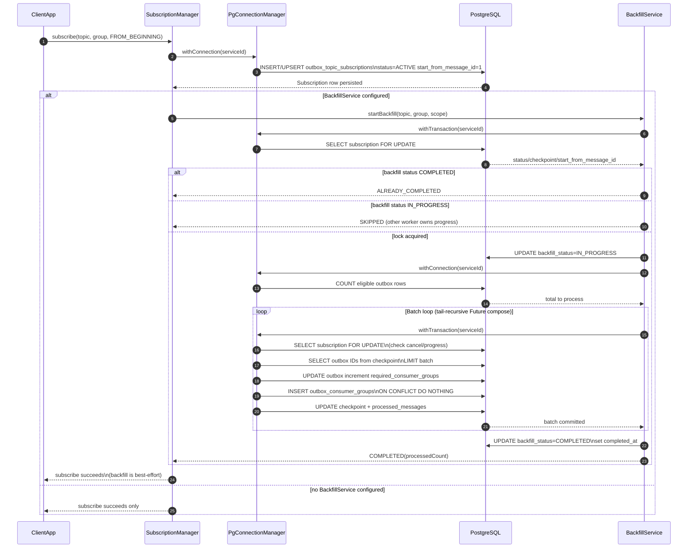
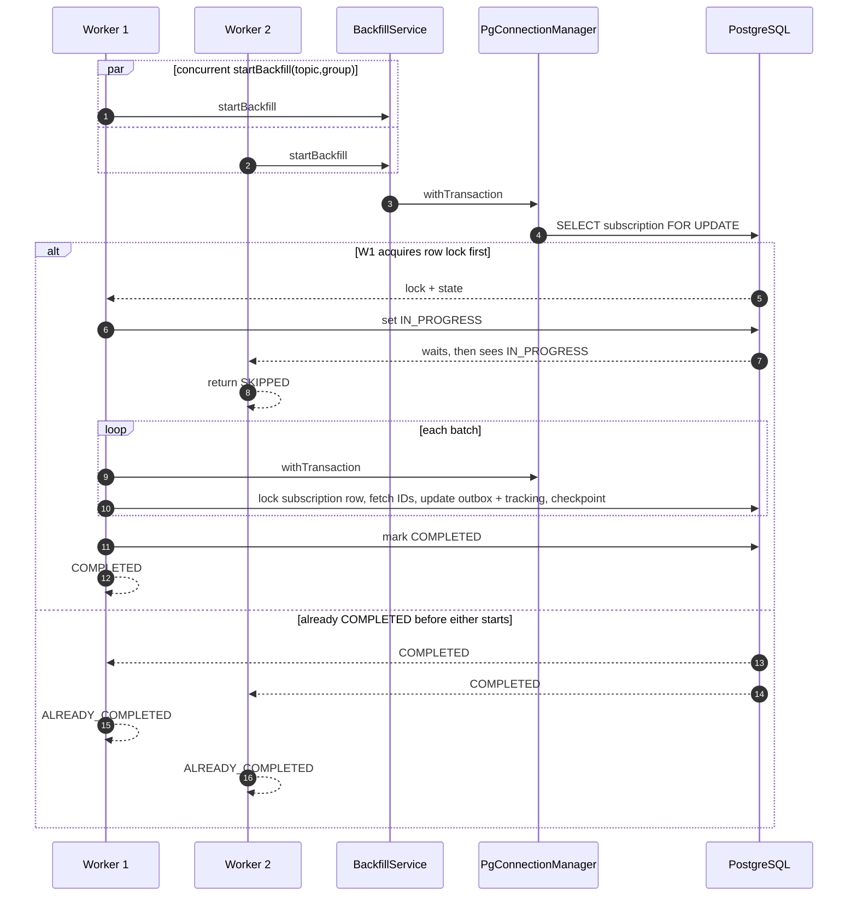
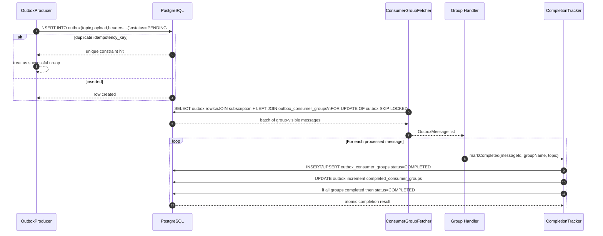

# PeeGeeQ Platform Sequence Flows

This document maps concrete runtime flows across the PeeGeeQ platform, starting with implemented `peegeeq-db` fanout/backfill and producer/consumer lifecycle sequences.

## Document Goal

This is the living sequence-flow reference for the full PeeGeeQ platform.
It will grow to include key runtime interactions across all modules and services, with one or more Mermaid sequence diagrams per critical flow.

## Platform Flow Coverage

| Module / Service | Key flow(s) | Status |
|---|---|---|
| `peegeeq-db` | Done: topic subscription with historical message backfill; concurrent backfill coordination and row-level locking. In progress: connection/pool lifecycle, setup/migrations path, subscription/backfill/fanout expansion. | Mixed (Done + In progress) |
| `peegeeq-db` + `peegeeq-outbox` | Message production, group fetch, and fanout completion tracking | Done |
| `peegeeq-api` | API contract flows for producer, consumer, subscription lifecycle | Planned |
| `peegeeq-outbox` | Outbox produce, polling consume, retry/dead-letter routing | Planned |
| `peegeeq-native` | Native queue publish/consume and notification path | Planned |
| `peegeeq-bitemporal` | Event append/query and temporal consistency flow | Planned |
| `peegeeq-runtime` | Runtime bootstrap, factory registration, lifecycle start/stop | Planned |
| `peegeeq-rest` | REST request to service to DB sequence per major endpoint group | Planned |
| `peegeeq-rest-client` | Client request/retry/SSE stream handling sequence | Planned |
| `peegeeq-service-manager` | Service orchestration and health/lifecycle coordination | Planned |
| `peegeeq-migrations` | Migration startup, ordering, schema validation | Planned |
| `peegeeq-management-ui` | UI action to API to backend to DB round trips | Planned |
| `peegeeq-openapi` | OpenAPI generation/publish flow | Planned |
| `peegeeq-integration-tests` | End-to-end test harness orchestration flow | Planned |
| `peegeeq-performance-test-harness` | Performance run setup, workload, metrics capture | Planned |
| `peegeeq-test-support` | Shared test infrastructure lifecycle (containers, schema) | Planned |
| `peegeeq-examples` | Canonical usage flows by pattern | Planned |
| `peegeeq-examples-spring` | Spring wiring and auto-start integration flows | Planned |

---

## Module: `peegeeq-api`

- Purpose: Core contracts for messaging, subscriptions, eventing, and service abstractions.
- Key sequences to capture: API lifecycle calls, producer/consumer contract usage, subscription option semantics.

## Module: `peegeeq-db`

- Purpose: PostgreSQL-backed infrastructure, connection management, subscriptions, backfill, fanout tracking.
- Key sequences to capture: setup/start, subscription/backfill, fetch/complete, cleanup/recovery.

**Flows in this section:**

1. [Topic Subscription with Historical Message Backfill](#topic-subscription-with-historical-message-backfill)

   End-to-end subscribe call with `FROM_BEGINNING` start position, persisting the subscription row via `SubscriptionManager`, then conditionally triggering `BackfillService`. Backfill acquires a row lock on the subscription, processes pre-existing outbox messages in batches with checkpoint updates per transaction, and marks backfill complete on finish. Covers the three backfill entry outcomes: lock acquired (run), already in progress (skip), and already completed (no-op).

2. [Concurrent Backfill Coordination and Row-Level Locking](#concurrent-backfill-coordination-and-row-level-locking)

   How multiple workers contend for backfill ownership using database row locks, with skip and idempotency outcomes.

### 1. Topic Subscription with Historical Message Backfill

Key classes:

- `peegeeq-db/src/main/java/dev/mars/peegeeq/db/subscription/SubscriptionManager.java`
- `peegeeq-db/src/main/java/dev/mars/peegeeq/db/subscription/BackfillService.java`
- `peegeeq-db/src/main/resources/db/templates/base/08b-consumer-table-subscriptions.sql`

### 2. Concurrent Backfill Coordination and Row-Level Locking

- Backfill uses short, explicit `withConnection` and `withTransaction` steps rather than a long-lived connection lifecycle.
- Concurrency control remains in database row locks (`SELECT ... FOR UPDATE` on subscription row).
- If another worker already owns in-progress state, backfill returns `SKIPPED` instead of racing.
- If backfill already completed, it returns `ALREADY_COMPLETED` and preserves prior processed count.
- Batch work and checkpoint updates are committed transactionally per batch, improving resumability after failure/cancel.

## Module: `peegeeq-outbox`

- Purpose: Outbox producer/consumer implementation including retries and dead-letter behavior.
- Key sequences to capture: produce, poll/claim/process, retry/dead-letter routing.

**Flows in this section:**

1. [Message Production, Group Fetch, and Fanout Completion Tracking](#message-production-group-fetch-and-fanout-completion-tracking)

   Producer inserts with idempotency, consumer group fetch with skip-locked claiming, and atomic per-group completion tracking.

### Message Production, Group Fetch, and Fanout Completion Tracking

Key classes:

- Producer: `peegeeq-outbox/src/main/java/dev/mars/peegeeq/outbox/OutboxProducer.java`
- Group fetch: `peegeeq-db/src/main/java/dev/mars/peegeeq/db/consumer/ConsumerGroupFetcher.java`
- Completion: `peegeeq-db/src/main/java/dev/mars/peegeeq/db/consumer/CompletionTracker.java`
- Schema: `peegeeq-db/src/main/resources/db/templates/base/04a-core-table-outbox.sql`, `peegeeq-db/src/main/resources/db/templates/base/08c-consumer-table-groups.sql`

Notes:

- Fetch side uses `FOR UPDATE ... SKIP LOCKED` to avoid duplicate in-flight claims by concurrent workers.
- Completion side is idempotent by design (`ON CONFLICT` + guarded counter update).

## Module: `peegeeq-native`

- Purpose: Native queue implementation and runtime message operations.
- Key sequences to capture: native publish/consume and acknowledgment behavior.

## Module: `peegeeq-bitemporal`

- Purpose: Bitemporal/event-store processing and temporal query behavior.
- Key sequences to capture: append/query/correction and temporal consistency checks.

## Module: `peegeeq-runtime`

- Purpose: Runtime bootstrapping and composition of providers/factories/services.
- Key sequences to capture: startup wiring, provider resolution, lifecycle transitions.

## Module: `peegeeq-rest`

- Purpose: REST handlers exposing queue/subscription/management operations.
- Key sequences to capture: request -> handler -> service -> DB and response mapping.

## Module: `peegeeq-rest-client`

- Purpose: Client SDK flows including REST requests and SSE streaming.
- Key sequences to capture: client call, retry, stream open/read/reconnect handling.

## Module: `peegeeq-service-manager`

- Purpose: Service lifecycle and orchestration.
- Key sequences to capture: service registration, start/stop, health and dependency coordination.

## Module: `peegeeq-test-support`

- Purpose: Shared test infrastructure and helpers.
- Key sequences to capture: shared container lifecycle and test setup orchestration.

## Module: `peegeeq-performance-test-harness`

- Purpose: Performance scenario execution and metric collection.
- Key sequences to capture: run initialization, workload drive, result collection.

## Module: `peegeeq-examples`

- Purpose: Reference usage patterns for core PeeGeeQ features.
- Key sequences to capture: canonical end-to-end producer/consumer/subscription examples.

## Module: `peegeeq-examples-spring`

- Purpose: Spring-oriented integration examples.
- Key sequences to capture: Spring bootstrapping, bean wiring, runtime interactions.

## Module: `peegeeq-migrations`

- Purpose: Schema migration lifecycle and validation.
- Key sequences to capture: migration ordering, execution, verification.

## Module: `peegeeq-management-ui`

- Purpose: Web UI for operational visibility and control.
- Key sequences to capture: UI action -> REST -> service -> DB -> UI refresh.

## Module: `peegeeq-openapi`

- Purpose: OpenAPI generation/publication and contract artifacts.
- Key sequences to capture: spec generation and downstream consumption flow.

## Module: `peegeeq-integration-tests`

- Purpose: Cross-module end-to-end verification.
- Key sequences to capture: test harness orchestration and integrated runtime validation.

## Module: `peegeeq-coverage-report`

- Purpose: Coverage aggregation/report generation.
- Key sequences to capture: test result aggregation and report publication.

## Validation References

- Concurrency and race safety tests:
  - `peegeeq-db/src/test/java/dev/mars/peegeeq/db/fanout/BackfillServiceConcurrencyTest.java`
- Backfill integration tests:
  - `peegeeq-db/src/test/java/dev/mars/peegeeq/db/fanout/BackfillServiceIntegrationTest.java`
- Backfill scope/perf tests:
  - `peegeeq-db/src/test/java/dev/mars/peegeeq/db/fanout/BackfillScopePerformanceTest.java`
- OLTP interaction tests:
  - `peegeeq-db/src/test/java/dev/mars/peegeeq/db/fanout/P4_BackfillVsOLTPTest.java`

## Next Diagrams To Add

- Runtime bootstrap path: `peegeeq-runtime` -> provider registration -> queue factory resolution -> manager start
- REST subscription path: `peegeeq-rest` endpoint -> `SubscriptionService` -> `SubscriptionManager` -> `BackfillService`
- Outbox failure path: handler error -> retry counter update -> dead letter routing
- Native queue fast path: producer publish -> notify/listen -> consumer acknowledge
- Migrations startup path: launcher -> ordered migration execution -> schema contract checks
- Management UI operational path: UI action -> REST handler -> DB/service response -> UI refresh
