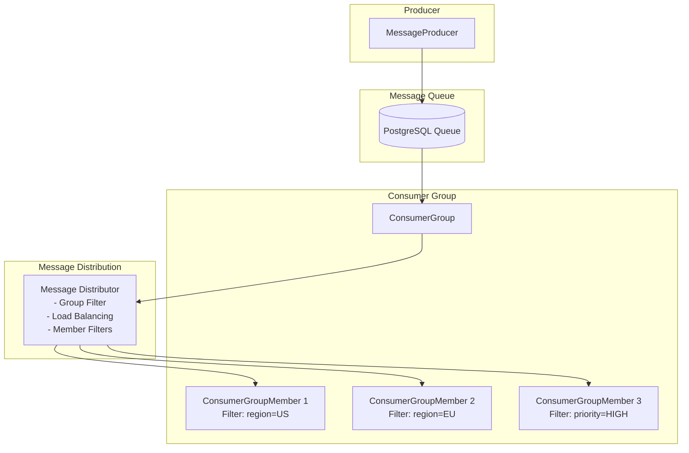

# PeeGeeQ Consumer Groups Implementation
#### &copy; Mark Andrew Ray-Smith Cityline Ltd 2025

This document describes the implementation of consumer groups in **PeeGeeQ** (PostgreSQL as a Message Queue), providing advanced message routing, load balancing, and filtering capabilities.

> **📖 Related Documentation:**
> - For practical routing examples and patterns, see [ROUTING_AND_CONSUMER_GROUPS.md](PeeGeeQ%20Routing%20and%20Consumer%20Groups%20Guide.md)
> - For advanced usage guide, see [ADVANCED_GUIDE.md](ADVANCED_GUIDE.md)

## Overview

Consumer groups in PeeGeeQ allow multiple consumers to work together to process messages from a topic. Key features include:

- **Load Balancing**: Messages are distributed across active consumers in the group
- **Message Filtering**: Each consumer can have its own message filter based on headers
- **Group-Level Filtering**: Apply filters at the group level before distribution
- **Statistics & Monitoring**: Comprehensive metrics for groups and individual consumers
- **Fault Tolerance**: Automatic handling of consumer failures and recovery

## Architecture



## Core Interfaces

### ConsumerGroup<T>

The main interface for managing a group of consumers:

```java
public interface ConsumerGroup<T> extends AutoCloseable {
    String getGroupName();
    String getTopic();
    
    ConsumerGroupMember<T> addConsumer(String consumerId, MessageHandler<T> handler);
    ConsumerGroupMember<T> addConsumer(String consumerId, MessageHandler<T> handler, 
                                      Predicate<Message<T>> messageFilter);
    
    boolean removeConsumer(String consumerId);
    Set<String> getConsumerIds();
    int getActiveConsumerCount();
    
    void start();
    void stop();
    boolean isActive();
    
    ConsumerGroupStats getStats();
    void setGroupFilter(Predicate<Message<T>> groupFilter);
    Predicate<Message<T>> getGroupFilter();
}
```

### ConsumerGroupMember<T>

Represents an individual consumer within a group:

```java
public interface ConsumerGroupMember<T> extends AutoCloseable {
    String getConsumerId();
    String getGroupName();
    String getTopic();
    
    MessageHandler<T> getMessageHandler();
    Predicate<Message<T>> getMessageFilter();
    void setMessageFilter(Predicate<Message<T>> messageFilter);
    
    void start();
    void stop();
    boolean isActive();
    
    ConsumerMemberStats getStats();
}
```

## Message Filtering

### MessageFilter Utility Class

Provides common filtering patterns:

```java
// Filter by header value
Predicate<Message<T>> filter = MessageFilter.byHeader("region", "US");

// Filter by multiple header values
Predicate<Message<T>> filter = MessageFilter.byHeaders(Map.of(
    "region", "US",
    "priority", "HIGH"
));

// Filter by priority
Predicate<Message<T>> filter = MessageFilter.byPriority("HIGH");

// Filter by region
Predicate<Message<T>> filter = MessageFilter.byRegion(Set.of("US", "EU"));

// Combine filters
Predicate<Message<T>> filter = MessageFilter.and(
    MessageFilter.byRegion(Set.of("US")),
    MessageFilter.byPriority("HIGH")
);

// Accept all messages
Predicate<Message<T>> filter = MessageFilter.acceptAll();
```

## Implementation Details

### Native Queue Implementation

- **PgNativeConsumerGroup**: Uses PostgreSQL LISTEN/NOTIFY for real-time message delivery
- **PgNativeConsumerGroupMember**: Individual consumer with filtering and statistics
- **Load Balancing**: Round-robin distribution based on message ID hash
- **Performance**: 10,000+ messages/second with <10ms latency

### Outbox Pattern Implementation

- **OutboxConsumerGroup**: Uses polling for transactional message delivery
- **OutboxConsumerGroupMember**: Individual consumer with transactional guarantees
- **Load Balancing**: Consistent distribution across consumers
- **Performance**: 5,000+ messages/second with transactional consistency

## Usage Examples

### Basic Consumer Group

```java
// Create consumer group
ConsumerGroup<OrderEvent> orderGroup = factory.createConsumerGroup(
    "OrderProcessing", "order-events", OrderEvent.class);

// Add consumers with different filters
orderGroup.addConsumer("US-Consumer", 
    createOrderHandler("US"), 
    MessageFilter.byRegion(Set.of("US")));

orderGroup.addConsumer("EU-Consumer", 
    createOrderHandler("EU"), 
    MessageFilter.byRegion(Set.of("EU")));

// Start processing
orderGroup.start();
```

### Advanced Filtering

```java
// Create consumer group with group-level filter
ConsumerGroup<OrderEvent> premiumGroup = factory.createConsumerGroup(
    "PremiumProcessing", "order-events", OrderEvent.class);

// Set group filter for premium orders only
premiumGroup.setGroupFilter(MessageFilter.byHeader("type", "PREMIUM"));

// Add priority-based consumers
premiumGroup.addConsumer("HighPriority-Consumer", 
    createPriorityHandler("HIGH"), 
    MessageFilter.byPriority("HIGH"));

premiumGroup.addConsumer("Normal-Consumer", 
    createPriorityHandler("NORMAL"), 
    MessageFilter.byPriority("NORMAL"));

premiumGroup.start();
```

### Multi-Header Filtering

```java
// Complex filtering with multiple conditions
ConsumerGroup<OrderEvent> analyticsGroup = factory.createConsumerGroup(
    "Analytics", "order-events", OrderEvent.class);

// Consumer for US premium orders
analyticsGroup.addConsumer("US-Premium-Consumer", 
    createAnalyticsHandler("US-PREMIUM"), 
    MessageFilter.and(
        MessageFilter.byRegion(Set.of("US")),
        MessageFilter.byType(Set.of("PREMIUM"))
    ));

// Consumer for high-priority orders from any region
analyticsGroup.addConsumer("HighPriority-Consumer", 
    createAnalyticsHandler("HIGH-PRIORITY"), 
    MessageFilter.byPriority("HIGH"));

analyticsGroup.start();
```

## Statistics and Monitoring

### Consumer Group Statistics

```java
ConsumerGroupStats stats = consumerGroup.getStats();

System.out.println("Group: " + stats.getGroupName());
System.out.println("Active Consumers: " + stats.getActiveConsumerCount());
System.out.println("Total Processed: " + stats.getTotalMessagesProcessed());
System.out.println("Success Rate: " + stats.getSuccessRate() + "%");
System.out.println("Messages/sec: " + stats.getMessagesPerSecond());
```

### Individual Consumer Statistics

```java
stats.getMemberStats().forEach((consumerId, memberStats) -> {
    System.out.printf("Consumer %s: processed=%d, failed=%d, rate=%.2f msg/s%n",
        consumerId, 
        memberStats.getMessagesProcessed(),
        memberStats.getMessagesFailed(),
        memberStats.getMessagesPerSecond());
});
```

## Performance Characteristics

### Native Queue Consumer Groups

- **Throughput**: 10,000+ messages/second
- **Latency**: <10ms end-to-end
- **Scalability**: Horizontal scaling with multiple consumer instances
- **Real-time**: LISTEN/NOTIFY for immediate message delivery

### Outbox Pattern Consumer Groups

- **Throughput**: 5,000+ messages/second
- **Latency**: 50-200ms (polling-based)
- **Consistency**: Transactional guarantees
- **Reliability**: At-least-once delivery with retry mechanisms

## Best Practices

### Consumer Group Design

1. **Logical Grouping**: Group consumers by business function or processing requirements
2. **Filter Efficiency**: Apply most selective filters first
3. **Load Distribution**: Design filters to distribute load evenly
4. **Error Handling**: Implement proper error handling in message handlers

### Message Routing

1. **Header Strategy**: Use consistent header naming conventions
2. **Filter Complexity**: Keep filters simple for better performance
3. **Fallback Consumers**: Include consumers that accept all messages for audit/backup
4. **Regional Distribution**: Use geographic headers for regional processing

### Performance Optimization

1. **Consumer Count**: Start with fewer consumers and scale based on load
2. **Processing Time**: Keep message processing fast to maintain throughput
3. **Connection Pooling**: Configure adequate database connection pools
4. **Monitoring**: Monitor consumer lag and processing rates

## Configuration

### Consumer Group Settings

```properties
# Consumer group configuration
peegeeq.consumer.group.max-concurrent=10
peegeeq.consumer.group.processing-timeout=PT30S
peegeeq.consumer.group.retry-attempts=3

# Load balancing strategy
peegeeq.consumer.group.load-balancing=ROUND_ROBIN
peegeeq.consumer.group.sticky-sessions=false

# Monitoring
peegeeq.consumer.group.metrics.enabled=true
peegeeq.consumer.group.health-check.interval=PT10S
```

## Testing

### Unit Tests

```java
@Test
void testConsumerGroupFiltering() {
    ConsumerGroup<String> group = factory.createConsumerGroup(
        "TestGroup", "test-topic", String.class);
    
    AtomicInteger usCount = new AtomicInteger(0);
    AtomicInteger euCount = new AtomicInteger(0);
    
    group.addConsumer("us-consumer", 
        msg -> { usCount.incrementAndGet(); return CompletableFuture.completedFuture(null); },
        MessageFilter.byHeader("region", "US"));
    
    group.addConsumer("eu-consumer", 
        msg -> { euCount.incrementAndGet(); return CompletableFuture.completedFuture(null); },
        MessageFilter.byHeader("region", "EU"));
    
    group.start();
    
    // Send test messages and verify filtering
    // ... test implementation
}
```

### Integration Tests

Run the provided examples:

```bash
# Simple consumer group test
mvn exec:java -Dexec.mainClass="dev.mars.peegeeq.examples.SimpleConsumerGroupTest"

# Advanced consumer group example
mvn exec:java -Dexec.mainClass="dev.mars.peegeeq.examples.ConsumerGroupExample"
```

## Troubleshooting

### Common Issues

1. **Messages Not Being Processed**
   - Check consumer filters are not too restrictive
   - Verify consumer group is started
   - Check database connectivity

2. **Uneven Load Distribution**
   - Review filter design for better distribution
   - Consider adding more consumers
   - Check message header distribution

3. **Performance Issues**
   - Monitor consumer processing times
   - Check database connection pool settings
   - Review filter complexity

### Debugging

Enable debug logging:

```properties
logging.level.dev.mars.peegeeq.pgqueue=DEBUG
logging.level.dev.mars.peegeeq.outbox=DEBUG
```

This will provide detailed information about message distribution, filtering decisions, and consumer activity.

## Future Enhancements

- **Dynamic Consumer Scaling**: Automatic scaling based on queue depth
- **Advanced Load Balancing**: Weighted round-robin and least-connections strategies
- **Consumer Affinity**: Route related messages to the same consumer
- **Dead Letter Queue Integration**: Enhanced error handling with DLQ support
- **Metrics Integration**: Native Prometheus/Grafana dashboard support
