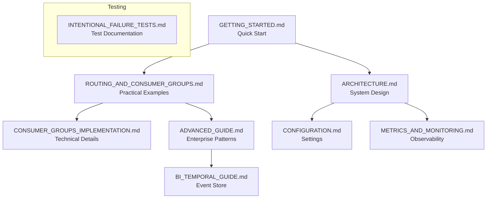

# PeeGeeQ Documentation Index
#### &copy; Mark Andrew Ray-Smith Cityline Ltd 2025

This directory contains comprehensive documentation for PeeGeeQ (PostgreSQL as a Message Queue).

## 📚 Documentation Structure

### Getting Started
- **[Getting Started Guide](PeeGeeQ%20Getting%20Started%20Guide.md)** - Quick start guide and basic concepts
- **[INSTALLATION.md](INSTALLATION.md)** - Installation and setup instructions

### Core Concepts
- **[Technical Architecture](PeeGeeQ%20Technical%20Architecture%20Overview.md)** - System architecture and design principles
- **[CONFIGURATION.md](CONFIGURATION.md)** - Configuration options and settings

### Consumer Groups & Routing
- **[ROUTING_AND_CONSUMER_GROUPS.md](PeeGeeQ%20Routing%20and%20Consumer%20Groups%20Guide.md)** - 📖 **Practical routing guide with examples**
  - Topic-based routing
  - Header-based routing  
  - Priority-based routing
  - Consumer group patterns
  - Advanced routing strategies
  - Performance optimization

- **[CONSUMER_GROUPS_IMPLEMENTATION.md](PeeGeeQ%20Consumer%20Groups%20Implementation.md)** - 🔧 **Technical implementation details**
  - Core interfaces and APIs
  - Implementation specifics
  - Performance characteristics
  - Configuration and testing
  - Troubleshooting

### Advanced Topics
- **[ADVANCED_GUIDE.md](ADVANCED_GUIDE.md)** - Advanced patterns and enterprise features
- **[BI_TEMPORAL_GUIDE.md](BI_TEMPORAL_GUIDE.md)** - Bi-temporal event store capabilities
- **[METRICS_AND_MONITORING.md](METRICS_AND_MONITORING.md)** - Monitoring and observability

### Testing & Quality
- **[INTENTIONAL_FAILURE_TESTS.md](Intentional%20Failure%20Tests%20Documentation.md)** - Guide to intentional failure tests

## 🎯 Quick Navigation

### I want to...

**Get started quickly**
→ [GETTING_STARTED.md](GETTING_STARTED.md)

**Route messages by headers/priority/region**
→ [ROUTING_AND_CONSUMER_GROUPS.md](PeeGeeQ%20Routing%20and%20Consumer%20Groups%20Guide.md)

**Understand consumer group internals**
→ [CONSUMER_GROUPS_IMPLEMENTATION.md](PeeGeeQ%20Consumer%20Groups%20Implementation.md)

**Implement advanced patterns**
→ [ADVANCED_GUIDE.md](ADVANCED_GUIDE.md)

**Set up monitoring**
→ [METRICS_AND_MONITORING.md](METRICS_AND_MONITORING.md)

**Work with bi-temporal data**
→ [BI_TEMPORAL_GUIDE.md](BI_TEMPORAL_GUIDE.md)

## 📖 Document Relationships

## 📋 Document Types

| Icon | Type | Purpose |
|------|------|---------|
| 📖 | **Guide** | Step-by-step instructions and examples |
| 🔧 | **Reference** | Technical specifications and APIs |
| 🎯 | **Tutorial** | Hands-on learning with complete examples |
| 📊 | **Specification** | Detailed technical requirements |

## 🔄 Document Maintenance

- **High Frequency Updates**: Routing examples, configuration guides
- **Medium Frequency Updates**: Getting started, advanced patterns  
- **Low Frequency Updates**: Architecture, implementation details

## 💡 Contributing to Documentation

When adding new documentation:

1. **Choose the right document type** based on your content
2. **Add cross-references** to related documents
3. **Update this index** with new documents
4. **Include practical examples** where applicable
5. **Follow the established format** and style

## 🏷️ Document Tags

- **Beginner**: GETTING_STARTED.md, INSTALLATION.md
- **Intermediate**: ROUTING_AND_CONSUMER_GROUPS.md, CONFIGURATION.md
- **Advanced**: CONSUMER_GROUPS_IMPLEMENTATION.md, ADVANCED_GUIDE.md, BI_TEMPORAL_GUIDE.md
- **Reference**: ARCHITECTURE.md, METRICS_AND_MONITORING.md
- **Testing**: INTENTIONAL_FAILURE_TESTS.md
