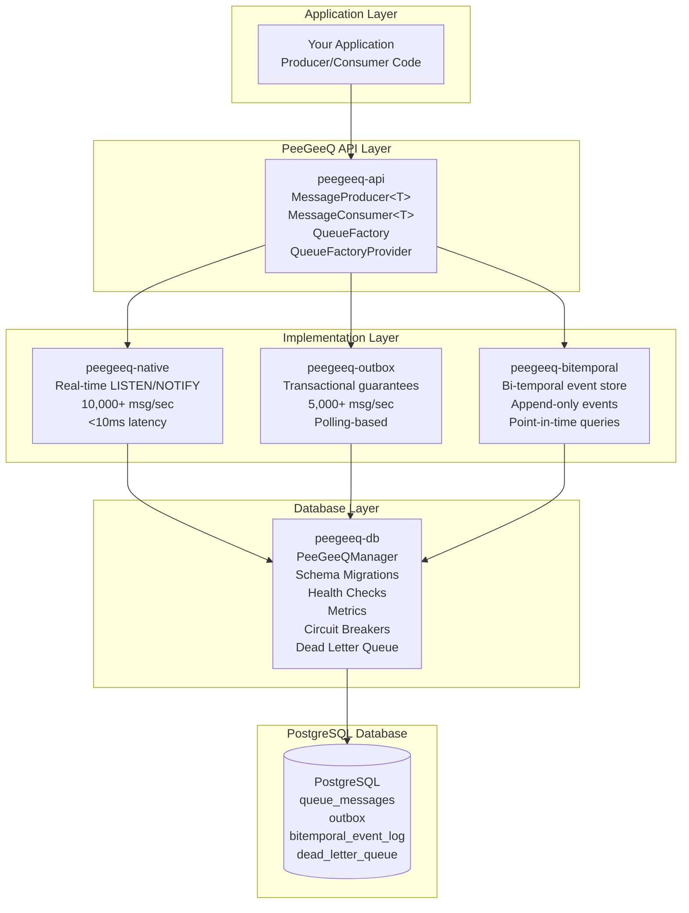

# PeeGeeQ Getting Started Guide 
#### &copy; Mark Andrew Ray-Smith Cityline Ltd 2025

Welcome to **PeeGeeQ** (PostgreSQL as a Message Queue) - a production-ready message queue system built on PostgreSQL that provides both high-performance real-time messaging and transactional messaging patterns.

## What is PeeGeeQ?

PeeGeeQ is an enterprise-grade message queue system that leverages PostgreSQL's advanced features to provide:

- **Native Queue**: High-performance, real-time message processing (10,000+ msg/sec, <10ms latency)
- **Outbox Pattern**: Transactional messaging with database consistency guarantees (5,000+ msg/sec)
- **Bi-Temporal Event Store**: Append-only event sourcing with bi-temporal queries and real-time processing
- **Production Features**: Health checks, metrics, circuit breakers, dead letter queues, and more

## Architecture Overview



## System Requirements

### Prerequisites

- **Java**: JDK 21 or higher
- **Maven**: 3.6 or higher
- **Docker**: Required for self-contained demo (recommended for getting started)
- **PostgreSQL**: 15+ (if not using Docker demo)

### Dependencies

PeeGeeQ automatically manages these dependencies:
- PostgreSQL JDBC Driver (42.6.0)
- HikariCP Connection Pooling (5.0.1)
- Vert.x Async Framework (4.5.11)
- Jackson JSON Processing (2.15.2)
- Micrometer Metrics (1.12.0)
- Resilience4j Circuit Breakers (2.1.0)

## Quick Start (Recommended)

The fastest way to get started is with our self-contained demo that requires no setup:

### Option 1: Using Shell Scripts

**Windows:**
```cmd
run-self-contained-demo.bat
```

**Unix/Linux/macOS:**
```bash
./run-self-contained-demo.sh
```

### Option 2: Using Maven Directly

```bash
mvn compile exec:java \
    -Dexec.mainClass="dev.mars.peegeeq.examples.PeeGeeQSelfContainedDemo" \
    -pl peegeeq-examples
```

This demo will:
- Start a PostgreSQL container automatically
- Demonstrate all PeeGeeQ production features
- Show both Native and Outbox patterns
- Clean up containers when finished
- Require no external setup

## Installation & Setup

### Option 1: Using Published Maven Artifacts (Recommended)

Add PeeGeeQ dependencies to your existing Maven project:

```xml
<properties>
    <peegeeq.version>1.0.0</peegeeq.version>
    <maven.compiler.source>21</maven.compiler.source>
    <maven.compiler.target>21</maven.compiler.target>
</properties>

<dependencies>
    <!-- PeeGeeQ Core Dependencies -->
    <dependency>
        <groupId>dev.mars</groupId>
        <artifactId>peegeeq-api</artifactId>
        <version>${peegeeq.version}</version>
    </dependency>
    <dependency>
        <groupId>dev.mars</groupId>
        <artifactId>peegeeq-db</artifactId>
        <version>${peegeeq.version}</version>
    </dependency>
    <dependency>
        <groupId>dev.mars</groupId>
        <artifactId>peegeeq-native</artifactId>
        <version>${peegeeq.version}</version>
    </dependency>
    <dependency>
        <groupId>dev.mars</groupId>
        <artifactId>peegeeq-outbox</artifactId>
        <version>${peegeeq.version}</version>
    </dependency>
    <dependency>
        <groupId>dev.mars</groupId>
        <artifactId>peegeeq-bitemporal</artifactId>
        <version>${peegeeq.version}</version>
    </dependency>

    <!-- Metrics (Optional but recommended) -->
    <dependency>
        <groupId>io.micrometer</groupId>
        <artifactId>micrometer-core</artifactId>
        <version>1.12.0</version>
    </dependency>
</dependencies>
```

### Option 2: Clone and Build from Source

```bash
git clone <repository-url>
cd peegeeq
mvn clean compile
```

### 3. Database Setup (If Not Using Docker Demo)

#### Option A: Local PostgreSQL

1. Install PostgreSQL 15+
2. Create database and user:

```sql
CREATE DATABASE peegeeq;
CREATE USER peegeeq WITH PASSWORD 'peegeeq';
GRANT ALL PRIVILEGES ON DATABASE peegeeq TO peegeeq;
```

#### Option B: Docker PostgreSQL

```bash
docker run -d \
  --name peegeeq-postgres \
  -e POSTGRES_DB=peegeeq \
  -e POSTGRES_USER=peegeeq \
  -e POSTGRES_PASSWORD=peegeeq \
  -p 5432:5432 \
  postgres:15
```

### 4. Run Examples

```bash
# Standard queue example with default configuration
java -cp <classpath> dev.mars.peegeeq.examples.PeeGeeQExample

# With specific profile
java -Dpeegeeq.profile=production -cp <classpath> dev.mars.peegeeq.examples.PeeGeeQExample

# Bi-temporal event store example
java -cp <classpath> dev.mars.peegeeq.examples.BiTemporalEventStoreExample
```

## Basic Usage

### Complete Example: Simple Producer and Consumer

Here's a complete example showing how to create a simple producer and consumer using the published PeeGeeQ artifacts:

#### 1. Create a new Maven project with this pom.xml:

```xml
<?xml version="1.0" encoding="UTF-8"?>
<project xmlns="http://maven.apache.org/POM/4.0.0"
         xmlns:xsi="http://www.w3.org/2001/XMLSchema-instance"
         xsi:schemaLocation="http://maven.apache.org/POM/4.0.0
         http://maven.apache.org/xsd/maven-4.0.0.xsd">
    <modelVersion>4.0.0</modelVersion>

    <groupId>com.example</groupId>
    <artifactId>my-peegeeq-app</artifactId>
    <version>1.0.0</version>

    <properties>
        <maven.compiler.source>21</maven.compiler.source>
        <maven.compiler.target>21</maven.compiler.target>
        <project.build.sourceEncoding>UTF-8</project.build.sourceEncoding>
        <peegeeq.version>1.0.0</peegeeq.version>
    </properties>

    <dependencies>
        <!-- PeeGeeQ Dependencies -->
        <dependency>
            <groupId>dev.mars</groupId>
            <artifactId>peegeeq-api</artifactId>
            <version>${peegeeq.version}</version>
        </dependency>
        <dependency>
            <groupId>dev.mars</groupId>
            <artifactId>peegeeq-db</artifactId>
            <version>${peegeeq.version}</version>
        </dependency>
        <dependency>
            <groupId>dev.mars</groupId>
            <artifactId>peegeeq-native</artifactId>
            <version>${peegeeq.version}</version>
        </dependency>
        <!-- Optional: For bi-temporal event store -->
        <dependency>
            <groupId>dev.mars</groupId>
            <artifactId>peegeeq-bitemporal</artifactId>
            <version>${peegeeq.version}</version>
        </dependency>

        <!-- Metrics -->
        <dependency>
            <groupId>io.micrometer</groupId>
            <artifactId>micrometer-core</artifactId>
            <version>1.12.0</version>
        </dependency>

        <!-- Logging -->
        <dependency>
            <groupId>ch.qos.logback</groupId>
            <artifactId>logback-classic</artifactId>
            <version>1.4.11</version>
        </dependency>
    </dependencies>
</project>
```

#### 2. Create your application class:

```java
package com.example;

import dev.mars.peegeeq.api.*;
import dev.mars.peegeeq.db.PeeGeeQManager;
import dev.mars.peegeeq.db.config.PeeGeeQConfiguration;
import dev.mars.peegeeq.db.provider.PgDatabaseService;
import dev.mars.peegeeq.db.provider.PgQueueFactoryProvider;
import io.micrometer.core.instrument.simple.SimpleMeterRegistry;
import org.slf4j.Logger;
import org.slf4j.LoggerFactory;

public class MyPeeGeeQApp {
    private static final Logger logger = LoggerFactory.getLogger(MyPeeGeeQApp.class);

    public static void main(String[] args) {
        // Initialize PeeGeeQ Manager
        try (PeeGeeQManager manager = new PeeGeeQManager(
                new PeeGeeQConfiguration("development"),
                new SimpleMeterRegistry())) {

            // Start all services
            manager.start();
            logger.info("PeeGeeQ Manager started successfully");

            // Create database service and factory provider
            DatabaseService databaseService = new PgDatabaseService(manager);
            QueueFactoryProvider provider = new PgQueueFactoryProvider();

            // Create native queue factory for high-performance messaging
            QueueFactory nativeFactory = provider.createNativeQueueFactory(databaseService);

            // Create producer and consumer
            MessageProducer<String> producer = nativeFactory.createProducer("my-topic", String.class);
            MessageConsumer<String> consumer = nativeFactory.createConsumer("my-topic", String.class);

            // Start consumer in background thread
            Thread consumerThread = new Thread(() -> {
                consumer.consume(message -> {
                    logger.info("Received message: {}", message.getPayload());
                    return true; // Acknowledge message
                });
            });
            consumerThread.start();

            // Send some messages
            for (int i = 1; i <= 5; i++) {
                String message = "Hello PeeGeeQ #" + i;
                producer.send(message);
                logger.info("Sent message: {}", message);
                Thread.sleep(1000); // Wait 1 second between messages
            }

            // Wait a bit for messages to be processed
            Thread.sleep(5000);

            logger.info("Application completed successfully");

        } catch (Exception e) {
            logger.error("Application failed", e);
            System.exit(1);
        }
    }
}
```

#### 3. Create configuration file (src/main/resources/peegeeq-development.properties):

```properties
# Database Configuration
peegeeq.database.host=localhost
peegeeq.database.port=5432
peegeeq.database.name=peegeeq
peegeeq.database.username=peegeeq
peegeeq.database.password=peegeeq

# Connection Pool
peegeeq.database.pool.min-size=2
peegeeq.database.pool.max-size=5

# Queue Settings
peegeeq.queue.max-retries=3
peegeeq.queue.visibility-timeout=PT30S

# Enable features
peegeeq.metrics.enabled=true
peegeeq.health.enabled=true
```

#### 4. Run your application:

```bash
# Ensure PostgreSQL is running (or use Docker)
docker run -d --name peegeeq-postgres \
  -e POSTGRES_DB=peegeeq \
  -e POSTGRES_USER=peegeeq \
  -e POSTGRES_PASSWORD=peegeeq \
  -p 5432:5432 \
  postgres:15

# Compile and run
mvn compile exec:java -Dexec.mainClass="com.example.MyPeeGeeQApp"
```

### Initialize PeeGeeQ Manager

```java
import dev.mars.peegeeq.db.PeeGeeQManager;
import dev.mars.peegeeq.db.config.PeeGeeQConfiguration;
import io.micrometer.core.instrument.simple.SimpleMeterRegistry;

// Initialize with configuration profile
PeeGeeQManager manager = new PeeGeeQManager(
    new PeeGeeQConfiguration("development"),
    new SimpleMeterRegistry()
);

// Start all services
manager.start();
```

### Native Queue - High Performance Real-time

```java
import dev.mars.peegeeq.api.*;
import dev.mars.peegeeq.db.provider.PgDatabaseService;
import dev.mars.peegeeq.db.provider.PgQueueFactoryProvider;

// Create database service and factory provider
DatabaseService databaseService = new PgDatabaseService(manager);
QueueFactoryProvider provider = new PgQueueFactoryProvider();

// Create native queue factory
QueueFactory nativeFactory = provider.createNativeQueueFactory(databaseService);

// Create producer and consumer
MessageProducer<String> producer = nativeFactory.createProducer("my-topic", String.class);
MessageConsumer<String> consumer = nativeFactory.createConsumer("my-topic", String.class);

// Send messages
producer.send("Hello, PeeGeeQ!");

// Consume messages
consumer.consume(message -> {
    System.out.println("Received: " + message.getPayload());
    return true; // Acknowledge message
});
```

### Outbox Pattern - Transactional Guarantees

```java
// Create outbox queue factory
QueueFactory outboxFactory = provider.createOutboxQueueFactory(databaseService);

// Create producer and consumer
MessageProducer<String> outboxProducer = outboxFactory.createProducer("my-outbox-topic", String.class);
MessageConsumer<String> outboxConsumer = outboxFactory.createConsumer("my-outbox-topic", String.class);

// Send messages with transactional guarantees
outboxProducer.send("Transactional message");

// Consume messages
outboxConsumer.consume(message -> {
    System.out.println("Received transactional: " + message.getPayload());
    return true;
});
```

### Bi-Temporal Event Store - Append-Only Event Sourcing

```java
import dev.mars.peegeeq.bitemporal.BiTemporalEventStoreFactory;
import dev.mars.peegeeq.bitemporal.EventStore;
import dev.mars.peegeeq.bitemporal.BiTemporalEvent;
import dev.mars.peegeeq.bitemporal.EventQuery;

// Create event store factory
BiTemporalEventStoreFactory factory = new BiTemporalEventStoreFactory(manager);

// Create event store for your event type
EventStore<OrderEvent> eventStore = factory.createEventStore(OrderEvent.class);

// Append events with bi-temporal dimensions
OrderEvent order = new OrderEvent("ORDER-001", "CUST-123", new BigDecimal("99.99"), "CREATED");
Instant validTime = Instant.now().minus(1, ChronoUnit.HOURS); // When it actually happened

BiTemporalEvent<OrderEvent> event = eventStore.append(
    "OrderCreated",
    order,
    validTime,
    Map.of("source", "web", "region", "US"),
    "correlation-123",
    "ORDER-001"
).join();

// Query events by type, aggregate, or temporal ranges
List<BiTemporalEvent<OrderEvent>> orderEvents = eventStore.query(
    EventQuery.forAggregate("ORDER-001")
).join();

// Point-in-time queries - see data as it was at any moment
Instant pointInTime = Instant.now().minus(1, ChronoUnit.HOURS);
List<BiTemporalEvent<OrderEvent>> historicalView = eventStore.query(
    EventQuery.asOfValidTime(pointInTime)
).join();

// Real-time subscriptions to event streams
eventStore.subscribe("OrderCreated", event -> {
    System.out.println("New order event: " + event.getPayload());
    return CompletableFuture.completedFuture(null);
}).join();

// Event corrections while maintaining audit trail
OrderEvent correctedOrder = new OrderEvent("ORDER-001", "CUST-123", new BigDecimal("89.99"), "CREATED");
BiTemporalEvent<OrderEvent> correction = eventStore.appendCorrection(
    event.getEventId(),
    "OrderCreated",
    correctedOrder,
    validTime,
    "Price correction due to discount"
).join();
```

**Key Features:**
- **Append-only**: Events are never deleted, only new versions added
- **Bi-temporal**: Track both when events happened (valid time) and when recorded (transaction time)
- **Real-time**: Immediate processing via PostgreSQL LISTEN/NOTIFY
- **Historical**: Query any point-in-time view of your data
- **Type safety**: Strongly typed events with JSON storage flexibility
- **Event corrections**: Support for correcting historical events while maintaining audit trail

## Configuration

### Environment Profiles

PeeGeeQ supports multiple configuration profiles:

- `development` - Default settings for local development
- `production` - Optimized for production environments
- `test` - Configured for testing scenarios

### Configuration Files

Configuration is loaded from:
1. `peegeeq-default.properties` (base configuration)
2. `peegeeq-{profile}.properties` (profile-specific overrides)
3. System properties (highest priority)
4. Environment variables

### Key Configuration Properties

```properties
# Database Configuration
peegeeq.database.host=localhost
peegeeq.database.port=5432
peegeeq.database.name=peegeeq
peegeeq.database.username=peegeeq
peegeeq.database.password=peegeeq

# Connection Pool
peegeeq.database.pool.min-size=5
peegeeq.database.pool.max-size=10

# Queue Settings
peegeeq.queue.max-retries=3
peegeeq.queue.visibility-timeout=PT30S
peegeeq.queue.dead-letter.enabled=true

# Metrics & Monitoring
peegeeq.metrics.enabled=true
peegeeq.health.enabled=true
peegeeq.circuit-breaker.enabled=true
```

## Module Structure

PeeGeeQ is organized into focused modules:

- **peegeeq-api**: Core interfaces and contracts
- **peegeeq-db**: Database management, migrations, health checks
- **peegeeq-native**: High-performance LISTEN/NOTIFY implementation
- **peegeeq-outbox**: Transactional outbox pattern implementation
- **peegeeq-bitemporal**: Bi-temporal event store with append-only events and temporal queries
- **peegeeq-examples**: Self-contained demo applications

## Production Features

### Health Checks
```java
boolean healthy = manager.isHealthy();
PeeGeeQManager.SystemStatus status = manager.getSystemStatus();
```

### Metrics Collection
```java
// Metrics are automatically collected and available via Micrometer
// Integrate with Prometheus, Grafana, or other monitoring systems
```

### Circuit Breakers
```java
// Automatic circuit breaker protection for database operations
// Configurable failure thresholds and recovery timeouts
```

### Dead Letter Queue
```java
// Failed messages automatically moved to dead letter queue
// Supports message reprocessing and failure analysis
```

## Next Steps

1. **Explore the Examples**: Run the self-contained demo to see all features
2. **Try the Bi-Temporal Event Store**: Run `BiTemporalEventStoreExample` to see event sourcing capabilities
3. **Read the Documentation**: Check out the `docs/` directory for detailed guides
4. **Run Tests**: Execute `mvn test` to see comprehensive integration tests
5. **Customize Configuration**: Adapt settings for your environment
6. **Integrate with Your Application**: Use PeeGeeQManager in your code
7. **Set up Monitoring**: Configure metrics collection and alerting

## Troubleshooting

### Common Issues

1. **Docker Not Running**
   - Ensure Docker Desktop is started
   - Check `docker info` command works

2. **Database Connection Failed**
   - Verify PostgreSQL is running
   - Check host, port, and credentials
   - Ensure database exists and user has permissions

3. **Port Conflicts**
   - Default PostgreSQL port is 5432
   - Change port in configuration if needed

### Getting Help

- Check the logs in the `logs/` directory
- Review the comprehensive documentation in `docs/`
- Examine the example code in `peegeeq-examples/`
- Run tests to verify your setup: `mvn test`

## License

PeeGeeQ is licensed under the Apache License, Version 2.0. See the `LICENSE` file for details.

---

**Ready to get started?** Run the self-contained demo now:

```bash
./run-self-contained-demo.sh    # Unix/Linux/macOS
run-self-contained-demo.bat     # Windows
```
