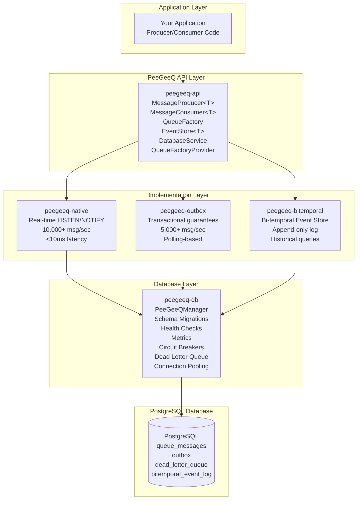
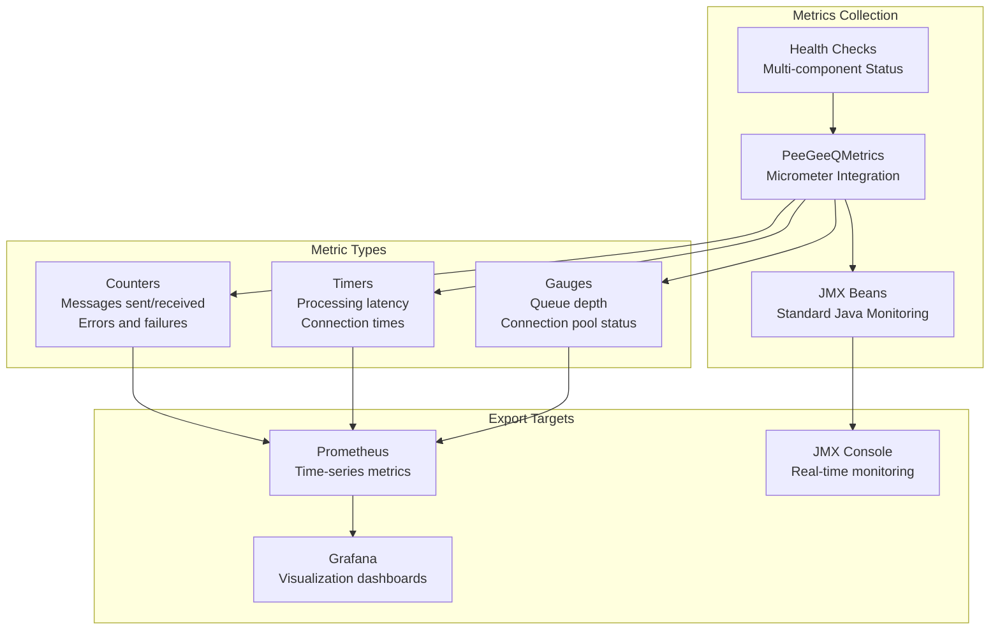

# PeeGeeQ Technical Architecture

## Overview

PeeGeeQ is a production-ready, enterprise-grade message queue system built on PostgreSQL, providing both native queue functionality and outbox pattern implementation. The system leverages PostgreSQL's advanced features including LISTEN/NOTIFY, advisory locks, and ACID transactions to deliver reliable, scalable message processing.

## System Architecture

### Core Components



### Module Structure

#### 1. **peegeeq-api** - Core Interfaces
- `MessageProducer<T>` - Message publishing interface
- `MessageConsumer<T>` - Message consumption interface
- `Message<T>` - Message abstraction
- `EventStore<T>` - Bi-temporal event store interface
- `BiTemporalEvent<T>` - Bi-temporal event abstraction
- `DatabaseService` - Database operations interface
- `QueueFactoryProvider` - Factory provider interface
- Common data structures and contracts

#### 2. **peegeeq-db** - Database Foundation
- `PeeGeeQManager` - Unified management interface
- `SchemaMigrationManager` - Database schema migrations
- `PeeGeeQMetrics` - Comprehensive metrics collection
- `HealthCheckManager` - Multi-component health monitoring
- `CircuitBreakerManager` - Resilience patterns
- `BackpressureManager` - Adaptive flow control
- `DeadLetterQueueManager` - Failed message handling
- `PgConnectionProvider` - PostgreSQL connection management
- `PgDatabaseService` - PostgreSQL database operations
- `PgQueueFactoryProvider` - PostgreSQL factory provider

#### 3. **peegeeq-native** - Native Queue Implementation
- `PgNativeQueueFactory` - Native queue factory
- `PgNativeProducer` - LISTEN/NOTIFY based producer
- `PgNativeConsumer` - Real-time message consumer
- `NotificationListener` - PostgreSQL notification handling
- Real-time message processing with LISTEN/NOTIFY
- Advisory locks for concurrency control
- Visibility timeout for message reliability
- Dead letter queue integration
- Comprehensive metrics tracking
- Vert.x-based async processing

#### 4. **peegeeq-outbox** - Outbox Pattern Implementation
- `OutboxFactory` - Outbox queue factory
- `OutboxProducer` - Transactional message producer
- `OutboxConsumer` - Polling-based consumer
- `OutboxMessage` - Outbox message implementation
- Transactional outbox pattern
- JDBC-based reliable messaging
- Polling-based message processing
- Integration with existing database transactions

#### 5. **peegeeq-bitemporal** - Bi-Temporal Event Store
- `BiTemporalEventStoreFactory` - Event store factory
- `PgBiTemporalEventStore` - PostgreSQL event store implementation
- Append-only event storage with bi-temporal dimensions
- Real-time event notifications via PostgreSQL LISTEN/NOTIFY
- Efficient querying with temporal ranges
- Type-safe event handling with JSON serialization
- Historical point-in-time queries
- Event versioning and corrections

#### 6. **peegeeq-examples** - Example Applications
- `PeeGeeQExample` - Comprehensive feature demonstration
- `PeeGeeQSelfContainedDemo` - TestContainers-based demo
- `BiTemporalEventStoreExample` - Bi-temporal event store demo

## Database Schema

### Core Tables

```sql
-- Native queue messages table
CREATE TABLE queue_messages (
    id BIGSERIAL PRIMARY KEY,
    topic VARCHAR(255) NOT NULL,
    payload JSONB NOT NULL,
    visible_at TIMESTAMPTZ DEFAULT NOW(),
    created_at TIMESTAMPTZ DEFAULT NOW(),
    lock_id BIGINT,
    lock_until TIMESTAMPTZ,
    retry_count INTEGER DEFAULT 0,
    max_retries INTEGER DEFAULT 3,
    status VARCHAR(50) DEFAULT 'AVAILABLE' CHECK (status IN ('AVAILABLE', 'LOCKED', 'PROCESSED', 'FAILED', 'DEAD_LETTER')),
    headers JSONB DEFAULT '{}',
    error_message TEXT,
    correlation_id VARCHAR(255),
    message_group VARCHAR(255),
    priority INTEGER DEFAULT 5 CHECK (priority BETWEEN 1 AND 10)
);

-- Outbox table for transactional messaging
CREATE TABLE outbox (
    id BIGSERIAL PRIMARY KEY,
    topic VARCHAR(255) NOT NULL,
    payload JSONB NOT NULL,
    created_at TIMESTAMPTZ DEFAULT NOW(),
    processed_at TIMESTAMPTZ,
    status VARCHAR(50) DEFAULT 'PENDING' CHECK (status IN ('PENDING', 'PROCESSING', 'COMPLETED', 'FAILED', 'DEAD_LETTER')),
    retry_count INTEGER DEFAULT 0,
    max_retries INTEGER DEFAULT 3,
    next_retry_at TIMESTAMPTZ,
    version INTEGER DEFAULT 0,
    headers JSONB DEFAULT '{}',
    error_message TEXT,
    correlation_id VARCHAR(255),
    message_group VARCHAR(255),
    priority INTEGER DEFAULT 5 CHECK (priority BETWEEN 1 AND 10)
);

-- Bi-temporal event log table
CREATE TABLE bitemporal_event_log (
    id BIGSERIAL PRIMARY KEY,
    event_id VARCHAR(255) NOT NULL,
    event_type VARCHAR(255) NOT NULL,

    -- Bi-temporal dimensions
    valid_time TIMESTAMPTZ NOT NULL,
    transaction_time TIMESTAMPTZ DEFAULT NOW() NOT NULL,

    -- Event data
    payload JSONB NOT NULL,
    headers JSONB DEFAULT '{}',

    -- Versioning and corrections
    version BIGINT DEFAULT 1 NOT NULL,
    previous_version_id VARCHAR(255),
    is_correction BOOLEAN DEFAULT FALSE NOT NULL,
    correction_reason TEXT,

    -- Grouping and correlation
    correlation_id VARCHAR(255),
    aggregate_id VARCHAR(255),

    -- Metadata
    created_at TIMESTAMPTZ DEFAULT NOW() NOT NULL
);

-- Dead letter queue for failed messages
CREATE TABLE dead_letter_queue (
    id BIGSERIAL PRIMARY KEY,
    original_table VARCHAR(50) NOT NULL,
    original_id BIGINT NOT NULL,
    topic VARCHAR(255) NOT NULL,
    payload JSONB NOT NULL,
    original_created_at TIMESTAMPTZ NOT NULL,
    failed_at TIMESTAMPTZ DEFAULT NOW(),
    failure_reason TEXT NOT NULL,
    retry_count INTEGER NOT NULL,
    headers JSONB DEFAULT '{}',
    correlation_id VARCHAR(255),
    message_group VARCHAR(255)
);
```

### Performance Indexes

```sql
-- Queue messages indexes
CREATE INDEX idx_queue_messages_topic_status ON queue_messages(topic, status);
CREATE INDEX idx_queue_messages_visible_at ON queue_messages(visible_at);
CREATE INDEX idx_queue_messages_lock_until ON queue_messages(lock_until);
CREATE INDEX idx_queue_messages_priority_created ON queue_messages(priority DESC, created_at ASC);

-- Outbox indexes
CREATE INDEX idx_outbox_status_created ON outbox(status, created_at);
CREATE INDEX idx_outbox_next_retry ON outbox(next_retry_at) WHERE status = 'FAILED';

-- Bi-temporal event log indexes
CREATE INDEX idx_bitemporal_event_id ON bitemporal_event_log(event_id);
CREATE INDEX idx_bitemporal_event_type ON bitemporal_event_log(event_type);
CREATE INDEX idx_bitemporal_valid_time ON bitemporal_event_log(valid_time);
CREATE INDEX idx_bitemporal_transaction_time ON bitemporal_event_log(transaction_time);
CREATE INDEX idx_bitemporal_aggregate_id ON bitemporal_event_log(aggregate_id);
CREATE INDEX idx_bitemporal_correlation_id ON bitemporal_event_log(correlation_id);

-- Dead letter queue indexes
CREATE INDEX idx_dlq_original ON dead_letter_queue(original_table, original_id);
CREATE INDEX idx_dlq_topic ON dead_letter_queue(topic);
CREATE INDEX idx_dlq_failed_at ON dead_letter_queue(failed_at);
```

## Key Features

### 1. Real-time Message Processing
- **LISTEN/NOTIFY**: Immediate message delivery using PostgreSQL's pub/sub
- **Zero Polling**: Messages are pushed to consumers instantly
- **Channel Management**: Automatic channel subscription and cleanup
- **Event Notifications**: Real-time bi-temporal event notifications

### 2. Concurrency Control
- **Advisory Locks**: Prevents duplicate message processing
- **Visibility Timeout**: Automatic message release after timeout
- **Lock Expiration**: Background cleanup of expired locks
- **Connection Pooling**: Efficient resource utilization with HikariCP

### 3. Reliability & Resilience
- **Dead Letter Queue**: Failed messages moved to DLQ after retry limit
- **Circuit Breakers**: Automatic failure detection and recovery
- **Health Checks**: Continuous system health monitoring
- **Backpressure**: Automatic load management
- **Retry Mechanisms**: Configurable retry policies with exponential backoff

### 4. Observability & Monitoring
- **Comprehensive Metrics**: Message lifecycle tracking with Micrometer
- **Performance Monitoring**: Processing time and throughput metrics
- **Error Tracking**: Detailed failure analysis and alerting
- **Health Dashboards**: Real-time system status monitoring
- **JMX Integration**: Standard Java monitoring capabilities
- **Structured Logging**: Comprehensive observability with SLF4J

### 5. Transactional Guarantees
- **Outbox Pattern**: Ensures message delivery with database transactions
- **ACID Compliance**: Full transactional consistency
- **Exactly-Once Processing**: Prevents message duplication
- **Transactional Event Store**: Bi-temporal events with full ACID guarantees

### 6. Bi-Temporal Event Store
- **Append-Only Storage**: Events are never deleted, only new versions added
- **Bi-Temporal Dimensions**: Track both valid time and transaction time
- **Historical Queries**: Query any point-in-time view of your data
- **Event Versioning**: Support for event corrections and updates
- **Type Safety**: Strongly typed events with JSON storage flexibility
- **Real-time Processing**: Immediate event processing via LISTEN/NOTIFY

## Performance Characteristics

### Throughput
- **Native Queue**: 10,000+ messages/second
- **Outbox Pattern**: 5,000+ messages/second
- **Bi-Temporal Event Store**: 8,000+ events/second
- **Concurrent Consumers**: Scales linearly with consumer count
- **Connection Pooling**: Optimized with HikariCP for high throughput

### Latency
- **Real-time Delivery**: <10ms with LISTEN/NOTIFY
- **Polling-based**: 2-5 seconds (configurable)
- **Processing Overhead**: <1ms per message
- **Event Store Queries**: <5ms for recent events, <50ms for historical queries

### Scalability
- **Horizontal Scaling**: Multiple consumer instances
- **Vertical Scaling**: Leverages PostgreSQL performance
- **Connection Pooling**: Efficient resource utilization
- **Database Partitioning**: Support for table partitioning strategies
- **Read Replicas**: Support for read-only query distribution

### Resource Usage
- **Memory**: Configurable connection pool sizing
- **CPU**: Optimized for multi-core processing
- **Storage**: Efficient JSONB storage with compression
- **Network**: Minimal overhead with connection reuse

## Configuration

### Database Connection
```properties
# Database Connection
peegeeq.database.host=localhost
peegeeq.database.port=5432
peegeeq.database.name=peegeeq
peegeeq.database.username=peegeeq
peegeeq.database.password=peegeeq
peegeeq.database.ssl.enabled=true
```

### Connection Pool
```properties
# Connection Pool
peegeeq.database.pool.min-size=5
peegeeq.database.pool.max-size=20
peegeeq.database.pool.connection-timeout=30000
peegeeq.database.pool.idle-timeout=600000
peegeeq.database.pool.max-lifetime=1800000
```

### Queue Configuration
```properties
# Queue Settings
peegeeq.queue.visibility-timeout=PT30S
peegeeq.queue.max-retries=3
peegeeq.queue.dead-letter.enabled=true

# Metrics & Monitoring
peegeeq.metrics.enabled=true
peegeeq.health.enabled=true
peegeeq.circuit-breaker.enabled=true

# Bi-Temporal Event Store
peegeeq.bitemporal.table-name=bitemporal_event_log
peegeeq.bitemporal.notification-prefix=peegeeq_event_
peegeeq.bitemporal.query-limit=1000
peegeeq.bitemporal.metrics.enabled=true
```

## Technology Stack

### Core Technologies
- **Java 21**: Modern Java features and performance
- **PostgreSQL 15+**: Advanced database features with JSONB support
- **Vert.x 4.5.11**: Reactive, non-blocking I/O framework
- **HikariCP 5.0.1**: High-performance connection pooling
- **Jackson 2.15.2**: JSON serialization/deserialization
- **Reactor 3.5.8**: Reactive programming support

### Database & Persistence
- **PostgreSQL JDBC Driver 42.6.0**: Latest PostgreSQL connectivity
- **Flyway**: Database schema migrations
- **JSONB**: Efficient JSON storage and querying
- **LISTEN/NOTIFY**: Real-time event notifications
- **Advisory Locks**: Distributed locking mechanisms

### Testing & Quality
- **JUnit 5.10.1**: Modern testing framework
- **TestContainers**: Integration testing with real PostgreSQL
- **Maven**: Build and dependency management
- **SLF4J + Logback**: Structured logging
- **AssertJ**: Fluent assertion library

### Monitoring & Observability
- **Micrometer**: Metrics collection and export
- **JMX**: Java Management Extensions for monitoring
- **Health Checks**: Multi-component system health monitoring
- **Circuit Breakers**: Resilience patterns implementation
- **Structured Logging**: Comprehensive observability with correlation IDs
- **Prometheus Integration**: Ready for Prometheus/Grafana monitoring

## Monitoring and Metrics

### Comprehensive Metrics Collection

PeeGeeQ provides extensive monitoring capabilities through the `PeeGeeQMetrics` class:



### Key Metrics Tracked

#### Message Processing Metrics
- **Messages Sent/Received**: Per-topic counters
- **Processing Latency**: Message processing time distribution
- **Error Rates**: Failed message processing counters
- **Retry Attempts**: Message retry statistics

#### Queue Metrics
- **Queue Depth**: Current number of messages in queue
- **Dead Letter Queue Size**: Failed messages count
- **Visibility Timeout Violations**: Lock timeout occurrences

#### Connection Pool Metrics
- **Active Connections**: Currently active database connections
- **Pool Utilization**: Connection pool usage percentage
- **Connection Wait Time**: Time waiting for available connections

#### Bi-Temporal Event Store Metrics
- **Events Appended**: Total events stored
- **Query Performance**: Historical query execution times
- **Storage Growth**: Event log size and growth rate

### Health Checks

Multi-component health monitoring includes:
- **Database Connectivity**: PostgreSQL connection status
- **Connection Pool Health**: Pool availability and performance
- **Circuit Breaker Status**: Resilience pattern states
- **Dead Letter Queue Status**: DLQ processing health

## Deployment Considerations

### Database Requirements
- PostgreSQL 15+ recommended
- Sufficient connection pool sizing
- Proper indexing for performance
- Regular maintenance and monitoring

### Application Requirements
- Java 21+ runtime
- Adequate heap sizing for message processing
- Network connectivity to PostgreSQL
- Monitoring and alerting setup

### Security
- Database connection encryption (SSL/TLS)
- Authentication and authorization
- Network security (VPC, firewalls)
- Audit logging for compliance

## Architecture Benefits

### Clean Module Boundaries
- **Dependency Inversion**: Implementation modules depend on abstractions
- **Pluggable Architecture**: New queue implementations can be added easily
- **Unified Factory Pattern**: Consistent factory approach for all implementations
- **Broken Circular Dependencies**: Clean module separation

### Production Ready Features
- **Comprehensive Testing**: 151+ tests across all modules
- **Self-Contained Demos**: TestContainers-based examples
- **Monitoring Integration**: Ready for Prometheus/Grafana
- **Enterprise Patterns**: Circuit breakers, backpressure, health checks

### Bi-Temporal Capabilities
- **Event Sourcing**: Complete audit trail with bi-temporal dimensions
- **Historical Queries**: Point-in-time data reconstruction
- **Real-time Processing**: Immediate event notifications
- **Type Safety**: Strongly typed events with JSON flexibility

## Next Steps

This architecture provides a comprehensive foundation for enterprise message processing and event sourcing. Future enhancements may include:

### Planned Features
- **Message Routing**: Advanced routing and filtering capabilities
- **Schema Evolution**: Support for event schema versioning
- **Multi-Tenant**: Tenant isolation and resource management
- **Consumer Groups**: Advanced consumer group management
- **Stream Processing**: Integration with stream processing frameworks

### Integration Opportunities
- **Cloud-Native Deployment**: Kubernetes and container orchestration
- **Microservices Patterns**: Service mesh integration
- **Event-Driven Architecture**: CQRS and event sourcing patterns
- **Advanced Monitoring**: Custom dashboards and alerting rules
- **Performance Optimization**: Query optimization and caching strategies
