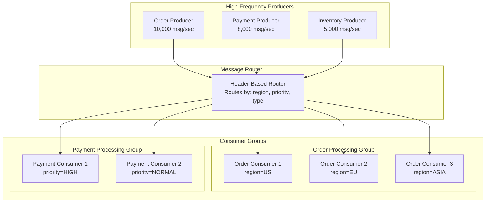
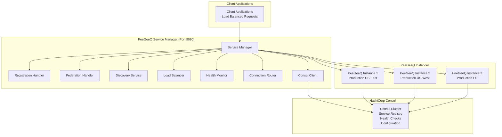

# PeeGeeQ Advanced Features & Production
#### © Mark Andrew Ray-Smith Cityline Ltd 2025

Comprehensive guide to PeeGeeQ's enterprise features, advanced messaging patterns, production deployment, and operational capabilities.

## Table of Contents

1. [Advanced Messaging Patterns](#advanced-messaging-patterns)
2. [Message Priority Handling](#message-priority-handling)
3. [Enhanced Error Handling](#enhanced-error-handling)
4. [Security Configuration](#security-configuration)
5. [Consumer Groups & Load Balancing](#consumer-groups--load-balancing)
6. [Service Discovery & Federation](#service-discovery--federation)
7. [REST API & HTTP Integration](#rest-api--http-integration)
8. [Bi-Temporal Event Store](#bi-temporal-event-store)
9. [Production Readiness Features](#production-readiness-features)
10. [Monitoring & Observability](#monitoring--observability)
11. [Multi-Environment Configuration](#multi-environment-configuration)
12. [Performance Optimization](#performance-optimization)
13. [Integration Patterns](#integration-patterns)
14. [Production Deployment](#production-deployment)

## Advanced Messaging Patterns

### High-Frequency Messaging

PeeGeeQ supports high-throughput scenarios with multiple producers and consumers:



### Message Routing by Headers

Route messages based on header values:

```java
public class RegionalOrderProcessor {
    private final Map<String, MessageConsumer<OrderEvent>> regionalConsumers;
    
    public void setupRegionalProcessing() {
        // US Region Consumer
        MessageConsumer<OrderEvent> usConsumer = factory.createConsumer("orders", OrderEvent.class);
        usConsumer.subscribe(message -> {
            if ("US".equals(message.getHeaders().get("region"))) {
                return processUSOrder(message.getPayload());
            }
            return CompletableFuture.completedFuture(null); // Skip non-US orders
        });
        
        // EU Region Consumer
        MessageConsumer<OrderEvent> euConsumer = factory.createConsumer("orders", OrderEvent.class);
        euConsumer.subscribe(message -> {
            if ("EU".equals(message.getHeaders().get("region"))) {
                return processEUOrder(message.getPayload());
            }
            return CompletableFuture.completedFuture(null); // Skip non-EU orders
        });
    }
    
    public void sendRegionalOrder(OrderEvent order, String region) {
        Map<String, String> headers = Map.of(
            "region", region,
            "priority", order.getPriority().toString(),
            "type", "order"
        );
        
        producer.send(order, headers);
    }
}
```

## Message Priority Handling

PeeGeeQ supports sophisticated message priority handling for scenarios where certain messages need to be processed before others.

### Priority Levels

PeeGeeQ uses a numeric priority system (0-10) with predefined levels:

- **CRITICAL (10)**: System alerts, security events
- **HIGH (7-9)**: Important business events, urgent notifications
- **NORMAL (4-6)**: Regular business operations
- **LOW (1-3)**: Background tasks, cleanup operations
- **BULK (0)**: Batch processing, analytics

### Priority Configuration

```java
// Configure priority queue optimization
System.setProperty("peegeeq.queue.priority.enabled", "true");
System.setProperty("peegeeq.queue.priority.index-optimization", "true");

// Send message with priority
Map<String, String> headers = new HashMap<>();
headers.put("priority", "10"); // CRITICAL priority
producer.send(message, headers);
```

### Real-World Priority Scenarios

#### E-Commerce Order Processing
```java
// VIP customer orders get highest priority
if (customer.isVIP()) {
    headers.put("priority", "10"); // CRITICAL
} else if (order.isExpedited()) {
    headers.put("priority", "8");  // HIGH
} else {
    headers.put("priority", "5");  // NORMAL
}
```

#### Financial Transaction Processing
```java
// Fraud alerts get immediate attention
if (transaction.isFraudAlert()) {
    headers.put("priority", "10"); // CRITICAL
} else if (transaction.isWireTransfer()) {
    headers.put("priority", "8");  // HIGH
} else {
    headers.put("priority", "5");  // NORMAL
}
```

**Example**: See `MessagePriorityExample.java` for comprehensive priority handling demonstrations.

### Priority-Based Processing

Handle high-priority messages first:

```java
public class PriorityOrderProcessor {
    public void setupPriorityProcessing() {
        // High Priority Consumer
        ConsumerConfig highPriorityConfig = ConsumerConfig.builder()
            .batchSize(5)
            .pollInterval(Duration.ofMillis(100))
            .filter(message -> {
                String priority = message.getHeaders().get("priority");
                return "HIGH".equals(priority) || "URGENT".equals(priority);
            })
            .build();
            
        MessageConsumer<OrderEvent> highPriorityConsumer = 
            factory.createConsumer("orders", OrderEvent.class, highPriorityConfig);
        highPriorityConsumer.subscribe(this::processHighPriorityOrder);
        
        // Normal Priority Consumer
        ConsumerConfig normalPriorityConfig = ConsumerConfig.builder()
            .batchSize(20)
            .pollInterval(Duration.ofSeconds(1))
            .filter(message -> {
                String priority = message.getHeaders().get("priority");
                return !"HIGH".equals(priority) && !"URGENT".equals(priority);
            })
            .build();
            
        MessageConsumer<OrderEvent> normalConsumer = 
            factory.createConsumer("orders", OrderEvent.class, normalPriorityConfig);
        normalConsumer.subscribe(this::processNormalOrder);
    }
}
```

## Enhanced Error Handling

PeeGeeQ provides sophisticated error handling patterns for production resilience.

### Error Handling Strategies

- **RETRY**: Automatic retry with exponential backoff
- **CIRCUIT_BREAKER**: Circuit breaker pattern for failing services
- **DEAD_LETTER**: Move to dead letter queue for manual inspection
- **IGNORE**: Log and continue (for non-critical errors)
- **ALERT**: Send alert and continue processing

### Retry Strategies with Exponential Backoff

```java
public class RetryHandler {
    public CompletableFuture<Void> handleWithRetry(Message<OrderEvent> message) {
        return processMessage(message)
            .exceptionally(throwable -> {
                if (isRetryable(throwable) && getAttemptCount(message) < 3) {
                    // Exponential backoff: 1s, 2s, 4s
                    long backoffMs = (long) Math.pow(2, getAttemptCount(message)) * 1000;
                    scheduleRetry(message, backoffMs);
                }
                return null;
            });
    }
}
```

### Circuit Breaker Integration

```java
public class CircuitBreakerConsumer {
    private final CircuitBreaker circuitBreaker;

    public CompletableFuture<Void> processWithCircuitBreaker(Message<OrderEvent> message) {
        return circuitBreaker.executeSupplier(() -> {
            // External service call protected by circuit breaker
            return externalService.processOrder(message.getPayload());
        }).thenApply(result -> null);
    }
}
```

### Dead Letter Queue Management

```java
public class DeadLetterHandler {
    public void handleFailedMessage(Message<OrderEvent> message, Exception error) {
        // Move to dead letter queue with detailed information
        deadLetterManager.moveToDeadLetterQueue(
            "orders",
            message.getId(),
            "orders",
            message.getPayload().toString(),
            message.getTimestamp(),
            "Processing failed: " + error.getMessage(),
            getAttemptCount(message),
            Map.of(
                "errorType", error.getClass().getSimpleName(),
                "retryable", String.valueOf(isRetryable(error))
            ),
            message.getCorrelationId(),
            "order-processing-group"
        );
    }
}
```

### Poison Message Detection

```java
public class PoisonMessageDetector {
    public boolean isPoisonMessage(Message<OrderEvent> message) {
        int attempts = getAttemptCount(message);
        return attempts >= 3; // Poison after 3 failed attempts
    }

    public void quarantinePoisonMessage(Message<OrderEvent> message) {
        // Quarantine poison message for manual inspection
        deadLetterManager.moveToDeadLetterQueue(
            "orders",
            message.getId(),
            "orders",
            message.getPayload().toString(),
            message.getTimestamp(),
            "POISON MESSAGE: Exceeded maximum retry attempts",
            getAttemptCount(message),
            Map.of("poisonMessage", "true"),
            message.getCorrelationId(),
            "poison-quarantine"
        );
    }
}
```

**Example**: See `EnhancedErrorHandlingExample.java` for comprehensive error handling demonstrations.

## Security Configuration

PeeGeeQ provides enterprise-grade security features for production deployments.

### SSL/TLS Configuration

```java
// Enable SSL/TLS for database connections
System.setProperty("peegeeq.database.ssl.enabled", "true");
System.setProperty("peegeeq.database.ssl.mode", "require"); // prefer, require, verify-ca, verify-full
System.setProperty("peegeeq.database.ssl.factory", "org.postgresql.ssl.DefaultJavaSSLFactory");

// Certificate configuration
System.setProperty("peegeeq.database.ssl.cert", "client-cert.pem");
System.setProperty("peegeeq.database.ssl.key", "client-key.pem");
System.setProperty("peegeeq.database.ssl.rootcert", "ca-cert.pem");
```

### Production Security Checklist

#### Network Security
- ✓ Use private networks/VPCs
- ✓ Configure firewall rules
- ✓ Enable network encryption
- ✓ Use connection pooling
- ✓ Implement rate limiting

#### Database Security
- ✓ Enable SSL/TLS encryption
- ✓ Use certificate-based authentication
- ✓ Configure row-level security
- ✓ Enable audit logging
- ✓ Regular security updates

#### Application Security
- ✓ Encrypt sensitive configuration
- ✓ Use secure credential storage
- ✓ Implement proper error handling
- ✓ Enable security monitoring
- ✓ Regular security assessments

### Credential Management

```java
// Environment-based credentials
System.setProperty("peegeeq.database.username", "${env:PEEGEEQ_DB_USERNAME}");
System.setProperty("peegeeq.database.password", "${env:PEEGEEQ_DB_PASSWORD}");
System.setProperty("peegeeq.database.password.encrypted", "true");

// Vault integration
System.setProperty("peegeeq.database.username", "${vault:secret/peegeeq/db#username}");
System.setProperty("peegeeq.database.password", "${vault:secret/peegeeq/db#password}");
```

### Compliance Configuration

```java
// Audit logging for compliance
System.setProperty("peegeeq.audit.enabled", "true");
System.setProperty("peegeeq.audit.events.connections", "true");
System.setProperty("peegeeq.audit.events.authentication", "true");
System.setProperty("peegeeq.audit.events.queries", "true");
System.setProperty("peegeeq.audit.retention.days", "2555"); // 7 years for SOX

// GDPR compliance
System.setProperty("peegeeq.audit.compliance.gdpr", "true");
System.setProperty("peegeeq.audit.compliance.sox", "true");
```

**Example**: See `SecurityConfigurationExample.java` for comprehensive security configuration.

## Consumer Groups & Load Balancing

### Consumer Group Implementation

Consumer groups provide load balancing and fault tolerance:

```java
public class ConsumerGroupExample {
    public void setupConsumerGroup() {
        // Create consumer group configuration
        ConsumerGroupConfig groupConfig = ConsumerGroupConfig.builder()
            .groupId("order-processing-group")
            .loadBalancingStrategy(LoadBalancingStrategy.ROUND_ROBIN)
            .maxMembers(5)
            .heartbeatInterval(Duration.ofSeconds(10))
            .sessionTimeout(Duration.ofSeconds(30))
            .build();
        
        // Create multiple consumers in the group
        for (int i = 0; i < 3; i++) {
            String memberId = "order-processor-" + i;
            
            ConsumerConfig memberConfig = ConsumerConfig.builder()
                .consumerGroup(groupConfig.getGroupId())
                .memberId(memberId)
                .autoAcknowledge(true)
                .build();
            
            MessageConsumer<OrderEvent> consumer = 
                factory.createConsumer("orders", OrderEvent.class, memberConfig);
            
            consumer.subscribe(message -> {
                log.info("Member {} processing order: {}", memberId, message.getId());
                return processOrder(message.getPayload());
            });
        }
    }
}
```

### Load Balancing Strategies

Available load balancing strategies:

1. **ROUND_ROBIN**: Messages distributed evenly across consumers
2. **RANGE**: Messages assigned based on hash ranges
3. **STICKY**: Messages with same key go to same consumer
4. **RANDOM**: Random distribution across consumers

```java
public enum LoadBalancingStrategy {
    ROUND_ROBIN,
    RANGE,
    STICKY,
    RANDOM;
    
    public ConsumerGroupMember selectMember(List<ConsumerGroupMember> members, 
                                           Message<?> message) {
        switch (this) {
            case ROUND_ROBIN:
                return members.get(message.hashCode() % members.size());
            case RANGE:
                return selectByRange(members, message);
            case STICKY:
                return selectByKey(members, message.getHeaders().get("partitionKey"));
            case RANDOM:
                return members.get(ThreadLocalRandom.current().nextInt(members.size()));
            default:
                return members.get(0);
        }
    }
}
```

### Consumer Group Monitoring

Monitor consumer group health and performance:

```java
public class ConsumerGroupMonitor {
    private final ConsumerGroupManager groupManager;
    
    public ConsumerGroupStats getGroupStats(String groupId) {
        ConsumerGroup group = groupManager.getGroup(groupId);
        
        return ConsumerGroupStats.builder()
            .groupId(groupId)
            .memberCount(group.getActiveMembers().size())
            .totalMessagesProcessed(group.getTotalProcessedCount())
            .averageProcessingTime(group.getAverageProcessingTime())
            .errorRate(group.getErrorRate())
            .lastRebalance(group.getLastRebalanceTime())
            .build();
    }
    
    public void monitorGroupHealth() {
        groupManager.getAllGroups().forEach(group -> {
            // Check for unhealthy members
            group.getMembers().stream()
                .filter(member -> !member.isHealthy())
                .forEach(member -> {
                    log.warn("Unhealthy member detected: {} in group: {}", 
                            member.getId(), group.getId());
                    // Trigger rebalancing if needed
                    if (shouldRebalance(group)) {
                        groupManager.triggerRebalance(group.getId());
                    }
                });
        });
    }
}
```

## Service Discovery & Federation

### Service Manager Architecture

The PeeGeeQ Service Manager provides enterprise-grade service discovery:



### Service Registration

Automatic service registration with Consul:

```java
public class PeeGeeQServiceRegistration {
    public void registerInstance() {
        ServiceRegistration registration = ServiceRegistration.builder()
            .instanceId("peegeeq-prod-01")
            .host("localhost")
            .port(8080)
            .version("1.0.0")
            .environment("production")
            .region("us-east-1")
            .metadata(Map.of(
                "datacenter", "dc1",
                "cluster", "main",
                "capabilities", "native,outbox,bitemporal"
            ))
            .healthCheckUrl("http://localhost:8080/health")
            .build();
        
        serviceManager.registerInstance(registration);
    }
}
```

### Federation API

Aggregate data from multiple instances:

```java
@RestController
@RequestMapping("/api/v1/federated")
public class FederationController {
    
    @GetMapping("/overview")
    public FederatedOverview getOverview() {
        List<PeeGeeQInstance> healthyInstances = serviceDiscovery.getHealthyInstances();
        
        return FederatedOverview.builder()
            .totalInstances(healthyInstances.size())
            .totalQueues(aggregateQueueCount(healthyInstances))
            .totalMessages(aggregateMessageCount(healthyInstances))
            .averageLatency(calculateAverageLatency(healthyInstances))
            .instances(healthyInstances.stream()
                .map(this::mapToInstanceSummary)
                .collect(Collectors.toList()))
            .build();
    }
    
    @GetMapping("/queues")
    public List<FederatedQueueInfo> getQueues() {
        return serviceDiscovery.getHealthyInstances().stream()
            .flatMap(instance -> getQueuesFromInstance(instance).stream())
            .collect(Collectors.groupingBy(QueueInfo::getName))
            .entrySet().stream()
            .map(entry -> aggregateQueueInfo(entry.getKey(), entry.getValue()))
            .collect(Collectors.toList());
    }
}
```

### Load Balancing

Intelligent request routing:

```java
public class LoadBalancingStrategy {
    public PeeGeeQInstance selectInstance(List<PeeGeeQInstance> instances, 
                                         String operation) {
        // Health-based filtering
        List<PeeGeeQInstance> healthy = instances.stream()
            .filter(PeeGeeQInstance::isHealthy)
            .collect(Collectors.toList());
        
        if (healthy.isEmpty()) {
            throw new NoHealthyInstancesException();
        }
        
        // Region-aware routing
        String preferredRegion = getPreferredRegion();
        List<PeeGeeQInstance> regionalInstances = healthy.stream()
            .filter(instance -> preferredRegion.equals(instance.getRegion()))
            .collect(Collectors.toList());
        
        List<PeeGeeQInstance> candidates = regionalInstances.isEmpty() ? 
            healthy : regionalInstances;
        
        // Load-based selection
        return candidates.stream()
            .min(Comparator.comparing(this::calculateLoad))
            .orElse(candidates.get(0));
    }
    
    private double calculateLoad(PeeGeeQInstance instance) {
        InstanceMetrics metrics = instance.getMetrics();
        return (metrics.getCpuUsage() * 0.4) + 
               (metrics.getMemoryUsage() * 0.3) + 
               (metrics.getQueueDepth() * 0.3);
    }
}
```

## REST API & HTTP Integration

### Database Setup via REST

Create and manage database setups through HTTP:

```bash
# Create a new database setup
curl -X POST http://localhost:8080/api/v1/database-setup/create \
  -H "Content-Type: application/json" \
  -d '{
    "setupId": "production-setup",
    "host": "localhost",
    "port": 5432,
    "database": "peegeeq_prod",
    "username": "peegeeq_user",
    "password": "secure_password"
  }'

# Get setup status
curl http://localhost:8080/api/v1/database-setup/production-setup/status

# List all setups
curl http://localhost:8080/api/v1/database-setup/list
```

### Queue Operations via HTTP

Send and receive messages through REST API:

```bash
# Send a message
curl -X POST http://localhost:8080/api/v1/queues/production-setup/orders/messages \
  -H "Content-Type: application/json" \
  -d '{
    "payload": {
      "orderId": "ORDER-12345",
      "customerId": "CUST-789",
      "amount": 99.99
    },
    "headers": {
      "region": "US",
      "priority": "HIGH"
    },
    "priority": 8
  }'

# Get queue statistics
curl http://localhost:8080/api/v1/queues/production-setup/orders/stats

# Get next message (polling)
curl -X GET "http://localhost:8080/api/v1/queues/production-setup/orders/messages/next?timeout=30000"

# Acknowledge message
curl -X DELETE http://localhost:8080/api/v1/queues/production-setup/orders/messages/msg-123
```

### Event Store via REST

Store and query bi-temporal events:

```bash
# Store an event
curl -X POST http://localhost:8080/api/v1/eventstores/production-setup/orders/events \
  -H "Content-Type: application/json" \
  -d '{
    "aggregateId": "ORDER-12345",
    "eventType": "OrderCreated",
    "payload": {
      "orderId": "ORDER-12345",
      "customerId": "CUST-789",
      "amount": 99.99
    },
    "validFrom": "2025-01-15T10:00:00Z",
    "metadata": {
      "source": "order-service",
      "version": "1.0"
    }
  }'

# Query events by aggregate
curl "http://localhost:8080/api/v1/eventstores/production-setup/orders/events?aggregateId=ORDER-12345"

# Query events by time range
curl "http://localhost:8080/api/v1/eventstores/production-setup/orders/events?from=2025-01-15T00:00:00Z&to=2025-01-16T00:00:00Z"
```

### WebSocket Support

Real-time message streaming via WebSocket:

```javascript
// Connect to WebSocket endpoint
const ws = new WebSocket('ws://localhost:8080/api/v1/queues/production-setup/orders/stream');

ws.onopen = function() {
    console.log('Connected to message stream');
    
    // Subscribe to specific message types
    ws.send(JSON.stringify({
        action: 'subscribe',
        filter: {
            headers: {
                region: 'US',
                priority: 'HIGH'
            }
        }
    }));
};

ws.onmessage = function(event) {
    const message = JSON.parse(event.data);
    console.log('Received message:', message);
    
    // Process message
    processMessage(message);
    
    // Acknowledge message
    ws.send(JSON.stringify({
        action: 'acknowledge',
        messageId: message.id
    }));
};
```

## Bi-Temporal Event Store

### Event Sourcing Patterns

Implement event sourcing with bi-temporal capabilities:

```java
public class OrderAggregate {
    private String orderId;
    private String customerId;
    private BigDecimal amount;
    private OrderStatus status;
    private List<BiTemporalEvent<OrderEvent>> events = new ArrayList<>();
    
    public static OrderAggregate fromEvents(List<BiTemporalEvent<OrderEvent>> events) {
        OrderAggregate aggregate = new OrderAggregate();
        events.forEach(aggregate::apply);
        return aggregate;
    }
    
    public void createOrder(String orderId, String customerId, BigDecimal amount) {
        OrderCreatedEvent event = new OrderCreatedEvent(orderId, customerId, amount);
        applyAndStore(event);
    }
    
    public void updateStatus(OrderStatus newStatus, String reason) {
        OrderStatusUpdatedEvent event = new OrderStatusUpdatedEvent(orderId, newStatus, reason);
        applyAndStore(event);
    }
    
    private void applyAndStore(OrderEvent event) {
        // Apply event to aggregate state
        apply(event);
        
        // Store event in bi-temporal store
        BiTemporalEvent<OrderEvent> storedEvent = eventStore.appendEvent(orderId, event)
            .await();
        events.add(storedEvent);
    }
    
    private void apply(BiTemporalEvent<OrderEvent> event) {
        OrderEvent payload = event.getPayload();
        switch (payload.getEventType()) {
            case "OrderCreated":
                applyOrderCreated((OrderCreatedEvent) payload);
                break;
            case "OrderStatusUpdated":
                applyOrderStatusUpdated((OrderStatusUpdatedEvent) payload);
                break;
        }
    }
}
```

### Temporal Queries

Query events across time dimensions:

```java
public class TemporalQueryService {
    private final BiTemporalEventStore<OrderEvent> eventStore;
    
    // Query events as they were known at a specific point in time
    public List<BiTemporalEvent<OrderEvent>> getOrderHistoryAsOf(String orderId, 
                                                                Instant asOfTime) {
        return eventStore.queryAsOfTransactionTime(asOfTime)
            .thenApply(events -> events.stream()
                .filter(event -> orderId.equals(event.getAggregateId()))
                .collect(Collectors.toList()))
            .await();
    }
    
    // Query events that were valid during a specific business time period
    public List<BiTemporalEvent<OrderEvent>> getOrdersValidDuring(Instant validFrom, 
                                                                 Instant validTo) {
        return eventStore.queryByValidTimeRange(validFrom, validTo).await();
    }
    
    // Get all versions of an event (including corrections)
    public List<BiTemporalEvent<OrderEvent>> getEventVersions(String eventId) {
        return eventStore.queryEventVersions(eventId).await();
    }
    
    // Point-in-time reconstruction
    public OrderAggregate reconstructOrderAsOf(String orderId, Instant asOfTime) {
        List<BiTemporalEvent<OrderEvent>> events = getOrderHistoryAsOf(orderId, asOfTime);
        return OrderAggregate.fromEvents(events);
    }
}
```

### Event Corrections

Handle event corrections while preserving history:

```java
public class EventCorrectionService {
    public void correctOrderAmount(String eventId, BigDecimal correctedAmount, 
                                  String correctionReason) {
        // Get original event
        BiTemporalEvent<OrderEvent> originalEvent = eventStore.getEvent(eventId).await();
        
        // Create corrected event
        OrderCreatedEvent correctedEvent = ((OrderCreatedEvent) originalEvent.getPayload())
            .withAmount(correctedAmount);
        
        // Store correction (creates new version)
        BiTemporalEvent<OrderEvent> correction = eventStore.correctEvent(
            eventId, 
            correctedEvent, 
            correctionReason
        ).await();
        
        log.info("Event {} corrected. New version: {}", eventId, correction.getVersion());
    }
    
    public void auditEventCorrections(String aggregateId) {
        List<BiTemporalEvent<OrderEvent>> events = eventStore
            .queryByAggregateId(aggregateId).await();
        
        events.stream()
            .filter(event -> event.getVersion() > 1)
            .forEach(event -> {
                log.info("Correction found - Event: {}, Version: {}, Reason: {}", 
                        event.getEventId(), 
                        event.getVersion(),
                        event.getMetadata().get("correctionReason"));
            });
    }
}

## Production Readiness Features

### Health Checks

Comprehensive health monitoring across all components:

```java
public class PeeGeeQHealthChecks {
    private final HealthCheckManager healthCheckManager;

    public void configureHealthChecks() {
        // Database connectivity check
        healthCheckManager.registerHealthCheck("database", () -> {
            try {
                databaseService.query("SELECT 1", rs -> rs.getInt(1));
                return HealthCheckResult.healthy("Database connection OK");
            } catch (Exception e) {
                return HealthCheckResult.unhealthy("Database connection failed", e);
            }
        });

        // Queue processing check
        healthCheckManager.registerHealthCheck("queue-processing", () -> {
            long pendingMessages = getPendingMessageCount();
            if (pendingMessages > 10000) {
                return HealthCheckResult.unhealthy(
                    "High pending message count: " + pendingMessages);
            }
            return HealthCheckResult.healthy("Queue processing normal");
        });

        // Circuit breaker check
        healthCheckManager.registerHealthCheck("circuit-breakers", () -> {
            List<String> openCircuits = circuitBreakerManager.getOpenCircuits();
            if (!openCircuits.isEmpty()) {
                return HealthCheckResult.unhealthy(
                    "Open circuit breakers: " + String.join(", ", openCircuits));
            }
            return HealthCheckResult.healthy("All circuit breakers closed");
        });
    }
}
```

### Circuit Breakers

Automatic failure handling and recovery:

```java
@Component
public class CircuitBreakerConfiguration {

    @CircuitBreaker(name = "database-operations", fallbackMethod = "fallbackDatabaseOperation")
    @Retry(name = "database-operations")
    @TimeLimiter(name = "database-operations")
    public CompletableFuture<String> performDatabaseOperation(String operation) {
        return CompletableFuture.supplyAsync(() -> {
            // Potentially failing database operation
            return databaseService.executeOperation(operation);
        });
    }

    public CompletableFuture<String> fallbackDatabaseOperation(String operation, Exception ex) {
        log.warn("Database operation failed, using fallback: {}", ex.getMessage());
        return CompletableFuture.completedFuture("FALLBACK_RESULT");
    }

    @EventListener
    public void handleCircuitBreakerStateChange(CircuitBreakerOnStateTransitionEvent event) {
        log.info("Circuit breaker '{}' changed from {} to {}",
                event.getCircuitBreakerName(),
                event.getStateTransition().getFromState(),
                event.getStateTransition().getToState());

        // Send alerts for circuit breaker opening
        if (event.getStateTransition().getToState() == CircuitBreaker.State.OPEN) {
            alertingService.sendAlert(
                "Circuit breaker opened: " + event.getCircuitBreakerName());
        }
    }
}
```

### Dead Letter Queue

Handle failed messages systematically:

```java
public class DeadLetterQueueManager {

    public void configureDeadLetterHandling() {
        // Configure automatic DLQ routing
        ConsumerConfig config = ConsumerConfig.builder()
            .maxRetries(3)
            .retryDelay(Duration.ofSeconds(5))
            .deadLetterEnabled(true)
            .deadLetterQueue("orders-dlq")
            .build();

        // Set up DLQ monitoring
        MessageConsumer<String> dlqConsumer = factory.createConsumer("orders-dlq", String.class);
        dlqConsumer.subscribe(this::handleDeadLetter);
    }

    private CompletableFuture<Void> handleDeadLetter(Message<String> message) {
        DeadLetterInfo dlqInfo = extractDeadLetterInfo(message);

        log.error("Message sent to DLQ - Queue: {}, Error: {}, Retry Count: {}",
                dlqInfo.getOriginalQueue(),
                dlqInfo.getErrorMessage(),
                dlqInfo.getRetryCount());

        // Store for analysis
        deadLetterRepository.save(dlqInfo);

        // Send alert for critical failures
        if (dlqInfo.getRetryCount() >= 3) {
            alertingService.sendCriticalAlert(
                "Message failed after max retries", dlqInfo);
        }

        return CompletableFuture.completedFuture(null);
    }

    public void reprocessDeadLetters(String originalQueue, Predicate<DeadLetterInfo> filter) {
        List<DeadLetterInfo> toReprocess = deadLetterRepository
            .findByOriginalQueue(originalQueue)
            .stream()
            .filter(filter)
            .collect(Collectors.toList());

        MessageProducer<String> producer = factory.createProducer(originalQueue, String.class);

        toReprocess.forEach(dlq -> {
            try {
                producer.send(dlq.getOriginalPayload(), dlq.getOriginalHeaders());
                deadLetterRepository.markReprocessed(dlq.getId());
                log.info("Reprocessed dead letter: {}", dlq.getId());
            } catch (Exception e) {
                log.error("Failed to reprocess dead letter: {}", dlq.getId(), e);
            }
        });
    }
}
```

### Metrics Collection

Comprehensive metrics for monitoring and alerting:

```java
@Component
public class PeeGeeQMetrics {
    private final MeterRegistry meterRegistry;
    private final Counter messagesProduced;
    private final Counter messagesConsumed;
    private final Timer messageProcessingTime;
    private final Gauge queueDepth;

    public PeeGeeQMetrics(MeterRegistry meterRegistry) {
        this.meterRegistry = meterRegistry;
        this.messagesProduced = Counter.builder("peegeeq.messages.produced")
            .description("Total messages produced")
            .register(meterRegistry);
        this.messagesConsumed = Counter.builder("peegeeq.messages.consumed")
            .description("Total messages consumed")
            .register(meterRegistry);
        this.messageProcessingTime = Timer.builder("peegeeq.message.processing.time")
            .description("Message processing time")
            .register(meterRegistry);
        this.queueDepth = Gauge.builder("peegeeq.queue.depth")
            .description("Current queue depth")
            .register(meterRegistry, this, PeeGeeQMetrics::getCurrentQueueDepth);
    }

    public void recordMessageProduced(String queueName) {
        messagesProduced.increment(Tags.of("queue", queueName));
    }

    public void recordMessageConsumed(String queueName, Duration processingTime) {
        messagesConsumed.increment(Tags.of("queue", queueName));
        messageProcessingTime.record(processingTime, Tags.of("queue", queueName));
    }

    private double getCurrentQueueDepth() {
        return databaseService.query(
            "SELECT COUNT(*) FROM queue_messages WHERE processed_at IS NULL",
            rs -> rs.getLong(1)
        ).stream().findFirst().orElse(0L).doubleValue();
    }
}

## Multi-Environment Configuration

### Environment-Specific Settings

Configure different environments with profiles:

```properties
# application-development.properties
peegeeq.database.host=localhost
peegeeq.database.port=5432
peegeeq.database.name=peegeeq_dev
peegeeq.database.pool.maxSize=10
peegeeq.health.intervalSeconds=60
peegeeq.metrics.enabled=true
peegeeq.circuitBreaker.enabled=false

# application-production.properties
peegeeq.database.host=prod-db-cluster.company.com
peegeeq.database.port=5432
peegeeq.database.name=peegeeq_prod
peegeeq.database.pool.maxSize=50
peegeeq.database.ssl.enabled=true
peegeeq.health.intervalSeconds=15
peegeeq.metrics.enabled=true
peegeeq.circuitBreaker.enabled=true
peegeeq.deadLetterEnabled=true
```

### Multi-Database Configuration

Support multiple database configurations:

```java
@Configuration
public class MultiDatabaseConfiguration {

    @Bean
    @Primary
    @ConfigurationProperties("peegeeq.primary.database")
    public PeeGeeQConfiguration primaryConfig() {
        return new PeeGeeQConfiguration();
    }

    @Bean
    @ConfigurationProperties("peegeeq.secondary.database")
    public PeeGeeQConfiguration secondaryConfig() {
        return new PeeGeeQConfiguration();
    }

    @Bean
    @Primary
    public PeeGeeQManager primaryPeeGeeQManager(@Qualifier("primaryConfig") PeeGeeQConfiguration config) {
        return new PeeGeeQManager(config);
    }

    @Bean
    public PeeGeeQManager secondaryPeeGeeQManager(@Qualifier("secondaryConfig") PeeGeeQConfiguration config) {
        return new PeeGeeQManager(config);
    }
}
```

## Performance Optimization

PeeGeeQ provides comprehensive performance optimization capabilities for high-throughput and low-latency scenarios.

### Connection Pool Optimization

#### High-Throughput Configuration
```properties
# Optimized for maximum throughput
peegeeq.database.pool.maxSize=50
peegeeq.database.pool.minSize=10
peegeeq.database.pool.connectionTimeoutMs=10000
peegeeq.database.pool.idleTimeoutMs=300000
peegeeq.database.pool.maxLifetimeMs=1800000
peegeeq.database.pool.leakDetectionThresholdMs=30000
```

#### Low-Latency Configuration
```properties
# Optimized for minimum latency
peegeeq.database.pool.maxSize=20
peegeeq.database.pool.minSize=5
peegeeq.database.pool.connectionTimeoutMs=1000
peegeeq.database.pool.idleTimeoutMs=600000
peegeeq.database.pool.validationTimeoutMs=1000
```

### Throughput Optimization

#### Native vs Outbox Performance Comparison
- **Native Queue**: 10,000+ msg/sec, <10ms latency
- **Outbox Queue**: 5,000+ msg/sec, reliable transactions

```java
// Optimize for throughput
System.setProperty("peegeeq.queue.batch.enabled", "true");
System.setProperty("peegeeq.queue.batch.size", "100");
System.setProperty("peegeeq.queue.batch.timeout", "1000");
System.setProperty("peegeeq.queue.prefetch.count", "50");
System.setProperty("peegeeq.queue.consumer.threads", "10");
```

### Latency Optimization

#### Message Size Impact on Latency
- **Small messages (100B)**: ~2ms latency
- **Medium messages (1KB)**: ~5ms latency
- **Large messages (10KB)**: ~15ms latency
- **Very large messages (100KB)**: ~50ms latency

#### Optimization Strategies
```java
// Minimize serialization overhead
public class OptimizedMessage {
    // Use primitive types where possible
    private long timestamp;
    private int priority;
    private String compactPayload; // Consider compression for large payloads
}
```

### Batch Processing Optimization

#### Optimal Batch Sizes
- **Batch size 1**: Lowest latency, highest overhead
- **Batch size 10-50**: Balanced performance
- **Batch size 100+**: Maximum throughput, higher latency

```java
// Configure batch processing
ConsumerConfig config = ConsumerConfig.builder()
    .batchSize(50)           // Optimal for most scenarios
    .batchTimeout(1000)      // 1 second timeout
    .prefetchCount(100)      // Prefetch for better throughput
    .build();
```

### Concurrent Processing Optimization

#### Thread Pool Configuration
```java
// Optimal thread counts based on workload
int cpuCores = Runtime.getRuntime().availableProcessors();

// CPU-bound workload
int cpuBoundThreads = cpuCores;

// I/O-bound workload
int ioBoundThreads = cpuCores * 2;

// Mixed workload
int mixedThreads = (int) (cpuCores * 1.5);

System.setProperty("peegeeq.queue.consumer.threads", String.valueOf(mixedThreads));
```

### Memory Optimization

#### Memory Usage Patterns
```java
// Monitor memory usage
Runtime runtime = Runtime.getRuntime();
long totalMemory = runtime.totalMemory();
long freeMemory = runtime.freeMemory();
long usedMemory = totalMemory - freeMemory;

logger.info("Memory usage: {}MB used, {}MB free",
    usedMemory / (1024 * 1024), freeMemory / (1024 * 1024));
```

#### Memory Optimization Strategies
- Release object references promptly
- Use streaming for large payloads
- Monitor garbage collection metrics
- Consider message compression

**Example**: See `PerformanceTuningExample.java` for comprehensive performance optimization demonstrations.

## Integration Patterns

PeeGeeQ supports complex distributed system integration patterns for microservices and event-driven architectures.

### Request-Reply Pattern

Synchronous communication between services with correlation IDs:

```java
public class RequestReplyService {
    private final MessageProducer<RequestMessage> requestProducer;
    private final MessageConsumer<ReplyMessage> replyConsumer;
    private final Map<String, CompletableFuture<ReplyMessage>> pendingRequests = new ConcurrentHashMap<>();

    public CompletableFuture<ReplyMessage> sendRequest(RequestMessage request) {
        String correlationId = UUID.randomUUID().toString();
        CompletableFuture<ReplyMessage> future = new CompletableFuture<>();

        // Store pending request
        pendingRequests.put(correlationId, future);

        // Send request with correlation ID
        Map<String, String> headers = Map.of(
            "correlationId", correlationId,
            "replyTo", "client-service"
        );

        requestProducer.send(request, headers);
        return future;
    }

    private void setupReplyConsumer() {
        replyConsumer.subscribe(message -> {
            String correlationId = message.getHeaders().get("correlationId");
            CompletableFuture<ReplyMessage> future = pendingRequests.remove(correlationId);

            if (future != null) {
                future.complete(message.getPayload());
            }

            return CompletableFuture.completedFuture(null);
        });
    }
}
```

### Publish-Subscribe Pattern

Event broadcasting to multiple subscribers:

```java
public class EventBroadcaster {
    private final MessageProducer<CustomerEvent> eventPublisher;

    public void publishCustomerEvent(CustomerEvent event) {
        Map<String, String> headers = Map.of(
            "eventType", event.getEventType(),
            "customerId", event.getCustomerId()
        );

        // Broadcast to all subscribers
        eventPublisher.send(event, headers);
    }
}

// Multiple subscribers
public class EmailService {
    public void setupSubscription() {
        customerEventConsumer.subscribe(message -> {
            CustomerEvent event = message.getPayload();
            return sendEmail(event);
        });
    }
}

public class AnalyticsService {
    public void setupSubscription() {
        customerEventConsumer.subscribe(message -> {
            CustomerEvent event = message.getPayload();
            return updateAnalytics(event);
        });
    }
}
```

### Message Router Pattern

Conditional routing based on message content:

```java
public class MessageRouter {
    private final MessageConsumer<OrderMessage> inputConsumer;
    private final MessageProducer<OrderMessage> domesticProducer;
    private final MessageProducer<OrderMessage> internationalProducer;
    private final MessageProducer<OrderMessage> expressProducer;

    public void setupRouting() {
        inputConsumer.subscribe(message -> {
            OrderMessage order = message.getPayload();
            String country = message.getHeaders().get("country");
            String priority = message.getHeaders().get("priority");

            // Route based on message headers and content
            if ("express".equals(priority)) {
                expressProducer.send(order);
            } else if (!"US".equals(country)) {
                internationalProducer.send(order);
            } else {
                domesticProducer.send(order);
            }

            return CompletableFuture.completedFuture(null);
        });
    }
}
```

### Content-Based Router Pattern

Advanced routing based on message payload analysis:

```java
public class ContentBasedRouter {
    public void routeMessage(Message<BusinessEvent> message) {
        BusinessEvent event = message.getPayload();

        // Analyze content and route accordingly
        if (event.getAmount() > 10000) {
            // High-value transactions
            highValueProcessor.send(event);
        } else if (event.getCustomerType().equals("VIP")) {
            // VIP customer processing
            vipProcessor.send(event);
        } else {
            // Standard processing
            standardProcessor.send(event);
        }
    }
}
```

### Saga Pattern

Distributed transaction management with compensation:

```java
public class OrderSaga {
    private final Map<String, SagaState> sagaStates = new ConcurrentHashMap<>();

    public void startOrderSaga(OrderCreatedEvent event) {
        String sagaId = event.getOrderId();
        SagaState state = new SagaState(sagaId);
        sagaStates.put(sagaId, state);

        // Step 1: Reserve inventory
        reserveInventory(event)
            .thenCompose(result -> {
                if (result.isSuccess()) {
                    state.markInventoryReserved();
                    // Step 2: Process payment
                    return processPayment(event);
                } else {
                    return CompletableFuture.completedFuture(result);
                }
            })
            .thenCompose(result -> {
                if (result.isSuccess()) {
                    state.markPaymentProcessed();
                    // Step 3: Ship order
                    return shipOrder(event);
                } else {
                    // Compensate: Release inventory
                    return compensateInventory(event);
                }
            })
            .whenComplete((result, throwable) -> {
                if (throwable != null || !result.isSuccess()) {
                    // Run compensation logic
                    compensateSaga(state);
                }
                sagaStates.remove(sagaId);
            });
    }
}
```

### CQRS Pattern

Command Query Responsibility Segregation:

```java
public class OrderCQRS {
    // Command side - write operations
    public class OrderCommandHandler {
        public void handle(CreateOrderCommand command) {
            // Validate and create order
            Order order = new Order(command);
            orderRepository.save(order);

            // Publish event
            OrderCreatedEvent event = new OrderCreatedEvent(order);
            eventPublisher.send(event);
        }
    }

    // Query side - read operations
    public class OrderQueryHandler {
        public OrderView getOrder(String orderId) {
            return orderViewRepository.findById(orderId);
        }

        public List<OrderView> getOrdersByCustomer(String customerId) {
            return orderViewRepository.findByCustomerId(customerId);
        }
    }

    // Event handler to update read model
    public class OrderEventHandler {
        public void handle(OrderCreatedEvent event) {
            OrderView view = new OrderView(event);
            orderViewRepository.save(view);
        }
    }
}
```

**Example**: See `IntegrationPatternsExample.java` for comprehensive integration pattern demonstrations.

### PostgreSQL Optimization

Database tuning for message queues:

```sql
-- Optimize for message queue workload
ALTER SYSTEM SET shared_buffers = '256MB';
ALTER SYSTEM SET effective_cache_size = '1GB';
ALTER SYSTEM SET maintenance_work_mem = '64MB';
ALTER SYSTEM SET checkpoint_completion_target = 0.9;
ALTER SYSTEM SET wal_buffers = '16MB';
ALTER SYSTEM SET default_statistics_target = 100;

-- Optimize for LISTEN/NOTIFY
ALTER SYSTEM SET max_connections = 200;
ALTER SYSTEM SET shared_preload_libraries = 'pg_stat_statements';

-- Restart PostgreSQL to apply changes
SELECT pg_reload_conf();
```

## Production Deployment

### Docker Deployment

Production-ready Docker configuration:

```dockerfile
# Dockerfile
FROM openjdk:21-jre-slim

# Create application user
RUN groupadd -r peegeeq && useradd -r -g peegeeq peegeeq

# Set working directory
WORKDIR /app

# Copy application JAR
COPY target/peegeeq-application-*.jar app.jar

# Copy configuration
COPY config/ config/

# Set ownership
RUN chown -R peegeeq:peegeeq /app

# Switch to application user
USER peegeeq

# Health check
HEALTHCHECK --interval=30s --timeout=10s --start-period=60s --retries=3 \
  CMD curl -f http://localhost:8080/health || exit 1

# Expose ports
EXPOSE 8080 9090

# JVM optimization for containers
ENV JAVA_OPTS="-XX:+UseContainerSupport -XX:MaxRAMPercentage=75.0 -XX:+UseG1GC"

# Start application
ENTRYPOINT ["sh", "-c", "java $JAVA_OPTS -jar app.jar"]
```

### Production Checklist

Before deploying to production:

- [ ] **Database Setup**: PostgreSQL cluster with replication
- [ ] **Connection Pooling**: Optimized pool settings for workload
- [ ] **SSL/TLS**: Encrypted database connections
- [ ] **Monitoring**: Prometheus + Grafana dashboards configured
- [ ] **Alerting**: Critical alerts configured and tested
- [ ] **Health Checks**: All health checks passing
- [ ] **Circuit Breakers**: Configured with appropriate thresholds
- [ ] **Dead Letter Queue**: DLQ monitoring and reprocessing procedures
- [ ] **Backup Strategy**: Database backup and recovery procedures
- [ ] **Security**: Network security, authentication, and authorization
- [ ] **Load Testing**: Performance validated under expected load
- [ ] **Disaster Recovery**: Failover procedures documented and tested

---

**Next Reading**: [PeeGeeQ Development & Testing](PeeGeeQ-Development-Testing.md) for development workflow, testing strategies, and build processes.
```
```
