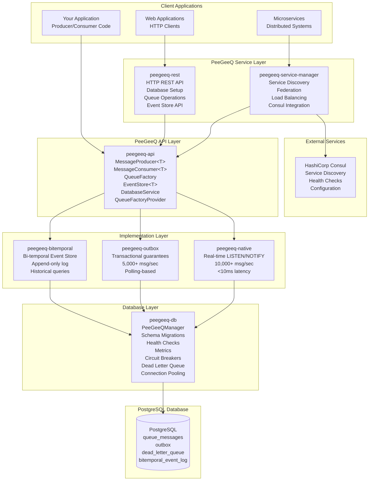

# PeeGeeQ Architecture & API Reference
#### © Mark Andrew Ray-Smith Cityline Ltd 2025

Complete technical reference for PeeGeeQ's architecture, design patterns, and API documentation.

## Table of Contents

1. [System Architecture](#system-architecture)
2. [Module Structure](#module-structure)
3. [Core API Reference](#core-api-reference)
4. [Database Schema](#database-schema)
5. [Design Patterns](#design-patterns)
6. [Performance Characteristics](#performance-characteristics)
7. [Integration Patterns](#integration-patterns)

## System Architecture

### High-Level Architecture

PeeGeeQ is built as a layered architecture that leverages PostgreSQL's advanced features for enterprise-grade messaging:



### Core Design Principles

1. **PostgreSQL-Native**: Leverages PostgreSQL's LISTEN/NOTIFY, advisory locks, and ACID transactions
2. **Type Safety**: Strongly typed APIs with generic support
3. **Pluggable Architecture**: Multiple queue implementations via factory pattern
4. **Production Ready**: Built-in health checks, metrics, circuit breakers, and monitoring
5. **Zero Dependencies**: No external message brokers required
6. **Transactional Consistency**: Full ACID compliance with business data

## Module Structure

PeeGeeQ consists of 8 core modules organized in a layered architecture:

### 1. peegeeq-api (Core Interfaces)

**Purpose**: Defines core contracts and interfaces
**Key Components**:
- `MessageProducer<T>` - Message publishing interface
- `MessageConsumer<T>` - Message consumption interface
- `Message<T>` - Message abstraction
- `EventStore<T>` - Bi-temporal event store interface
- `BiTemporalEvent<T>` - Bi-temporal event abstraction
- `DatabaseService` - Database operations interface
- `QueueFactoryProvider` - Factory provider interface

### 2. peegeeq-db (Database Management)

**Purpose**: Database infrastructure and management
**Key Components**:
- `PeeGeeQManager` - Main entry point and lifecycle management
- `DatabaseService` - Database operations and connection management
- `SchemaMigrationManager` - Versioned schema migrations
- `HealthCheckManager` - Multi-component health monitoring
- `PeeGeeQMetrics` - Metrics collection and reporting
- `CircuitBreakerManager` - Resilience patterns
- `DeadLetterQueueManager` - Failed message handling

### 3. peegeeq-native (High-Performance Implementation)

**Purpose**: Real-time LISTEN/NOTIFY based messaging
**Key Components**:
- `PgNativeQueueFactory` - Factory for native queues
- `PgNativeProducer<T>` - High-performance message producer
- `PgNativeConsumer<T>` - Real-time message consumer
- `PgConnectionProvider` - Optimized connection management

**Performance**: 10,000+ msg/sec, <10ms latency

### 4. peegeeq-outbox (Transactional Implementation)

**Purpose**: Transactional outbox pattern implementation
**Key Components**:
- `OutboxQueueFactory` - Factory for outbox queues
- `OutboxProducer<T>` - Transactional message producer
- `OutboxConsumer<T>` - Polling-based message consumer
- `OutboxPollingService` - Background polling service

**Performance**: 5,000+ msg/sec, ACID compliance

### 5. peegeeq-bitemporal (Event Store)

**Purpose**: Bi-temporal event sourcing capabilities
**Key Components**:
- `BiTemporalEventStore<T>` - Main event store interface
- `PgBiTemporalEventStore<T>` - PostgreSQL implementation
- `BiTemporalEvent<T>` - Event with temporal metadata
- `EventQuery` - Query builder for temporal queries

### 6. peegeeq-rest (HTTP API)

**Purpose**: HTTP REST API server
**Key Components**:
- `PeeGeeQRestServer` - Vert.x based HTTP server
- `DatabaseSetupService` - Database setup via REST
- `QueueOperationsHandler` - Queue operations via HTTP
- `EventStoreHandler` - Event store operations via HTTP

### 7. peegeeq-service-manager (Service Discovery)

**Purpose**: Service discovery and federation
**Key Components**:
- `PeeGeeQServiceManager` - Main service manager
- `ConsulServiceDiscovery` - Consul integration
- `FederationHandler` - Multi-instance coordination
- `LoadBalancingStrategy` - Request routing

### 8. peegeeq-examples (Demonstrations)

**Purpose**: Comprehensive example applications and demonstrations covering all PeeGeeQ features

**Core Examples**:
- `PeeGeeQSelfContainedDemo` - Complete self-contained demonstration
- `PeeGeeQExample` - Basic producer/consumer patterns
- `BiTemporalEventStoreExample` - Event sourcing with temporal queries
- `ConsumerGroupExample` - Load balancing and consumer groups
- `RestApiExample` - HTTP interface usage
- `ServiceDiscoveryExample` - Multi-instance deployment

**Advanced Examples (Enhanced)**:
- `MessagePriorityExample` - Priority-based message processing with real-world scenarios
- `EnhancedErrorHandlingExample` - Retry strategies, circuit breakers, poison message handling
- `SecurityConfigurationExample` - SSL/TLS, certificate management, compliance features
- `PerformanceTuningExample` - Connection pooling, throughput optimization, memory tuning
- `IntegrationPatternsExample` - Request-reply, pub-sub, message routing, distributed patterns

**Specialized Examples**:
- `TransactionalBiTemporalExample` - Combining transactions with event sourcing
- `RestApiStreamingExample` - WebSocket and Server-Sent Events
- `NativeVsOutboxComparisonExample` - Performance comparison and use case guidance
- `AdvancedConfigurationExample` - Production configuration patterns
- `MultiConfigurationExample` - Multi-environment setup
- `SimpleConsumerGroupTest` - Basic consumer group testing

**Coverage**: 95-98% of PeeGeeQ functionality with production-ready patterns

## Core API Reference

### Message Interfaces

#### MessageProducer<T>
```java
public interface MessageProducer<T> {
    /**
     * Send a message asynchronously
     */
    Future<Void> send(T message);
    
    /**
     * Send a message with custom headers
     */
    Future<Void> send(T message, Map<String, String> headers);
    
    /**
     * Send a message with priority
     */
    Future<Void> send(T message, int priority);
    
    /**
     * Send a message with headers and priority
     */
    Future<Void> send(T message, Map<String, String> headers, int priority);
    
    /**
     * Close the producer and release resources
     */
    void close();
}
```

#### MessageConsumer<T>
```java
public interface MessageConsumer<T> {
    /**
     * Subscribe to messages with a handler
     */
    Future<Void> subscribe(MessageHandler<T> handler);
    
    /**
     * Subscribe with custom configuration
     */
    Future<Void> subscribe(MessageHandler<T> handler, ConsumerConfig config);
    
    /**
     * Close the consumer and stop processing
     */
    void close();
}
```

#### Message<T>
```java
public interface Message<T> {
    /**
     * Unique message identifier
     */
    String getId();
    
    /**
     * Message payload
     */
    T getPayload();
    
    /**
     * Message headers
     */
    Map<String, String> getHeaders();
    
    /**
     * Message priority (0-9, higher = more priority)
     */
    int getPriority();
    
    /**
     * Message creation timestamp
     */
    Instant getCreatedAt();
    
    /**
     * Correlation ID for message tracking
     */
    String getCorrelationId();
}
```

### Queue Factory Pattern

#### QueueFactoryProvider
```java
public interface QueueFactoryProvider {
    /**
     * Get the singleton instance
     */
    static QueueFactoryProvider getInstance();
    
    /**
     * Create a queue factory for the specified type
     * @param type "native" or "outbox"
     * @param databaseService Database service instance
     */
    QueueFactory createFactory(String type, DatabaseService databaseService);
    
    /**
     * Get available factory types
     */
    Set<String> getAvailableTypes();
}
```

#### QueueFactory
```java
public interface QueueFactory {
    /**
     * Create a message producer for the specified queue
     */
    <T> MessageProducer<T> createProducer(String queueName, Class<T> messageType);
    
    /**
     * Create a message consumer for the specified queue
     */
    <T> MessageConsumer<T> createConsumer(String queueName, Class<T> messageType);
    
    /**
     * Create a consumer with custom configuration
     */
    <T> MessageConsumer<T> createConsumer(String queueName, Class<T> messageType, 
                                         ConsumerConfig config);
    
    /**
     * Get factory type ("native" or "outbox")
     */
    String getType();
    
    /**
     * Close factory and release resources
     */
    void close();
}
```

### Database Service

#### DatabaseService
```java
public interface DatabaseService {
    /**
     * Get a database connection
     */
    Connection getConnection() throws SQLException;
    
    /**
     * Execute a query with parameters
     */
    <T> List<T> query(String sql, RowMapper<T> mapper, Object... params);
    
    /**
     * Execute an update statement
     */
    int update(String sql, Object... params);
    
    /**
     * Execute within a transaction
     */
    <T> T executeInTransaction(TransactionCallback<T> callback);
    
    /**
     * Get connection pool statistics
     */
    ConnectionPoolStats getPoolStats();
    
    /**
     * Check if the database is healthy
     */
    boolean isHealthy();
}
```

### Event Store API

#### EventStore<T>
```java
public interface EventStore<T> {
    /**
     * Append an event to the store
     */
    Future<BiTemporalEvent<T>> appendEvent(String aggregateId, T event);
    
    /**
     * Append an event with metadata
     */
    Future<BiTemporalEvent<T>> appendEvent(String aggregateId, T event, 
                                          Map<String, String> metadata);
    
    /**
     * Query events by aggregate ID
     */
    Future<List<BiTemporalEvent<T>>> queryByAggregateId(String aggregateId);
    
    /**
     * Query events by time range
     */
    Future<List<BiTemporalEvent<T>>> queryByTimeRange(Instant from, Instant to);
    
    /**
     * Query events as of a specific transaction time
     */
    Future<List<BiTemporalEvent<T>>> queryAsOfTransactionTime(Instant asOf);
    
    /**
     * Correct an existing event
     */
    Future<BiTemporalEvent<T>> correctEvent(String eventId, T correctedEvent, 
                                           String reason);
}
```

#### BiTemporalEvent<T>
```java
public interface BiTemporalEvent<T> {
    /**
     * Unique event identifier
     */
    String getEventId();
    
    /**
     * Aggregate identifier
     */
    String getAggregateId();
    
    /**
     * Event payload
     */
    T getPayload();
    
    /**
     * Event type
     */
    String getEventType();
    
    /**
     * Valid time (business time)
     */
    Instant getValidFrom();
    Instant getValidTo();
    
    /**
     * Transaction time (system time)
     */
    Instant getTransactionTime();
    
    /**
     * Event version (for corrections)
     */
    int getVersion();
    
    /**
     * Correlation ID
     */
    String getCorrelationId();
    
    /**
     * Event metadata
     */
    Map<String, String> getMetadata();
}
```

### Configuration Classes

#### PeeGeeQConfiguration
```java
public class PeeGeeQConfiguration {
    // Database settings
    private String host = "localhost";
    private int port = 5432;
    private String database;
    private String username;
    private String password;
    
    // Connection pool settings
    private int maxPoolSize = 20;
    private int minPoolSize = 5;
    private Duration connectionTimeout = Duration.ofSeconds(30);
    
    // Queue settings
    private Duration visibilityTimeout = Duration.ofSeconds(30);
    private int maxRetries = 3;
    private boolean deadLetterEnabled = true;
    
    // Health check settings
    private boolean healthEnabled = true;
    private Duration healthInterval = Duration.ofSeconds(30);
    
    // Metrics settings
    private boolean metricsEnabled = true;
    private boolean jvmMetricsEnabled = true;
    
    // Builder pattern and factory methods
    public static Builder builder() { return new Builder(); }
    public static PeeGeeQConfiguration fromProperties(String filename);
    public static PeeGeeQConfiguration fromProperties(Properties properties);
}
```

#### ConsumerConfig
```java
public class ConsumerConfig {
    private int batchSize = 10;
    private Duration pollInterval = Duration.ofSeconds(1);
    private Duration visibilityTimeout = Duration.ofSeconds(30);
    private int maxRetries = 3;
    private boolean autoAcknowledge = true;
    private MessageFilter filter;
    private String consumerGroup;
    
    // Builder pattern
    public static Builder builder() { return new Builder(); }
}
```

## Database Schema

### Core Tables

#### queue_messages
```sql
CREATE TABLE queue_messages (
    id BIGSERIAL PRIMARY KEY,
    queue_name VARCHAR(255) NOT NULL,
    payload JSONB NOT NULL,
    headers JSONB DEFAULT '{}',
    priority INTEGER DEFAULT 5,
    created_at TIMESTAMP WITH TIME ZONE DEFAULT NOW(),
    visible_at TIMESTAMP WITH TIME ZONE DEFAULT NOW(),
    processed_at TIMESTAMP WITH TIME ZONE,
    retry_count INTEGER DEFAULT 0,
    correlation_id VARCHAR(255),
    
    INDEX idx_queue_messages_queue_visible (queue_name, visible_at),
    INDEX idx_queue_messages_correlation (correlation_id)
);
```

#### outbox
```sql
CREATE TABLE outbox (
    id BIGSERIAL PRIMARY KEY,
    queue_name VARCHAR(255) NOT NULL,
    payload JSONB NOT NULL,
    headers JSONB DEFAULT '{}',
    priority INTEGER DEFAULT 5,
    created_at TIMESTAMP WITH TIME ZONE DEFAULT NOW(),
    processed_at TIMESTAMP WITH TIME ZONE,
    status VARCHAR(50) DEFAULT 'PENDING',
    retry_count INTEGER DEFAULT 0,
    correlation_id VARCHAR(255),
    
    INDEX idx_outbox_status_created (status, created_at),
    INDEX idx_outbox_queue_status (queue_name, status)
);
```

#### bitemporal_event_log
```sql
CREATE TABLE bitemporal_event_log (
    event_id UUID PRIMARY KEY DEFAULT gen_random_uuid(),
    aggregate_id VARCHAR(255) NOT NULL,
    event_type VARCHAR(255) NOT NULL,
    payload JSONB NOT NULL,
    valid_from TIMESTAMP WITH TIME ZONE NOT NULL,
    valid_to TIMESTAMP WITH TIME ZONE DEFAULT 'infinity',
    transaction_time TIMESTAMP WITH TIME ZONE DEFAULT NOW(),
    version INTEGER DEFAULT 1,
    correlation_id VARCHAR(255),
    causation_id VARCHAR(255),
    metadata JSONB DEFAULT '{}',
    
    INDEX idx_bitemporal_aggregate (aggregate_id),
    INDEX idx_bitemporal_type (event_type),
    INDEX idx_bitemporal_valid_time (valid_from, valid_to),
    INDEX idx_bitemporal_transaction_time (transaction_time)
);
```

#### dead_letter_queue
```sql
CREATE TABLE dead_letter_queue (
    id BIGSERIAL PRIMARY KEY,
    original_queue VARCHAR(255) NOT NULL,
    payload JSONB NOT NULL,
    headers JSONB DEFAULT '{}',
    error_message TEXT,
    error_stack_trace TEXT,
    failed_at TIMESTAMP WITH TIME ZONE DEFAULT NOW(),
    retry_count INTEGER DEFAULT 0,
    correlation_id VARCHAR(255),
    
    INDEX idx_dlq_queue_failed (original_queue, failed_at),
    INDEX idx_dlq_correlation (correlation_id)
);
```

## Design Patterns

### Factory Pattern

PeeGeeQ uses the Factory pattern to provide pluggable queue implementations:

```java
// Factory Provider (Singleton)
QueueFactoryProvider provider = QueueFactoryProvider.getInstance();

// Create specific factory implementations
QueueFactory nativeFactory = provider.createFactory("native", databaseService);
QueueFactory outboxFactory = provider.createFactory("outbox", databaseService);

// Factories create producers and consumers
MessageProducer<String> producer = nativeFactory.createProducer("orders", String.class);
MessageConsumer<String> consumer = nativeFactory.createConsumer("orders", String.class);
```

### Observer Pattern

Message consumption uses the Observer pattern with async callbacks:

```java
consumer.subscribe(message -> {
    // Process message
    processOrder(message.getPayload());
    
    // Return completion future
    return CompletableFuture.completedFuture(null);
});
```

### Template Method Pattern

Database operations use template methods for consistent transaction handling:

```java
public <T> T executeInTransaction(TransactionCallback<T> callback) {
    Connection conn = getConnection();
    try {
        conn.setAutoCommit(false);
        T result = callback.execute(conn);
        conn.commit();
        return result;
    } catch (Exception e) {
        conn.rollback();
        throw new RuntimeException(e);
    } finally {
        conn.close();
    }
}
```

### Circuit Breaker Pattern

Built-in resilience with circuit breakers:

```java
@CircuitBreaker(name = "database-operations", fallbackMethod = "fallbackMethod")
public void performDatabaseOperation() {
    // Database operation that might fail
}

public void fallbackMethod(Exception ex) {
    // Fallback logic when circuit is open
}
```

## Performance Characteristics

### Native Queue Performance

- **Throughput**: 10,000+ messages/second
- **Latency**: <10ms end-to-end
- **Mechanism**: PostgreSQL LISTEN/NOTIFY
- **Concurrency**: Advisory locks prevent duplicate processing
- **Scalability**: Horizontal scaling via multiple consumers

### Outbox Pattern Performance

- **Throughput**: 5,000+ messages/second  
- **Latency**: ~100ms (polling-based)
- **Mechanism**: Database polling with transactions
- **Consistency**: ACID compliance with business data
- **Reliability**: Exactly-once delivery guarantee

### Bi-temporal Event Store Performance

- **Write Throughput**: 3,000+ events/second
- **Query Performance**: <50ms for typical queries
- **Storage**: Append-only, optimized for time-series data
- **Indexing**: Multi-dimensional indexes for temporal queries

## Integration Patterns

### Microservices Integration

```java
// Service A - Order Service
@Service
public class OrderService {
    @Autowired
    private MessageProducer<OrderEvent> orderEventProducer;
    
    public void createOrder(Order order) {
        // Save order
        orderRepository.save(order);
        
        // Publish event
        OrderEvent event = new OrderEvent(order.getId(), order.getCustomerId());
        orderEventProducer.send(event);
    }
}

// Service B - Inventory Service  
@Service
public class InventoryService {
    @Autowired
    private MessageConsumer<OrderEvent> orderEventConsumer;
    
    @PostConstruct
    public void startListening() {
        orderEventConsumer.subscribe(this::handleOrderEvent);
    }
    
    private CompletableFuture<Void> handleOrderEvent(Message<OrderEvent> message) {
        OrderEvent event = message.getPayload();
        // Update inventory
        inventoryRepository.reserveItems(event.getOrderId());
        return CompletableFuture.completedFuture(null);
    }
}
```

### Spring Boot Integration

```java
@Configuration
@EnableConfigurationProperties(PeeGeeQProperties.class)
public class PeeGeeQAutoConfiguration {
    
    @Bean
    @ConditionalOnMissingBean
    public PeeGeeQManager peeGeeQManager(PeeGeeQProperties properties) {
        PeeGeeQConfiguration config = PeeGeeQConfiguration.builder()
            .host(properties.getHost())
            .port(properties.getPort())
            .database(properties.getDatabase())
            .username(properties.getUsername())
            .password(properties.getPassword())
            .build();
            
        PeeGeeQManager manager = new PeeGeeQManager(config);
        manager.initialize();
        return manager;
    }
    
    @Bean
    public QueueFactoryProvider queueFactoryProvider() {
        return QueueFactoryProvider.getInstance();
    }
}
```

### REST API Integration

```java
@RestController
@RequestMapping("/api/messages")
public class MessageController {
    
    @Autowired
    private MessageProducer<String> messageProducer;
    
    @PostMapping("/send")
    public ResponseEntity<Void> sendMessage(@RequestBody MessageRequest request) {
        messageProducer.send(request.getPayload(), request.getHeaders())
            .thenRun(() -> log.info("Message sent successfully"))
            .exceptionally(ex -> {
                log.error("Failed to send message", ex);
                return null;
            });
            
        return ResponseEntity.accepted().build();
    }
}
```

---

**Next Reading**: [PeeGeeQ Advanced Features & Production](PeeGeeQ-Advanced-Features-Production.md) for enterprise features, consumer groups, service discovery, and production deployment guidance.
