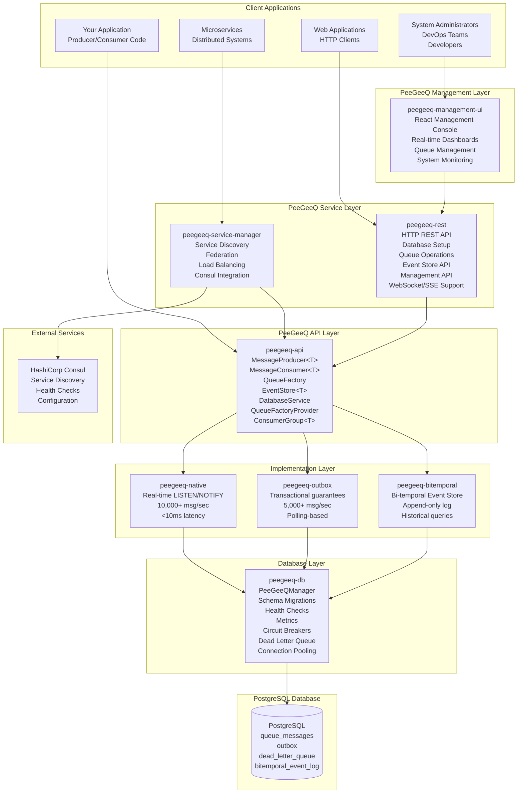

# PeeGeeQ Architecture & API Reference
#### © Mark Andrew Ray-Smith Cityline Ltd 2025

Complete technical reference for PeeGeeQ's architecture, design patterns, and API documentation.

## Table of Contents

1. [System Architecture](#system-architecture)
2. [Module Structure](#module-structure)
3. [Core API Reference](#core-api-reference)
4. [Database Schema](#database-schema)
5. [Design Patterns](#design-patterns)
6. [REST API Reference](#rest-api-reference)
7. [Management Console](#management-console)
8. [Performance Characteristics](#performance-characteristics)
9. [Integration Patterns](#integration-patterns)

## System Architecture

### High-Level Architecture

PeeGeeQ is built as a layered architecture that leverages PostgreSQL's advanced features for enterprise-grade messaging:



### Core Design Principles

1. **PostgreSQL-Native**: Leverages PostgreSQL's LISTEN/NOTIFY, advisory locks, and ACID transactions
2. **Type Safety**: Strongly typed APIs with generic support
3. **Pluggable Architecture**: Multiple queue implementations via factory pattern
4. **Production Ready**: Built-in health checks, metrics, circuit breakers, and monitoring
5. **Zero Dependencies**: No external message brokers required
6. **Transactional Consistency**: Full ACID compliance with business data

## Module Structure

PeeGeeQ consists of 9 core modules organized in a layered architecture:

### 1. peegeeq-api (Core Interfaces)

**Purpose**: Defines core contracts and interfaces
**Key Components**:
- `MessageProducer<T>` - Message publishing interface
- `MessageConsumer<T>` - Message consumption interface
- `Message<T>` - Message abstraction
- `EventStore<T>` - Bi-temporal event store interface
- `BiTemporalEvent<T>` - Bi-temporal event abstraction
- `DatabaseService` - Database operations interface
- `QueueFactoryProvider` - Factory provider interface

### 2. peegeeq-db (Database Management)

**Purpose**: Database infrastructure and management
**Key Components**:
- `PeeGeeQManager` - Main entry point and lifecycle management
- `DatabaseService` - Database operations and connection management
- `SchemaMigrationManager` - Versioned schema migrations
- `HealthCheckManager` - Multi-component health monitoring
- `PeeGeeQMetrics` - Metrics collection and reporting
- `CircuitBreakerManager` - Resilience patterns
- `DeadLetterQueueManager` - Failed message handling

### 3. peegeeq-native (High-Performance Implementation)

**Purpose**: Real-time LISTEN/NOTIFY based messaging
**Key Components**:
- `PgNativeQueueFactory` - Factory for native queues
- `PgNativeProducer<T>` - High-performance message producer
- `PgNativeConsumer<T>` - Real-time message consumer
- `PgConnectionProvider` - Optimized connection management

**Performance**: 10,000+ msg/sec, <10ms latency

### 4. peegeeq-outbox (Transactional Implementation)

**Purpose**: Transactional outbox pattern implementation
**Key Components**:
- `OutboxQueueFactory` - Factory for outbox queues
- `OutboxProducer<T>` - Transactional message producer
- `OutboxConsumer<T>` - Polling-based message consumer
- `OutboxPollingService` - Background polling service

**Performance**: 5,000+ msg/sec, ACID compliance

### 5. peegeeq-bitemporal (Event Store)

**Purpose**: Bi-temporal event sourcing capabilities
**Key Components**:
- `BiTemporalEventStore<T>` - Main event store interface
- `PgBiTemporalEventStore<T>` - PostgreSQL implementation
- `BiTemporalEvent<T>` - Event with temporal metadata
- `EventQuery` - Query builder for temporal queries

### 6. peegeeq-rest (HTTP API)

**Purpose**: HTTP REST API server
**Key Components**:
- `PeeGeeQRestServer` - Vert.x based HTTP server
- `DatabaseSetupService` - Database setup via REST
- `QueueOperationsHandler` - Queue operations via HTTP
- `EventStoreHandler` - Event store operations via HTTP

### 7. peegeeq-service-manager (Service Discovery)

**Purpose**: Service discovery and federation
**Key Components**:
- `PeeGeeQServiceManager` - Main service manager
- `ConsulServiceDiscovery` - Consul integration
- `FederationHandler` - Multi-instance coordination
- `LoadBalancingStrategy` - Request routing

### 8. peegeeq-management-ui (Management Console)

**Purpose**: Web-based administration interface for PeeGeeQ system management
**Key Components**:
- `React Management Console` - Modern web interface inspired by RabbitMQ's admin console
- `System Overview Dashboard` - Real-time metrics and system health monitoring
- `Queue Management Interface` - Complete CRUD operations for queues
- `Consumer Group Management` - Visual consumer group coordination
- `Event Store Explorer` - Advanced event querying interface
- `Message Browser` - Visual message inspection and debugging
- `Real-time Monitoring` - Live dashboards with WebSocket updates
- `Developer Portal` - Interactive API documentation and testing

**Technology Stack**: React 18 + TypeScript + Ant Design + Vite
**Integration**: Served by PeeGeeQ REST server with management API endpoints

### 9. peegeeq-examples (Demonstrations)

**Purpose**: Comprehensive example applications and demonstrations covering all PeeGeeQ features

**Core Examples**:
- `PeeGeeQSelfContainedDemo` - Complete self-contained demonstration
- `PeeGeeQExample` - Basic producer/consumer patterns
- `BiTemporalEventStoreExample` - Event sourcing with temporal queries
- `ConsumerGroupExample` - Load balancing and consumer groups
- `RestApiExample` - HTTP interface usage
- `ServiceDiscoveryExample` - Multi-instance deployment

**Advanced Examples (Enhanced)**:
- `MessagePriorityExample` - Priority-based message processing with real-world scenarios
- `EnhancedErrorHandlingExample` - Retry strategies, circuit breakers, poison message handling
- `SecurityConfigurationExample` - SSL/TLS, certificate management, compliance features
- `PerformanceTuningExample` - Connection pooling, throughput optimization, memory tuning
- `IntegrationPatternsExample` - Request-reply, pub-sub, message routing, distributed patterns

**Specialized Examples**:
- `TransactionalBiTemporalExample` - Combining transactions with event sourcing
- `RestApiStreamingExample` - WebSocket and Server-Sent Events
- `NativeVsOutboxComparisonExample` - Performance comparison and use case guidance
- `AdvancedConfigurationExample` - Production configuration patterns
- `MultiConfigurationExample` - Multi-environment setup
- `SimpleConsumerGroupTest` - Basic consumer group testing

**Coverage**: 95-98% of PeeGeeQ functionality with production-ready patterns

## Core API Reference

### Message Interfaces

#### MessageProducer<T>
```java
public interface MessageProducer<T> extends AutoCloseable {
    /**
     * Send a message with the given payload
     */
    CompletableFuture<Void> send(T payload);

    /**
     * Send a message with the given payload and headers
     */
    CompletableFuture<Void> send(T payload, Map<String, String> headers);

    /**
     * Send a message with the given payload, headers, and correlation ID
     */
    CompletableFuture<Void> send(T payload, Map<String, String> headers, String correlationId);

    /**
     * Send a message with the given payload, headers, correlation ID, and message group
     */
    CompletableFuture<Void> send(T payload, Map<String, String> headers, String correlationId, String messageGroup);

    /**
     * Close the producer and release resources
     */
    @Override
    void close();
}
```

#### MessageConsumer<T>
```java
public interface MessageConsumer<T> extends AutoCloseable {
    /**
     * Subscribe to messages with the given handler
     */
    void subscribe(MessageHandler<T> handler);

    /**
     * Unsubscribe from message processing
     */
    void unsubscribe();

    /**
     * Close the consumer and release resources
     */
    @Override
    void close();
}
```

#### Message<T>
```java
public interface Message<T> {
    /**
     * Unique message identifier
     */
    String getId();
    
    /**
     * Message payload
     */
    T getPayload();
    
    /**
     * Message headers
     */
    Map<String, String> getHeaders();
    
    /**
     * Message priority (0-9, higher = more priority)
     */
    int getPriority();
    
    /**
     * Message creation timestamp
     */
    Instant getCreatedAt();
    
    /**
     * Correlation ID for message tracking
     */
    String getCorrelationId();
}
```

### Queue Factory Pattern

#### QueueFactoryProvider
```java
public interface QueueFactoryProvider {
    /**
     * Get the singleton instance
     */
    static QueueFactoryProvider getInstance();

    /**
     * Create a queue factory of the specified type with configuration
     */
    QueueFactory createFactory(String implementationType,
                              DatabaseService databaseService,
                              Map<String, Object> configuration);

    /**
     * Create a queue factory of the specified type with default configuration
     */
    QueueFactory createFactory(String implementationType, DatabaseService databaseService);

    /**
     * Get the set of supported implementation types
     */
    Set<String> getSupportedTypes();

    /**
     * Create a queue factory using a named configuration template
     */
    default QueueFactory createNamedFactory(String implementationType,
                                          String configurationName,
                                          DatabaseService databaseService,
                                          Map<String, Object> additionalConfig);
}
```

#### QueueFactory
```java
public interface QueueFactory extends AutoCloseable {
    /**
     * Create a message producer for the specified topic
     */
    <T> MessageProducer<T> createProducer(String topic, Class<T> payloadType);

    /**
     * Create a message consumer for the specified topic
     */
    <T> MessageConsumer<T> createConsumer(String topic, Class<T> payloadType);

    /**
     * Create a consumer group for the specified topic
     */
    <T> ConsumerGroup<T> createConsumerGroup(String groupName, String topic, Class<T> payloadType);

    /**
     * Get the implementation type of this factory
     */
    String getImplementationType();

    /**
     * Check if the factory is healthy and ready to create queues
     */
    boolean isHealthy();

    /**
     * Close factory and release resources
     */
    @Override
    void close() throws Exception;
}
```

### Database Service

#### DatabaseService
```java
public interface DatabaseService {
    /**
     * Get a database connection
     */
    Connection getConnection() throws SQLException;
    
    /**
     * Execute a query with parameters
     */
    <T> List<T> query(String sql, RowMapper<T> mapper, Object... params);
    
    /**
     * Execute an update statement
     */
    int update(String sql, Object... params);
    
    /**
     * Execute within a transaction
     */
    <T> T executeInTransaction(TransactionCallback<T> callback);
    
    /**
     * Get connection pool statistics
     */
    ConnectionPoolStats getPoolStats();
    
    /**
     * Check if the database is healthy
     */
    boolean isHealthy();
}
```

### Event Store API

#### EventStore<T>
```java
public interface EventStore<T> {
    /**
     * Append an event to the store
     */
    Future<BiTemporalEvent<T>> appendEvent(String aggregateId, T event);
    
    /**
     * Append an event with metadata
     */
    Future<BiTemporalEvent<T>> appendEvent(String aggregateId, T event, 
                                          Map<String, String> metadata);
    
    /**
     * Query events by aggregate ID
     */
    Future<List<BiTemporalEvent<T>>> queryByAggregateId(String aggregateId);
    
    /**
     * Query events by time range
     */
    Future<List<BiTemporalEvent<T>>> queryByTimeRange(Instant from, Instant to);
    
    /**
     * Query events as of a specific transaction time
     */
    Future<List<BiTemporalEvent<T>>> queryAsOfTransactionTime(Instant asOf);
    
    /**
     * Correct an existing event
     */
    Future<BiTemporalEvent<T>> correctEvent(String eventId, T correctedEvent, 
                                           String reason);
}
```

#### BiTemporalEvent<T>
```java
public interface BiTemporalEvent<T> {
    /**
     * Unique event identifier
     */
    String getEventId();
    
    /**
     * Aggregate identifier
     */
    String getAggregateId();
    
    /**
     * Event payload
     */
    T getPayload();
    
    /**
     * Event type
     */
    String getEventType();
    
    /**
     * Valid time (business time)
     */
    Instant getValidFrom();
    Instant getValidTo();
    
    /**
     * Transaction time (system time)
     */
    Instant getTransactionTime();
    
    /**
     * Event version (for corrections)
     */
    int getVersion();
    
    /**
     * Correlation ID
     */
    String getCorrelationId();
    
    /**
     * Event metadata
     */
    Map<String, String> getMetadata();
}
```

### Configuration Classes

#### PeeGeeQConfiguration
```java
public class PeeGeeQConfiguration {
    // Database settings
    private String host = "localhost";
    private int port = 5432;
    private String database;
    private String username;
    private String password;
    
    // Connection pool settings
    private int maxPoolSize = 20;
    private int minPoolSize = 5;
    private Duration connectionTimeout = Duration.ofSeconds(30);
    
    // Queue settings
    private Duration visibilityTimeout = Duration.ofSeconds(30);
    private int maxRetries = 3;
    private boolean deadLetterEnabled = true;
    
    // Health check settings
    private boolean healthEnabled = true;
    private Duration healthInterval = Duration.ofSeconds(30);
    
    // Metrics settings
    private boolean metricsEnabled = true;
    private boolean jvmMetricsEnabled = true;
    
    // Builder pattern and factory methods
    public static Builder builder() { return new Builder(); }
    public static PeeGeeQConfiguration fromProperties(String filename);
    public static PeeGeeQConfiguration fromProperties(Properties properties);
}
```

#### ConsumerConfig
```java
public class ConsumerConfig {
    private int batchSize = 10;
    private Duration pollInterval = Duration.ofSeconds(1);
    private Duration visibilityTimeout = Duration.ofSeconds(30);
    private int maxRetries = 3;
    private boolean autoAcknowledge = true;
    private MessageFilter filter;
    private String consumerGroup;
    
    // Builder pattern
    public static Builder builder() { return new Builder(); }
}
```

## Database Schema

### Core Tables

#### queue_messages
```sql
CREATE TABLE queue_messages (
    id BIGSERIAL PRIMARY KEY,
    topic VARCHAR(255) NOT NULL,
    payload JSONB NOT NULL,
    visible_at TIMESTAMP WITH TIME ZONE DEFAULT NOW(),
    created_at TIMESTAMP WITH TIME ZONE DEFAULT NOW(),
    lock_id BIGINT,
    lock_until TIMESTAMP WITH TIME ZONE,
    retry_count INT DEFAULT 0,
    max_retries INT DEFAULT 3,
    status VARCHAR(50) DEFAULT 'AVAILABLE' CHECK (status IN ('AVAILABLE', 'LOCKED', 'PROCESSED', 'FAILED', 'DEAD_LETTER')),
    headers JSONB DEFAULT '{}',
    error_message TEXT,
    correlation_id VARCHAR(255),
    message_group VARCHAR(255),
    priority INT DEFAULT 5 CHECK (priority BETWEEN 1 AND 10)
);

-- Indexes
CREATE INDEX idx_queue_messages_topic_visible ON queue_messages(topic, visible_at, status);
CREATE INDEX idx_queue_messages_lock ON queue_messages(lock_id) WHERE lock_id IS NOT NULL;
CREATE INDEX idx_queue_messages_status ON queue_messages(status, created_at);
CREATE INDEX idx_queue_messages_correlation_id ON queue_messages(correlation_id) WHERE correlation_id IS NOT NULL;
CREATE INDEX idx_queue_messages_priority ON queue_messages(priority, created_at);
```

#### outbox
```sql
CREATE TABLE outbox (
    id BIGSERIAL PRIMARY KEY,
    topic VARCHAR(255) NOT NULL,
    payload JSONB NOT NULL,
    created_at TIMESTAMP WITH TIME ZONE DEFAULT NOW(),
    processed_at TIMESTAMP WITH TIME ZONE,
    processing_started_at TIMESTAMP WITH TIME ZONE,
    status VARCHAR(50) DEFAULT 'PENDING' CHECK (status IN ('PENDING', 'PROCESSING', 'COMPLETED', 'FAILED', 'DEAD_LETTER')),
    retry_count INT DEFAULT 0,
    max_retries INT DEFAULT 3,
    next_retry_at TIMESTAMP WITH TIME ZONE,
    version INT DEFAULT 0,
    headers JSONB DEFAULT '{}',
    error_message TEXT,
    correlation_id VARCHAR(255),
    message_group VARCHAR(255),
    priority INT DEFAULT 5 CHECK (priority BETWEEN 1 AND 10)
);

-- Indexes
CREATE INDEX idx_outbox_status_created ON outbox(status, created_at);
CREATE INDEX idx_outbox_next_retry ON outbox(status, next_retry_at) WHERE status = 'FAILED';
CREATE INDEX idx_outbox_topic ON outbox(topic);
CREATE INDEX idx_outbox_correlation_id ON outbox(correlation_id) WHERE correlation_id IS NOT NULL;
CREATE INDEX idx_outbox_message_group ON outbox(message_group) WHERE message_group IS NOT NULL;
CREATE INDEX idx_outbox_priority ON outbox(priority, created_at);
```

#### bitemporal_event_log
```sql
CREATE TABLE bitemporal_event_log (
    -- Primary key and identity
    id BIGSERIAL PRIMARY KEY,
    event_id VARCHAR(255) NOT NULL,
    event_type VARCHAR(255) NOT NULL,

    -- Bi-temporal dimensions
    valid_time TIMESTAMP WITH TIME ZONE NOT NULL,
    transaction_time TIMESTAMP WITH TIME ZONE DEFAULT NOW() NOT NULL,

    -- Event data
    payload JSONB NOT NULL,
    headers JSONB DEFAULT '{}',

    -- Versioning and corrections
    version BIGINT DEFAULT 1 NOT NULL,
    previous_version_id VARCHAR(255),
    is_correction BOOLEAN DEFAULT FALSE NOT NULL,
    correction_reason TEXT,

    -- Grouping and correlation
    correlation_id VARCHAR(255),
    aggregate_id VARCHAR(255),

    -- Metadata
    created_at TIMESTAMP WITH TIME ZONE DEFAULT NOW() NOT NULL
);

-- Comprehensive indexing strategy
CREATE INDEX idx_bitemporal_valid_time ON bitemporal_event_log(valid_time);
CREATE INDEX idx_bitemporal_transaction_time ON bitemporal_event_log(transaction_time);
CREATE INDEX idx_bitemporal_valid_transaction ON bitemporal_event_log(valid_time, transaction_time);
CREATE INDEX idx_bitemporal_event_id ON bitemporal_event_log(event_id);
CREATE INDEX idx_bitemporal_event_type ON bitemporal_event_log(event_type);
CREATE INDEX idx_bitemporal_aggregate_id ON bitemporal_event_log(aggregate_id) WHERE aggregate_id IS NOT NULL;
CREATE INDEX idx_bitemporal_correlation_id ON bitemporal_event_log(correlation_id) WHERE correlation_id IS NOT NULL;
CREATE INDEX idx_bitemporal_version_chain ON bitemporal_event_log(event_id, version);
CREATE INDEX idx_bitemporal_corrections ON bitemporal_event_log(is_correction, transaction_time) WHERE is_correction = TRUE;
CREATE INDEX idx_bitemporal_latest_events ON bitemporal_event_log(event_type, transaction_time DESC) WHERE is_correction = FALSE;

-- GIN indexes for JSONB queries
CREATE INDEX idx_bitemporal_payload_gin ON bitemporal_event_log USING GIN(payload);
CREATE INDEX idx_bitemporal_headers_gin ON bitemporal_event_log USING GIN(headers);
```

#### dead_letter_queue
```sql
CREATE TABLE dead_letter_queue (
    id BIGSERIAL PRIMARY KEY,
    original_table VARCHAR(50) NOT NULL,
    original_id BIGINT NOT NULL,
    topic VARCHAR(255) NOT NULL,
    payload JSONB NOT NULL,
    original_created_at TIMESTAMP WITH TIME ZONE NOT NULL,
    failed_at TIMESTAMP WITH TIME ZONE DEFAULT NOW(),
    failure_reason TEXT NOT NULL,
    retry_count INT NOT NULL,
    headers JSONB DEFAULT '{}',
    correlation_id VARCHAR(255),
    message_group VARCHAR(255)
);

-- Indexes
CREATE INDEX idx_dlq_original ON dead_letter_queue(original_table, original_id);
CREATE INDEX idx_dlq_topic ON dead_letter_queue(topic);
CREATE INDEX idx_dlq_failed_at ON dead_letter_queue(failed_at);
```

#### Additional Tables

##### outbox_consumer_groups
```sql
CREATE TABLE outbox_consumer_groups (
    id BIGSERIAL PRIMARY KEY,
    outbox_message_id BIGINT NOT NULL REFERENCES outbox(id) ON DELETE CASCADE,
    consumer_group_name VARCHAR(255) NOT NULL,
    status VARCHAR(50) DEFAULT 'PENDING' CHECK (status IN ('PENDING', 'PROCESSING', 'COMPLETED', 'FAILED')),
    processed_at TIMESTAMP WITH TIME ZONE,
    processing_started_at TIMESTAMP WITH TIME ZONE,
    retry_count INT DEFAULT 0,
    error_message TEXT,
    created_at TIMESTAMP WITH TIME ZONE DEFAULT NOW(),

    UNIQUE(outbox_message_id, consumer_group_name)
);
```

##### queue_metrics & connection_pool_metrics
```sql
CREATE TABLE queue_metrics (
    id BIGSERIAL PRIMARY KEY,
    metric_name VARCHAR(100) NOT NULL,
    metric_value DOUBLE PRECISION NOT NULL,
    tags JSONB DEFAULT '{}',
    timestamp TIMESTAMP WITH TIME ZONE DEFAULT NOW()
);

CREATE TABLE connection_pool_metrics (
    id BIGSERIAL PRIMARY KEY,
    pool_name VARCHAR(100) NOT NULL,
    active_connections INT NOT NULL,
    idle_connections INT NOT NULL,
    total_connections INT NOT NULL,
    pending_threads INT NOT NULL,
    timestamp TIMESTAMP WITH TIME ZONE DEFAULT NOW()
);
```

## Design Patterns

### Factory Pattern

PeeGeeQ uses the Factory pattern to provide pluggable queue implementations:

```java
// Factory Provider (Singleton)
QueueFactoryProvider provider = QueueFactoryProvider.getInstance();

// Create specific factory implementations
QueueFactory nativeFactory = provider.createFactory("native", databaseService);
QueueFactory outboxFactory = provider.createFactory("outbox", databaseService);

// Factories create producers and consumers
MessageProducer<String> producer = nativeFactory.createProducer("orders", String.class);
MessageConsumer<String> consumer = nativeFactory.createConsumer("orders", String.class);
```

### Observer Pattern

Message consumption uses the Observer pattern with async callbacks:

```java
consumer.subscribe(message -> {
    // Process message
    processOrder(message.getPayload());
    
    // Return completion future
    return CompletableFuture.completedFuture(null);
});
```

### Template Method Pattern

Database operations use template methods for consistent transaction handling:

```java
public <T> T executeInTransaction(TransactionCallback<T> callback) {
    Connection conn = getConnection();
    try {
        conn.setAutoCommit(false);
        T result = callback.execute(conn);
        conn.commit();
        return result;
    } catch (Exception e) {
        conn.rollback();
        throw new RuntimeException(e);
    } finally {
        conn.close();
    }
}
```

### Circuit Breaker Pattern

Built-in resilience with circuit breakers:

```java
@CircuitBreaker(name = "database-operations", fallbackMethod = "fallbackMethod")
public void performDatabaseOperation() {
    // Database operation that might fail
}

public void fallbackMethod(Exception ex) {
    // Fallback logic when circuit is open
}
```

## REST API Reference

### Database Setup Endpoints

#### Create Database Setup
```http
POST /api/v1/database-setup/create
Content-Type: application/json

{
  "setupId": "my-setup",
  "databaseConfig": {
    "host": "localhost",
    "port": 5432,
    "databaseName": "my_app_db",
    "username": "postgres",
    "password": "password",
    "schema": "public"
  },
  "queues": [
    {
      "queueName": "orders",
      "maxRetries": 3,
      "visibilityTimeoutSeconds": 30
    }
  ],
  "eventStores": [
    {
      "eventStoreName": "order-events",
      "tableName": "order_events",
      "biTemporalEnabled": true
    }
  ]
}
```

#### Other Database Setup Endpoints
- `DELETE /api/v1/database-setup/{setupId}` - Destroy a database setup
- `GET /api/v1/database-setup/{setupId}/status` - Get setup status
- `POST /api/v1/database-setup/{setupId}/queues` - Add queue to setup
- `POST /api/v1/database-setup/{setupId}/eventstores` - Add event store to setup

### Queue Operations Endpoints

#### Send Message to Queue
```http
POST /api/v1/queues/{setupId}/{queueName}/messages
Content-Type: application/json

{
  "payload": {
    "orderId": "12345",
    "customerId": "67890",
    "amount": 99.99
  },
  "headers": {
    "source": "order-service",
    "version": "1.0"
  },
  "priority": 5,
  "correlationId": "order-12345"
}
```

#### Other Queue Endpoints
- `POST /api/v1/queues/{setupId}/{queueName}/messages/batch` - Send multiple messages
- `GET /api/v1/queues/{setupId}/{queueName}/stats` - Get queue statistics
- `GET /api/v1/queues/{setupId}/{queueName}/messages/next` - Get next message
- `GET /api/v1/queues/{setupId}/{queueName}/messages` - Get messages with filtering
- `DELETE /api/v1/queues/{setupId}/{queueName}/messages/{messageId}` - Acknowledge message

### Event Store Endpoints

#### Store Event
```http
POST /api/v1/eventstores/{setupId}/{eventStoreName}/events
Content-Type: application/json

{
  "aggregateId": "order-12345",
  "eventType": "OrderCreated",
  "payload": {
    "orderId": "12345",
    "customerId": "67890",
    "amount": 99.99
  },
  "validTime": "2025-08-23T10:00:00Z",
  "correlationId": "order-12345",
  "headers": {
    "source": "order-service"
  }
}
```

#### Query Events
- `GET /api/v1/eventstores/{setupId}/{eventStoreName}/events` - Query events with filters
- `GET /api/v1/eventstores/{setupId}/{eventStoreName}/events/{aggregateId}` - Get events by aggregate
- `GET /api/v1/eventstores/{setupId}/{eventStoreName}/stats` - Get event store statistics

### Management API Endpoints

#### System Health and Overview
- `GET /api/v1/health` - Health check endpoint
- `GET /api/v1/management/overview` - System overview dashboard data
- `GET /api/v1/management/queues` - Queue management data
- `GET /api/v1/management/metrics` - System metrics
- `GET /api/v1/management/consumer-groups` - Consumer group information
- `GET /api/v1/management/event-stores` - Event store management data

### Real-time Communication

#### WebSocket Endpoints
- `WS /ws/queues/{setupId}/{queueName}` - Real-time queue message streaming
- `WS /ws/monitoring` - System monitoring updates

#### Server-Sent Events (SSE)
- `GET /sse/metrics` - Real-time system metrics stream
- `GET /sse/queues/{setupId}` - Real-time queue updates stream
- `GET /api/v1/queues/{setupId}/{queueName}/stream` - Queue message stream

### Consumer Group Endpoints

#### Consumer Group Management
- `POST /api/v1/consumer-groups/{setupId}` - Create consumer group
- `GET /api/v1/consumer-groups/{setupId}` - List consumer groups
- `GET /api/v1/consumer-groups/{setupId}/{groupName}` - Get consumer group details
- `DELETE /api/v1/consumer-groups/{setupId}/{groupName}` - Delete consumer group
- `POST /api/v1/consumer-groups/{setupId}/{groupName}/consumers` - Add consumer to group

## Management Console

### Overview

The PeeGeeQ Management Console is a modern, web-based administration interface inspired by RabbitMQ's excellent management console design. Built with React 18, TypeScript, and Ant Design, it provides comprehensive system monitoring and management capabilities.

### Key Features

#### **System Overview Dashboard**
- **Real-time System Health** - Live status monitoring with uptime tracking
- **Key Performance Metrics** - Messages/second, queue depths, consumer activity
- **System Statistics** - Queue counts, consumer group status, event store metrics
- **Interactive Charts** - Real-time throughput and performance visualizations
- **Recent Activity Feed** - Live stream of system events and operations

#### **Queue Management Interface**
- **Complete CRUD Operations** - Create, read, update, and delete queues
- **Real-time Queue Statistics** - Message counts, processing rates, consumer status
- **Message Browser** - Visual inspection of queue messages with filtering
- **Queue Configuration** - Visibility timeouts, retry policies, dead letter settings
- **Performance Monitoring** - Throughput charts and latency metrics

#### **Consumer Group Management**
- **Visual Group Coordination** - Consumer group status and member management
- **Load Balancing Visualization** - Message distribution across consumers
- **Consumer Health Monitoring** - Individual consumer status and performance
- **Group Configuration** - Partition assignment and rebalancing controls

#### **Event Store Explorer**
- **Advanced Event Querying** - Temporal queries with bi-temporal support
- **Event Timeline Visualization** - Historical event progression
- **Aggregate Inspection** - Event streams by aggregate ID
- **Correction Management** - Event correction tracking and visualization

#### **Real-time Monitoring**
- **WebSocket Integration** - Live updates without page refresh
- **Server-Sent Events** - Efficient real-time data streaming
- **Customizable Dashboards** - Configurable monitoring views
- **Alert Management** - System health alerts and notifications

### Technology Architecture

#### **Frontend Stack**
```
React 18 + TypeScript + Vite
├── UI Framework: Ant Design (enterprise-grade components)
├── Charts: Recharts (real-time visualizations)
├── State Management: Zustand (lightweight, modern)
├── Routing: React Router v6
└── Build Tool: Vite (fast development and builds)
```

#### **Backend Integration**
- **Management API** - RESTful endpoints for UI operations
- **WebSocket API** - Real-time data streaming
- **Static Serving** - Served from PeeGeeQ REST server
- **Proxy Configuration** - Development server proxies to REST API

### Access and Deployment

#### **Development Mode**
```bash
cd peegeeq-management-ui
npm install
npm run dev
# Access at: http://localhost:5173
```

#### **Production Deployment**
```bash
npm run build  # Builds to ../peegeeq-rest/src/main/resources/webroot
# Start PeeGeeQ REST server
# Access at: http://localhost:8080/ui/
```

### Navigation Structure

The management console features a clean, intuitive navigation structure:

```
PeeGeeQ Management Console
├── Overview (System Dashboard)
├── Queues (Queue Management)
├── Consumer Groups (Group Coordination)
├── Event Stores (Event Management)
├── Message Browser (Message Inspection)
├── Schema Registry (Schema Management) [Planned]
├── Developer Portal (API Documentation) [Planned]
├── Queue Designer (Visual Design) [Planned]
├── Monitoring (Real-time Dashboards)
└── Settings (System Configuration)
```

### Integration with REST API

The management console integrates seamlessly with the PeeGeeQ REST API:

- **Health Monitoring** - `/api/v1/health` for system status
- **System Overview** - `/api/v1/management/overview` for dashboard data
- **Queue Operations** - Full queue management through REST endpoints
- **Real-time Updates** - WebSocket and SSE for live data
- **Event Store Management** - Complete event store operations

## Performance Characteristics

### Native Queue Performance

- **Throughput**: 10,000+ messages/second
- **Latency**: <10ms end-to-end
- **Mechanism**: PostgreSQL LISTEN/NOTIFY with advisory locks
- **Concurrency**: Multiple consumers with automatic load balancing
- **Scalability**: Horizontal scaling via consumer groups
- **Memory Usage**: Low memory footprint with streaming processing
- **Connection Efficiency**: Connection pooling with optimized pool sizes

### Outbox Pattern Performance

- **Throughput**: 5,000+ messages/second
- **Latency**: ~100ms (polling-based with configurable intervals)
- **Mechanism**: Database polling with ACID transactions
- **Consistency**: Full ACID compliance with business data
- **Reliability**: Exactly-once delivery guarantee
- **Durability**: Transactional outbox ensures no message loss
- **Retry Handling**: Configurable retry policies with exponential backoff

### Bi-temporal Event Store Performance

- **Write Throughput**: 3,000+ events/second
- **Query Performance**: <50ms for typical temporal queries
- **Storage**: Append-only, optimized for time-series data
- **Indexing**: Multi-dimensional indexes for temporal and aggregate queries
- **Correction Support**: Efficient event correction with version tracking
- **Historical Queries**: Point-in-time queries with transaction time support
- **Aggregate Reconstruction**: Fast aggregate state reconstruction

### REST API Performance

- **HTTP Throughput**: 2,000+ requests/second
- **WebSocket Throughput**: 5,000+ messages/second per connection
- **SSE Throughput**: 3,000+ events/second per connection
- **Latency**: <50ms for REST operations, <20ms for WebSocket
- **Concurrent Connections**: 1,000+ simultaneous WebSocket connections
- **Management Operations**: Sub-second response times for admin operations

### Management Console Performance

- **UI Responsiveness**: <100ms for dashboard updates
- **Real-time Updates**: <500ms latency for live metrics
- **Data Visualization**: Handles 10,000+ data points in charts
- **Concurrent Users**: 50+ simultaneous admin users
- **Resource Usage**: <50MB memory footprint in browser

## Integration Patterns

### Microservices Integration

```java
// Service A - Order Service
@Service
public class OrderService {
    @Autowired
    private MessageProducer<OrderEvent> orderEventProducer;
    
    public void createOrder(Order order) {
        // Save order
        orderRepository.save(order);
        
        // Publish event
        OrderEvent event = new OrderEvent(order.getId(), order.getCustomerId());
        orderEventProducer.send(event);
    }
}

// Service B - Inventory Service  
@Service
public class InventoryService {
    @Autowired
    private MessageConsumer<OrderEvent> orderEventConsumer;
    
    @PostConstruct
    public void startListening() {
        orderEventConsumer.subscribe(this::handleOrderEvent);
    }
    
    private CompletableFuture<Void> handleOrderEvent(Message<OrderEvent> message) {
        OrderEvent event = message.getPayload();
        // Update inventory
        inventoryRepository.reserveItems(event.getOrderId());
        return CompletableFuture.completedFuture(null);
    }
}
```

### Spring Boot Integration

```java
@Configuration
@EnableConfigurationProperties(PeeGeeQProperties.class)
public class PeeGeeQAutoConfiguration {
    
    @Bean
    @ConditionalOnMissingBean
    public PeeGeeQManager peeGeeQManager(PeeGeeQProperties properties) {
        PeeGeeQConfiguration config = PeeGeeQConfiguration.builder()
            .host(properties.getHost())
            .port(properties.getPort())
            .database(properties.getDatabase())
            .username(properties.getUsername())
            .password(properties.getPassword())
            .build();
            
        PeeGeeQManager manager = new PeeGeeQManager(config);
        manager.initialize();
        return manager;
    }
    
    @Bean
    public QueueFactoryProvider queueFactoryProvider() {
        return QueueFactoryProvider.getInstance();
    }
}
```

### REST API Integration

```java
@RestController
@RequestMapping("/api/messages")
public class MessageController {
    
    @Autowired
    private MessageProducer<String> messageProducer;
    
    @PostMapping("/send")
    public ResponseEntity<Void> sendMessage(@RequestBody MessageRequest request) {
        messageProducer.send(request.getPayload(), request.getHeaders())
            .thenRun(() -> log.info("Message sent successfully"))
            .exceptionally(ex -> {
                log.error("Failed to send message", ex);
                return null;
            });
            
        return ResponseEntity.accepted().build();
    }
}
```

### WebSocket Integration

```javascript
// Real-time queue message streaming
const ws = new WebSocket('ws://localhost:8080/ws/queues/my-setup/orders');

ws.onopen = () => {
    console.log('Connected to queue stream');

    // Configure streaming parameters
    ws.send(JSON.stringify({
        type: 'configure',
        batchSize: 10,
        maxWaitTime: 5000
    }));

    // Subscribe to messages
    ws.send(JSON.stringify({
        type: 'subscribe'
    }));
};

ws.onmessage = (event) => {
    const message = JSON.parse(event.data);

    switch (message.type) {
        case 'message':
            console.log('Received message:', message.payload);
            processMessage(message);
            break;
        case 'batch':
            console.log('Received batch:', message.messages);
            message.messages.forEach(processMessage);
            break;
        case 'error':
            console.error('Stream error:', message.error);
            break;
    }
};
```

### Server-Sent Events Integration

```javascript
// Real-time system metrics streaming
const eventSource = new EventSource('/sse/metrics');

eventSource.onmessage = (event) => {
    const metrics = JSON.parse(event.data);
    updateDashboard(metrics);
};

eventSource.addEventListener('queue-update', (event) => {
    const queueData = JSON.parse(event.data);
    updateQueueDisplay(queueData);
});

eventSource.onerror = (error) => {
    console.error('SSE connection error:', error);
};
```

### Management Console Integration

```javascript
// Management API client integration
class PeeGeeQManagementClient {
    constructor(baseUrl = 'http://localhost:8080') {
        this.baseUrl = baseUrl;
    }

    async getSystemOverview() {
        const response = await fetch(`${this.baseUrl}/api/v1/management/overview`);
        return response.json();
    }

    async getQueueList() {
        const response = await fetch(`${this.baseUrl}/api/v1/management/queues`);
        return response.json();
    }

    async createQueue(setupId, queueConfig) {
        const response = await fetch(`${this.baseUrl}/api/v1/database-setup/${setupId}/queues`, {
            method: 'POST',
            headers: { 'Content-Type': 'application/json' },
            body: JSON.stringify(queueConfig)
        });
        return response.json();
    }

    async sendMessage(setupId, queueName, message) {
        const response = await fetch(`${this.baseUrl}/api/v1/queues/${setupId}/${queueName}/messages`, {
            method: 'POST',
            headers: { 'Content-Type': 'application/json' },
            body: JSON.stringify(message)
        });
        return response.json();
    }
}
```

### Consumer Group Integration

```java
// Consumer group coordination
@Service
public class OrderProcessingService {
    @Autowired
    private QueueFactory queueFactory;

    @PostConstruct
    public void initializeConsumerGroup() {
        // Create consumer group for load balancing
        ConsumerGroup<OrderEvent> consumerGroup = queueFactory
            .createConsumerGroup("order-processors", "orders", OrderEvent.class);

        // Add multiple consumers to the group
        for (int i = 0; i < 3; i++) {
            final int consumerId = i;
            consumerGroup.addConsumer(message -> {
                log.info("Consumer {} processing order: {}", consumerId, message.getPayload());
                return processOrder(message.getPayload());
            });
        }

        // Start the consumer group
        consumerGroup.start();
    }

    private CompletableFuture<Void> processOrder(OrderEvent order) {
        // Process order logic
        return CompletableFuture.completedFuture(null);
    }
}
```

### Event Store Integration

```java
// Bi-temporal event sourcing integration
@Service
public class OrderEventSourcingService {
    @Autowired
    private EventStore<OrderEvent> orderEventStore;

    public CompletableFuture<Void> recordOrderEvent(String orderId, OrderEvent event) {
        return orderEventStore.appendEvent(orderId, event)
            .thenAccept(storedEvent -> {
                log.info("Stored event {} for order {}", storedEvent.getEventId(), orderId);
            });
    }

    public CompletableFuture<List<BiTemporalEvent<OrderEvent>>> getOrderHistory(String orderId) {
        return orderEventStore.queryByAggregateId(orderId);
    }

    public CompletableFuture<List<BiTemporalEvent<OrderEvent>>> getOrdersAsOf(Instant pointInTime) {
        return orderEventStore.queryAsOfTransactionTime(pointInTime);
    }
}
```

---

**Next Reading**: [PeeGeeQ Advanced Features & Production](PeeGeeQ-Advanced-Features.md) for enterprise features, consumer groups, service discovery, and production deployment guidance.
