# PeeGeeQ Complete Guide
#### © Mark Andrew Ray-Smith Cityline Ltd 2025

<div align="center">
  
</div>

Welcome to **PeeGeeQ** (PostgreSQL as a Message Queue) - a production-ready message queue system built on PostgreSQL that provides both high-performance real-time messaging and transactional messaging patterns.

This guide takes you from complete beginner to production-ready implementation with progressive examples and detailed explanations.

> ** Need Technical Reference?** For detailed API specifications, database schema, and architectural details, see the [PeeGeeQ Architecture & API Reference](PeeGeeQ-Architecture-API-Reference.md).

## Table of Contents

### Part I: Understanding Message Queues
1. [What is a Message Queue?](#what-is-a-message-queue)
2. [Why Use Message Queues?](#why-use-message-queues)
3. [Message Queue Patterns Explained](#message-queue-patterns-explained)
4. [Traditional vs. Database-Based Queues](#traditional-vs-database-based-queues)

### Part II: Understanding PeeGeeQ
5. [What is PeeGeeQ?](#what-is-peegeeq)
6. [PeeGeeQ's Unique Approach](#peegeeqs-unique-approach)
7. [Architecture Deep Dive](#architecture-deep-dive)
8. [When to Choose PeeGeeQ](#when-to-choose-peegeeq)

### Part III: Getting Started (Progressive Learning)
9. [Prerequisites & Environment Setup](#prerequisites--environment-setup)
10. [Your First Message (Hello World)](#your-first-message-hello-world)
11. [Understanding the Code](#understanding-the-code)
12. [Adding Error Handling](#adding-error-handling)
13. [Adding Configuration](#adding-configuration)

### Part IV: Core Concepts (Detailed)
14. [Native Queue Pattern (Deep Dive)](#native-queue-pattern-deep-dive)
15. [Outbox Pattern (Deep Dive)](#outbox-pattern-deep-dive)
16. [Bi-temporal Event Store (Deep Dive)](#bi-temporal-event-store-deep-dive)
17. [Choosing the Right Pattern](#choosing-the-right-pattern)

### Part V: Practical Examples (Progressive Complexity)
18. [Level 1: Basic Examples](#level-1-basic-examples)
19. [Level 2: Business Scenarios](#level-2-business-scenarios)
20. [Level 3: Advanced Integration](#level-3-advanced-integration)

### Part VI: Production Readiness
21. [Configuration Management](#configuration-management)
22. [Monitoring & Metrics](#monitoring--metrics)
23. [Performance Tuning](#performance-tuning)
24. [Security Considerations](#security-considerations)

### Part VII: Advanced Features & Enterprise
25. [Advanced Messaging Patterns](#advanced-messaging-patterns)
26. [Message Priority Handling](#message-priority-handling)
27. [Enhanced Error Handling](#enhanced-error-handling)
28. [System Properties Configuration](#system-properties-configuration)
29. [Security Configuration](#security-configuration)
30. [Consumer Groups & Load Balancing](#consumer-groups--load-balancing)
31. [Service Discovery & Federation](#service-discovery--federation)
32. [REST API & HTTP Integration](#rest-api--http-integration)
33. [Bi-Temporal Event Store](#bi-temporal-event-store)
34. [Production Readiness Features](#production-readiness-features)
35. [Monitoring & Observability](#monitoring--observability)
36. [Multi-Environment Configuration](#multi-environment-configuration)
37. [Performance Optimization](#performance-optimization)
38. [Integration Patterns](#integration-patterns)
39. [Production Deployment](#production-deployment)

### Part VIII: Troubleshooting & Best Practices
40. [Common Issues & Solutions](#common-issues--solutions)
41. [Best Practices Checklist](#best-practices-checklist)
42. [Anti-patterns to Avoid](#anti-patterns-to-avoid)

---

## Part I: Understanding Message Queues

## What is a Message Queue?

A message queue is a communication method used in software architecture where applications send and receive messages asynchronously. Think of it as a reliable postal service for your applications.

### Real-World Analogy
Imagine a message queue like a post office:
- **You (Producer)** drop letters (messages) in a mailbox (queue)
- **The postal service (Queue System)** stores and delivers them reliably
- **Recipients (Consumers)** receive letters from their mailboxes
- **Letters are delivered reliably**, even if recipients aren't home when they arrive

### Core Components


- **Producer**: An application that sends messages
- **Queue**: A storage mechanism that holds messages temporarily
- **Consumer**: An application that receives and processes messages
- **Message**: A unit of data being transmitted (text, JSON, objects, etc.)

### Message Lifecycle

1. **Send**: Producer creates and sends a message to a queue
2. **Store**: Queue safely stores the message until a consumer is ready
3. **Receive**: Consumer retrieves the message from the queue
4. **Process**: Consumer processes the message (business logic)
5. **Acknowledge**: Consumer confirms successful processing
6. **Remove**: Queue removes the processed message

## Why Use Message Queues?

Message queues solve fundamental problems in distributed systems:

### 1. **Decoupling Applications**
```
❌ Without Message Queue (Tight Coupling):
[Order Service] ──directly calls──> [Email Service]
                ──directly calls──> [Inventory Service]
                ──directly calls──> [Payment Service]

✅ With Message Queue (Loose Coupling):
[Order Service] ──> [Queue] ──> [Email Service]
                           ──> [Inventory Service]
                           ──> [Payment Service]
```

**Benefits**:
- Services don't need to know about each other
- Services can be developed and deployed independently
- Adding new services doesn't require changing existing ones

### 2. **Reliability & Fault Tolerance**
- **Messages aren't lost** if a service is temporarily down
- **Automatic retry** mechanisms for failed processing
- **Dead letter queues** for messages that can't be processed

### 3. **Scalability**
- **Multiple consumers** can process messages in parallel
- **Load balancing** across consumer instances
- **Horizontal scaling** by adding more consumers

### 4. **Asynchronous Processing**
- **Producers don't wait** for consumers to process messages
- **Better user experience** - no blocking operations
- **Improved system responsiveness**

### 5. **Traffic Smoothing**
- **Handle traffic spikes** by queuing excess messages
- **Process at optimal rate** regardless of incoming load
- **Prevent system overload**

## Message Queue Patterns Explained

### 1. **Point-to-Point (Queue Pattern)**


- **One message** goes to **one consumer**
- **Load balancing** across multiple consumers
- **Competing consumers** pattern
- **Use case**: Order processing, task distribution

### 2. **Publish-Subscribe (Topic Pattern)**


- **One message** goes to **all subscribers**
- **Broadcasting** pattern
- **Event notification** pattern
- **Use case**: News feeds, notifications, event broadcasting

### 3. **Request-Reply Pattern**


- **Synchronous-like** communication over asynchronous queues
- **Correlation IDs** to match requests with replies
- **Use case**: RPC over messaging, distributed services

## Traditional vs. Database-Based Queues

### Traditional Message Brokers
**Examples**: RabbitMQ, Apache Kafka, Amazon SQS, Apache ActiveMQ

**Characteristics**:
- **Separate infrastructure** to manage and maintain
- **Specialized protocols** (AMQP, MQTT, etc.)
- **High performance** and feature-rich
- **Additional operational complexity**
- **Separate failure points**


### Database-Based Queues (PeeGeeQ Approach)
**Examples**: PeeGeeQ, AWS RDS with SQS integration

**Characteristics**:
- **Uses existing database** infrastructure
- **Transactional consistency** with business data
- **Simpler operational model**
- **Leverages database features** (ACID, replication, backup)
- **Single point of management**


### Comparison Table

| Aspect | Traditional Brokers | Database-Based (PeeGeeQ) |
|--------|-------------------|--------------------------|
| **Infrastructure** | Separate service | Uses existing database |
| **Operational Complexity** | High | Low |
| **Transactional Consistency** | Limited | Full ACID compliance |
| **Learning Curve** | Steep | Gentle (SQL knowledge) |
| **Backup & Recovery** | Separate process | Part of database backup |
| **Monitoring** | Separate tools | Database monitoring tools |
| **High Availability** | Complex setup | Database HA mechanisms |
| **Performance** | Very High | High (10k+ msg/sec) |

### When to Choose Each Approach

**Choose Traditional Brokers When**:
- **Extreme performance** requirements (100k+ msg/sec)
- **Complex routing** and transformation needs
- **Multiple protocols** required
- **Dedicated messaging team** available

**Choose Database-Based (PeeGeeQ) When**:
- **Transactional consistency** is critical
- **Operational simplicity** is important
- **Existing PostgreSQL** infrastructure
- **Team familiar with SQL** and databases
- **Moderate to high performance** needs (10k+ msg/sec)

---

## Part II: Understanding PeeGeeQ

## What is PeeGeeQ?

**PeeGeeQ** (PostgreSQL as a Message Queue) is an enterprise-grade message queue system that transforms your existing PostgreSQL database into a powerful, production-ready message broker.

### The Core Idea
Instead of adding another piece of infrastructure to your stack, PeeGeeQ leverages PostgreSQL's advanced features to provide enterprise-grade messaging capabilities:


### Three Powerful Patterns in One System

#### 1. **Native Queue** - Real-Time Performance
- **Performance**: 10,000+ messages/second, <10ms latency
- **Mechanism**: PostgreSQL LISTEN/NOTIFY with advisory locks
- **Use Case**: Real-time notifications, live updates, event streaming

#### 2. **Outbox Pattern** - Transactional Reliability
- **Performance**: 5,000+ messages/second
- **Mechanism**: Database transactions with polling-based delivery
- **Use Case**: Order processing, financial transactions, critical business events

#### 3. **Bi-Temporal Event Store** - Event Sourcing
- **Performance**: 3,000+ messages/second
- **Mechanism**: Append-only event log with temporal queries
- **Use Case**: Audit trails, event sourcing, historical analysis

## PeeGeeQ's Unique Approach

### What Makes PeeGeeQ Different?

#### **1. Database-Native Design**
PeeGeeQ isn't a wrapper around PostgreSQL - it's designed from the ground up to leverage PostgreSQL's strengths:

- **LISTEN/NOTIFY**: Real-time message delivery without polling
- **Advisory Locks**: Prevent duplicate message processing
- **Transactions**: ACID compliance with your business data
- **JSON/JSONB**: Native support for structured message payloads
- **Triggers**: Automatic message routing and processing

#### **2. Zero Infrastructure Overhead**
```
Traditional Setup:
✓ PostgreSQL Database
✓ Message Broker (RabbitMQ/Kafka)
✓ Monitoring for Database
✓ Monitoring for Message Broker
✓ Backup for Database
✓ Backup for Message Broker
✓ HA for Database
✓ HA for Message Broker

PeeGeeQ Setup:
✓ PostgreSQL Database (with PeeGeeQ)
```

#### **3. Transactional Messaging**
The killer feature - true transactional consistency:

```java
// This is impossible with traditional message brokers
try (Connection conn = dataSource.getConnection()) {
    conn.setAutoCommit(false);

    // 1. Update business data
    updateOrderStatus(conn, orderId, "PAID");

    // 2. Send message (same transaction!)
    producer.send(new OrderPaidEvent(orderId));

    // 3. Both succeed or both fail together
    conn.commit();
}
```

#### **4. Familiar Technology Stack**
- **SQL-based**: Use familiar SQL for queue management
- **PostgreSQL tools**: Existing monitoring, backup, and HA solutions work
- **Standard JDBC**: No new protocols or drivers to learn

## Architecture Deep Dive

### High-Level Architecture


### Module Breakdown

PeeGeeQ consists of **9 core modules** organized in a layered architecture:

> **📚 For complete API specifications and technical details**, see the [Module Structure section](PeeGeeQ-Architecture-API-Reference.md#module-structure) in the Architecture & API Reference.

#### **peegeeq-api** - Clean Abstractions
- **MessageProducer<T>**: Type-safe message sending with correlation IDs and message groups
- **MessageConsumer<T>**: Type-safe message receiving with parallel processing
- **QueueFactory**: Creates producers, consumers, and consumer groups
- **QueueFactoryProvider**: Factory registry and discovery with configuration templates
- **ConsumerGroup<T>**: Load balancing and coordinated message processing
- **EventStore<T>**: Bi-temporal event storage and querying

#### **peegeeq-management-ui** - Web-based Administration
- **React Management Console**: Modern web interface inspired by RabbitMQ's admin console
- **System Overview Dashboard**: Real-time metrics and system health monitoring
- **Queue Management Interface**: Complete CRUD operations for queues
- **Consumer Group Management**: Visual consumer group coordination
- **Event Store Explorer**: Advanced event querying interface
- **Message Browser**: Visual message inspection and debugging
- **Real-time Monitoring**: Live dashboards with WebSocket updates

#### **peegeeq-service-manager** - Service Discovery & Federation
- **Service Discovery**: HashiCorp Consul integration for multi-instance deployments
- **Load Balancing**: Intelligent request distribution across instances
- **Health Monitoring**: Distributed health checks and failover
- **Configuration Management**: Centralized configuration with Consul KV store

#### **peegeeq-rest** - HTTP API Layer
- **Database Setup API**: RESTful endpoints for database management
- **Queue Operations API**: HTTP interface for message production and consumption
- **Event Store API**: HTTP endpoints for event storage and querying
- **Consumer Group API**: REST endpoints for consumer group management
- **Management API**: Administrative endpoints for system monitoring
- **WebSocket Support**: Real-time message streaming
- **Server-Sent Events**: Efficient real-time data streaming

#### **peegeeq-db** - Database Management
- **PeeGeeQManager**: Central configuration and lifecycle management
- **Schema Migrations**: Automatic database setup and upgrades
- **Health Checks**: Database connectivity and performance monitoring
- **Metrics Collection**: Performance and operational metrics
- **Circuit Breakers**: Fault tolerance and resilience
- **Connection Pooling**: Optimized database connection management

#### **Implementation Modules** - Pluggable Patterns
- **peegeeq-native**: LISTEN/NOTIFY based real-time messaging with consumer groups
- **peegeeq-outbox**: Transaction-safe outbox pattern with parallel processing
- **peegeeq-bitemporal**: Event sourcing with bi-temporal queries and corrections

#### **peegeeq-examples** - Comprehensive Demonstrations
- **Self-contained Demo**: Complete demonstration with TestContainers
- **17 Core Examples**: Progressive examples covering all features
- **15 Test Examples**: Advanced integration and performance tests
- **Production Patterns**: Real-world usage scenarios and best practices

## When to Choose PeeGeeQ

### Perfect Fit Scenarios

#### **✅ You Should Use PeeGeeQ When:**

1. **You're Already Using PostgreSQL**
   - Leverage existing infrastructure and expertise
   - Reduce operational complexity

2. **Transactional Consistency is Critical**
   - Financial transactions
   - Order processing
   - Inventory management
   - Any scenario where message delivery must be tied to database changes

3. **You Want Operational Simplicity**
   - Single database to monitor and maintain
   - Unified backup and recovery strategy
   - Existing PostgreSQL HA solutions

4. **Your Team Knows SQL Better Than Message Brokers**
   - Faster development and debugging
   - Lower learning curve
   - Familiar troubleshooting tools

5. **Moderate to High Performance Requirements**
   - 1,000 to 50,000 messages per second
   - Sub-second latency requirements
   - Real-time processing needs

#### **❌ Consider Alternatives When:**

1. **Extreme Performance Requirements**
   - 100,000+ messages per second
   - Microsecond latency requirements
   - Specialized hardware optimizations needed

2. **Complex Message Routing**
   - Advanced routing rules and transformations
   - Multiple protocols (AMQP, MQTT, STOMP)
   - Complex message filtering and content-based routing

3. **Multi-Database Architecture**
   - Messages need to span multiple database systems
   - Polyglot persistence requirements
   - Cross-platform messaging

4. **Dedicated Messaging Team**
   - Team specialized in message broker operations
   - Complex messaging infrastructure already in place

### Decision Matrix

| Your Situation | Recommended Choice | Why? |
|----------------|-------------------|------|
| **E-commerce platform with PostgreSQL** | **PeeGeeQ Outbox** | Transactional order processing |
| **Real-time dashboard with PostgreSQL** | **PeeGeeQ Native** | Low latency, existing infrastructure |
| **Microservices with mixed databases** | **Traditional Broker** | Cross-database messaging |
| **Financial system requiring audit trails** | **PeeGeeQ Bi-temporal** | Event sourcing with compliance |
| **High-frequency trading system** | **Traditional Broker** | Extreme performance requirements |
| **Startup with PostgreSQL** | **PeeGeeQ Native** | Simplicity and cost-effectiveness |

### Architecture Overview


---

## Part III: Getting Started (Progressive Learning)

## Prerequisites & Environment Setup

### System Requirements

- **Java 21+** (OpenJDK or Oracle JDK)
- **Maven 3.8+** for building
- **PostgreSQL 12+** for the database
- **Docker** (optional, for examples and testing)

### Quick Environment Check

Let's verify your environment is ready:

```bash
# Check Java version
java -version
# Should show Java 21 or higher

# Check Maven version
mvn -version
# Should show Maven 3.8 or higher

# Check PostgreSQL (if installed locally)
psql --version
# Should show PostgreSQL 12 or higher

# Check Docker (optional)
docker --version
# Should show Docker version
```

### 30-Second Demo (Recommended First Step)

Before diving into code, see PeeGeeQ in action with our self-contained demo:

```bash
# Clone and run the demo
git clone <repository-url>
cd peegeeq

# Unix/Linux/macOS
./run-self-contained-demo.sh

# Windows
run-self-contained-demo.bat
```

**What this demo shows:**
1. **Starts a PostgreSQL container** (no local setup needed)
2. **Sets up the database schema** automatically
3. **Demonstrates all three patterns**: Native queue, outbox pattern, and bi-temporal event store
4. **Shows real-time message processing** with live output
5. **Cleans up automatically** when finished

**Expected output:**
```
 Starting PeeGeeQ Self-Contained Demo...
 Starting PostgreSQL container...
 Setting up database schema...
 Demonstrating Native Queue (real-time)...
 Demonstrating Outbox Pattern (transactional)...
 Demonstrating Bi-temporal Event Store...
 Demo completed successfully!
 Cleaning up containers...
```

✅ **Checkpoint**: If the demo runs successfully, your environment is ready!

## Your First Message (Hello World)

Now let's build your first PeeGeeQ application step by step. We'll start with the absolute minimum code and gradually add features.

### Step 1: Minimal Setup (2 minutes)

Create a new Java class with the absolute minimum code to get started:

```java
import dev.mars.peegeeq.db.PeeGeeQManager;
import dev.mars.peegeeq.api.MessageProducer;
import dev.mars.peegeeq.api.MessageConsumer;

public class HelloPeeGeeQ {
    public static void main(String[] args) throws Exception {
        // This is the absolute minimum code to get started
        PeeGeeQManager manager = new PeeGeeQManager();
        manager.start();

        System.out.println("✅ PeeGeeQ started successfully!");

        // Don't forget to clean up
        manager.close();
    }
}
```

**Run it:**
```bash
mvn compile exec:java -Dexec.mainClass="HelloPeeGeeQ"
```

**Expected output:**
```
✅ PeeGeeQ started successfully!
```

🎯 **Try This Now**: Run the code above. If it works, you've successfully connected to PostgreSQL!

### Step 2: Send Your First Message (2 minutes)

Now let's send a message:

```java
import dev.mars.peegeeq.db.PeeGeeQManager;
import dev.mars.peegeeq.api.MessageProducer;
import dev.mars.peegeeq.api.QueueFactory;
import dev.mars.peegeeq.api.QueueFactoryProvider;

public class HelloPeeGeeQ {
    public static void main(String[] args) throws Exception {
        // Setup PeeGeeQ
        PeeGeeQManager manager = new PeeGeeQManager();
        manager.start();

        // Create a producer
        QueueFactoryProvider provider = QueueFactoryProvider.getInstance();
        QueueFactory factory = provider.createFactory("native", manager.getDatabaseService());
        MessageProducer<String> producer = factory.createProducer("hello-queue", String.class);

        // Send your first message
        producer.send("Hello, PeeGeeQ!").join();
        System.out.println("📨 Message sent: Hello, PeeGeeQ!");

        // Cleanup
        producer.close();
        manager.close();
    }
}
```

**Expected output:**
```
📨 Message sent: Hello, PeeGeeQ!
```

✅ **Checkpoint**: You've successfully sent your first message!

### Step 3: Receive Your First Message (3 minutes)

Now let's receive the message we sent:

```java
import dev.mars.peegeeq.db.PeeGeeQManager;
import dev.mars.peegeeq.api.*;
import java.util.concurrent.CompletableFuture;
import java.util.concurrent.CountDownLatch;

public class HelloPeeGeeQ {
    public static void main(String[] args) throws Exception {
        // Setup PeeGeeQ
        PeeGeeQManager manager = new PeeGeeQManager();
        manager.start();

        // Create factory
        QueueFactoryProvider provider = QueueFactoryProvider.getInstance();
        QueueFactory factory = provider.createFactory("native", manager.getDatabaseService());

        // Create producer and consumer
        MessageProducer<String> producer = factory.createProducer("hello-queue", String.class);
        MessageConsumer<String> consumer = factory.createConsumer("hello-queue", String.class);

        // Setup to wait for message
        CountDownLatch messageReceived = new CountDownLatch(1);

        // Start listening for messages
        consumer.subscribe(message -> {
            System.out.println("📬 Received: " + message.getPayload());
            messageReceived.countDown(); // Signal that we got the message
            return CompletableFuture.completedFuture(null);
        });

        // Give consumer a moment to start
        Thread.sleep(1000);

        // Send the message
        producer.send("Hello, PeeGeeQ!").join();
        System.out.println("📨 Message sent: Hello, PeeGeeQ!");

        // Wait for message to be received
        messageReceived.await();
        System.out.println("✅ Message processing complete!");

        // Cleanup
        consumer.close();
        producer.close();
        manager.close();
    }
}
```

**Expected output:**
```
📨 Message sent: Hello, PeeGeeQ!
📬 Received: Hello, PeeGeeQ!
✅ Message processing complete!
```

✅ **Checkpoint**: You've successfully sent and received your first message!

🎯 **Try This Now**: Modify the message content and run it again:

```java
// Try different messages
producer.send("Your custom message here!").join();
producer.send("Message sent at: " + java.time.Instant.now()).join();

// Send multiple messages
for (int i = 1; i <= 5; i++) {
    producer.send("Message #" + i).join();
}
```

## Understanding the Code

Let's break down what just happened in your first PeeGeeQ application:

### 1. **PeeGeeQManager** - The Central Controller

```java
PeeGeeQManager manager = new PeeGeeQManager();
manager.start();
```

**What it does:**
- **Connects to PostgreSQL** using default configuration
- **Creates database schema** if it doesn't exist
- **Starts health checks** and monitoring
- **Initializes connection pools**

**Configuration sources** (in order of precedence):
1. System properties (`-Dpeegeeq.database.host=localhost`)
2. Environment variables (`PEEGEEQ_DATABASE_HOST=localhost`)
3. `peegeeq.properties` file in classpath
4. Default values (localhost:5432, database: peegeeq)

### 2. **QueueFactoryProvider** - The Factory Registry

```java
QueueFactoryProvider provider = QueueFactoryProvider.getInstance();
QueueFactory factory = provider.createFactory("native", manager.getDatabaseService());
```

**What it does:**
- **Manages different queue implementations** (native, outbox, bitemporal)
- **Provides a unified interface** for creating producers and consumers
- **Handles dependency injection** automatically

**Available factory types:**
- `"native"` - Real-time LISTEN/NOTIFY based queues
- `"outbox"` - Transactional outbox pattern queues
- `"bitemporal"` - Event sourcing with temporal queries

### 3. **MessageProducer<T>** - Type-Safe Message Sending

```java
MessageProducer<String> producer = factory.createProducer("hello-queue", String.class);
producer.send("Hello, PeeGeeQ!").join();
```

**What it does:**
- **Type-safe message sending** - compile-time type checking
- **Automatic serialization** - converts objects to JSON
- **Asynchronous by default** - returns CompletableFuture
- **Queue creation** - automatically creates queue if it doesn't exist

### 4. **MessageConsumer<T>** - Type-Safe Message Receiving

```java
MessageConsumer<String> consumer = factory.createConsumer("hello-queue", String.class);
consumer.subscribe(message -> {
    System.out.println("Received: " + message.getPayload());
    return CompletableFuture.completedFuture(null);
});
```

**What it does:**
- **Type-safe message receiving** - automatic deserialization
- **Functional interface** - clean lambda-based processing
- **Asynchronous processing** - non-blocking message handling
- **Automatic acknowledgment** - messages are acknowledged when CompletableFuture completes

### 5. **Message Lifecycle**


## Adding Error Handling

Real applications need proper error handling. Let's enhance our example:

```java
import dev.mars.peegeeq.db.PeeGeeQManager;
import dev.mars.peegeeq.api.*;
import java.util.concurrent.CompletableFuture;
import java.util.concurrent.CountDownLatch;

public class HelloPeeGeeQWithErrorHandling {
    public static void main(String[] args) {
        PeeGeeQManager manager = null;
        MessageProducer<String> producer = null;
        MessageConsumer<String> consumer = null;

        try {
            // Setup with error handling
            manager = new PeeGeeQManager();
            manager.start();
            System.out.println("✅ PeeGeeQ started successfully!");

            // Create factory and components
            QueueFactoryProvider provider = QueueFactoryProvider.getInstance();
            QueueFactory factory = provider.createFactory("native", manager.getDatabaseService());

            producer = factory.createProducer("hello-queue", String.class);
            consumer = factory.createConsumer("hello-queue", String.class);

            // Setup message processing with error handling
            CountDownLatch messageReceived = new CountDownLatch(1);

            consumer.subscribe(message -> {
                try {
                    System.out.println("📬 Received: " + message.getPayload());

                    // Simulate some processing that might fail
                    if (message.getPayload().contains("error")) {
                        throw new RuntimeException("Simulated processing error");
                    }

                    messageReceived.countDown();
                    return CompletableFuture.completedFuture(null);

                } catch (Exception e) {
                    System.err.println("❌ Error processing message: " + e.getMessage());
                    messageReceived.countDown();
                    // Return failed future to trigger retry
                    return CompletableFuture.failedFuture(e);
                }
            });

            // Give consumer time to start
            Thread.sleep(1000);

            // Send messages with error handling
            try {
                producer.send("Hello, PeeGeeQ!").join();
                System.out.println("📨 Message sent successfully!");
            } catch (Exception e) {
                System.err.println("❌ Failed to send message: " + e.getMessage());
            }

            // Wait for processing
            messageReceived.await();
            System.out.println("✅ Processing complete!");

        } catch (Exception e) {
            System.err.println("❌ Application error: " + e.getMessage());
            e.printStackTrace();
        } finally {
            // Cleanup in finally block
            if (consumer != null) {
                try { consumer.close(); } catch (Exception e) { /* ignore */ }
            }
            if (producer != null) {
                try { producer.close(); } catch (Exception e) { /* ignore */ }
            }
            if (manager != null) {
                try { manager.close(); } catch (Exception e) { /* ignore */ }
            }
        }
    }
}
```

🎯 **Try This Now**:
1. Run the code above with normal messages
2. Try sending a message containing "error" to see error handling in action
3. Observe how the application handles failures gracefully

## Adding Configuration

Hard-coded configuration isn't suitable for real applications. Let's add proper configuration:

### Create `peegeeq.properties`

```properties
# Database connection
peegeeq.database.host=localhost
peegeeq.database.port=5432
peegeeq.database.name=peegeeq
peegeeq.database.username=peegeeq_user
peegeeq.database.password=your_password

# Connection pool
peegeeq.database.pool.maxSize=10
peegeeq.database.pool.minSize=2

# Queue settings
peegeeq.queue.visibilityTimeoutSeconds=30
peegeeq.queue.maxRetries=3

# Health checks
peegeeq.health.enabled=true
peegeeq.health.intervalSeconds=30
```

### Updated Code with Configuration

```java
import dev.mars.peegeeq.db.PeeGeeQManager;
import dev.mars.peegeeq.db.PeeGeeQConfiguration;
import dev.mars.peegeeq.api.*;
import java.util.concurrent.CompletableFuture;

public class HelloPeeGeeQConfigured {
    public static void main(String[] args) {
        try {
            // Load configuration from properties file
            PeeGeeQConfiguration config = PeeGeeQConfiguration.fromProperties("peegeeq.properties");

            // Or build configuration programmatically
            // PeeGeeQConfiguration config = PeeGeeQConfiguration.builder()
            //     .host("localhost")
            //     .port(5432)
            //     .database("peegeeq")
            //     .username("peegeeq_user")
            //     .password("your_password")
            //     .build();

            try (PeeGeeQManager manager = new PeeGeeQManager(config)) {
                manager.start();
                System.out.println("✅ PeeGeeQ started with custom configuration!");

                // Rest of your application code...
                QueueFactoryProvider provider = QueueFactoryProvider.getInstance();
                QueueFactory factory = provider.createFactory("native", manager.getDatabaseService());

                try (MessageProducer<String> producer = factory.createProducer("configured-queue", String.class);
                     MessageConsumer<String> consumer = factory.createConsumer("configured-queue", String.class)) {

                    // Your messaging code here...
                    producer.send("Hello from configured PeeGeeQ!").join();
                    System.out.println("📨 Message sent with custom configuration!");
                }
            }

        } catch (Exception e) {
            System.err.println("❌ Configuration error: " + e.getMessage());
            e.printStackTrace();
        }
    }
}
```

✅ **Checkpoint**: You now have a properly configured PeeGeeQ application with error handling!

---

## Part IV: Core Concepts (Detailed)

Now that you've successfully sent and received your first messages, let's dive deep into PeeGeeQ's three powerful messaging patterns. Understanding these patterns will help you choose the right approach for your specific use case.

## Choosing the Right Pattern

Before we explore each pattern in detail, let's start with a decision tree to help you choose:

```mermaid
flowchart TD
    A[Do you need transactional consistency<br/>with database operations?]
    A -->|Yes| B[Use Outbox Pattern]
    A -->|No| C[Do you need maximum performance<br/>and low latency?]
    C -->|Yes| D[Use Native Queue]
    C -->|No| E[Do you need event sourcing<br/>and temporal queries?]
    E -->|Yes| F[Use Bi-temporal Event Store]
    E -->|No| G[Start with Native Queue<br/>- it's simpler]

    B --> B1[Perfect for:<br/>• Order processing<br/>• Financial transactions<br/>• Critical business events<br/>• Inventory updates]
    D --> D1[Perfect for:<br/>• Real-time notifications<br/>• Live dashboard updates<br/>• Event streaming<br/>• Cache invalidation]
    F --> F1[Perfect for:<br/>• Audit trails<br/>• Event sourcing<br/>• Historical analysis<br/>• Compliance reporting]
    G --> G1[Good starting point:<br/>• General messaging<br/>• Learning PeeGeeQ<br/>• Simple use cases]

    style B fill:#ffeb3b
    style D fill:#4caf50
    style F fill:#2196f3
    style G fill:#9e9e9e
```



### Quick Decision Guide

| Your Requirement | Recommended Pattern | Why? |
|------------------|-------------------|------|
| "I need to ensure my order and payment are processed together" | **Outbox Pattern** | Transactional consistency |
| "I need to notify users instantly when something happens" | **Native Queue** | Real-time, low latency |
| "I need to track all changes and query historical data" | **Bi-temporal Store** | Event sourcing capabilities |
| "I'm not sure, just want to get started" | **Native Queue** | Simplest to understand and use |
| "I need both real-time and transactional messaging" | **Use Both** | PeeGeeQ supports multiple patterns |

## Native Queue Pattern (Deep Dive)

The Native Queue pattern leverages PostgreSQL's LISTEN/NOTIFY mechanism for real-time message delivery with minimal latency.

### How It Works


### Key Characteristics

#### **Performance**
- **Throughput**: 10,000+ messages/second
- **Latency**: <10ms from send to receive
- **Scalability**: Horizontal scaling with multiple consumers

#### **Delivery Guarantees**
- **At-least-once delivery**: Messages may be delivered more than once in failure scenarios
- **Ordering**: FIFO ordering within a single queue
- **Durability**: Messages survive database restarts

#### **Technical Implementation**
- **LISTEN/NOTIFY**: Real-time notifications without polling
- **Advisory Locks**: Prevent duplicate processing across consumers
- **Automatic Cleanup**: Processed messages are automatically removed

### When to Use Native Queue

✅ **Perfect for:**
- **Real-time notifications** (user alerts, system notifications)
- **Live dashboard updates** (metrics, status changes)
- **Event streaming** (activity feeds, audit logs)
- **Cache invalidation** (distributed cache updates)
- **System monitoring** (alerts, health checks)

❌ **Not ideal for:**
- **Financial transactions** (use Outbox pattern instead)
- **Critical business events** that must be tied to database changes
- **Scenarios requiring exactly-once delivery**

### Native Queue Example

```java
public class NativeQueueExample {
    public static void main(String[] args) throws Exception {
        try (PeeGeeQManager manager = new PeeGeeQManager()) {
            manager.start();

            // Create native queue factory
            QueueFactoryProvider provider = QueueFactoryProvider.getInstance();
            QueueFactory factory = provider.createFactory("native", manager.getDatabaseService());

            // Real-time notification system
            try (MessageProducer<NotificationEvent> producer =
                     factory.createProducer("notifications", NotificationEvent.class);
                 MessageConsumer<NotificationEvent> consumer =
                     factory.createConsumer("notifications", NotificationEvent.class)) {

                // Start consuming notifications
                consumer.subscribe(message -> {
                    NotificationEvent event = message.getPayload();
                    System.out.printf("🔔 Notification: %s for user %s%n",
                        event.getMessage(), event.getUserId());

                    // Send to user's device, email, etc.
                    sendToUser(event);

                    return CompletableFuture.completedFuture(null);
                });

                // Simulate real-time events
                producer.send(new NotificationEvent("user123", "Your order has shipped!"));
                producer.send(new NotificationEvent("user456", "New message received"));
                producer.send(new NotificationEvent("user789", "Payment processed successfully"));

                Thread.sleep(2000); // Let messages process
            }
        }
    }

    private static void sendToUser(NotificationEvent event) {
        // Implementation for sending notification to user
        // (push notification, email, SMS, etc.)
    }
}

class NotificationEvent {
    private String userId;
    private String message;
    private Instant timestamp;

    public NotificationEvent(String userId, String message) {
        this.userId = userId;
        this.message = message;
        this.timestamp = Instant.now();
    }

    // Getters and setters...
}
```

🎯 **Try This Now**:
1. Create the NotificationEvent class
2. Run the example and observe real-time message processing
3. Try sending messages from multiple threads to see concurrent processing

## Outbox Pattern (Deep Dive)

The Outbox pattern ensures transactional consistency between your business data and message delivery by storing messages in the same database transaction as your business operations.

### How It Works


### Key Characteristics

#### **Performance**
- **Throughput**: 5,000+ messages/second
- **Latency**: ~100ms (due to polling interval)
- **Scalability**: Multiple processors can handle different message types

#### **Delivery Guarantees**
- **Exactly-once delivery**: Messages are delivered exactly once
- **Transactional consistency**: Messages are only sent if business transaction succeeds
- **Ordering**: Strict ordering within message type
- **Durability**: Messages survive all types of failures

#### **Technical Implementation**
- **Database table**: Messages stored in `outbox` table
- **Polling mechanism**: Background processor polls for new messages
- **Retry logic**: Automatic retry with exponential backoff
- **Dead letter queue**: Failed messages moved to DLQ after max retries

### When to Use Outbox Pattern

✅ **Perfect for:**
- **Order processing** (order creation + inventory update + notification)
- **Financial transactions** (payment processing + account updates + receipts)
- **User registration** (create user + send welcome email + setup defaults)
- **Inventory management** (stock updates + reorder notifications + reporting)
- **Critical business events** that must be consistent with data changes

❌ **Not ideal for:**
- **High-frequency events** where slight latency is acceptable
- **Non-critical notifications** that don't need transactional guarantees
- **Real-time streaming** scenarios

### Outbox Pattern Example

```java
public class OutboxPatternExample {
    public static void main(String[] args) throws Exception {
        try (PeeGeeQManager manager = new PeeGeeQManager()) {
            manager.start();

            // Create outbox factory for transactional guarantees
            QueueFactoryProvider provider = QueueFactoryProvider.getInstance();
            QueueFactory factory = provider.createFactory("outbox", manager.getDatabaseService());

            try (MessageProducer<OrderEvent> orderProducer =
                     factory.createProducer("order-events", OrderEvent.class);
                 MessageProducer<EmailEvent> emailProducer =
                     factory.createProducer("email-events", EmailEvent.class);
                 MessageConsumer<OrderEvent> orderConsumer =
                     factory.createConsumer("order-events", OrderEvent.class);
                 MessageConsumer<EmailEvent> emailConsumer =
                     factory.createConsumer("email-events", EmailEvent.class)) {

                // Setup consumers
                orderConsumer.subscribe(message -> {
                    OrderEvent event = message.getPayload();
                    System.out.printf("📦 Processing order: %s for $%.2f%n",
                        event.getOrderId(), event.getAmount());

                    // Process order (update inventory, etc.)
                    processOrder(event);

                    return CompletableFuture.completedFuture(null);
                });

                emailConsumer.subscribe(message -> {
                    EmailEvent event = message.getPayload();
                    System.out.printf("📧 Sending email: %s to %s%n",
                        event.getSubject(), event.getToEmail());

                    // Send email
                    sendEmail(event);

                    return CompletableFuture.completedFuture(null);
                });

                // Simulate order processing with transactional consistency
                processOrderTransactionally(manager, orderProducer, emailProducer);

                Thread.sleep(3000); // Let messages process
            }
        }
    }

    private static void processOrderTransactionally(
            PeeGeeQManager manager,
            MessageProducer<OrderEvent> orderProducer,
            MessageProducer<EmailEvent> emailProducer) throws Exception {

        // Get database connection for transaction
        try (Connection conn = manager.getDatabaseService().getConnection()) {
            conn.setAutoCommit(false);

            try {
                // 1. Create order in database
                String orderId = "ORDER-" + System.currentTimeMillis();
                PreparedStatement stmt = conn.prepareStatement(
                    "INSERT INTO orders (id, customer_id, amount, status) VALUES (?, ?, ?, ?)");
                stmt.setString(1, orderId);
                stmt.setString(2, "CUST-123");
                stmt.setBigDecimal(3, new BigDecimal("99.99"));
                stmt.setString(4, "PENDING");
                stmt.executeUpdate();

                // 2. Send order event (within same transaction!)
                OrderEvent orderEvent = new OrderEvent(orderId, "CUST-123", new BigDecimal("99.99"));
                orderProducer.send(orderEvent).join();

                // 3. Send email event (within same transaction!)
                EmailEvent emailEvent = new EmailEvent(
                    "customer@example.com",
                    "Order Confirmation",
                    "Your order " + orderId + " has been received.");
                emailProducer.send(emailEvent).join();

                // 4. Commit everything together
                conn.commit();
                System.out.println("✅ Order, events, and emails committed together!");

            } catch (Exception e) {
                conn.rollback();
                System.err.println("❌ Transaction rolled back: " + e.getMessage());
                throw e;
            }
        }
    }

    private static void processOrder(OrderEvent event) {
        // Implementation for order processing
    }

    private static void sendEmail(EmailEvent event) {
        // Implementation for email sending
    }
}

class OrderEvent {
    private String orderId;
    private String customerId;
    private BigDecimal amount;
    private Instant timestamp;

    // Constructor, getters, setters...
}

class EmailEvent {
    private String toEmail;
    private String subject;
    private String body;
    private Instant timestamp;

    // Constructor, getters, setters...
}
```

🎯 **Try This Now**:
1. Create the OrderEvent and EmailEvent classes
2. Run the example and observe transactional consistency
3. Try introducing an error after the database insert to see rollback behavior

## Bi-temporal Event Store (Deep Dive)

The Bi-temporal Event Store pattern provides event sourcing capabilities with the ability to query data as it existed at any point in time and as it was known at any point in time.

### Understanding Bi-temporal

**Bi-temporal** means tracking two different time dimensions:

1. **Valid Time**: When the event actually occurred in the real world
2. **Transaction Time**: When the event was recorded in the system


### Key Characteristics

#### **Performance**
- **Throughput**: 3,000+ events/second
- **Query Performance**: Optimized for temporal queries
- **Storage**: Append-only, no updates or deletes

#### **Capabilities**
- **Event Sourcing**: Rebuild state from events
- **Time Travel**: Query data as it existed at any point
- **Audit Trail**: Complete history of all changes
- **Correction Handling**: Handle late-arriving or corrected data

#### **Technical Implementation**
- **Append-only table**: Events are never updated or deleted
- **Temporal indexes**: Optimized for time-based queries
- **Event replay**: Rebuild current state from events
- **Snapshot support**: Periodic snapshots for performance

### When to Use Bi-temporal Event Store

✅ **Perfect for:**
- **Financial systems** (trading, accounting, compliance)
- **Audit trails** (regulatory compliance, forensic analysis)
- **Event sourcing** (CQRS, domain-driven design)
- **Historical analysis** (business intelligence, reporting)
- **Correction handling** (late data, error corrections)

❌ **Not ideal for:**
- **Simple CRUD operations** (use regular database)
- **High-frequency, low-value events** (use Native Queue)
- **Scenarios where history isn't important**

### Bi-temporal Event Store Example

```java
public class BiTemporalEventStoreExample {
    public static void main(String[] args) throws Exception {
        try (PeeGeeQManager manager = new PeeGeeQManager()) {
            manager.start();

            // Create bi-temporal event store
            QueueFactoryProvider provider = QueueFactoryProvider.getInstance();
            QueueFactory factory = provider.createFactory("bitemporal", manager.getDatabaseService());

            try (MessageProducer<AccountEvent> producer =
                     factory.createProducer("account-events", AccountEvent.class);
                 MessageConsumer<AccountEvent> consumer =
                     factory.createConsumer("account-events", AccountEvent.class)) {

                // Setup event consumer
                consumer.subscribe(message -> {
                    AccountEvent event = message.getPayload();
                    System.out.printf("💰 Account Event: %s - %s: $%.2f%n",
                        event.getAccountId(), event.getEventType(), event.getAmount());

                    // Update account balance projection
                    updateAccountProjection(event);

                    return CompletableFuture.completedFuture(null);
                });

                // Simulate account events over time
                String accountId = "ACC-123";

                // Initial deposit
                producer.send(new AccountEvent(accountId, "DEPOSIT",
                    new BigDecimal("1000.00"), Instant.now()));

                Thread.sleep(100);

                // Withdrawal
                producer.send(new AccountEvent(accountId, "WITHDRAWAL",
                    new BigDecimal("250.00"), Instant.now()));

                Thread.sleep(100);

                // Another deposit
                producer.send(new AccountEvent(accountId, "DEPOSIT",
                    new BigDecimal("500.00"), Instant.now()));

                Thread.sleep(100);

                // Late-arriving correction (happened before withdrawal)
                Instant correctionTime = Instant.now().minus(200, ChronoUnit.MILLIS);
                producer.send(new AccountEvent(accountId, "CORRECTION",
                    new BigDecimal("50.00"), correctionTime));

                Thread.sleep(2000); // Let events process

                // Query account balance at different points in time
                queryAccountHistory(manager, accountId);
            }
        }
    }

    private static void updateAccountProjection(AccountEvent event) {
        // Update current account balance projection
        // This would typically update a read model/projection
    }

    private static void queryAccountHistory(PeeGeeQManager manager, String accountId)
            throws Exception {

        System.out.println("\n📊 Account History Analysis:");

        // Query events for this account
        try (Connection conn = manager.getDatabaseService().getConnection()) {
            PreparedStatement stmt = conn.prepareStatement(
                "SELECT event_type, amount, valid_time, transaction_time " +
                "FROM bitemporal_event_log " +
                "WHERE payload->>'accountId' = ? " +
                "ORDER BY valid_time, transaction_time");
            stmt.setString(1, accountId);

            ResultSet rs = stmt.executeQuery();
            BigDecimal balance = BigDecimal.ZERO;

            while (rs.next()) {
                String eventType = rs.getString("event_type");
                BigDecimal amount = rs.getBigDecimal("amount");
                Instant validTime = rs.getTimestamp("valid_time").toInstant();
                Instant transactionTime = rs.getTimestamp("transaction_time").toInstant();

                if ("DEPOSIT".equals(eventType) || "CORRECTION".equals(eventType)) {
                    balance = balance.add(amount);
                } else if ("WITHDRAWAL".equals(eventType)) {
                    balance = balance.subtract(amount);
                }

                System.out.printf("  %s: $%.2f (Valid: %s, Recorded: %s) - Balance: $%.2f%n",
                    eventType, amount, validTime, transactionTime, balance);
            }
        }
    }
}

class AccountEvent {
    private String accountId;
    private String eventType;
    private BigDecimal amount;
    private Instant validTime;
    private Instant transactionTime;

    public AccountEvent(String accountId, String eventType, BigDecimal amount, Instant validTime) {
        this.accountId = accountId;
        this.eventType = eventType;
        this.amount = amount;
        this.validTime = validTime;
        this.transactionTime = Instant.now(); // When we're recording it
    }

    // Getters and setters...
}
```

🎯 **Try This Now**:
1. Create the AccountEvent class
2. Run the example and observe the event sourcing pattern
3. Try adding more events and corrections to see bi-temporal behavior

### Maven Dependencies

To use PeeGeeQ in your project, add these dependencies:

```xml
<dependencies>
    <!-- Core API -->
    <dependency>
        <groupId>dev.mars.peegeeq</groupId>
        <artifactId>peegeeq-api</artifactId>
        <version>1.0.0</version>
    </dependency>

    <!-- Database management -->
    <dependency>
        <groupId>dev.mars.peegeeq</groupId>
        <artifactId>peegeeq-db</artifactId>
        <version>1.0.0</version>
    </dependency>

    <!-- Choose your implementation(s) -->
    <dependency>
        <groupId>dev.mars.peegeeq</groupId>
        <artifactId>peegeeq-native</artifactId>
        <version>1.0.0</version>
    </dependency>

    <dependency>
        <groupId>dev.mars.peegeeq</groupId>
        <artifactId>peegeeq-outbox</artifactId>
        <version>1.0.0</version>
    </dependency>

    <!-- Optional: Bi-temporal event store -->
    <dependency>
        <groupId>dev.mars.peegeeq</groupId>
        <artifactId>peegeeq-bitemporal</artifactId>
        <version>1.0.0</version>
    </dependency>
</dependencies>
```

**Note**: You can use multiple patterns in the same application. Each serves different use cases and they complement each other well.

---

## Part V: Practical Examples (Progressive Complexity)

Now that you understand the core concepts, let's build real-world applications with increasing complexity. We'll start with simple examples and gradually introduce more sophisticated patterns.

## Level 1: Basic Examples

These examples focus on fundamental messaging patterns that you'll use in most applications.

### Example 1: Simple Producer/Consumer

Let's build a basic task processing system:

```java
public class TaskProcessingSystem {
    public static void main(String[] args) throws Exception {
        try (PeeGeeQManager manager = new PeeGeeQManager()) {
            manager.start();

            QueueFactoryProvider provider = QueueFactoryProvider.getInstance();
            QueueFactory factory = provider.createFactory("native", manager.getDatabaseService());

            try (MessageProducer<Task> taskProducer =
                     factory.createProducer("tasks", Task.class);
                 MessageConsumer<Task> taskConsumer =
                     factory.createConsumer("tasks", Task.class)) {

                // Setup task processor
                taskConsumer.subscribe(message -> {
                    Task task = message.getPayload();
                    System.out.printf("🔄 Processing task: %s (Priority: %d)%n",
                        task.getDescription(), task.getPriority());

                    // Simulate task processing
                    try {
                        Thread.sleep(task.getProcessingTimeMs());
                        System.out.printf("✅ Completed task: %s%n", task.getDescription());
                    } catch (InterruptedException e) {
                        Thread.currentThread().interrupt();
                        return CompletableFuture.failedFuture(e);
                    }

                    return CompletableFuture.completedFuture(null);
                });

                // Submit various tasks
                taskProducer.send(new Task("Process user registration", 1, 1000));
                taskProducer.send(new Task("Generate monthly report", 3, 5000));
                taskProducer.send(new Task("Send welcome email", 2, 500));
                taskProducer.send(new Task("Update search index", 2, 2000));

                Thread.sleep(10000); // Let tasks process
            }
        }
    }
}

class Task {
    private String description;
    private int priority;
    private long processingTimeMs;
    private Instant createdAt;

    public Task(String description, int priority, long processingTimeMs) {
        this.description = description;
        this.priority = priority;
        this.processingTimeMs = processingTimeMs;
        this.createdAt = Instant.now();
    }

    // Getters and setters...
}
```

🎯 **Try This Now**:
1. Run the example and observe task processing
2. Add more tasks with different priorities
3. Try running multiple instances to see load balancing

### Example 2: Message Serialization with Complex Objects

Let's handle more complex data structures:

```java
public class UserEventSystem {
    public static void main(String[] args) throws Exception {
        try (PeeGeeQManager manager = new PeeGeeQManager()) {
            manager.start();

            QueueFactoryProvider provider = QueueFactoryProvider.getInstance();
            QueueFactory factory = provider.createFactory("native", manager.getDatabaseService());

            try (MessageProducer<UserEvent> producer =
                     factory.createProducer("user-events", UserEvent.class);
                 MessageConsumer<UserEvent> consumer =
                     factory.createConsumer("user-events", UserEvent.class)) {

                // Setup event processor
                consumer.subscribe(message -> {
                    UserEvent event = message.getPayload();
                    System.out.printf("👤 User Event: %s - %s%n",
                        event.getEventType(), event.getUser().getEmail());

                    // Process based on event type
                    switch (event.getEventType()) {
                        case REGISTERED:
                            handleUserRegistration(event);
                            break;
                        case LOGIN:
                            handleUserLogin(event);
                            break;
                        case PROFILE_UPDATED:
                            handleProfileUpdate(event);
                            break;
                    }

                    return CompletableFuture.completedFuture(null);
                });

                // Create sample user events
                User user1 = new User("john@example.com", "John Doe", "Premium");
                User user2 = new User("jane@example.com", "Jane Smith", "Basic");

                // Send various events
                producer.send(new UserEvent(UserEventType.REGISTERED, user1,
                    Map.of("source", "web", "campaign", "spring2024")));

                producer.send(new UserEvent(UserEventType.LOGIN, user1,
                    Map.of("ip", "192.168.1.100", "device", "mobile")));

                producer.send(new UserEvent(UserEventType.PROFILE_UPDATED, user2,
                    Map.of("field", "subscription", "oldValue", "Basic", "newValue", "Premium")));

                Thread.sleep(3000);
            }
        }
    }

    private static void handleUserRegistration(UserEvent event) {
        System.out.println("  📧 Sending welcome email...");
        System.out.println("  🎁 Creating welcome bonus...");
        System.out.println("  📊 Updating analytics...");
    }

    private static void handleUserLogin(UserEvent event) {
        System.out.println("  🔐 Updating last login time...");
        System.out.println("  📍 Recording login location...");
    }

    private static void handleProfileUpdate(UserEvent event) {
        System.out.println("  💾 Syncing profile changes...");
        System.out.println("  🔄 Invalidating cache...");
    }
}

enum UserEventType {
    REGISTERED, LOGIN, LOGOUT, PROFILE_UPDATED, SUBSCRIPTION_CHANGED
}

class UserEvent {
    private UserEventType eventType;
    private User user;
    private Map<String, String> metadata;
    private Instant timestamp;

    public UserEvent(UserEventType eventType, User user, Map<String, String> metadata) {
        this.eventType = eventType;
        this.user = user;
        this.metadata = metadata;
        this.timestamp = Instant.now();
    }

    // Getters and setters...
}

class User {
    private String email;
    private String name;
    private String subscriptionTier;

    public User(String email, String name, String subscriptionTier) {
        this.email = email;
        this.name = name;
        this.subscriptionTier = subscriptionTier;
    }

    // Getters and setters...
}
```

### Example 3: Basic Error Handling and Retry Logic

Let's add robust error handling:

```java
public class ResilientMessageProcessing {
    public static void main(String[] args) throws Exception {
        try (PeeGeeQManager manager = new PeeGeeQManager()) {
            manager.start();

            QueueFactoryProvider provider = QueueFactoryProvider.getInstance();
            QueueFactory factory = provider.createFactory("native", manager.getDatabaseService());

            try (MessageProducer<ProcessingTask> producer =
                     factory.createProducer("processing-tasks", ProcessingTask.class);
                 MessageConsumer<ProcessingTask> consumer =
                     factory.createConsumer("processing-tasks", ProcessingTask.class)) {

                // Setup resilient processor with retry logic
                consumer.subscribe(message -> {
                    ProcessingTask task = message.getPayload();

                    return processWithRetry(task, 3) // Max 3 retries
                        .exceptionally(throwable -> {
                            System.err.printf("❌ Failed to process task %s after retries: %s%n",
                                task.getId(), throwable.getMessage());

                            // Send to dead letter queue or alert system
                            handleFailedTask(task, throwable);

                            return null;
                        });
                });

                // Send tasks with different failure probabilities
                producer.send(new ProcessingTask("TASK-001", "reliable-operation", 0.1)); // 10% failure
                producer.send(new ProcessingTask("TASK-002", "flaky-operation", 0.7));    // 70% failure
                producer.send(new ProcessingTask("TASK-003", "stable-operation", 0.0));   // Never fails
                producer.send(new ProcessingTask("TASK-004", "unstable-operation", 0.9)); // 90% failure

                Thread.sleep(10000);
            }
        }
    }

    private static CompletableFuture<Void> processWithRetry(ProcessingTask task, int maxRetries) {
        return CompletableFuture.supplyAsync(() -> {
            int attempt = 0;
            Exception lastException = null;

            while (attempt <= maxRetries) {
                try {
                    attempt++;
                    System.out.printf("🔄 Processing %s (attempt %d/%d)%n",
                        task.getId(), attempt, maxRetries + 1);

                    // Simulate processing that might fail
                    if (Math.random() < task.getFailureProbability()) {
                        throw new RuntimeException("Simulated processing failure");
                    }

                    System.out.printf("✅ Successfully processed %s%n", task.getId());
                    return null;

                } catch (Exception e) {
                    lastException = e;
                    System.out.printf("⚠️ Attempt %d failed for %s: %s%n",
                        attempt, task.getId(), e.getMessage());

                    if (attempt <= maxRetries) {
                        try {
                            // Exponential backoff
                            long delay = (long) (1000 * Math.pow(2, attempt - 1));
                            Thread.sleep(delay);
                        } catch (InterruptedException ie) {
                            Thread.currentThread().interrupt();
                            throw new RuntimeException("Interrupted during retry", ie);
                        }
                    }
                }
            }

            throw new RuntimeException("Max retries exceeded", lastException);
        });
    }

    private static void handleFailedTask(ProcessingTask task, Throwable error) {
        System.err.printf("💀 Moving task %s to dead letter queue%n", task.getId());
        // Implementation would send to DLQ or alert system
    }
}

class ProcessingTask {
    private String id;
    private String operation;
    private double failureProbability;
    private Instant createdAt;

    public ProcessingTask(String id, String operation, double failureProbability) {
        this.id = id;
        this.operation = operation;
        this.failureProbability = failureProbability;
        this.createdAt = Instant.now();
    }

    // Getters and setters...
}
```

🎯 **Try This Now**:
1. Run the example and observe retry behavior
2. Adjust failure probabilities to see different outcomes
3. Add logging to track retry patterns

## Consumer Groups & Load Balancing (Deep Dive)

Consumer Groups provide sophisticated load balancing and message distribution capabilities, allowing multiple consumers to work together efficiently to process messages from a single topic.

### How Consumer Groups Work


### Key Features

#### **Load Balancing**
- **Round-robin distribution**: Messages distributed evenly across consumers
- **Automatic failover**: Failed consumers are removed from rotation
- **Dynamic scaling**: Add/remove consumers without interruption
- **Message affinity**: Route messages based on content or headers

#### **Message Filtering**
- **Consumer-level filters**: Each consumer can specify message criteria
- **Group-level filters**: Apply filters to the entire consumer group
- **Header-based routing**: Route messages based on header values
- **Content-based filtering**: Filter messages based on payload content

#### **Parallel Processing**
- **Configurable thread pools**: Control parallel processing per consumer
- **Batch processing**: Process multiple messages simultaneously
- **Backpressure handling**: Automatic throttling under high load
- **Resource management**: Efficient memory and connection usage

### Consumer Group Example

```java
public class ConsumerGroupExample {
    public static void main(String[] args) throws Exception {
        try (PeeGeeQManager manager = new PeeGeeQManager()) {
            manager.start();

            QueueFactoryProvider provider = QueueFactoryProvider.getInstance();
            QueueFactory factory = provider.createFactory("outbox", manager.getDatabaseService());

            // Create consumer group for order processing
            try (ConsumerGroup<OrderEvent> orderGroup =
                     factory.createConsumerGroup("order-processors", "orders", OrderEvent.class);
                 MessageProducer<OrderEvent> producer =
                     factory.createProducer("orders", OrderEvent.class)) {

                // Add region-specific consumers with filters
                orderGroup.addConsumer("us-processor",
                    message -> {
                        System.out.println("US Processor: " + message.getPayload().getOrderId());
                        return processUSOrder(message.getPayload());
                    },
                    message -> "US".equals(message.getHeaders().get("region"))
                );

                orderGroup.addConsumer("eu-processor",
                    message -> {
                        System.out.println("EU Processor: " + message.getPayload().getOrderId());
                        return processEUOrder(message.getPayload());
                    },
                    message -> "EU".equals(message.getHeaders().get("region"))
                );

                orderGroup.addConsumer("asia-processor",
                    message -> {
                        System.out.println("ASIA Processor: " + message.getPayload().getOrderId());
                        return processAsiaOrder(message.getPayload());
                    },
                    message -> "ASIA".equals(message.getHeaders().get("region"))
                );

                // Start the consumer group
                orderGroup.start();

                // Send orders to different regions
                Map<String, String> usHeaders = Map.of("region", "US");
                Map<String, String> euHeaders = Map.of("region", "EU");
                Map<String, String> asiaHeaders = Map.of("region", "ASIA");

                producer.send(new OrderEvent("US-001", 99.99), usHeaders);
                producer.send(new OrderEvent("EU-001", 149.99), euHeaders);
                producer.send(new OrderEvent("ASIA-001", 79.99), asiaHeaders);

                Thread.sleep(5000); // Let messages process
            }
        }
    }

    private static CompletableFuture<Void> processUSOrder(OrderEvent order) {
        // US-specific processing logic
        return CompletableFuture.completedFuture(null);
    }

    private static CompletableFuture<Void> processEUOrder(OrderEvent order) {
        // EU-specific processing logic (GDPR compliance, etc.)
        return CompletableFuture.completedFuture(null);
    }

    private static CompletableFuture<Void> processAsiaOrder(OrderEvent order) {
        // Asia-specific processing logic
        return CompletableFuture.completedFuture(null);
    }
}
```

### Parallel Processing Configuration

Configure parallel processing for high-throughput scenarios:

```properties
# Consumer thread configuration
peegeeq.consumer.threads=4
peegeeq.queue.batch-size=10
peegeeq.queue.polling-interval=PT0.1S

# Backpressure management
peegeeq.consumer.max-concurrent-operations=50
peegeeq.consumer.timeout=PT30S
```

### Advanced Consumer Group Patterns

#### **Priority-based Processing**
```java
// High-priority consumer
orderGroup.addConsumer("high-priority-processor",
    message -> processHighPriorityOrder(message.getPayload()),
    message -> {
        Integer priority = Integer.parseInt(
            message.getHeaders().getOrDefault("priority", "5"));
        return priority >= 8; // Process only high-priority messages
    }
);

// Normal priority consumer
orderGroup.addConsumer("normal-processor",
    message -> processNormalOrder(message.getPayload()),
    message -> {
        Integer priority = Integer.parseInt(
            message.getHeaders().getOrDefault("priority", "5"));
        return priority < 8; // Process normal priority messages
    }
);
```

#### **Customer Tier Processing**
```java
// VIP customer processor
orderGroup.addConsumer("vip-processor",
    message -> processVIPOrder(message.getPayload()),
    message -> "VIP".equals(message.getHeaders().get("customerTier"))
);

// Regular customer processor
orderGroup.addConsumer("regular-processor",
    message -> processRegularOrder(message.getPayload()),
    message -> !"VIP".equals(message.getHeaders().get("customerTier"))
);
```

### Monitoring Consumer Groups

Consumer groups provide comprehensive monitoring capabilities:

```java
// Get consumer group statistics
ConsumerGroupStats stats = orderGroup.getStats();
System.out.println("Active consumers: " + stats.getActiveConsumerCount());
System.out.println("Messages processed: " + stats.getTotalMessagesProcessed());
System.out.println("Average processing time: " + stats.getAverageProcessingTime());

// Monitor individual consumers
for (String consumerId : orderGroup.getConsumerIds()) {
    ConsumerStats consumerStats = orderGroup.getConsumerStats(consumerId);
    System.out.printf("Consumer %s: %d messages, %.2fms avg%n",
        consumerId,
        consumerStats.getMessagesProcessed(),
        consumerStats.getAverageProcessingTime());
}
```

## Level 2: Business Scenarios

These examples demonstrate real-world business use cases with practical implementations.

### Example 1: E-commerce Order Processing

A complete order processing system with transactional guarantees:

```java
public class ECommerceOrderSystem {
    public static void main(String[] args) throws Exception {
        try (PeeGeeQManager manager = new PeeGeeQManager()) {
            manager.start();

            // Use outbox pattern for transactional consistency
            QueueFactoryProvider provider = QueueFactoryProvider.getInstance();
            QueueFactory factory = provider.createFactory("outbox", manager.getDatabaseService());

            // Setup multiple event streams
            try (MessageProducer<OrderEvent> orderProducer =
                     factory.createProducer("order-events", OrderEvent.class);
                 MessageProducer<InventoryEvent> inventoryProducer =
                     factory.createProducer("inventory-events", InventoryEvent.class);
                 MessageProducer<NotificationEvent> notificationProducer =
                     factory.createProducer("notification-events", NotificationEvent.class);
                 MessageProducer<PaymentEvent> paymentProducer =
                     factory.createProducer("payment-events", PaymentEvent.class)) {

                // Setup event processors
                setupOrderProcessor(factory);
                setupInventoryProcessor(factory);
                setupNotificationProcessor(factory);
                setupPaymentProcessor(factory);

                // Simulate order processing workflow
                processCompleteOrder(manager, orderProducer, inventoryProducer,
                    notificationProducer, paymentProducer);

                Thread.sleep(5000); // Let all events process
            }
        }
    }

    private static void processCompleteOrder(
            PeeGeeQManager manager,
            MessageProducer<OrderEvent> orderProducer,
            MessageProducer<InventoryEvent> inventoryProducer,
            MessageProducer<NotificationEvent> notificationProducer,
            MessageProducer<PaymentEvent> paymentProducer) throws Exception {

        String orderId = "ORDER-" + System.currentTimeMillis();
        String customerId = "CUST-12345";

        // Step 1: Create order with inventory reservation (transactional)
        try (Connection conn = manager.getDatabaseService().getConnection()) {
            conn.setAutoCommit(false);

            try {
                // Create order record
                insertOrder(conn, orderId, customerId, new BigDecimal("299.99"));

                // Reserve inventory
                reserveInventory(conn, "PRODUCT-ABC", 2);

                // Send events within same transaction
                orderProducer.send(new OrderEvent(orderId, "CREATED", customerId,
                    List.of(new OrderItem("PRODUCT-ABC", 2, new BigDecimal("149.99"))))).join();

                inventoryProducer.send(new InventoryEvent("PRODUCT-ABC", "RESERVED", 2)).join();

                notificationProducer.send(new NotificationEvent(customerId,
                    "ORDER_CREATED", "Your order " + orderId + " has been created")).join();

                conn.commit();
                System.out.println("✅ Order created and inventory reserved");

            } catch (Exception e) {
                conn.rollback();
                throw e;
            }
        }

        // Additional steps would continue here...
    }

    // Helper methods and event classes would be defined here...
}
```

🎯 **Try This Now**:
1. Create the event classes (OrderEvent, InventoryEvent, etc.)
2. Run the example and observe transactional consistency
3. Try introducing failures to see rollback behavior

## Level 3: Advanced Integration

These examples demonstrate complex enterprise integration scenarios, microservices patterns, and sophisticated messaging architectures that you'll encounter in large-scale production systems.

### Example 1: Microservices Saga Pattern

The Saga pattern coordinates distributed transactions across multiple microservices using compensating actions. This example shows how to implement a distributed order processing saga with PeeGeeQ.

```java
public class OrderProcessingSaga {
    private final PeeGeeQManager manager;
    private final QueueFactory factory;
    private final SagaOrchestrator orchestrator;

    public static void main(String[] args) throws Exception {
        try (PeeGeeQManager manager = new PeeGeeQManager()) {
            manager.start();

            QueueFactoryProvider provider = new PgQueueFactoryProvider();
            QueueFactory factory = provider.createFactory("outbox",
                new PgDatabaseService(manager));

            OrderProcessingSaga saga = new OrderProcessingSaga(manager, factory);
            saga.runSagaExample();
        }
    }

    public OrderProcessingSaga(PeeGeeQManager manager, QueueFactory factory) {
        this.manager = manager;
        this.factory = factory;
        this.orchestrator = new SagaOrchestrator(factory);
    }

    public void runSagaExample() throws Exception {
        System.out.println("=== Microservices Saga Pattern Example ===");

        // Setup saga participants
        setupSagaParticipants();

        // Process successful order
        processOrderSaga("ORDER-001", true);
        Thread.sleep(2000);

        // Process order that fails at payment
        processOrderSaga("ORDER-002", false);
        Thread.sleep(3000);

        System.out.println("Saga pattern example completed!");
    }

    private void setupSagaParticipants() throws Exception {
        // Inventory Service
        MessageConsumer<SagaCommand> inventoryConsumer =
            factory.createConsumer("inventory-commands", SagaCommand.class);
        inventoryConsumer.subscribe(this::handleInventoryCommand);

        // Payment Service
        MessageConsumer<SagaCommand> paymentConsumer =
            factory.createConsumer("payment-commands", SagaCommand.class);
        paymentConsumer.subscribe(this::handlePaymentCommand);

        // Shipping Service
        MessageConsumer<SagaCommand> shippingConsumer =
            factory.createConsumer("shipping-commands", SagaCommand.class);
        shippingConsumer.subscribe(this::handleShippingCommand);

        // Saga Coordinator
        MessageConsumer<SagaEvent> coordinatorConsumer =
            factory.createConsumer("saga-events", SagaEvent.class);
        coordinatorConsumer.subscribe(orchestrator::handleSagaEvent);
    }

    private void processOrderSaga(String orderId, boolean shouldSucceed) {
        SagaTransaction saga = SagaTransaction.builder()
            .sagaId("SAGA-" + orderId)
            .orderId(orderId)
            .addStep("RESERVE_INVENTORY", "inventory-commands", "RELEASE_INVENTORY")
            .addStep("PROCESS_PAYMENT", "payment-commands", "REFUND_PAYMENT")
            .addStep("ARRANGE_SHIPPING", "shipping-commands", "CANCEL_SHIPPING")
            .build();

        if (!shouldSucceed) {
            saga.setFailAtStep("PROCESS_PAYMENT");
        }

        orchestrator.startSaga(saga);
    }

    private CompletableFuture<Void> handleInventoryCommand(Message<SagaCommand> message) {
        SagaCommand command = message.getPayload();
        System.out.printf("📦 Inventory Service: %s for order %s%n",
            command.getAction(), command.getOrderId());

        // Simulate inventory processing
        try {
            Thread.sleep(500);

            if ("RESERVE_INVENTORY".equals(command.getAction())) {
                // Always succeed for demo
                orchestrator.reportSuccess(command.getSagaId(), "RESERVE_INVENTORY",
                    Map.of("reservationId", "RES-" + command.getOrderId()));
            } else if ("RELEASE_INVENTORY".equals(command.getAction())) {
                // Compensating action
                orchestrator.reportCompensationComplete(command.getSagaId(), "RESERVE_INVENTORY");
            }

        } catch (Exception e) {
            orchestrator.reportFailure(command.getSagaId(), "RESERVE_INVENTORY", e.getMessage());
        }

        return CompletableFuture.completedFuture(null);
    }

    private CompletableFuture<Void> handlePaymentCommand(Message<SagaCommand> message) {
        SagaCommand command = message.getPayload();
        System.out.printf("💳 Payment Service: %s for order %s%n",
            command.getAction(), command.getOrderId());

        try {
            Thread.sleep(800);

            if ("PROCESS_PAYMENT".equals(command.getAction())) {
                // Simulate payment failure for ORDER-002
                if (command.getOrderId().equals("ORDER-002")) {
                    orchestrator.reportFailure(command.getSagaId(), "PROCESS_PAYMENT",
                        "Insufficient funds");
                } else {
                    orchestrator.reportSuccess(command.getSagaId(), "PROCESS_PAYMENT",
                        Map.of("transactionId", "TXN-" + command.getOrderId()));
                }
            } else if ("REFUND_PAYMENT".equals(command.getAction())) {
                // Compensating action
                orchestrator.reportCompensationComplete(command.getSagaId(), "PROCESS_PAYMENT");
            }

        } catch (Exception e) {
            orchestrator.reportFailure(command.getSagaId(), "PROCESS_PAYMENT", e.getMessage());
        }

        return CompletableFuture.completedFuture(null);
    }

    private CompletableFuture<Void> handleShippingCommand(Message<SagaCommand> message) {
        SagaCommand command = message.getPayload();
        System.out.printf("🚚 Shipping Service: %s for order %s%n",
            command.getAction(), command.getOrderId());

        try {
            Thread.sleep(600);

            if ("ARRANGE_SHIPPING".equals(command.getAction())) {
                orchestrator.reportSuccess(command.getSagaId(), "ARRANGE_SHIPPING",
                    Map.of("trackingNumber", "TRACK-" + command.getOrderId()));
            } else if ("CANCEL_SHIPPING".equals(command.getAction())) {
                // Compensating action
                orchestrator.reportCompensationComplete(command.getSagaId(), "ARRANGE_SHIPPING");
            }

        } catch (Exception e) {
            orchestrator.reportFailure(command.getSagaId(), "ARRANGE_SHIPPING", e.getMessage());
        }

        return CompletableFuture.completedFuture(null);
    }
}
```

### Example 2: Event-Driven Architecture with CQRS

This example demonstrates Command Query Responsibility Segregation (CQRS) with event sourcing using PeeGeeQ's bi-temporal event store.

```java
public class CQRSEventDrivenExample {
    private final EventStore<DomainEvent> eventStore;
    private final QueueFactory commandFactory;
    private final QueueFactory queryFactory;

    public static void main(String[] args) throws Exception {
        try (PeeGeeQManager manager = new PeeGeeQManager()) {
            manager.start();

            // Create event store for domain events
            BiTemporalEventStoreFactory eventStoreFactory =
                new BiTemporalEventStoreFactory(manager);
            EventStore<DomainEvent> eventStore =
                eventStoreFactory.createEventStore(DomainEvent.class);

            // Create separate factories for commands and queries
            QueueFactoryProvider provider = new PgQueueFactoryProvider();
            QueueFactory commandFactory = provider.createFactory("outbox",
                new PgDatabaseService(manager));
            QueueFactory queryFactory = provider.createFactory("native",
                new PgDatabaseService(manager));

            CQRSEventDrivenExample example = new CQRSEventDrivenExample(
                eventStore, commandFactory, queryFactory);
            example.runCQRSExample();
        }
    }

    public CQRSEventDrivenExample(EventStore<DomainEvent> eventStore,
                                  QueueFactory commandFactory,
                                  QueueFactory queryFactory) {
        this.eventStore = eventStore;
        this.commandFactory = commandFactory;
        this.queryFactory = queryFactory;
    }

    public void runCQRSExample() throws Exception {
        System.out.println("=== CQRS Event-Driven Architecture Example ===");

        // Setup command handlers
        setupCommandHandlers();

        // Setup query handlers and projections
        setupQueryHandlers();

        // Setup event handlers for projections
        setupEventHandlers();

        // Execute commands
        executeCommands();

        Thread.sleep(3000);

        // Execute queries
        executeQueries();

        System.out.println("CQRS example completed!");
    }

    private void setupCommandHandlers() throws Exception {
        MessageConsumer<CreateAccountCommand> createAccountConsumer =
            commandFactory.createConsumer("create-account-commands", CreateAccountCommand.class);
        createAccountConsumer.subscribe(this::handleCreateAccount);

        MessageConsumer<DepositCommand> depositConsumer =
            commandFactory.createConsumer("deposit-commands", DepositCommand.class);
        depositConsumer.subscribe(this::handleDeposit);

        MessageConsumer<WithdrawCommand> withdrawConsumer =
            commandFactory.createConsumer("withdraw-commands", WithdrawCommand.class);
        withdrawConsumer.subscribe(this::handleWithdraw);
    }

    private void setupQueryHandlers() throws Exception {
        MessageConsumer<AccountBalanceQuery> balanceQueryConsumer =
            queryFactory.createConsumer("balance-queries", AccountBalanceQuery.class);
        balanceQueryConsumer.subscribe(this::handleBalanceQuery);

        MessageConsumer<TransactionHistoryQuery> historyQueryConsumer =
            queryFactory.createConsumer("history-queries", TransactionHistoryQuery.class);
        historyQueryConsumer.subscribe(this::handleHistoryQuery);
    }

    private void setupEventHandlers() throws Exception {
        // Listen for domain events to update read models
        MessageConsumer<DomainEvent> eventConsumer =
            queryFactory.createConsumer("domain-events", DomainEvent.class);
        eventConsumer.subscribe(this::updateProjections);
    }

    private CompletableFuture<Void> handleCreateAccount(Message<CreateAccountCommand> message) {
        CreateAccountCommand command = message.getPayload();
        System.out.printf("📝 Command: Creating account %s%n", command.getAccountId());

        // Create domain event
        AccountCreatedEvent event = new AccountCreatedEvent(
            command.getAccountId(), command.getOwnerName(), command.getInitialBalance());

        // Store event
        return eventStore.append("AccountCreated", event, Instant.now(),
            Map.of("commandId", command.getCommandId()),
            command.getCommandId(), command.getAccountId())
            .thenCompose(storedEvent -> {
                // Publish event for projections
                return publishDomainEvent(event);
            })
            .thenRun(() -> System.out.printf("✅ Account %s created%n", command.getAccountId()));
    }

    private CompletableFuture<Void> handleDeposit(Message<DepositCommand> message) {
        DepositCommand command = message.getPayload();
        System.out.printf("📝 Command: Deposit $%.2f to account %s%n",
            command.getAmount(), command.getAccountId());

        // In real implementation, you'd load current state from event store
        // For demo, we'll just create the event
        MoneyDepositedEvent event = new MoneyDepositedEvent(
            command.getAccountId(), command.getAmount(), command.getDescription());

        return eventStore.append("MoneyDeposited", event, Instant.now(),
            Map.of("commandId", command.getCommandId()),
            command.getCommandId(), command.getAccountId())
            .thenCompose(storedEvent -> publishDomainEvent(event))
            .thenRun(() -> System.out.printf("✅ Deposited $%.2f to account %s%n",
                command.getAmount(), command.getAccountId()));
    }

    private CompletableFuture<Void> handleWithdraw(Message<WithdrawCommand> message) {
        WithdrawCommand command = message.getPayload();
        System.out.printf("📝 Command: Withdraw $%.2f from account %s%n",
            command.getAmount(), command.getAccountId());

        // In real implementation, you'd validate sufficient balance
        MoneyWithdrawnEvent event = new MoneyWithdrawnEvent(
            command.getAccountId(), command.getAmount(), command.getDescription());

        return eventStore.append("MoneyWithdrawn", event, Instant.now(),
            Map.of("commandId", command.getCommandId()),
            command.getCommandId(), command.getAccountId())
            .thenCompose(storedEvent -> publishDomainEvent(event))
            .thenRun(() -> System.out.printf("✅ Withdrew $%.2f from account %s%n",
                command.getAmount(), command.getAccountId()));
    }

    private CompletableFuture<Void> publishDomainEvent(DomainEvent event) {
        try {
            MessageProducer<DomainEvent> eventProducer =
                queryFactory.createProducer("domain-events", DomainEvent.class);
            return eventProducer.send(event);
        } catch (Exception e) {
            return CompletableFuture.failedFuture(e);
        }
    }

    private CompletableFuture<Void> updateProjections(Message<DomainEvent> message) {
        DomainEvent event = message.getPayload();
        System.out.printf("📊 Updating projections for event: %s%n", event.getEventType());

        // Update read models based on event type
        // In real implementation, you'd update database tables optimized for queries

        return CompletableFuture.completedFuture(null);
    }

    private CompletableFuture<Void> handleBalanceQuery(Message<AccountBalanceQuery> message) {
        AccountBalanceQuery query = message.getPayload();
        System.out.printf("🔍 Query: Balance for account %s%n", query.getAccountId());

        // In real implementation, you'd query the read model
        System.out.printf("💰 Account %s balance: $%.2f%n",
            query.getAccountId(), 1500.00); // Mock balance

        return CompletableFuture.completedFuture(null);
    }

    private CompletableFuture<Void> handleHistoryQuery(Message<TransactionHistoryQuery> message) {
        TransactionHistoryQuery query = message.getPayload();
        System.out.printf("🔍 Query: Transaction history for account %s%n", query.getAccountId());

        // In real implementation, you'd query the event store or read model
        System.out.printf("📋 Account %s has 5 transactions in the last 30 days%n",
            query.getAccountId());

        return CompletableFuture.completedFuture(null);
    }

    private void executeCommands() throws Exception {
        MessageProducer<CreateAccountCommand> createProducer =
            commandFactory.createProducer("create-account-commands", CreateAccountCommand.class);
        MessageProducer<DepositCommand> depositProducer =
            commandFactory.createProducer("deposit-commands", DepositCommand.class);
        MessageProducer<WithdrawCommand> withdrawProducer =
            commandFactory.createProducer("withdraw-commands", WithdrawCommand.class);

        // Execute commands
        createProducer.send(new CreateAccountCommand("ACC-001", "John Doe", new BigDecimal("1000.00")));
        Thread.sleep(500);

        depositProducer.send(new DepositCommand("ACC-001", new BigDecimal("500.00"), "Salary deposit"));
        Thread.sleep(500);

        withdrawProducer.send(new WithdrawCommand("ACC-001", new BigDecimal("200.00"), "ATM withdrawal"));
    }

    private void executeQueries() throws Exception {
        MessageProducer<AccountBalanceQuery> balanceProducer =
            queryFactory.createProducer("balance-queries", AccountBalanceQuery.class);
        MessageProducer<TransactionHistoryQuery> historyProducer =
            queryFactory.createProducer("history-queries", TransactionHistoryQuery.class);

        // Execute queries
        balanceProducer.send(new AccountBalanceQuery("ACC-001"));
        Thread.sleep(200);

        historyProducer.send(new TransactionHistoryQuery("ACC-001", 30));
    }
}
```

🎯 **Try This Now**:
1. Implement the command, event, and query classes
2. Run the saga pattern example and observe compensation behavior
3. Run the CQRS example and see command/query separation
4. Try introducing failures to see how sagas handle rollbacks

### Example 3: Multi-Tenant Message Routing

This example demonstrates sophisticated message routing in a multi-tenant SaaS application where messages must be isolated by tenant and routed based on subscription levels.

```java
public class MultiTenantRoutingExample {
    private final QueueFactory factory;
    private final TenantRoutingService routingService;

    public static void main(String[] args) throws Exception {
        try (PeeGeeQManager manager = new PeeGeeQManager()) {
            manager.start();

            QueueFactoryProvider provider = new PgQueueFactoryProvider();
            QueueFactory factory = provider.createFactory("native",
                new PgDatabaseService(manager));

            MultiTenantRoutingExample example = new MultiTenantRoutingExample(factory);
            example.runMultiTenantExample();
        }
    }

    public MultiTenantRoutingExample(QueueFactory factory) {
        this.factory = factory;
        this.routingService = new TenantRoutingService();
    }

    public void runMultiTenantExample() throws Exception {
        System.out.println("=== Multi-Tenant Message Routing Example ===");

        // Setup tenant-specific consumers
        setupTenantConsumers();

        // Setup feature-based routing
        setupFeatureRouting();

        // Send messages for different tenants and subscription levels
        sendTenantMessages();

        Thread.sleep(3000);
        System.out.println("Multi-tenant routing example completed!");
    }

    private void setupTenantConsumers() throws Exception {
        // Premium tenant consumers (high priority processing)
        MessageConsumer<TenantMessage> premiumConsumer =
            factory.createConsumer("premium-tenant-messages", TenantMessage.class);
        premiumConsumer.subscribe(message -> {
            TenantMessage msg = message.getPayload();
            System.out.printf("🌟 Premium Processing: Tenant %s - %s%n",
                msg.getTenantId(), msg.getContent());

            // Premium tenants get enhanced processing
            return processWithPremiumFeatures(msg);
        });

        // Standard tenant consumers
        MessageConsumer<TenantMessage> standardConsumer =
            factory.createConsumer("standard-tenant-messages", TenantMessage.class);
        standardConsumer.subscribe(message -> {
            TenantMessage msg = message.getPayload();
            System.out.printf("📋 Standard Processing: Tenant %s - %s%n",
                msg.getTenantId(), msg.getContent());

            return processWithStandardFeatures(msg);
        });

        // Basic tenant consumers (rate limited)
        MessageConsumer<TenantMessage> basicConsumer =
            factory.createConsumer("basic-tenant-messages", TenantMessage.class);
        basicConsumer.subscribe(message -> {
            TenantMessage msg = message.getPayload();
            System.out.printf("📝 Basic Processing: Tenant %s - %s%n",
                msg.getTenantId(), msg.getContent());

            // Add rate limiting for basic tier
            return processWithRateLimit(msg);
        });
    }

    private void setupFeatureRouting() throws Exception {
        // Analytics feature (premium only)
        MessageConsumer<AnalyticsEvent> analyticsConsumer =
            factory.createConsumer("analytics-events", AnalyticsEvent.class);
        analyticsConsumer.subscribe(this::processAnalytics);

        // Advanced reporting (standard and premium)
        MessageConsumer<ReportRequest> reportConsumer =
            factory.createConsumer("report-requests", ReportRequest.class);
        reportConsumer.subscribe(this::processReports);

        // Notification routing based on tenant preferences
        MessageConsumer<NotificationEvent> notificationConsumer =
            factory.createConsumer("tenant-notifications", NotificationEvent.class);
        notificationConsumer.subscribe(this::routeNotifications);
    }

    private void sendTenantMessages() throws Exception {
        MessageProducer<TenantMessage> messageRouter =
            factory.createProducer("tenant-message-router", TenantMessage.class);

        // Messages from different tenant tiers
        TenantMessage premiumMsg = new TenantMessage("TENANT-PREMIUM-001",
            "Process premium order", TenantTier.PREMIUM);
        TenantMessage standardMsg = new TenantMessage("TENANT-STD-002",
            "Process standard order", TenantTier.STANDARD);
        TenantMessage basicMsg = new TenantMessage("TENANT-BASIC-003",
            "Process basic order", TenantTier.BASIC);

        // Route messages based on tenant tier
        routeMessage(messageRouter, premiumMsg);
        routeMessage(messageRouter, standardMsg);
        routeMessage(messageRouter, basicMsg);

        // Send feature-specific messages
        sendFeatureMessages();
    }

    private void routeMessage(MessageProducer<TenantMessage> router, TenantMessage message)
            throws Exception {
        String targetQueue = routingService.determineQueue(message.getTenantTier());

        // Create headers for routing
        Map<String, String> headers = Map.of(
            "tenantId", message.getTenantId(),
            "tier", message.getTenantTier().name(),
            "targetQueue", targetQueue
        );

        // Send with routing headers
        router.send(message, headers).join();

        // Route to appropriate queue based on tier
        MessageProducer<TenantMessage> targetProducer =
            factory.createProducer(targetQueue, TenantMessage.class);
        targetProducer.send(message).join();
    }

    private void sendFeatureMessages() throws Exception {
        // Analytics events (premium only)
        MessageProducer<AnalyticsEvent> analyticsProducer =
            factory.createProducer("analytics-events", AnalyticsEvent.class);
        analyticsProducer.send(new AnalyticsEvent("TENANT-PREMIUM-001",
            "user_action", Map.of("action", "purchase", "amount", "99.99")));

        // Report requests (standard and premium)
        MessageProducer<ReportRequest> reportProducer =
            factory.createProducer("report-requests", ReportRequest.class);
        reportProducer.send(new ReportRequest("TENANT-STD-002", "monthly_sales",
            Map.of("month", "2025-01")));

        // Notifications for all tiers
        MessageProducer<NotificationEvent> notificationProducer =
            factory.createProducer("tenant-notifications", NotificationEvent.class);
        notificationProducer.send(new NotificationEvent("TENANT-BASIC-003",
            "Your report is ready", NotificationChannel.EMAIL));
    }

    private CompletableFuture<Void> processWithPremiumFeatures(TenantMessage message) {
        // Premium processing includes advanced analytics, priority support, etc.
        System.out.printf("  🚀 Enhanced processing for %s%n", message.getTenantId());
        return CompletableFuture.completedFuture(null);
    }

    private CompletableFuture<Void> processWithStandardFeatures(TenantMessage message) {
        // Standard processing with basic features
        System.out.printf("  ⚡ Standard processing for %s%n", message.getTenantId());
        return CompletableFuture.completedFuture(null);
    }

    private CompletableFuture<Void> processWithRateLimit(TenantMessage message) {
        // Basic processing with rate limiting
        System.out.printf("  🐌 Rate-limited processing for %s%n", message.getTenantId());

        // Simulate rate limiting
        try {
            Thread.sleep(1000); // Slower processing for basic tier
        } catch (InterruptedException e) {
            Thread.currentThread().interrupt();
        }

        return CompletableFuture.completedFuture(null);
    }

    private CompletableFuture<Void> processAnalytics(Message<AnalyticsEvent> message) {
        AnalyticsEvent event = message.getPayload();

        // Verify tenant has analytics feature
        if (!routingService.hasAnalyticsFeature(event.getTenantId())) {
            System.out.printf("❌ Analytics denied for tenant %s (not premium)%n",
                event.getTenantId());
            return CompletableFuture.completedFuture(null);
        }

        System.out.printf("📊 Processing analytics: %s for tenant %s%n",
            event.getEventType(), event.getTenantId());

        return CompletableFuture.completedFuture(null);
    }

    private CompletableFuture<Void> processReports(Message<ReportRequest> message) {
        ReportRequest request = message.getPayload();

        // Verify tenant has reporting feature
        if (!routingService.hasReportingFeature(request.getTenantId())) {
            System.out.printf("❌ Reporting denied for tenant %s (basic tier)%n",
                request.getTenantId());
            return CompletableFuture.completedFuture(null);
        }

        System.out.printf("📈 Generating report: %s for tenant %s%n",
            request.getReportType(), request.getTenantId());

        return CompletableFuture.completedFuture(null);
    }

    private CompletableFuture<Void> routeNotifications(Message<NotificationEvent> message) {
        NotificationEvent notification = message.getPayload();

        // Route based on tenant preferences and tier
        NotificationChannel channel = routingService.getPreferredChannel(
            notification.getTenantId(), notification.getChannel());

        System.out.printf("🔔 Routing notification to %s via %s for tenant %s%n",
            channel, notification.getChannel(), notification.getTenantId());

        return CompletableFuture.completedFuture(null);
    }
}

// Supporting classes
class TenantRoutingService {
    private final Map<String, TenantTier> tenantTiers = Map.of(
        "TENANT-PREMIUM-001", TenantTier.PREMIUM,
        "TENANT-STD-002", TenantTier.STANDARD,
        "TENANT-BASIC-003", TenantTier.BASIC
    );

    public String determineQueue(TenantTier tier) {
        return switch (tier) {
            case PREMIUM -> "premium-tenant-messages";
            case STANDARD -> "standard-tenant-messages";
            case BASIC -> "basic-tenant-messages";
        };
    }

    public boolean hasAnalyticsFeature(String tenantId) {
        return tenantTiers.get(tenantId) == TenantTier.PREMIUM;
    }

    public boolean hasReportingFeature(String tenantId) {
        TenantTier tier = tenantTiers.get(tenantId);
        return tier == TenantTier.PREMIUM || tier == TenantTier.STANDARD;
    }

    public NotificationChannel getPreferredChannel(String tenantId, NotificationChannel requested) {
        TenantTier tier = tenantTiers.get(tenantId);

        // Basic tier only gets email notifications
        if (tier == TenantTier.BASIC) {
            return NotificationChannel.EMAIL;
        }

        return requested; // Premium and standard get their preferred channel
    }
}

enum TenantTier { BASIC, STANDARD, PREMIUM }
enum NotificationChannel { EMAIL, SMS, PUSH, SLACK }
```

### Example 4: Distributed Cache Invalidation

This example shows how to implement distributed cache invalidation across multiple application instances using PeeGeeQ's native queue for real-time coordination.

```java
public class DistributedCacheInvalidationExample {
    private final QueueFactory factory;
    private final LocalCache localCache;
    private final String instanceId;

    public static void main(String[] args) throws Exception {
        try (PeeGeeQManager manager = new PeeGeeQManager()) {
            manager.start();

            QueueFactoryProvider provider = new PgQueueFactoryProvider();
            QueueFactory factory = provider.createFactory("native",
                new PgDatabaseService(manager));

            // Simulate multiple application instances
            DistributedCacheInvalidationExample instance1 =
                new DistributedCacheInvalidationExample(factory, "APP-INSTANCE-1");
            DistributedCacheInvalidationExample instance2 =
                new DistributedCacheInvalidationExample(factory, "APP-INSTANCE-2");
            DistributedCacheInvalidationExample instance3 =
                new DistributedCacheInvalidationExample(factory, "APP-INSTANCE-3");

            // Start cache invalidation listeners
            instance1.startCacheInvalidationListener();
            instance2.startCacheInvalidationListener();
            instance3.startCacheInvalidationListener();

            // Simulate cache operations
            instance1.runCacheInvalidationDemo();

            Thread.sleep(3000);
            System.out.println("Distributed cache invalidation example completed!");
        }
    }

    public DistributedCacheInvalidationExample(QueueFactory factory, String instanceId) {
        this.factory = factory;
        this.instanceId = instanceId;
        this.localCache = new LocalCache(instanceId);
    }

    public void startCacheInvalidationListener() throws Exception {
        MessageConsumer<CacheInvalidationEvent> consumer =
            factory.createConsumer("cache-invalidation", CacheInvalidationEvent.class);

        consumer.subscribe(this::handleCacheInvalidation);
        System.out.printf("🎧 %s: Started cache invalidation listener%n", instanceId);
    }

    public void runCacheInvalidationDemo() throws Exception {
        System.out.println("=== Distributed Cache Invalidation Example ===");

        MessageProducer<CacheInvalidationEvent> invalidationProducer =
            factory.createProducer("cache-invalidation", CacheInvalidationEvent.class);

        // Populate caches across all instances
        populateInitialCache();

        // Simulate data updates that require cache invalidation
        System.out.println("\n📝 Updating user data - invalidating user caches...");
        invalidationProducer.send(new CacheInvalidationEvent(
            "user", "user:12345", CacheInvalidationType.SINGLE_KEY, instanceId));

        Thread.sleep(500);

        System.out.println("\n📝 Updating product catalog - invalidating product caches...");
        invalidationProducer.send(new CacheInvalidationEvent(
            "product", "product:*", CacheInvalidationType.PATTERN, instanceId));

        Thread.sleep(500);

        System.out.println("\n📝 System maintenance - clearing all caches...");
        invalidationProducer.send(new CacheInvalidationEvent(
            "*", "*", CacheInvalidationType.CLEAR_ALL, instanceId));
    }

    private void populateInitialCache() {
        System.out.printf("📦 %s: Populating initial cache data%n", instanceId);

        // Simulate populating cache with user data
        localCache.put("user:12345", "John Doe");
        localCache.put("user:67890", "Jane Smith");

        // Simulate populating cache with product data
        localCache.put("product:ABC123", "Laptop Computer");
        localCache.put("product:XYZ789", "Wireless Mouse");

        // Simulate populating cache with session data
        localCache.put("session:sess001", "active_session_data");

        System.out.printf("📊 %s: Cache populated with %d items%n",
            instanceId, localCache.size());
    }

    private CompletableFuture<Void> handleCacheInvalidation(Message<CacheInvalidationEvent> message) {
        CacheInvalidationEvent event = message.getPayload();

        // Don't process invalidation events from this instance
        if (instanceId.equals(event.getOriginatingInstance())) {
            return CompletableFuture.completedFuture(null);
        }

        System.out.printf("🗑️  %s: Received cache invalidation - %s:%s (type: %s)%n",
            instanceId, event.getCacheRegion(), event.getKey(), event.getType());

        int itemsInvalidated = 0;

        switch (event.getType()) {
            case SINGLE_KEY:
                if (localCache.remove(event.getKey()) != null) {
                    itemsInvalidated = 1;
                }
                break;

            case PATTERN:
                itemsInvalidated = localCache.removeByPattern(event.getKey());
                break;

            case REGION:
                itemsInvalidated = localCache.removeByRegion(event.getCacheRegion());
                break;

            case CLEAR_ALL:
                itemsInvalidated = localCache.size();
                localCache.clear();
                break;
        }

        System.out.printf("✅ %s: Invalidated %d cache items, remaining: %d%n",
            instanceId, itemsInvalidated, localCache.size());

        return CompletableFuture.completedFuture(null);
    }
}

// Supporting classes
class LocalCache {
    private final Map<String, Object> cache = new ConcurrentHashMap<>();
    private final String instanceId;

    public LocalCache(String instanceId) {
        this.instanceId = instanceId;
    }

    public void put(String key, Object value) {
        cache.put(key, value);
    }

    public Object get(String key) {
        return cache.get(key);
    }

    public Object remove(String key) {
        return cache.remove(key);
    }

    public int removeByPattern(String pattern) {
        String regex = pattern.replace("*", ".*");
        Pattern compiledPattern = Pattern.compile(regex);

        List<String> keysToRemove = cache.keySet().stream()
            .filter(key -> compiledPattern.matcher(key).matches())
            .collect(Collectors.toList());

        keysToRemove.forEach(cache::remove);
        return keysToRemove.size();
    }

    public int removeByRegion(String region) {
        if ("*".equals(region)) {
            int size = cache.size();
            cache.clear();
            return size;
        }

        String prefix = region + ":";
        List<String> keysToRemove = cache.keySet().stream()
            .filter(key -> key.startsWith(prefix))
            .collect(Collectors.toList());

        keysToRemove.forEach(cache::remove);
        return keysToRemove.size();
    }

    public void clear() {
        cache.clear();
    }

    public int size() {
        return cache.size();
    }
}

class CacheInvalidationEvent {
    private String cacheRegion;
    private String key;
    private CacheInvalidationType type;
    private String originatingInstance;
    private Instant timestamp;

    public CacheInvalidationEvent(String cacheRegion, String key,
                                  CacheInvalidationType type, String originatingInstance) {
        this.cacheRegion = cacheRegion;
        this.key = key;
        this.type = type;
        this.originatingInstance = originatingInstance;
        this.timestamp = Instant.now();
    }

    // Getters and setters...
}

enum CacheInvalidationType {
    SINGLE_KEY,    // Invalidate specific key
    PATTERN,       // Invalidate keys matching pattern
    REGION,        // Invalidate all keys in cache region
    CLEAR_ALL      // Clear entire cache
}
```

🎯 **Try This Now**:
1. Implement the supporting classes (TenantMessage, AnalyticsEvent, etc.)
2. Run the multi-tenant routing example with different tenant tiers
3. Run the cache invalidation example with multiple instances
4. Observe how messages are routed and processed differently based on context

## Installation & Setup

### Database Setup

1. **Create Database**:
```sql
CREATE DATABASE peegeeq;
CREATE USER peegeeq_user WITH PASSWORD 'your_password';
GRANT ALL PRIVILEGES ON DATABASE peegeeq TO peegeeq_user;
```

2. **Initialize Schema**:
```java
// Using PeeGeeQManager
PeeGeeQConfiguration config = PeeGeeQConfiguration.builder()
    .host("localhost")
    .port(5432)
    .database("peegeeq")
    .username("peegeeq_user")
    .password("your_password")
    .build();

PeeGeeQManager manager = new PeeGeeQManager(config);
manager.initialize(); // Creates tables and applies migrations
```

### Configuration

Create `peegeeq.properties`:

```properties
# Database connection
peegeeq.database.host=localhost
peegeeq.database.port=5432
peegeeq.database.name=peegeeq
peegeeq.database.username=peegeeq_user
peegeeq.database.password=your_password

# Connection pool
peegeeq.database.pool.maxSize=20
peegeeq.database.pool.minSize=5

# Queue settings
peegeeq.queue.visibilityTimeoutSeconds=30
peegeeq.queue.maxRetries=3
peegeeq.queue.deadLetterEnabled=true

# Health checks
peegeeq.health.enabled=true
peegeeq.health.intervalSeconds=30

# Metrics
peegeeq.metrics.enabled=true
peegeeq.metrics.jvm.enabled=true
```

## Basic Usage Examples

### Simple Producer/Consumer

```java
public class BasicExample {
    public static void main(String[] args) throws Exception {
        // Initialize PeeGeeQ
        PeeGeeQConfiguration config = PeeGeeQConfiguration.fromProperties("peegeeq.properties");
        PeeGeeQManager manager = new PeeGeeQManager(config);
        manager.initialize();
        
        DatabaseService databaseService = manager.getDatabaseService();
        QueueFactoryProvider provider = QueueFactoryProvider.getInstance();
        
        // Create native queue factory
        QueueFactory factory = provider.createFactory("native", databaseService);
        
        // Create producer and consumer
        MessageProducer<String> producer = factory.createProducer("notifications", String.class);
        MessageConsumer<String> consumer = factory.createConsumer("notifications", String.class);
        
        // Start consuming messages
        consumer.subscribe(message -> {
            System.out.println("Received: " + message.getPayload());
            return CompletableFuture.completedFuture(null);
        });
        
        // Send messages
        producer.send("Hello, PeeGeeQ!").join();
        producer.send("Message processing is working!").join();
        
        // Keep running
        Thread.sleep(5000);
        
        // Cleanup
        producer.close();
        consumer.close();
        manager.close();
    }
}
```

### Transactional Outbox Example

```java
public class TransactionalExample {
    public static void main(String[] args) throws Exception {
        // Setup (same as above)
        PeeGeeQManager manager = new PeeGeeQManager(config);
        manager.initialize();
        
        // Create outbox factory for transactional guarantees
        QueueFactory outboxFactory = provider.createFactory("outbox", databaseService);
        MessageProducer<OrderEvent> producer = outboxFactory.createProducer("orders", OrderEvent.class);
        
        // Simulate order processing with transactional messaging
        try (Connection conn = dataSource.getConnection()) {
            conn.setAutoCommit(false);
            
            try {
                // 1. Save order to database
                PreparedStatement stmt = conn.prepareStatement(
                    "INSERT INTO orders (id, customer_id, amount) VALUES (?, ?, ?)");
                stmt.setString(1, "ORDER-001");
                stmt.setString(2, "CUST-123");
                stmt.setBigDecimal(3, new BigDecimal("99.99"));
                stmt.executeUpdate();
                
                // 2. Send order event (within same transaction)
                OrderEvent event = new OrderEvent("ORDER-001", "CUST-123", new BigDecimal("99.99"));
                producer.send(event).join();
                
                // 3. Commit both operations together
                conn.commit();
                System.out.println("Order and event committed together!");
                
            } catch (Exception e) {
                conn.rollback();
                throw e;
            }
        }
    }
}
```

---

## Part VI: Production Readiness

## Configuration Management

### Environment-Specific Configuration

Create different configuration files for each environment:

**`peegeeq-dev.properties`**:
```properties
# Development environment
peegeeq.database.host=localhost
peegeeq.database.port=5432
peegeeq.database.name=peegeeq_dev
peegeeq.database.username=dev_user
peegeeq.database.password=dev_password

# Relaxed settings for development
peegeeq.queue.visibilityTimeoutSeconds=30
peegeeq.queue.maxRetries=3
peegeeq.health.intervalSeconds=60
```

**`peegeeq-prod.properties`**:
```properties
# Production environment
peegeeq.database.host=${DB_HOST}
peegeeq.database.port=${DB_PORT:5432}
peegeeq.database.name=${DB_NAME}
peegeeq.database.username=${DB_USERNAME}
peegeeq.database.password=${DB_PASSWORD}

# Production-optimized settings
peegeeq.database.pool.maxSize=20
peegeeq.database.pool.minSize=5
peegeeq.queue.visibilityTimeoutSeconds=300
peegeeq.queue.maxRetries=5
peegeeq.health.intervalSeconds=30

# Security settings
peegeeq.database.ssl.enabled=true
peegeeq.database.ssl.mode=require
```

### Programmatic Configuration

```java
public class ProductionPeeGeeQSetup {
    public static PeeGeeQManager createProductionManager() {
        PeeGeeQConfiguration config = PeeGeeQConfiguration.builder()
            .host(System.getenv("DB_HOST"))
            .port(Integer.parseInt(System.getenv("DB_PORT")))
            .database(System.getenv("DB_NAME"))
            .username(System.getenv("DB_USERNAME"))
            .password(System.getenv("DB_PASSWORD"))
            .poolMaxSize(20)
            .poolMinSize(5)
            .sslEnabled(true)
            .healthCheckInterval(Duration.ofSeconds(30))
            .build();

        return new PeeGeeQManager(config);
    }
}
```

## Monitoring & Metrics

### Built-in Health Checks

```java
public class HealthCheckExample {
    public static void main(String[] args) throws Exception {
        try (PeeGeeQManager manager = new PeeGeeQManager()) {
            manager.start();

            // Get health status
            HealthStatus health = manager.getHealthStatus();
            System.out.printf("Database Health: %s%n", health.getDatabaseStatus());
            System.out.printf("Queue Health: %s%n", health.getQueueStatus());
            System.out.printf("Last Check: %s%n", health.getLastCheckTime());

            // Get performance metrics
            PerformanceMetrics metrics = manager.getMetrics();
            System.out.printf("Messages Sent: %d%n", metrics.getMessagesSent());
            System.out.printf("Messages Processed: %d%n", metrics.getMessagesProcessed());
            System.out.printf("Average Latency: %.2fms%n", metrics.getAverageLatencyMs());
            System.out.printf("Error Rate: %.2f%%%n", metrics.getErrorRate() * 100);
        }
    }
}
```

### Custom Metrics Integration

```java
// Integration with Micrometer/Prometheus
public class MetricsIntegration {
    private final MeterRegistry meterRegistry;
    private final Counter messagesSentCounter;
    private final Timer processingTimer;

    public MetricsIntegration(MeterRegistry meterRegistry) {
        this.meterRegistry = meterRegistry;
        this.messagesSentCounter = Counter.builder("peegeeq.messages.sent")
            .description("Total messages sent")
            .register(meterRegistry);
        this.processingTimer = Timer.builder("peegeeq.processing.time")
            .description("Message processing time")
            .register(meterRegistry);
    }

    public void setupMetrics(MessageConsumer<?> consumer) {
        consumer.subscribe(message -> {
            Timer.Sample sample = Timer.start(meterRegistry);

            return processMessage(message)
                .whenComplete((result, throwable) -> {
                    sample.stop(processingTimer);
                    if (throwable == null) {
                        messagesSentCounter.increment();
                    }
                });
        });
    }
}
```

## Performance Tuning

### Performance Characteristics Overview

PeeGeeQ delivers enterprise-grade performance across all messaging patterns:

#### **Native Queue Performance**
- **Throughput**: 10,000+ messages/second
- **Latency**: <10ms end-to-end
- **Mechanism**: PostgreSQL LISTEN/NOTIFY with advisory locks
- **Concurrency**: Multiple consumers with automatic load balancing
- **Scalability**: Horizontal scaling via consumer groups
- **Memory Usage**: Low memory footprint with streaming processing
- **Connection Efficiency**: Connection pooling with optimized pool sizes

#### **Outbox Pattern Performance**
- **Throughput**: 5,000+ messages/second
- **Latency**: ~100ms (polling-based with configurable intervals)
- **Mechanism**: Database polling with ACID transactions
- **Consistency**: Full ACID compliance with business data
- **Reliability**: Exactly-once delivery guarantee
- **Durability**: Transactional outbox ensures no message loss
- **Retry Handling**: Configurable retry policies with exponential backoff
- **Parallel Processing**: Configurable consumer threads for high throughput

#### **Bi-temporal Event Store Performance**
- **Write Throughput**: 3,000+ events/second
- **Query Performance**: <50ms for typical temporal queries
- **Storage**: Append-only, optimized for time-series data
- **Indexing**: Multi-dimensional indexes for temporal and aggregate queries
- **Correction Support**: Efficient event correction with version tracking
- **Historical Queries**: Point-in-time queries with transaction time support
- **Aggregate Reconstruction**: Fast aggregate state reconstruction

#### **REST API Performance**
- **HTTP Throughput**: 2,000+ requests/second
- **WebSocket Throughput**: 5,000+ messages/second per connection
- **SSE Throughput**: 3,000+ events/second per connection
- **Latency**: <50ms for REST operations, <20ms for WebSocket
- **Concurrent Connections**: 1,000+ simultaneous WebSocket connections
- **Management Operations**: Sub-second response times for admin operations

#### **Management Console Performance**
- **UI Responsiveness**: <100ms for dashboard updates
- **Real-time Updates**: <500ms latency for live metrics
- **Data Visualization**: Handles 10,000+ data points in charts
- **Concurrent Users**: 50+ simultaneous admin users
- **Resource Usage**: <50MB memory footprint in browser

### Connection Pool Optimization

```java
PeeGeeQConfiguration config = PeeGeeQConfiguration.builder()
    // Optimize connection pool for your workload
    .poolMaxSize(20)                    // Max connections
    .poolMinSize(5)                     // Min connections
    .poolConnectionTimeout(Duration.ofSeconds(30))
    .poolIdleTimeout(Duration.ofMinutes(10))
    .poolMaxLifetime(Duration.ofMinutes(30))

    // Optimize for high throughput
    .batchSize(100)                     // Process messages in batches
    .pollInterval(Duration.ofMillis(100)) // How often to check for new messages

    // Optimize for low latency
    .enableNotifications(true)          // Use LISTEN/NOTIFY for real-time
    .notificationTimeout(Duration.ofSeconds(5))

    .build();
```

### Queue-Specific Tuning

```java
// High-throughput configuration
QueueConfiguration highThroughputConfig = QueueConfiguration.builder()
    .visibilityTimeout(Duration.ofMinutes(5))
    .maxRetries(3)
    .batchSize(50)
    .concurrentConsumers(10)
    .build();

// Low-latency configuration
QueueConfiguration lowLatencyConfig = QueueConfiguration.builder()
    .visibilityTimeout(Duration.ofSeconds(30))
    .maxRetries(5)
    .batchSize(1)
    .concurrentConsumers(1)
    .enableRealTimeNotifications(true)
    .build();
```

### Parallel Processing Configuration

Configure parallel processing for high-throughput scenarios:

```properties
# Consumer thread configuration for parallel processing
peegeeq.consumer.threads=8                    # Number of parallel consumer threads
peegeeq.queue.batch-size=25                   # Messages processed per batch
peegeeq.queue.polling-interval=PT0.5S         # Polling frequency (500ms)

# Backpressure management
peegeeq.consumer.max-concurrent-operations=100 # Max concurrent operations
peegeeq.consumer.timeout=PT30S                # Consumer operation timeout
peegeeq.consumer.queue-capacity=1000          # Internal queue capacity

# Memory and resource management
peegeeq.consumer.thread-pool-keep-alive=PT60S # Thread keep-alive time
peegeeq.consumer.enable-metrics=true          # Enable consumer metrics
```

### Environment-Specific Configurations

#### Development Environment
```properties
# Optimized for development and debugging
peegeeq.consumer.threads=2
peegeeq.queue.batch-size=5
peegeeq.queue.polling-interval=PT1S
peegeeq.queue.max-retries=3
peegeeq.logging.level=DEBUG
```

#### Staging Environment
```properties
# Balanced performance for testing
peegeeq.consumer.threads=4
peegeeq.queue.batch-size=15
peegeeq.queue.polling-interval=PT0.5S
peegeeq.queue.max-retries=5
peegeeq.consumer.max-concurrent-operations=50
```

#### Production Environment
```properties
# High-performance production settings
peegeeq.consumer.threads=8
peegeeq.queue.batch-size=50
peegeeq.queue.polling-interval=PT0.1S
peegeeq.queue.max-retries=7
peegeeq.consumer.max-concurrent-operations=200
peegeeq.consumer.timeout=PT60S
peegeeq.circuitBreaker.enabled=true
peegeeq.metrics.enabled=true
```

### JVM Tuning for High Performance

```bash
# JVM settings for high-throughput scenarios
-Xms4g -Xmx8g                          # Heap size
-XX:+UseG1GC                           # G1 garbage collector
-XX:MaxGCPauseMillis=200               # Max GC pause time
-XX:+UseStringDeduplication            # String deduplication
-XX:+UseCompressedOops                 # Compressed object pointers
-XX:NewRatio=2                         # Young/old generation ratio

# For very high throughput (adjust based on your hardware)
-XX:+UnlockExperimentalVMOptions
-XX:+UseZGC                            # ZGC for ultra-low latency
-XX:+UseLargePages                     # Large pages for better memory management
```

## Security Considerations

### SSL/TLS Configuration

```properties
# Enable SSL
peegeeq.database.ssl.enabled=true
peegeeq.database.ssl.mode=require
peegeeq.database.ssl.cert=/path/to/client-cert.pem
peegeeq.database.ssl.key=/path/to/client-key.pem
peegeeq.database.ssl.rootcert=/path/to/ca-cert.pem
```

### Message Encryption

```java
public class EncryptedMessageExample {
    private final MessageProducer<EncryptedMessage> producer;
    private final MessageConsumer<EncryptedMessage> consumer;
    private final EncryptionService encryptionService;

    public void sendEncryptedMessage(String sensitiveData) {
        // Encrypt before sending
        String encryptedData = encryptionService.encrypt(sensitiveData);
        EncryptedMessage message = new EncryptedMessage(encryptedData);

        producer.send(message).join();
    }

    public void setupEncryptedConsumer() {
        consumer.subscribe(message -> {
            EncryptedMessage encryptedMessage = message.getPayload();

            // Decrypt after receiving
            String decryptedData = encryptionService.decrypt(encryptedMessage.getData());

            // Process decrypted data
            processDecryptedData(decryptedData);

            return CompletableFuture.completedFuture(null);
        });
    }
}
```

---

## Part VII: Troubleshooting & Best Practices

## Common Issues & Solutions

### Issue 1: Messages Not Being Processed

**Symptoms:**
- Messages are sent but never consumed
- Consumer appears to be running but no processing occurs

**Possible Causes & Solutions:**

1. **Consumer not subscribed properly**
   ```java
   // ❌ Wrong - consumer created but not subscribed
   MessageConsumer<String> consumer = factory.createConsumer("queue", String.class);

   // ✅ Correct - consumer subscribed to process messages
   MessageConsumer<String> consumer = factory.createConsumer("queue", String.class);
   consumer.subscribe(message -> {
       // Process message
       return CompletableFuture.completedFuture(null);
   });
   ```

2. **Database connection issues**
   ```java
   // Check database connectivity
   try {
       HealthStatus health = manager.getHealthStatus();
       if (health.getDatabaseStatus() != HealthStatus.Status.HEALTHY) {
           System.err.println("Database connection issue: " + health.getErrorMessage());
       }
   } catch (Exception e) {
       System.err.println("Cannot connect to database: " + e.getMessage());
   }
   ```

3. **Queue name mismatch**
   ```java
   // ❌ Wrong - different queue names
   MessageProducer<String> producer = factory.createProducer("orders", String.class);
   MessageConsumer<String> consumer = factory.createConsumer("order", String.class); // Missing 's'

   // ✅ Correct - same queue name
   MessageProducer<String> producer = factory.createProducer("orders", String.class);
   MessageConsumer<String> consumer = factory.createConsumer("orders", String.class);
   ```

### Issue 2: High Latency

**Symptoms:**
- Messages take a long time to be processed
- High delay between send and receive

**Solutions:**

1. **Use Native Queue for real-time processing**
   ```java
   // ✅ Use native queue for low latency
   QueueFactory factory = provider.createFactory("native", databaseService);
   ```

2. **Optimize polling interval**
   ```java
   PeeGeeQConfiguration config = PeeGeeQConfiguration.builder()
       .pollInterval(Duration.ofMillis(50)) // Faster polling
       .build();
   ```

3. **Enable notifications**
   ```java
   PeeGeeQConfiguration config = PeeGeeQConfiguration.builder()
       .enableNotifications(true) // Real-time notifications
       .build();
   ```

### Issue 3: Memory Issues

**Symptoms:**
- OutOfMemoryError
- High memory usage
- Application becomes unresponsive

**Solutions:**

1. **Limit batch sizes**
   ```java
   QueueConfiguration config = QueueConfiguration.builder()
       .batchSize(10) // Smaller batches
       .build();
   ```

2. **Process messages asynchronously**
   ```java
   consumer.subscribe(message -> {
       // ✅ Process asynchronously to avoid blocking
       return CompletableFuture.supplyAsync(() -> {
           processMessage(message.getPayload());
           return null;
       });
   });
   ```

3. **Implement backpressure**
   ```java
   private final Semaphore processingLimiter = new Semaphore(100);

   consumer.subscribe(message -> {
       return CompletableFuture.supplyAsync(() -> {
           try {
               processingLimiter.acquire();
               processMessage(message.getPayload());
               return null;
           } finally {
               processingLimiter.release();
           }
       });
   });
   ```

## Best Practices Checklist

### ✅ Development Best Practices

- **Use try-with-resources** for automatic cleanup
- **Handle exceptions properly** in message processors
- **Use appropriate queue types** for your use case
- **Implement proper logging** for debugging
- **Write unit tests** for message processors
- **Use type-safe message classes** instead of raw strings

### ✅ Production Best Practices

- **Configure connection pools** appropriately
- **Enable health checks** and monitoring
- **Use environment-specific configuration**
- **Implement circuit breakers** for external dependencies
- **Set up proper alerting** for failures
- **Plan for disaster recovery**

### ✅ Performance Best Practices

- **Choose the right pattern** (Native vs Outbox vs Bi-temporal)
- **Batch operations** when possible
- **Use connection pooling**
- **Monitor and tune** based on actual usage
- **Implement proper indexing** on custom fields

### ✅ Security Best Practices

- **Use SSL/TLS** for database connections
- **Encrypt sensitive message data**
- **Use proper authentication** and authorization
- **Audit message access** and processing
- **Follow principle of least privilege**

## Anti-patterns to Avoid

### ❌ Don't: Create New Managers for Each Operation

```java
// ❌ Wrong - creates new connections repeatedly
public void sendMessage(String message) {
    try (PeeGeeQManager manager = new PeeGeeQManager()) {
        manager.start();
        // ... send message
    }
}
```

```java
// ✅ Correct - reuse manager instance
public class MessageService {
    private final PeeGeeQManager manager;

    public MessageService() {
        this.manager = new PeeGeeQManager();
        this.manager.start();
    }

    public void sendMessage(String message) {
        // Use existing manager
    }

    @PreDestroy
    public void cleanup() {
        manager.close();
    }
}
```

### ❌ Don't: Ignore Failed Messages

```java
// ❌ Wrong - silently ignore failures
consumer.subscribe(message -> {
    try {
        processMessage(message.getPayload());
        return CompletableFuture.completedFuture(null);
    } catch (Exception e) {
        // Silently ignoring error!
        return CompletableFuture.completedFuture(null);
    }
});
```

```java
// ✅ Correct - handle failures appropriately
consumer.subscribe(message -> {
    try {
        processMessage(message.getPayload());
        return CompletableFuture.completedFuture(null);
    } catch (Exception e) {
        logger.error("Failed to process message: " + message.getId(), e);
        // Return failed future to trigger retry
        return CompletableFuture.failedFuture(e);
    }
});
```

### ❌ Don't: Use Wrong Queue Type

```java
// ❌ Wrong - using outbox for high-frequency events
QueueFactory factory = provider.createFactory("outbox", databaseService);
MessageProducer<LogEvent> producer = factory.createProducer("logs", LogEvent.class);

// This will be slow for high-frequency logging
for (int i = 0; i < 10000; i++) {
    producer.send(new LogEvent("Log message " + i));
}
```

```java
// ✅ Correct - use native queue for high-frequency events
QueueFactory factory = provider.createFactory("native", databaseService);
MessageProducer<LogEvent> producer = factory.createProducer("logs", LogEvent.class);

// Much faster for high-frequency events
for (int i = 0; i < 10000; i++) {
    producer.send(new LogEvent("Log message " + i));
}
```

### Issue 4: Management Console Not Loading

**Symptoms:**
- Management console shows blank page or loading errors
- Console fails to connect to backend API
- Real-time updates not working

**Solutions:**

1. **Check REST API server status**
   ```bash
   # Verify REST API is running
   curl http://localhost:8080/api/v1/health

   # Should return: {"status": "UP", "database": "UP"}
   ```

2. **Verify console is properly built and served**
   ```bash
   # Build management console
   cd peegeeq-management-ui
   npm run build

   # Console should be served at /ui/ endpoint
   curl http://localhost:8080/ui/
   ```

3. **Check browser console for errors**
   - Open browser developer tools (F12)
   - Look for JavaScript errors or network failures
   - Verify WebSocket connections are established

### Issue 5: Parallel Processing Not Working

**Symptoms:**
- All messages processed by single thread
- No performance improvement with multiple consumer threads
- Consumer thread configuration ignored

**Solutions:**

1. **Verify configuration is passed to factory**
   ```java
   // ❌ Wrong - configuration not passed
   OutboxFactory factory = new OutboxFactory(clientFactory);

   // ✅ Correct - pass configuration
   DatabaseService databaseService = new PgDatabaseService(manager);
   OutboxFactory factory = new OutboxFactory(databaseService, config);
   ```

2. **Check system properties are set**
   ```java
   // Set before creating manager
   System.setProperty("peegeeq.consumer.threads", "4");
   System.setProperty("peegeeq.queue.batch-size", "10");

   PeeGeeQConfiguration config = new PeeGeeQConfiguration("my-app");
   ```

3. **Verify thread pool creation in logs**
   ```
   # Look for log messages like:
   INFO: Created message processing executor with 4 threads for topic: my-topic
   ```

### Issue 6: WebSocket Connection Failures

**Symptoms:**
- WebSocket connections fail to establish
- Real-time updates not working
- Connection drops frequently

**Solutions:**

1. **Check WebSocket endpoint availability**
   ```javascript
   // Test WebSocket connection
   const ws = new WebSocket('ws://localhost:8080/ws/queues/my-setup/my-queue');
   ws.onopen = () => console.log('Connected');
   ws.onerror = (error) => console.error('WebSocket error:', error);
   ```

2. **Verify firewall and proxy settings**
   - Ensure WebSocket traffic is allowed
   - Check if proxy supports WebSocket upgrades
   - Verify no network filtering blocking connections

3. **Implement connection retry logic**
   ```javascript
   function connectWithRetry() {
       const ws = new WebSocket('ws://localhost:8080/ws/queues/my-setup/my-queue');

       ws.onclose = (event) => {
           console.log('WebSocket closed, retrying in 5 seconds...');
           setTimeout(connectWithRetry, 5000);
       };

       return ws;
   }
   ```

### Issue 7: Consumer Group Load Balancing Issues

**Symptoms:**
- Messages not distributed evenly across consumers
- Some consumers idle while others overloaded
- Consumer group coordination failures

**Solutions:**

1. **Verify consumer group configuration**
   ```java
   // Ensure all consumers use same group name
   ConsumerGroup<OrderEvent> group = factory.createConsumerGroup(
       "order-processors",  // Same group name for all consumers
       "orders",
       OrderEvent.class
   );
   ```

2. **Check message filtering logic**
   ```java
   // Ensure filters don't overlap or exclude too many messages
   group.addConsumer("consumer-1", handler,
       message -> "US".equals(message.getHeaders().get("region")));
   group.addConsumer("consumer-2", handler,
       message -> "EU".equals(message.getHeaders().get("region")));
   ```

3. **Monitor consumer group statistics**
   ```java
   ConsumerGroupStats stats = group.getStats();
   System.out.println("Active consumers: " + stats.getActiveConsumerCount());
   System.out.println("Message distribution: " + stats.getMessageDistribution());
   ```

---

## Messaging Patterns

### Native Queue Pattern

**Best for**: Real-time notifications, event streaming, high-frequency updates

**Characteristics**:
- Uses PostgreSQL LISTEN/NOTIFY for instant delivery
- Advisory locks prevent duplicate processing
- High throughput (10,000+ msg/sec)
- Low latency (<10ms)
- At-least-once delivery guarantee

**Example Use Cases**:
- Real-time notifications
- Live dashboard updates
- Event streaming
- Cache invalidation
- System monitoring alerts

### Outbox Pattern

**Best for**: Transactional consistency, critical business events, financial transactions

**Characteristics**:
- Messages stored in database table within transaction
- Polling-based delivery ensures reliability
- ACID compliance with business data
- Exactly-once delivery guarantee
- Automatic retry and dead letter handling

**Example Use Cases**:
- Order processing
- Payment transactions
- Inventory updates
- User registration
- Audit logging

### Choosing the Right Pattern

| Requirement | Native Queue | Outbox Pattern |
|-------------|--------------|----------------|
| **Transactional Consistency** | No | Yes |
| **High Throughput** | Excellent (10k+ msg/sec) | Good (5k+ msg/sec) |
| **Low Latency** | Excellent (<10ms) | Good (~100ms) |
| **Delivery Guarantee** | At-least-once | Exactly-once |
| **Setup Complexity** | Simple | Simple |
| **Resource Usage** | Low | Medium |

## Configuration

### Database Configuration

```properties
# Connection settings
peegeeq.database.host=localhost
peegeeq.database.port=5432
peegeeq.database.name=peegeeq
peegeeq.database.username=peegeeq_user
peegeeq.database.password=your_password

# SSL settings
peegeeq.database.ssl.enabled=true
peegeeq.database.ssl.mode=require

# Connection pool
peegeeq.database.pool.maxSize=20
peegeeq.database.pool.minSize=5
peegeeq.database.pool.connectionTimeoutMs=30000
peegeeq.database.pool.idleTimeoutMs=600000
peegeeq.database.pool.maxLifetimeMs=1800000
```

### Queue Configuration

```properties
# Message processing
peegeeq.queue.visibilityTimeoutSeconds=30
peegeeq.queue.maxRetries=3
peegeeq.queue.retryDelaySeconds=5

# Dead letter queue
peegeeq.queue.deadLetterEnabled=true
peegeeq.queue.deadLetterMaxAge=7

# Polling (for outbox pattern)
peegeeq.outbox.pollIntervalMs=1000
peegeeq.outbox.batchSize=100
```

### Monitoring Configuration

```properties
# Health checks
peegeeq.health.enabled=true
peegeeq.health.intervalSeconds=30
peegeeq.health.database.timeoutSeconds=5

# Metrics
peegeeq.metrics.enabled=true
peegeeq.metrics.jvm.enabled=true
peegeeq.metrics.database.enabled=true

# Circuit breaker
peegeeq.circuitBreaker.enabled=true
peegeeq.circuitBreaker.failureThreshold=5
peegeeq.circuitBreaker.timeoutSeconds=60
```

## REST API Integration

PeeGeeQ provides a comprehensive REST API that enables HTTP-based integration with all messaging capabilities. The REST API is built on Vert.x for high performance and includes support for WebSocket and Server-Sent Events for real-time communication.

> **📚 For complete API specifications and endpoint documentation**, see the [REST API Reference section](PeeGeeQ-Architecture-API-Reference.md#rest-api-reference) in the Architecture & API Reference.

### API Overview

The REST API provides complete access to PeeGeeQ functionality through HTTP endpoints:


### Database Setup API

Create and manage database configurations:

```bash
# Create database setup
curl -X POST http://localhost:8080/api/v1/database-setup/create \
  -H "Content-Type: application/json" \
  -d '{
    "setupId": "my-app",
    "databaseConfig": {
      "host": "localhost",
      "port": 5432,
      "databaseName": "my_app_db",
      "username": "postgres",
      "password": "password"
    },
    "queues": [
      {
        "queueName": "orders",
        "maxRetries": 3,
        "visibilityTimeoutSeconds": 30
      }
    ]
  }'

# Get setup status
curl http://localhost:8080/api/v1/database-setup/my-app/status

# Destroy setup
curl -X DELETE http://localhost:8080/api/v1/database-setup/my-app
```

### Queue Operations API

Send and receive messages via HTTP:

```bash
# Send message to queue
curl -X POST http://localhost:8080/api/v1/queues/my-app/orders/messages \
  -H "Content-Type: application/json" \
  -d '{
    "payload": {
      "orderId": "12345",
      "customerId": "67890",
      "amount": 99.99
    },
    "headers": {
      "source": "order-service",
      "version": "1.0"
    },
    "correlationId": "order-12345"
  }'

# Get next message from queue
curl http://localhost:8080/api/v1/queues/my-app/orders/messages/next

# Get queue statistics
curl http://localhost:8080/api/v1/queues/my-app/orders/stats

# Send batch of messages
curl -X POST http://localhost:8080/api/v1/queues/my-app/orders/messages/batch \
  -H "Content-Type: application/json" \
  -d '{
    "messages": [
      {"payload": {"orderId": "001"}, "correlationId": "batch-001"},
      {"payload": {"orderId": "002"}, "correlationId": "batch-002"}
    ]
  }'
```

### Event Store API

Store and query events with bi-temporal support:

```bash
# Store event
curl -X POST http://localhost:8080/api/v1/eventstores/my-app/order-events/events \
  -H "Content-Type: application/json" \
  -d '{
    "aggregateId": "order-12345",
    "eventType": "OrderCreated",
    "payload": {
      "orderId": "12345",
      "customerId": "67890",
      "amount": 99.99
    },
    "validTime": "2025-08-23T10:00:00Z",
    "correlationId": "order-12345"
  }'

# Query events by aggregate
curl "http://localhost:8080/api/v1/eventstores/my-app/order-events/events/order-12345"

# Query events with temporal filters
curl "http://localhost:8080/api/v1/eventstores/my-app/order-events/events?validTimeFrom=2025-08-01T00:00:00Z&validTimeTo=2025-08-31T23:59:59Z"

# Get event store statistics
curl http://localhost:8080/api/v1/eventstores/my-app/order-events/stats
```

### Consumer Group API

Manage consumer groups for load balancing:

```bash
# Create consumer group
curl -X POST http://localhost:8080/api/v1/consumer-groups/my-app \
  -H "Content-Type: application/json" \
  -d '{
    "groupName": "order-processors",
    "topic": "orders",
    "maxConsumers": 5
  }'

# List consumer groups
curl http://localhost:8080/api/v1/consumer-groups/my-app

# Get consumer group details
curl http://localhost:8080/api/v1/consumer-groups/my-app/order-processors

# Add consumer to group
curl -X POST http://localhost:8080/api/v1/consumer-groups/my-app/order-processors/consumers \
  -H "Content-Type: application/json" \
  -d '{
    "consumerId": "processor-001",
    "messageFilter": {
      "region": "US"
    }
  }'
```

### Management API

System monitoring and administration:

```bash
# System health check
curl http://localhost:8080/api/v1/health

# System overview for dashboard
curl http://localhost:8080/api/v1/management/overview

# Queue management data
curl http://localhost:8080/api/v1/management/queues

# System metrics
curl http://localhost:8080/api/v1/management/metrics

# Consumer group information
curl http://localhost:8080/api/v1/management/consumer-groups
```

### Real-time Communication

PeeGeeQ supports real-time communication through WebSocket and Server-Sent Events (SSE) for live data streaming and interactive applications.

#### WebSocket Integration

WebSocket connections provide bidirectional real-time communication:

```javascript
// Connect to queue message stream
const ws = new WebSocket('ws://localhost:8080/ws/queues/my-app/orders');

ws.onopen = () => {
    console.log('Connected to queue stream');

    // Configure streaming parameters
    ws.send(JSON.stringify({
        type: 'configure',
        batchSize: 10,
        maxWaitTime: 5000,
        messageFilter: {
            region: 'US'
        }
    }));

    // Subscribe to messages
    ws.send(JSON.stringify({
        type: 'subscribe'
    }));
};

ws.onmessage = (event) => {
    const message = JSON.parse(event.data);

    switch (message.type) {
        case 'message':
            console.log('Received message:', message.payload);
            processMessage(message);

            // Acknowledge message processing
            ws.send(JSON.stringify({
                type: 'ack',
                messageId: message.id
            }));
            break;

        case 'batch':
            console.log('Received batch:', message.messages);
            message.messages.forEach(processMessage);

            // Acknowledge batch processing
            ws.send(JSON.stringify({
                type: 'ack_batch',
                messageIds: message.messages.map(m => m.id)
            }));
            break;

        case 'error':
            console.error('Stream error:', message.error);
            break;
    }
};

ws.onerror = (error) => {
    console.error('WebSocket error:', error);
};

ws.onclose = (event) => {
    console.log('WebSocket closed:', event.code, event.reason);
    // Implement reconnection logic
    setTimeout(() => connectToQueue(), 5000);
};
```

#### Server-Sent Events (SSE)

SSE provides efficient one-way real-time data streaming:

```javascript
// System metrics streaming
const metricsSource = new EventSource('/sse/metrics');

metricsSource.onmessage = (event) => {
    const metrics = JSON.parse(event.data);
    updateDashboard(metrics);
};

metricsSource.addEventListener('queue-update', (event) => {
    const queueData = JSON.parse(event.data);
    updateQueueDisplay(queueData);
});

metricsSource.addEventListener('consumer-group-update', (event) => {
    const groupData = JSON.parse(event.data);
    updateConsumerGroupDisplay(groupData);
});

metricsSource.onerror = (error) => {
    console.error('SSE connection error:', error);
    // Implement reconnection logic
};

// Queue-specific event stream
const queueSource = new EventSource('/sse/queues/my-app');

queueSource.addEventListener('message-sent', (event) => {
    const messageData = JSON.parse(event.data);
    console.log('New message sent to queue:', messageData.queueName);
});

queueSource.addEventListener('message-processed', (event) => {
    const messageData = JSON.parse(event.data);
    console.log('Message processed:', messageData.messageId);
});
```

#### Real-time Dashboard Integration

Combine WebSocket and SSE for comprehensive real-time monitoring:

```javascript
class PeeGeeQDashboard {
    constructor() {
        this.metricsSource = null;
        this.queueConnections = new Map();
    }

    async initialize() {
        // Start system metrics stream
        this.metricsSource = new EventSource('/sse/metrics');
        this.metricsSource.onmessage = (event) => {
            const metrics = JSON.parse(event.data);
            this.updateSystemMetrics(metrics);
        };

        // Get list of queues and connect to each
        const response = await fetch('/api/v1/management/queues');
        const queues = await response.json();

        queues.forEach(queue => {
            this.connectToQueue(queue.setupId, queue.queueName);
        });
    }

    connectToQueue(setupId, queueName) {
        const ws = new WebSocket(`ws://localhost:8080/ws/queues/${setupId}/${queueName}`);

        ws.onopen = () => {
            ws.send(JSON.stringify({
                type: 'configure',
                batchSize: 1,
                maxWaitTime: 1000
            }));

            ws.send(JSON.stringify({
                type: 'subscribe'
            }));
        };

        ws.onmessage = (event) => {
            const message = JSON.parse(event.data);
            this.updateQueueActivity(queueName, message);
        };

        this.queueConnections.set(queueName, ws);
    }

    updateSystemMetrics(metrics) {
        // Update dashboard charts and gauges
        document.getElementById('messages-per-second').textContent = metrics.messagesPerSecond;
        document.getElementById('active-consumers').textContent = metrics.activeConsumers;
        document.getElementById('queue-depth').textContent = metrics.totalQueueDepth;
    }

    updateQueueActivity(queueName, message) {
        // Update queue-specific displays
        const queueElement = document.getElementById(`queue-${queueName}`);
        if (queueElement) {
            queueElement.classList.add('activity-flash');
            setTimeout(() => queueElement.classList.remove('activity-flash'), 500);
        }
    }

    disconnect() {
        if (this.metricsSource) {
            this.metricsSource.close();
        }

        this.queueConnections.forEach(ws => ws.close());
        this.queueConnections.clear();
    }
}

// Initialize dashboard
const dashboard = new PeeGeeQDashboard();
dashboard.initialize();
```

## Management Console

PeeGeeQ includes a modern, web-based management console that provides comprehensive system monitoring and administration capabilities. Built with React 18 and TypeScript, the console offers a user-friendly interface for managing queues, consumer groups, and monitoring system health.

### Overview

The Management Console is inspired by RabbitMQ's excellent admin interface but designed specifically for PeeGeeQ's unique features. It provides real-time monitoring, queue management, and system administration through an intuitive web interface.


### Key Features

#### System Overview Dashboard
- **Real-time System Health** - Live status monitoring with uptime tracking
- **Key Performance Metrics** - Messages/second, queue depths, consumer activity
- **System Statistics** - Queue counts, consumer group status, event store metrics
- **Interactive Charts** - Real-time throughput and performance visualizations
- **Recent Activity Feed** - Live stream of system events and operations

#### Queue Management Interface
- **Complete CRUD Operations** - Create, read, update, and delete queues
- **Real-time Queue Statistics** - Message counts, processing rates, consumer status
- **Message Browser** - Visual inspection of queue messages with filtering
- **Queue Configuration** - Visibility timeouts, retry policies, dead letter settings
- **Performance Monitoring** - Throughput charts and latency metrics

#### Consumer Group Management
- **Visual Group Coordination** - Consumer group status and member management
- **Load Balancing Visualization** - Message distribution across consumers
- **Consumer Health Monitoring** - Individual consumer status and performance
- **Group Configuration** - Partition assignment and rebalancing controls

#### Event Store Explorer
- **Advanced Event Querying** - Temporal queries with bi-temporal support
- **Event Timeline Visualization** - Historical event progression
- **Aggregate Inspection** - Event streams by aggregate ID
- **Correction Management** - Event correction tracking and visualization

### Accessing the Management Console

#### Development Mode
```bash
cd peegeeq-management-ui
npm install
npm run dev
# Access at: http://localhost:5173
```

#### Production Deployment
The management console is automatically served by the PeeGeeQ REST server:

```bash
# Start PeeGeeQ REST server (includes built management console)
java -jar peegeeq-rest.jar

# Access management console at:
# http://localhost:8080/ui/
```

### Navigation Structure

The console features an intuitive navigation structure:

- **Overview** - System dashboard with key metrics and health status
- **Queues** - Queue management, creation, and monitoring
- **Consumer Groups** - Group coordination and load balancing
- **Event Stores** - Event management and temporal queries
- **Message Browser** - Message inspection and debugging tools

### Real-time Features

The management console provides real-time updates through:

- **WebSocket Integration** - Live system metrics and queue statistics
- **Server-Sent Events** - Efficient streaming of system events
- **Auto-refresh** - Automatic data updates every 30 seconds
- **Connection Status** - Visual indicators for backend connectivity

### Technology Stack

- **Frontend**: React 18 + TypeScript + Ant Design + Vite
- **Real-time**: WebSocket + Server-Sent Events
- **Charts**: Recharts for performance visualizations
- **State Management**: Zustand for lightweight state management
- **Build Tool**: Vite for fast development and optimized builds

## Next Steps

### Essential Reading
- **[PeeGeeQ Architecture & API Reference](PeeGeeQ-Architecture-API-Reference.md)** - Deep dive into system design and complete API documentation
- **[PeeGeeQ Advanced Features & Production](PeeGeeQ-Advanced-Features.md)** - Enterprise features, consumer groups, service discovery, and production deployment
- **[PeeGeeQ Development & Testing](PeeGeeQ-Development-Testing.md)** - Development workflow, testing strategies, and build processes

### Quick Actions
1. **Explore the Examples**: Run the self-contained demo to see all features
2. **Try Advanced Examples**: Explore the comprehensive examples in `peegeeq-examples/`
   - **Message Priority**: `MessagePriorityExample` - Priority-based processing
   - **Error Handling**: `EnhancedErrorHandlingExample` - Sophisticated error patterns
   - **Security**: `SecurityConfigurationExample` - SSL/TLS and security best practices
   - **Performance**: `PerformanceTuningExample` - Optimization techniques
   - **Integration**: `IntegrationPatternsExample` - Distributed system patterns
3. **Try the Bi-Temporal Event Store**: See event sourcing capabilities in action
4. **Set up Monitoring**: Configure metrics collection and health checks
5. **Run Tests**: Execute `mvn test` to see comprehensive integration tests
6. **Customize Configuration**: Adapt settings for your environment
7. **Integrate with Your Application**: Use PeeGeeQManager in your code

### Common Next Steps by Use Case

**For Real-time Applications**:
→ Start with Native Queue pattern
→ Configure LISTEN/NOTIFY optimizations
→ Set up monitoring dashboards

**For Transactional Applications**:
→ Start with Outbox pattern
→ Configure transaction boundaries
→ Set up dead letter queue monitoring

**For Event Sourcing**:
→ Explore Bi-temporal Event Store
→ Configure event retention policies
→ Set up event replay capabilities

**For Production Deployment**:
→ Review production readiness features
→ Configure monitoring and alerting
→ Set up service discovery and federation

## Troubleshooting

### Common Issues

1. **Docker Not Running**
   - Ensure Docker Desktop is started
   - Check `docker info` command works

2. **Database Connection Failed**
   - Verify PostgreSQL is running
   - Check host, port, and credentials
   - Ensure database exists and user has permissions

3. **Port Conflicts**
   - Default PostgreSQL port is 5432
   - Change port in configuration if needed

4. **Messages Not Processing**
   - Check consumer subscription status
   - Verify database connectivity
   - Check for lock timeouts

### Comprehensive Examples

The `peegeeq-examples/` directory contains 17 comprehensive examples covering all aspects of PeeGeeQ:

#### Core Examples
- **PeeGeeQSelfContainedDemo** - Complete self-contained demonstration
- **PeeGeeQExample** - Basic producer/consumer patterns
- **BiTemporalEventStoreExample** - Event sourcing with temporal queries
- **ConsumerGroupExample** - Load balancing and consumer groups
- **RestApiExample** - HTTP interface usage
- **ServiceDiscoveryExample** - Multi-instance deployment

#### Advanced Examples (New)
- **MessagePriorityExample** - Priority-based message processing with real-world scenarios
- **EnhancedErrorHandlingExample** - Retry strategies, circuit breakers, poison message handling
- **SecurityConfigurationExample** - SSL/TLS, certificate management, compliance
- **PerformanceTuningExample** - Connection pooling, throughput optimization, memory tuning
- **IntegrationPatternsExample** - Request-reply, pub-sub, message routing patterns

#### Specialized Examples
- **TransactionalBiTemporalExample** - Combining transactions with event sourcing
- **RestApiStreamingExample** - WebSocket and Server-Sent Events
- **NativeVsOutboxComparisonExample** - Performance comparison and use case guidance
- **AdvancedConfigurationExample** - Production configuration patterns
- **MultiConfigurationExample** - Multi-environment setup
- **SimpleConsumerGroupTest** - Basic consumer group testing

Run any example with:
```bash
mvn compile exec:java -Dexec.mainClass="dev.mars.peegeeq.examples.ExampleName" -pl peegeeq-examples
```

### Getting Help

- Check the logs in the `logs/` directory
- Review the comprehensive documentation
- Examine the example code in `peegeeq-examples/`
- Run tests to verify your setup: `mvn test`

---

## Part VII: Advanced Features & Enterprise

This section covers PeeGeeQ's enterprise features, advanced messaging patterns, production deployment, and operational capabilities for large-scale, mission-critical applications.

## Advanced Messaging Patterns

### High-Frequency Messaging

PeeGeeQ supports high-throughput scenarios with multiple producers and consumers:


### Message Routing by Headers

Route messages based on header values:

```java
public class RegionalOrderProcessor {
    private final Map<String, MessageConsumer<OrderEvent>> regionalConsumers;

    public void setupRegionalProcessing() {
        // US Region Consumer
        MessageConsumer<OrderEvent> usConsumer = factory.createConsumer("orders", OrderEvent.class);
        usConsumer.subscribe(message -> {
            if ("US".equals(message.getHeaders().get("region"))) {
                return processUSOrder(message.getPayload());
            }
            return CompletableFuture.completedFuture(null); // Skip non-US orders
        });

        // EU Region Consumer
        MessageConsumer<OrderEvent> euConsumer = factory.createConsumer("orders", OrderEvent.class);
        euConsumer.subscribe(message -> {
            if ("EU".equals(message.getHeaders().get("region"))) {
                return processEUOrder(message.getPayload());
            }
            return CompletableFuture.completedFuture(null); // Skip non-EU orders
        });
    }

    public void sendRegionalOrder(OrderEvent order, String region) {
        Map<String, String> headers = Map.of(
            "region", region,
            "priority", order.getPriority().toString(),
            "type", "order"
        );

        producer.send(order, headers);
    }
}
```

## Message Priority Handling

PeeGeeQ supports sophisticated message priority handling for scenarios where certain messages need to be processed before others.

### Priority Levels

PeeGeeQ uses a numeric priority system (0-10) with predefined levels:

- **CRITICAL (10)**: System alerts, security events
- **HIGH (7-9)**: Important business events, urgent notifications
- **NORMAL (4-6)**: Regular business operations
- **LOW (1-3)**: Background tasks, cleanup operations
- **BULK (0)**: Batch processing, analytics

### Priority Configuration

```java
// Configure priority queue optimization
System.setProperty("peegeeq.queue.priority.enabled", "true");
System.setProperty("peegeeq.queue.priority.index-optimization", "true");

// Send message with priority
Map<String, String> headers = new HashMap<>();
headers.put("priority", "10"); // CRITICAL priority
producer.send(message, headers);
```

### Real-World Priority Scenarios

#### E-Commerce Order Processing
```java
// VIP customer orders get highest priority
if (customer.isVIP()) {
    headers.put("priority", "10"); // CRITICAL
} else if (order.isExpedited()) {
    headers.put("priority", "8");  // HIGH
} else {
    headers.put("priority", "5");  // NORMAL
}
```

#### Financial Transaction Processing
```java
// Fraud alerts get immediate attention
if (transaction.isFraudAlert()) {
    headers.put("priority", "10"); // CRITICAL
} else if (transaction.isWireTransfer()) {
    headers.put("priority", "8");  // HIGH
} else {
    headers.put("priority", "5");  // NORMAL
}
```

**Example**: See `MessagePriorityExample.java` for comprehensive priority handling demonstrations.

### Priority-Based Processing

Handle high-priority messages first:

```java
public class PriorityOrderProcessor {
    public void setupPriorityProcessing() {
        // High Priority Consumer
        ConsumerConfig highPriorityConfig = ConsumerConfig.builder()
            .batchSize(5)
            .pollInterval(Duration.ofMillis(100))
            .filter(message -> {
                String priority = message.getHeaders().get("priority");
                return "HIGH".equals(priority) || "URGENT".equals(priority);
            })
            .build();

        MessageConsumer<OrderEvent> highPriorityConsumer =
            factory.createConsumer("orders", OrderEvent.class, highPriorityConfig);
        highPriorityConsumer.subscribe(this::processHighPriorityOrder);

        // Normal Priority Consumer
        ConsumerConfig normalPriorityConfig = ConsumerConfig.builder()
            .batchSize(20)
            .pollInterval(Duration.ofSeconds(1))
            .filter(message -> {
                String priority = message.getHeaders().get("priority");
                return !"HIGH".equals(priority) && !"URGENT".equals(priority);
            })
            .build();

        MessageConsumer<OrderEvent> normalConsumer =
            factory.createConsumer("orders", OrderEvent.class, normalPriorityConfig);
        normalConsumer.subscribe(this::processNormalOrder);
    }
}
```

## Enhanced Error Handling

PeeGeeQ provides sophisticated error handling patterns for production resilience.

### Error Handling Strategies

- **RETRY**: Automatic retry with exponential backoff
- **CIRCUIT_BREAKER**: Circuit breaker pattern for failing services
- **DEAD_LETTER**: Move to dead letter queue for manual inspection
- **IGNORE**: Log and continue (for non-critical errors)
- **ALERT**: Send alert and continue processing

### Retry Strategies with Exponential Backoff

```java
public class RetryHandler {
    public CompletableFuture<Void> handleWithRetry(Message<OrderEvent> message) {
        return processMessage(message)
            .exceptionally(throwable -> {
                if (isRetryable(throwable) && getAttemptCount(message) < 3) {
                    // Exponential backoff: 1s, 2s, 4s
                    long backoffMs = (long) Math.pow(2, getAttemptCount(message)) * 1000;
                    scheduleRetry(message, backoffMs);
                }
                return null;
            });
    }
}
```

### Circuit Breaker Integration

```java
public class CircuitBreakerConsumer {
    private final CircuitBreaker circuitBreaker;

    public CompletableFuture<Void> processWithCircuitBreaker(Message<OrderEvent> message) {
        return circuitBreaker.executeSupplier(() -> {
            // External service call protected by circuit breaker
            return externalService.processOrder(message.getPayload());
        }).thenApply(result -> null);
    }
}
```

### Dead Letter Queue Management

```java
public class DeadLetterHandler {
    public void handleFailedMessage(Message<OrderEvent> message, Exception error) {
        // Move to dead letter queue with detailed information
        deadLetterManager.moveToDeadLetterQueue(
            "orders",
            message.getId(),
            "orders",
            message.getPayload().toString(),
            message.getTimestamp(),
            "Processing failed: " + error.getMessage(),
            getAttemptCount(message),
            Map.of(
                "errorType", error.getClass().getSimpleName(),
                "retryable", String.valueOf(isRetryable(error))
            ),
            message.getCorrelationId(),
            "order-processing-group"
        );
    }
}
```

### Poison Message Detection

```java
public class PoisonMessageDetector {
    public boolean isPoisonMessage(Message<OrderEvent> message) {
        int attempts = getAttemptCount(message);
        return attempts >= 3; // Poison after 3 failed attempts
    }

    public void quarantinePoisonMessage(Message<OrderEvent> message) {
        // Quarantine poison message for manual inspection
        deadLetterManager.moveToDeadLetterQueue(
            "orders",
            message.getId(),
            "orders",
            message.getPayload().toString(),
            message.getTimestamp(),
            "POISON MESSAGE: Exceeded maximum retry attempts",
            getAttemptCount(message),
            Map.of("poisonMessage", "true"),
            message.getCorrelationId(),
            "poison-quarantine"
        );
    }
}
```

**Example**: See `EnhancedErrorHandlingExample.java` for comprehensive error handling demonstrations.

## System Properties Configuration

PeeGeeQ supports runtime configuration through system properties, allowing you to tune performance, reliability, and behavior without code changes. These properties control:

- **Retry behavior** - How many times messages are retried before dead letter queue
- **Polling frequency** - How often the system checks for new messages
- **Concurrency** - Number of threads processing messages simultaneously
- **Batch processing** - Number of messages processed together for efficiency

### Core System Properties

#### 1. `peegeeq.queue.max-retries`

**Purpose**: Controls the maximum number of retry attempts before a message is moved to the dead letter queue.

**Default**: `3`
**Type**: Integer
**Range**: 0 to 100 (recommended)

**Examples**:
```bash
# Quick failure for real-time systems
-Dpeegeeq.queue.max-retries=1

# Standard retry behavior
-Dpeegeeq.queue.max-retries=3

# Extensive retries for critical messages
-Dpeegeeq.queue.max-retries=10
```

**Use Cases**:
- **Low values (1-2)**: Real-time systems where fast failure is preferred
- **Medium values (3-5)**: Standard applications with balanced reliability
- **High values (8-15)**: Critical systems where message loss is unacceptable

#### 2. `peegeeq.queue.polling-interval`

**Purpose**: Controls how frequently the system polls for new messages.

**Default**: `PT1S` (1 second)
**Type**: ISO-8601 Duration
**Format**: `PT{seconds}S` or `PT{milliseconds}MS` or `PT{minutes}M`

**Examples**:
```bash
# High-frequency polling for low latency
-Dpeegeeq.queue.polling-interval=PT0.1S    # 100ms

# Standard polling
-Dpeegeeq.queue.polling-interval=PT1S      # 1 second

# Low-frequency polling for batch systems
-Dpeegeeq.queue.polling-interval=PT10S     # 10 seconds

# Sub-second precision
-Dpeegeeq.queue.polling-interval=PT0.5S    # 500ms
```

**Use Cases**:
- **Fast polling (100-500ms)**: Low-latency, real-time applications
- **Standard polling (1-2s)**: General-purpose applications
- **Slow polling (5-30s)**: Batch processing, resource-constrained environments

#### 3. `peegeeq.consumer.threads`

**Purpose**: Controls the number of threads used for concurrent message processing.

**Default**: `1`
**Type**: Integer
**Range**: 1 to 50 (recommended)

**Examples**:
```bash
# Single-threaded processing
-Dpeegeeq.consumer.threads=1

# Moderate concurrency
-Dpeegeeq.consumer.threads=4

# High concurrency for throughput
-Dpeegeeq.consumer.threads=8

# Maximum concurrency
-Dpeegeeq.consumer.threads=16
```

**Use Cases**:
- **Single thread (1)**: Simple applications, ordered processing required
- **Low concurrency (2-4)**: Standard applications with moderate load
- **High concurrency (8-16)**: High-throughput systems, CPU-intensive processing

**Important**: More threads don't always mean better performance. Consider:
- Database connection pool size
- CPU cores available
- Memory usage per thread
- Message processing complexity

#### 4. `peegeeq.queue.batch-size`

**Purpose**: Controls how many messages are fetched and processed together in a single batch.

**Default**: `10`
**Type**: Integer
**Range**: 1 to 1000 (recommended)

**Examples**:
```bash
# Single message processing
-Dpeegeeq.queue.batch-size=1

# Small batches for balanced latency/throughput
-Dpeegeeq.queue.batch-size=10

# Large batches for maximum throughput
-Dpeegeeq.queue.batch-size=100

# Very large batches for bulk processing
-Dpeegeeq.queue.batch-size=500
```

**Use Cases**:
- **Small batches (1-10)**: Low-latency applications, real-time processing
- **Medium batches (25-50)**: Balanced latency and throughput
- **Large batches (100-500)**: High-throughput, batch processing systems

### Configuration Patterns

#### High-Throughput Configuration
Optimized for maximum message processing rate:
```bash
-Dpeegeeq.queue.max-retries=5
-Dpeegeeq.queue.polling-interval=PT1S
-Dpeegeeq.consumer.threads=8
-Dpeegeeq.queue.batch-size=100
```

#### Low-Latency Configuration
Optimized for minimal message processing delay:
```bash
-Dpeegeeq.queue.max-retries=3
-Dpeegeeq.queue.polling-interval=PT0.1S
-Dpeegeeq.consumer.threads=2
-Dpeegeeq.queue.batch-size=1
```

#### Reliable Configuration
Optimized for maximum reliability and fault tolerance:
```bash
-Dpeegeeq.queue.max-retries=10
-Dpeegeeq.queue.polling-interval=PT2S
-Dpeegeeq.consumer.threads=4
-Dpeegeeq.queue.batch-size=25
```

#### Resource-Constrained Configuration
Optimized for minimal resource usage:
```bash
-Dpeegeeq.queue.max-retries=3
-Dpeegeeq.queue.polling-interval=PT5S
-Dpeegeeq.consumer.threads=1
-Dpeegeeq.queue.batch-size=5
```

### Environment-Specific Examples

#### Development Environment
```bash
# Fast feedback, minimal resources
-Dpeegeeq.queue.max-retries=2
-Dpeegeeq.queue.polling-interval=PT0.5S
-Dpeegeeq.consumer.threads=2
-Dpeegeeq.queue.batch-size=5
```

#### Staging Environment
```bash
# Production-like but with faster failure detection
-Dpeegeeq.queue.max-retries=5
-Dpeegeeq.queue.polling-interval=PT1S
-Dpeegeeq.consumer.threads=4
-Dpeegeeq.queue.batch-size=25
```

#### Production Environment
```bash
# Balanced performance and reliability
-Dpeegeeq.queue.max-retries=7
-Dpeegeeq.queue.polling-interval=PT2S
-Dpeegeeq.consumer.threads=6
-Dpeegeeq.queue.batch-size=50
```

### Performance Tuning Guidelines

#### 1. Start with Defaults
Begin with default values and measure baseline performance.

#### 2. Tune One Property at a Time
Change one property at a time to understand its impact.

#### 3. Monitor Key Metrics
- **Throughput**: Messages processed per second
- **Latency**: Time from message send to processing completion
- **Error Rate**: Percentage of messages that fail processing
- **Resource Usage**: CPU, memory, database connections

#### 4. Consider Trade-offs
- **Polling Interval**: Faster polling = lower latency but higher CPU usage
- **Batch Size**: Larger batches = higher throughput but higher latency
- **Thread Count**: More threads = higher throughput but more resource usage
- **Max Retries**: More retries = higher reliability but slower failure detection

### Troubleshooting

#### High CPU Usage
- Reduce polling frequency (increase `polling-interval`)
- Reduce thread count (`consumer.threads`)
- Increase batch size to reduce polling overhead

#### High Memory Usage
- Reduce thread count (`consumer.threads`)
- Reduce batch size (`batch-size`)
- Check for memory leaks in message processing code

#### Poor Throughput
- Increase thread count (`consumer.threads`)
- Increase batch size (`batch-size`)
- Decrease polling interval (`polling-interval`)

#### Messages Stuck in Dead Letter Queue
- Increase max retries (`max-retries`)
- Check message processing logic for bugs
- Monitor error logs for failure patterns

#### High Latency
- Decrease polling interval (`polling-interval`)
- Decrease batch size (`batch-size`)
- Check database performance and connection pool settings

**Examples in Code**:

See the following example classes for practical demonstrations:

- **`SystemPropertiesConfigurationExample.java`**: Comprehensive demonstration of all properties
- **`RetryAndFailureHandlingExample.java`**: Focus on retry behavior and failure handling
- **`PerformanceComparisonExample.java`**: Performance impact of different configurations

### Best Practices

1. **Test in staging** with production-like load before deploying configuration changes
2. **Monitor performance** after configuration changes
3. **Document** your configuration choices and reasoning
4. **Use environment variables** or configuration management tools for different environments
5. **Start conservative** and increase values gradually based on monitoring data
6. **Consider your infrastructure** limits (CPU, memory, database connections)
7. **Plan for failure scenarios** when setting retry limits
8. **Balance latency vs throughput** based on your application requirements

## Security Configuration

PeeGeeQ provides enterprise-grade security features for production deployments.

### SSL/TLS Configuration

```java
// Enable SSL/TLS for database connections
System.setProperty("peegeeq.database.ssl.enabled", "true");
System.setProperty("peegeeq.database.ssl.mode", "require"); // prefer, require, verify-ca, verify-full
System.setProperty("peegeeq.database.ssl.factory", "org.postgresql.ssl.DefaultJavaSSLFactory");

// Certificate configuration
System.setProperty("peegeeq.database.ssl.cert", "client-cert.pem");
System.setProperty("peegeeq.database.ssl.key", "client-key.pem");
System.setProperty("peegeeq.database.ssl.rootcert", "ca-cert.pem");
```

### Production Security Checklist

#### Network Security
- ✓ Use private networks/VPCs
- ✓ Configure firewall rules
- ✓ Enable network encryption
- ✓ Use connection pooling
- ✓ Implement rate limiting

#### Database Security
- ✓ Enable SSL/TLS encryption
- ✓ Use certificate-based authentication
- ✓ Configure row-level security
- ✓ Enable audit logging
- ✓ Regular security updates

#### Application Security
- ✓ Encrypt sensitive configuration
- ✓ Use secure credential storage
- ✓ Implement proper error handling
- ✓ Enable security monitoring
- ✓ Regular security assessments

### Credential Management

```java
// Environment-based credentials
System.setProperty("peegeeq.database.username", "${env:PEEGEEQ_DB_USERNAME}");
System.setProperty("peegeeq.database.password", "${env:PEEGEEQ_DB_PASSWORD}");
System.setProperty("peegeeq.database.password.encrypted", "true");

// Vault integration
System.setProperty("peegeeq.database.username", "${vault:secret/peegeeq/db#username}");
System.setProperty("peegeeq.database.password", "${vault:secret/peegeeq/db#password}");
```

### Compliance Configuration

```java
// Audit logging for compliance
System.setProperty("peegeeq.audit.enabled", "true");
System.setProperty("peegeeq.audit.events.connections", "true");
System.setProperty("peegeeq.audit.events.authentication", "true");
System.setProperty("peegeeq.audit.events.queries", "true");
System.setProperty("peegeeq.audit.retention.days", "2555"); // 7 years for SOX

// GDPR compliance
System.setProperty("peegeeq.audit.compliance.gdpr", "true");
System.setProperty("peegeeq.audit.compliance.sox", "true");
```

**Example**: See `SecurityConfigurationExample.java` for comprehensive security configuration.

## Consumer Groups & Load Balancing

### Consumer Group Implementation

Consumer groups provide load balancing and fault tolerance:

```java
public class ConsumerGroupExample {
    public void setupConsumerGroup() {
        // Create consumer group configuration
        ConsumerGroupConfig groupConfig = ConsumerGroupConfig.builder()
            .groupId("order-processing-group")
            .loadBalancingStrategy(LoadBalancingStrategy.ROUND_ROBIN)
            .maxMembers(5)
            .heartbeatInterval(Duration.ofSeconds(10))
            .sessionTimeout(Duration.ofSeconds(30))
            .build();

        // Create multiple consumers in the group
        for (int i = 0; i < 3; i++) {
            String memberId = "order-processor-" + i;

            ConsumerConfig memberConfig = ConsumerConfig.builder()
                .consumerGroup(groupConfig.getGroupId())
                .memberId(memberId)
                .autoAcknowledge(true)
                .build();

            MessageConsumer<OrderEvent> consumer =
                factory.createConsumer("orders", OrderEvent.class, memberConfig);

            consumer.subscribe(message -> {
                log.info("Member {} processing order: {}", memberId, message.getId());
                return processOrder(message.getPayload());
            });
        }
    }
}
```

### Load Balancing Strategies

Available load balancing strategies:

1. **ROUND_ROBIN**: Messages distributed evenly across consumers
2. **RANGE**: Messages assigned based on hash ranges
3. **STICKY**: Messages with same key go to same consumer
4. **RANDOM**: Random distribution across consumers

## Bi-Temporal Event Store

The Bi-Temporal Event Store provides advanced event sourcing capabilities with two temporal dimensions: **valid time** (when something happened in the real world) and **transaction time** (when we learned about it). This enables powerful features like historical corrections, point-in-time queries, and audit trails.

### Understanding Bi-Temporal Concepts

#### **Valid Time vs Transaction Time**


- **Valid Time**: When the business event actually occurred
- **Transaction Time**: When the system learned about the event
- **Corrections**: Can update valid time without losing audit trail

### Advanced Event Store Operations

#### **1. Event Corrections and Versioning**

```java
public class BiTemporalCorrectionsExample {
    private final EventStore<OrderEvent> eventStore;

    public static void main(String[] args) throws Exception {
        try (PeeGeeQManager manager = new PeeGeeQManager()) {
            manager.start();

            BiTemporalEventStoreFactory factory = new BiTemporalEventStoreFactory(manager);
            EventStore<OrderEvent> eventStore = factory.createEventStore(OrderEvent.class);

            BiTemporalCorrectionsExample example = new BiTemporalCorrectionsExample(eventStore);
            example.runCorrectionsExample();
        }
    }

    public BiTemporalCorrectionsExample(EventStore<OrderEvent> eventStore) {
        this.eventStore = eventStore;
    }

    public void runCorrectionsExample() throws Exception {
        System.out.println("=== Bi-Temporal Event Corrections Example ===");

        // 1. Record initial events
        Instant orderTime = Instant.parse("2025-01-01T10:00:00Z");
        Instant paymentTime = Instant.parse("2025-01-05T14:30:00Z");

        OrderEvent orderCreated = new OrderEvent("ORDER-001", "CUST-123",
            new BigDecimal("99.99"), "CREATED");
        OrderEvent paymentProcessed = new OrderEvent("ORDER-001", "CUST-123",
            new BigDecimal("99.99"), "PAID");

        BiTemporalEvent<OrderEvent> orderEvent = eventStore.append(
            "OrderCreated", orderCreated, orderTime,
            Map.of("source", "web"), "corr-001", "ORDER-001").join();

        BiTemporalEvent<OrderEvent> paymentEvent = eventStore.append(
            "PaymentProcessed", paymentProcessed, paymentTime,
            Map.of("source", "payment-gateway"), "corr-002", "ORDER-001").join();

        System.out.printf("✅ Recorded order event: %s (valid: %s, transaction: %s)%n",
            orderEvent.getEventId(), orderEvent.getValidTime(), orderEvent.getTransactionTime());
        System.out.printf("✅ Recorded payment event: %s (valid: %s, transaction: %s)%n",
            paymentEvent.getEventId(), paymentEvent.getValidTime(), paymentEvent.getTransactionTime());

        Thread.sleep(1000);

        // 2. Discover error - payment actually happened earlier
        System.out.println("\n🔍 Discovery: Payment actually happened on Jan 3, not Jan 5!");

        Instant actualPaymentTime = Instant.parse("2025-01-03T09:15:00Z");
        OrderEvent correctedPayment = new OrderEvent("ORDER-001", "CUST-123",
            new BigDecimal("99.99"), "PAID");

        // Record correction with actual valid time
        BiTemporalEvent<OrderEvent> correctionEvent = eventStore.append(
            "PaymentProcessed", correctedPayment, actualPaymentTime,
            Map.of("source", "payment-gateway", "correction", "true",
                   "corrects", paymentEvent.getEventId()),
            "corr-003", "ORDER-001").join();

        System.out.printf("✅ Recorded correction: %s (valid: %s, transaction: %s)%n",
            correctionEvent.getEventId(), correctionEvent.getValidTime(),
            correctionEvent.getTransactionTime());

        // 3. Query historical states
        demonstrateTemporalQueries();

        // 4. Show audit trail
        showAuditTrail();
    }

    private void demonstrateTemporalQueries() throws Exception {
        System.out.println("\n📊 Temporal Queries:");

        // Query as of different transaction times
        Instant beforeCorrection = Instant.now().minus(2, ChronoUnit.SECONDS);
        Instant afterCorrection = Instant.now();

        System.out.println("\n🕐 State before correction was recorded:");
        List<BiTemporalEvent<OrderEvent>> beforeEvents = eventStore.query(
            EventQuery.asOfTransactionTime(beforeCorrection)).join();
        printEventSummary(beforeEvents);

        System.out.println("\n🕑 Current state (after correction):");
        List<BiTemporalEvent<OrderEvent>> currentEvents = eventStore.query(
            EventQuery.asOfTransactionTime(afterCorrection)).join();
        printEventSummary(currentEvents);

        // Query for specific valid time range
        System.out.println("\n📅 Events that were valid on Jan 4, 2025:");
        Instant jan4 = Instant.parse("2025-01-04T12:00:00Z");
        List<BiTemporalEvent<OrderEvent>> jan4Events = eventStore.query(
            EventQuery.validAtTime(jan4)).join();
        printEventSummary(jan4Events);
    }

    private void showAuditTrail() throws Exception {
        System.out.println("\n📋 Complete Audit Trail:");

        List<BiTemporalEvent<OrderEvent>> allEvents = eventStore.query(
            EventQuery.forAggregate("ORDER-001")).join();

        allEvents.stream()
            .sorted(Comparator.comparing(BiTemporalEvent::getTransactionTime))
            .forEach(event -> {
                System.out.printf("  📝 %s: %s (valid: %s, recorded: %s)%n",
                    event.getEventType(),
                    event.getPayload().getStatus(),
                    event.getValidTime().toString().substring(0, 19),
                    event.getTransactionTime().toString().substring(0, 19));

                if (event.getHeaders().containsKey("correction")) {
                    System.out.printf("      🔧 CORRECTION - corrects event %s%n",
                        event.getHeaders().get("corrects"));
                }
            });
    }

    private void printEventSummary(List<BiTemporalEvent<OrderEvent>> events) {
        events.forEach(event -> {
            System.out.printf("  • %s: %s (valid: %s)%n",
                event.getEventType(),
                event.getPayload().getStatus(),
                event.getValidTime().toString().substring(0, 10));
        });
    }
}
```

#### **2. Complex Temporal Queries**

```java
public class AdvancedTemporalQueriesExample {
    private final EventStore<AccountEvent> eventStore;

    public void runAdvancedQueries() throws Exception {
        System.out.println("=== Advanced Temporal Queries Example ===");

        // 1. Point-in-time balance calculation
        calculateBalanceAtTime();

        // 2. Temporal joins across aggregates
        performTemporalJoins();

        // 3. Change detection queries
        detectChanges();

        // 4. Compliance and audit queries
        runComplianceQueries();
    }

    private void calculateBalanceAtTime() throws Exception {
        System.out.println("\n💰 Point-in-time Balance Calculation:");

        String accountId = "ACC-001";
        Instant queryTime = Instant.parse("2025-01-15T12:00:00Z");

        // Get all events for account up to specific time
        List<BiTemporalEvent<AccountEvent>> events = eventStore.query(
            EventQuery.forAggregate(accountId)
                .validBefore(queryTime)
                .orderByValidTime()).join();

        BigDecimal balance = BigDecimal.ZERO;
        System.out.printf("📊 Calculating balance for %s as of %s:%n",
            accountId, queryTime.toString().substring(0, 19));

        for (BiTemporalEvent<AccountEvent> event : events) {
            AccountEvent accountEvent = event.getPayload();

            switch (accountEvent.getEventType()) {
                case "DEPOSIT":
                    balance = balance.add(accountEvent.getAmount());
                    System.out.printf("  + $%.2f (deposit on %s)%n",
                        accountEvent.getAmount(),
                        event.getValidTime().toString().substring(0, 10));
                    break;

                case "WITHDRAWAL":
                    balance = balance.subtract(accountEvent.getAmount());
                    System.out.printf("  - $%.2f (withdrawal on %s)%n",
                        accountEvent.getAmount(),
                        event.getValidTime().toString().substring(0, 10));
                    break;
            }
        }

        System.out.printf("💵 Final balance as of %s: $%.2f%n",
            queryTime.toString().substring(0, 10), balance);
    }

    private void performTemporalJoins() throws Exception {
        System.out.println("\n🔗 Temporal Joins Example:");

        // Find all orders and their corresponding payments within time window
        Instant startTime = Instant.parse("2025-01-01T00:00:00Z");
        Instant endTime = Instant.parse("2025-01-31T23:59:59Z");

        // Get orders in time range
        List<BiTemporalEvent<OrderEvent>> orders = eventStore.query(
            EventQuery.byEventType("OrderCreated")
                .validBetween(startTime, endTime)).join();

        System.out.printf("📦 Found %d orders in January 2025:%n", orders.size());

        for (BiTemporalEvent<OrderEvent> orderEvent : orders) {
            String orderId = orderEvent.getAggregateId();

            // Find corresponding payment events
            List<BiTemporalEvent<OrderEvent>> payments = eventStore.query(
                EventQuery.forAggregate(orderId)
                    .byEventType("PaymentProcessed")
                    .validAfter(orderEvent.getValidTime())).join();

            if (!payments.isEmpty()) {
                BiTemporalEvent<OrderEvent> payment = payments.get(0);
                Duration paymentDelay = Duration.between(
                    orderEvent.getValidTime(), payment.getValidTime());

                System.out.printf("  📋 Order %s: paid after %d hours%n",
                    orderId, paymentDelay.toHours());
            } else {
                System.out.printf("  ⚠️  Order %s: no payment found%n", orderId);
            }
        }
    }

    private void detectChanges() throws Exception {
        System.out.println("\n🔍 Change Detection Queries:");

        // Find all corrections made in the last 30 days
        Instant thirtyDaysAgo = Instant.now().minus(30, ChronoUnit.DAYS);

        List<BiTemporalEvent<AccountEvent>> corrections = eventStore.query(
            EventQuery.all()
                .transactionTimeAfter(thirtyDaysAgo)
                .withHeader("correction", "true")).join();

        System.out.printf("🔧 Found %d corrections in the last 30 days:%n", corrections.size());

        corrections.forEach(correction -> {
            System.out.printf("  • %s: %s corrected on %s%n",
                correction.getEventType(),
                correction.getAggregateId(),
                correction.getTransactionTime().toString().substring(0, 10));
        });
    }

    private void runComplianceQueries() throws Exception {
        System.out.println("\n📋 Compliance and Audit Queries:");

        // SOX compliance: Find all financial events over $10,000
        List<BiTemporalEvent<AccountEvent>> largeTransactions = eventStore.query(
            EventQuery.all()
                .withCustomFilter(event -> {
                    AccountEvent accountEvent = event.getPayload();
                    return accountEvent.getAmount().compareTo(new BigDecimal("10000")) > 0;
                })).join();

        System.out.printf("💼 SOX Compliance: %d transactions over $10,000:%n",
            largeTransactions.size());

        largeTransactions.forEach(transaction -> {
            AccountEvent event = transaction.getPayload();
            System.out.printf("  💰 $%.2f - %s on %s%n",
                event.getAmount(),
                transaction.getAggregateId(),
                transaction.getValidTime().toString().substring(0, 10));
        });

        // GDPR compliance: Find all events for specific customer
        String customerId = "CUST-123";
        List<BiTemporalEvent<AccountEvent>> customerEvents = eventStore.query(
            EventQuery.withHeader("customerId", customerId)).join();

        System.out.printf("🔒 GDPR Query: %d events for customer %s%n",
            customerEvents.size(), customerId);
    }
}
```

### Event Store Performance Optimization

#### **Partitioning and Indexing Strategies**

```java
public class EventStoreOptimizationExample {

    public void demonstrateOptimizations() {
        System.out.println("=== Event Store Performance Optimizations ===");

        // 1. Partition by aggregate ID for better query performance
        configurePartitioning();

        // 2. Create specialized indexes for common query patterns
        createOptimizedIndexes();

        // 3. Implement event snapshots for large aggregates
        implementSnapshots();

        // 4. Configure archival policies for old events
        configureArchival();
    }

    private void configurePartitioning() {
        System.out.println("\n🗂️  Partitioning Configuration:");

        String partitioningSQL = """
            -- Partition events table by aggregate_id hash
            CREATE TABLE bitemporal_event_log_partitioned (
                LIKE bitemporal_event_log INCLUDING ALL
            ) PARTITION BY HASH (aggregate_id);

            -- Create 8 partitions for better parallel processing
            CREATE TABLE bitemporal_events_p0 PARTITION OF bitemporal_event_log_partitioned
                FOR VALUES WITH (modulus 8, remainder 0);
            CREATE TABLE bitemporal_events_p1 PARTITION OF bitemporal_event_log_partitioned
                FOR VALUES WITH (modulus 8, remainder 1);
            -- ... continue for p2-p7
            """;

        System.out.println("📊 Partitioning improves query performance by 3-5x for large datasets");
    }

    private void createOptimizedIndexes() {
        System.out.println("\n📇 Specialized Indexes:");

        String indexSQL = """
            -- Composite index for temporal queries
            CREATE INDEX idx_events_temporal ON bitemporal_event_log
                (aggregate_id, valid_time, transaction_time);

            -- Index for event type queries
            CREATE INDEX idx_events_type ON bitemporal_event_log
                (event_type, valid_time) WHERE event_type IS NOT NULL;

            -- Partial index for recent events (most common queries)
            CREATE INDEX idx_events_recent ON bitemporal_event_log
                (transaction_time, aggregate_id)
                WHERE transaction_time > NOW() - INTERVAL '90 days';

            -- GIN index for header searches
            CREATE INDEX idx_events_headers ON bitemporal_event_log
                USING GIN (headers);
            """;

        System.out.println("🚀 Specialized indexes reduce query time by 10-50x");
    }

    private void implementSnapshots() {
        System.out.println("\n📸 Event Snapshots:");

        System.out.println("💡 Snapshots reduce aggregate reconstruction time:");
        System.out.println("  • Store aggregate state every 100 events");
        System.out.println("  • Rebuild from latest snapshot + subsequent events");
        System.out.println("  • 90% reduction in reconstruction time for large aggregates");
    }

    private void configureArchival() {
        System.out.println("\n🗄️  Event Archival:");

        System.out.println("📦 Archival strategy for compliance and performance:");
        System.out.println("  • Keep 2 years of events in main table");
        System.out.println("  • Archive older events to separate table");
        System.out.println("  • Maintain indexes on archived data for compliance queries");
        System.out.println("  • 70% reduction in main table size improves query performance");
    }
}
```

🎯 **Try This Now**:
1. Run the corrections example to see how bi-temporal corrections work
2. Experiment with different temporal queries
3. Observe how the audit trail preserves all historical information
4. Try implementing your own event correction scenarios

## Service Discovery & Federation

### Service Manager Architecture

The PeeGeeQ Service Manager provides enterprise-grade service discovery:


### Service Registration

Automatic service registration with Consul:

```java
public class PeeGeeQServiceRegistration {
    public void registerInstance() {
        ServiceRegistration registration = ServiceRegistration.builder()
            .instanceId("peegeeq-prod-01")
            .host("localhost")
            .port(8080)
            .version("1.0.0")
            .environment("production")
            .region("us-east-1")
            .metadata(Map.of(
                "datacenter", "dc1",
                "cluster", "main",
                "capabilities", "native,outbox,bitemporal"
            ))
            .healthCheckUrl("http://localhost:8080/health")
            .build();

        serviceManager.registerInstance(registration);
    }
}
```

## REST API & HTTP Integration

### Database Setup via REST

Create and manage database setups through HTTP:

```bash
# Create a new database setup
curl -X POST http://localhost:8080/api/v1/database-setup/create \
  -H "Content-Type: application/json" \
  -d '{
    "setupId": "production-setup",
    "host": "localhost",
    "port": 5432,
    "database": "peegeeq_prod",
    "username": "peegeeq_user",
    "password": "secure_password"
  }'

# Get setup status
curl http://localhost:8080/api/v1/database-setup/production-setup/status

# List all setups
curl http://localhost:8080/api/v1/database-setup/list
```

### Queue Operations via HTTP

Send and receive messages through REST API:

```bash
# Send a message
curl -X POST http://localhost:8080/api/v1/queues/production-setup/orders/messages \
  -H "Content-Type: application/json" \
  -d '{
    "payload": {
      "orderId": "ORDER-12345",
      "customerId": "CUST-789",
      "amount": 99.99
    },
    "headers": {
      "region": "US",
      "priority": "HIGH"
    },
    "priority": 8
  }'

# Get queue statistics
curl http://localhost:8080/api/v1/queues/production-setup/orders/stats

# Get next message (polling)
curl -X GET "http://localhost:8080/api/v1/queues/production-setup/orders/messages/next?timeout=30000"

# Acknowledge message
curl -X DELETE http://localhost:8080/api/v1/queues/production-setup/orders/messages/msg-123
```

## Monitoring & Observability

PeeGeeQ provides comprehensive monitoring and observability capabilities essential for production deployments. This section covers metrics collection, alerting, distributed tracing, and operational dashboards.

### Comprehensive Metrics Collection

#### **Core Metrics Categories**

```java
public class ComprehensiveMonitoringExample {
    private final PeeGeeQManager manager;
    private final MeterRegistry meterRegistry;

    public static void main(String[] args) throws Exception {
        // Setup Prometheus registry for metrics export
        PrometheusMeterRegistry prometheusRegistry = new PrometheusMeterRegistry(
            PrometheusConfig.DEFAULT);

        try (PeeGeeQManager manager = new PeeGeeQManager(
                new PeeGeeQConfiguration("production"), prometheusRegistry)) {

            manager.start();

            ComprehensiveMonitoringExample example =
                new ComprehensiveMonitoringExample(manager, prometheusRegistry);
            example.runMonitoringExample();
        }
    }

    public ComprehensiveMonitoringExample(PeeGeeQManager manager, MeterRegistry meterRegistry) {
        this.manager = manager;
        this.meterRegistry = meterRegistry;
    }

    public void runMonitoringExample() throws Exception {
        System.out.println("=== Comprehensive Monitoring Example ===");

        // 1. Setup custom metrics
        setupCustomMetrics();

        // 2. Demonstrate metric collection
        demonstrateMetricCollection();

        // 3. Setup alerting rules
        setupAlertingRules();

        // 4. Export metrics for Prometheus
        exportMetricsForPrometheus();

        Thread.sleep(5000);
        System.out.println("Monitoring example completed!");
    }

    private void setupCustomMetrics() {
        System.out.println("\n📊 Setting up custom metrics:");

        // Business metrics
        Counter orderProcessedCounter = Counter.builder("peegeeq.orders.processed")
            .description("Total number of orders processed")
            .tag("environment", "production")
            .register(meterRegistry);

        Timer orderProcessingTime = Timer.builder("peegeeq.orders.processing.time")
            .description("Time taken to process orders")
            .register(meterRegistry);

        Gauge queueDepthGauge = Gauge.builder("peegeeq.queue.depth")
            .description("Current queue depth")
            .register(meterRegistry, this, obj -> getCurrentQueueDepth());

        // System metrics
        Counter errorCounter = Counter.builder("peegeeq.errors.total")
            .description("Total number of errors")
            .register(meterRegistry);

        System.out.println("✅ Custom metrics registered");
    }

    private void demonstrateMetricCollection() throws Exception {
        System.out.println("\n📈 Demonstrating metric collection:");

        QueueFactoryProvider provider = new PgQueueFactoryProvider();
        QueueFactory factory = provider.createFactory("outbox",
            new PgDatabaseService(manager));

        try (MessageProducer<OrderEvent> producer =
                 factory.createProducer("orders", OrderEvent.class);
             MessageConsumer<OrderEvent> consumer =
                 factory.createConsumer("orders", OrderEvent.class)) {

            // Setup consumer with metrics
            consumer.subscribe(message -> {
                Timer.Sample sample = Timer.start(meterRegistry);

                try {
                    // Simulate order processing
                    processOrder(message.getPayload());

                    // Record successful processing
                    meterRegistry.counter("peegeeq.orders.processed",
                        "status", "success").increment();

                } catch (Exception e) {
                    // Record error
                    meterRegistry.counter("peegeeq.errors.total",
                        "type", "processing_error").increment();
                    throw e;
                } finally {
                    sample.stop(Timer.builder("peegeeq.orders.processing.time")
                        .register(meterRegistry));
                }

                return CompletableFuture.completedFuture(null);
            });

            // Send test orders
            for (int i = 1; i <= 10; i++) {
                OrderEvent order = new OrderEvent("ORDER-" + i, "CUST-" + i,
                    new BigDecimal("99.99"), "CREATED");
                producer.send(order).join();
                Thread.sleep(100);
            }

            Thread.sleep(2000); // Let processing complete
        }
    }

    private void setupAlertingRules() {
        System.out.println("\n🚨 Setting up alerting rules:");

        // High error rate alert
        String errorRateAlert = """
            groups:
            - name: peegeeq.alerts
              rules:
              - alert: HighErrorRate
                expr: rate(peegeeq_errors_total[5m]) > 0.1
                for: 2m
                labels:
                  severity: warning
                annotations:
                  summary: "High error rate detected"
                  description: "Error rate is {{ $value }} errors/sec"

              - alert: QueueDepthHigh
                expr: peegeeq_queue_depth > 1000
                for: 5m
                labels:
                  severity: critical
                annotations:
                  summary: "Queue depth is critically high"
                  description: "Queue depth is {{ $value }} messages"

              - alert: ProcessingTimeHigh
                expr: histogram_quantile(0.95, rate(peegeeq_orders_processing_time_bucket[5m])) > 5
                for: 3m
                labels:
                  severity: warning
                annotations:
                  summary: "Order processing time is high"
                  description: "95th percentile processing time is {{ $value }}s"
            """;

        System.out.println("📋 Alerting rules configured:");
        System.out.println("  • High error rate (>0.1 errors/sec)");
        System.out.println("  • High queue depth (>1000 messages)");
        System.out.println("  • Slow processing (>5s 95th percentile)");
    }

    private void exportMetricsForPrometheus() {
        System.out.println("\n📤 Exporting metrics for Prometheus:");

        // In real application, you'd expose this via HTTP endpoint
        String prometheusMetrics = ((PrometheusMeterRegistry) meterRegistry).scrape();

        System.out.println("📊 Sample Prometheus metrics:");
        System.out.println(prometheusMetrics.lines()
            .filter(line -> line.startsWith("peegeeq_"))
            .limit(5)
            .collect(Collectors.joining("\n")));

        System.out.println("🌐 Metrics available at: http://localhost:8080/metrics");
    }

    private void processOrder(OrderEvent order) throws Exception {
        // Simulate processing time
        Thread.sleep(50 + (int)(Math.random() * 200));

        // Simulate occasional errors
        if (Math.random() < 0.05) {
            throw new RuntimeException("Simulated processing error");
        }

        System.out.printf("✅ Processed order: %s%n", order.getOrderId());
    }

    private double getCurrentQueueDepth() {
        // In real implementation, query actual queue depth
        return 50 + (Math.random() * 100);
    }
}
```

### Distributed Tracing Integration

#### **OpenTelemetry Integration**

```java
public class DistributedTracingExample {
    private final Tracer tracer;
    private final QueueFactory factory;

    public static void main(String[] args) throws Exception {
        // Setup OpenTelemetry
        OpenTelemetry openTelemetry = OpenTelemetrySDK.builder()
            .setTracerProvider(
                SdkTracerProvider.builder()
                    .addSpanProcessor(BatchSpanProcessor.builder(
                        OtlpGrpcSpanExporter.builder()
                            .setEndpoint("http://jaeger:14250")
                            .build())
                        .build())
                    .setResource(Resource.getDefault()
                        .merge(Resource.create(Attributes.of(
                            ResourceAttributes.SERVICE_NAME, "peegeeq-app"))))
                    .build())
            .build();

        try (PeeGeeQManager manager = new PeeGeeQManager()) {
            manager.start();

            QueueFactoryProvider provider = new PgQueueFactoryProvider();
            QueueFactory factory = provider.createFactory("native",
                new PgDatabaseService(manager));

            DistributedTracingExample example = new DistributedTracingExample(
                openTelemetry.getTracer("peegeeq-example"), factory);
            example.runTracingExample();
        }
    }

    public DistributedTracingExample(Tracer tracer, QueueFactory factory) {
        this.tracer = tracer;
        this.factory = factory;
    }

    public void runTracingExample() throws Exception {
        System.out.println("=== Distributed Tracing Example ===");

        // Setup traced message processing
        setupTracedConsumer();

        // Send traced messages
        sendTracedMessages();

        Thread.sleep(3000);
        System.out.println("Distributed tracing example completed!");
    }

    private void setupTracedConsumer() throws Exception {
        MessageConsumer<OrderEvent> consumer =
            factory.createConsumer("traced-orders", OrderEvent.class);

        consumer.subscribe(message -> {
            // Extract trace context from message headers
            Context parentContext = extractTraceContext(message.getHeaders());

            // Start new span for message processing
            Span span = tracer.spanBuilder("process-order")
                .setParent(parentContext)
                .setAttribute("order.id", message.getPayload().getOrderId())
                .setAttribute("customer.id", message.getPayload().getCustomerId())
                .setAttribute("order.amount", message.getPayload().getAmount().toString())
                .startSpan();

            try (Scope scope = span.makeCurrent()) {
                // Process the order with tracing
                return processOrderWithTracing(message.getPayload());

            } catch (Exception e) {
                span.recordException(e);
                span.setStatus(StatusCode.ERROR, e.getMessage());
                throw e;
            } finally {
                span.end();
            }
        });
    }

    private void sendTracedMessages() throws Exception {
        MessageProducer<OrderEvent> producer =
            factory.createProducer("traced-orders", OrderEvent.class);

        for (int i = 1; i <= 5; i++) {
            // Start trace for order creation
            Span span = tracer.spanBuilder("create-order")
                .setAttribute("order.number", i)
                .startSpan();

            try (Scope scope = span.makeCurrent()) {
                OrderEvent order = new OrderEvent("ORDER-" + i, "CUST-" + i,
                    new BigDecimal("99.99"), "CREATED");

                // Inject trace context into message headers
                Map<String, String> headers = new HashMap<>();
                injectTraceContext(headers);

                producer.send(order, headers).join();

                System.out.printf("📤 Sent traced order: %s (trace: %s)%n",
                    order.getOrderId(), span.getSpanContext().getTraceId());

            } finally {
                span.end();
            }

            Thread.sleep(200);
        }
    }

    private CompletableFuture<Void> processOrderWithTracing(OrderEvent order) {
        return CompletableFuture.runAsync(() -> {
            // Validate order
            Span validateSpan = tracer.spanBuilder("validate-order")
                .setAttribute("order.id", order.getOrderId())
                .startSpan();

            try (Scope scope = validateSpan.makeCurrent()) {
                validateOrder(order);
                validateSpan.setStatus(StatusCode.OK);
            } catch (Exception e) {
                validateSpan.recordException(e);
                validateSpan.setStatus(StatusCode.ERROR);
                throw e;
            } finally {
                validateSpan.end();
            }

            // Process payment
            Span paymentSpan = tracer.spanBuilder("process-payment")
                .setAttribute("order.id", order.getOrderId())
                .setAttribute("amount", order.getAmount().toString())
                .startSpan();

            try (Scope scope = paymentSpan.makeCurrent()) {
                processPayment(order);
                paymentSpan.setStatus(StatusCode.OK);
            } catch (Exception e) {
                paymentSpan.recordException(e);
                paymentSpan.setStatus(StatusCode.ERROR);
                throw e;
            } finally {
                paymentSpan.end();
            }

            System.out.printf("✅ Processed traced order: %s%n", order.getOrderId());
        });
    }

    private Context extractTraceContext(Map<String, String> headers) {
        // Extract W3C trace context from headers
        TextMapGetter<Map<String, String>> getter = new TextMapGetter<Map<String, String>>() {
            @Override
            public Iterable<String> keys(Map<String, String> carrier) {
                return carrier.keySet();
            }

            @Override
            public String get(Map<String, String> carrier, String key) {
                return carrier.get(key);
            }
        };

        return GlobalOpenTelemetry.getPropagators().getTextMapPropagator()
            .extract(Context.current(), headers, getter);
    }

    private void injectTraceContext(Map<String, String> headers) {
        // Inject W3C trace context into headers
        TextMapSetter<Map<String, String>> setter = Map::put;

        GlobalOpenTelemetry.getPropagators().getTextMapPropagator()
            .inject(Context.current(), headers, setter);
    }

    private void validateOrder(OrderEvent order) {
        // Simulate validation
        try {
            Thread.sleep(10);
        } catch (InterruptedException e) {
            Thread.currentThread().interrupt();
        }
    }

    private void processPayment(OrderEvent order) {
        // Simulate payment processing
        try {
            Thread.sleep(50);
        } catch (InterruptedException e) {
            Thread.currentThread().interrupt();
        }
    }
}
```

### Operational Dashboards

#### **Grafana Dashboard Configuration**

```json
{
  "dashboard": {
    "title": "PeeGeeQ Operations Dashboard",
    "panels": [
      {
        "title": "Message Throughput",
        "type": "graph",
        "targets": [
          {
            "expr": "rate(peegeeq_messages_sent_total[5m])",
            "legendFormat": "Messages Sent/sec"
          },
          {
            "expr": "rate(peegeeq_messages_received_total[5m])",
            "legendFormat": "Messages Received/sec"
          }
        ]
      },
      {
        "title": "Queue Depths",
        "type": "graph",
        "targets": [
          {
            "expr": "peegeeq_queue_depth",
            "legendFormat": "{{queue_name}}"
          }
        ]
      },
      {
        "title": "Processing Latency",
        "type": "graph",
        "targets": [
          {
            "expr": "histogram_quantile(0.50, rate(peegeeq_message_processing_duration_bucket[5m]))",
            "legendFormat": "50th percentile"
          },
          {
            "expr": "histogram_quantile(0.95, rate(peegeeq_message_processing_duration_bucket[5m]))",
            "legendFormat": "95th percentile"
          },
          {
            "expr": "histogram_quantile(0.99, rate(peegeeq_message_processing_duration_bucket[5m]))",
            "legendFormat": "99th percentile"
          }
        ]
      },
      {
        "title": "Error Rates",
        "type": "graph",
        "targets": [
          {
            "expr": "rate(peegeeq_errors_total[5m])",
            "legendFormat": "{{error_type}}"
          }
        ]
      },
      {
        "title": "Database Connections",
        "type": "graph",
        "targets": [
          {
            "expr": "peegeeq_database_connections_active",
            "legendFormat": "Active Connections"
          },
          {
            "expr": "peegeeq_database_connections_idle",
            "legendFormat": "Idle Connections"
          }
        ]
      },
      {
        "title": "System Health",
        "type": "stat",
        "targets": [
          {
            "expr": "peegeeq_health_check_status",
            "legendFormat": "{{component}}"
          }
        ]
      }
    ]
  }
}
```

🎯 **Try This Now**:
1. Set up Prometheus and Grafana for metrics collection
2. Run the monitoring example and observe metrics
3. Configure alerting rules for your specific use cases
4. Set up distributed tracing with Jaeger or Zipkin

## Production Readiness Features

### Health Checks

Comprehensive health monitoring across all components:

```java
public class PeeGeeQHealthChecks {
    private final HealthCheckManager healthCheckManager;

    public void configureHealthChecks() {
        // Database connectivity check
        healthCheckManager.registerHealthCheck("database", () -> {
            try {
                databaseService.query("SELECT 1", rs -> rs.getInt(1));
                return HealthCheckResult.healthy("Database connection OK");
            } catch (Exception e) {
                return HealthCheckResult.unhealthy("Database connection failed", e);
            }
        });

        // Queue processing check
        healthCheckManager.registerHealthCheck("queue-processing", () -> {
            long pendingMessages = getPendingMessageCount();
            if (pendingMessages > 10000) {
                return HealthCheckResult.unhealthy(
                    "High pending message count: " + pendingMessages);
            }
            return HealthCheckResult.healthy("Queue processing normal");
        });

        // Circuit breaker check
        healthCheckManager.registerHealthCheck("circuit-breakers", () -> {
            List<String> openCircuits = circuitBreakerManager.getOpenCircuits();
            if (!openCircuits.isEmpty()) {
                return HealthCheckResult.unhealthy(
                    "Open circuit breakers: " + String.join(", ", openCircuits));
            }
            return HealthCheckResult.healthy("All circuit breakers closed");
        });
    }
}
```

### Circuit Breakers

Automatic failure handling and recovery:

```java
@Component
public class CircuitBreakerConfiguration {

    @CircuitBreaker(name = "database-operations", fallbackMethod = "fallbackDatabaseOperation")
    @Retry(name = "database-operations")
    @TimeLimiter(name = "database-operations")
    public CompletableFuture<String> performDatabaseOperation(String operation) {
        return CompletableFuture.supplyAsync(() -> {
            // Potentially failing database operation
            return databaseService.executeOperation(operation);
        });
    }

    public CompletableFuture<String> fallbackDatabaseOperation(String operation, Exception ex) {
        log.warn("Database operation failed, using fallback: {}", ex.getMessage());
        return CompletableFuture.completedFuture("FALLBACK_RESULT");
    }

    @EventListener
    public void handleCircuitBreakerStateChange(CircuitBreakerOnStateTransitionEvent event) {
        log.info("Circuit breaker '{}' changed from {} to {}",
                event.getCircuitBreakerName(),
                event.getStateTransition().getFromState(),
                event.getStateTransition().getToState());

        // Send alerts for circuit breaker opening
        if (event.getStateTransition().getToState() == CircuitBreaker.State.OPEN) {
            alertingService.sendAlert(
                "Circuit breaker opened: " + event.getCircuitBreakerName());
        }
    }
}
```

### Metrics Collection

Comprehensive metrics for monitoring and alerting:

```java
@Component
public class PeeGeeQMetrics {
    private final MeterRegistry meterRegistry;
    private final Counter messagesProduced;
    private final Counter messagesConsumed;
    private final Timer messageProcessingTime;
    private final Gauge queueDepth;

    public PeeGeeQMetrics(MeterRegistry meterRegistry) {
        this.meterRegistry = meterRegistry;
        this.messagesProduced = Counter.builder("peegeeq.messages.produced")
            .description("Total messages produced")
            .register(meterRegistry);
        this.messagesConsumed = Counter.builder("peegeeq.messages.consumed")
            .description("Total messages consumed")
            .register(meterRegistry);
        this.messageProcessingTime = Timer.builder("peegeeq.message.processing.time")
            .description("Message processing time")
            .register(meterRegistry);
        this.queueDepth = Gauge.builder("peegeeq.queue.depth")
            .description("Current queue depth")
            .register(meterRegistry, this, PeeGeeQMetrics::getCurrentQueueDepth);
    }

    public void recordMessageProduced(String queueName) {
        messagesProduced.increment(Tags.of("queue", queueName));
    }

    public void recordMessageConsumed(String queueName, Duration processingTime) {
        messagesConsumed.increment(Tags.of("queue", queueName));
        messageProcessingTime.record(processingTime, Tags.of("queue", queueName));
    }

    private double getCurrentQueueDepth() {
        return databaseService.query(
            "SELECT COUNT(*) FROM queue_messages WHERE processed_at IS NULL",
            rs -> rs.getLong(1)
        ).stream().findFirst().orElse(0L).doubleValue();
    }
}
```

## Multi-Environment Configuration

Managing PeeGeeQ across multiple environments (development, staging, production) requires sophisticated configuration management strategies. This section demonstrates best practices for environment-specific configuration, secrets management, and deployment automation.

### Environment-Specific Configuration Management

#### **Configuration Hierarchy and Inheritance**

```java
public class MultiEnvironmentConfigExample {

    public static void main(String[] args) throws Exception {
        // Demonstrate different environment configurations
        demonstrateEnvironmentConfigurations();

        // Show configuration inheritance
        demonstrateConfigurationInheritance();

        // Demonstrate secrets management
        demonstrateSecretsManagement();

        // Show configuration validation
        demonstrateConfigurationValidation();
    }

    private static void demonstrateEnvironmentConfigurations() throws Exception {
        System.out.println("=== Multi-Environment Configuration Example ===");

        // Development environment
        System.out.println("\n🔧 Development Environment:");
        PeeGeeQConfiguration devConfig = createDevelopmentConfig();
        printConfigurationSummary("Development", devConfig);

        // Staging environment
        System.out.println("\n🧪 Staging Environment:");
        PeeGeeQConfiguration stagingConfig = createStagingConfig();
        printConfigurationSummary("Staging", stagingConfig);

        // Production environment
        System.out.println("\n🚀 Production Environment:");
        PeeGeeQConfiguration prodConfig = createProductionConfig();
        printConfigurationSummary("Production", prodConfig);
    }

    private static PeeGeeQConfiguration createDevelopmentConfig() {
        return PeeGeeQConfiguration.builder()
            .profile("development")
            // Database settings - local development
            .host("localhost")
            .port(5432)
            .database("peegeeq_dev")
            .username("dev_user")
            .password("dev_password")
            // Performance settings - optimized for development
            .connectionPoolMinSize(2)
            .connectionPoolMaxSize(5)
            .queuePollingIntervalMs(1000)
            .batchSize(10)
            // Monitoring settings - basic monitoring
            .metricsEnabled(true)
            .healthChecksEnabled(true)
            .healthCheckIntervalSeconds(60)
            // Development-specific features
            .autoMigrationEnabled(true)
            .debugLoggingEnabled(true)
            .build();
    }

    private static PeeGeeQConfiguration createStagingConfig() {
        return PeeGeeQConfiguration.builder()
            .profile("staging")
            // Database settings - staging database
            .host("staging-db.company.com")
            .port(5432)
            .database("peegeeq_staging")
            .username(System.getenv("STAGING_DB_USER"))
            .password(System.getenv("STAGING_DB_PASSWORD"))
            // Performance settings - production-like
            .connectionPoolMinSize(5)
            .connectionPoolMaxSize(15)
            .queuePollingIntervalMs(500)
            .batchSize(25)
            // Monitoring settings - comprehensive monitoring
            .metricsEnabled(true)
            .healthChecksEnabled(true)
            .healthCheckIntervalSeconds(30)
            // SSL settings
            .sslEnabled(true)
            .sslMode("require")
            // Staging-specific features
            .autoMigrationEnabled(false) // Manual migration approval
            .debugLoggingEnabled(false)
            .build();
    }

    private static PeeGeeQConfiguration createProductionConfig() {
        return PeeGeeQConfiguration.builder()
            .profile("production")
            // Database settings - production cluster
            .host("prod-db-cluster.company.com")
            .port(5432)
            .database("peegeeq_prod")
            .username(System.getenv("PROD_DB_USER"))
            .password(System.getenv("PROD_DB_PASSWORD"))
            // Performance settings - optimized for production
            .connectionPoolMinSize(10)
            .connectionPoolMaxSize(50)
            .queuePollingIntervalMs(100)
            .batchSize(100)
            // Monitoring settings - full monitoring
            .metricsEnabled(true)
            .healthChecksEnabled(true)
            .healthCheckIntervalSeconds(15)
            // Security settings
            .sslEnabled(true)
            .sslMode("require")
            .sslCertPath("/etc/ssl/certs/peegeeq.crt")
            .sslKeyPath("/etc/ssl/private/peegeeq.key")
            // Production-specific features
            .autoMigrationEnabled(false) // Never auto-migrate in production
            .debugLoggingEnabled(false)
            .circuitBreakerEnabled(true)
            .retryMaxAttempts(5)
            .deadLetterQueueEnabled(true)
            .build();
    }

    private static void demonstrateConfigurationInheritance() {
        System.out.println("\n🏗️  Configuration Inheritance:");

        // Base configuration with common settings
        ConfigurationTemplate baseTemplate = ConfigurationTemplate.builder()
            .metricsEnabled(true)
            .healthChecksEnabled(true)
            .queueMaxRetries(3)
            .visibilityTimeoutSeconds(30)
            .build();

        // Environment-specific overrides
        ConfigurationTemplate devOverrides = ConfigurationTemplate.builder()
            .debugLoggingEnabled(true)
            .autoMigrationEnabled(true)
            .connectionPoolMaxSize(5)
            .build();

        ConfigurationTemplate prodOverrides = ConfigurationTemplate.builder()
            .circuitBreakerEnabled(true)
            .connectionPoolMaxSize(50)
            .sslEnabled(true)
            .build();

        // Merge configurations
        PeeGeeQConfiguration devConfig = baseTemplate.merge(devOverrides)
            .withProfile("development")
            .build();

        PeeGeeQConfiguration prodConfig = baseTemplate.merge(prodOverrides)
            .withProfile("production")
            .build();

        System.out.println("✅ Configuration inheritance allows:");
        System.out.println("  • Common settings in base template");
        System.out.println("  • Environment-specific overrides");
        System.out.println("  • Consistent configuration across environments");
    }

    private static void demonstrateSecretsManagement() {
        System.out.println("\n🔐 Secrets Management:");

        // Different secret sources for different environments
        SecretsManager devSecrets = new FileSecretsManager("dev-secrets.properties");
        SecretsManager stagingSecrets = new VaultSecretsManager("staging/peegeeq");
        SecretsManager prodSecrets = new VaultSecretsManager("production/peegeeq");

        // Configuration with secrets injection
        PeeGeeQConfiguration configWithSecrets = PeeGeeQConfiguration.builder()
            .profile("production")
            .host("prod-db.company.com")
            .database("peegeeq_prod")
            .username(prodSecrets.getSecret("database.username"))
            .password(prodSecrets.getSecret("database.password"))
            .sslCertPath(prodSecrets.getSecret("ssl.cert.path"))
            .sslKeyPath(prodSecrets.getSecret("ssl.key.path"))
            .build();

        System.out.println("🔑 Secrets management strategies:");
        System.out.println("  • Development: Local files (encrypted)");
        System.out.println("  • Staging: HashiCorp Vault");
        System.out.println("  • Production: HashiCorp Vault + rotation");
        System.out.println("  • Never store secrets in configuration files");
    }

    private static void demonstrateConfigurationValidation() {
        System.out.println("\n✅ Configuration Validation:");

        ConfigurationValidator validator = new ConfigurationValidator();

        // Validate development configuration
        PeeGeeQConfiguration devConfig = createDevelopmentConfig();
        ValidationResult devResult = validator.validate(devConfig);

        if (devResult.isValid()) {
            System.out.println("✅ Development configuration is valid");
        } else {
            System.out.println("❌ Development configuration errors:");
            devResult.getErrors().forEach(error ->
                System.out.println("  • " + error));
        }

        // Validate production configuration
        PeeGeeQConfiguration prodConfig = createProductionConfig();
        ValidationResult prodResult = validator.validateForProduction(prodConfig);

        if (prodResult.isValid()) {
            System.out.println("✅ Production configuration is valid");
        } else {
            System.out.println("❌ Production configuration errors:");
            prodResult.getErrors().forEach(error ->
                System.out.println("  • " + error));
        }

        System.out.println("\n📋 Validation checks include:");
        System.out.println("  • Required properties are set");
        System.out.println("  • Connection pool sizes are reasonable");
        System.out.println("  • SSL is enabled for production");
        System.out.println("  • Auto-migration is disabled for production");
        System.out.println("  • Secrets are not hardcoded");
    }

    private static void printConfigurationSummary(String environment, PeeGeeQConfiguration config) {
        System.out.printf("📊 %s Configuration:%n", environment);
        System.out.printf("  • Database: %s:%d/%s%n",
            config.getHost(), config.getPort(), config.getDatabase());
        System.out.printf("  • Connection Pool: %d-%d connections%n",
            config.getConnectionPoolMinSize(), config.getConnectionPoolMaxSize());
        System.out.printf("  • Polling Interval: %dms%n", config.getQueuePollingIntervalMs());
        System.out.printf("  • SSL Enabled: %s%n", config.isSslEnabled());
        System.out.printf("  • Auto Migration: %s%n", config.isAutoMigrationEnabled());
        System.out.printf("  • Debug Logging: %s%n", config.isDebugLoggingEnabled());
    }
}
```

### Configuration Templates and Profiles

#### **Spring Boot Integration**

```yaml
# application.yml - Base configuration
peegeeq:
  metrics:
    enabled: true
  health:
    enabled: true
    interval: 30s
  queue:
    max-retries: 3
    visibility-timeout: 30s

---
# application-development.yml
spring:
  profiles: development

peegeeq:
  database:
    host: localhost
    port: 5432
    name: peegeeq_dev
    username: dev_user
    password: dev_password
    pool:
      min-size: 2
      max-size: 5

  migration:
    auto-enabled: true

  logging:
    debug: true

---
# application-staging.yml
spring:
  profiles: staging

peegeeq:
  database:
    host: ${STAGING_DB_HOST}
    port: 5432
    name: peegeeq_staging
    username: ${STAGING_DB_USER}
    password: ${STAGING_DB_PASSWORD}
    pool:
      min-size: 5
      max-size: 15
    ssl:
      enabled: true
      mode: require

  migration:
    auto-enabled: false

  queue:
    polling-interval: 500ms
    batch-size: 25

---
# application-production.yml
spring:
  profiles: production

peegeeq:
  database:
    host: ${PROD_DB_HOST}
    port: 5432
    name: peegeeq_prod
    username: ${PROD_DB_USER}
    password: ${PROD_DB_PASSWORD}
    pool:
      min-size: 10
      max-size: 50
    ssl:
      enabled: true
      mode: require
      cert-path: ${SSL_CERT_PATH}
      key-path: ${SSL_KEY_PATH}

  migration:
    auto-enabled: false

  queue:
    polling-interval: 100ms
    batch-size: 100

  circuit-breaker:
    enabled: true
    failure-threshold: 5
    timeout: 60s

  dead-letter-queue:
    enabled: true
```

### Docker and Kubernetes Configuration

#### **Docker Compose for Multi-Environment**

```yaml
# docker-compose.yml
version: '3.8'

services:
  peegeeq-app:
    image: peegeeq-app:${VERSION:-latest}
    environment:
      - SPRING_PROFILES_ACTIVE=${ENVIRONMENT:-development}
      - PEEGEEQ_DB_HOST=${DB_HOST:-postgres}
      - PEEGEEQ_DB_USER=${DB_USER:-peegeeq}
      - PEEGEEQ_DB_PASSWORD=${DB_PASSWORD:-password}
    depends_on:
      - postgres
    ports:
      - "${APP_PORT:-8080}:8080"
    volumes:
      - ./config/${ENVIRONMENT:-development}:/app/config
      - ./logs:/app/logs

  postgres:
    image: postgres:15
    environment:
      - POSTGRES_DB=${DB_NAME:-peegeeq}
      - POSTGRES_USER=${DB_USER:-peegeeq}
      - POSTGRES_PASSWORD=${DB_PASSWORD:-password}
    volumes:
      - postgres_data:/var/lib/postgresql/data
      - ./init-scripts:/docker-entrypoint-initdb.d
    ports:
      - "${DB_PORT:-5432}:5432"

volumes:
  postgres_data:
```

#### **Kubernetes ConfigMaps and Secrets**

```yaml
# configmap-development.yaml
apiVersion: v1
kind: ConfigMap
metadata:
  name: peegeeq-config-dev
  namespace: peegeeq-dev
data:
  application.yml: |
    peegeeq:
      database:
        host: postgres-dev
        port: 5432
        name: peegeeq_dev
        pool:
          min-size: 2
          max-size: 5
      migration:
        auto-enabled: true
      logging:
        debug: true

---
# secret-development.yaml
apiVersion: v1
kind: Secret
metadata:
  name: peegeeq-secrets-dev
  namespace: peegeeq-dev
type: Opaque
data:
  database-username: ZGV2X3VzZXI=  # dev_user (base64)
  database-password: ZGV2X3Bhc3N3b3Jk  # dev_password (base64)

---
# configmap-production.yaml
apiVersion: v1
kind: ConfigMap
metadata:
  name: peegeeq-config-prod
  namespace: peegeeq-prod
data:
  application.yml: |
    peegeeq:
      database:
        host: postgres-prod-cluster
        port: 5432
        name: peegeeq_prod
        pool:
          min-size: 10
          max-size: 50
        ssl:
          enabled: true
          mode: require
      migration:
        auto-enabled: false
      circuit-breaker:
        enabled: true
      dead-letter-queue:
        enabled: true

---
# secret-production.yaml
apiVersion: v1
kind: Secret
metadata:
  name: peegeeq-secrets-prod
  namespace: peegeeq-prod
type: Opaque
data:
  database-username: <encrypted-username>
  database-password: <encrypted-password>
  ssl-cert: <encrypted-ssl-cert>
  ssl-key: <encrypted-ssl-key>
```

### Configuration Deployment Automation

#### **Terraform Configuration Management**

```hcl
# environments/development/main.tf
module "peegeeq_development" {
  source = "../../modules/peegeeq"

  environment = "development"

  # Database configuration
  db_instance_class = "db.t3.micro"
  db_allocated_storage = 20
  db_backup_retention = 1

  # Application configuration
  app_instance_count = 1
  app_instance_type = "t3.small"

  # Monitoring
  enable_detailed_monitoring = false
  log_retention_days = 7

  # Security
  enable_ssl = false
  enable_encryption = false
}

# environments/production/main.tf
module "peegeeq_production" {
  source = "../../modules/peegeeq"

  environment = "production"

  # Database configuration
  db_instance_class = "db.r5.xlarge"
  db_allocated_storage = 500
  db_backup_retention = 30
  db_multi_az = true

  # Application configuration
  app_instance_count = 3
  app_instance_type = "c5.large"

  # Monitoring
  enable_detailed_monitoring = true
  log_retention_days = 90

  # Security
  enable_ssl = true
  enable_encryption = true

  # High availability
  enable_auto_scaling = true
  min_capacity = 2
  max_capacity = 10
}
```

🎯 **Try This Now**:
1. Set up different configuration files for each environment
2. Use environment variables for sensitive configuration
3. Implement configuration validation for production deployments
4. Set up automated deployment pipelines with environment-specific configurations

## Performance Optimization

This section provides comprehensive guidance for optimizing PeeGeeQ performance across different workload patterns, from high-throughput batch processing to low-latency real-time messaging.

### Performance Profiling and Benchmarking

#### **Comprehensive Performance Testing Framework**

```java
public class PerformanceOptimizationExample {
    private final PeeGeeQManager manager;
    private final PerformanceProfiler profiler;

    public static void main(String[] args) throws Exception {
        try (PeeGeeQManager manager = new PeeGeeQManager(
                createOptimizedConfiguration(), new PrometheusMeterRegistry())) {

            manager.start();

            PerformanceOptimizationExample optimizer =
                new PerformanceOptimizationExample(manager);
            optimizer.runPerformanceOptimization();
        }
    }

    public PerformanceOptimizationExample(PeeGeeQManager manager) {
        this.manager = manager;
        this.profiler = new PerformanceProfiler(manager.getMetrics());
    }

    public void runPerformanceOptimization() throws Exception {
        System.out.println("=== Performance Optimization Example ===");

        // 1. Baseline performance measurement
        measureBaselinePerformance();

        // 2. Connection pool optimization
        optimizeConnectionPool();

        // 3. Batch processing optimization
        optimizeBatchProcessing();

        // 4. Memory optimization
        optimizeMemoryUsage();

        // 5. Database query optimization
        optimizeDatabaseQueries();

        // 6. JVM optimization
        demonstrateJVMOptimizations();

        System.out.println("Performance optimization completed!");
    }

    private void measureBaselinePerformance() throws Exception {
        System.out.println("\n📊 Measuring Baseline Performance:");

        QueueFactoryProvider provider = new PgQueueFactoryProvider();
        QueueFactory factory = provider.createFactory("native",
            new PgDatabaseService(manager));

        // Test different message sizes
        int[] messageSizes = {100, 1000, 10000, 100000}; // bytes
        int[] messageCounts = {1000, 5000, 10000};

        for (int messageSize : messageSizes) {
            for (int messageCount : messageCounts) {
                PerformanceResult result = profiler.measureThroughput(
                    factory, messageSize, messageCount);

                System.out.printf("📈 %d messages (%d bytes): %.2f msg/sec, %.2fms avg latency%n",
                    messageCount, messageSize, result.getThroughput(), result.getAverageLatency());
            }
        }
    }

    private void optimizeConnectionPool() throws Exception {
        System.out.println("\n🏊 Connection Pool Optimization:");

        // Test different pool configurations
        PoolConfiguration[] configs = {
            new PoolConfiguration(5, 10, 30),    // Conservative
            new PoolConfiguration(10, 20, 30),   // Balanced
            new PoolConfiguration(20, 50, 30),   // Aggressive
            new PoolConfiguration(50, 100, 30)   // High-throughput
        };

        for (PoolConfiguration config : configs) {
            PeeGeeQConfiguration optimizedConfig = createOptimizedConfiguration()
                .withConnectionPoolMinSize(config.minSize)
                .withConnectionPoolMaxSize(config.maxSize)
                .withConnectionTimeoutSeconds(config.timeoutSeconds);

            try (PeeGeeQManager testManager = new PeeGeeQManager(optimizedConfig)) {
                testManager.start();

                PerformanceResult result = profiler.measureConnectionPoolPerformance(testManager);

                System.out.printf("🔗 Pool %d-%d: %.2f msg/sec, %d active connections%n",
                    config.minSize, config.maxSize, result.getThroughput(),
                    result.getActiveConnections());
            }
        }

        System.out.println("💡 Optimal pool size depends on:");
        System.out.println("  • CPU cores (typically 2-4x core count)");
        System.out.println("  • Database connection limits");
        System.out.println("  • Message processing time");
        System.out.println("  • Concurrent consumer count");
    }

    private void optimizeBatchProcessing() throws Exception {
        System.out.println("\n📦 Batch Processing Optimization:");

        QueueFactoryProvider provider = new PgQueueFactoryProvider();
        QueueFactory factory = provider.createFactory("outbox",
            new PgDatabaseService(manager));

        // Test different batch sizes
        int[] batchSizes = {1, 10, 50, 100, 500, 1000};

        for (int batchSize : batchSizes) {
            PerformanceResult result = profiler.measureBatchPerformance(
                factory, batchSize, 10000);

            System.out.printf("📊 Batch size %d: %.2f msg/sec, %.2fms latency%n",
                batchSize, result.getThroughput(), result.getAverageLatency());
        }

        System.out.println("\n🎯 Batch Size Guidelines:");
        System.out.println("  • Small batches (1-10): Low latency, higher CPU overhead");
        System.out.println("  • Medium batches (50-100): Balanced performance");
        System.out.println("  • Large batches (500+): High throughput, higher latency");
        System.out.println("  • Consider message size and processing time");
    }

    private void optimizeMemoryUsage() throws Exception {
        System.out.println("\n🧠 Memory Usage Optimization:");

        MemoryProfiler memProfiler = new MemoryProfiler();

        // Measure memory usage with different configurations
        System.out.println("📊 Memory usage patterns:");

        // Test with different message retention policies
        testMemoryWithRetention(memProfiler, "No retention", 0);
        testMemoryWithRetention(memProfiler, "1 hour retention", 3600);
        testMemoryWithRetention(memProfiler, "24 hour retention", 86400);

        // Test with different serialization strategies
        testMemoryWithSerialization(memProfiler);

        System.out.println("\n💡 Memory Optimization Tips:");
        System.out.println("  • Use appropriate message retention policies");
        System.out.println("  • Consider message compression for large payloads");
        System.out.println("  • Implement message archival for old data");
        System.out.println("  • Monitor heap usage and GC patterns");
    }

    private void optimizeDatabaseQueries() throws Exception {
        System.out.println("\n🗄️  Database Query Optimization:");

        DatabaseOptimizer dbOptimizer = new DatabaseOptimizer(manager.getDataSource());

        // Analyze current query performance
        QueryPerformanceReport report = dbOptimizer.analyzeQueryPerformance();

        System.out.println("📊 Query Performance Analysis:");
        report.getSlowQueries().forEach(query -> {
            System.out.printf("  🐌 %s: %.2fms avg, %d executions%n",
                query.getQueryType(), query.getAverageTime(), query.getExecutionCount());
        });

        // Apply optimizations
        System.out.println("\n🚀 Applying Database Optimizations:");

        // Create optimized indexes
        dbOptimizer.createOptimizedIndexes();
        System.out.println("  ✅ Created specialized indexes");

        // Update table statistics
        dbOptimizer.updateTableStatistics();
        System.out.println("  ✅ Updated table statistics");

        // Configure connection pool for database
        dbOptimizer.optimizeConnectionPool();
        System.out.println("  ✅ Optimized connection pool settings");

        // Measure improvement
        QueryPerformanceReport improvedReport = dbOptimizer.analyzeQueryPerformance();
        double improvement = calculateImprovement(report, improvedReport);

        System.out.printf("📈 Overall query performance improved by %.1f%%n", improvement);
    }

    private void demonstrateJVMOptimizations() {
        System.out.println("\n☕ JVM Optimization Recommendations:");

        System.out.println("🚀 High-Throughput JVM Settings:");
        System.out.println("  -Xms4g -Xmx4g                     # Fixed heap size");
        System.out.println("  -XX:+UseG1GC                      # G1 garbage collector");
        System.out.println("  -XX:MaxGCPauseMillis=200           # Target GC pause time");
        System.out.println("  -XX:G1HeapRegionSize=16m           # G1 region size");
        System.out.println("  -XX:+UseStringDeduplication        # Reduce string memory");

        System.out.println("\n⚡ Low-Latency JVM Settings:");
        System.out.println("  -Xms8g -Xmx8g                     # Larger fixed heap");
        System.out.println("  -XX:+UnlockExperimentalVMOptions   # Enable experimental features");
        System.out.println("  -XX:+UseZGC                        # ZGC for ultra-low latency");
        System.out.println("  -XX:+UseLargePages                 # Large pages for better memory management");
        System.out.println("  -XX:+AlwaysPreTouch                # Pre-touch memory pages");

        System.out.println("\n📊 Monitoring JVM Settings:");
        System.out.println("  -XX:+PrintGC                       # Print GC information");
        System.out.println("  -XX:+PrintGCDetails                # Detailed GC information");
        System.out.println("  -XX:+PrintGCTimeStamps             # GC timestamps");
        System.out.println("  -XX:+UseGCLogFileRotation          # Rotate GC logs");
        System.out.println("  -Xloggc:gc.log                     # GC log file");
    }

    private static PeeGeeQConfiguration createOptimizedConfiguration() {
        return PeeGeeQConfiguration.builder()
            .profile("performance-optimized")
            // Database optimizations
            .connectionPoolMinSize(20)
            .connectionPoolMaxSize(50)
            .connectionTimeoutSeconds(30)
            .connectionIdleTimeoutSeconds(600)
            // Queue optimizations
            .queuePollingIntervalMs(50)
            .batchSize(100)
            .maxRetries(3)
            .visibilityTimeoutSeconds(30)
            // Performance optimizations
            .enableConnectionPoolMetrics(true)
            .enableQueryMetrics(true)
            .enableJvmMetrics(true)
            // Caching optimizations
            .enableQueryResultCaching(true)
            .queryCacheTtlSeconds(300)
            .build();
    }

    private void testMemoryWithRetention(MemoryProfiler profiler, String description, int retentionSeconds) {
        MemoryUsage usage = profiler.measureMemoryUsage(retentionSeconds);
        System.out.printf("  📊 %s: %.2f MB heap, %.2f MB off-heap%n",
            description, usage.getHeapUsageMB(), usage.getOffHeapUsageMB());
    }

    private void testMemoryWithSerialization(MemoryProfiler profiler) {
        System.out.println("  🔄 Serialization strategies:");

        SerializationStrategy[] strategies = {
            SerializationStrategy.JSON,
            SerializationStrategy.BINARY,
            SerializationStrategy.COMPRESSED_JSON,
            SerializationStrategy.AVRO
        };

        for (SerializationStrategy strategy : strategies) {
            MemoryUsage usage = profiler.measureSerializationMemory(strategy);
            System.out.printf("    • %s: %.2f MB, %.1fx compression%n",
                strategy.name(), usage.getHeapUsageMB(), usage.getCompressionRatio());
        }
    }

    private double calculateImprovement(QueryPerformanceReport before, QueryPerformanceReport after) {
        double beforeAvg = before.getSlowQueries().stream()
            .mapToDouble(QueryStats::getAverageTime)
            .average()
            .orElse(0.0);

        double afterAvg = after.getSlowQueries().stream()
            .mapToDouble(QueryStats::getAverageTime)
            .average()
            .orElse(0.0);

        return ((beforeAvg - afterAvg) / beforeAvg) * 100;
    }
}

// Supporting classes for performance optimization
class PoolConfiguration {
    final int minSize;
    final int maxSize;
    final int timeoutSeconds;

    public PoolConfiguration(int minSize, int maxSize, int timeoutSeconds) {
        this.minSize = minSize;
        this.maxSize = maxSize;
        this.timeoutSeconds = timeoutSeconds;
    }
}

class PerformanceResult {
    private final double throughput;
    private final double averageLatency;
    private final int activeConnections;

    public PerformanceResult(double throughput, double averageLatency, int activeConnections) {
        this.throughput = throughput;
        this.averageLatency = averageLatency;
        this.activeConnections = activeConnections;
    }

    public double getThroughput() { return throughput; }
    public double getAverageLatency() { return averageLatency; }
    public int getActiveConnections() { return activeConnections; }
}
```

### Workload-Specific Optimizations

#### **High-Throughput Batch Processing**

```java
public class HighThroughputOptimization {

    public void optimizeForHighThroughput() throws Exception {
        System.out.println("=== High-Throughput Optimization ===");

        // Configuration for maximum throughput
        PeeGeeQConfiguration config = PeeGeeQConfiguration.builder()
            .profile("high-throughput")
            // Aggressive connection pooling
            .connectionPoolMinSize(50)
            .connectionPoolMaxSize(200)
            .connectionAcquisitionTimeoutMs(5000)
            // Large batch sizes
            .batchSize(1000)
            .queuePollingIntervalMs(10) // Very frequent polling
            // Optimized timeouts
            .visibilityTimeoutSeconds(60)
            .messageRetentionHours(1) // Short retention for high volume
            // Disable features that add overhead
            .enableDetailedMetrics(false)
            .enableDebugLogging(false)
            .build();

        try (PeeGeeQManager manager = new PeeGeeQManager(config)) {
            manager.start();

            demonstrateHighThroughputProcessing(manager);
        }
    }

    private void demonstrateHighThroughputProcessing(PeeGeeQManager manager) throws Exception {
        QueueFactoryProvider provider = new PgQueueFactoryProvider();
        QueueFactory factory = provider.createFactory("outbox",
            new PgDatabaseService(manager));

        // Create multiple producers for parallel sending
        int producerCount = Runtime.getRuntime().availableProcessors();
        List<MessageProducer<BatchMessage>> producers = new ArrayList<>();

        for (int i = 0; i < producerCount; i++) {
            producers.add(factory.createProducer("high-throughput-queue", BatchMessage.class));
        }

        // Create consumer group for parallel processing
        ConsumerGroup<BatchMessage> consumerGroup = factory.createConsumerGroup(
            "high-throughput-group", "high-throughput-queue", BatchMessage.class);

        // Add multiple consumers to the group
        for (int i = 0; i < producerCount * 2; i++) {
            consumerGroup.addConsumer(this::processBatchMessage);
        }

        consumerGroup.start();

        // Send messages in parallel
        System.out.println("🚀 Starting high-throughput message sending...");
        long startTime = System.currentTimeMillis();

        List<CompletableFuture<Void>> sendTasks = new ArrayList<>();
        int messagesPerProducer = 10000;

        for (int i = 0; i < producerCount; i++) {
            final int producerId = i;
            MessageProducer<BatchMessage> producer = producers.get(i);

            CompletableFuture<Void> task = CompletableFuture.runAsync(() -> {
                try {
                    for (int j = 0; j < messagesPerProducer; j++) {
                        BatchMessage message = new BatchMessage(
                            "BATCH-" + producerId + "-" + j,
                            "High throughput message " + j,
                            System.currentTimeMillis()
                        );
                        producer.send(message).join();
                    }
                } catch (Exception e) {
                    throw new RuntimeException(e);
                }
            });

            sendTasks.add(task);
        }

        // Wait for all sends to complete
        CompletableFuture.allOf(sendTasks.toArray(new CompletableFuture[0])).join();

        long sendTime = System.currentTimeMillis() - startTime;
        int totalMessages = producerCount * messagesPerProducer;
        double throughput = (totalMessages * 1000.0) / sendTime;

        System.out.printf("📊 Sent %d messages in %dms (%.2f msg/sec)%n",
            totalMessages, sendTime, throughput);

        // Wait for processing to complete
        Thread.sleep(5000);

        // Get processing statistics
        ConsumerGroupStats stats = consumerGroup.getStats();
        System.out.printf("📈 Processed %d messages (%.2f msg/sec average)%n",
            stats.getMessagesProcessed(), stats.getAverageProcessingRate());

        consumerGroup.stop();
        producers.forEach(producer -> {
            try { producer.close(); } catch (Exception e) { /* ignore */ }
        });
    }

    private CompletableFuture<Void> processBatchMessage(Message<BatchMessage> message) {
        // Minimal processing for maximum throughput
        BatchMessage batchMessage = message.getPayload();

        // Just acknowledge - in real scenario, you'd do actual processing
        return CompletableFuture.completedFuture(null);
    }
}
```

#### **Low-Latency Real-Time Processing**

```java
public class LowLatencyOptimization {

    public void optimizeForLowLatency() throws Exception {
        System.out.println("=== Low-Latency Optimization ===");

        // Configuration for minimum latency
        PeeGeeQConfiguration config = PeeGeeQConfiguration.builder()
            .profile("low-latency")
            // Dedicated connections for immediate processing
            .connectionPoolMinSize(10)
            .connectionPoolMaxSize(20)
            .connectionAcquisitionTimeoutMs(100)
            // Small batch sizes for immediate processing
            .batchSize(1)
            .queuePollingIntervalMs(1) // Extremely frequent polling
            // Minimal timeouts
            .visibilityTimeoutSeconds(5)
            .messageRetentionHours(24)
            // Enable features for latency monitoring
            .enableLatencyMetrics(true)
            .enableDetailedTracing(true)
            .build();

        try (PeeGeeQManager manager = new PeeGeeQManager(config)) {
            manager.start();

            demonstrateLowLatencyProcessing(manager);
        }
    }

    private void demonstrateLowLatencyProcessing(PeeGeeQManager manager) throws Exception {
        QueueFactoryProvider provider = new PgQueueFactoryProvider();
        QueueFactory factory = provider.createFactory("native", // Native for lowest latency
            new PgDatabaseService(manager));

        MessageProducer<LatencyMessage> producer =
            factory.createProducer("low-latency-queue", LatencyMessage.class);
        MessageConsumer<LatencyMessage> consumer =
            factory.createConsumer("low-latency-queue", LatencyMessage.class);

        // Track latency statistics
        LatencyTracker latencyTracker = new LatencyTracker();

        consumer.subscribe(message -> {
            long receiveTime = System.nanoTime();
            LatencyMessage latencyMessage = message.getPayload();

            long latencyNanos = receiveTime - latencyMessage.getSendTime();
            double latencyMs = latencyNanos / 1_000_000.0;

            latencyTracker.recordLatency(latencyMs);

            // Minimal processing for low latency
            return CompletableFuture.completedFuture(null);
        });

        // Send messages and measure latency
        System.out.println("⚡ Starting low-latency message processing...");

        for (int i = 0; i < 1000; i++) {
            LatencyMessage message = new LatencyMessage(
                "LATENCY-" + i,
                "Low latency message " + i,
                System.nanoTime()
            );

            producer.send(message).join();

            // Small delay to avoid overwhelming the system
            Thread.sleep(10);
        }

        // Wait for processing to complete
        Thread.sleep(2000);

        // Print latency statistics
        LatencyStats stats = latencyTracker.getStats();
        System.out.printf("📊 Latency Statistics:%n");
        System.out.printf("  • Average: %.2fms%n", stats.getAverage());
        System.out.printf("  • Median: %.2fms%n", stats.getMedian());
        System.out.printf("  • 95th percentile: %.2fms%n", stats.getP95());
        System.out.printf("  • 99th percentile: %.2fms%n", stats.getP99());
        System.out.printf("  • Maximum: %.2fms%n", stats.getMax());

        consumer.close();
        producer.close();
    }
}
```

🎯 **Try This Now**:
1. Run performance benchmarks with different configurations
2. Optimize connection pool settings for your workload
3. Experiment with different batch sizes and polling intervals
4. Monitor JVM performance and tune garbage collection settings

## Integration Patterns

This section demonstrates enterprise integration patterns using PeeGeeQ, including message routing, transformation, aggregation, and integration with external systems and message brokers.

### Enterprise Integration Patterns

#### **Message Router Pattern**

```java
public class MessageRouterPatternExample {
    private final QueueFactory factory;
    private final MessageRouter router;

    public static void main(String[] args) throws Exception {
        try (PeeGeeQManager manager = new PeeGeeQManager()) {
            manager.start();

            QueueFactoryProvider provider = new PgQueueFactoryProvider();
            QueueFactory factory = provider.createFactory("native",
                new PgDatabaseService(manager));

            MessageRouterPatternExample example = new MessageRouterPatternExample(factory);
            example.runMessageRouterExample();
        }
    }

    public MessageRouterPatternExample(QueueFactory factory) {
        this.factory = factory;
        this.router = new MessageRouter(factory);
    }

    public void runMessageRouterExample() throws Exception {
        System.out.println("=== Message Router Pattern Example ===");

        // Setup routing rules
        setupRoutingRules();

        // Setup destination consumers
        setupDestinationConsumers();

        // Send messages that will be routed
        sendRoutedMessages();

        Thread.sleep(3000);
        System.out.println("Message router pattern example completed!");
    }

    private void setupRoutingRules() throws Exception {
        System.out.println("🔀 Setting up routing rules:");

        // Route by message type
        router.addRule(RoutingRule.builder()
            .name("order-routing")
            .condition(message -> "ORDER".equals(message.getHeaders().get("messageType")))
            .destination("order-processing-queue")
            .build());

        // Route by priority
        router.addRule(RoutingRule.builder()
            .name("priority-routing")
            .condition(message -> "HIGH".equals(message.getHeaders().get("priority")))
            .destination("high-priority-queue")
            .build());

        // Route by customer tier
        router.addRule(RoutingRule.builder()
            .name("customer-tier-routing")
            .condition(message -> "PREMIUM".equals(message.getHeaders().get("customerTier")))
            .destination("premium-customer-queue")
            .build());

        // Default route
        router.addRule(RoutingRule.builder()
            .name("default-routing")
            .condition(message -> true) // Always matches
            .destination("default-processing-queue")
            .priority(Integer.MAX_VALUE) // Lowest priority
            .build());

        // Start the router
        router.start("incoming-messages");

        System.out.println("✅ Routing rules configured and router started");
    }

    private void setupDestinationConsumers() throws Exception {
        // Order processing consumer
        MessageConsumer<BusinessMessage> orderConsumer =
            factory.createConsumer("order-processing-queue", BusinessMessage.class);
        orderConsumer.subscribe(message -> {
            System.out.printf("📦 Order Processing: %s%n", message.getPayload().getContent());
            return CompletableFuture.completedFuture(null);
        });

        // High priority consumer
        MessageConsumer<BusinessMessage> priorityConsumer =
            factory.createConsumer("high-priority-queue", BusinessMessage.class);
        priorityConsumer.subscribe(message -> {
            System.out.printf("🚨 High Priority: %s%n", message.getPayload().getContent());
            return CompletableFuture.completedFuture(null);
        });

        // Premium customer consumer
        MessageConsumer<BusinessMessage> premiumConsumer =
            factory.createConsumer("premium-customer-queue", BusinessMessage.class);
        premiumConsumer.subscribe(message -> {
            System.out.printf("⭐ Premium Customer: %s%n", message.getPayload().getContent());
            return CompletableFuture.completedFuture(null);
        });

        // Default consumer
        MessageConsumer<BusinessMessage> defaultConsumer =
            factory.createConsumer("default-processing-queue", BusinessMessage.class);
        defaultConsumer.subscribe(message -> {
            System.out.printf("📋 Default Processing: %s%n", message.getPayload().getContent());
            return CompletableFuture.completedFuture(null);
        });
    }

    private void sendRoutedMessages() throws Exception {
        MessageProducer<BusinessMessage> producer =
            factory.createProducer("incoming-messages", BusinessMessage.class);

        // Send order message
        producer.send(
            new BusinessMessage("ORDER-001", "New order from customer"),
            Map.of("messageType", "ORDER", "customerId", "CUST-123")
        ).join();

        // Send high priority message
        producer.send(
            new BusinessMessage("ALERT-001", "System alert message"),
            Map.of("priority", "HIGH", "alertType", "SYSTEM")
        ).join();

        // Send premium customer message
        producer.send(
            new BusinessMessage("PREMIUM-001", "Premium customer request"),
            Map.of("customerTier", "PREMIUM", "customerId", "CUST-456")
        ).join();

        // Send message that matches multiple rules (first match wins)
        producer.send(
            new BusinessMessage("ORDER-002", "Premium customer order"),
            Map.of("messageType", "ORDER", "customerTier", "PREMIUM", "priority", "HIGH")
        ).join();

        // Send message that goes to default route
        producer.send(
            new BusinessMessage("MISC-001", "Miscellaneous message"),
            Map.of("category", "general")
        ).join();

        System.out.println("📤 Sent messages for routing");
    }
}
```

#### **Message Aggregator Pattern**

```java
public class MessageAggregatorPatternExample {
    private final QueueFactory factory;
    private final MessageAggregator aggregator;

    public void runMessageAggregatorExample() throws Exception {
        System.out.println("=== Message Aggregator Pattern Example ===");

        // Setup aggregation rules
        setupAggregationRules();

        // Setup aggregated message consumer
        setupAggregatedConsumer();

        // Send messages to be aggregated
        sendMessagesForAggregation();

        Thread.sleep(5000);
        System.out.println("Message aggregator pattern example completed!");
    }

    private void setupAggregationRules() throws Exception {
        System.out.println("🔄 Setting up aggregation rules:");

        // Aggregate order items by order ID
        aggregator.addRule(AggregationRule.builder()
            .name("order-items-aggregation")
            .correlationKey(message -> message.getHeaders().get("orderId"))
            .completionCondition(messages -> {
                // Complete when we have all expected items
                String expectedCount = messages.get(0).getHeaders().get("totalItems");
                return messages.size() >= Integer.parseInt(expectedCount);
            })
            .timeoutSeconds(30) // Complete after 30 seconds regardless
            .outputQueue("aggregated-orders")
            .aggregationFunction(this::aggregateOrderItems)
            .build());

        // Aggregate sensor readings by time window
        aggregator.addRule(AggregationRule.builder()
            .name("sensor-readings-aggregation")
            .correlationKey(message -> getTimeWindow(message.getHeaders().get("timestamp")))
            .completionCondition(messages -> messages.size() >= 10) // Aggregate every 10 readings
            .timeoutSeconds(60) // Or every minute
            .outputQueue("aggregated-sensor-data")
            .aggregationFunction(this::aggregateSensorReadings)
            .build());

        // Start the aggregator
        aggregator.start("messages-to-aggregate");

        System.out.println("✅ Aggregation rules configured and aggregator started");
    }

    private void setupAggregatedConsumer() throws Exception {
        // Consumer for aggregated orders
        MessageConsumer<AggregatedMessage> orderConsumer =
            factory.createConsumer("aggregated-orders", AggregatedMessage.class);
        orderConsumer.subscribe(message -> {
            AggregatedMessage aggregated = message.getPayload();
            System.out.printf("📦 Aggregated Order: %s (%d items, total: $%.2f)%n",
                aggregated.getCorrelationId(),
                aggregated.getMessageCount(),
                aggregated.getTotalAmount());
            return CompletableFuture.completedFuture(null);
        });

        // Consumer for aggregated sensor data
        MessageConsumer<AggregatedMessage> sensorConsumer =
            factory.createConsumer("aggregated-sensor-data", AggregatedMessage.class);
        sensorConsumer.subscribe(message -> {
            AggregatedMessage aggregated = message.getPayload();
            System.out.printf("📊 Aggregated Sensor Data: %s (avg: %.2f, min: %.2f, max: %.2f)%n",
                aggregated.getCorrelationId(),
                aggregated.getAverageValue(),
                aggregated.getMinValue(),
                aggregated.getMaxValue());
            return CompletableFuture.completedFuture(null);
        });
    }

    private void sendMessagesForAggregation() throws Exception {
        MessageProducer<BusinessMessage> producer =
            factory.createProducer("messages-to-aggregate", BusinessMessage.class);

        // Send order items for aggregation
        String orderId = "ORDER-001";
        producer.send(
            new BusinessMessage("ITEM-1", "Laptop - $999.99"),
            Map.of("orderId", orderId, "totalItems", "3", "amount", "999.99")
        ).join();

        producer.send(
            new BusinessMessage("ITEM-2", "Mouse - $29.99"),
            Map.of("orderId", orderId, "totalItems", "3", "amount", "29.99")
        ).join();

        producer.send(
            new BusinessMessage("ITEM-3", "Keyboard - $79.99"),
            Map.of("orderId", orderId, "totalItems", "3", "amount", "79.99")
        ).join();

        // Send sensor readings for aggregation
        String timeWindow = "2025-01-01T10:00";
        for (int i = 1; i <= 12; i++) {
            double temperature = 20.0 + (Math.random() * 10); // 20-30°C
            producer.send(
                new BusinessMessage("SENSOR-" + i, "Temperature reading"),
                Map.of("timestamp", timeWindow + ":" + String.format("%02d", i * 5),
                       "sensorId", "TEMP-001",
                       "value", String.valueOf(temperature))
            ).join();
        }

        System.out.println("📤 Sent messages for aggregation");
    }

    private AggregatedMessage aggregateOrderItems(List<Message<BusinessMessage>> messages) {
        String orderId = messages.get(0).getHeaders().get("orderId");
        double totalAmount = messages.stream()
            .mapToDouble(msg -> Double.parseDouble(msg.getHeaders().get("amount")))
            .sum();

        return new AggregatedMessage(orderId, messages.size(), totalAmount, 0, 0, 0);
    }

    private AggregatedMessage aggregateSensorReadings(List<Message<BusinessMessage>> messages) {
        String timeWindow = messages.get(0).getHeaders().get("timestamp").substring(0, 16);

        double[] values = messages.stream()
            .mapToDouble(msg -> Double.parseDouble(msg.getHeaders().get("value")))
            .toArray();

        double average = Arrays.stream(values).average().orElse(0.0);
        double min = Arrays.stream(values).min().orElse(0.0);
        double max = Arrays.stream(values).max().orElse(0.0);

        return new AggregatedMessage(timeWindow, messages.size(), 0, average, min, max);
    }

    private String getTimeWindow(String timestamp) {
        // Group by 5-minute windows
        return timestamp.substring(0, 16); // YYYY-MM-DDTHH:MM
    }
}
```

#### **Message Translator Pattern**

```java
public class MessageTranslatorPatternExample {
    private final QueueFactory factory;
    private final MessageTranslator translator;

    public void runMessageTranslatorExample() throws Exception {
        System.out.println("=== Message Translator Pattern Example ===");

        // Setup translation rules
        setupTranslationRules();

        // Setup translated message consumers
        setupTranslatedConsumers();

        // Send messages in different formats
        sendMessagesForTranslation();

        Thread.sleep(3000);
        System.out.println("Message translator pattern example completed!");
    }

    private void setupTranslationRules() throws Exception {
        System.out.println("🔄 Setting up translation rules:");

        // Translate XML to JSON
        translator.addRule(TranslationRule.builder()
            .name("xml-to-json")
            .sourceFormat("XML")
            .targetFormat("JSON")
            .translator(new XmlToJsonTranslator())
            .outputQueue("json-messages")
            .build());

        // Translate CSV to structured format
        translator.addRule(TranslationRule.builder()
            .name("csv-to-structured")
            .sourceFormat("CSV")
            .targetFormat("STRUCTURED")
            .translator(new CsvToStructuredTranslator())
            .outputQueue("structured-messages")
            .build());

        // Translate legacy format to modern format
        translator.addRule(TranslationRule.builder()
            .name("legacy-to-modern")
            .sourceFormat("LEGACY")
            .targetFormat("MODERN")
            .translator(new LegacyToModernTranslator())
            .outputQueue("modern-messages")
            .build());

        // Start the translator
        translator.start("messages-to-translate");

        System.out.println("✅ Translation rules configured and translator started");
    }

    private void setupTranslatedConsumers() throws Exception {
        // JSON messages consumer
        MessageConsumer<TranslatedMessage> jsonConsumer =
            factory.createConsumer("json-messages", TranslatedMessage.class);
        jsonConsumer.subscribe(message -> {
            System.out.printf("📄 JSON Message: %s%n", message.getPayload().getContent());
            return CompletableFuture.completedFuture(null);
        });

        // Structured messages consumer
        MessageConsumer<TranslatedMessage> structuredConsumer =
            factory.createConsumer("structured-messages", TranslatedMessage.class);
        structuredConsumer.subscribe(message -> {
            System.out.printf("🏗️  Structured Message: %s%n", message.getPayload().getContent());
            return CompletableFuture.completedFuture(null);
        });

        // Modern format consumer
        MessageConsumer<TranslatedMessage> modernConsumer =
            factory.createConsumer("modern-messages", TranslatedMessage.class);
        modernConsumer.subscribe(message -> {
            System.out.printf("🆕 Modern Message: %s%n", message.getPayload().getContent());
            return CompletableFuture.completedFuture(null);
        });
    }

    private void sendMessagesForTranslation() throws Exception {
        MessageProducer<RawMessage> producer =
            factory.createProducer("messages-to-translate", RawMessage.class);

        // Send XML message
        String xmlContent = """
            <order>
                <id>ORDER-001</id>
                <customer>John Doe</customer>
                <amount>99.99</amount>
            </order>
            """;
        producer.send(
            new RawMessage("XML-001", xmlContent),
            Map.of("format", "XML")
        ).join();

        // Send CSV message
        String csvContent = "ORDER-002,Jane Smith,149.99,2025-01-01";
        producer.send(
            new RawMessage("CSV-001", csvContent),
            Map.of("format", "CSV")
        ).join();

        // Send legacy format message
        String legacyContent = "ORD|003|Bob Johnson|199.99|20250101|ACTIVE";
        producer.send(
            new RawMessage("LEGACY-001", legacyContent),
            Map.of("format", "LEGACY")
        ).join();

        System.out.println("📤 Sent messages for translation");
    }
}
```

### External System Integration

#### **Database Integration Pattern**

```java
public class DatabaseIntegrationExample {
    private final QueueFactory factory;
    private final DatabaseIntegrator integrator;

    public void runDatabaseIntegrationExample() throws Exception {
        System.out.println("=== Database Integration Example ===");

        // Setup database change capture
        setupChangeDataCapture();

        // Setup database synchronization
        setupDatabaseSync();

        // Demonstrate data pipeline
        demonstrateDataPipeline();

        Thread.sleep(5000);
        System.out.println("Database integration example completed!");
    }

    private void setupChangeDataCapture() throws Exception {
        System.out.println("📊 Setting up Change Data Capture:");

        // Monitor changes in orders table
        integrator.setupCDC(CDCConfiguration.builder()
            .tableName("orders")
            .operations(Set.of("INSERT", "UPDATE", "DELETE"))
            .outputQueue("order-changes")
            .includeOldValues(true)
            .batchSize(100)
            .pollingIntervalMs(1000)
            .build());

        // Monitor changes in customers table
        integrator.setupCDC(CDCConfiguration.builder()
            .tableName("customers")
            .operations(Set.of("INSERT", "UPDATE"))
            .outputQueue("customer-changes")
            .includeOldValues(false)
            .batchSize(50)
            .pollingIntervalMs(2000)
            .build());

        System.out.println("✅ Change Data Capture configured");
    }

    private void setupDatabaseSync() throws Exception {
        System.out.println("🔄 Setting up Database Synchronization:");

        // Setup consumers for database changes
        MessageConsumer<DatabaseChangeEvent> orderChangesConsumer =
            factory.createConsumer("order-changes", DatabaseChangeEvent.class);
        orderChangesConsumer.subscribe(this::handleOrderChange);

        MessageConsumer<DatabaseChangeEvent> customerChangesConsumer =
            factory.createConsumer("customer-changes", DatabaseChangeEvent.class);
        customerChangesConsumer.subscribe(this::handleCustomerChange);

        System.out.println("✅ Database synchronization consumers started");
    }

    private CompletableFuture<Void> handleOrderChange(Message<DatabaseChangeEvent> message) {
        DatabaseChangeEvent change = message.getPayload();

        System.out.printf("📦 Order Change: %s on %s (ID: %s)%n",
            change.getOperation(), change.getTableName(), change.getRecordId());

        // Sync to data warehouse, update search index, etc.
        return syncToExternalSystems(change);
    }

    private CompletableFuture<Void> handleCustomerChange(Message<DatabaseChangeEvent> message) {
        DatabaseChangeEvent change = message.getPayload();

        System.out.printf("👤 Customer Change: %s on %s (ID: %s)%n",
            change.getOperation(), change.getTableName(), change.getRecordId());

        // Update customer profile cache, CRM system, etc.
        return updateCustomerSystems(change);
    }

    private CompletableFuture<Void> syncToExternalSystems(DatabaseChangeEvent change) {
        return CompletableFuture.runAsync(() -> {
            // Simulate syncing to external systems
            try {
                Thread.sleep(100);
                System.out.printf("  ✅ Synced %s to external systems%n", change.getRecordId());
            } catch (InterruptedException e) {
                Thread.currentThread().interrupt();
            }
        });
    }

    private CompletableFuture<Void> updateCustomerSystems(DatabaseChangeEvent change) {
        return CompletableFuture.runAsync(() -> {
            // Simulate updating customer systems
            try {
                Thread.sleep(50);
                System.out.printf("  ✅ Updated customer systems for %s%n", change.getRecordId());
            } catch (InterruptedException e) {
                Thread.currentThread().interrupt();
            }
        });
    }

    private void demonstrateDataPipeline() throws Exception {
        System.out.println("🔄 Demonstrating Data Pipeline:");

        // Simulate database changes
        simulateDatabaseChanges();

        // The changes will be captured and processed automatically
        System.out.println("📊 Database changes will be captured and processed automatically");
    }

    private void simulateDatabaseChanges() {
        // In a real scenario, these would be actual database operations
        System.out.println("  📝 Simulating order creation...");
        System.out.println("  📝 Simulating customer update...");
        System.out.println("  📝 Simulating order status change...");
    }
}
```

🎯 **Try This Now**:
1. Implement the message router with your own routing rules
2. Create an aggregator for your specific use case
3. Build message translators for different data formats
4. Set up change data capture for your database tables

## Production Deployment

This section provides comprehensive guidance for deploying PeeGeeQ in production environments, covering deployment strategies, infrastructure setup, monitoring, and operational best practices.

### Deployment Strategies

#### **Blue-Green Deployment**

```yaml
# blue-green-deployment.yml
apiVersion: v1
kind: Namespace
metadata:
  name: peegeeq-production
---
# Blue Environment (Current Production)
apiVersion: apps/v1
kind: Deployment
metadata:
  name: peegeeq-blue
  namespace: peegeeq-production
  labels:
    app: peegeeq
    version: blue
    environment: production
spec:
  replicas: 3
  selector:
    matchLabels:
      app: peegeeq
      version: blue
  template:
    metadata:
      labels:
        app: peegeeq
        version: blue
    spec:
      containers:
      - name: peegeeq
        image: peegeeq:v1.2.0
        ports:
        - containerPort: 8080
        env:
        - name: SPRING_PROFILES_ACTIVE
          value: "production"
        - name: PEEGEEQ_DB_HOST
          valueFrom:
            secretKeyRef:
              name: peegeeq-secrets
              key: db-host
        - name: PEEGEEQ_DB_PASSWORD
          valueFrom:
            secretKeyRef:
              name: peegeeq-secrets
              key: db-password
        resources:
          requests:
            memory: "1Gi"
            cpu: "500m"
          limits:
            memory: "2Gi"
            cpu: "1000m"
        livenessProbe:
          httpGet:
            path: /actuator/health
            port: 8080
          initialDelaySeconds: 60
          periodSeconds: 30
        readinessProbe:
          httpGet:
            path: /actuator/health/readiness
            port: 8080
          initialDelaySeconds: 30
          periodSeconds: 10
---
# Green Environment (New Version)
apiVersion: apps/v1
kind: Deployment
metadata:
  name: peegeeq-green
  namespace: peegeeq-production
  labels:
    app: peegeeq
    version: green
    environment: production
spec:
  replicas: 0  # Initially scaled to 0
  selector:
    matchLabels:
      app: peegeeq
      version: green
  template:
    metadata:
      labels:
        app: peegeeq
        version: green
    spec:
      containers:
      - name: peegeeq
        image: peegeeq:v1.3.0  # New version
        ports:
        - containerPort: 8080
        env:
        - name: SPRING_PROFILES_ACTIVE
          value: "production"
        - name: PEEGEEQ_DB_HOST
          valueFrom:
            secretKeyRef:
              name: peegeeq-secrets
              key: db-host
        - name: PEEGEEQ_DB_PASSWORD
          valueFrom:
            secretKeyRef:
              name: peegeeq-secrets
              key: db-password
        resources:
          requests:
            memory: "1Gi"
            cpu: "500m"
          limits:
            memory: "2Gi"
            cpu: "1000m"
        livenessProbe:
          httpGet:
            path: /actuator/health
            port: 8080
          initialDelaySeconds: 60
          periodSeconds: 30
        readinessProbe:
          httpGet:
            path: /actuator/health/readiness
            port: 8080
          initialDelaySeconds: 30
          periodSeconds: 10
---
# Service (switches between blue and green)
apiVersion: v1
kind: Service
metadata:
  name: peegeeq-service
  namespace: peegeeq-production
spec:
  selector:
    app: peegeeq
    version: blue  # Initially points to blue
  ports:
  - port: 80
    targetPort: 8080
  type: LoadBalancer
```

#### **Canary Deployment**

```yaml
# canary-deployment.yml
apiVersion: argoproj.io/v1alpha1
kind: Rollout
metadata:
  name: peegeeq-rollout
  namespace: peegeeq-production
spec:
  replicas: 10
  strategy:
    canary:
      steps:
      - setWeight: 10    # 10% traffic to new version
      - pause: {duration: 5m}
      - setWeight: 25    # 25% traffic to new version
      - pause: {duration: 10m}
      - setWeight: 50    # 50% traffic to new version
      - pause: {duration: 15m}
      - setWeight: 75    # 75% traffic to new version
      - pause: {duration: 10m}
      # Automatic promotion to 100% if no issues
      canaryService: peegeeq-canary
      stableService: peegeeq-stable
      trafficRouting:
        istio:
          virtualService:
            name: peegeeq-vs
          destinationRule:
            name: peegeeq-dr
      analysis:
        templates:
        - templateName: success-rate
        args:
        - name: service-name
          value: peegeeq-canary
        - name: prometheus-server
          value: http://prometheus:9090
  selector:
    matchLabels:
      app: peegeeq
  template:
    metadata:
      labels:
        app: peegeeq
    spec:
      containers:
      - name: peegeeq
        image: peegeeq:v1.3.0
        ports:
        - containerPort: 8080
        env:
        - name: SPRING_PROFILES_ACTIVE
          value: "production"
        resources:
          requests:
            memory: "1Gi"
            cpu: "500m"
          limits:
            memory: "2Gi"
            cpu: "1000m"
---
# Analysis Template for Canary
apiVersion: argoproj.io/v1alpha1
kind: AnalysisTemplate
metadata:
  name: success-rate
  namespace: peegeeq-production
spec:
  args:
  - name: service-name
  - name: prometheus-server
  metrics:
  - name: success-rate
    interval: 2m
    count: 5
    successCondition: result[0] >= 0.95
    failureLimit: 2
    provider:
      prometheus:
        address: "{{args.prometheus-server}}"
        query: |
          sum(rate(http_requests_total{service="{{args.service-name}}",status!~"5.."}[2m])) /
          sum(rate(http_requests_total{service="{{args.service-name}}"}[2m]))
  - name: error-rate
    interval: 2m
    count: 5
    successCondition: result[0] <= 0.05
    failureLimit: 2
    provider:
      prometheus:
        address: "{{args.prometheus-server}}"
        query: |
          sum(rate(peegeeq_errors_total{service="{{args.service-name}}"}[2m])) /
          sum(rate(peegeeq_messages_total{service="{{args.service-name}}"}[2m]))
```

### Infrastructure as Code

#### **Terraform Infrastructure Setup**

```hcl
# main.tf - Production Infrastructure
terraform {
  required_version = ">= 1.0"
  required_providers {
    aws = {
      source  = "hashicorp/aws"
      version = "~> 5.0"
    }
    kubernetes = {
      source  = "hashicorp/kubernetes"
      version = "~> 2.0"
    }
  }
}

provider "aws" {
  region = var.aws_region
}

# VPC and Networking
module "vpc" {
  source = "terraform-aws-modules/vpc/aws"

  name = "peegeeq-production-vpc"
  cidr = "10.0.0.0/16"

  azs             = ["${var.aws_region}a", "${var.aws_region}b", "${var.aws_region}c"]
  private_subnets = ["10.0.1.0/24", "10.0.2.0/24", "10.0.3.0/24"]
  public_subnets  = ["10.0.101.0/24", "10.0.102.0/24", "10.0.103.0/24"]

  enable_nat_gateway = true
  enable_vpn_gateway = true

  tags = {
    Environment = "production"
    Application = "peegeeq"
  }
}

# RDS PostgreSQL Cluster
resource "aws_rds_cluster" "peegeeq_db" {
  cluster_identifier      = "peegeeq-production-cluster"
  engine                 = "aurora-postgresql"
  engine_version         = "15.4"
  database_name          = "peegeeq_prod"
  master_username        = "peegeeq_admin"
  master_password        = var.db_password

  vpc_security_group_ids = [aws_security_group.rds.id]
  db_subnet_group_name   = aws_db_subnet_group.peegeeq.name

  backup_retention_period = 30
  preferred_backup_window = "03:00-04:00"
  preferred_maintenance_window = "sun:04:00-sun:05:00"

  storage_encrypted = true
  kms_key_id       = aws_kms_key.peegeeq.arn

  enabled_cloudwatch_logs_exports = ["postgresql"]

  tags = {
    Environment = "production"
    Application = "peegeeq"
  }
}

resource "aws_rds_cluster_instance" "peegeeq_db_instances" {
  count              = 3
  identifier         = "peegeeq-production-${count.index}"
  cluster_identifier = aws_rds_cluster.peegeeq_db.id
  instance_class     = "db.r6g.xlarge"
  engine             = aws_rds_cluster.peegeeq_db.engine
  engine_version     = aws_rds_cluster.peegeeq_db.engine_version

  performance_insights_enabled = true
  monitoring_interval         = 60
  monitoring_role_arn        = aws_iam_role.rds_monitoring.arn

  tags = {
    Environment = "production"
    Application = "peegeeq"
  }
}

# EKS Cluster
module "eks" {
  source = "terraform-aws-modules/eks/aws"

  cluster_name    = "peegeeq-production"
  cluster_version = "1.28"

  vpc_id     = module.vpc.vpc_id
  subnet_ids = module.vpc.private_subnets

  cluster_endpoint_private_access = true
  cluster_endpoint_public_access  = true

  cluster_addons = {
    coredns = {
      resolve_conflicts = "OVERWRITE"
    }
    kube-proxy = {}
    vpc-cni = {
      resolve_conflicts = "OVERWRITE"
    }
    aws-ebs-csi-driver = {}
  }

  eks_managed_node_groups = {
    peegeeq_nodes = {
      min_size     = 3
      max_size     = 10
      desired_size = 6

      instance_types = ["c5.xlarge"]
      capacity_type  = "ON_DEMAND"

      k8s_labels = {
        Environment = "production"
        Application = "peegeeq"
      }

      update_config = {
        max_unavailable_percentage = 25
      }
    }
  }

  tags = {
    Environment = "production"
    Application = "peegeeq"
  }
}

# Security Groups
resource "aws_security_group" "rds" {
  name_prefix = "peegeeq-rds-"
  vpc_id      = module.vpc.vpc_id

  ingress {
    from_port   = 5432
    to_port     = 5432
    protocol    = "tcp"
    cidr_blocks = [module.vpc.vpc_cidr_block]
  }

  egress {
    from_port   = 0
    to_port     = 0
    protocol    = "-1"
    cidr_blocks = ["0.0.0.0/0"]
  }

  tags = {
    Name = "peegeeq-rds-sg"
    Environment = "production"
  }
}

# KMS Key for Encryption
resource "aws_kms_key" "peegeeq" {
  description             = "PeeGeeQ Production Encryption Key"
  deletion_window_in_days = 7

  tags = {
    Environment = "production"
    Application = "peegeeq"
  }
}

resource "aws_kms_alias" "peegeeq" {
  name          = "alias/peegeeq-production"
  target_key_id = aws_kms_key.peegeeq.key_id
}

# CloudWatch Log Groups
resource "aws_cloudwatch_log_group" "peegeeq_app" {
  name              = "/aws/eks/peegeeq-production/application"
  retention_in_days = 90

  tags = {
    Environment = "production"
    Application = "peegeeq"
  }
}

# S3 Bucket for Backups
resource "aws_s3_bucket" "peegeeq_backups" {
  bucket = "peegeeq-production-backups-${random_id.bucket_suffix.hex}"

  tags = {
    Environment = "production"
    Application = "peegeeq"
  }
}

resource "aws_s3_bucket_versioning" "peegeeq_backups" {
  bucket = aws_s3_bucket.peegeeq_backups.id
  versioning_configuration {
    status = "Enabled"
  }
}

resource "aws_s3_bucket_encryption" "peegeeq_backups" {
  bucket = aws_s3_bucket.peegeeq_backups.id

  server_side_encryption_configuration {
    rule {
      apply_server_side_encryption_by_default {
        kms_master_key_id = aws_kms_key.peegeeq.arn
        sse_algorithm     = "aws:kms"
      }
    }
  }
}

resource "random_id" "bucket_suffix" {
  byte_length = 4
}

# Outputs
output "cluster_endpoint" {
  description = "Endpoint for EKS control plane"
  value       = module.eks.cluster_endpoint
}

output "cluster_security_group_id" {
  description = "Security group ids attached to the cluster control plane"
  value       = module.eks.cluster_security_group_id
}

output "rds_cluster_endpoint" {
  description = "RDS cluster endpoint"
  value       = aws_rds_cluster.peegeeq_db.endpoint
}

output "rds_cluster_reader_endpoint" {
  description = "RDS cluster reader endpoint"
  value       = aws_rds_cluster.peegeeq_db.reader_endpoint
}
```

### Automated Deployment Pipeline

#### **GitLab CI/CD Pipeline**

```yaml
# .gitlab-ci.yml
stages:
  - build
  - test
  - security-scan
  - deploy-staging
  - integration-tests
  - deploy-production
  - post-deployment

variables:
  DOCKER_REGISTRY: "your-registry.com"
  APP_NAME: "peegeeq"
  KUBECONFIG_FILE: $KUBECONFIG_PRODUCTION

# Build Stage
build:
  stage: build
  image: docker:20.10.16
  services:
    - docker:20.10.16-dind
  before_script:
    - docker login -u $CI_REGISTRY_USER -p $CI_REGISTRY_PASSWORD $CI_REGISTRY
  script:
    - docker build -t $DOCKER_REGISTRY/$APP_NAME:$CI_COMMIT_SHA .
    - docker build -t $DOCKER_REGISTRY/$APP_NAME:latest .
    - docker push $DOCKER_REGISTRY/$APP_NAME:$CI_COMMIT_SHA
    - docker push $DOCKER_REGISTRY/$APP_NAME:latest
  only:
    - main
    - develop

# Unit Tests
unit-tests:
  stage: test
  image: openjdk:21-jdk
  script:
    - ./mvnw clean test
    - ./mvnw jacoco:report
  artifacts:
    reports:
      junit:
        - "**/target/surefire-reports/TEST-*.xml"
      coverage_report:
        coverage_format: jacoco
        path: target/site/jacoco/jacoco.xml
  coverage: '/Total.*?([0-9]{1,3})%/'

# Integration Tests
integration-tests:
  stage: test
  image: openjdk:21-jdk
  services:
    - postgres:15
  variables:
    POSTGRES_DB: peegeeq_test
    POSTGRES_USER: test_user
    POSTGRES_PASSWORD: test_password
    SPRING_PROFILES_ACTIVE: test
  script:
    - ./mvnw clean verify -Pintegration-tests
  artifacts:
    reports:
      junit:
        - "**/target/failsafe-reports/TEST-*.xml"

# Security Scanning
security-scan:
  stage: security-scan
  image: owasp/zap2docker-stable
  script:
    - mkdir -p /zap/wrk/
    - /zap/zap-baseline.py -t http://localhost:8080 -g gen.conf -r testreport.html
  artifacts:
    reports:
      junit: testreport.xml
    paths:
      - testreport.html
  allow_failure: true

# Container Security Scan
container-scan:
  stage: security-scan
  image: aquasec/trivy:latest
  script:
    - trivy image --exit-code 0 --severity HIGH,CRITICAL $DOCKER_REGISTRY/$APP_NAME:$CI_COMMIT_SHA
  allow_failure: true

# Deploy to Staging
deploy-staging:
  stage: deploy-staging
  image: bitnami/kubectl:latest
  environment:
    name: staging
    url: https://peegeeq-staging.company.com
  before_script:
    - echo $KUBECONFIG_STAGING | base64 -d > kubeconfig
    - export KUBECONFIG=kubeconfig
  script:
    - kubectl set image deployment/peegeeq-staging peegeeq=$DOCKER_REGISTRY/$APP_NAME:$CI_COMMIT_SHA -n peegeeq-staging
    - kubectl rollout status deployment/peegeeq-staging -n peegeeq-staging --timeout=300s
    - kubectl get pods -n peegeeq-staging
  only:
    - main

# Staging Integration Tests
staging-tests:
  stage: integration-tests
  image: openjdk:21-jdk
  variables:
    TEST_ENVIRONMENT: staging
    BASE_URL: https://peegeeq-staging.company.com
  script:
    - ./mvnw clean test -Pstaging-tests -Dtest.base.url=$BASE_URL
  artifacts:
    reports:
      junit:
        - "**/target/surefire-reports/TEST-*.xml"
  only:
    - main

# Production Deployment (Manual)
deploy-production:
  stage: deploy-production
  image: bitnami/kubectl:latest
  environment:
    name: production
    url: https://peegeeq.company.com
  before_script:
    - echo $KUBECONFIG_PRODUCTION | base64 -d > kubeconfig
    - export KUBECONFIG=kubeconfig
  script:
    # Blue-Green Deployment
    - |
      # Check current active version
      CURRENT_VERSION=$(kubectl get service peegeeq-service -n peegeeq-production -o jsonpath='{.spec.selector.version}')
      if [ "$CURRENT_VERSION" = "blue" ]; then
        NEW_VERSION="green"
        OLD_VERSION="blue"
      else
        NEW_VERSION="blue"
        OLD_VERSION="green"
      fi

      echo "Deploying to $NEW_VERSION environment"

      # Update the new version deployment
      kubectl set image deployment/peegeeq-$NEW_VERSION peegeeq=$DOCKER_REGISTRY/$APP_NAME:$CI_COMMIT_SHA -n peegeeq-production
      kubectl scale deployment peegeeq-$NEW_VERSION --replicas=3 -n peegeeq-production
      kubectl rollout status deployment/peegeeq-$NEW_VERSION -n peegeeq-production --timeout=600s

      # Health check
      kubectl wait --for=condition=ready pod -l app=peegeeq,version=$NEW_VERSION -n peegeeq-production --timeout=300s

      # Switch traffic to new version
      kubectl patch service peegeeq-service -n peegeeq-production -p '{"spec":{"selector":{"version":"'$NEW_VERSION'"}}}'

      echo "Traffic switched to $NEW_VERSION"

      # Wait and then scale down old version
      sleep 60
      kubectl scale deployment peegeeq-$OLD_VERSION --replicas=0 -n peegeeq-production

      echo "Deployment completed successfully"
  when: manual
  only:
    - main

# Post-Deployment Health Checks
health-check:
  stage: post-deployment
  image: curlimages/curl:latest
  script:
    - |
      echo "Performing post-deployment health checks..."

      # Wait for service to be ready
      sleep 30

      # Health check
      curl -f https://peegeeq.company.com/actuator/health || exit 1

      # Readiness check
      curl -f https://peegeeq.company.com/actuator/health/readiness || exit 1

      # Basic functionality test
      curl -f https://peegeeq.company.com/api/v1/health || exit 1

      echo "All health checks passed!"
  only:
    - main
  when: on_success

# Rollback (Manual)
rollback-production:
  stage: deploy-production
  image: bitnami/kubectl:latest
  environment:
    name: production
    url: https://peegeeq.company.com
  before_script:
    - echo $KUBECONFIG_PRODUCTION | base64 -d > kubeconfig
    - export KUBECONFIG=kubeconfig
  script:
    - |
      echo "Rolling back production deployment..."

      # Get current and previous versions
      CURRENT_VERSION=$(kubectl get service peegeeq-service -n peegeeq-production -o jsonpath='{.spec.selector.version}')
      if [ "$CURRENT_VERSION" = "blue" ]; then
        ROLLBACK_VERSION="green"
      else
        ROLLBACK_VERSION="blue"
      fi

      echo "Rolling back to $ROLLBACK_VERSION"

      # Scale up rollback version
      kubectl scale deployment peegeeq-$ROLLBACK_VERSION --replicas=3 -n peegeeq-production
      kubectl rollout status deployment/peegeeq-$ROLLBACK_VERSION -n peegeeq-production --timeout=300s

      # Switch traffic back
      kubectl patch service peegeeq-service -n peegeeq-production -p '{"spec":{"selector":{"version":"'$ROLLBACK_VERSION'"}}}'

      # Scale down current version
      kubectl scale deployment peegeeq-$CURRENT_VERSION --replicas=0 -n peegeeq-production

      echo "Rollback completed successfully"
  when: manual
  only:
    - main
```

🎯 **Try This Now**:
1. Set up a blue-green deployment pipeline for your environment
2. Configure infrastructure as code with Terraform
3. Implement automated health checks and rollback procedures
4. Set up comprehensive monitoring and alerting for production

## Advanced Features Summary

The advanced features covered in this section provide enterprise-grade capabilities for production deployments:

### Key Enterprise Features
- **Advanced Messaging Patterns**: High-frequency messaging, message routing by headers
- **Message Priority Handling**: Sophisticated priority-based processing
- **Enhanced Error Handling**: Retry strategies, circuit breakers, dead letter queues
- **System Properties Configuration**: Runtime tuning for performance and reliability
- **Security Configuration**: SSL/TLS, credential management, compliance features
- **Consumer Groups & Load Balancing**: Scalable message processing with fault tolerance
- **Service Discovery & Federation**: Multi-instance management with Consul integration
- **REST API & HTTP Integration**: HTTP-based queue operations and management
- **Production Readiness**: Health checks, circuit breakers, comprehensive metrics
- **Performance Optimization**: Connection pooling, batch processing, concurrent processing
- **Integration Patterns**: Request-reply, publish-subscribe, message routing, CQRS, Saga patterns

### Production Deployment Checklist
- [ ] **Database Setup**: PostgreSQL cluster with replication
- [ ] **Connection Pooling**: Optimized pool settings for workload
- [ ] **SSL/TLS**: Encrypted database connections
- [ ] **Monitoring**: Prometheus + Grafana dashboards configured
- [ ] **Alerting**: Critical alerts configured and tested
- [ ] **Health Checks**: All health checks passing
- [ ] **Circuit Breakers**: Configured with appropriate thresholds
- [ ] **Dead Letter Queue**: DLQ monitoring and reprocessing procedures
- [ ] **Backup Strategy**: Database backup and recovery procedures
- [ ] **Security**: Network security, authentication, and authorization
- [ ] **Load Testing**: Performance validated under expected load
- [ ] **Disaster Recovery**: Failover procedures documented and tested

For detailed implementation examples and comprehensive coverage of all advanced features, refer to the individual example classes mentioned throughout this section.

## License

PeeGeeQ is licensed under the Apache License, Version 2.0. See the `LICENSE` file for details.

---

**Ready to get started?** Run the self-contained demo now:

```bash
./run-self-contained-demo.sh    # Unix/Linux/macOS
run-self-contained-demo.bat     # Windows
```
