# PeeGeeQ Complete Guide
#### © Mark Andrew Ray-Smith Cityline Ltd 2025

Welcome to **PeeGeeQ** (PostgreSQL as a Message Queue) - a production-ready message queue system built on PostgreSQL that provides both high-performance real-time messaging and transactional messaging patterns.

This guide takes you from complete beginner to production-ready implementation with progressive examples and detailed explanations.

## Table of Contents

### Part I: Understanding Message Queues
1. [What is a Message Queue?](#what-is-a-message-queue)
2. [Why Use Message Queues?](#why-use-message-queues)
3. [Message Queue Patterns Explained](#message-queue-patterns-explained)
4. [Traditional vs. Database-Based Queues](#traditional-vs-database-based-queues)

### Part II: Understanding PeeGeeQ
5. [What is PeeGeeQ?](#what-is-peegeeq)
6. [PeeGeeQ's Unique Approach](#peegeeqs-unique-approach)
7. [Architecture Deep Dive](#architecture-deep-dive)
8. [When to Choose PeeGeeQ](#when-to-choose-peegeeq)

### Part III: Getting Started (Progressive Learning)
9. [Prerequisites & Environment Setup](#prerequisites--environment-setup)
10. [Your First Message (Hello World)](#your-first-message-hello-world)
11. [Understanding the Code](#understanding-the-code)
12. [Adding Error Handling](#adding-error-handling)
13. [Adding Configuration](#adding-configuration)

### Part IV: Core Concepts (Detailed)
14. [Native Queue Pattern (Deep Dive)](#native-queue-pattern-deep-dive)
15. [Outbox Pattern (Deep Dive)](#outbox-pattern-deep-dive)
16. [Bi-temporal Event Store (Deep Dive)](#bi-temporal-event-store-deep-dive)
17. [Choosing the Right Pattern](#choosing-the-right-pattern)

### Part V: Practical Examples (Progressive Complexity)
18. [Level 1: Basic Examples](#level-1-basic-examples)
19. [Level 2: Business Scenarios](#level-2-business-scenarios)
20. [Level 3: Advanced Integration](#level-3-advanced-integration)

### Part VI: Production Readiness
21. [Configuration Management](#configuration-management)
22. [Monitoring & Metrics](#monitoring--metrics)
23. [Performance Tuning](#performance-tuning)
24. [Security Considerations](#security-considerations)

### Part VII: Advanced Features & Enterprise
25. [Advanced Messaging Patterns](#advanced-messaging-patterns-1)
26. [Message Priority Handling](#message-priority-handling-1)
27. [Enhanced Error Handling](#enhanced-error-handling-1)
28. [System Properties Configuration](#system-properties-configuration-1)
29. [Security Configuration](#security-configuration-1)
30. [Consumer Groups & Load Balancing](#consumer-groups--load-balancing-1)
31. [Service Discovery & Federation](#service-discovery--federation-1)
32. [REST API & HTTP Integration](#rest-api--http-integration-1)
33. [Bi-Temporal Event Store](#bi-temporal-event-store-1)
34. [Production Readiness Features](#production-readiness-features-1)
35. [Monitoring & Observability](#monitoring--observability-1)
36. [Multi-Environment Configuration](#multi-environment-configuration-1)
37. [Performance Optimization](#performance-optimization-1)
38. [Integration Patterns](#integration-patterns-1)
39. [Production Deployment](#production-deployment-1)

### Part VIII: Troubleshooting & Best Practices
40. [Common Issues & Solutions](#common-issues--solutions)
41. [Best Practices Checklist](#best-practices-checklist)
42. [Anti-patterns to Avoid](#anti-patterns-to-avoid)

---

## Part I: Understanding Message Queues

## What is a Message Queue?

A message queue is a communication method used in software architecture where applications send and receive messages asynchronously. Think of it as a reliable postal service for your applications.

### Real-World Analogy
Imagine a message queue like a post office:
- **You (Producer)** drop letters (messages) in a mailbox (queue)
- **The postal service (Queue System)** stores and delivers them reliably
- **Recipients (Consumers)** receive letters from their mailboxes
- **Letters are delivered reliably**, even if recipients aren't home when they arrive

### Core Components


- **Producer**: An application that sends messages
- **Queue**: A storage mechanism that holds messages temporarily
- **Consumer**: An application that receives and processes messages
- **Message**: A unit of data being transmitted (text, JSON, objects, etc.)

### Message Lifecycle

1. **Send**: Producer creates and sends a message to a queue
2. **Store**: Queue safely stores the message until a consumer is ready
3. **Receive**: Consumer retrieves the message from the queue
4. **Process**: Consumer processes the message (business logic)
5. **Acknowledge**: Consumer confirms successful processing
6. **Remove**: Queue removes the processed message

## Why Use Message Queues?

Message queues solve fundamental problems in distributed systems:

### 1. **Decoupling Applications**
```
❌ Without Message Queue (Tight Coupling):
[Order Service] ──directly calls──> [Email Service]
                ──directly calls──> [Inventory Service]
                ──directly calls──> [Payment Service]

✅ With Message Queue (Loose Coupling):
[Order Service] ──> [Queue] ──> [Email Service]
                           ──> [Inventory Service]
                           ──> [Payment Service]
```

**Benefits**:
- Services don't need to know about each other
- Services can be developed and deployed independently
- Adding new services doesn't require changing existing ones

### 2. **Reliability & Fault Tolerance**
- **Messages aren't lost** if a service is temporarily down
- **Automatic retry** mechanisms for failed processing
- **Dead letter queues** for messages that can't be processed

### 3. **Scalability**
- **Multiple consumers** can process messages in parallel
- **Load balancing** across consumer instances
- **Horizontal scaling** by adding more consumers

### 4. **Asynchronous Processing**
- **Producers don't wait** for consumers to process messages
- **Better user experience** - no blocking operations
- **Improved system responsiveness**

### 5. **Traffic Smoothing**
- **Handle traffic spikes** by queuing excess messages
- **Process at optimal rate** regardless of incoming load
- **Prevent system overload**

## Message Queue Patterns Explained

### 1. **Point-to-Point (Queue Pattern)**


- **One message** goes to **one consumer**
- **Load balancing** across multiple consumers
- **Competing consumers** pattern
- **Use case**: Order processing, task distribution

### 2. **Publish-Subscribe (Topic Pattern)**


- **One message** goes to **all subscribers**
- **Broadcasting** pattern
- **Event notification** pattern
- **Use case**: News feeds, notifications, event broadcasting

### 3. **Request-Reply Pattern**


- **Synchronous-like** communication over asynchronous queues
- **Correlation IDs** to match requests with replies
- **Use case**: RPC over messaging, distributed services

## Traditional vs. Database-Based Queues

### Traditional Message Brokers
**Examples**: RabbitMQ, Apache Kafka, Amazon SQS, Apache ActiveMQ

**Characteristics**:
- **Separate infrastructure** to manage and maintain
- **Specialized protocols** (AMQP, MQTT, etc.)
- **High performance** and feature-rich
- **Additional operational complexity**
- **Separate failure points**


### Database-Based Queues (PeeGeeQ Approach)
**Examples**: PeeGeeQ, AWS RDS with SQS integration

**Characteristics**:
- **Uses existing database** infrastructure
- **Transactional consistency** with business data
- **Simpler operational model**
- **Leverages database features** (ACID, replication, backup)
- **Single point of management**


### Comparison Table

| Aspect | Traditional Brokers | Database-Based (PeeGeeQ) |
|--------|-------------------|--------------------------|
| **Infrastructure** | Separate service | Uses existing database |
| **Operational Complexity** | High | Low |
| **Transactional Consistency** | Limited | Full ACID compliance |
| **Learning Curve** | Steep | Gentle (SQL knowledge) |
| **Backup & Recovery** | Separate process | Part of database backup |
| **Monitoring** | Separate tools | Database monitoring tools |
| **High Availability** | Complex setup | Database HA mechanisms |
| **Performance** | Very High | High (10k+ msg/sec) |

### When to Choose Each Approach

**Choose Traditional Brokers When**:
- **Extreme performance** requirements (100k+ msg/sec)
- **Complex routing** and transformation needs
- **Multiple protocols** required
- **Dedicated messaging team** available

**Choose Database-Based (PeeGeeQ) When**:
- **Transactional consistency** is critical
- **Operational simplicity** is important
- **Existing PostgreSQL** infrastructure
- **Team familiar with SQL** and databases
- **Moderate to high performance** needs (10k+ msg/sec)

---

## Part II: Understanding PeeGeeQ

## What is PeeGeeQ?

**PeeGeeQ** (PostgreSQL as a Message Queue) is an enterprise-grade message queue system that transforms your existing PostgreSQL database into a powerful, production-ready message broker.

### The Core Idea
Instead of adding another piece of infrastructure to your stack, PeeGeeQ leverages PostgreSQL's advanced features to provide enterprise-grade messaging capabilities:


### Three Powerful Patterns in One System

#### 1. **Native Queue** - Real-Time Performance
- **Performance**: 10,000+ messages/second, <10ms latency
- **Mechanism**: PostgreSQL LISTEN/NOTIFY with advisory locks
- **Use Case**: Real-time notifications, live updates, event streaming

#### 2. **Outbox Pattern** - Transactional Reliability
- **Performance**: 5,000+ messages/second
- **Mechanism**: Database transactions with polling-based delivery
- **Use Case**: Order processing, financial transactions, critical business events

#### 3. **Bi-Temporal Event Store** - Event Sourcing
- **Performance**: 3,000+ messages/second
- **Mechanism**: Append-only event log with temporal queries
- **Use Case**: Audit trails, event sourcing, historical analysis

## PeeGeeQ's Unique Approach

### What Makes PeeGeeQ Different?

#### **1. Database-Native Design**
PeeGeeQ isn't a wrapper around PostgreSQL - it's designed from the ground up to leverage PostgreSQL's strengths:

- **LISTEN/NOTIFY**: Real-time message delivery without polling
- **Advisory Locks**: Prevent duplicate message processing
- **Transactions**: ACID compliance with your business data
- **JSON/JSONB**: Native support for structured message payloads
- **Triggers**: Automatic message routing and processing

#### **2. Zero Infrastructure Overhead**
```
Traditional Setup:
✓ PostgreSQL Database
✓ Message Broker (RabbitMQ/Kafka)
✓ Monitoring for Database
✓ Monitoring for Message Broker
✓ Backup for Database
✓ Backup for Message Broker
✓ HA for Database
✓ HA for Message Broker

PeeGeeQ Setup:
✓ PostgreSQL Database (with PeeGeeQ)
```

#### **3. Transactional Messaging**
The killer feature - true transactional consistency:

```java
// This is impossible with traditional message brokers
try (Connection conn = dataSource.getConnection()) {
    conn.setAutoCommit(false);

    // 1. Update business data
    updateOrderStatus(conn, orderId, "PAID");

    // 2. Send message (same transaction!)
    producer.send(new OrderPaidEvent(orderId));

    // 3. Both succeed or both fail together
    conn.commit();
}
```

#### **4. Familiar Technology Stack**
- **SQL-based**: Use familiar SQL for queue management
- **PostgreSQL tools**: Existing monitoring, backup, and HA solutions work
- **Standard JDBC**: No new protocols or drivers to learn

## Architecture Deep Dive

### High-Level Architecture


### Module Breakdown

#### **peegeeq-api** - Clean Abstractions
- **MessageProducer<T>**: Type-safe message sending
- **MessageConsumer<T>**: Type-safe message receiving
- **QueueFactory**: Creates producers and consumers
- **QueueFactoryProvider**: Factory registry and discovery

#### **peegeeq-db** - Database Management
- **PeeGeeQManager**: Central configuration and lifecycle management
- **Schema Migrations**: Automatic database setup and upgrades
- **Health Checks**: Database connectivity and performance monitoring
- **Metrics Collection**: Performance and operational metrics
- **Circuit Breakers**: Fault tolerance and resilience

#### **Implementation Modules** - Pluggable Patterns
- **peegeeq-native**: LISTEN/NOTIFY based real-time messaging
- **peegeeq-outbox**: Transaction-safe outbox pattern implementation
- **peegeeq-bitemporal**: Event sourcing with temporal queries

## When to Choose PeeGeeQ

### Perfect Fit Scenarios

#### **✅ You Should Use PeeGeeQ When:**

1. **You're Already Using PostgreSQL**
   - Leverage existing infrastructure and expertise
   - Reduce operational complexity

2. **Transactional Consistency is Critical**
   - Financial transactions
   - Order processing
   - Inventory management
   - Any scenario where message delivery must be tied to database changes

3. **You Want Operational Simplicity**
   - Single database to monitor and maintain
   - Unified backup and recovery strategy
   - Existing PostgreSQL HA solutions

4. **Your Team Knows SQL Better Than Message Brokers**
   - Faster development and debugging
   - Lower learning curve
   - Familiar troubleshooting tools

5. **Moderate to High Performance Requirements**
   - 1,000 to 50,000 messages per second
   - Sub-second latency requirements
   - Real-time processing needs

#### **❌ Consider Alternatives When:**

1. **Extreme Performance Requirements**
   - 100,000+ messages per second
   - Microsecond latency requirements
   - Specialized hardware optimizations needed

2. **Complex Message Routing**
   - Advanced routing rules and transformations
   - Multiple protocols (AMQP, MQTT, STOMP)
   - Complex message filtering and content-based routing

3. **Multi-Database Architecture**
   - Messages need to span multiple database systems
   - Polyglot persistence requirements
   - Cross-platform messaging

4. **Dedicated Messaging Team**
   - Team specialized in message broker operations
   - Complex messaging infrastructure already in place

### Decision Matrix

| Your Situation | Recommended Choice | Why? |
|----------------|-------------------|------|
| **E-commerce platform with PostgreSQL** | **PeeGeeQ Outbox** | Transactional order processing |
| **Real-time dashboard with PostgreSQL** | **PeeGeeQ Native** | Low latency, existing infrastructure |
| **Microservices with mixed databases** | **Traditional Broker** | Cross-database messaging |
| **Financial system requiring audit trails** | **PeeGeeQ Bi-temporal** | Event sourcing with compliance |
| **High-frequency trading system** | **Traditional Broker** | Extreme performance requirements |
| **Startup with PostgreSQL** | **PeeGeeQ Native** | Simplicity and cost-effectiveness |

### Architecture Overview


---

## Part III: Getting Started (Progressive Learning)

## Prerequisites & Environment Setup

### System Requirements

- **Java 21+** (OpenJDK or Oracle JDK)
- **Maven 3.8+** for building
- **PostgreSQL 12+** for the database
- **Docker** (optional, for examples and testing)

### Quick Environment Check

Let's verify your environment is ready:

```bash
# Check Java version
java -version
# Should show Java 21 or higher

# Check Maven version
mvn -version
# Should show Maven 3.8 or higher

# Check PostgreSQL (if installed locally)
psql --version
# Should show PostgreSQL 12 or higher

# Check Docker (optional)
docker --version
# Should show Docker version
```

### 30-Second Demo (Recommended First Step)

Before diving into code, see PeeGeeQ in action with our self-contained demo:

```bash
# Clone and run the demo
git clone <repository-url>
cd peegeeq

# Unix/Linux/macOS
./run-self-contained-demo.sh

# Windows
run-self-contained-demo.bat
```

**What this demo shows:**
1. **Starts a PostgreSQL container** (no local setup needed)
2. **Sets up the database schema** automatically
3. **Demonstrates all three patterns**: Native queue, outbox pattern, and bi-temporal event store
4. **Shows real-time message processing** with live output
5. **Cleans up automatically** when finished

**Expected output:**
```
 Starting PeeGeeQ Self-Contained Demo...
 Starting PostgreSQL container...
 Setting up database schema...
 Demonstrating Native Queue (real-time)...
 Demonstrating Outbox Pattern (transactional)...
 Demonstrating Bi-temporal Event Store...
 Demo completed successfully!
 Cleaning up containers...
```

✅ **Checkpoint**: If the demo runs successfully, your environment is ready!

## Your First Message (Hello World)

Now let's build your first PeeGeeQ application step by step. We'll start with the absolute minimum code and gradually add features.

### Step 1: Minimal Setup (2 minutes)

Create a new Java class with the absolute minimum code to get started:

```java
import dev.mars.peegeeq.db.PeeGeeQManager;
import dev.mars.peegeeq.api.MessageProducer;
import dev.mars.peegeeq.api.MessageConsumer;

public class HelloPeeGeeQ {
    public static void main(String[] args) throws Exception {
        // This is the absolute minimum code to get started
        PeeGeeQManager manager = new PeeGeeQManager();
        manager.start();

        System.out.println("✅ PeeGeeQ started successfully!");

        // Don't forget to clean up
        manager.close();
    }
}
```

**Run it:**
```bash
mvn compile exec:java -Dexec.mainClass="HelloPeeGeeQ"
```

**Expected output:**
```
✅ PeeGeeQ started successfully!
```

🎯 **Try This Now**: Run the code above. If it works, you've successfully connected to PostgreSQL!

### Step 2: Send Your First Message (2 minutes)

Now let's send a message:

```java
import dev.mars.peegeeq.db.PeeGeeQManager;
import dev.mars.peegeeq.api.MessageProducer;
import dev.mars.peegeeq.api.QueueFactory;
import dev.mars.peegeeq.api.QueueFactoryProvider;

public class HelloPeeGeeQ {
    public static void main(String[] args) throws Exception {
        // Setup PeeGeeQ
        PeeGeeQManager manager = new PeeGeeQManager();
        manager.start();

        // Create a producer
        QueueFactoryProvider provider = QueueFactoryProvider.getInstance();
        QueueFactory factory = provider.createFactory("native", manager.getDatabaseService());
        MessageProducer<String> producer = factory.createProducer("hello-queue", String.class);

        // Send your first message
        producer.send("Hello, PeeGeeQ!").join();
        System.out.println("📨 Message sent: Hello, PeeGeeQ!");

        // Cleanup
        producer.close();
        manager.close();
    }
}
```

**Expected output:**
```
📨 Message sent: Hello, PeeGeeQ!
```

✅ **Checkpoint**: You've successfully sent your first message!

### Step 3: Receive Your First Message (3 minutes)

Now let's receive the message we sent:

```java
import dev.mars.peegeeq.db.PeeGeeQManager;
import dev.mars.peegeeq.api.*;
import java.util.concurrent.CompletableFuture;
import java.util.concurrent.CountDownLatch;

public class HelloPeeGeeQ {
    public static void main(String[] args) throws Exception {
        // Setup PeeGeeQ
        PeeGeeQManager manager = new PeeGeeQManager();
        manager.start();

        // Create factory
        QueueFactoryProvider provider = QueueFactoryProvider.getInstance();
        QueueFactory factory = provider.createFactory("native", manager.getDatabaseService());

        // Create producer and consumer
        MessageProducer<String> producer = factory.createProducer("hello-queue", String.class);
        MessageConsumer<String> consumer = factory.createConsumer("hello-queue", String.class);

        // Setup to wait for message
        CountDownLatch messageReceived = new CountDownLatch(1);

        // Start listening for messages
        consumer.subscribe(message -> {
            System.out.println("📬 Received: " + message.getPayload());
            messageReceived.countDown(); // Signal that we got the message
            return CompletableFuture.completedFuture(null);
        });

        // Give consumer a moment to start
        Thread.sleep(1000);

        // Send the message
        producer.send("Hello, PeeGeeQ!").join();
        System.out.println("📨 Message sent: Hello, PeeGeeQ!");

        // Wait for message to be received
        messageReceived.await();
        System.out.println("✅ Message processing complete!");

        // Cleanup
        consumer.close();
        producer.close();
        manager.close();
    }
}
```

**Expected output:**
```
📨 Message sent: Hello, PeeGeeQ!
📬 Received: Hello, PeeGeeQ!
✅ Message processing complete!
```

✅ **Checkpoint**: You've successfully sent and received your first message!

🎯 **Try This Now**: Modify the message content and run it again:

```java
// Try different messages
producer.send("Your custom message here!").join();
producer.send("Message sent at: " + java.time.Instant.now()).join();

// Send multiple messages
for (int i = 1; i <= 5; i++) {
    producer.send("Message #" + i).join();
}
```

## Understanding the Code

Let's break down what just happened in your first PeeGeeQ application:

### 1. **PeeGeeQManager** - The Central Controller

```java
PeeGeeQManager manager = new PeeGeeQManager();
manager.start();
```

**What it does:**
- **Connects to PostgreSQL** using default configuration
- **Creates database schema** if it doesn't exist
- **Starts health checks** and monitoring
- **Initializes connection pools**

**Configuration sources** (in order of precedence):
1. System properties (`-Dpeegeeq.database.host=localhost`)
2. Environment variables (`PEEGEEQ_DATABASE_HOST=localhost`)
3. `peegeeq.properties` file in classpath
4. Default values (localhost:5432, database: peegeeq)

### 2. **QueueFactoryProvider** - The Factory Registry

```java
QueueFactoryProvider provider = QueueFactoryProvider.getInstance();
QueueFactory factory = provider.createFactory("native", manager.getDatabaseService());
```

**What it does:**
- **Manages different queue implementations** (native, outbox, bitemporal)
- **Provides a unified interface** for creating producers and consumers
- **Handles dependency injection** automatically

**Available factory types:**
- `"native"` - Real-time LISTEN/NOTIFY based queues
- `"outbox"` - Transactional outbox pattern queues
- `"bitemporal"` - Event sourcing with temporal queries

### 3. **MessageProducer<T>** - Type-Safe Message Sending

```java
MessageProducer<String> producer = factory.createProducer("hello-queue", String.class);
producer.send("Hello, PeeGeeQ!").join();
```

**What it does:**
- **Type-safe message sending** - compile-time type checking
- **Automatic serialization** - converts objects to JSON
- **Asynchronous by default** - returns CompletableFuture
- **Queue creation** - automatically creates queue if it doesn't exist

### 4. **MessageConsumer<T>** - Type-Safe Message Receiving

```java
MessageConsumer<String> consumer = factory.createConsumer("hello-queue", String.class);
consumer.subscribe(message -> {
    System.out.println("Received: " + message.getPayload());
    return CompletableFuture.completedFuture(null);
});
```

**What it does:**
- **Type-safe message receiving** - automatic deserialization
- **Functional interface** - clean lambda-based processing
- **Asynchronous processing** - non-blocking message handling
- **Automatic acknowledgment** - messages are acknowledged when CompletableFuture completes

### 5. **Message Lifecycle**


## Adding Error Handling

Real applications need proper error handling. Let's enhance our example:

```java
import dev.mars.peegeeq.db.PeeGeeQManager;
import dev.mars.peegeeq.api.*;
import java.util.concurrent.CompletableFuture;
import java.util.concurrent.CountDownLatch;

public class HelloPeeGeeQWithErrorHandling {
    public static void main(String[] args) {
        PeeGeeQManager manager = null;
        MessageProducer<String> producer = null;
        MessageConsumer<String> consumer = null;

        try {
            // Setup with error handling
            manager = new PeeGeeQManager();
            manager.start();
            System.out.println("✅ PeeGeeQ started successfully!");

            // Create factory and components
            QueueFactoryProvider provider = QueueFactoryProvider.getInstance();
            QueueFactory factory = provider.createFactory("native", manager.getDatabaseService());

            producer = factory.createProducer("hello-queue", String.class);
            consumer = factory.createConsumer("hello-queue", String.class);

            // Setup message processing with error handling
            CountDownLatch messageReceived = new CountDownLatch(1);

            consumer.subscribe(message -> {
                try {
                    System.out.println("📬 Received: " + message.getPayload());

                    // Simulate some processing that might fail
                    if (message.getPayload().contains("error")) {
                        throw new RuntimeException("Simulated processing error");
                    }

                    messageReceived.countDown();
                    return CompletableFuture.completedFuture(null);

                } catch (Exception e) {
                    System.err.println("❌ Error processing message: " + e.getMessage());
                    messageReceived.countDown();
                    // Return failed future to trigger retry
                    return CompletableFuture.failedFuture(e);
                }
            });

            // Give consumer time to start
            Thread.sleep(1000);

            // Send messages with error handling
            try {
                producer.send("Hello, PeeGeeQ!").join();
                System.out.println("📨 Message sent successfully!");
            } catch (Exception e) {
                System.err.println("❌ Failed to send message: " + e.getMessage());
            }

            // Wait for processing
            messageReceived.await();
            System.out.println("✅ Processing complete!");

        } catch (Exception e) {
            System.err.println("❌ Application error: " + e.getMessage());
            e.printStackTrace();
        } finally {
            // Cleanup in finally block
            if (consumer != null) {
                try { consumer.close(); } catch (Exception e) { /* ignore */ }
            }
            if (producer != null) {
                try { producer.close(); } catch (Exception e) { /* ignore */ }
            }
            if (manager != null) {
                try { manager.close(); } catch (Exception e) { /* ignore */ }
            }
        }
    }
}
```

🎯 **Try This Now**:
1. Run the code above with normal messages
2. Try sending a message containing "error" to see error handling in action
3. Observe how the application handles failures gracefully

## Adding Configuration

Hard-coded configuration isn't suitable for real applications. Let's add proper configuration:

### Create `peegeeq.properties`

```properties
# Database connection
peegeeq.database.host=localhost
peegeeq.database.port=5432
peegeeq.database.name=peegeeq
peegeeq.database.username=peegeeq_user
peegeeq.database.password=your_password

# Connection pool
peegeeq.database.pool.maxSize=10
peegeeq.database.pool.minSize=2

# Queue settings
peegeeq.queue.visibilityTimeoutSeconds=30
peegeeq.queue.maxRetries=3

# Health checks
peegeeq.health.enabled=true
peegeeq.health.intervalSeconds=30
```

### Updated Code with Configuration

```java
import dev.mars.peegeeq.db.PeeGeeQManager;
import dev.mars.peegeeq.db.PeeGeeQConfiguration;
import dev.mars.peegeeq.api.*;
import java.util.concurrent.CompletableFuture;

public class HelloPeeGeeQConfigured {
    public static void main(String[] args) {
        try {
            // Load configuration from properties file
            PeeGeeQConfiguration config = PeeGeeQConfiguration.fromProperties("peegeeq.properties");

            // Or build configuration programmatically
            // PeeGeeQConfiguration config = PeeGeeQConfiguration.builder()
            //     .host("localhost")
            //     .port(5432)
            //     .database("peegeeq")
            //     .username("peegeeq_user")
            //     .password("your_password")
            //     .build();

            try (PeeGeeQManager manager = new PeeGeeQManager(config)) {
                manager.start();
                System.out.println("✅ PeeGeeQ started with custom configuration!");

                // Rest of your application code...
                QueueFactoryProvider provider = QueueFactoryProvider.getInstance();
                QueueFactory factory = provider.createFactory("native", manager.getDatabaseService());

                try (MessageProducer<String> producer = factory.createProducer("configured-queue", String.class);
                     MessageConsumer<String> consumer = factory.createConsumer("configured-queue", String.class)) {

                    // Your messaging code here...
                    producer.send("Hello from configured PeeGeeQ!").join();
                    System.out.println("📨 Message sent with custom configuration!");
                }
            }

        } catch (Exception e) {
            System.err.println("❌ Configuration error: " + e.getMessage());
            e.printStackTrace();
        }
    }
}
```

✅ **Checkpoint**: You now have a properly configured PeeGeeQ application with error handling!

---

## Part IV: Core Concepts (Detailed)

Now that you've successfully sent and received your first messages, let's dive deep into PeeGeeQ's three powerful messaging patterns. Understanding these patterns will help you choose the right approach for your specific use case.

## Choosing the Right Pattern

Before we explore each pattern in detail, let's start with a decision tree to help you choose:

```mermaid
flowchart TD
    A[Do you need transactional consistency<br/>with database operations?]
    A -->|Yes| B[Use Outbox Pattern]
    A -->|No| C[Do you need maximum performance<br/>and low latency?]
    C -->|Yes| D[Use Native Queue]
    C -->|No| E[Do you need event sourcing<br/>and temporal queries?]
    E -->|Yes| F[Use Bi-temporal Event Store]
    E -->|No| G[Start with Native Queue<br/>- it's simpler]

    B --> B1[Perfect for:<br/>• Order processing<br/>• Financial transactions<br/>• Critical business events<br/>• Inventory updates]
    D --> D1[Perfect for:<br/>• Real-time notifications<br/>• Live dashboard updates<br/>• Event streaming<br/>• Cache invalidation]
    F --> F1[Perfect for:<br/>• Audit trails<br/>• Event sourcing<br/>• Historical analysis<br/>• Compliance reporting]
    G --> G1[Good starting point:<br/>• General messaging<br/>• Learning PeeGeeQ<br/>• Simple use cases]

    style B fill:#ffeb3b
    style D fill:#4caf50
    style F fill:#2196f3
    style G fill:#9e9e9e
```



### Quick Decision Guide

| Your Requirement | Recommended Pattern | Why? |
|------------------|-------------------|------|
| "I need to ensure my order and payment are processed together" | **Outbox Pattern** | Transactional consistency |
| "I need to notify users instantly when something happens" | **Native Queue** | Real-time, low latency |
| "I need to track all changes and query historical data" | **Bi-temporal Store** | Event sourcing capabilities |
| "I'm not sure, just want to get started" | **Native Queue** | Simplest to understand and use |
| "I need both real-time and transactional messaging" | **Use Both** | PeeGeeQ supports multiple patterns |

## Native Queue Pattern (Deep Dive)

The Native Queue pattern leverages PostgreSQL's LISTEN/NOTIFY mechanism for real-time message delivery with minimal latency.

### How It Works


### Key Characteristics

#### **Performance**
- **Throughput**: 10,000+ messages/second
- **Latency**: <10ms from send to receive
- **Scalability**: Horizontal scaling with multiple consumers

#### **Delivery Guarantees**
- **At-least-once delivery**: Messages may be delivered more than once in failure scenarios
- **Ordering**: FIFO ordering within a single queue
- **Durability**: Messages survive database restarts

#### **Technical Implementation**
- **LISTEN/NOTIFY**: Real-time notifications without polling
- **Advisory Locks**: Prevent duplicate processing across consumers
- **Automatic Cleanup**: Processed messages are automatically removed

### When to Use Native Queue

✅ **Perfect for:**
- **Real-time notifications** (user alerts, system notifications)
- **Live dashboard updates** (metrics, status changes)
- **Event streaming** (activity feeds, audit logs)
- **Cache invalidation** (distributed cache updates)
- **System monitoring** (alerts, health checks)

❌ **Not ideal for:**
- **Financial transactions** (use Outbox pattern instead)
- **Critical business events** that must be tied to database changes
- **Scenarios requiring exactly-once delivery**

### Native Queue Example

```java
public class NativeQueueExample {
    public static void main(String[] args) throws Exception {
        try (PeeGeeQManager manager = new PeeGeeQManager()) {
            manager.start();

            // Create native queue factory
            QueueFactoryProvider provider = QueueFactoryProvider.getInstance();
            QueueFactory factory = provider.createFactory("native", manager.getDatabaseService());

            // Real-time notification system
            try (MessageProducer<NotificationEvent> producer =
                     factory.createProducer("notifications", NotificationEvent.class);
                 MessageConsumer<NotificationEvent> consumer =
                     factory.createConsumer("notifications", NotificationEvent.class)) {

                // Start consuming notifications
                consumer.subscribe(message -> {
                    NotificationEvent event = message.getPayload();
                    System.out.printf("🔔 Notification: %s for user %s%n",
                        event.getMessage(), event.getUserId());

                    // Send to user's device, email, etc.
                    sendToUser(event);

                    return CompletableFuture.completedFuture(null);
                });

                // Simulate real-time events
                producer.send(new NotificationEvent("user123", "Your order has shipped!"));
                producer.send(new NotificationEvent("user456", "New message received"));
                producer.send(new NotificationEvent("user789", "Payment processed successfully"));

                Thread.sleep(2000); // Let messages process
            }
        }
    }

    private static void sendToUser(NotificationEvent event) {
        // Implementation for sending notification to user
        // (push notification, email, SMS, etc.)
    }
}

class NotificationEvent {
    private String userId;
    private String message;
    private Instant timestamp;

    public NotificationEvent(String userId, String message) {
        this.userId = userId;
        this.message = message;
        this.timestamp = Instant.now();
    }

    // Getters and setters...
}
```

🎯 **Try This Now**:
1. Create the NotificationEvent class
2. Run the example and observe real-time message processing
3. Try sending messages from multiple threads to see concurrent processing

## Outbox Pattern (Deep Dive)

The Outbox pattern ensures transactional consistency between your business data and message delivery by storing messages in the same database transaction as your business operations.

### How It Works


### Key Characteristics

#### **Performance**
- **Throughput**: 5,000+ messages/second
- **Latency**: ~100ms (due to polling interval)
- **Scalability**: Multiple processors can handle different message types

#### **Delivery Guarantees**
- **Exactly-once delivery**: Messages are delivered exactly once
- **Transactional consistency**: Messages are only sent if business transaction succeeds
- **Ordering**: Strict ordering within message type
- **Durability**: Messages survive all types of failures

#### **Technical Implementation**
- **Database table**: Messages stored in `outbox` table
- **Polling mechanism**: Background processor polls for new messages
- **Retry logic**: Automatic retry with exponential backoff
- **Dead letter queue**: Failed messages moved to DLQ after max retries

### When to Use Outbox Pattern

✅ **Perfect for:**
- **Order processing** (order creation + inventory update + notification)
- **Financial transactions** (payment processing + account updates + receipts)
- **User registration** (create user + send welcome email + setup defaults)
- **Inventory management** (stock updates + reorder notifications + reporting)
- **Critical business events** that must be consistent with data changes

❌ **Not ideal for:**
- **High-frequency events** where slight latency is acceptable
- **Non-critical notifications** that don't need transactional guarantees
- **Real-time streaming** scenarios

### Outbox Pattern Example

```java
public class OutboxPatternExample {
    public static void main(String[] args) throws Exception {
        try (PeeGeeQManager manager = new PeeGeeQManager()) {
            manager.start();

            // Create outbox factory for transactional guarantees
            QueueFactoryProvider provider = QueueFactoryProvider.getInstance();
            QueueFactory factory = provider.createFactory("outbox", manager.getDatabaseService());

            try (MessageProducer<OrderEvent> orderProducer =
                     factory.createProducer("order-events", OrderEvent.class);
                 MessageProducer<EmailEvent> emailProducer =
                     factory.createProducer("email-events", EmailEvent.class);
                 MessageConsumer<OrderEvent> orderConsumer =
                     factory.createConsumer("order-events", OrderEvent.class);
                 MessageConsumer<EmailEvent> emailConsumer =
                     factory.createConsumer("email-events", EmailEvent.class)) {

                // Setup consumers
                orderConsumer.subscribe(message -> {
                    OrderEvent event = message.getPayload();
                    System.out.printf("📦 Processing order: %s for $%.2f%n",
                        event.getOrderId(), event.getAmount());

                    // Process order (update inventory, etc.)
                    processOrder(event);

                    return CompletableFuture.completedFuture(null);
                });

                emailConsumer.subscribe(message -> {
                    EmailEvent event = message.getPayload();
                    System.out.printf("📧 Sending email: %s to %s%n",
                        event.getSubject(), event.getToEmail());

                    // Send email
                    sendEmail(event);

                    return CompletableFuture.completedFuture(null);
                });

                // Simulate order processing with transactional consistency
                processOrderTransactionally(manager, orderProducer, emailProducer);

                Thread.sleep(3000); // Let messages process
            }
        }
    }

    private static void processOrderTransactionally(
            PeeGeeQManager manager,
            MessageProducer<OrderEvent> orderProducer,
            MessageProducer<EmailEvent> emailProducer) throws Exception {

        // Get database connection for transaction
        try (Connection conn = manager.getDatabaseService().getConnection()) {
            conn.setAutoCommit(false);

            try {
                // 1. Create order in database
                String orderId = "ORDER-" + System.currentTimeMillis();
                PreparedStatement stmt = conn.prepareStatement(
                    "INSERT INTO orders (id, customer_id, amount, status) VALUES (?, ?, ?, ?)");
                stmt.setString(1, orderId);
                stmt.setString(2, "CUST-123");
                stmt.setBigDecimal(3, new BigDecimal("99.99"));
                stmt.setString(4, "PENDING");
                stmt.executeUpdate();

                // 2. Send order event (within same transaction!)
                OrderEvent orderEvent = new OrderEvent(orderId, "CUST-123", new BigDecimal("99.99"));
                orderProducer.send(orderEvent).join();

                // 3. Send email event (within same transaction!)
                EmailEvent emailEvent = new EmailEvent(
                    "customer@example.com",
                    "Order Confirmation",
                    "Your order " + orderId + " has been received.");
                emailProducer.send(emailEvent).join();

                // 4. Commit everything together
                conn.commit();
                System.out.println("✅ Order, events, and emails committed together!");

            } catch (Exception e) {
                conn.rollback();
                System.err.println("❌ Transaction rolled back: " + e.getMessage());
                throw e;
            }
        }
    }

    private static void processOrder(OrderEvent event) {
        // Implementation for order processing
    }

    private static void sendEmail(EmailEvent event) {
        // Implementation for email sending
    }
}

class OrderEvent {
    private String orderId;
    private String customerId;
    private BigDecimal amount;
    private Instant timestamp;

    // Constructor, getters, setters...
}

class EmailEvent {
    private String toEmail;
    private String subject;
    private String body;
    private Instant timestamp;

    // Constructor, getters, setters...
}
```

🎯 **Try This Now**:
1. Create the OrderEvent and EmailEvent classes
2. Run the example and observe transactional consistency
3. Try introducing an error after the database insert to see rollback behavior

## Bi-temporal Event Store (Deep Dive)

The Bi-temporal Event Store pattern provides event sourcing capabilities with the ability to query data as it existed at any point in time and as it was known at any point in time.

### Understanding Bi-temporal

**Bi-temporal** means tracking two different time dimensions:

1. **Valid Time**: When the event actually occurred in the real world
2. **Transaction Time**: When the event was recorded in the system


### Key Characteristics

#### **Performance**
- **Throughput**: 3,000+ events/second
- **Query Performance**: Optimized for temporal queries
- **Storage**: Append-only, no updates or deletes

#### **Capabilities**
- **Event Sourcing**: Rebuild state from events
- **Time Travel**: Query data as it existed at any point
- **Audit Trail**: Complete history of all changes
- **Correction Handling**: Handle late-arriving or corrected data

#### **Technical Implementation**
- **Append-only table**: Events are never updated or deleted
- **Temporal indexes**: Optimized for time-based queries
- **Event replay**: Rebuild current state from events
- **Snapshot support**: Periodic snapshots for performance

### When to Use Bi-temporal Event Store

✅ **Perfect for:**
- **Financial systems** (trading, accounting, compliance)
- **Audit trails** (regulatory compliance, forensic analysis)
- **Event sourcing** (CQRS, domain-driven design)
- **Historical analysis** (business intelligence, reporting)
- **Correction handling** (late data, error corrections)

❌ **Not ideal for:**
- **Simple CRUD operations** (use regular database)
- **High-frequency, low-value events** (use Native Queue)
- **Scenarios where history isn't important**

### Bi-temporal Event Store Example

```java
public class BiTemporalEventStoreExample {
    public static void main(String[] args) throws Exception {
        try (PeeGeeQManager manager = new PeeGeeQManager()) {
            manager.start();

            // Create bi-temporal event store
            QueueFactoryProvider provider = QueueFactoryProvider.getInstance();
            QueueFactory factory = provider.createFactory("bitemporal", manager.getDatabaseService());

            try (MessageProducer<AccountEvent> producer =
                     factory.createProducer("account-events", AccountEvent.class);
                 MessageConsumer<AccountEvent> consumer =
                     factory.createConsumer("account-events", AccountEvent.class)) {

                // Setup event consumer
                consumer.subscribe(message -> {
                    AccountEvent event = message.getPayload();
                    System.out.printf("💰 Account Event: %s - %s: $%.2f%n",
                        event.getAccountId(), event.getEventType(), event.getAmount());

                    // Update account balance projection
                    updateAccountProjection(event);

                    return CompletableFuture.completedFuture(null);
                });

                // Simulate account events over time
                String accountId = "ACC-123";

                // Initial deposit
                producer.send(new AccountEvent(accountId, "DEPOSIT",
                    new BigDecimal("1000.00"), Instant.now()));

                Thread.sleep(100);

                // Withdrawal
                producer.send(new AccountEvent(accountId, "WITHDRAWAL",
                    new BigDecimal("250.00"), Instant.now()));

                Thread.sleep(100);

                // Another deposit
                producer.send(new AccountEvent(accountId, "DEPOSIT",
                    new BigDecimal("500.00"), Instant.now()));

                Thread.sleep(100);

                // Late-arriving correction (happened before withdrawal)
                Instant correctionTime = Instant.now().minus(200, ChronoUnit.MILLIS);
                producer.send(new AccountEvent(accountId, "CORRECTION",
                    new BigDecimal("50.00"), correctionTime));

                Thread.sleep(2000); // Let events process

                // Query account balance at different points in time
                queryAccountHistory(manager, accountId);
            }
        }
    }

    private static void updateAccountProjection(AccountEvent event) {
        // Update current account balance projection
        // This would typically update a read model/projection
    }

    private static void queryAccountHistory(PeeGeeQManager manager, String accountId)
            throws Exception {

        System.out.println("\n📊 Account History Analysis:");

        // Query events for this account
        try (Connection conn = manager.getDatabaseService().getConnection()) {
            PreparedStatement stmt = conn.prepareStatement(
                "SELECT event_type, amount, valid_time, transaction_time " +
                "FROM bitemporal_event_log " +
                "WHERE payload->>'accountId' = ? " +
                "ORDER BY valid_time, transaction_time");
            stmt.setString(1, accountId);

            ResultSet rs = stmt.executeQuery();
            BigDecimal balance = BigDecimal.ZERO;

            while (rs.next()) {
                String eventType = rs.getString("event_type");
                BigDecimal amount = rs.getBigDecimal("amount");
                Instant validTime = rs.getTimestamp("valid_time").toInstant();
                Instant transactionTime = rs.getTimestamp("transaction_time").toInstant();

                if ("DEPOSIT".equals(eventType) || "CORRECTION".equals(eventType)) {
                    balance = balance.add(amount);
                } else if ("WITHDRAWAL".equals(eventType)) {
                    balance = balance.subtract(amount);
                }

                System.out.printf("  %s: $%.2f (Valid: %s, Recorded: %s) - Balance: $%.2f%n",
                    eventType, amount, validTime, transactionTime, balance);
            }
        }
    }
}

class AccountEvent {
    private String accountId;
    private String eventType;
    private BigDecimal amount;
    private Instant validTime;
    private Instant transactionTime;

    public AccountEvent(String accountId, String eventType, BigDecimal amount, Instant validTime) {
        this.accountId = accountId;
        this.eventType = eventType;
        this.amount = amount;
        this.validTime = validTime;
        this.transactionTime = Instant.now(); // When we're recording it
    }

    // Getters and setters...
}
```

🎯 **Try This Now**:
1. Create the AccountEvent class
2. Run the example and observe the event sourcing pattern
3. Try adding more events and corrections to see bi-temporal behavior

### Maven Dependencies

To use PeeGeeQ in your project, add these dependencies:

```xml
<dependencies>
    <!-- Core API -->
    <dependency>
        <groupId>dev.mars.peegeeq</groupId>
        <artifactId>peegeeq-api</artifactId>
        <version>1.0.0</version>
    </dependency>

    <!-- Database management -->
    <dependency>
        <groupId>dev.mars.peegeeq</groupId>
        <artifactId>peegeeq-db</artifactId>
        <version>1.0.0</version>
    </dependency>

    <!-- Choose your implementation(s) -->
    <dependency>
        <groupId>dev.mars.peegeeq</groupId>
        <artifactId>peegeeq-native</artifactId>
        <version>1.0.0</version>
    </dependency>

    <dependency>
        <groupId>dev.mars.peegeeq</groupId>
        <artifactId>peegeeq-outbox</artifactId>
        <version>1.0.0</version>
    </dependency>

    <!-- Optional: Bi-temporal event store -->
    <dependency>
        <groupId>dev.mars.peegeeq</groupId>
        <artifactId>peegeeq-bitemporal</artifactId>
        <version>1.0.0</version>
    </dependency>
</dependencies>
```

**Note**: You can use multiple patterns in the same application. Each serves different use cases and they complement each other well.

---

## Part V: Practical Examples (Progressive Complexity)

Now that you understand the core concepts, let's build real-world applications with increasing complexity. We'll start with simple examples and gradually introduce more sophisticated patterns.

## Level 1: Basic Examples

These examples focus on fundamental messaging patterns that you'll use in most applications.

### Example 1: Simple Producer/Consumer

Let's build a basic task processing system:

```java
public class TaskProcessingSystem {
    public static void main(String[] args) throws Exception {
        try (PeeGeeQManager manager = new PeeGeeQManager()) {
            manager.start();

            QueueFactoryProvider provider = QueueFactoryProvider.getInstance();
            QueueFactory factory = provider.createFactory("native", manager.getDatabaseService());

            try (MessageProducer<Task> taskProducer =
                     factory.createProducer("tasks", Task.class);
                 MessageConsumer<Task> taskConsumer =
                     factory.createConsumer("tasks", Task.class)) {

                // Setup task processor
                taskConsumer.subscribe(message -> {
                    Task task = message.getPayload();
                    System.out.printf("🔄 Processing task: %s (Priority: %d)%n",
                        task.getDescription(), task.getPriority());

                    // Simulate task processing
                    try {
                        Thread.sleep(task.getProcessingTimeMs());
                        System.out.printf("✅ Completed task: %s%n", task.getDescription());
                    } catch (InterruptedException e) {
                        Thread.currentThread().interrupt();
                        return CompletableFuture.failedFuture(e);
                    }

                    return CompletableFuture.completedFuture(null);
                });

                // Submit various tasks
                taskProducer.send(new Task("Process user registration", 1, 1000));
                taskProducer.send(new Task("Generate monthly report", 3, 5000));
                taskProducer.send(new Task("Send welcome email", 2, 500));
                taskProducer.send(new Task("Update search index", 2, 2000));

                Thread.sleep(10000); // Let tasks process
            }
        }
    }
}

class Task {
    private String description;
    private int priority;
    private long processingTimeMs;
    private Instant createdAt;

    public Task(String description, int priority, long processingTimeMs) {
        this.description = description;
        this.priority = priority;
        this.processingTimeMs = processingTimeMs;
        this.createdAt = Instant.now();
    }

    // Getters and setters...
}
```

🎯 **Try This Now**:
1. Run the example and observe task processing
2. Add more tasks with different priorities
3. Try running multiple instances to see load balancing

### Example 2: Message Serialization with Complex Objects

Let's handle more complex data structures:

```java
public class UserEventSystem {
    public static void main(String[] args) throws Exception {
        try (PeeGeeQManager manager = new PeeGeeQManager()) {
            manager.start();

            QueueFactoryProvider provider = QueueFactoryProvider.getInstance();
            QueueFactory factory = provider.createFactory("native", manager.getDatabaseService());

            try (MessageProducer<UserEvent> producer =
                     factory.createProducer("user-events", UserEvent.class);
                 MessageConsumer<UserEvent> consumer =
                     factory.createConsumer("user-events", UserEvent.class)) {

                // Setup event processor
                consumer.subscribe(message -> {
                    UserEvent event = message.getPayload();
                    System.out.printf("👤 User Event: %s - %s%n",
                        event.getEventType(), event.getUser().getEmail());

                    // Process based on event type
                    switch (event.getEventType()) {
                        case REGISTERED:
                            handleUserRegistration(event);
                            break;
                        case LOGIN:
                            handleUserLogin(event);
                            break;
                        case PROFILE_UPDATED:
                            handleProfileUpdate(event);
                            break;
                    }

                    return CompletableFuture.completedFuture(null);
                });

                // Create sample user events
                User user1 = new User("john@example.com", "John Doe", "Premium");
                User user2 = new User("jane@example.com", "Jane Smith", "Basic");

                // Send various events
                producer.send(new UserEvent(UserEventType.REGISTERED, user1,
                    Map.of("source", "web", "campaign", "spring2024")));

                producer.send(new UserEvent(UserEventType.LOGIN, user1,
                    Map.of("ip", "192.168.1.100", "device", "mobile")));

                producer.send(new UserEvent(UserEventType.PROFILE_UPDATED, user2,
                    Map.of("field", "subscription", "oldValue", "Basic", "newValue", "Premium")));

                Thread.sleep(3000);
            }
        }
    }

    private static void handleUserRegistration(UserEvent event) {
        System.out.println("  📧 Sending welcome email...");
        System.out.println("  🎁 Creating welcome bonus...");
        System.out.println("  📊 Updating analytics...");
    }

    private static void handleUserLogin(UserEvent event) {
        System.out.println("  🔐 Updating last login time...");
        System.out.println("  📍 Recording login location...");
    }

    private static void handleProfileUpdate(UserEvent event) {
        System.out.println("  💾 Syncing profile changes...");
        System.out.println("  🔄 Invalidating cache...");
    }
}

enum UserEventType {
    REGISTERED, LOGIN, LOGOUT, PROFILE_UPDATED, SUBSCRIPTION_CHANGED
}

class UserEvent {
    private UserEventType eventType;
    private User user;
    private Map<String, String> metadata;
    private Instant timestamp;

    public UserEvent(UserEventType eventType, User user, Map<String, String> metadata) {
        this.eventType = eventType;
        this.user = user;
        this.metadata = metadata;
        this.timestamp = Instant.now();
    }

    // Getters and setters...
}

class User {
    private String email;
    private String name;
    private String subscriptionTier;

    public User(String email, String name, String subscriptionTier) {
        this.email = email;
        this.name = name;
        this.subscriptionTier = subscriptionTier;
    }

    // Getters and setters...
}
```

### Example 3: Basic Error Handling and Retry Logic

Let's add robust error handling:

```java
public class ResilientMessageProcessing {
    public static void main(String[] args) throws Exception {
        try (PeeGeeQManager manager = new PeeGeeQManager()) {
            manager.start();

            QueueFactoryProvider provider = QueueFactoryProvider.getInstance();
            QueueFactory factory = provider.createFactory("native", manager.getDatabaseService());

            try (MessageProducer<ProcessingTask> producer =
                     factory.createProducer("processing-tasks", ProcessingTask.class);
                 MessageConsumer<ProcessingTask> consumer =
                     factory.createConsumer("processing-tasks", ProcessingTask.class)) {

                // Setup resilient processor with retry logic
                consumer.subscribe(message -> {
                    ProcessingTask task = message.getPayload();

                    return processWithRetry(task, 3) // Max 3 retries
                        .exceptionally(throwable -> {
                            System.err.printf("❌ Failed to process task %s after retries: %s%n",
                                task.getId(), throwable.getMessage());

                            // Send to dead letter queue or alert system
                            handleFailedTask(task, throwable);

                            return null;
                        });
                });

                // Send tasks with different failure probabilities
                producer.send(new ProcessingTask("TASK-001", "reliable-operation", 0.1)); // 10% failure
                producer.send(new ProcessingTask("TASK-002", "flaky-operation", 0.7));    // 70% failure
                producer.send(new ProcessingTask("TASK-003", "stable-operation", 0.0));   // Never fails
                producer.send(new ProcessingTask("TASK-004", "unstable-operation", 0.9)); // 90% failure

                Thread.sleep(10000);
            }
        }
    }

    private static CompletableFuture<Void> processWithRetry(ProcessingTask task, int maxRetries) {
        return CompletableFuture.supplyAsync(() -> {
            int attempt = 0;
            Exception lastException = null;

            while (attempt <= maxRetries) {
                try {
                    attempt++;
                    System.out.printf("🔄 Processing %s (attempt %d/%d)%n",
                        task.getId(), attempt, maxRetries + 1);

                    // Simulate processing that might fail
                    if (Math.random() < task.getFailureProbability()) {
                        throw new RuntimeException("Simulated processing failure");
                    }

                    System.out.printf("✅ Successfully processed %s%n", task.getId());
                    return null;

                } catch (Exception e) {
                    lastException = e;
                    System.out.printf("⚠️ Attempt %d failed for %s: %s%n",
                        attempt, task.getId(), e.getMessage());

                    if (attempt <= maxRetries) {
                        try {
                            // Exponential backoff
                            long delay = (long) (1000 * Math.pow(2, attempt - 1));
                            Thread.sleep(delay);
                        } catch (InterruptedException ie) {
                            Thread.currentThread().interrupt();
                            throw new RuntimeException("Interrupted during retry", ie);
                        }
                    }
                }
            }

            throw new RuntimeException("Max retries exceeded", lastException);
        });
    }

    private static void handleFailedTask(ProcessingTask task, Throwable error) {
        System.err.printf("💀 Moving task %s to dead letter queue%n", task.getId());
        // Implementation would send to DLQ or alert system
    }
}

class ProcessingTask {
    private String id;
    private String operation;
    private double failureProbability;
    private Instant createdAt;

    public ProcessingTask(String id, String operation, double failureProbability) {
        this.id = id;
        this.operation = operation;
        this.failureProbability = failureProbability;
        this.createdAt = Instant.now();
    }

    // Getters and setters...
}
```

🎯 **Try This Now**:
1. Run the example and observe retry behavior
2. Adjust failure probabilities to see different outcomes
3. Add logging to track retry patterns

## Level 2: Business Scenarios

These examples demonstrate real-world business use cases with practical implementations.

### Example 1: E-commerce Order Processing

A complete order processing system with transactional guarantees:

```java
public class ECommerceOrderSystem {
    public static void main(String[] args) throws Exception {
        try (PeeGeeQManager manager = new PeeGeeQManager()) {
            manager.start();

            // Use outbox pattern for transactional consistency
            QueueFactoryProvider provider = QueueFactoryProvider.getInstance();
            QueueFactory factory = provider.createFactory("outbox", manager.getDatabaseService());

            // Setup multiple event streams
            try (MessageProducer<OrderEvent> orderProducer =
                     factory.createProducer("order-events", OrderEvent.class);
                 MessageProducer<InventoryEvent> inventoryProducer =
                     factory.createProducer("inventory-events", InventoryEvent.class);
                 MessageProducer<NotificationEvent> notificationProducer =
                     factory.createProducer("notification-events", NotificationEvent.class);
                 MessageProducer<PaymentEvent> paymentProducer =
                     factory.createProducer("payment-events", PaymentEvent.class)) {

                // Setup event processors
                setupOrderProcessor(factory);
                setupInventoryProcessor(factory);
                setupNotificationProcessor(factory);
                setupPaymentProcessor(factory);

                // Simulate order processing workflow
                processCompleteOrder(manager, orderProducer, inventoryProducer,
                    notificationProducer, paymentProducer);

                Thread.sleep(5000); // Let all events process
            }
        }
    }

    private static void processCompleteOrder(
            PeeGeeQManager manager,
            MessageProducer<OrderEvent> orderProducer,
            MessageProducer<InventoryEvent> inventoryProducer,
            MessageProducer<NotificationEvent> notificationProducer,
            MessageProducer<PaymentEvent> paymentProducer) throws Exception {

        String orderId = "ORDER-" + System.currentTimeMillis();
        String customerId = "CUST-12345";

        // Step 1: Create order with inventory reservation (transactional)
        try (Connection conn = manager.getDatabaseService().getConnection()) {
            conn.setAutoCommit(false);

            try {
                // Create order record
                insertOrder(conn, orderId, customerId, new BigDecimal("299.99"));

                // Reserve inventory
                reserveInventory(conn, "PRODUCT-ABC", 2);

                // Send events within same transaction
                orderProducer.send(new OrderEvent(orderId, "CREATED", customerId,
                    List.of(new OrderItem("PRODUCT-ABC", 2, new BigDecimal("149.99"))))).join();

                inventoryProducer.send(new InventoryEvent("PRODUCT-ABC", "RESERVED", 2)).join();

                notificationProducer.send(new NotificationEvent(customerId,
                    "ORDER_CREATED", "Your order " + orderId + " has been created")).join();

                conn.commit();
                System.out.println("✅ Order created and inventory reserved");

            } catch (Exception e) {
                conn.rollback();
                throw e;
            }
        }

        // Additional steps would continue here...
    }

    // Helper methods and event classes would be defined here...
}
```

🎯 **Try This Now**:
1. Create the event classes (OrderEvent, InventoryEvent, etc.)
2. Run the example and observe transactional consistency
3. Try introducing failures to see rollback behavior

## Installation & Setup

### Database Setup

1. **Create Database**:
```sql
CREATE DATABASE peegeeq;
CREATE USER peegeeq_user WITH PASSWORD 'your_password';
GRANT ALL PRIVILEGES ON DATABASE peegeeq TO peegeeq_user;
```

2. **Initialize Schema**:
```java
// Using PeeGeeQManager
PeeGeeQConfiguration config = PeeGeeQConfiguration.builder()
    .host("localhost")
    .port(5432)
    .database("peegeeq")
    .username("peegeeq_user")
    .password("your_password")
    .build();

PeeGeeQManager manager = new PeeGeeQManager(config);
manager.initialize(); // Creates tables and applies migrations
```

### Configuration

Create `peegeeq.properties`:

```properties
# Database connection
peegeeq.database.host=localhost
peegeeq.database.port=5432
peegeeq.database.name=peegeeq
peegeeq.database.username=peegeeq_user
peegeeq.database.password=your_password

# Connection pool
peegeeq.database.pool.maxSize=20
peegeeq.database.pool.minSize=5

# Queue settings
peegeeq.queue.visibilityTimeoutSeconds=30
peegeeq.queue.maxRetries=3
peegeeq.queue.deadLetterEnabled=true

# Health checks
peegeeq.health.enabled=true
peegeeq.health.intervalSeconds=30

# Metrics
peegeeq.metrics.enabled=true
peegeeq.metrics.jvm.enabled=true
```

## Basic Usage Examples

### Simple Producer/Consumer

```java
public class BasicExample {
    public static void main(String[] args) throws Exception {
        // Initialize PeeGeeQ
        PeeGeeQConfiguration config = PeeGeeQConfiguration.fromProperties("peegeeq.properties");
        PeeGeeQManager manager = new PeeGeeQManager(config);
        manager.initialize();
        
        DatabaseService databaseService = manager.getDatabaseService();
        QueueFactoryProvider provider = QueueFactoryProvider.getInstance();
        
        // Create native queue factory
        QueueFactory factory = provider.createFactory("native", databaseService);
        
        // Create producer and consumer
        MessageProducer<String> producer = factory.createProducer("notifications", String.class);
        MessageConsumer<String> consumer = factory.createConsumer("notifications", String.class);
        
        // Start consuming messages
        consumer.subscribe(message -> {
            System.out.println("Received: " + message.getPayload());
            return CompletableFuture.completedFuture(null);
        });
        
        // Send messages
        producer.send("Hello, PeeGeeQ!").join();
        producer.send("Message processing is working!").join();
        
        // Keep running
        Thread.sleep(5000);
        
        // Cleanup
        producer.close();
        consumer.close();
        manager.close();
    }
}
```

### Transactional Outbox Example

```java
public class TransactionalExample {
    public static void main(String[] args) throws Exception {
        // Setup (same as above)
        PeeGeeQManager manager = new PeeGeeQManager(config);
        manager.initialize();
        
        // Create outbox factory for transactional guarantees
        QueueFactory outboxFactory = provider.createFactory("outbox", databaseService);
        MessageProducer<OrderEvent> producer = outboxFactory.createProducer("orders", OrderEvent.class);
        
        // Simulate order processing with transactional messaging
        try (Connection conn = dataSource.getConnection()) {
            conn.setAutoCommit(false);
            
            try {
                // 1. Save order to database
                PreparedStatement stmt = conn.prepareStatement(
                    "INSERT INTO orders (id, customer_id, amount) VALUES (?, ?, ?)");
                stmt.setString(1, "ORDER-001");
                stmt.setString(2, "CUST-123");
                stmt.setBigDecimal(3, new BigDecimal("99.99"));
                stmt.executeUpdate();
                
                // 2. Send order event (within same transaction)
                OrderEvent event = new OrderEvent("ORDER-001", "CUST-123", new BigDecimal("99.99"));
                producer.send(event).join();
                
                // 3. Commit both operations together
                conn.commit();
                System.out.println("Order and event committed together!");
                
            } catch (Exception e) {
                conn.rollback();
                throw e;
            }
        }
    }
}
```

---

## Part VI: Production Readiness

## Configuration Management

### Environment-Specific Configuration

Create different configuration files for each environment:

**`peegeeq-dev.properties`**:
```properties
# Development environment
peegeeq.database.host=localhost
peegeeq.database.port=5432
peegeeq.database.name=peegeeq_dev
peegeeq.database.username=dev_user
peegeeq.database.password=dev_password

# Relaxed settings for development
peegeeq.queue.visibilityTimeoutSeconds=30
peegeeq.queue.maxRetries=3
peegeeq.health.intervalSeconds=60
```

**`peegeeq-prod.properties`**:
```properties
# Production environment
peegeeq.database.host=${DB_HOST}
peegeeq.database.port=${DB_PORT:5432}
peegeeq.database.name=${DB_NAME}
peegeeq.database.username=${DB_USERNAME}
peegeeq.database.password=${DB_PASSWORD}

# Production-optimized settings
peegeeq.database.pool.maxSize=20
peegeeq.database.pool.minSize=5
peegeeq.queue.visibilityTimeoutSeconds=300
peegeeq.queue.maxRetries=5
peegeeq.health.intervalSeconds=30

# Security settings
peegeeq.database.ssl.enabled=true
peegeeq.database.ssl.mode=require
```

### Programmatic Configuration

```java
public class ProductionPeeGeeQSetup {
    public static PeeGeeQManager createProductionManager() {
        PeeGeeQConfiguration config = PeeGeeQConfiguration.builder()
            .host(System.getenv("DB_HOST"))
            .port(Integer.parseInt(System.getenv("DB_PORT")))
            .database(System.getenv("DB_NAME"))
            .username(System.getenv("DB_USERNAME"))
            .password(System.getenv("DB_PASSWORD"))
            .poolMaxSize(20)
            .poolMinSize(5)
            .sslEnabled(true)
            .healthCheckInterval(Duration.ofSeconds(30))
            .build();

        return new PeeGeeQManager(config);
    }
}
```

## Monitoring & Metrics

### Built-in Health Checks

```java
public class HealthCheckExample {
    public static void main(String[] args) throws Exception {
        try (PeeGeeQManager manager = new PeeGeeQManager()) {
            manager.start();

            // Get health status
            HealthStatus health = manager.getHealthStatus();
            System.out.printf("Database Health: %s%n", health.getDatabaseStatus());
            System.out.printf("Queue Health: %s%n", health.getQueueStatus());
            System.out.printf("Last Check: %s%n", health.getLastCheckTime());

            // Get performance metrics
            PerformanceMetrics metrics = manager.getMetrics();
            System.out.printf("Messages Sent: %d%n", metrics.getMessagesSent());
            System.out.printf("Messages Processed: %d%n", metrics.getMessagesProcessed());
            System.out.printf("Average Latency: %.2fms%n", metrics.getAverageLatencyMs());
            System.out.printf("Error Rate: %.2f%%%n", metrics.getErrorRate() * 100);
        }
    }
}
```

### Custom Metrics Integration

```java
// Integration with Micrometer/Prometheus
public class MetricsIntegration {
    private final MeterRegistry meterRegistry;
    private final Counter messagesSentCounter;
    private final Timer processingTimer;

    public MetricsIntegration(MeterRegistry meterRegistry) {
        this.meterRegistry = meterRegistry;
        this.messagesSentCounter = Counter.builder("peegeeq.messages.sent")
            .description("Total messages sent")
            .register(meterRegistry);
        this.processingTimer = Timer.builder("peegeeq.processing.time")
            .description("Message processing time")
            .register(meterRegistry);
    }

    public void setupMetrics(MessageConsumer<?> consumer) {
        consumer.subscribe(message -> {
            Timer.Sample sample = Timer.start(meterRegistry);

            return processMessage(message)
                .whenComplete((result, throwable) -> {
                    sample.stop(processingTimer);
                    if (throwable == null) {
                        messagesSentCounter.increment();
                    }
                });
        });
    }
}
```

## Performance Tuning

### Connection Pool Optimization

```java
PeeGeeQConfiguration config = PeeGeeQConfiguration.builder()
    // Optimize connection pool for your workload
    .poolMaxSize(20)                    // Max connections
    .poolMinSize(5)                     // Min connections
    .poolConnectionTimeout(Duration.ofSeconds(30))
    .poolIdleTimeout(Duration.ofMinutes(10))
    .poolMaxLifetime(Duration.ofMinutes(30))

    // Optimize for high throughput
    .batchSize(100)                     // Process messages in batches
    .pollInterval(Duration.ofMillis(100)) // How often to check for new messages

    // Optimize for low latency
    .enableNotifications(true)          // Use LISTEN/NOTIFY for real-time
    .notificationTimeout(Duration.ofSeconds(5))

    .build();
```

### Queue-Specific Tuning

```java
// High-throughput configuration
QueueConfiguration highThroughputConfig = QueueConfiguration.builder()
    .visibilityTimeout(Duration.ofMinutes(5))
    .maxRetries(3)
    .batchSize(50)
    .concurrentConsumers(10)
    .build();

// Low-latency configuration
QueueConfiguration lowLatencyConfig = QueueConfiguration.builder()
    .visibilityTimeout(Duration.ofSeconds(30))
    .maxRetries(5)
    .batchSize(1)
    .concurrentConsumers(1)
    .enableRealTimeNotifications(true)
    .build();
```

## Security Considerations

### SSL/TLS Configuration

```properties
# Enable SSL
peegeeq.database.ssl.enabled=true
peegeeq.database.ssl.mode=require
peegeeq.database.ssl.cert=/path/to/client-cert.pem
peegeeq.database.ssl.key=/path/to/client-key.pem
peegeeq.database.ssl.rootcert=/path/to/ca-cert.pem
```

### Message Encryption

```java
public class EncryptedMessageExample {
    private final MessageProducer<EncryptedMessage> producer;
    private final MessageConsumer<EncryptedMessage> consumer;
    private final EncryptionService encryptionService;

    public void sendEncryptedMessage(String sensitiveData) {
        // Encrypt before sending
        String encryptedData = encryptionService.encrypt(sensitiveData);
        EncryptedMessage message = new EncryptedMessage(encryptedData);

        producer.send(message).join();
    }

    public void setupEncryptedConsumer() {
        consumer.subscribe(message -> {
            EncryptedMessage encryptedMessage = message.getPayload();

            // Decrypt after receiving
            String decryptedData = encryptionService.decrypt(encryptedMessage.getData());

            // Process decrypted data
            processDecryptedData(decryptedData);

            return CompletableFuture.completedFuture(null);
        });
    }
}
```

---

## Part VII: Troubleshooting & Best Practices

## Common Issues & Solutions

### Issue 1: Messages Not Being Processed

**Symptoms:**
- Messages are sent but never consumed
- Consumer appears to be running but no processing occurs

**Possible Causes & Solutions:**

1. **Consumer not subscribed properly**
   ```java
   // ❌ Wrong - consumer created but not subscribed
   MessageConsumer<String> consumer = factory.createConsumer("queue", String.class);

   // ✅ Correct - consumer subscribed to process messages
   MessageConsumer<String> consumer = factory.createConsumer("queue", String.class);
   consumer.subscribe(message -> {
       // Process message
       return CompletableFuture.completedFuture(null);
   });
   ```

2. **Database connection issues**
   ```java
   // Check database connectivity
   try {
       HealthStatus health = manager.getHealthStatus();
       if (health.getDatabaseStatus() != HealthStatus.Status.HEALTHY) {
           System.err.println("Database connection issue: " + health.getErrorMessage());
       }
   } catch (Exception e) {
       System.err.println("Cannot connect to database: " + e.getMessage());
   }
   ```

3. **Queue name mismatch**
   ```java
   // ❌ Wrong - different queue names
   MessageProducer<String> producer = factory.createProducer("orders", String.class);
   MessageConsumer<String> consumer = factory.createConsumer("order", String.class); // Missing 's'

   // ✅ Correct - same queue name
   MessageProducer<String> producer = factory.createProducer("orders", String.class);
   MessageConsumer<String> consumer = factory.createConsumer("orders", String.class);
   ```

### Issue 2: High Latency

**Symptoms:**
- Messages take a long time to be processed
- High delay between send and receive

**Solutions:**

1. **Use Native Queue for real-time processing**
   ```java
   // ✅ Use native queue for low latency
   QueueFactory factory = provider.createFactory("native", databaseService);
   ```

2. **Optimize polling interval**
   ```java
   PeeGeeQConfiguration config = PeeGeeQConfiguration.builder()
       .pollInterval(Duration.ofMillis(50)) // Faster polling
       .build();
   ```

3. **Enable notifications**
   ```java
   PeeGeeQConfiguration config = PeeGeeQConfiguration.builder()
       .enableNotifications(true) // Real-time notifications
       .build();
   ```

### Issue 3: Memory Issues

**Symptoms:**
- OutOfMemoryError
- High memory usage
- Application becomes unresponsive

**Solutions:**

1. **Limit batch sizes**
   ```java
   QueueConfiguration config = QueueConfiguration.builder()
       .batchSize(10) // Smaller batches
       .build();
   ```

2. **Process messages asynchronously**
   ```java
   consumer.subscribe(message -> {
       // ✅ Process asynchronously to avoid blocking
       return CompletableFuture.supplyAsync(() -> {
           processMessage(message.getPayload());
           return null;
       });
   });
   ```

3. **Implement backpressure**
   ```java
   private final Semaphore processingLimiter = new Semaphore(100);

   consumer.subscribe(message -> {
       return CompletableFuture.supplyAsync(() -> {
           try {
               processingLimiter.acquire();
               processMessage(message.getPayload());
               return null;
           } finally {
               processingLimiter.release();
           }
       });
   });
   ```

## Best Practices Checklist

### ✅ Development Best Practices

- **Use try-with-resources** for automatic cleanup
- **Handle exceptions properly** in message processors
- **Use appropriate queue types** for your use case
- **Implement proper logging** for debugging
- **Write unit tests** for message processors
- **Use type-safe message classes** instead of raw strings

### ✅ Production Best Practices

- **Configure connection pools** appropriately
- **Enable health checks** and monitoring
- **Use environment-specific configuration**
- **Implement circuit breakers** for external dependencies
- **Set up proper alerting** for failures
- **Plan for disaster recovery**

### ✅ Performance Best Practices

- **Choose the right pattern** (Native vs Outbox vs Bi-temporal)
- **Batch operations** when possible
- **Use connection pooling**
- **Monitor and tune** based on actual usage
- **Implement proper indexing** on custom fields

### ✅ Security Best Practices

- **Use SSL/TLS** for database connections
- **Encrypt sensitive message data**
- **Use proper authentication** and authorization
- **Audit message access** and processing
- **Follow principle of least privilege**

## Anti-patterns to Avoid

### ❌ Don't: Create New Managers for Each Operation

```java
// ❌ Wrong - creates new connections repeatedly
public void sendMessage(String message) {
    try (PeeGeeQManager manager = new PeeGeeQManager()) {
        manager.start();
        // ... send message
    }
}
```

```java
// ✅ Correct - reuse manager instance
public class MessageService {
    private final PeeGeeQManager manager;

    public MessageService() {
        this.manager = new PeeGeeQManager();
        this.manager.start();
    }

    public void sendMessage(String message) {
        // Use existing manager
    }

    @PreDestroy
    public void cleanup() {
        manager.close();
    }
}
```

### ❌ Don't: Ignore Failed Messages

```java
// ❌ Wrong - silently ignore failures
consumer.subscribe(message -> {
    try {
        processMessage(message.getPayload());
        return CompletableFuture.completedFuture(null);
    } catch (Exception e) {
        // Silently ignoring error!
        return CompletableFuture.completedFuture(null);
    }
});
```

```java
// ✅ Correct - handle failures appropriately
consumer.subscribe(message -> {
    try {
        processMessage(message.getPayload());
        return CompletableFuture.completedFuture(null);
    } catch (Exception e) {
        logger.error("Failed to process message: " + message.getId(), e);
        // Return failed future to trigger retry
        return CompletableFuture.failedFuture(e);
    }
});
```

### ❌ Don't: Use Wrong Queue Type

```java
// ❌ Wrong - using outbox for high-frequency events
QueueFactory factory = provider.createFactory("outbox", databaseService);
MessageProducer<LogEvent> producer = factory.createProducer("logs", LogEvent.class);

// This will be slow for high-frequency logging
for (int i = 0; i < 10000; i++) {
    producer.send(new LogEvent("Log message " + i));
}
```

```java
// ✅ Correct - use native queue for high-frequency events
QueueFactory factory = provider.createFactory("native", databaseService);
MessageProducer<LogEvent> producer = factory.createProducer("logs", LogEvent.class);

// Much faster for high-frequency events
for (int i = 0; i < 10000; i++) {
    producer.send(new LogEvent("Log message " + i));
}
```

---

## Messaging Patterns

### Native Queue Pattern

**Best for**: Real-time notifications, event streaming, high-frequency updates

**Characteristics**:
- Uses PostgreSQL LISTEN/NOTIFY for instant delivery
- Advisory locks prevent duplicate processing
- High throughput (10,000+ msg/sec)
- Low latency (<10ms)
- At-least-once delivery guarantee

**Example Use Cases**:
- Real-time notifications
- Live dashboard updates
- Event streaming
- Cache invalidation
- System monitoring alerts

### Outbox Pattern

**Best for**: Transactional consistency, critical business events, financial transactions

**Characteristics**:
- Messages stored in database table within transaction
- Polling-based delivery ensures reliability
- ACID compliance with business data
- Exactly-once delivery guarantee
- Automatic retry and dead letter handling

**Example Use Cases**:
- Order processing
- Payment transactions
- Inventory updates
- User registration
- Audit logging

### Choosing the Right Pattern

| Requirement | Native Queue | Outbox Pattern |
|-------------|--------------|----------------|
| **Transactional Consistency** | No | Yes |
| **High Throughput** | Excellent (10k+ msg/sec) | Good (5k+ msg/sec) |
| **Low Latency** | Excellent (<10ms) | Good (~100ms) |
| **Delivery Guarantee** | At-least-once | Exactly-once |
| **Setup Complexity** | Simple | Simple |
| **Resource Usage** | Low | Medium |

## Configuration

### Database Configuration

```properties
# Connection settings
peegeeq.database.host=localhost
peegeeq.database.port=5432
peegeeq.database.name=peegeeq
peegeeq.database.username=peegeeq_user
peegeeq.database.password=your_password

# SSL settings
peegeeq.database.ssl.enabled=true
peegeeq.database.ssl.mode=require

# Connection pool
peegeeq.database.pool.maxSize=20
peegeeq.database.pool.minSize=5
peegeeq.database.pool.connectionTimeoutMs=30000
peegeeq.database.pool.idleTimeoutMs=600000
peegeeq.database.pool.maxLifetimeMs=1800000
```

### Queue Configuration

```properties
# Message processing
peegeeq.queue.visibilityTimeoutSeconds=30
peegeeq.queue.maxRetries=3
peegeeq.queue.retryDelaySeconds=5

# Dead letter queue
peegeeq.queue.deadLetterEnabled=true
peegeeq.queue.deadLetterMaxAge=7

# Polling (for outbox pattern)
peegeeq.outbox.pollIntervalMs=1000
peegeeq.outbox.batchSize=100
```

### Monitoring Configuration

```properties
# Health checks
peegeeq.health.enabled=true
peegeeq.health.intervalSeconds=30
peegeeq.health.database.timeoutSeconds=5

# Metrics
peegeeq.metrics.enabled=true
peegeeq.metrics.jvm.enabled=true
peegeeq.metrics.database.enabled=true

# Circuit breaker
peegeeq.circuitBreaker.enabled=true
peegeeq.circuitBreaker.failureThreshold=5
peegeeq.circuitBreaker.timeoutSeconds=60
```

## Next Steps

### Essential Reading
- **[PeeGeeQ Architecture & API Reference](PeeGeeQ-Architecture-API-Reference.md)** - Deep dive into system design and complete API documentation
- **[PeeGeeQ Advanced Features & Production](PeeGeeQ-Advanced-Features.md)** - Enterprise features, consumer groups, service discovery, and production deployment
- **[PeeGeeQ Development & Testing](PeeGeeQ-Development-Testing.md)** - Development workflow, testing strategies, and build processes

### Quick Actions
1. **Explore the Examples**: Run the self-contained demo to see all features
2. **Try Advanced Examples**: Explore the comprehensive examples in `peegeeq-examples/`
   - **Message Priority**: `MessagePriorityExample` - Priority-based processing
   - **Error Handling**: `EnhancedErrorHandlingExample` - Sophisticated error patterns
   - **Security**: `SecurityConfigurationExample` - SSL/TLS and security best practices
   - **Performance**: `PerformanceTuningExample` - Optimization techniques
   - **Integration**: `IntegrationPatternsExample` - Distributed system patterns
3. **Try the Bi-Temporal Event Store**: See event sourcing capabilities in action
4. **Set up Monitoring**: Configure metrics collection and health checks
5. **Run Tests**: Execute `mvn test` to see comprehensive integration tests
6. **Customize Configuration**: Adapt settings for your environment
7. **Integrate with Your Application**: Use PeeGeeQManager in your code

### Common Next Steps by Use Case

**For Real-time Applications**:
→ Start with Native Queue pattern
→ Configure LISTEN/NOTIFY optimizations
→ Set up monitoring dashboards

**For Transactional Applications**:
→ Start with Outbox pattern
→ Configure transaction boundaries
→ Set up dead letter queue monitoring

**For Event Sourcing**:
→ Explore Bi-temporal Event Store
→ Configure event retention policies
→ Set up event replay capabilities

**For Production Deployment**:
→ Review production readiness features
→ Configure monitoring and alerting
→ Set up service discovery and federation

## Troubleshooting

### Common Issues

1. **Docker Not Running**
   - Ensure Docker Desktop is started
   - Check `docker info` command works

2. **Database Connection Failed**
   - Verify PostgreSQL is running
   - Check host, port, and credentials
   - Ensure database exists and user has permissions

3. **Port Conflicts**
   - Default PostgreSQL port is 5432
   - Change port in configuration if needed

4. **Messages Not Processing**
   - Check consumer subscription status
   - Verify database connectivity
   - Check for lock timeouts

### Comprehensive Examples

The `peegeeq-examples/` directory contains 17 comprehensive examples covering all aspects of PeeGeeQ:

#### Core Examples
- **PeeGeeQSelfContainedDemo** - Complete self-contained demonstration
- **PeeGeeQExample** - Basic producer/consumer patterns
- **BiTemporalEventStoreExample** - Event sourcing with temporal queries
- **ConsumerGroupExample** - Load balancing and consumer groups
- **RestApiExample** - HTTP interface usage
- **ServiceDiscoveryExample** - Multi-instance deployment

#### Advanced Examples (New)
- **MessagePriorityExample** - Priority-based message processing with real-world scenarios
- **EnhancedErrorHandlingExample** - Retry strategies, circuit breakers, poison message handling
- **SecurityConfigurationExample** - SSL/TLS, certificate management, compliance
- **PerformanceTuningExample** - Connection pooling, throughput optimization, memory tuning
- **IntegrationPatternsExample** - Request-reply, pub-sub, message routing patterns

#### Specialized Examples
- **TransactionalBiTemporalExample** - Combining transactions with event sourcing
- **RestApiStreamingExample** - WebSocket and Server-Sent Events
- **NativeVsOutboxComparisonExample** - Performance comparison and use case guidance
- **AdvancedConfigurationExample** - Production configuration patterns
- **MultiConfigurationExample** - Multi-environment setup
- **SimpleConsumerGroupTest** - Basic consumer group testing

Run any example with:
```bash
mvn compile exec:java -Dexec.mainClass="dev.mars.peegeeq.examples.ExampleName" -pl peegeeq-examples
```

### Getting Help

- Check the logs in the `logs/` directory
- Review the comprehensive documentation
- Examine the example code in `peegeeq-examples/`
- Run tests to verify your setup: `mvn test`

---

## Part VII: Advanced Features & Enterprise

This section covers PeeGeeQ's enterprise features, advanced messaging patterns, production deployment, and operational capabilities for large-scale, mission-critical applications.

## Advanced Messaging Patterns

### High-Frequency Messaging

PeeGeeQ supports high-throughput scenarios with multiple producers and consumers:


### Message Routing by Headers

Route messages based on header values:

```java
public class RegionalOrderProcessor {
    private final Map<String, MessageConsumer<OrderEvent>> regionalConsumers;

    public void setupRegionalProcessing() {
        // US Region Consumer
        MessageConsumer<OrderEvent> usConsumer = factory.createConsumer("orders", OrderEvent.class);
        usConsumer.subscribe(message -> {
            if ("US".equals(message.getHeaders().get("region"))) {
                return processUSOrder(message.getPayload());
            }
            return CompletableFuture.completedFuture(null); // Skip non-US orders
        });

        // EU Region Consumer
        MessageConsumer<OrderEvent> euConsumer = factory.createConsumer("orders", OrderEvent.class);
        euConsumer.subscribe(message -> {
            if ("EU".equals(message.getHeaders().get("region"))) {
                return processEUOrder(message.getPayload());
            }
            return CompletableFuture.completedFuture(null); // Skip non-EU orders
        });
    }

    public void sendRegionalOrder(OrderEvent order, String region) {
        Map<String, String> headers = Map.of(
            "region", region,
            "priority", order.getPriority().toString(),
            "type", "order"
        );

        producer.send(order, headers);
    }
}
```

## Message Priority Handling

PeeGeeQ supports sophisticated message priority handling for scenarios where certain messages need to be processed before others.

### Priority Levels

PeeGeeQ uses a numeric priority system (0-10) with predefined levels:

- **CRITICAL (10)**: System alerts, security events
- **HIGH (7-9)**: Important business events, urgent notifications
- **NORMAL (4-6)**: Regular business operations
- **LOW (1-3)**: Background tasks, cleanup operations
- **BULK (0)**: Batch processing, analytics

### Priority Configuration

```java
// Configure priority queue optimization
System.setProperty("peegeeq.queue.priority.enabled", "true");
System.setProperty("peegeeq.queue.priority.index-optimization", "true");

// Send message with priority
Map<String, String> headers = new HashMap<>();
headers.put("priority", "10"); // CRITICAL priority
producer.send(message, headers);
```

### Real-World Priority Scenarios

#### E-Commerce Order Processing
```java
// VIP customer orders get highest priority
if (customer.isVIP()) {
    headers.put("priority", "10"); // CRITICAL
} else if (order.isExpedited()) {
    headers.put("priority", "8");  // HIGH
} else {
    headers.put("priority", "5");  // NORMAL
}
```

#### Financial Transaction Processing
```java
// Fraud alerts get immediate attention
if (transaction.isFraudAlert()) {
    headers.put("priority", "10"); // CRITICAL
} else if (transaction.isWireTransfer()) {
    headers.put("priority", "8");  // HIGH
} else {
    headers.put("priority", "5");  // NORMAL
}
```

**Example**: See `MessagePriorityExample.java` for comprehensive priority handling demonstrations.

### Priority-Based Processing

Handle high-priority messages first:

```java
public class PriorityOrderProcessor {
    public void setupPriorityProcessing() {
        // High Priority Consumer
        ConsumerConfig highPriorityConfig = ConsumerConfig.builder()
            .batchSize(5)
            .pollInterval(Duration.ofMillis(100))
            .filter(message -> {
                String priority = message.getHeaders().get("priority");
                return "HIGH".equals(priority) || "URGENT".equals(priority);
            })
            .build();

        MessageConsumer<OrderEvent> highPriorityConsumer =
            factory.createConsumer("orders", OrderEvent.class, highPriorityConfig);
        highPriorityConsumer.subscribe(this::processHighPriorityOrder);

        // Normal Priority Consumer
        ConsumerConfig normalPriorityConfig = ConsumerConfig.builder()
            .batchSize(20)
            .pollInterval(Duration.ofSeconds(1))
            .filter(message -> {
                String priority = message.getHeaders().get("priority");
                return !"HIGH".equals(priority) && !"URGENT".equals(priority);
            })
            .build();

        MessageConsumer<OrderEvent> normalConsumer =
            factory.createConsumer("orders", OrderEvent.class, normalPriorityConfig);
        normalConsumer.subscribe(this::processNormalOrder);
    }
}
```

## Enhanced Error Handling

PeeGeeQ provides sophisticated error handling patterns for production resilience.

### Error Handling Strategies

- **RETRY**: Automatic retry with exponential backoff
- **CIRCUIT_BREAKER**: Circuit breaker pattern for failing services
- **DEAD_LETTER**: Move to dead letter queue for manual inspection
- **IGNORE**: Log and continue (for non-critical errors)
- **ALERT**: Send alert and continue processing

### Retry Strategies with Exponential Backoff

```java
public class RetryHandler {
    public CompletableFuture<Void> handleWithRetry(Message<OrderEvent> message) {
        return processMessage(message)
            .exceptionally(throwable -> {
                if (isRetryable(throwable) && getAttemptCount(message) < 3) {
                    // Exponential backoff: 1s, 2s, 4s
                    long backoffMs = (long) Math.pow(2, getAttemptCount(message)) * 1000;
                    scheduleRetry(message, backoffMs);
                }
                return null;
            });
    }
}
```

### Circuit Breaker Integration

```java
public class CircuitBreakerConsumer {
    private final CircuitBreaker circuitBreaker;

    public CompletableFuture<Void> processWithCircuitBreaker(Message<OrderEvent> message) {
        return circuitBreaker.executeSupplier(() -> {
            // External service call protected by circuit breaker
            return externalService.processOrder(message.getPayload());
        }).thenApply(result -> null);
    }
}
```

### Dead Letter Queue Management

```java
public class DeadLetterHandler {
    public void handleFailedMessage(Message<OrderEvent> message, Exception error) {
        // Move to dead letter queue with detailed information
        deadLetterManager.moveToDeadLetterQueue(
            "orders",
            message.getId(),
            "orders",
            message.getPayload().toString(),
            message.getTimestamp(),
            "Processing failed: " + error.getMessage(),
            getAttemptCount(message),
            Map.of(
                "errorType", error.getClass().getSimpleName(),
                "retryable", String.valueOf(isRetryable(error))
            ),
            message.getCorrelationId(),
            "order-processing-group"
        );
    }
}
```

### Poison Message Detection

```java
public class PoisonMessageDetector {
    public boolean isPoisonMessage(Message<OrderEvent> message) {
        int attempts = getAttemptCount(message);
        return attempts >= 3; // Poison after 3 failed attempts
    }

    public void quarantinePoisonMessage(Message<OrderEvent> message) {
        // Quarantine poison message for manual inspection
        deadLetterManager.moveToDeadLetterQueue(
            "orders",
            message.getId(),
            "orders",
            message.getPayload().toString(),
            message.getTimestamp(),
            "POISON MESSAGE: Exceeded maximum retry attempts",
            getAttemptCount(message),
            Map.of("poisonMessage", "true"),
            message.getCorrelationId(),
            "poison-quarantine"
        );
    }
}
```

**Example**: See `EnhancedErrorHandlingExample.java` for comprehensive error handling demonstrations.

## System Properties Configuration

PeeGeeQ supports runtime configuration through system properties, allowing you to tune performance, reliability, and behavior without code changes. These properties control:

- **Retry behavior** - How many times messages are retried before dead letter queue
- **Polling frequency** - How often the system checks for new messages
- **Concurrency** - Number of threads processing messages simultaneously
- **Batch processing** - Number of messages processed together for efficiency

### Core System Properties

#### 1. `peegeeq.queue.max-retries`

**Purpose**: Controls the maximum number of retry attempts before a message is moved to the dead letter queue.

**Default**: `3`
**Type**: Integer
**Range**: 0 to 100 (recommended)

**Examples**:
```bash
# Quick failure for real-time systems
-Dpeegeeq.queue.max-retries=1

# Standard retry behavior
-Dpeegeeq.queue.max-retries=3

# Extensive retries for critical messages
-Dpeegeeq.queue.max-retries=10
```

**Use Cases**:
- **Low values (1-2)**: Real-time systems where fast failure is preferred
- **Medium values (3-5)**: Standard applications with balanced reliability
- **High values (8-15)**: Critical systems where message loss is unacceptable

#### 2. `peegeeq.queue.polling-interval`

**Purpose**: Controls how frequently the system polls for new messages.

**Default**: `PT1S` (1 second)
**Type**: ISO-8601 Duration
**Format**: `PT{seconds}S` or `PT{milliseconds}MS` or `PT{minutes}M`

**Examples**:
```bash
# High-frequency polling for low latency
-Dpeegeeq.queue.polling-interval=PT0.1S    # 100ms

# Standard polling
-Dpeegeeq.queue.polling-interval=PT1S      # 1 second

# Low-frequency polling for batch systems
-Dpeegeeq.queue.polling-interval=PT10S     # 10 seconds

# Sub-second precision
-Dpeegeeq.queue.polling-interval=PT0.5S    # 500ms
```

**Use Cases**:
- **Fast polling (100-500ms)**: Low-latency, real-time applications
- **Standard polling (1-2s)**: General-purpose applications
- **Slow polling (5-30s)**: Batch processing, resource-constrained environments

#### 3. `peegeeq.consumer.threads`

**Purpose**: Controls the number of threads used for concurrent message processing.

**Default**: `1`
**Type**: Integer
**Range**: 1 to 50 (recommended)

**Examples**:
```bash
# Single-threaded processing
-Dpeegeeq.consumer.threads=1

# Moderate concurrency
-Dpeegeeq.consumer.threads=4

# High concurrency for throughput
-Dpeegeeq.consumer.threads=8

# Maximum concurrency
-Dpeegeeq.consumer.threads=16
```

**Use Cases**:
- **Single thread (1)**: Simple applications, ordered processing required
- **Low concurrency (2-4)**: Standard applications with moderate load
- **High concurrency (8-16)**: High-throughput systems, CPU-intensive processing

**Important**: More threads don't always mean better performance. Consider:
- Database connection pool size
- CPU cores available
- Memory usage per thread
- Message processing complexity

#### 4. `peegeeq.queue.batch-size`

**Purpose**: Controls how many messages are fetched and processed together in a single batch.

**Default**: `10`
**Type**: Integer
**Range**: 1 to 1000 (recommended)

**Examples**:
```bash
# Single message processing
-Dpeegeeq.queue.batch-size=1

# Small batches for balanced latency/throughput
-Dpeegeeq.queue.batch-size=10

# Large batches for maximum throughput
-Dpeegeeq.queue.batch-size=100

# Very large batches for bulk processing
-Dpeegeeq.queue.batch-size=500
```

**Use Cases**:
- **Small batches (1-10)**: Low-latency applications, real-time processing
- **Medium batches (25-50)**: Balanced latency and throughput
- **Large batches (100-500)**: High-throughput, batch processing systems

### Configuration Patterns

#### High-Throughput Configuration
Optimized for maximum message processing rate:
```bash
-Dpeegeeq.queue.max-retries=5
-Dpeegeeq.queue.polling-interval=PT1S
-Dpeegeeq.consumer.threads=8
-Dpeegeeq.queue.batch-size=100
```

#### Low-Latency Configuration
Optimized for minimal message processing delay:
```bash
-Dpeegeeq.queue.max-retries=3
-Dpeegeeq.queue.polling-interval=PT0.1S
-Dpeegeeq.consumer.threads=2
-Dpeegeeq.queue.batch-size=1
```

#### Reliable Configuration
Optimized for maximum reliability and fault tolerance:
```bash
-Dpeegeeq.queue.max-retries=10
-Dpeegeeq.queue.polling-interval=PT2S
-Dpeegeeq.consumer.threads=4
-Dpeegeeq.queue.batch-size=25
```

#### Resource-Constrained Configuration
Optimized for minimal resource usage:
```bash
-Dpeegeeq.queue.max-retries=3
-Dpeegeeq.queue.polling-interval=PT5S
-Dpeegeeq.consumer.threads=1
-Dpeegeeq.queue.batch-size=5
```

### Environment-Specific Examples

#### Development Environment
```bash
# Fast feedback, minimal resources
-Dpeegeeq.queue.max-retries=2
-Dpeegeeq.queue.polling-interval=PT0.5S
-Dpeegeeq.consumer.threads=2
-Dpeegeeq.queue.batch-size=5
```

#### Staging Environment
```bash
# Production-like but with faster failure detection
-Dpeegeeq.queue.max-retries=5
-Dpeegeeq.queue.polling-interval=PT1S
-Dpeegeeq.consumer.threads=4
-Dpeegeeq.queue.batch-size=25
```

#### Production Environment
```bash
# Balanced performance and reliability
-Dpeegeeq.queue.max-retries=7
-Dpeegeeq.queue.polling-interval=PT2S
-Dpeegeeq.consumer.threads=6
-Dpeegeeq.queue.batch-size=50
```

### Performance Tuning Guidelines

#### 1. Start with Defaults
Begin with default values and measure baseline performance.

#### 2. Tune One Property at a Time
Change one property at a time to understand its impact.

#### 3. Monitor Key Metrics
- **Throughput**: Messages processed per second
- **Latency**: Time from message send to processing completion
- **Error Rate**: Percentage of messages that fail processing
- **Resource Usage**: CPU, memory, database connections

#### 4. Consider Trade-offs
- **Polling Interval**: Faster polling = lower latency but higher CPU usage
- **Batch Size**: Larger batches = higher throughput but higher latency
- **Thread Count**: More threads = higher throughput but more resource usage
- **Max Retries**: More retries = higher reliability but slower failure detection

### Troubleshooting

#### High CPU Usage
- Reduce polling frequency (increase `polling-interval`)
- Reduce thread count (`consumer.threads`)
- Increase batch size to reduce polling overhead

#### High Memory Usage
- Reduce thread count (`consumer.threads`)
- Reduce batch size (`batch-size`)
- Check for memory leaks in message processing code

#### Poor Throughput
- Increase thread count (`consumer.threads`)
- Increase batch size (`batch-size`)
- Decrease polling interval (`polling-interval`)

#### Messages Stuck in Dead Letter Queue
- Increase max retries (`max-retries`)
- Check message processing logic for bugs
- Monitor error logs for failure patterns

#### High Latency
- Decrease polling interval (`polling-interval`)
- Decrease batch size (`batch-size`)
- Check database performance and connection pool settings

**Examples in Code**:

See the following example classes for practical demonstrations:

- **`SystemPropertiesConfigurationExample.java`**: Comprehensive demonstration of all properties
- **`RetryAndFailureHandlingExample.java`**: Focus on retry behavior and failure handling
- **`PerformanceComparisonExample.java`**: Performance impact of different configurations

### Best Practices

1. **Test in staging** with production-like load before deploying configuration changes
2. **Monitor performance** after configuration changes
3. **Document** your configuration choices and reasoning
4. **Use environment variables** or configuration management tools for different environments
5. **Start conservative** and increase values gradually based on monitoring data
6. **Consider your infrastructure** limits (CPU, memory, database connections)
7. **Plan for failure scenarios** when setting retry limits
8. **Balance latency vs throughput** based on your application requirements

## Security Configuration

PeeGeeQ provides enterprise-grade security features for production deployments.

### SSL/TLS Configuration

```java
// Enable SSL/TLS for database connections
System.setProperty("peegeeq.database.ssl.enabled", "true");
System.setProperty("peegeeq.database.ssl.mode", "require"); // prefer, require, verify-ca, verify-full
System.setProperty("peegeeq.database.ssl.factory", "org.postgresql.ssl.DefaultJavaSSLFactory");

// Certificate configuration
System.setProperty("peegeeq.database.ssl.cert", "client-cert.pem");
System.setProperty("peegeeq.database.ssl.key", "client-key.pem");
System.setProperty("peegeeq.database.ssl.rootcert", "ca-cert.pem");
```

### Production Security Checklist

#### Network Security
- ✓ Use private networks/VPCs
- ✓ Configure firewall rules
- ✓ Enable network encryption
- ✓ Use connection pooling
- ✓ Implement rate limiting

#### Database Security
- ✓ Enable SSL/TLS encryption
- ✓ Use certificate-based authentication
- ✓ Configure row-level security
- ✓ Enable audit logging
- ✓ Regular security updates

#### Application Security
- ✓ Encrypt sensitive configuration
- ✓ Use secure credential storage
- ✓ Implement proper error handling
- ✓ Enable security monitoring
- ✓ Regular security assessments

### Credential Management

```java
// Environment-based credentials
System.setProperty("peegeeq.database.username", "${env:PEEGEEQ_DB_USERNAME}");
System.setProperty("peegeeq.database.password", "${env:PEEGEEQ_DB_PASSWORD}");
System.setProperty("peegeeq.database.password.encrypted", "true");

// Vault integration
System.setProperty("peegeeq.database.username", "${vault:secret/peegeeq/db#username}");
System.setProperty("peegeeq.database.password", "${vault:secret/peegeeq/db#password}");
```

### Compliance Configuration

```java
// Audit logging for compliance
System.setProperty("peegeeq.audit.enabled", "true");
System.setProperty("peegeeq.audit.events.connections", "true");
System.setProperty("peegeeq.audit.events.authentication", "true");
System.setProperty("peegeeq.audit.events.queries", "true");
System.setProperty("peegeeq.audit.retention.days", "2555"); // 7 years for SOX

// GDPR compliance
System.setProperty("peegeeq.audit.compliance.gdpr", "true");
System.setProperty("peegeeq.audit.compliance.sox", "true");
```

**Example**: See `SecurityConfigurationExample.java` for comprehensive security configuration.

## Consumer Groups & Load Balancing

### Consumer Group Implementation

Consumer groups provide load balancing and fault tolerance:

```java
public class ConsumerGroupExample {
    public void setupConsumerGroup() {
        // Create consumer group configuration
        ConsumerGroupConfig groupConfig = ConsumerGroupConfig.builder()
            .groupId("order-processing-group")
            .loadBalancingStrategy(LoadBalancingStrategy.ROUND_ROBIN)
            .maxMembers(5)
            .heartbeatInterval(Duration.ofSeconds(10))
            .sessionTimeout(Duration.ofSeconds(30))
            .build();

        // Create multiple consumers in the group
        for (int i = 0; i < 3; i++) {
            String memberId = "order-processor-" + i;

            ConsumerConfig memberConfig = ConsumerConfig.builder()
                .consumerGroup(groupConfig.getGroupId())
                .memberId(memberId)
                .autoAcknowledge(true)
                .build();

            MessageConsumer<OrderEvent> consumer =
                factory.createConsumer("orders", OrderEvent.class, memberConfig);

            consumer.subscribe(message -> {
                log.info("Member {} processing order: {}", memberId, message.getId());
                return processOrder(message.getPayload());
            });
        }
    }
}
```

### Load Balancing Strategies

Available load balancing strategies:

1. **ROUND_ROBIN**: Messages distributed evenly across consumers
2. **RANGE**: Messages assigned based on hash ranges
3. **STICKY**: Messages with same key go to same consumer
4. **RANDOM**: Random distribution across consumers

## Service Discovery & Federation

### Service Manager Architecture

The PeeGeeQ Service Manager provides enterprise-grade service discovery:


### Service Registration

Automatic service registration with Consul:

```java
public class PeeGeeQServiceRegistration {
    public void registerInstance() {
        ServiceRegistration registration = ServiceRegistration.builder()
            .instanceId("peegeeq-prod-01")
            .host("localhost")
            .port(8080)
            .version("1.0.0")
            .environment("production")
            .region("us-east-1")
            .metadata(Map.of(
                "datacenter", "dc1",
                "cluster", "main",
                "capabilities", "native,outbox,bitemporal"
            ))
            .healthCheckUrl("http://localhost:8080/health")
            .build();

        serviceManager.registerInstance(registration);
    }
}
```

## REST API & HTTP Integration

### Database Setup via REST

Create and manage database setups through HTTP:

```bash
# Create a new database setup
curl -X POST http://localhost:8080/api/v1/database-setup/create \
  -H "Content-Type: application/json" \
  -d '{
    "setupId": "production-setup",
    "host": "localhost",
    "port": 5432,
    "database": "peegeeq_prod",
    "username": "peegeeq_user",
    "password": "secure_password"
  }'

# Get setup status
curl http://localhost:8080/api/v1/database-setup/production-setup/status

# List all setups
curl http://localhost:8080/api/v1/database-setup/list
```

### Queue Operations via HTTP

Send and receive messages through REST API:

```bash
# Send a message
curl -X POST http://localhost:8080/api/v1/queues/production-setup/orders/messages \
  -H "Content-Type: application/json" \
  -d '{
    "payload": {
      "orderId": "ORDER-12345",
      "customerId": "CUST-789",
      "amount": 99.99
    },
    "headers": {
      "region": "US",
      "priority": "HIGH"
    },
    "priority": 8
  }'

# Get queue statistics
curl http://localhost:8080/api/v1/queues/production-setup/orders/stats

# Get next message (polling)
curl -X GET "http://localhost:8080/api/v1/queues/production-setup/orders/messages/next?timeout=30000"

# Acknowledge message
curl -X DELETE http://localhost:8080/api/v1/queues/production-setup/orders/messages/msg-123
```

## Production Readiness Features

### Health Checks

Comprehensive health monitoring across all components:

```java
public class PeeGeeQHealthChecks {
    private final HealthCheckManager healthCheckManager;

    public void configureHealthChecks() {
        // Database connectivity check
        healthCheckManager.registerHealthCheck("database", () -> {
            try {
                databaseService.query("SELECT 1", rs -> rs.getInt(1));
                return HealthCheckResult.healthy("Database connection OK");
            } catch (Exception e) {
                return HealthCheckResult.unhealthy("Database connection failed", e);
            }
        });

        // Queue processing check
        healthCheckManager.registerHealthCheck("queue-processing", () -> {
            long pendingMessages = getPendingMessageCount();
            if (pendingMessages > 10000) {
                return HealthCheckResult.unhealthy(
                    "High pending message count: " + pendingMessages);
            }
            return HealthCheckResult.healthy("Queue processing normal");
        });

        // Circuit breaker check
        healthCheckManager.registerHealthCheck("circuit-breakers", () -> {
            List<String> openCircuits = circuitBreakerManager.getOpenCircuits();
            if (!openCircuits.isEmpty()) {
                return HealthCheckResult.unhealthy(
                    "Open circuit breakers: " + String.join(", ", openCircuits));
            }
            return HealthCheckResult.healthy("All circuit breakers closed");
        });
    }
}
```

### Circuit Breakers

Automatic failure handling and recovery:

```java
@Component
public class CircuitBreakerConfiguration {

    @CircuitBreaker(name = "database-operations", fallbackMethod = "fallbackDatabaseOperation")
    @Retry(name = "database-operations")
    @TimeLimiter(name = "database-operations")
    public CompletableFuture<String> performDatabaseOperation(String operation) {
        return CompletableFuture.supplyAsync(() -> {
            // Potentially failing database operation
            return databaseService.executeOperation(operation);
        });
    }

    public CompletableFuture<String> fallbackDatabaseOperation(String operation, Exception ex) {
        log.warn("Database operation failed, using fallback: {}", ex.getMessage());
        return CompletableFuture.completedFuture("FALLBACK_RESULT");
    }

    @EventListener
    public void handleCircuitBreakerStateChange(CircuitBreakerOnStateTransitionEvent event) {
        log.info("Circuit breaker '{}' changed from {} to {}",
                event.getCircuitBreakerName(),
                event.getStateTransition().getFromState(),
                event.getStateTransition().getToState());

        // Send alerts for circuit breaker opening
        if (event.getStateTransition().getToState() == CircuitBreaker.State.OPEN) {
            alertingService.sendAlert(
                "Circuit breaker opened: " + event.getCircuitBreakerName());
        }
    }
}
```

### Metrics Collection

Comprehensive metrics for monitoring and alerting:

```java
@Component
public class PeeGeeQMetrics {
    private final MeterRegistry meterRegistry;
    private final Counter messagesProduced;
    private final Counter messagesConsumed;
    private final Timer messageProcessingTime;
    private final Gauge queueDepth;

    public PeeGeeQMetrics(MeterRegistry meterRegistry) {
        this.meterRegistry = meterRegistry;
        this.messagesProduced = Counter.builder("peegeeq.messages.produced")
            .description("Total messages produced")
            .register(meterRegistry);
        this.messagesConsumed = Counter.builder("peegeeq.messages.consumed")
            .description("Total messages consumed")
            .register(meterRegistry);
        this.messageProcessingTime = Timer.builder("peegeeq.message.processing.time")
            .description("Message processing time")
            .register(meterRegistry);
        this.queueDepth = Gauge.builder("peegeeq.queue.depth")
            .description("Current queue depth")
            .register(meterRegistry, this, PeeGeeQMetrics::getCurrentQueueDepth);
    }

    public void recordMessageProduced(String queueName) {
        messagesProduced.increment(Tags.of("queue", queueName));
    }

    public void recordMessageConsumed(String queueName, Duration processingTime) {
        messagesConsumed.increment(Tags.of("queue", queueName));
        messageProcessingTime.record(processingTime, Tags.of("queue", queueName));
    }

    private double getCurrentQueueDepth() {
        return databaseService.query(
            "SELECT COUNT(*) FROM queue_messages WHERE processed_at IS NULL",
            rs -> rs.getLong(1)
        ).stream().findFirst().orElse(0L).doubleValue();
    }
}
```

## Advanced Features Summary

The advanced features covered in this section provide enterprise-grade capabilities for production deployments:

### Key Enterprise Features
- **Advanced Messaging Patterns**: High-frequency messaging, message routing by headers
- **Message Priority Handling**: Sophisticated priority-based processing
- **Enhanced Error Handling**: Retry strategies, circuit breakers, dead letter queues
- **System Properties Configuration**: Runtime tuning for performance and reliability
- **Security Configuration**: SSL/TLS, credential management, compliance features
- **Consumer Groups & Load Balancing**: Scalable message processing with fault tolerance
- **Service Discovery & Federation**: Multi-instance management with Consul integration
- **REST API & HTTP Integration**: HTTP-based queue operations and management
- **Production Readiness**: Health checks, circuit breakers, comprehensive metrics
- **Performance Optimization**: Connection pooling, batch processing, concurrent processing
- **Integration Patterns**: Request-reply, publish-subscribe, message routing, CQRS, Saga patterns

### Production Deployment Checklist
- [ ] **Database Setup**: PostgreSQL cluster with replication
- [ ] **Connection Pooling**: Optimized pool settings for workload
- [ ] **SSL/TLS**: Encrypted database connections
- [ ] **Monitoring**: Prometheus + Grafana dashboards configured
- [ ] **Alerting**: Critical alerts configured and tested
- [ ] **Health Checks**: All health checks passing
- [ ] **Circuit Breakers**: Configured with appropriate thresholds
- [ ] **Dead Letter Queue**: DLQ monitoring and reprocessing procedures
- [ ] **Backup Strategy**: Database backup and recovery procedures
- [ ] **Security**: Network security, authentication, and authorization
- [ ] **Load Testing**: Performance validated under expected load
- [ ] **Disaster Recovery**: Failover procedures documented and tested

For detailed implementation examples and comprehensive coverage of all advanced features, refer to the individual example classes mentioned throughout this section.

## License

PeeGeeQ is licensed under the Apache License, Version 2.0. See the `LICENSE` file for details.

---

**Ready to get started?** Run the self-contained demo now:

```bash
./run-self-contained-demo.sh    # Unix/Linux/macOS
run-self-contained-demo.bat     # Windows
```
