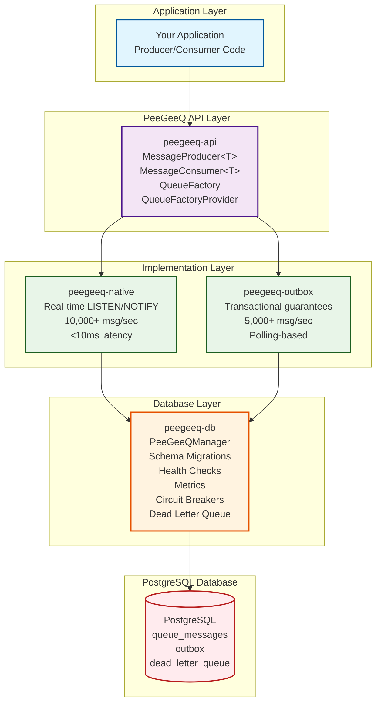

# PeeGeeQ Functional Guide

## Overview

PeeGeeQ provides two distinct messaging patterns to meet different enterprise requirements:

1. **Native Queue**: High-performance, real-time message processing
2. **Outbox Pattern**: Transactional messaging with database consistency guarantees

## Architecture Overview



## Getting Started

### Maven Dependencies

```xml
<dependencies>
    <!-- Core API -->
    <dependency>
        <groupId>dev.mars</groupId>
        <artifactId>peegeeq-api</artifactId>
        <version>1.0-SNAPSHOT</version>
    </dependency>

    <!-- Database Foundation -->
    <dependency>
        <groupId>dev.mars</groupId>
        <artifactId>peegeeq-db</artifactId>
        <version>1.0-SNAPSHOT</version>
    </dependency>

    <!-- Native Queue Implementation -->
    <dependency>
        <groupId>dev.mars</groupId>
        <artifactId>peegeeq-native</artifactId>
        <version>1.0-SNAPSHOT</version>
    </dependency>

    <!-- Outbox Pattern Implementation -->
    <dependency>
        <groupId>dev.mars</groupId>
        <artifactId>peegeeq-outbox</artifactId>
        <version>1.0-SNAPSHOT</version>
    </dependency>
</dependencies>
```

### Basic Setup - Quick Start

The simplest way to get started with PeeGeeQ is using the unified factory pattern:

```java
import dev.mars.peegeeq.api.*;
import dev.mars.peegeeq.db.PeeGeeQManager;
import dev.mars.peegeeq.db.config.PeeGeeQConfiguration;
import dev.mars.peegeeq.db.provider.PgDatabaseService;
import dev.mars.peegeeq.db.provider.PgQueueFactoryProvider;
import io.micrometer.core.instrument.simple.SimpleMeterRegistry;

// Initialize PeeGeeQ Manager
PeeGeeQManager manager = new PeeGeeQManager("development");
manager.start();

// Create database service and factory provider
DatabaseService databaseService = new PgDatabaseService(manager);
QueueFactoryProvider provider = new PgQueueFactoryProvider();
```

### Native Queue - Basic Producer/Consumer Setup

```java
// Create native queue factory
QueueFactory nativeFactory = provider.createFactory("native", databaseService);

// Create producer
MessageProducer<String> producer = nativeFactory.createProducer("orders", String.class);

// Create consumer
MessageConsumer<String> consumer = nativeFactory.createConsumer("orders", String.class);

// Send a message
producer.send("Order #12345 created").join();

// Subscribe to messages
consumer.subscribe(message -> {
    System.out.println("Processing order: " + message.getPayload());
    // Message is automatically acknowledged on successful completion
    return CompletableFuture.completedFuture(null);
});

// Cleanup
consumer.close();
producer.close();
nativeFactory.close();
manager.close();
```

### Outbox Pattern - Basic Producer/Consumer Setup

```java
// Create outbox queue factory
QueueFactory outboxFactory = provider.createFactory("outbox", databaseService);

// Create producer and consumer
MessageProducer<String> producer = outboxFactory.createProducer("order-events", String.class);
MessageConsumer<String> consumer = outboxFactory.createConsumer("order-events", String.class);

// Send a message (will be stored in outbox table)
producer.send("Order event: ORDER_CREATED").join();

// Subscribe to messages (polls outbox table)
consumer.subscribe(message -> {
    System.out.println("Processing order event: " + message.getPayload());
    // Process the event
    return CompletableFuture.completedFuture(null);
});

// Cleanup
consumer.close();
producer.close();
outboxFactory.close();
manager.close();
```

## Native Queue Usage

The Native Queue implementation provides high-performance, real-time message processing using PostgreSQL's LISTEN/NOTIFY mechanism.

### Creating Producers and Consumers

**Recommended approach using unified factory pattern:**

```java
// Using the unified factory pattern (recommended)
DatabaseService databaseService = new PgDatabaseService(manager);
QueueFactoryProvider provider = new PgQueueFactoryProvider();
QueueFactory nativeFactory = provider.createFactory("native", databaseService);

// Create producer and consumer
MessageProducer<String> producer = nativeFactory.createProducer("orders", String.class);
MessageConsumer<String> consumer = nativeFactory.createConsumer("orders", String.class);
```

**Legacy approach (still supported):**

```java
// Legacy approach using direct factory instantiation
PgNativeQueueFactory nativeFactory = new PgNativeQueueFactory(
    manager.getClientFactory(),
    manager.getObjectMapper(),
    manager.getMetrics()
);

// Create producer and consumer
MessageProducer<String> producer = nativeFactory.createProducer("orders", String.class);
MessageConsumer<String> consumer = nativeFactory.createConsumer("orders", String.class);
```

### Sending Messages

```java
// Simple message
producer.send("Order #12345 created").join();

// Message with headers
Map<String, String> headers = Map.of(
    "source", "order-service",
    "version", "1.0"
);
producer.send("Order #12346 created", headers).join();

// Message with correlation ID
producer.send("Order #12347 created", headers, "correlation-123").join();

// Message with message group (for ordering)
producer.send("Order #12348 created", headers, "correlation-124", "customer-456").join();
```

### Consuming Messages

```java
// Subscribe to messages using MessageHandler
consumer.subscribe(message -> {
    String payload = message.getPayload();
    String messageId = message.getId();
    Map<String, String> headers = message.getHeaders();
    Instant createdAt = message.getCreatedAt();

    System.out.println("Processing order: " + payload);
    System.out.println("Message ID: " + messageId);
    System.out.println("Created at: " + createdAt);

    // Process the message
    return CompletableFuture.supplyAsync(() -> {
        try {
            processOrder(payload);
            System.out.println("Successfully processed order: " + payload);
            return null;
        } catch (Exception e) {
            System.err.println("Failed to process order: " + e.getMessage());
            throw new RuntimeException("Processing failed", e);
        }
    });
});

// Unsubscribe when done
consumer.unsubscribe();
consumer.close();
```

### Error Handling

```java
consumer.subscribe(message -> {
    return CompletableFuture.supplyAsync(() -> {
        try {
            // Process message
            processOrder(message.getPayload());
            return null;
        } catch (TemporaryException e) {
            // This will trigger a retry (up to max retries configured)
            System.err.println("Temporary failure, will retry: " + e.getMessage());
            throw new RuntimeException("Temporary failure", e);
        } catch (PermanentException e) {
            // This will eventually move to dead letter queue after max retries
            System.err.println("Permanent failure, will go to DLQ: " + e.getMessage());
            throw new RuntimeException("Permanent failure", e);
        }
    });
});
```

### Health Checks

```java
// Check if the factory is healthy
boolean isHealthy = nativeFactory.isHealthy();
System.out.println("Native queue factory health: " + (isHealthy ? "UP" : "DOWN"));
```

## Outbox Pattern Usage

The Outbox Pattern implementation provides transactional messaging guarantees by storing messages in the same database transaction as your business logic.

### Creating Outbox Components

**Recommended approach using unified factory pattern:**

```java
// Using the unified factory pattern (recommended)
DatabaseService databaseService = new PgDatabaseService(manager);
QueueFactoryProvider provider = new PgQueueFactoryProvider();
QueueFactory outboxFactory = provider.createFactory("outbox", databaseService);

// Create producer and consumer
MessageProducer<OrderEvent> producer = outboxFactory.createProducer("order-events", OrderEvent.class);
MessageConsumer<OrderEvent> consumer = outboxFactory.createConsumer("order-events", OrderEvent.class);
```

**Legacy approach (still supported):**

```java
// Legacy approach using direct factory instantiation
OutboxFactory outboxFactory = new OutboxFactory(
    manager.getClientFactory(),
    manager.getObjectMapper(),
    manager.getMetrics()
);

// Create producer and consumer
MessageProducer<OrderEvent> producer = outboxFactory.createProducer("order-events", OrderEvent.class);
MessageConsumer<OrderEvent> consumer = outboxFactory.createConsumer("order-events", OrderEvent.class);
```

### Transactional Message Publishing

```java
@Transactional
public void createOrder(Order order) {
    // Save order to database
    orderRepository.save(order);
    
    // Send event using outbox pattern (same transaction)
    OrderEvent event = new OrderEvent(order.getId(), "ORDER_CREATED", order.getCustomerId());
    producer.send(event).join();
    
    // Both operations succeed or fail together
}
```

### Processing Outbox Messages

```java
// Consumer automatically polls for messages (every 2 seconds by default)
consumer.subscribe(message -> {
    OrderEvent event = message.getPayload();
    String messageId = message.getId();
    Map<String, String> headers = message.getHeaders();

    System.out.println("Processing order event: " + event.getOrderId());

    // Process the event
    return CompletableFuture.supplyAsync(() -> {
        try {
            processOrderEvent(event);
            System.out.println("Successfully processed order event: " + event.getOrderId());
            return null;
        } catch (Exception e) {
            System.err.println("Failed to process order event: " + e.getMessage());
            throw new RuntimeException("Processing failed", e);
        }
    });
});
```

### Health Checks

```java
// Check if the factory is healthy
boolean isHealthy = outboxFactory.isHealthy();
System.out.println("Outbox factory health: " + (isHealthy ? "UP" : "DOWN"));
```

## Advanced Features

### Message Ordering

```java
// Messages with the same message group are processed in order
producer.send(event1, headers, correlationId, "customer-123");
producer.send(event2, headers, correlationId, "customer-123");
producer.send(event3, headers, correlationId, "customer-123");
// These will be processed sequentially for customer-123
```

### Dead Letter Queue Handling

```java
// Access dead letter queue manager
DeadLetterQueueManager dlqManager = manager.getDeadLetterQueueManager();

// Get statistics
var stats = dlqManager.getStatistics();
System.out.println("Total dead letters: " + stats.getTotalMessages());
System.out.println("Is empty: " + stats.isEmpty());

// Retrieve dead letter messages for a specific topic
List<DeadLetterMessage> deadLetters = dlqManager.getDeadLetterMessages("orders", 10, 0);

// Process dead letter messages
for (DeadLetterMessage deadLetter : deadLetters) {
    System.out.println("Dead letter ID: " + deadLetter.getId());
    System.out.println("Topic: " + deadLetter.getTopic());
    System.out.println("Failure reason: " + deadLetter.getFailureReason());
    System.out.println("Retry count: " + deadLetter.getRetryCount());

    // Reprocess message if appropriate
    if (canReprocess(deadLetter)) {
        boolean success = dlqManager.reprocessDeadLetterMessage(deadLetter.getId(), "Manual retry");
        System.out.println("Reprocess result: " + success);
    } else {
        // Delete message after manual review
        dlqManager.deleteDeadLetterMessage(deadLetter.getId(), "Manual review completed");
    }
}
```

### Metrics and Monitoring

```java
// Access metrics
PeeGeeQMetrics metrics = manager.getMetrics();

// Get metrics summary
PeeGeeQMetrics.MetricsSummary summary = metrics.getSummary();
System.out.println("Total messages sent: " + summary.getTotalMessagesSent());
System.out.println("Total messages received: " + summary.getTotalMessagesReceived());
System.out.println("Total messages processed: " + summary.getTotalMessagesProcessed());
System.out.println("Total messages failed: " + summary.getTotalMessagesFailed());

// Record custom metrics (if implementing custom producers/consumers)
metrics.recordMessageSent("orders");
metrics.recordMessageReceived("orders");
metrics.recordMessageProcessed("orders", Duration.ofMillis(150));
metrics.recordMessageFailed("orders", "processing-error");

// Get queue depths
long outboxDepth = metrics.getOutboxQueueDepth("orders");
long nativeDepth = metrics.getNativeQueueDepth("orders");
long deadLetterDepth = metrics.getDeadLetterQueueDepth("orders");

System.out.println("Outbox queue depth: " + outboxDepth);
System.out.println("Native queue depth: " + nativeDepth);
System.out.println("Dead letter queue depth: " + deadLetterDepth);
```

### Health Checks

```java
// Access health check manager
HealthCheckManager healthManager = manager.getHealthCheckManager();

// Get overall health status
OverallHealthStatus overallHealth = healthManager.getOverallHealth();
System.out.println("Overall health: " + overallHealth.getStatus());
System.out.println("Healthy components: " + overallHealth.getHealthyCount());
System.out.println("Degraded components: " + overallHealth.getDegradedCount());
System.out.println("Unhealthy components: " + overallHealth.getUnhealthyCount());

// Get individual component health details
overallHealth.getComponents().forEach((name, status) -> {
    System.out.println("Component: " + name + " -> " + status.getStatus());
    if (status.getMessage() != null) {
        System.out.println("  Message: " + status.getMessage());
    }
});

// Simple health check
boolean isHealthy = manager.isHealthy();
System.out.println("System is healthy: " + isHealthy);

// Get system status (includes health and other info)
PeeGeeQManager.SystemStatus systemStatus = manager.getSystemStatus();
System.out.println("System status: " + systemStatus);
```

## Complete Working Examples

### Example 1: Simple Native Queue Application

```java
import dev.mars.peegeeq.api.*;
import dev.mars.peegeeq.db.PeeGeeQManager;
import dev.mars.peegeeq.db.config.PeeGeeQConfiguration;
import dev.mars.peegeeq.db.provider.PgDatabaseService;
import dev.mars.peegeeq.db.provider.PgQueueFactoryProvider;
import io.micrometer.core.instrument.simple.SimpleMeterRegistry;

import java.util.Map;
import java.util.concurrent.CompletableFuture;
import java.util.concurrent.TimeUnit;

public class SimpleNativeQueueExample {

    public static void main(String[] args) throws Exception {
        // Initialize PeeGeeQ with development configuration
        try (PeeGeeQManager manager = new PeeGeeQManager("development", new SimpleMeterRegistry())) {
            manager.start();

            // Create database service and factory provider
            DatabaseService databaseService = new PgDatabaseService(manager);
            QueueFactoryProvider provider = new PgQueueFactoryProvider();

            // Create native queue factory
            try (QueueFactory factory = provider.createFactory("native", databaseService)) {

                // Create producer and consumer
                MessageProducer<String> producer = factory.createProducer("orders", String.class);
                MessageConsumer<String> consumer = factory.createConsumer("orders", String.class);

                // Subscribe to messages
                consumer.subscribe(message -> {
                    System.out.println("Received order: " + message.getPayload());
                    System.out.println("Message ID: " + message.getId());
                    System.out.println("Headers: " + message.getHeaders());

                    // Simulate processing
                    return CompletableFuture.supplyAsync(() -> {
                        try {
                            Thread.sleep(100); // Simulate work
                            System.out.println("Processed order: " + message.getPayload());
                            return null;
                        } catch (InterruptedException e) {
                            Thread.currentThread().interrupt();
                            throw new RuntimeException(e);
                        }
                    });
                });

                // Send some messages
                Map<String, String> headers = Map.of("source", "order-service", "version", "1.0");

                for (int i = 1; i <= 5; i++) {
                    String orderData = "Order #" + i;
                    producer.send(orderData, headers, "correlation-" + i, "customer-123").join();
                    System.out.println("Sent: " + orderData);
                }

                // Wait for processing
                Thread.sleep(2000);

                // Cleanup
                consumer.unsubscribe();
                consumer.close();
                producer.close();
            }
        }
    }
}
```

### Example 2: Outbox Pattern with Transaction

```java
import dev.mars.peegeeq.api.*;
import dev.mars.peegeeq.db.PeeGeeQManager;
import dev.mars.peegeeq.db.config.PeeGeeQConfiguration;
import dev.mars.peegeeq.db.provider.PgDatabaseService;
import dev.mars.peegeeq.db.provider.PgQueueFactoryProvider;
import io.micrometer.core.instrument.simple.SimpleMeterRegistry;

import java.util.Map;
import java.util.concurrent.CompletableFuture;

public class OutboxPatternExample {

    public static void main(String[] args) throws Exception {
        // Initialize PeeGeeQ with development configuration
        try (PeeGeeQManager manager = new PeeGeeQManager("development", new SimpleMeterRegistry())) {
            manager.start();

            // Create database service and factory provider
            DatabaseService databaseService = new PgDatabaseService(manager);
            QueueFactoryProvider provider = new PgQueueFactoryProvider();

            // Create outbox queue factory
            try (QueueFactory factory = provider.createFactory("outbox", databaseService)) {

                // Create producer and consumer
                MessageProducer<OrderEvent> producer = factory.createProducer("order-events", OrderEvent.class);
                MessageConsumer<OrderEvent> consumer = factory.createConsumer("order-events", OrderEvent.class);

                // Subscribe to events
                consumer.subscribe(message -> {
                    OrderEvent event = message.getPayload();
                    System.out.println("Processing order event: " + event.getEventType());
                    System.out.println("Order ID: " + event.getOrderId());
                    System.out.println("Customer ID: " + event.getCustomerId());

                    return CompletableFuture.supplyAsync(() -> {
                        // Simulate event processing
                        try {
                            Thread.sleep(200);
                            System.out.println("Successfully processed event: " + event.getEventType());
                            return null;
                        } catch (InterruptedException e) {
                            Thread.currentThread().interrupt();
                            throw new RuntimeException(e);
                        }
                    });
                });

                // Send events (these will be stored in outbox table)
                Map<String, String> headers = Map.of("event-source", "order-service");

                for (int i = 1; i <= 3; i++) {
                    OrderEvent event = new OrderEvent("order-" + i, "ORDER_CREATED", "customer-" + i);
                    producer.send(event, headers, "event-correlation-" + i).join();
                    System.out.println("Sent order event: " + event.getEventType());
                }

                // Wait for processing (outbox consumer polls every 2 seconds)
                Thread.sleep(5000);

                // Cleanup
                consumer.unsubscribe();
                consumer.close();
                producer.close();
            }
        }
    }

    // Simple event class
    public static class OrderEvent {
        private String orderId;
        private String eventType;
        private String customerId;

        public OrderEvent() {} // Required for JSON deserialization

        public OrderEvent(String orderId, String eventType, String customerId) {
            this.orderId = orderId;
            this.eventType = eventType;
            this.customerId = customerId;
        }

        // Getters and setters
        public String getOrderId() { return orderId; }
        public void setOrderId(String orderId) { this.orderId = orderId; }

        public String getEventType() { return eventType; }
        public void setEventType(String eventType) { this.eventType = eventType; }

        public String getCustomerId() { return customerId; }
        public void setCustomerId(String customerId) { this.customerId = customerId; }
    }
}
```

## Configuration Examples

### Production Configuration

```properties
# Database Configuration
peegeeq.database.host=prod-postgres.company.com
peegeeq.database.port=5432
peegeeq.database.name=peegeeq_prod
peegeeq.database.username=peegeeq_user
peegeeq.database.password=${PEEGEEQ_DB_PASSWORD}
peegeeq.database.ssl.enabled=true

# Connection Pool
peegeeq.pool.minimum-idle=10
peegeeq.pool.maximum-pool-size=50
peegeeq.pool.connection-timeout=30000
peegeeq.pool.idle-timeout=600000
peegeeq.pool.max-lifetime=1800000

# Queue Settings
peegeeq.queue.visibility-timeout=PT30S
peegeeq.queue.max-retries=3
peegeeq.queue.dead-letter.enabled=true

# Metrics
peegeeq.metrics.enabled=true
peegeeq.metrics.collection-interval=PT1M

# Health Checks
peegeeq.health.enabled=true
peegeeq.health.check-interval=PT30S

# Circuit Breaker
peegeeq.circuit-breaker.enabled=true
peegeeq.circuit-breaker.failure-rate-threshold=50.0
peegeeq.circuit-breaker.wait-duration-in-open-state=PT60S
peegeeq.circuit-breaker.sliding-window-size=100
```

### Development Configuration

```properties
# Database Configuration
peegeeq.database.host=localhost
peegeeq.database.port=5432
peegeeq.database.name=peegeeq_dev
peegeeq.database.username=peegeeq
peegeeq.database.password=peegeeq
peegeeq.database.ssl.enabled=false

# Smaller connection pool for development
peegeeq.pool.minimum-idle=2
peegeeq.pool.maximum-pool-size=10

# Faster timeouts for development
peegeeq.queue.visibility-timeout=PT10S
peegeeq.queue.max-retries=2

# More frequent health checks for development
peegeeq.health.check-interval=PT10S
```

## Best Practices

### When to Use Native Queue
- High-throughput, low-latency requirements
- Real-time event processing
- Independent message processing
- When immediate delivery is important

### When to Use Outbox Pattern
- Transactional consistency requirements
- Integration with existing database transactions
- When message delivery must be guaranteed
- Complex business transactions

### Performance Optimization
- Use appropriate connection pool sizing
- Configure visibility timeout based on processing time
- Monitor queue depth and processing metrics
- Implement proper error handling and retry logic

### Error Handling
- Distinguish between temporary and permanent failures
- Configure appropriate retry limits
- Monitor dead letter queue regularly
- Implement alerting for failed messages

### Monitoring
- Track message throughput and latency
- Monitor queue depth and processing times
- Set up alerts for health check failures
- Monitor dead letter queue growth

## Troubleshooting

### Common Issues

1. **Messages not being processed**
   - Check consumer subscription status
   - Verify database connectivity
   - Check for lock timeouts

2. **High message latency**
   - Monitor connection pool utilization
   - Check database performance
   - Verify network connectivity

3. **Messages going to dead letter queue**
   - Review error logs for failure reasons
   - Check retry configuration
   - Verify message processing logic

4. **Memory issues**
   - Monitor heap usage
   - Check for message accumulation
   - Verify proper resource cleanup

### Debugging

```java
import ch.qos.logback.classic.Level;
import org.slf4j.Logger;
import org.slf4j.LoggerFactory;

// Enable debug logging
Logger logger = LoggerFactory.getLogger("dev.mars.peegeeq");
((ch.qos.logback.classic.Logger) logger).setLevel(Level.DEBUG);

// Check system health
OverallHealthStatus health = manager.getHealthCheckManager().getOverallHealth();
if (!"UP".equals(health.getStatus().toString())) {
    System.out.println("System health issues detected:");
    health.getComponents().forEach((name, status) -> {
        if (!"UP".equals(status.getStatus().toString())) {
            System.out.println("  " + name + ": " + status.getStatus() + " - " + status.getMessage());
        }
    });
}

// Monitor metrics
PeeGeeQMetrics metrics = manager.getMetrics();
PeeGeeQMetrics.MetricsSummary summary = metrics.getSummary();

System.out.println("=== System Metrics ===");
System.out.println("Total messages sent: " + summary.getTotalMessagesSent());
System.out.println("Total messages received: " + summary.getTotalMessagesReceived());
System.out.println("Total messages processed: " + summary.getTotalMessagesProcessed());
System.out.println("Total messages failed: " + summary.getTotalMessagesFailed());

// Check queue depths
System.out.println("Native queue depth (orders): " + metrics.getNativeQueueDepth("orders"));
System.out.println("Outbox queue depth (orders): " + metrics.getOutboxQueueDepth("orders"));
System.out.println("Dead letter queue depth (orders): " + metrics.getDeadLetterQueueDepth("orders"));

// Check system status
PeeGeeQManager.SystemStatus systemStatus = manager.getSystemStatus();
System.out.println("System status: " + systemStatus);

// Check individual factory health
QueueFactory factory = provider.createFactory("native", databaseService);
boolean factoryHealthy = factory.isHealthy();
System.out.println("Factory health: " + (factoryHealthy ? "UP" : "DOWN"));
```
