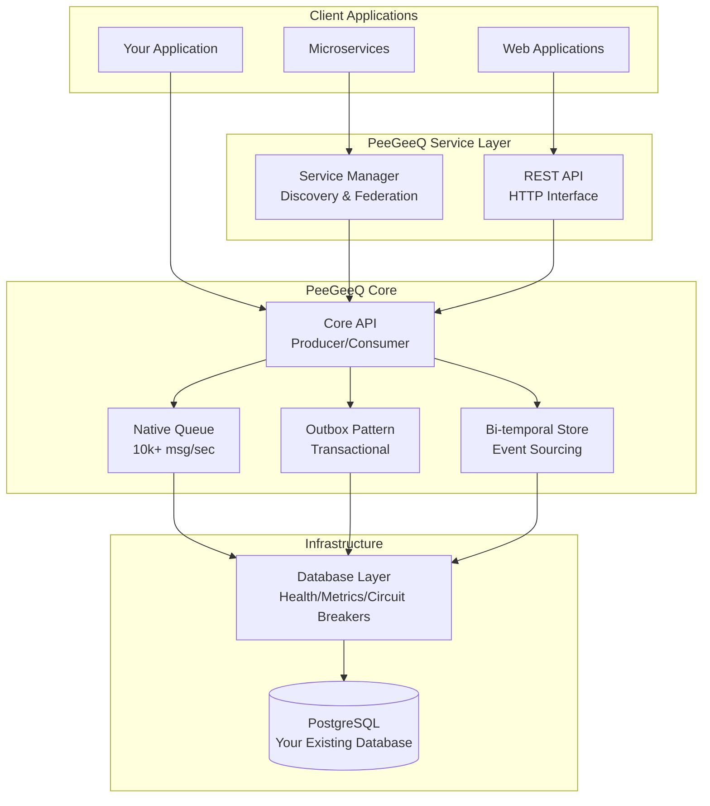

# PeeGeeQ Documentation
#### © Mark Andrew Ray-Smith Cityline Ltd 2025

Welcome to **PeeGeeQ** - a production-ready message queue system built on PostgreSQL that provides both high-performance real-time messaging and transactional messaging patterns.

## Quick Navigation

The PeeGeeQ documentation is organized into 6 comprehensive guides:

### 1. [PeeGeeQ Complete Guide](PeeGeeQ-Complete-Guide.md)
**Start here for getting up and running quickly**

- What is PeeGeeQ and why use it?
- 30-second demo and quick start
- Core concepts and messaging patterns
- Installation and basic configuration
- Simple usage examples
- Next steps guidance

**Perfect for**: New users, evaluation, getting started

---

### 2. [PeeGeeQ Architecture & API Reference](PeeGeeQ-Architecture-API-Reference.md)
**Deep dive into system design and complete API documentation**

- Complete system architecture with diagrams
- Module structure and relationships
- Full API reference with code examples
- Database schema documentation
- Design patterns and integration examples

**Perfect for**: Developers, architects, integration planning

---

### 3. [PeeGeeQ Advanced Features & Production](PeeGeeQ-Advanced-Features-Production.md)
**Enterprise features and production deployment**

- Advanced messaging patterns (high-frequency, routing, priority)
- Consumer groups and load balancing
- Service discovery and federation
- REST API and HTTP integration
- Bi-temporal event store
- Production readiness features
- Multi-environment configuration
- Performance optimization
- Production deployment guides

**Perfect for**: Production deployment, enterprise features, operations teams

---

### 4. [PeeGeeQ Development & Testing](PeeGeeQ-Development-Testing.md)
**Development workflow and testing strategies**

- Development environment setup
- Build system and Maven commands
- Comprehensive testing strategies
- Development workflow and Git practices
- Automation scripts
- Debugging and troubleshooting
- Code quality standards
- Contributing guidelines

**Perfect for**: Contributors, development teams, testing

---

### 5. [PeeGeeQ Examples Guide](PeeGeeQ-Examples-Guide.md)
**Comprehensive guide to all 17 examples covering 95-98% of functionality**

- Complete examples overview and coverage analysis
- Core examples (basic patterns and concepts)
- Advanced examples (priority, error handling, security, performance, integration)
- Specialized examples (streaming, configuration, comparisons)
- Running instructions and learning paths
- Example categories by complexity and use case

**Perfect for**: Learning PeeGeeQ features, implementation patterns, production best practices

---

### 6. [PeeGeeQ Implementation Notes](PeeGeeQ-Implementation-Notes.md)
**Historical context and reference information**

- Implementation history and development phases
- Integration test results and validation
- Comprehensive troubleshooting guide
- Performance benchmarks and tuning
- Migration notes between versions
- Known issues and limitations
- Future roadmap

**Perfect for**: Troubleshooting, performance tuning, understanding project history

---

## Quick Start Path

**New to PeeGeeQ?** Follow this path:

1. **[Complete Guide](PeeGeeQ-Complete-Guide.md)** - Start here to understand what PeeGeeQ is and run the 30-second demo
2. **[Examples Guide](PeeGeeQ-Examples-Guide.md)** - Explore 17 comprehensive examples covering all features
3. **[Architecture & API Reference](PeeGeeQ-Architecture-API-Reference.md)** - Understand the system design and API
4. **[Advanced Features & Production](PeeGeeQ-Advanced-Features-Production.md)** - Explore enterprise features and production deployment
5. **[Development & Testing](PeeGeeQ-Development-Testing.md)** - Set up development environment if contributing
6. **[Implementation Notes](PeeGeeQ-Implementation-Notes.md)** - Reference for troubleshooting and optimization

## Use Case Navigation

### For Evaluation
→ [PeeGeeQ Complete Guide](PeeGeeQ-Complete-Guide.md) - What is PeeGeeQ, quick demo, core concepts

### For Learning & Examples
→ [PeeGeeQ Examples Guide](PeeGeeQ-Examples-Guide.md) - 17 comprehensive examples covering all features

### For Development
→ [PeeGeeQ Architecture & API Reference](PeeGeeQ-Architecture-API-Reference.md) - System design, API documentation, integration patterns

### For Production Deployment
→ [PeeGeeQ Advanced Features & Production](PeeGeeQ-Advanced-Features-Production.md) - Enterprise features, monitoring, deployment

### For Contributing
→ [PeeGeeQ Development & Testing](PeeGeeQ-Development-Testing.md) - Development setup, testing, contribution guidelines

### For Troubleshooting
→ [PeeGeeQ Implementation Notes](PeeGeeQ-Implementation-Notes.md) - Troubleshooting guide, performance tuning, known issues

## Key Features

- **High Performance**: 10,000+ messages/second with <10ms latency (native queue)
- **Transactional**: ACID compliance with business data (outbox pattern)
- **Bi-temporal Event Store**: Event sourcing with temporal queries
- **Production Ready**: Health checks, metrics, circuit breakers, dead letter queues
- **Message Priority**: Priority-based message processing with configurable levels
- **Advanced Error Handling**: Retry strategies, circuit breakers, poison message detection
- **Security**: SSL/TLS encryption, certificate management, compliance features
- **Performance Optimization**: Connection pooling, batch processing, memory optimization
- **Integration Patterns**: Request-reply, pub-sub, message routing, distributed transactions
- **Service Discovery**: Consul integration for multi-instance deployments
- **REST API**: HTTP interface for all operations
- **Zero Dependencies**: Uses your existing PostgreSQL infrastructure

## Architecture Overview



## Getting Started in 30 Seconds

```bash
# Clone and run the self-contained demo
git clone <repository-url>
cd peegeeq

# Unix/Linux/macOS
./run-self-contained-demo.sh

# Windows
run-self-contained-demo.bat
```

This demo shows:
- Native queue with real-time processing
- Outbox pattern with transactional guarantees
- Bi-temporal event store with temporal queries
- All running in Docker with automatic cleanup

## Support and Community

- **Documentation**: Complete guides in this repository
- **Examples**: See `peegeeq-examples/` directory
- **Issues**: Report bugs and feature requests via GitHub issues
- **Contributing**: See [Development & Testing Guide](PeeGeeQ-Development-Testing.md)

## License

PeeGeeQ is licensed under the Apache License, Version 2.0. See the `LICENSE` file for details.

---

**Ready to get started?** Begin with the [PeeGeeQ Complete Guide](PeeGeeQ-Complete-Guide.md) or run the 30-second demo!
