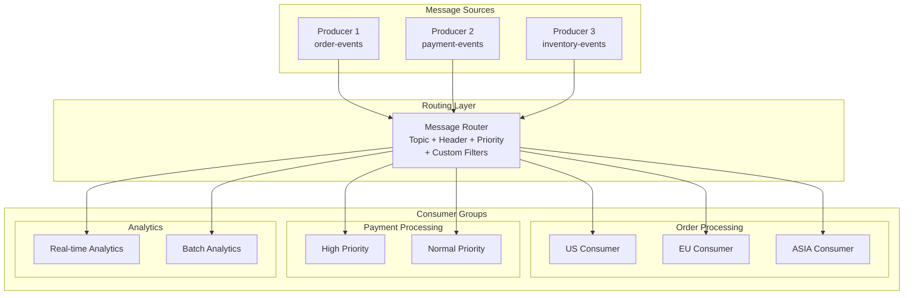

# PeeGeeQ Routing and Consumer Groups Guide
#### &copy; Mark Andrew Ray-Smith Cityline Ltd 2025

This comprehensive guide covers all routing mechanisms and consumer group patterns available in PeeGeeQ, from basic topic routing to advanced enterprise patterns.

## Table of Contents

1. [Routing Overview](#routing-overview)
2. [Topic-Based Routing](#topic-based-routing)
3. [Header-Based Routing](#header-based-routing)
4. [Priority-Based Routing](#priority-based-routing)
5. [Consumer Groups](#consumer-groups)
6. [Advanced Routing Patterns](#advanced-routing-patterns)
7. [Configuration-Based Routing](#configuration-based-routing)
8. [Performance Considerations](#performance-considerations)

## Routing Overview

PeeGeeQ provides a flexible routing system that supports multiple routing strategies:



## Topic-Based Routing

The fundamental routing mechanism where messages are published to specific topics.

### Basic Topic Routing

```java
import dev.mars.peegeeq.api.*;
import dev.mars.peegeeq.db.PeeGeeQManager;
import dev.mars.peegeeq.db.provider.PgDatabaseService;
import dev.mars.peegeeq.db.provider.PgQueueFactoryProvider;

public class TopicRoutingExample {
    
    public static void main(String[] args) throws Exception {
        try (PeeGeeQManager manager = new PeeGeeQManager("development")) {
            manager.start();
            
            DatabaseService databaseService = new PgDatabaseService(manager);
            QueueFactoryProvider provider = new PgQueueFactoryProvider();
            QueueFactory factory = provider.createNativeQueueFactory(databaseService);
            
            // Create producers for different topics
            MessageProducer<String> orderProducer = factory.createProducer("order-events", String.class);
            MessageProducer<String> paymentProducer = factory.createProducer("payment-events", String.class);
            MessageProducer<String> inventoryProducer = factory.createProducer("inventory-events", String.class);
            
            // Create topic-specific consumers
            MessageConsumer<String> orderConsumer = factory.createConsumer("order-events", String.class);
            MessageConsumer<String> paymentConsumer = factory.createConsumer("payment-events", String.class);
            
            // Subscribe to specific topics
            orderConsumer.subscribe(message -> {
                System.out.println("Order Event: " + message.getPayload());
                return CompletableFuture.completedFuture(null);
            });
            
            paymentConsumer.subscribe(message -> {
                System.out.println("Payment Event: " + message.getPayload());
                return CompletableFuture.completedFuture(null);
            });
            
            // Send messages to different topics
            orderProducer.send("Order #12345 created");
            paymentProducer.send("Payment #67890 processed");
            inventoryProducer.send("Inventory updated for SKU-ABC");
        }
    }
}
```

### Wildcard Topic Patterns

```java
// Wildcard topic routing (when integrated with MiniQ)
public class WildcardTopicExample {
    
    public void demonstrateWildcardRouting() {
        // Topic patterns
        queue.getByRoutingPattern("orders.*");          // All order topics
        queue.getByRoutingPattern("*.created");         // All creation events
        queue.getByRoutingPattern("orders.*.urgent");   // Urgent order events
        queue.getByRoutingPattern("payment.*.failed");  // Failed payment events
        
        // Examples of matching topics:
        // "orders.created" matches "orders.*"
        // "user.created" matches "*.created"
        // "orders.premium.urgent" matches "orders.*.urgent"
    }
}
```

## Header-Based Routing

Route messages based on header key-value pairs for flexible message filtering.

### Single Header Filtering

```java
import dev.mars.peegeeq.api.MessageFilter;

public class HeaderRoutingExample {
    
    public void demonstrateSingleHeaderFiltering(QueueFactory factory) throws Exception {
        ConsumerGroup<OrderEvent> orderGroup = factory.createConsumerGroup(
            "OrderProcessing", "order-events", OrderEvent.class);
        
        // Filter by single header values
        orderGroup.addConsumer("us-consumer", 
            createOrderHandler("US"),
            MessageFilter.byHeader("region", "US"));
            
        orderGroup.addConsumer("eu-consumer",
            createOrderHandler("EU"), 
            MessageFilter.byHeader("region", "EU"));
            
        orderGroup.addConsumer("premium-consumer",
            createOrderHandler("PREMIUM"),
            MessageFilter.byHeader("customer-tier", "PREMIUM"));
            
        orderGroup.addConsumer("urgent-consumer",
            createOrderHandler("URGENT"),
            MessageFilter.byHeader("priority", "HIGH"));
    }
    
    private MessageHandler<OrderEvent> createOrderHandler(String handlerName) {
        return message -> {
            OrderEvent event = message.getPayload();
            Map<String, String> headers = message.getHeaders();
            
            System.out.printf("[%s] Processing order %s with headers: %s%n", 
                handlerName, event.getOrderId(), headers);
                
            return CompletableFuture.completedFuture(null);
        };
    }
}
```

### Multiple Header Values (Set-based)

```java
public class MultiValueHeaderRouting {
    
    public void demonstrateSetBasedFiltering(QueueFactory factory) throws Exception {
        ConsumerGroup<OrderEvent> orderGroup = factory.createConsumerGroup(
            "RegionalProcessing", "order-events", OrderEvent.class);
        
        // Filter by header value in a set of allowed values
        orderGroup.addConsumer("north-america-consumer",
            createRegionalHandler("North America"),
            MessageFilter.byHeaderIn("region", Set.of("US", "CA", "MX")));
            
        orderGroup.addConsumer("europe-consumer", 
            createRegionalHandler("Europe"),
            MessageFilter.byHeaderIn("region", Set.of("UK", "DE", "FR", "IT", "ES")));
            
        orderGroup.addConsumer("asia-pacific-consumer",
            createRegionalHandler("Asia Pacific"), 
            MessageFilter.byHeaderIn("region", Set.of("JP", "CN", "KR", "AU", "IN")));
            
        // Priority-based filtering with multiple values
        orderGroup.addConsumer("high-priority-consumer",
            createPriorityHandler("High Priority"),
            MessageFilter.byHeaderIn("priority", Set.of("CRITICAL", "HIGH", "URGENT")));
    }
    
    private MessageHandler<OrderEvent> createRegionalHandler(String region) {
        return message -> {
            System.out.printf("[%s] Processing regional order: %s%n", 
                region, message.getPayload().getOrderId());
            return CompletableFuture.completedFuture(null);
        };
    }
    
    private MessageHandler<OrderEvent> createPriorityHandler(String priorityLevel) {
        return message -> {
            System.out.printf("[%s] Processing priority order: %s%n", 
                priorityLevel, message.getPayload().getOrderId());
            return CompletableFuture.completedFuture(null);
        };
    }
}
```

### Multiple Headers (AND Logic)

```java
public class MultiHeaderRouting {
    
    public void demonstrateMultiHeaderFiltering(QueueFactory factory) throws Exception {
        ConsumerGroup<OrderEvent> orderGroup = factory.createConsumerGroup(
            "SpecializedProcessing", "order-events", OrderEvent.class);
        
        // All headers must match (AND logic)
        orderGroup.addConsumer("premium-us-consumer",
            createSpecializedHandler("Premium US"),
            MessageFilter.byHeaders(Map.of(
                "region", "US",
                "customer-tier", "PREMIUM",
                "priority", "HIGH"
            )));
            
        orderGroup.addConsumer("enterprise-eu-consumer",
            createSpecializedHandler("Enterprise EU"),
            MessageFilter.byHeaders(Map.of(
                "region", "EU", 
                "customer-tier", "ENTERPRISE",
                "service-level", "PLATINUM"
            )));
            
        orderGroup.addConsumer("bulk-processor",
            createSpecializedHandler("Bulk Processing"),
            MessageFilter.byHeaders(Map.of(
                "order-type", "BULK",
                "processing-mode", "BATCH",
                "priority", "NORMAL"
            )));
    }
    
    private MessageHandler<OrderEvent> createSpecializedHandler(String handlerType) {
        return message -> {
            OrderEvent event = message.getPayload();
            Map<String, String> headers = message.getHeaders();
            
            System.out.printf("[%s] Processing specialized order %s%n", 
                handlerType, event.getOrderId());
            System.out.printf("  Headers: %s%n", headers);
            System.out.printf("  Amount: $%.2f%n", event.getAmount());
            
            return CompletableFuture.completedFuture(null);
        };
    }
}
```

## Priority-Based Routing

Built-in support for hierarchical priority-based message routing.

### Priority Hierarchy

PeeGeeQ supports a three-tier priority system: **HIGH > NORMAL > LOW**

```java
public class PriorityRoutingExample {

    public void demonstratePriorityRouting(QueueFactory factory) throws Exception {
        ConsumerGroup<OrderEvent> priorityGroup = factory.createConsumerGroup(
            "PriorityProcessing", "order-events", OrderEvent.class);

        // Priority-based consumers with hierarchical filtering
        priorityGroup.addConsumer("critical-consumer",
            createPriorityHandler("CRITICAL", 50), // 50ms processing
            MessageFilter.byPriority("HIGH"));      // Only HIGH priority

        priorityGroup.addConsumer("normal-consumer",
            createPriorityHandler("NORMAL", 200),   // 200ms processing
            MessageFilter.byPriority("NORMAL"));    // HIGH and NORMAL priority

        priorityGroup.addConsumer("bulk-consumer",
            createPriorityHandler("BULK", 500),     // 500ms processing
            MessageFilter.byPriority("LOW"));       // All priorities
    }

    private MessageHandler<OrderEvent> createPriorityHandler(String handlerName, int processingTimeMs) {
        return message -> {
            return CompletableFuture.supplyAsync(() -> {
                try {
                    OrderEvent event = message.getPayload();
                    String priority = message.getHeaders().get("priority");

                    System.out.printf("[%s] Processing %s priority order %s%n",
                        handlerName, priority, event.getOrderId());

                    // Simulate processing time based on priority
                    Thread.sleep(processingTimeMs);

                    System.out.printf("[%s] Completed order %s in %dms%n",
                        handlerName, event.getOrderId(), processingTimeMs);

                    return null;
                } catch (InterruptedException e) {
                    Thread.currentThread().interrupt();
                    throw new RuntimeException(e);
                }
            });
        };
    }

    public void sendPriorityMessages(MessageProducer<OrderEvent> producer) {
        // Send messages with different priorities
        Map<String, String> highPriorityHeaders = Map.of(
            "priority", "HIGH",
            "customer-tier", "ENTERPRISE",
            "sla", "1-hour"
        );

        Map<String, String> normalPriorityHeaders = Map.of(
            "priority", "NORMAL",
            "customer-tier", "PREMIUM",
            "sla", "4-hours"
        );

        Map<String, String> lowPriorityHeaders = Map.of(
            "priority", "LOW",
            "customer-tier", "STANDARD",
            "sla", "24-hours"
        );

        // Send priority messages
        producer.send(new OrderEvent("ORD-001", "CREATED", 5000.0, "enterprise-customer"),
                     highPriorityHeaders);
        producer.send(new OrderEvent("ORD-002", "CREATED", 1000.0, "premium-customer"),
                     normalPriorityHeaders);
        producer.send(new OrderEvent("ORD-003", "CREATED", 100.0, "standard-customer"),
                     lowPriorityHeaders);
    }
}
```

### Region-Based Routing

Specialized routing for geographical or logical regions.

```java
public class RegionRoutingExample {

    public void demonstrateRegionRouting(QueueFactory factory) throws Exception {
        ConsumerGroup<OrderEvent> regionGroup = factory.createConsumerGroup(
            "RegionProcessing", "order-events", OrderEvent.class);

        // Single region consumers
        regionGroup.addConsumer("us-consumer",
            createRegionHandler("United States", "USD"),
            MessageFilter.byRegion(Set.of("US")));

        regionGroup.addConsumer("eu-consumer",
            createRegionHandler("European Union", "EUR"),
            MessageFilter.byRegion(Set.of("EU")));

        regionGroup.addConsumer("asia-consumer",
            createRegionHandler("Asia Pacific", "JPY"),
            MessageFilter.byRegion(Set.of("ASIA")));

        // Multi-region consumers
        regionGroup.addConsumer("americas-consumer",
            createRegionHandler("Americas", "USD"),
            MessageFilter.byRegion(Set.of("US", "CA", "MX", "BR")));

        regionGroup.addConsumer("emea-consumer",
            createRegionHandler("EMEA", "EUR"),
            MessageFilter.byRegion(Set.of("EU", "UK", "ZA", "AE")));
    }

    private MessageHandler<OrderEvent> createRegionHandler(String regionName, String currency) {
        return message -> {
            OrderEvent event = message.getPayload();
            String region = message.getHeaders().get("region");

            System.out.printf("[%s] Processing order %s in region %s%n",
                regionName, event.getOrderId(), region);
            System.out.printf("  Amount: %.2f %s%n", event.getAmount(), currency);

            // Region-specific processing logic
            processRegionalCompliance(event, region);
            calculateRegionalTaxes(event, region, currency);

            return CompletableFuture.completedFuture(null);
        };
    }

    private void processRegionalCompliance(OrderEvent event, String region) {
        switch (region) {
            case "EU" -> System.out.println("  Applying GDPR compliance checks");
            case "US" -> System.out.println("  Applying SOX compliance checks");
            case "ASIA" -> System.out.println("  Applying regional data residency rules");
            default -> System.out.println("  Applying standard compliance checks");
        }
    }

    private void calculateRegionalTaxes(OrderEvent event, String region, String currency) {
        double taxRate = switch (region) {
            case "EU" -> 0.20;    // 20% VAT
            case "US" -> 0.08;    // 8% Sales Tax
            case "ASIA" -> 0.10;  // 10% GST
            default -> 0.05;      // 5% Default
        };

        double tax = event.getAmount() * taxRate;
        System.out.printf("  Tax: %.2f %s (%.1f%%)%n", tax, currency, taxRate * 100);
    }
}
```

## Consumer Groups

Consumer groups provide load balancing and fault tolerance by distributing messages among multiple consumer instances.

### Basic Consumer Group Setup

```java
public class ConsumerGroupExample {

    public void demonstrateBasicConsumerGroup(QueueFactory factory) throws Exception {
        // Create consumer group for order processing
        ConsumerGroup<OrderEvent> orderGroup = factory.createConsumerGroup(
            "OrderProcessing", "order-events", OrderEvent.class);

        // Add multiple consumers to the group
        orderGroup.addConsumer("consumer-1",
            createLoadBalancedHandler("Consumer-1"),
            message -> true); // Accept all messages

        orderGroup.addConsumer("consumer-2",
            createLoadBalancedHandler("Consumer-2"),
            message -> true);

        orderGroup.addConsumer("consumer-3",
            createLoadBalancedHandler("Consumer-3"),
            message -> true);

        // Start the consumer group
        orderGroup.start();

        System.out.printf("Started consumer group with %d active consumers%n",
            orderGroup.getActiveConsumerCount());

        // Monitor group statistics
        monitorConsumerGroup(orderGroup);
    }

    private MessageHandler<OrderEvent> createLoadBalancedHandler(String consumerId) {
        AtomicLong processedCount = new AtomicLong(0);

        return message -> {
            return CompletableFuture.supplyAsync(() -> {
                try {
                    OrderEvent event = message.getPayload();
                    long count = processedCount.incrementAndGet();

                    System.out.printf("[%s] Processing order %s (total: %d)%n",
                        consumerId, event.getOrderId(), count);

                    // Simulate processing time
                    Thread.sleep(100 + (int)(Math.random() * 200));

                    return null;
                } catch (InterruptedException e) {
                    Thread.currentThread().interrupt();
                    throw new RuntimeException(e);
                }
            });
        };
    }

    private void monitorConsumerGroup(ConsumerGroup<OrderEvent> group) {
        ScheduledExecutorService monitor = Executors.newSingleThreadScheduledExecutor();

        monitor.scheduleAtFixedRate(() -> {
            System.out.printf("Consumer Group Stats - Active: %d, Total Processed: %d, Failed: %d%n",
                group.getActiveConsumerCount(),
                group.getTotalMessagesProcessed(),
                group.getTotalMessagesFailed());
        }, 5, 5, TimeUnit.SECONDS);
    }
}
```

### Specialized Consumer Groups

```java
public class SpecializedConsumerGroups {

    public void createSpecializedGroups(QueueFactory factory) throws Exception {
        // Order Processing Group - Region-based specialization
        createOrderProcessingGroup(factory);

        // Payment Processing Group - Priority-based specialization
        createPaymentProcessingGroup(factory);

        // Analytics Group - Content-based specialization
        createAnalyticsGroup(factory);

        // Audit Group - Comprehensive logging
        createAuditGroup(factory);
    }

    private void createOrderProcessingGroup(QueueFactory factory) throws Exception {
        ConsumerGroup<OrderEvent> orderGroup = factory.createConsumerGroup(
            "OrderProcessing", "order-events", OrderEvent.class);

        // Region-specific order processors
        orderGroup.addConsumer("us-order-processor",
            createOrderProcessor("US", "USD"),
            MessageFilter.byRegion(Set.of("US")));

        orderGroup.addConsumer("eu-order-processor",
            createOrderProcessor("EU", "EUR"),
            MessageFilter.byRegion(Set.of("EU")));

        orderGroup.addConsumer("asia-order-processor",
            createOrderProcessor("ASIA", "JPY"),
            MessageFilter.byRegion(Set.of("ASIA")));

        orderGroup.start();
    }

    private void createPaymentProcessingGroup(QueueFactory factory) throws Exception {
        ConsumerGroup<PaymentEvent> paymentGroup = factory.createConsumerGroup(
            "PaymentProcessing", "payment-events", PaymentEvent.class);

        // Priority-based payment processors
        paymentGroup.addConsumer("high-priority-payment",
            createPaymentProcessor("HIGH-PRIORITY", 100),
            MessageFilter.byPriority("HIGH"));

        paymentGroup.addConsumer("normal-payment",
            createPaymentProcessor("NORMAL", 300),
            MessageFilter.byPriority("NORMAL"));

        paymentGroup.addConsumer("batch-payment",
            createPaymentProcessor("BATCH", 1000),
            MessageFilter.byPriority("LOW"));

        paymentGroup.start();
    }

    private void createAnalyticsGroup(QueueFactory factory) throws Exception {
        ConsumerGroup<OrderEvent> analyticsGroup = factory.createConsumerGroup(
            "Analytics", "order-events", OrderEvent.class);

        // Content-based analytics processors
        analyticsGroup.addConsumer("high-value-analytics",
            createAnalyticsProcessor("HIGH-VALUE"),
            message -> message.getPayload().getAmount() > 1000.0);

        analyticsGroup.addConsumer("premium-customer-analytics",
            createAnalyticsProcessor("PREMIUM-CUSTOMER"),
            MessageFilter.byHeader("customer-tier", "PREMIUM"));

        analyticsGroup.addConsumer("real-time-analytics",
            createAnalyticsProcessor("REAL-TIME"),
            MessageFilter.byHeader("processing-mode", "REAL-TIME"));

        analyticsGroup.start();
    }

    private void createAuditGroup(QueueFactory factory) throws Exception {
        ConsumerGroup<OrderEvent> auditGroup = factory.createConsumerGroup(
            "Audit", "order-events", OrderEvent.class);

        // Comprehensive audit logging - accepts all messages
        auditGroup.addConsumer("primary-auditor",
            createAuditProcessor("PRIMARY"),
            message -> true);

        auditGroup.addConsumer("backup-auditor",
            createAuditProcessor("BACKUP"),
            message -> true);

        auditGroup.start();
    }

    private MessageHandler<OrderEvent> createOrderProcessor(String region, String currency) {
        return message -> {
            OrderEvent event = message.getPayload();
            System.out.printf("[%s-ORDER] Processing order %s - Amount: %.2f %s%n",
                region, event.getOrderId(), event.getAmount(), currency);
            return CompletableFuture.completedFuture(null);
        };
    }

    private MessageHandler<PaymentEvent> createPaymentProcessor(String priority, int processingTimeMs) {
        return message -> {
            return CompletableFuture.supplyAsync(() -> {
                try {
                    PaymentEvent event = message.getPayload();
                    System.out.printf("[%s-PAYMENT] Processing payment %s%n",
                        priority, event.getPaymentId());
                    Thread.sleep(processingTimeMs);
                    return null;
                } catch (InterruptedException e) {
                    Thread.currentThread().interrupt();
                    throw new RuntimeException(e);
                }
            });
        };
    }

    private MessageHandler<OrderEvent> createAnalyticsProcessor(String analyticsType) {
        return message -> {
            OrderEvent event = message.getPayload();
            Map<String, String> headers = message.getHeaders();

            System.out.printf("[%s-ANALYTICS] Analyzing order %s%n",
                analyticsType, event.getOrderId());
            System.out.printf("  Customer: %s, Amount: %.2f, Region: %s%n",
                event.getCustomerId(), event.getAmount(), headers.get("region"));

            return CompletableFuture.completedFuture(null);
        };
    }

    private MessageHandler<OrderEvent> createAuditProcessor(String auditorType) {
        return message -> {
            OrderEvent event = message.getPayload();
            Map<String, String> headers = message.getHeaders();

            System.out.printf("[%s-AUDIT] Logging order %s - Headers: %s%n",
                auditorType, event.getOrderId(), headers);

            return CompletableFuture.completedFuture(null);
        };
    }
}
```

## Advanced Routing Patterns

### Composite Routing (AND/OR/NOT Logic)

```java
public class CompositeRoutingExample {

    public void demonstrateCompositeRouting(QueueFactory factory) throws Exception {
        ConsumerGroup<OrderEvent> compositeGroup = factory.createConsumerGroup(
            "CompositeRouting", "order-events", OrderEvent.class);

        // AND logic - all conditions must be true
        compositeGroup.addConsumer("premium-us-high-value",
            createCompositeHandler("PREMIUM-US-HIGH-VALUE"),
            MessageFilter.and(
                MessageFilter.byRegion(Set.of("US")),
                MessageFilter.byHeader("customer-tier", "PREMIUM"),
                message -> message.getPayload().getAmount() > 5000.0
            ));

        // OR logic - any condition can be true
        compositeGroup.addConsumer("urgent-or-high-value",
            createCompositeHandler("URGENT-OR-HIGH-VALUE"),
            MessageFilter.or(
                MessageFilter.byHeader("urgent", "true"),
                MessageFilter.byPriority("HIGH"),
                message -> message.getPayload().getAmount() > 10000.0
            ));

        // NOT logic - inverse condition
        compositeGroup.addConsumer("non-asia-processor",
            createCompositeHandler("NON-ASIA"),
            MessageFilter.not(MessageFilter.byRegion(Set.of("ASIA"))));

        // Complex composite logic
        compositeGroup.addConsumer("complex-filter",
            createCompositeHandler("COMPLEX"),
            MessageFilter.and(
                MessageFilter.or(
                    MessageFilter.byRegion(Set.of("US", "EU")),
                    MessageFilter.byHeader("customer-tier", "ENTERPRISE")
                ),
                MessageFilter.not(MessageFilter.byHeader("test-mode", "true")),
                MessageFilter.byPriority("NORMAL")
            ));

        compositeGroup.start();
    }

    private MessageHandler<OrderEvent> createCompositeHandler(String handlerName) {
        return message -> {
            OrderEvent event = message.getPayload();
            Map<String, String> headers = message.getHeaders();

            System.out.printf("[%s] Processing order %s%n", handlerName, event.getOrderId());
            System.out.printf("  Amount: %.2f, Customer: %s%n",
                event.getAmount(), event.getCustomerId());
            System.out.printf("  Headers: %s%n", headers);

            return CompletableFuture.completedFuture(null);
        };
    }
}
```

### Custom Predicate Routing

```java
public class CustomPredicateRouting {

    public void demonstrateCustomPredicates(QueueFactory factory) throws Exception {
        ConsumerGroup<OrderEvent> customGroup = factory.createConsumerGroup(
            "CustomRouting", "order-events", OrderEvent.class);

        // Business hours filter
        customGroup.addConsumer("business-hours-processor",
            createCustomHandler("BUSINESS-HOURS"),
            createBusinessHoursFilter());

        // High-value customer filter
        customGroup.addConsumer("vip-processor",
            createCustomHandler("VIP"),
            createVipCustomerFilter());

        // Fraud detection filter
        customGroup.addConsumer("fraud-detector",
            createCustomHandler("FRAUD-DETECTION"),
            createFraudDetectionFilter());

        // Geographic proximity filter
        customGroup.addConsumer("local-processor",
            createCustomHandler("LOCAL"),
            createGeographicProximityFilter("US-WEST"));

        customGroup.start();
    }

    private Predicate<Message<OrderEvent>> createBusinessHoursFilter() {
        return message -> {
            LocalTime now = LocalTime.now();
            LocalTime businessStart = LocalTime.of(9, 0);
            LocalTime businessEnd = LocalTime.of(17, 0);

            return now.isAfter(businessStart) && now.isBefore(businessEnd);
        };
    }

    private Predicate<Message<OrderEvent>> createVipCustomerFilter() {
        Set<String> vipCustomers = Set.of("customer-001", "customer-007", "customer-042");

        return message -> {
            OrderEvent event = message.getPayload();
            return vipCustomers.contains(event.getCustomerId()) ||
                   event.getAmount() > 50000.0;
        };
    }

    private Predicate<Message<OrderEvent>> createFraudDetectionFilter() {
        return message -> {
            OrderEvent event = message.getPayload();
            Map<String, String> headers = message.getHeaders();

            // Suspicious patterns
            boolean highAmount = event.getAmount() > 25000.0;
            boolean newCustomer = "true".equals(headers.get("new-customer"));
            boolean foreignCard = "true".equals(headers.get("foreign-card"));
            boolean nightTime = LocalTime.now().getHour() < 6 || LocalTime.now().getHour() > 22;

            return highAmount && (newCustomer || foreignCard || nightTime);
        };
    }

    private Predicate<Message<OrderEvent>> createGeographicProximityFilter(String region) {
        Map<String, Set<String>> proximityMap = Map.of(
            "US-WEST", Set.of("CA", "OR", "WA", "NV"),
            "US-EAST", Set.of("NY", "MA", "FL", "VA"),
            "EU-NORTH", Set.of("SE", "NO", "DK", "FI"),
            "EU-SOUTH", Set.of("IT", "ES", "GR", "PT")
        );

        return message -> {
            String messageRegion = message.getHeaders().get("state");
            Set<String> allowedStates = proximityMap.get(region);
            return allowedStates != null && allowedStates.contains(messageRegion);
        };
    }

    private MessageHandler<OrderEvent> createCustomHandler(String handlerName) {
        return message -> {
            OrderEvent event = message.getPayload();
            System.out.printf("[%s] Custom processing for order %s%n",
                handlerName, event.getOrderId());
            return CompletableFuture.completedFuture(null);
        };
    }
}
```

### Message Group and Correlation Routing

```java
public class MessageGroupRouting {

    public void demonstrateMessageGroupRouting(MessageProducer<OrderEvent> producer) {
        // Send related messages with same message group for ordering
        Map<String, String> headers = Map.of(
            "region", "US",
            "customer-tier", "PREMIUM"
        );

        String customerId = "customer-123";
        String correlationId = "order-session-" + System.currentTimeMillis();

        // These messages will be processed in order for this customer
        producer.send(
            new OrderEvent("ORD-001", "CREATED", 1000.0, customerId),
            headers, correlationId, customerId);

        producer.send(
            new OrderEvent("ORD-001", "VALIDATED", 1000.0, customerId),
            headers, correlationId, customerId);

        producer.send(
            new OrderEvent("ORD-001", "PAYMENT_PROCESSED", 1000.0, customerId),
            headers, correlationId, customerId);

        producer.send(
            new OrderEvent("ORD-001", "SHIPPED", 1000.0, customerId),
            headers, correlationId, customerId);
    }

    public void createCorrelationAwareConsumer(QueueFactory factory) throws Exception {
        ConsumerGroup<OrderEvent> correlationGroup = factory.createConsumerGroup(
            "CorrelationAware", "order-events", OrderEvent.class);

        correlationGroup.addConsumer("correlation-processor",
            createCorrelationHandler(),
            message -> true);

        correlationGroup.start();
    }

    private MessageHandler<OrderEvent> createCorrelationHandler() {
        Map<String, List<OrderEvent>> correlationGroups = new ConcurrentHashMap<>();

        return message -> {
            OrderEvent event = message.getPayload();
            String correlationId = message.getHeaders().get("correlation-id");

            if (correlationId != null) {
                correlationGroups.computeIfAbsent(correlationId, k -> new ArrayList<>())
                    .add(event);

                System.out.printf("Added order %s to correlation group %s%n",
                    event.getOrderId(), correlationId);

                // Process when we have a complete order lifecycle
                List<OrderEvent> group = correlationGroups.get(correlationId);
                if (isCompleteOrderLifecycle(group)) {
                    processCompleteOrderLifecycle(correlationId, group);
                    correlationGroups.remove(correlationId);
                }
            }

            return CompletableFuture.completedFuture(null);
        };
    }

    private boolean isCompleteOrderLifecycle(List<OrderEvent> events) {
        Set<String> statuses = events.stream()
            .map(OrderEvent::getStatus)
            .collect(Collectors.toSet());

        return statuses.containsAll(Set.of("CREATED", "VALIDATED", "PAYMENT_PROCESSED", "SHIPPED"));
    }

    private void processCompleteOrderLifecycle(String correlationId, List<OrderEvent> events) {
        System.out.printf("Processing complete order lifecycle for correlation %s%n", correlationId);
        events.forEach(event ->
            System.out.printf("  %s: %s%n", event.getStatus(), event.getOrderId()));
    }
}
```

## Configuration-Based Routing

### Properties-Based Routing Rules

```properties
# peegeeq-routing.properties

# Header-based routing rules
peegeeq.routing.rules.region.US=order-processing-us
peegeeq.routing.rules.region.EU=order-processing-eu
peegeeq.routing.rules.region.ASIA=order-processing-asia

peegeeq.routing.rules.priority.HIGH=payment-processing-priority
peegeeq.routing.rules.priority.NORMAL=payment-processing-standard
peegeeq.routing.rules.priority.LOW=payment-processing-bulk

peegeeq.routing.rules.customer-tier.ENTERPRISE=enterprise-processing
peegeeq.routing.rules.customer-tier.PREMIUM=premium-processing
peegeeq.routing.rules.customer-tier.STANDARD=standard-processing

# Topic mapping for different message types
peegeeq.routing.topics.order-events=order-processing,analytics,audit
peegeeq.routing.topics.payment-events=payment-processing,analytics,audit
peegeeq.routing.topics.inventory-events=inventory-processing,analytics
peegeeq.routing.topics.user-events=user-processing,analytics

# Consumer group configurations
peegeeq.consumer.groups.order-processing.max-consumers=5
peegeeq.consumer.groups.payment-processing.max-consumers=3
peegeeq.consumer.groups.analytics.max-consumers=2
peegeeq.consumer.groups.audit.max-consumers=1

# Load balancing strategies
peegeeq.consumer.distribution.strategy=ROUND_ROBIN
peegeeq.consumer.sticky-sessions.enabled=true
peegeeq.consumer.failover.enabled=true
```

### Configuration-Driven Routing Implementation

```java
public class ConfigurationBasedRouting {

    private final Properties routingConfig;

    public ConfigurationBasedRouting(String configFile) throws IOException {
        this.routingConfig = new Properties();
        try (InputStream input = getClass().getClassLoader().getResourceAsStream(configFile)) {
            routingConfig.load(input);
        }
    }

    public void setupConfigurationBasedRouting(QueueFactory factory) throws Exception {
        // Create consumer groups based on configuration
        createConfiguredConsumerGroups(factory);

        // Setup routing rules based on configuration
        setupRoutingRules(factory);
    }

    private void createConfiguredConsumerGroups(QueueFactory factory) throws Exception {
        // Get all configured consumer groups
        Set<String> groupNames = routingConfig.stringPropertyNames().stream()
            .filter(key -> key.startsWith("peegeeq.consumer.groups."))
            .map(key -> key.split("\\.")[3])
            .collect(Collectors.toSet());

        for (String groupName : groupNames) {
            int maxConsumers = Integer.parseInt(
                routingConfig.getProperty("peegeeq.consumer.groups." + groupName + ".max-consumers", "1"));

            ConsumerGroup<OrderEvent> group = factory.createConsumerGroup(
                groupName, "order-events", OrderEvent.class);

            // Create configured number of consumers
            for (int i = 1; i <= maxConsumers; i++) {
                String consumerId = groupName + "-consumer-" + i;
                group.addConsumer(consumerId,
                    createConfiguredHandler(groupName, consumerId),
                    createConfiguredFilter(groupName));
            }

            group.start();
            System.out.printf("Started consumer group '%s' with %d consumers%n",
                groupName, maxConsumers);
        }
    }

    private void setupRoutingRules(QueueFactory factory) {
        // Setup region-based routing
        setupRegionRouting(factory);

        // Setup priority-based routing
        setupPriorityRouting(factory);

        // Setup customer-tier routing
        setupCustomerTierRouting(factory);
    }

    private void setupRegionRouting(QueueFactory factory) {
        routingConfig.stringPropertyNames().stream()
            .filter(key -> key.startsWith("peegeeq.routing.rules.region."))
            .forEach(key -> {
                String region = key.substring("peegeeq.routing.rules.region.".length());
                String targetGroup = routingConfig.getProperty(key);

                System.out.printf("Routing region '%s' to group '%s'%n", region, targetGroup);
                // Implementation would create appropriate filters and routing
            });
    }

    private void setupPriorityRouting(QueueFactory factory) {
        routingConfig.stringPropertyNames().stream()
            .filter(key -> key.startsWith("peegeeq.routing.rules.priority."))
            .forEach(key -> {
                String priority = key.substring("peegeeq.routing.rules.priority.".length());
                String targetGroup = routingConfig.getProperty(key);

                System.out.printf("Routing priority '%s' to group '%s'%n", priority, targetGroup);
                // Implementation would create appropriate filters and routing
            });
    }

    private void setupCustomerTierRouting(QueueFactory factory) {
        routingConfig.stringPropertyNames().stream()
            .filter(key -> key.startsWith("peegeeq.routing.rules.customer-tier."))
            .forEach(key -> {
                String tier = key.substring("peegeeq.routing.rules.customer-tier.".length());
                String targetGroup = routingConfig.getProperty(key);

                System.out.printf("Routing customer tier '%s' to group '%s'%n", tier, targetGroup);
                // Implementation would create appropriate filters and routing
            });
    }

    private MessageHandler<OrderEvent> createConfiguredHandler(String groupName, String consumerId) {
        return message -> {
            OrderEvent event = message.getPayload();
            System.out.printf("[%s-%s] Processing order %s%n",
                groupName.toUpperCase(), consumerId, event.getOrderId());
            return CompletableFuture.completedFuture(null);
        };
    }

    private Predicate<Message<OrderEvent>> createConfiguredFilter(String groupName) {
        return switch (groupName) {
            case "order-processing" -> message -> true; // Accept all orders
            case "payment-processing" -> MessageFilter.byHeader("requires-payment", "true");
            case "analytics" -> message -> true; // Analytics processes all
            case "audit" -> message -> true; // Audit logs all
            default -> message -> false;
        };
    }
}
```

## Performance Considerations

### Routing Performance Optimization

```java
public class RoutingPerformanceOptimization {

    // Pre-compiled filters for better performance
    private static final Map<String, Predicate<Message<OrderEvent>>> COMPILED_FILTERS = Map.of(
        "US_PREMIUM", MessageFilter.and(
            MessageFilter.byRegion(Set.of("US")),
            MessageFilter.byHeader("customer-tier", "PREMIUM")
        ),
        "HIGH_PRIORITY", MessageFilter.byPriority("HIGH"),
        "HIGH_VALUE", message -> message.getPayload().getAmount() > 10000.0
    );

    public void demonstratePerformanceOptimizations(QueueFactory factory) throws Exception {
        ConsumerGroup<OrderEvent> optimizedGroup = factory.createConsumerGroup(
            "OptimizedRouting", "order-events", OrderEvent.class);

        // Use pre-compiled filters
        optimizedGroup.addConsumer("us-premium-consumer",
            createOptimizedHandler("US-PREMIUM"),
            COMPILED_FILTERS.get("US_PREMIUM"));

        // Cache frequently used filters
        Predicate<Message<OrderEvent>> cachedFilter = createCachedFilter();
        optimizedGroup.addConsumer("cached-filter-consumer",
            createOptimizedHandler("CACHED"),
            cachedFilter);

        // Batch processing for analytics
        optimizedGroup.addConsumer("batch-analytics",
            createBatchHandler("BATCH-ANALYTICS", 100),
            message -> true);

        optimizedGroup.start();
    }

    private Predicate<Message<OrderEvent>> createCachedFilter() {
        Map<String, Boolean> filterCache = new ConcurrentHashMap<>();

        return message -> {
            String cacheKey = message.getId();
            return filterCache.computeIfAbsent(cacheKey, key -> {
                // Expensive filter computation
                return expensiveFilterLogic(message);
            });
        };
    }

    private boolean expensiveFilterLogic(Message<OrderEvent> message) {
        // Simulate expensive filtering logic
        OrderEvent event = message.getPayload();
        Map<String, String> headers = message.getHeaders();

        return event.getAmount() > 5000.0 &&
               "PREMIUM".equals(headers.get("customer-tier")) &&
               "US".equals(headers.get("region"));
    }

    private MessageHandler<OrderEvent> createOptimizedHandler(String handlerName) {
        return message -> {
            // Fast, optimized processing
            System.out.printf("[%s] Fast processing: %s%n",
                handlerName, message.getPayload().getOrderId());
            return CompletableFuture.completedFuture(null);
        };
    }

    private MessageHandler<OrderEvent> createBatchHandler(String handlerName, int batchSize) {
        List<OrderEvent> batch = new ArrayList<>();

        return message -> {
            synchronized (batch) {
                batch.add(message.getPayload());

                if (batch.size() >= batchSize) {
                    List<OrderEvent> currentBatch = new ArrayList<>(batch);
                    batch.clear();

                    return CompletableFuture.runAsync(() -> {
                        System.out.printf("[%s] Processing batch of %d orders%n",
                            handlerName, currentBatch.size());
                        // Batch processing logic
                    });
                }
            }

            return CompletableFuture.completedFuture(null);
        };
    }
}
```

### Best Practices Summary

1. **Filter Efficiency**: Place most selective filters first
2. **Pre-compilation**: Compile complex filters once and reuse
3. **Caching**: Cache expensive filter computations
4. **Batch Processing**: Group related messages for batch processing
5. **Load Balancing**: Distribute load evenly across consumer instances
6. **Monitoring**: Track routing decisions and consumer performance
7. **Configuration**: Use external configuration for routing rules
8. **Graceful Degradation**: Handle consumer failures gracefully

This comprehensive routing system enables sophisticated message distribution patterns suitable for enterprise-scale applications while maintaining high performance and reliability.

## Data Classes

### OrderEvent

```java
public class OrderEvent {
    private String orderId;
    private String status;
    private Double amount;
    private String customerId;

    public OrderEvent() {}

    public OrderEvent(String orderId, String status, Double amount, String customerId) {
        this.orderId = orderId;
        this.status = status;
        this.amount = amount;
        this.customerId = customerId;
    }

    // Getters and setters
    public String getOrderId() { return orderId; }
    public void setOrderId(String orderId) { this.orderId = orderId; }

    public String getStatus() { return status; }
    public void setStatus(String status) { this.status = status; }

    public Double getAmount() { return amount; }
    public void setAmount(Double amount) { this.amount = amount; }

    public String getCustomerId() { return customerId; }
    public void setCustomerId(String customerId) { this.customerId = customerId; }
}
```

### PaymentEvent

```java
public class PaymentEvent {
    private String paymentId;
    private String orderId;
    private Double amount;
    private String status;
    private String paymentMethod;

    public PaymentEvent() {}

    public PaymentEvent(String paymentId, String orderId, Double amount, String status, String paymentMethod) {
        this.paymentId = paymentId;
        this.orderId = orderId;
        this.amount = amount;
        this.status = status;
        this.paymentMethod = paymentMethod;
    }

    // Getters and setters
    public String getPaymentId() { return paymentId; }
    public void setPaymentId(String paymentId) { this.paymentId = paymentId; }

    public String getOrderId() { return orderId; }
    public void setOrderId(String orderId) { this.orderId = orderId; }

    public Double getAmount() { return amount; }
    public void setAmount(Double amount) { this.amount = amount; }

    public String getStatus() { return status; }
    public void setStatus(String status) { this.status = status; }

    public String getPaymentMethod() { return paymentMethod; }
    public void setPaymentMethod(String paymentMethod) { this.paymentMethod = paymentMethod; }
}
```

## Running the Examples

### Maven Dependencies

```xml
<dependencies>
    <dependency>
        <groupId>dev.mars</groupId>
        <artifactId>peegeeq-api</artifactId>
        <version>1.0.0</version>
    </dependency>
    <dependency>
        <groupId>dev.mars</groupId>
        <artifactId>peegeeq-db</artifactId>
        <version>1.0.0</version>
    </dependency>
    <dependency>
        <groupId>dev.mars</groupId>
        <artifactId>peegeeq-native</artifactId>
        <version>1.0.0</version>
    </dependency>
</dependencies>
```

### Database Setup

```bash
# Start PostgreSQL
docker run -d --name peegeeq-postgres \
  -e POSTGRES_DB=peegeeq \
  -e POSTGRES_USER=peegeeq \
  -e POSTGRES_PASSWORD=peegeeq \
  -p 5432:5432 \
  postgres:15
```

### Running Examples

```bash
# Compile and run any of the routing examples
mvn compile exec:java \
  -Dexec.mainClass="com.example.routing.TopicRoutingExample"

mvn compile exec:java \
  -Dexec.mainClass="com.example.routing.HeaderRoutingExample"

mvn compile exec:java \
  -Dexec.mainClass="com.example.routing.ConsumerGroupExample"
```

This guide provides a complete reference for implementing sophisticated routing and consumer group patterns with PeeGeeQ, enabling enterprise-grade message processing architectures.
```
