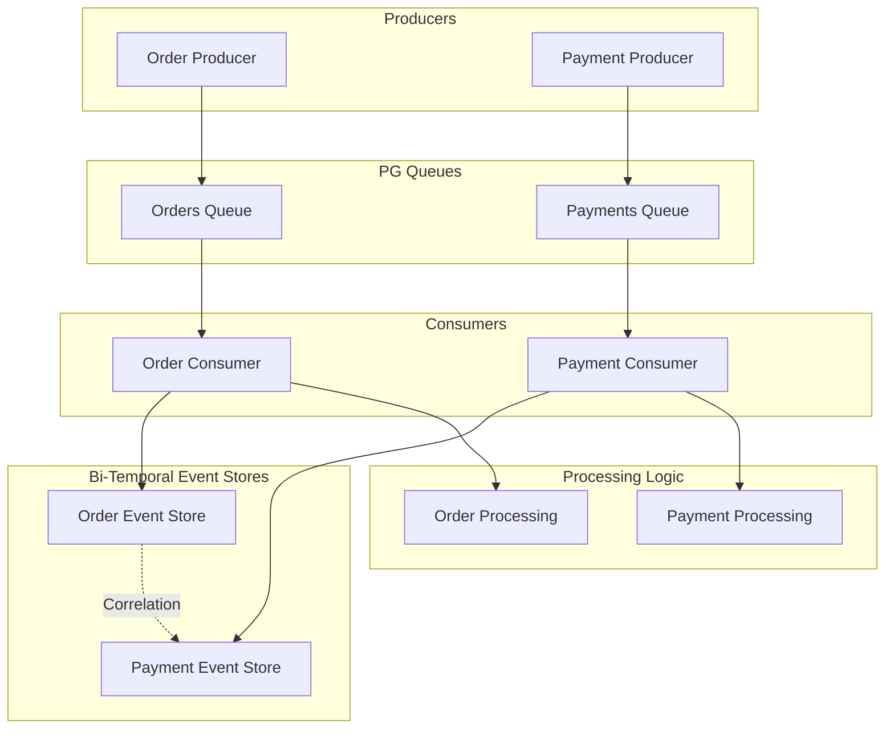

# Transactional Bi-Temporal Example

This example demonstrates the powerful integration between PeeGeeQ's message queuing capabilities and bi-temporal event stores, showing how to build systems that maintain both real-time processing and complete historical audit trails.

## Overview

The `TransactionalBiTemporalExample` showcases:

- **Two PG Queues**: Orders and Payments queues for real-time message processing
- **Two Bi-Temporal Event Stores**: Corresponding event stores for audit and historical tracking
- **Transactional Consistency**: Ensures messages and events are stored atomically
- **Cross-System Correlation**: Links related events across different domains
- **Temporal Queries**: Demonstrates powerful time-based querying capabilities

## Architecture



## Key Features

### 1. Transactional Processing

Each consumer writes to both the message queue (for acknowledgment) and the bi-temporal event store atomically:

```java
// Order consumer with transactional event store writes
orderConsumer.consume(message -> {
    OrderEvent orderEvent = message.getPayload();
    
    // Write to bi-temporal event store transactionally
    BiTemporalEvent<OrderEvent> storedEvent = orderEventStore.append(
        "OrderProcessed",
        orderEvent,
        orderEvent.getOrderTime(), // Valid time = when order actually occurred
        Map.of("messageId", message.getId(), "source", "order-queue"),
        message.getCorrelationId(),
        orderEvent.getOrderId()
    ).join();
    
    // Process the order
    processOrder(orderEvent);
    
    // Acknowledge only after successful processing and storage
    message.acknowledge();
});
```

### 2. Bi-Temporal Tracking

Events are stored with two time dimensions:

- **Valid Time**: When the business event actually occurred (e.g., when the order was placed)
- **Transaction Time**: When the event was recorded in the system

This enables powerful queries like:
- "What did we know about order X at time Y?"
- "Show me all orders that were placed between 2PM and 4PM"
- "What corrections were made to payment records last week?"

### 3. Cross-System Correlation

Events across different domains (orders and payments) are correlated using:

- **Correlation IDs**: Link related messages across queues
- **Aggregate IDs**: Connect events to business entities
- **Headers**: Carry additional context and metadata

### 4. Event Types and Payloads

#### OrderEvent
```java
public class OrderEvent {
    private final String orderId;
    private final String customerId;
    private final BigDecimal amount;
    private final String status;
    private final Instant orderTime;
}
```

#### PaymentEvent
```java
public class PaymentEvent {
    private final String paymentId;
    private final String orderId;      // Links to OrderEvent
    private final String customerId;
    private final BigDecimal amount;
    private final String method;
    private final String status;
    private final Instant paymentTime;
}
```

## Running the Example

### Prerequisites

- Java 21 or higher
- Docker (for TestContainers)
- Maven 3.8+

### Execution

```bash
# Run the main example
mvn exec:java -Dexec.mainClass="dev.mars.peegeeq.examples.TransactionalBiTemporalExample" -pl peegeeq-examples

# Run the tests
mvn test -Dtest=TransactionalBiTemporalExampleTest -pl peegeeq-examples
```

### Expected Output

The example will:

1. **Start PostgreSQL container** and configure PeeGeeQ
2. **Create queues and event stores** for orders and payments
3. **Set up transactional consumers** that write to both queues and event stores
4. **Generate sample data** (5 orders and 5 payments)
5. **Process messages** through the consumers
6. **Demonstrate bi-temporal queries**:
   - Query all events by type
   - Temporal range queries
   - Cross-system correlation
   - Event store statistics

## Sample Output

```
2025-07-15 18:30:00.123 [main] INFO  TransactionalBiTemporalExample - Starting Transactional Bi-Temporal Example
2025-07-15 18:30:01.456 [main] INFO  TransactionalBiTemporalExample - PostgreSQL container started on port: 54321
2025-07-15 18:30:02.789 [main] INFO  TransactionalBiTemporalExample - PeeGeeQ Manager started successfully
2025-07-15 18:30:03.012 [main] INFO  TransactionalBiTemporalExample - Setting up transactional consumers
2025-07-15 18:30:03.345 [consumer-1] INFO  TransactionalBiTemporalExample - Processing order message: OrderEvent{orderId='ORDER-001', customerId='CUST-100', amount=109.99, status='CREATED'}
2025-07-15 18:30:03.456 [consumer-1] INFO  TransactionalBiTemporalExample - Order event stored in bi-temporal store: evt_12345
2025-07-15 18:30:03.567 [consumer-2] INFO  TransactionalBiTemporalExample - Processing payment message: PaymentEvent{paymentId='PAY-001', orderId='ORDER-001', amount=109.99, method='CREDIT_CARD'}
2025-07-15 18:30:03.678 [consumer-2] INFO  TransactionalBiTemporalExample - Payment event stored in bi-temporal store: evt_12346

=== Demonstrating Bi-Temporal Queries ===

1. Querying all order events...
Found 5 order events:
  Order Event: evt_12345 - ORDER-001 - Valid Time: 2025-07-15T17:29:03.345Z - Transaction Time: 2025-07-15T18:30:03.456Z
  Order Event: evt_12347 - ORDER-002 - Valid Time: 2025-07-15T17:28:03.345Z - Transaction Time: 2025-07-15T18:30:03.567Z
  ...

5. Cross-system correlation...
Order ORDER-001 has 1 related payments:
  Related Payment: PAY-001 - CREDIT_CARD - Amount: 109.99
```

## Testing

The comprehensive test suite (`TransactionalBiTemporalExampleTest`) verifies:

### Test Coverage

1. **`testMainMethodExecutesWithoutErrors()`**
   - Verifies the main method runs without exceptions
   - Checks expected output messages

2. **`testTransactionalOrderProcessing()`**
   - Tests order message processing with bi-temporal storage
   - Verifies transactional consistency
   - Confirms event correlation

3. **`testTransactionalPaymentProcessing()`**
   - Tests payment message processing with bi-temporal storage
   - Verifies cross-system references (order ID linking)

4. **`testCrossSystemCorrelation()`**
   - Tests correlation between orders and payments
   - Verifies correlation IDs are maintained
   - Confirms related events can be queried

5. **`testEventStoreStatistics()`**
   - Tests event store statistics functionality
   - Verifies event counts and metadata

### Running Tests

```bash
# Run all tests
mvn test -Dtest=TransactionalBiTemporalExampleTest

# Run specific test
mvn test -Dtest=TransactionalBiTemporalExampleTest#testTransactionalOrderProcessing

# Run with debug logging
mvn test -Dtest=TransactionalBiTemporalExampleTest -Dpeegeeq.logging.level.peegeeq=DEBUG
```

## Use Cases

This pattern is ideal for:

### 1. Financial Systems
- **Orders and Payments**: Track order lifecycle with payment processing
- **Audit Requirements**: Maintain complete audit trails for compliance
- **Temporal Queries**: "Show me all transactions as they appeared at month-end"

### 2. E-commerce Platforms
- **Order Management**: Track orders, inventory, and fulfillment
- **Customer Journey**: Correlate events across customer touchpoints
- **Analytics**: Historical analysis of business metrics

### 3. Supply Chain Management
- **Inventory Tracking**: Real-time updates with historical views
- **Shipment Correlation**: Link orders, shipments, and deliveries
- **Compliance Reporting**: Temporal queries for regulatory requirements

### 4. Healthcare Systems
- **Patient Records**: Real-time updates with complete history
- **Treatment Correlation**: Link diagnoses, treatments, and outcomes
- **Audit Trails**: Maintain immutable records for compliance

## Advanced Features

### Event Corrections

The bi-temporal event store supports corrections while maintaining history:

```java
// Original event
BiTemporalEvent<OrderEvent> originalEvent = eventStore.append(
    "OrderCreated", order, validTime, headers, correlationId, aggregateId
).join();

// Correction (e.g., price adjustment)
OrderEvent correctedOrder = new OrderEvent(order.getOrderId(), order.getCustomerId(), 
                                          correctedAmount, order.getStatus(), order.getOrderTime());

BiTemporalEvent<OrderEvent> correctionEvent = eventStore.appendCorrection(
    originalEvent.getEventId(), "OrderCreated", correctedOrder, validTime,
    headers, correlationId, aggregateId, "Price correction due to discount"
).join();
```

### Temporal Range Queries

Query events within specific time ranges:

```java
// Find all orders placed between 2PM and 4PM
Instant start = LocalDateTime.of(2025, 7, 15, 14, 0).toInstant(ZoneOffset.UTC);
Instant end = LocalDateTime.of(2025, 7, 15, 16, 0).toInstant(ZoneOffset.UTC);

List<BiTemporalEvent<OrderEvent>> ordersInRange = eventStore.query(
    EventQuery.builder()
        .validTimeRange(new TemporalRange(start, end))
        .eventType("OrderCreated")
        .sortOrder(EventQuery.SortOrder.VALID_TIME_ASC)
        .build()
).join();
```

### Point-in-Time Queries

See the state of the system at any point in time:

```java
// What did we know about this order at 3PM yesterday?
Instant pointInTime = LocalDateTime.of(2025, 7, 14, 15, 0).toInstant(ZoneOffset.UTC);

BiTemporalEvent<OrderEvent> historicalView = eventStore.getAsOfTransactionTime(
    orderEventId, pointInTime
).join();
```

## Best Practices

### 1. Event Design
- Use immutable event payloads
- Include business timestamps (valid time)
- Add correlation and aggregate IDs
- Include relevant metadata in headers

### 2. Error Handling
- Implement proper retry logic
- Use dead letter queues for failed messages
- Log correlation IDs for debugging
- Monitor processing latency

### 3. Performance
- Use appropriate batch sizes
- Monitor queue depths
- Implement backpressure handling
- Consider event store partitioning for high volume

### 4. Monitoring
- Track message processing rates
- Monitor event store growth
- Alert on processing delays
- Measure correlation success rates

This example demonstrates how PeeGeeQ's bi-temporal event stores can be seamlessly integrated with message queues to build robust, auditable, and queryable systems that maintain both real-time processing capabilities and complete historical context.
