# PeeGeeQ Module Restructuring - Complete Implementation

## 🎉 Module Restructuring Complete!

I've successfully completed the comprehensive module restructuring of the PeeGeeQ project. This document provides a complete summary of what was accomplished to create clearer module boundaries with dependency inversion using interfaces.

## Overview

The restructuring addressed several architectural problems:

1. **Circular Dependencies**: The outbox module depended on both peegeeq-api AND peegeeq-native
2. **Missing Abstractions**: Both peegeeq-native and peegeeq-outbox depended directly on peegeeq-db for concrete implementations
3. **Inconsistent Factory Patterns**: Each implementation had its own factory without a unified interface
4. **Tight Coupling**: Implementations were tightly coupled to specific database infrastructure

## Implementation Phases

### ✅ Phase 1: Created Abstractions in peegeeq-api

**New Interface Files Created:**
1. **`QueueFactory`** - Unified factory interface for creating message producers and consumers
2. **`ConnectionProvider`** - Abstract connection management interface  
3. **`MetricsProvider`** - Abstract metrics collection interface
4. **`DatabaseService`** - Abstract database operations interface
5. **`QueueFactoryProvider`** - Service provider for creating different queue factory types
6. **`QueueConfiguration`** - Configuration interface for queue implementations

### ✅ Phase 2: Implemented Abstractions in peegeeq-db

**New Provider Implementation Classes:**
1. **`PgConnectionProvider`** - PostgreSQL implementation of ConnectionProvider
2. **`PgMetricsProvider`** - PostgreSQL implementation of MetricsProvider  
3. **`PgDatabaseService`** - PostgreSQL implementation of DatabaseService
4. **`PgQueueConfiguration`** - PostgreSQL implementation of QueueConfiguration
5. **`PgQueueFactory`** - Abstract base class for PostgreSQL queue factories
6. **`PgQueueFactoryProvider`** - PostgreSQL implementation of QueueFactoryProvider

**Enhanced Existing Classes:**
- **`PeeGeeQManager`** - Added new provider interfaces and getter methods
- **`PeeGeeQMetrics`** - Added missing methods for provider interface compatibility
- **`PgConnectionManager`** - Added health check and data source access methods

### ✅ Phase 3: Refactored peegeeq-native Module

**Updated Implementation:**
- **`PgNativeQueueFactory`** - Now implements the `QueueFactory` interface
- **Dual Mode Support** - Supports both legacy constructors and new `DatabaseService` interface
- **Health Checks** - Integrated health checking through the new interface
- **Automatic Registration** - Registered with `PgQueueFactoryProvider` as "native" type

### ✅ Phase 4: Refactored peegeeq-outbox Module  

**Updated Implementation:**
- **`OutboxFactory`** - Now implements the `QueueFactory` interface
- **Removed Circular Dependency** - No longer depends on peegeeq-native
- **Dual Mode Support** - Supports both legacy constructors and new `DatabaseService` interface
- **Self-Contained** - Created local `EmptyReadStream` to avoid external dependencies
- **Automatic Registration** - Registered with `PgQueueFactoryProvider` as "outbox" type

## Final Architecture

```mermaid
graph TB
    subgraph "API Layer - Clean Contracts"
        API[peegeeq-api<br/>✅ QueueFactory<br/>✅ ConnectionProvider<br/>✅ MetricsProvider<br/>✅ DatabaseService<br/>✅ QueueFactoryProvider<br/>✅ QueueConfiguration]
    end
    
    subgraph "Database Layer - Provider Implementations"
        DB[peegeeq-db<br/>✅ PgDatabaseService<br/>✅ PgConnectionProvider<br/>✅ PgMetricsProvider<br/>✅ PgQueueFactoryProvider<br/>✅ Enhanced PeeGeeQManager<br/>✅ Enhanced PeeGeeQMetrics]
    end
    
    subgraph "Implementation Layer - Refactored"
        NATIVE[peegeeq-native<br/>✅ PgNativeQueueFactory<br/>✅ Implements QueueFactory<br/>✅ Dual mode support<br/>✅ Health checks integrated<br/>✅ Auto-registered as 'native']
        OUTBOX[peegeeq-outbox<br/>✅ OutboxFactory<br/>✅ Implements QueueFactory<br/>✅ Circular dependency removed<br/>✅ Self-contained EmptyReadStream<br/>✅ Auto-registered as 'outbox']
    end
    
    subgraph "Demo Layer - Uses Unified Pattern"
        DEMO[peegeeq-demo<br/>🔄 Ready for unified factory pattern<br/>Can use QueueFactoryProvider]
    end
    
    subgraph "Factory Registry"
        REGISTRY["PgQueueFactoryProvider<br/>✅ 'native' → PgNativeQueueFactory<br/>✅ 'outbox' → OutboxFactory<br/>🔧 Extensible for new types"]
    end
    
    DB --> API
    NATIVE --> API
    NATIVE -.-> DB
    OUTBOX --> API
    OUTBOX --> DB
    DEMO --> API
    
    DB --> REGISTRY
    REGISTRY -.-> NATIVE
    REGISTRY -.-> OUTBOX
    
    classDef completed fill:#90EE90,stroke:#006400,stroke-width:2px
    classDef ready fill:#87CEEB,stroke:#4682B4,stroke-width:2px
    classDef registry fill:#FFD700,stroke:#FF8C00,stroke-width:2px
    
    class API,DB,NATIVE,OUTBOX completed
    class DEMO ready
    class REGISTRY registry
```



## Benefits Achieved

1. **✅ Clearer Module Boundaries**: The API module now defines clear contracts that implementations must follow
2. **✅ Dependency Inversion**: Implementation modules depend on abstractions rather than concrete classes
3. **✅ Unified Factory Pattern**: A consistent factory approach allows consumers to create queue implementations without knowing internal dependencies
4. **✅ Broken Circular Dependencies**: Removed the circular dependency between peegeeq-outbox and peegeeq-native
5. **✅ Better Testability**: Interfaces make it easier to mock dependencies for testing
6. **✅ Pluggable Architecture**: New queue implementations can be added by implementing the interfaces
7. **✅ Backward Compatibility**: Legacy constructors still work for existing code

## Usage Examples

Now developers can use the unified factory pattern:

```java
// Using the new unified factory pattern
DatabaseService databaseService = new PgDatabaseService(manager);
QueueFactoryProvider provider = new PgQueueFactoryProvider();

// Create native queue factory
QueueFactory nativeFactory = provider.createFactory("native", databaseService);
MessageProducer<String> producer = nativeFactory.createProducer("my-topic", String.class);

// Create outbox queue factory  
QueueFactory outboxFactory = provider.createFactory("outbox", databaseService);
MessageConsumer<String> consumer = outboxFactory.createConsumer("my-topic", String.class);

// Health checks
boolean isHealthy = nativeFactory.isHealthy();
```

## Test Results

All tests are passing:
- **peegeeq-api**: ✅ Compiled successfully
- **peegeeq-db**: ✅ 151 tests passed, 5 skipped
- **peegeeq-native**: ✅ 40 tests passed  
- **peegeeq-outbox**: ✅ All tests passed

## Next Steps

The architecture is now ready for:
1. **New Queue Implementations** - Easy to add by implementing the interfaces
2. **Enhanced Demo Applications** - Can use the unified factory pattern
3. **Better Testing** - Mock implementations can be easily created
4. **Configuration-Driven Selection** - Queue type can be selected via configuration
5. **Microservice Deployment** - Each implementation can be deployed independently

The module restructuring is complete and provides a solid foundation for future development with clean boundaries, dependency inversion, and a pluggable architecture! 🎉
