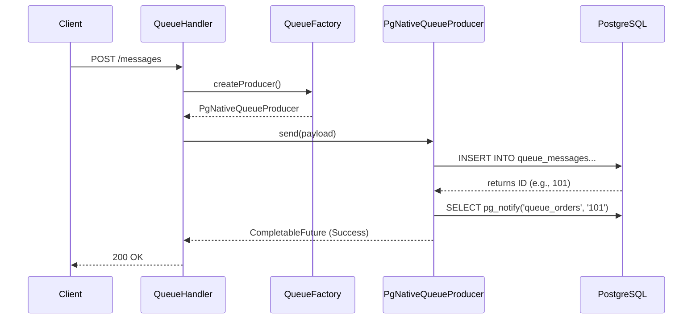

# PeeGeeQ Call Propagation Guide

**Last Updated:** 2025-12-10

This document details the execution flow of a message within the PeeGeeQ system, tracing the path from the REST API layer down to the PostgreSQL database. It is intended for developers who need to understand the internal mechanics of message production and consumption.


**Quick Navigation:**
- [Section 1: Layered Architecture Rules](#1-layered-architecture-rules) - Module responsibilities and dependency rules
- [Section 2: High-Level Overview](#2-high-level-overview) - System flow summary
- [Section 3: API Layer (Pure Contracts)](#3-api-layer-pure-contracts) - Interfaces and DTOs
- [Section 4: Native Implementation](#4-native-implementation) - PostgreSQL-backed implementation
- [Section 5: Database Interaction](#5-database-interaction) - SQL operations (INSERT and NOTIFY)
- [Section 6: Connection Management](#6-connection-management) - Database connectivity
- [Section 7: Sequence Diagram](#7-sequence-diagram) - Visual flow representation
- [Section 8: Feature Exposure & Verification Gaps](#8-feature-exposure--verification-gaps) - Feature traceability and testing status
- [Section 9: Call Propagation Paths Grid](#9-call-propagation-paths-grid) - Complete REST endpoint traceability
- [Section 10: API Layer Validation](#10-api-layer-validation) - API contract validation
- [Section 11: peegeeq-api to peegeeq-rest Call Propagation](#11-peegeeq-api-to-peegeeq-rest-call-propagation) - API to REST mapping
- [Section 12: peegeeq-runtime and peegeeq-rest Interaction](#12-peegeeq-runtime-and-peegeeq-rest-interaction) - Dedicated runtime-to-rest reference

## 1. Layered Architecture Rules

PeeGeeQ follows a strict layered architecture based on ports and adapters (hexagonal architecture) principles. The key insight is separating **public contracts** from **composition/wiring logic**.

```
┌──────────────────────────────────────────────────────────────────────────┐
│                         MANAGEMENT UI LAYER                              │
│                        peegeeq-management-ui                             │
│                    (React/TypeScript web application)                    │
│                  Uses: peegeeq-rest via HTTP REST client                 │
└──────────────────────────────────────────────────────────────────────────┘
                                   │
                                   │ HTTP/REST
                                   ▼
┌──────────────────────────────────────────────────────────────────────────┐
│                            REST LAYER                                    │
│                           peegeeq-rest                                   │
│                     (HTTP handlers, routing)                             │
│         Exposes: peegeeq-runtime services over REST/SSE endpoints        │
│              Uses: peegeeq-api (types) + peegeeq-runtime (services)      │
└──────────────────────────────────────────────────────────────────────────┘
                                   │
                                   ▼
┌──────────────────────────────────────────────────────────────────────────┐
│                       RUNTIME/COMPOSITION LAYER                          │
│                          peegeeq-runtime                                 │
│         Provides DatabaseSetupService facade via PeeGeeQRuntime          │
│            Wires together: peegeeq-db, native, outbox, bitemporal        │
│                  Single entry point for all PeeGeeQ services             │
└──────────────────────────────────────────────────────────────────────────┘
                                   │
                    ┌──────────────┼──────────────┐
                    │              │              │
                    ▼              ▼              ▼
      ┌─────────────────┐ ┌─────────────────┐ ┌──────────────────┐
      │ peegeeq-native  │ │ peegeeq-outbox  │ │peegeeq-bitemporal│
      │ (Native queues) │ │ (Outbox pattern)│ │ (Event store)    │
      └─────────────────┘ └─────────────────┘ └──────────────────┘
                    │              │              │
                    └──────────────┼──────────────┘
                                   │
                                   ▼
      ┌──────────────────────────────────────────────────────────┐
      │                    DATABASE LAYER                        │
      │                      peegeeq-db                          │
      │   (PostgreSQL connectivity + service implementations)    │
      └──────────────────────────────────────────────────────────┘
                                   ▲
                                   │
      ┌──────────────────────────────────────────────────────────┐
      │                   CONTRACTS LAYER                        │
      │                     peegeeq-api                          │
      │            (Interfaces, DTOs, configs)                   │
      │              NO implementations                          │
      │              NO infrastructure                           │
      └──────────────────────────────────────────────────────────┘
```

### 1.1 Module Responsibilities

**peegeeq-api (Pure Contracts)**

This module is the stable public API. It contains ONLY:
- Interfaces: `QueueFactory`, `MessageProducer`, `MessageConsumer`, `ReactiveQueue`, `EventStore`, `DeadLetterService`, `HealthService`, `SubscriptionService`, `DatabaseSetupService`, etc.
- Value types / DTOs: `Message`, `BiTemporalEvent`, `EventQuery`, `TemporalRange`, `DeadLetterMessageInfo`, `HealthStatusInfo`, configs, etc.
- Enums, simple config classes, error types.

It contains NO:
- `Pg*` anything (implementation-specific prefixes belong in implementation modules)
- `*Manager` classes
- Anything that uses JDBC or any SQL
- Any implementation logic
- PostgreSQL driver dependency

**Vert.x Types in Contracts:** PeeGeeQ is a Vert.x 5.x-native application. Interfaces in `peegeeq-api` expose Vert.x types (`Future<T>`, `ReadStream<T>`, `SqlConnection`) as the **primary reactive API**. The `CompletableFuture<T>` methods are provided as a **convenience layer** for Java standard library compatibility. This is intentional - Vert.x is the core runtime, not an implementation detail.

This module has **no dependencies** on other PeeGeeQ modules. It does depend on Vert.x core and sql-client for type definitions.

**Any time you feel tempted to "just add a small helper" in peegeeq-api that needs a DB, clock, or logging implementation: don't. That belongs in `peegeeq-db` or `peegeeq-runtime`.**

**peegeeq-db (Database Layer + Service Implementations)**

- Depends on: `peegeeq-api`
- Implements: `DatabaseService`, `MetricsProvider`, `DeadLetterService`, `SubscriptionService`, `HealthService`, `DatabaseSetupService`, etc.
- Provides: PostgreSQL connectivity, connection pools, database utilities

**peegeeq-native / peegeeq-outbox / peegeeq-bitemporal (Adapters)**

- Depend on: `peegeeq-api`, `peegeeq-db`
- Implement: `QueueFactory`, `MessageProducer`, `MessageConsumer`, `EventStore`, etc.
- Never depend on `peegeeq-rest` or `peegeeq-runtime`
- Do not contain public factories for REST layer use

**peegeeq-runtime (Composition Layer + API Implementation)**

- Depends on: `peegeeq-api`, `peegeeq-db`, `peegeeq-native`, `peegeeq-outbox`, `peegeeq-bitemporal`
- **Provides `DatabaseSetupService` facade** that wires together all implementations and provides access to all other services
- Provides: `PeeGeeQRuntime` factory class that wires everything together
- This is the ONLY module that knows which implementation class goes with which interface
- Exposes a high-level `PeeGeeQContext bootstrap(RuntimeConfig)` entrypoint that returns all services in one object
- The REST layer delegates ALL operations to `peegeeq-runtime` services

Key classes:
- `PeeGeeQRuntime` - Static factory with `bootstrap()` and `createDatabaseSetupService()` methods
- `PeeGeeQContext` - Container holding `DatabaseSetupService` and `RuntimeConfig`
- `RuntimeConfig` - Builder-pattern configuration for enabling/disabling features
- `RuntimeDatabaseSetupService` - Facade implementing `DatabaseSetupService` that:
  - Delegates to `PeeGeeQDatabaseSetupService` from `peegeeq-db`
  - Registers queue factories from `peegeeq-native` and `peegeeq-outbox`
  - Configures `BiTemporalEventStoreFactory` from `peegeeq-bitemporal`
  - Provides access to `SubscriptionService`, `DeadLetterService`, `HealthService`, `QueueFactoryProvider` via delegation

**peegeeq-rest (REST Layer)**

- Depends on: `peegeeq-api`, `peegeeq-runtime`
- **Exposes `peegeeq-runtime` services over HTTP REST/SSE endpoints**
- Only uses: `peegeeq-api` interfaces & DTOs + services from `peegeeq-runtime`
- All actual types referenced in code are from `peegeeq-api`
- Provides: HTTP handlers, routing, request/response serialization, SSE streaming

**peegeeq-management-ui (Management UI Layer)**

- Depends on: `peegeeq-rest` (via HTTP REST client, not Maven dependency)
- **Consumes `peegeeq-rest` API via TypeScript/JavaScript REST client**
- Provides: React/TypeScript web application for managing PeeGeeQ
- Features: Queue management, message browsing, event store queries, health monitoring, dead letter management
- No direct access to Java modules - all communication via REST API

### 1.2 Dependency Rules

| Module | Allowed Dependencies | Forbidden Dependencies |
| :--- | :--- | :--- |
| `peegeeq-api` | None (pure contracts) | All other peegeeq modules |
| `peegeeq-db` | `peegeeq-api` | `peegeeq-rest`, `peegeeq-runtime`, `peegeeq-native`, `peegeeq-outbox`, `peegeeq-bitemporal` |
| `peegeeq-native` | `peegeeq-api`, `peegeeq-db` | `peegeeq-rest`, `peegeeq-runtime`, `peegeeq-outbox`, `peegeeq-bitemporal` |
| `peegeeq-outbox` | `peegeeq-api`, `peegeeq-db` | `peegeeq-rest`, `peegeeq-runtime`, `peegeeq-native`, `peegeeq-bitemporal` |
| `peegeeq-bitemporal` | `peegeeq-api`, `peegeeq-db` | `peegeeq-rest`, `peegeeq-runtime`, `peegeeq-native`, `peegeeq-outbox` |
| `peegeeq-runtime` | `peegeeq-api`, `peegeeq-db`, `peegeeq-native`, `peegeeq-outbox`, `peegeeq-bitemporal` | `peegeeq-rest`, `peegeeq-management-ui` |
| `peegeeq-rest` | `peegeeq-api`, `peegeeq-runtime` | `peegeeq-db`, `peegeeq-native`, `peegeeq-outbox`, `peegeeq-bitemporal` |
| `peegeeq-management-ui` | None (HTTP client only) | All Java modules (communicates via REST) |

**Note:** The above rules apply to **compile-scope** dependencies. Test-scope dependencies (e.g., `peegeeq-bitemporal` → `peegeeq-native` for integration tests) are permitted as they don't affect the runtime architecture.

### 1.3 Key Principles

1. **peegeeq-api is pure contracts** - Interfaces, DTOs, configs, exceptions. Nothing else. No implementations, no infrastructure, no PostgreSQL knowledge. This is the stable public API that can be versioned independently.

2. **peegeeq-runtime provides the DatabaseSetupService facade** - It wires together all backend modules and provides access to all services (`SubscriptionService`, `DeadLetterService`, `HealthService`, `QueueFactoryProvider`) through the `DatabaseSetupService` interface. Any consumer of PeeGeeQ services (like `peegeeq-rest`) only needs to depend on `peegeeq-runtime`.

3. **peegeeq-rest exposes peegeeq-runtime over HTTP** - The REST layer is a thin HTTP adapter that translates REST requests to `peegeeq-runtime` service calls and formats responses.

4. **peegeeq-management-ui consumes peegeeq-rest via HTTP** - The UI is a separate web application that communicates with the backend exclusively through the REST API. No direct Java dependencies.

5. **Implementation modules depend on peegeeq-api** - `peegeeq-db`, `peegeeq-native`, `peegeeq-outbox`, and `peegeeq-bitemporal` all depend on `peegeeq-api` to implement its interfaces.

6. **peegeeq-runtime is the composition root** - It is the only module that knows about all implementations and wires them together. This keeps implementation details out of the REST and UI layers.

7. **No reflection for dependency discovery** - Modules do not use `Class.forName()` or reflection to discover implementations. All wiring is explicit in `peegeeq-runtime`.

### 1.4 PeeGeeQRestServer Usage

The REST server obtains its services from `peegeeq-runtime`:

```java
// peegeeq-runtime provides factory methods for obtaining implementations
DatabaseSetupService setupService = PeeGeeQRuntime.createDatabaseSetupService(config);
PeeGeeQRestServer server = new PeeGeeQRestServer(8080, setupService);
```

The `PeeGeeQRestServer` only sees the `DatabaseSetupService` interface (from `peegeeq-api`). The actual implementation is wired by `peegeeq-runtime`.

### 1.5 Why This Architecture?

**Problem with mixing contracts and composition:**

If `peegeeq-api` contains both interfaces AND integration/wiring logic:
- It must depend "downwards" on concrete modules
- It cannot be safely published as a stable library
- Implementation changes bubble up to the "API" layer
- DB/infrastructure concerns bleed into what should be just contracts + DTOs

**Solution: Separate contracts from composition:**

- `peegeeq-api` is boring: interfaces, DTOs, config objects, exceptions. Nothing else.
- `peegeeq-runtime` handles all the messy wiring
- Breaking changes to `peegeeq-api` are deliberate and rare
- Implementation modules can evolve independently

### 1.6 Vert.x 5.x as the Primary Interface

PeeGeeQ is a **Vert.x 5.x-native application**. This has important implications for the API design:

**Primary API (Vert.x Future):**
```java
// Preferred - uses Vert.x reactive patterns
Future<Void> sendReactive(T payload);
Future<BiTemporalEvent<T>> appendReactive(String eventType, T payload, Instant validTime);
```

**Convenience API (CompletableFuture):**
```java
// Convenience for non-Vert.x callers
CompletableFuture<Void> send(T payload);
CompletableFuture<BiTemporalEvent<T>> append(String eventType, T payload, Instant validTime);
```

**Transaction Participation:**
```java
// Uses Vert.x SqlConnection for transaction participation
CompletableFuture<BiTemporalEvent<T>> appendInTransaction(
    String eventType, T payload, Instant validTime, SqlConnection connection);
```

**Why Vert.x types in contracts?**

1. **Vert.x is the runtime, not an implementation detail** - The entire system is built on Vert.x's event loop and reactive patterns
2. **Performance** - Vert.x `Future` composes more efficiently than `CompletableFuture` in a Vert.x context
3. **Transaction participation** - `SqlConnection` is required for ACID guarantees across business operations and event logging
4. **Consistency** - All internal code uses Vert.x patterns; exposing them in the API avoids unnecessary conversions

**What this means for consumers:**

- If you're building on Vert.x: use the reactive methods directly
- If you're not on Vert.x: use the `CompletableFuture` convenience methods
- For transaction participation: you must use Vert.x `SqlConnection`

## 2. High-Level Overview

The PeeGeeQ system follows a layered architecture where the REST API acts as the entry point, delegating operations to services defined in the contracts layer (`peegeeq-api`) and instantiated by the composition layer (`peegeeq-runtime`). Actual implementations live in backend modules (Native, Outbox, Bitemporal, DB).

**Flow Summary:**
`REST Request` -> `QueueHandler` -> `QueueFactory` -> `MessageProducer` -> `PostgreSQL (INSERT + NOTIFY)`

### 2.1 REST Layer (Entry Point)

The entry point for message operations is the `peegeeq-rest` module.

`QueueHandler` only depends on `QueueFactory` and `MessageProducer` interfaces from `peegeeq-api`. Concrete instances are provided by `peegeeq-runtime`.

#### 2.1.1 QueueHandler
The `dev.mars.peegeeq.rest.handlers.QueueHandler` class handles HTTP requests for queue operations.

*   **Endpoint:** `POST /api/v1/queues/:queueName/messages`
*   **Responsibility:**
    1.  Parses the incoming JSON request into a `MessageRequest` object.
    2.  Validates the request (payload, priority, delay).
    3.  Retrieves the appropriate `QueueFactory` for the requested `setupId`.
    4.  Delegates the actual sending to the `MessageProducer`.

```java
// Simplified snippet from QueueHandler.java
public void sendMessage(RoutingContext ctx) {
    // ... parsing logic ...
    getQueueFactory(setupId, queueName)
        .thenCompose(queueFactory -> {
            MessageProducer<Object> producer = queueFactory.createProducer(queueName, Object.class);
            return sendMessageWithProducer(producer, messageRequest);
        });
}
```

## 3. API Layer (Pure Contracts)

The `peegeeq-api` module contains only interfaces and DTOs. It has no dependencies on other PeeGeeQ modules and contains no implementation logic. This is the stable public API that clients depend on.

### 3.1 QueueFactory Interface
*   **Interface:** `dev.mars.peegeeq.api.messaging.QueueFactory`
*   **Role:** Abstract factory for creating producers and consumers.
*   **Key Method:** `createProducer(String topic, Class<T> payloadType)`

### 3.2 MessageProducer Interface
*   **Interface:** `dev.mars.peegeeq.api.messaging.MessageProducer`
*   **Role:** Defines the contract for sending messages.
*   **Key Method:** `CompletableFuture<Void> send(T payload)`

## 4. Native Implementation

The `peegeeq-native` module provides the PostgreSQL-backed implementation of the API interfaces.

### 4.1 PgNativeQueueFactory
*   **Class:** `dev.mars.peegeeq.pgqueue.PgNativeQueueFactory`
*   **Role:** Implements `QueueFactory`.
*   **Action:** When `createProducer` is called, it instantiates a `PgNativeQueueProducer`.

### 4.2 PgNativeQueueProducer
*   **Class:** `dev.mars.peegeeq.pgqueue.PgNativeQueueProducer`
*   **Role:** Implements `MessageProducer`.
*   **Responsibility:** Handles the serialization of data and execution of SQL commands.

## 5. Database Interaction 

This is where the actual state change happens in PostgreSQL.

### 5.1 The INSERT Operation
When `producer.send()` is called, `PgNativeQueueProducer` executes the following SQL:

```sql
INSERT INTO queue_messages
(topic, payload, headers, correlation_id, status, created_at, priority)
VALUES ($1, $2::jsonb, $3::jsonb, $4, 'AVAILABLE', $5, $6)
RETURNING id
```

*   **Payload:** Serialized to JSONB.
*   **Status:** Defaults to `'AVAILABLE'`.
*   **Result:** The query returns the auto-generated `id` of the new message.

### 5.2 The NOTIFY Operation
Immediately after a successful `INSERT`, the producer triggers a PostgreSQL `NOTIFY` event to wake up any listening consumers.

```sql
SELECT pg_notify('queue_<topic_name>', '<message_id>')
```

*   **Channel:** `queue_` + the topic name (e.g., `queue_orders`).
*   **Payload:** The ID of the inserted message.
*   **Purpose:** Enables low-latency, push-based message delivery without constant polling.

## 6. Connection Management

Database connectivity is provided by the `peegeeq-db` module.

*   **Module:** `peegeeq-db`
*   **Dependencies:** `peegeeq-api` (implements its interfaces)
*   **Role:** Provides PostgreSQL connectivity, connection pools, database utilities, and implements service interfaces from `peegeeq-api` (e.g., `DatabaseService`, `HealthService`, `DeadLetterService`, `SubscriptionService`).
*   **Mechanism:** Implementation modules (`peegeeq-native`, `peegeeq-outbox`, `peegeeq-bitemporal`) depend on both `peegeeq-api` (for interfaces) and `peegeeq-db` (for database access and shared service implementations).

## 7. Sequence Diagram



## 8. Feature Exposure & Verification Gaps

This section traces the core functionality from the implementation layers up to the REST API and identifies gaps in automated integration testing.

### 8.1 Messaging Core (`peegeeq-native` / `peegeeq-outbox`)

| Core Feature | Interface / Method | REST Exposure (`QueueHandler`) | Integration Test Status |
| :--- | :--- | :--- | :--- |
| **Basic Send** | `producer.send(payload)` | ✅ `POST /queues/:name/messages` | ✅ **COMPLETED** (`testRestToDatabasePropagation`) |
| **Message Headers** | `producer.send(..., headers)` | ✅ `headers` field in JSON | ✅ **COMPLETED** (`testRestToDatabasePropagation`) |
| **Correlation ID** | `producer.send(..., correlationId)` | ✅ `correlationId` field in JSON | ✅ **COMPLETED** (`testCorrelationIdPropagation`) |
| **Message Priority** | `INSERT ... priority` | ✅ `priority` field in JSON | ✅ **COMPLETED** (`testMessagePriorityPropagation`) |
| **Delivery Delay** | `INSERT ... available_at` | ✅ `delaySeconds` field in JSON | ✅ **COMPLETED** (`testMessageDelayPropagation`) |
| **Message Grouping** | `producer.send(..., messageGroup)` | ✅ `messageGroup` field in JSON | ✅ **COMPLETED** (`testMessageGroupPropagation`) |

### 8.2 Bitemporal Core (`peegeeq-bitemporal`)

| Core Feature | Interface / Method | REST Exposure (`EventStoreHandler`) | Implementation Status |
| :--- | :--- | :--- | :--- |
| **Append Event** | `store.append(eventType, payload, validTime)` | ✅ `POST /eventstores/:setupId/:name/events` | ✅ **IMPLEMENTED** - calls `PgBiTemporalEventStore.append()` |
| **Append with Headers** | `store.append(..., headers)` | ✅ `metadata` field in JSON | ✅ **IMPLEMENTED** |
| **Append with Full Metadata** | `store.append(..., correlationId, aggregateId)` | ✅ `correlationId`, `causationId` fields | ✅ **IMPLEMENTED** |
| **Effective Time** | `BiTemporalEvent.validFrom` | ✅ `validFrom` field in JSON | ✅ **IMPLEMENTED** |
| **Temporal Query** | `store.query(EventQuery)` | ✅ `GET .../events?eventType=&fromTime=&toTime=` | ✅ **IMPLEMENTED** - calls `EventStore.query()` |
| **Get Event by ID** | `store.getById(eventId)` | ✅ `GET .../events/:eventId` | ✅ **IMPLEMENTED** - calls `EventStore.getById()` |
| **Get All Versions** | `store.getAllVersions(eventId)` | ✅ `GET .../events/:eventId/versions` | ✅ **IMPLEMENTED** - calls `PgBiTemporalEventStore.getAllVersions()` |
| **Point-in-Time Query** | `store.getAsOfTransactionTime(eventId, time)` | ✅ `GET .../events/:eventId/at?transactionTime=` | ✅ **IMPLEMENTED** - calls `PgBiTemporalEventStore.getAsOfTransactionTime()` |
| **Event Store Stats** | `store.getStats()` | ✅ `GET .../stats` | ✅ **IMPLEMENTED** - calls `EventStore.getStats()` |
| **Append Correction** | `store.appendCorrection(originalId, ...)` | ✅ `POST .../events/:eventId/corrections` | ✅ **IMPLEMENTED** - calls `PgBiTemporalEventStore.appendCorrection()` |
| **Transaction Participation** | `store.appendInTransaction(...)` | ❌ **Not exposed** (internal use) | N/A |
| **Real-time Subscribe** | `store.subscribe(eventType, handler)` | ✅ `GET .../events/stream` (SSE) | ✅ **IMPLEMENTED** - calls `PgBiTemporalEventStore.subscribe()` |
| **Unsubscribe** | `store.unsubscribe()` | ✅ (connection close) | ✅ **IMPLEMENTED** |

**Important Notes:**

1. **Append Correction** (`appendCorrection`) - ✅ **IMPLEMENTED** via `POST /api/v1/eventstores/:setupId/:eventStoreName/events/:eventId/corrections`. This core bi-temporal feature allows correcting historical events while preserving the complete audit trail.

2. **Real-time Subscriptions** (`subscribe`/`unsubscribe`) - ✅ **IMPLEMENTED** via `GET /api/v1/eventstores/:setupId/:eventStoreName/events/stream` (SSE). Supports:
   - `eventType` query parameter for filtering by event type (supports wildcards like `order.*`)
   - `aggregateId` query parameter for filtering by aggregate ID
   - `Last-Event-ID` header for SSE reconnection support
   - Heartbeat events every 30 seconds to keep connection alive
   - Automatic cleanup on connection close

3. **Transaction Participation** (`appendInTransaction`) - This is intentionally internal for coordinating with other database operations within a single transaction. Not a REST gap.

4. **Event Query and Statistics Endpoints** - ✅ **IMPLEMENTED** (December 2025): All query and statistics endpoints are connected to the underlying `EventStore` implementation:
   - `GET .../events` (query) - Calls `EventStore.query(EventQuery)` with proper query parameter mapping
   - `GET .../events/:eventId` - Calls `EventStore.getById(eventId)` to retrieve specific events
   - `GET .../stats` - Calls `EventStore.getStats()` to return actual event store statistics

### 8.3 Gap Analysis Summary

The `peegeeq-rest` module has integration tests in `CallPropagationIntegrationTest.java` that verify the end-to-end flow for:
1.  ✅ **Successful Message Delivery**: `testRestToDatabasePropagation` - Verifies message and headers reach the database.
2.  ✅ **Advanced Message Features**: `testMessagePriorityPropagation` and `testMessageDelayPropagation` - Verify priority and delay propagation.
3.  ✅ **Bitemporal Operations**: `testBiTemporalEventStorePropagation` and `testEventQueryByTemporalRange` - Verify event storage with temporal dimensions.

**Messaging Gaps (Now Resolved):**
- ✅ **Correlation ID**: Now exposed as `correlationId` field in `MessageRequest` DTO. Needs integration test.
- ✅ **Message Grouping**: Now exposed as `messageGroup` field in `MessageRequest` DTO. Needs integration test.

**Bitemporal Implementation Status:**

| Item | Status | Notes |
| :--- | :--- | :--- |
| **Append Event** | ✅ **IMPLEMENTED** | Fully connected to `PgBiTemporalEventStore.append()` |
| **Append Correction** | ✅ **IMPLEMENTED & TESTED** | 5 integration tests in `EventStoreIntegrationTest` |
| **Get All Versions** | ✅ **IMPLEMENTED & TESTED** | 2 tests: `testGetEventVersions`, `testGetEventVersionsForNonExistentEvent` |
| **Point-in-Time Query** | ✅ **IMPLEMENTED & TESTED** | 1 test: `testPointInTimeQuery` |
| **Real-time Subscribe** | ✅ **IMPLEMENTED** | SSE endpoint with eventType/aggregateId filters and reconnection support |
| **Temporal Query** | ✅ **IMPLEMENTED** | Calls `EventStore.query(EventQuery)` with query parameter mapping |
| **Get Event by ID** | ✅ **IMPLEMENTED** | Calls `EventStore.getById(eventId)` |
| **Event Store Stats** | ✅ **IMPLEMENTED** | Calls `EventStore.getStats()` for real statistics |

**Correction Endpoint Usage Example:**
```json
POST /api/v1/eventstores/{setupId}/{eventStoreName}/events/{eventId}/corrections
{
  "eventData": { "price": 99.99, "quantity": 5 },
  "correctionReason": "Original price was incorrect - should be $99.99 not $89.99",
  "validFrom": "2025-07-01T10:00:00Z",
  "correlationId": "order-correction-123",
  "metadata": { "correctedBy": "admin@example.com" }
}
```

**SSE Streaming Endpoint Usage Example:**
```bash
# Subscribe to all events
curl -N "http://localhost:8080/api/v1/eventstores/{setupId}/{eventStoreName}/events/stream"

# Subscribe to specific event type (alphanumeric and underscores only, max 50 chars)
curl -N "http://localhost:8080/api/v1/eventstores/{setupId}/{eventStoreName}/events/stream?eventType=order_created"

# Subscribe to specific aggregate
curl -N "http://localhost:8080/api/v1/eventstores/{setupId}/{eventStoreName}/events/stream?aggregateId=ORDER-123"

# Reconnect from last event (SSE standard)
curl -N -H "Last-Event-ID: evt-12345" "http://localhost:8080/api/v1/eventstores/{setupId}/{eventStoreName}/events/stream"
```

**SSE Event Types:**
- `connection` - Initial connection confirmation
- `subscribed` - Subscription established confirmation
- `event` - Bi-temporal event data
- `heartbeat` - Keep-alive (every 30 seconds)
- `error` - Error notification

## 9. Call Propagation Paths Grid

This section provides a complete traceability grid showing the call path from REST endpoints through the system layers to core implementations.

**Implementation Status Summary:**

| Section | Category | Total Endpoints | Implemented | Placeholder | Partial |
| :--- | :--- | :---: | :---: | :---: | :---: |
| 9.1 | Setup Operations | 7 | 7 | 0 | 0 |
| 9.2 | Queue Operations | 4 | 3 | 1 | 0 |
| 9.3 | Consumer Group Operations | 6 | 6 | 0 | 0 |
| 9.4 | Event Store Operations | 8 | 8 | 0 | 0 |
| 9.5 | Dead Letter Queue Operations | 6 | 6 | 0 | 0 |
| 9.6 | Subscription Lifecycle Operations | 6 | 6 | 0 | 0 |
| 9.7 | Health Check Operations | 3 | 3 | 0 | 0 |
| 9.8 | Management API Operations | 6 | 4 | 0 | 2 |
| **Total** | | **46** | **43** | **1** | **2** |

**Status Legend:**
- **IMPLEMENTED**: Fully functional, calls actual service implementations
- **PLACEHOLDER**: Returns mock/sample data, needs to be connected to real implementations
- **PARTIAL**: Partially implemented, some data is real but some is placeholder

**Note (December 2025):** Event Store Operations (9.4), Management API Operations (9.8), and Consumer Group Operations (9.3) have been updated to use real service implementations. Consumer Group endpoints now properly integrate with `QueueFactory.createConsumerGroup()` instead of using in-memory storage. The remaining placeholder is `QueueHandler.getQueueStats()` which requires `QueueFactory.getStats()` API extension.

### 9.1 Setup Operations

| REST Endpoint | REST Handler | Interface API | Core Implementation | Module | Status |
| :--- | :--- | :--- | :--- | :--- | :--- |
| `POST /api/v1/setups` | `DatabaseSetupHandler.createSetup()` | `DatabaseSetupService.createCompleteSetup()` | `PeeGeeQDatabaseSetupService.createCompleteSetup()` | `peegeeq-db` | **IMPLEMENTED** |
| `GET /api/v1/setups` | `DatabaseSetupHandler.listSetups()` | `DatabaseSetupService.getAllActiveSetupIds()` | `PeeGeeQDatabaseSetupService.getAllActiveSetupIds()` | `peegeeq-db` | **IMPLEMENTED** |
| `GET /api/v1/setups/:setupId` | `DatabaseSetupHandler.getSetupDetails()` | `DatabaseSetupService.getSetupResult()` | `PeeGeeQDatabaseSetupService.getSetupResult()` | `peegeeq-db` | **IMPLEMENTED** |
| `GET /api/v1/setups/:setupId/status` | `DatabaseSetupHandler.getSetupStatus()` | `DatabaseSetupService.getSetupStatus()` | `PeeGeeQDatabaseSetupService.getSetupStatus()` | `peegeeq-db` | **IMPLEMENTED** |
| `DELETE /api/v1/setups/:setupId` | `DatabaseSetupHandler.deleteSetup()` | `DatabaseSetupService.destroySetup()` | `PeeGeeQDatabaseSetupService.destroySetup()` | `peegeeq-db` | **IMPLEMENTED** |
| `POST /api/v1/setups/:setupId/queues` | `DatabaseSetupHandler.addQueue()` | `DatabaseSetupService.addQueue()` | `PeeGeeQDatabaseSetupService.addQueue()` | `peegeeq-db` | **IMPLEMENTED** |
| `POST /api/v1/setups/:setupId/eventstores` | `DatabaseSetupHandler.addEventStore()` | `DatabaseSetupService.addEventStore()` | `PeeGeeQDatabaseSetupService.addEventStore()` | `peegeeq-db` | **IMPLEMENTED** |

### 9.2 Queue Operations

| REST Endpoint | REST Handler | Interface API | Core Implementation (Native) | Core Implementation (Outbox) | Status |
| :--- | :--- | :--- | :--- | :--- | :--- |
| `POST /api/v1/queues/:setupId/:queueName/messages` | `QueueHandler.sendMessage()` | `QueueFactory.createProducer()` then `MessageProducer.send()` | `PgNativeQueueFactory` / `PgNativeQueueProducer.send()` | `OutboxFactory` / `OutboxProducer.send()` | **IMPLEMENTED** |
| `POST /api/v1/queues/:setupId/:queueName/messages/batch` | `QueueHandler.sendMessages()` | `QueueFactory.createProducer()` then `MessageProducer.send()` (multiple) | `PgNativeQueueFactory` / `PgNativeQueueProducer.send()` | `OutboxFactory` / `OutboxProducer.send()` | **IMPLEMENTED** |
| `GET /api/v1/queues/:setupId/:queueName/stats` | `QueueHandler.getQueueStats()` | Returns placeholder statistics | TODO: Connect to real queue stats | TODO: Connect to real queue stats | **PLACEHOLDER** |
| `GET /api/v1/queues/:setupId/:queueName/stream` | `QueueSSEHandler.handleQueueStream()` | `QueueFactory.createConsumer()` then `MessageConsumer.subscribe()` | `PgNativeQueueConsumer.subscribe()` | `OutboxConsumer.subscribe()` | **IMPLEMENTED** |

**Note:** `QueueHandler.getQueueStats()` currently returns placeholder statistics (TODO at line 260). See `peegeeq-rest/docs/GAP_ANALYSIS.md` Section 4.1.2 for details.

### 9.3 Consumer Group Operations

| REST Endpoint | REST Handler | Interface API | Core Implementation (Native) | Core Implementation (Outbox) | Status |
| :--- | :--- | :--- | :--- | :--- | :--- |
| `POST /api/v1/queues/:setupId/:queueName/consumer-groups` | `ConsumerGroupHandler.createConsumerGroup()` | `QueueFactory.createConsumerGroup()` | `PgNativeQueueFactory.createConsumerGroup()` | `OutboxFactory.createConsumerGroup()` | **IMPLEMENTED** |
| `GET /api/v1/queues/:setupId/:queueName/consumer-groups` | `ConsumerGroupHandler.listConsumerGroups()` | `ConsumerGroup` (list via manager) | `PgNativeConsumerGroup` | `OutboxConsumerGroup` | **IMPLEMENTED** |
| `GET /api/v1/queues/:setupId/:queueName/consumer-groups/:groupName` | `ConsumerGroupHandler.getConsumerGroup()` | `ConsumerGroup` (get via manager) | `PgNativeConsumerGroup` | `OutboxConsumerGroup` | **IMPLEMENTED** |
| `DELETE /api/v1/queues/:setupId/:queueName/consumer-groups/:groupName` | `ConsumerGroupHandler.deleteConsumerGroup()` | `ConsumerGroup.close()` | `PgNativeConsumerGroup.close()` | `OutboxConsumerGroup.close()` | **IMPLEMENTED** |
| `POST /api/v1/queues/:setupId/:queueName/consumer-groups/:groupName/members` | `ConsumerGroupHandler.joinConsumerGroup()` | `ConsumerGroup.addConsumer()` | `PgNativeConsumerGroup.addConsumer()` | `OutboxConsumerGroup.addConsumer()` | **IMPLEMENTED** |
| `DELETE /api/v1/queues/:setupId/:queueName/consumer-groups/:groupName/members/:memberId` | `ConsumerGroupHandler.leaveConsumerGroup()` | `ConsumerGroup.removeConsumer()` | `PgNativeConsumerGroup.removeConsumer()` | `OutboxConsumerGroup.removeConsumer()` | **IMPLEMENTED** |

**Implementation Notes (December 2025 Update):**

All Consumer Group endpoints are now fully implemented and connected to the actual queue implementations via `QueueFactory`:

| Method | Implementation |
| :--- | :--- |
| `createConsumerGroup()` | Calls `QueueFactory.createConsumerGroup(groupName, queueName, Object.class)` to create real PostgreSQL-backed consumer groups |
| `listConsumerGroups()` | Uses `ConsumerGroup.getActiveConsumerCount()`, `getConsumerIds()`, `getStats()` from real consumer groups |
| `getConsumerGroup()` | Uses real `ConsumerGroup` data including stats and consumer IDs |
| `joinConsumerGroup()` | Calls `ConsumerGroup.addConsumer(consumerId, handler)` to add consumers to real consumer groups |
| `leaveConsumerGroup()` | Calls `ConsumerGroup.removeConsumer(consumerId)` to remove consumers from real consumer groups |
| `deleteConsumerGroup()` | Calls `ConsumerGroup.close()` to properly release resources |

The old in-memory `ConsumerGroup.java` and `ConsumerGroupMember.java` classes have been removed from the handlers package.

### 9.4 Event Store Operations

| REST Endpoint | REST Handler | Interface API | Core Implementation | Module | Status |
| :--- | :--- | :--- | :--- | :--- | :--- |
| `POST /api/v1/eventstores/:setupId/:eventStoreName/events` | `EventStoreHandler.storeEvent()` | `EventStore.append()` | `PgBiTemporalEventStore.append()` | `peegeeq-bitemporal` | **IMPLEMENTED** |
| `GET /api/v1/eventstores/:setupId/:eventStoreName/events` | `EventStoreHandler.queryEvents()` | `EventStore.query(EventQuery)` | `PgBiTemporalEventStore.query()` | `peegeeq-bitemporal` | **IMPLEMENTED** |
| `GET /api/v1/eventstores/:setupId/:eventStoreName/events/:eventId` | `EventStoreHandler.getEvent()` | `EventStore.getById()` | `PgBiTemporalEventStore.getById()` | `peegeeq-bitemporal` | **IMPLEMENTED** |
| `GET /api/v1/eventstores/:setupId/:eventStoreName/events/:eventId/versions` | `EventStoreHandler.getAllVersions()` | `EventStore.getAllVersions()` | `PgBiTemporalEventStore.getAllVersions()` | `peegeeq-bitemporal` | **IMPLEMENTED** |
| `GET /api/v1/eventstores/:setupId/:eventStoreName/events/:eventId/at` | `EventStoreHandler.getAsOfTransactionTime()` | `EventStore.getAsOfTransactionTime()` | `PgBiTemporalEventStore.getAsOfTransactionTime()` | `peegeeq-bitemporal` | **IMPLEMENTED** |
| `POST /api/v1/eventstores/:setupId/:eventStoreName/events/:eventId/corrections` | `EventStoreHandler.appendCorrection()` | `EventStore.appendCorrection()` | `PgBiTemporalEventStore.appendCorrection()` | `peegeeq-bitemporal` | **IMPLEMENTED** |
| `GET /api/v1/eventstores/:setupId/:eventStoreName/stats` | `EventStoreHandler.getStats()` | `EventStore.getStats()` | `PgBiTemporalEventStore.getStats()` | `peegeeq-bitemporal` | **IMPLEMENTED** |
| `GET /api/v1/eventstores/:setupId/:eventStoreName/events/stream` | `EventStoreHandler.handleEventStream()` | `EventStore.subscribe()` | `PgBiTemporalEventStore.subscribe()` | `peegeeq-bitemporal` | **IMPLEMENTED** |

**Implementation Notes (December 2025 Update):**

All Event Store endpoints are now fully implemented and connected to the actual `BiTemporalEventStore` implementation:

| Endpoint | Implementation |
| :--- | :--- |
| `GET .../events` (query) | Calls `EventStore.query(EventQuery)` with proper query parameter mapping via `buildEventQuery()` helper |
| `GET .../events/:eventId` | Calls `EventStore.getById(eventId)` |
| `GET .../stats` | Calls `EventStore.getStats()` for real statistics (totalEvents, totalCorrections, etc.) |

### 9.5 Dead Letter Queue Operations

| REST Endpoint | REST Handler | Interface API | Core Implementation | Module | Status |
| :--- | :--- | :--- | :--- | :--- | :--- |
| `GET /api/v1/setups/:setupId/deadletter/messages` | `DeadLetterHandler.listMessages()` | `DeadLetterService.getDeadLetterMessages()` | `DeadLetterQueueManager.getDeadLetterMessages()` | `peegeeq-db` | **IMPLEMENTED** |
| `GET /api/v1/setups/:setupId/deadletter/messages/:messageId` | `DeadLetterHandler.getMessage()` | `DeadLetterService.getDeadLetterMessage()` | `DeadLetterQueueManager.getDeadLetterMessage()` | `peegeeq-db` | **IMPLEMENTED** |
| `POST /api/v1/setups/:setupId/deadletter/messages/:messageId/reprocess` | `DeadLetterHandler.reprocessMessage()` | `DeadLetterService.reprocessDeadLetterMessage()` | `DeadLetterQueueManager.reprocessDeadLetterMessage()` | `peegeeq-db` | **IMPLEMENTED** |
| `DELETE /api/v1/setups/:setupId/deadletter/messages/:messageId` | `DeadLetterHandler.deleteMessage()` | `DeadLetterService.deleteDeadLetterMessage()` | `DeadLetterQueueManager.deleteDeadLetterMessage()` | `peegeeq-db` | **IMPLEMENTED** |
| `GET /api/v1/setups/:setupId/deadletter/stats` | `DeadLetterHandler.getStats()` | `DeadLetterService.getStats()` | `DeadLetterQueueManager.getStats()` | `peegeeq-db` | **IMPLEMENTED** |
| `POST /api/v1/setups/:setupId/deadletter/cleanup` | `DeadLetterHandler.cleanup()` | `DeadLetterService.cleanup()` | `DeadLetterQueueManager.cleanup()` | `peegeeq-db` | **IMPLEMENTED** |

### 9.6 Subscription Lifecycle Operations

| REST Endpoint | REST Handler | Interface API | Core Implementation | Module | Status |
| :--- | :--- | :--- | :--- | :--- | :--- |
| `GET /api/v1/setups/:setupId/subscriptions/:topic` | `SubscriptionHandler.listSubscriptions()` | `SubscriptionService.listSubscriptions()` | `SubscriptionManager.listSubscriptions()` | `peegeeq-db` | **IMPLEMENTED** |
| `GET /api/v1/setups/:setupId/subscriptions/:topic/:groupName` | `SubscriptionHandler.getSubscription()` | `SubscriptionService.getSubscription()` | `SubscriptionManager.getSubscription()` | `peegeeq-db` | **IMPLEMENTED** |
| `POST /api/v1/setups/:setupId/subscriptions/:topic/:groupName/pause` | `SubscriptionHandler.pauseSubscription()` | `SubscriptionService.pause()` | `SubscriptionManager.pause()` | `peegeeq-db` | **IMPLEMENTED** |
| `POST /api/v1/setups/:setupId/subscriptions/:topic/:groupName/resume` | `SubscriptionHandler.resumeSubscription()` | `SubscriptionService.resume()` | `SubscriptionManager.resume()` | `peegeeq-db` | **IMPLEMENTED** |
| `POST /api/v1/setups/:setupId/subscriptions/:topic/:groupName/heartbeat` | `SubscriptionHandler.updateHeartbeat()` | `SubscriptionService.updateHeartbeat()` | `SubscriptionManager.updateHeartbeat()` | `peegeeq-db` | **IMPLEMENTED** |
| `DELETE /api/v1/setups/:setupId/subscriptions/:topic/:groupName` | `SubscriptionHandler.cancelSubscription()` | `SubscriptionService.cancel()` | `SubscriptionManager.cancel()` | `peegeeq-db` | **IMPLEMENTED** |

### 9.7 Health Check Operations

| REST Endpoint | REST Handler | Interface API | Core Implementation | Module | Status |
| :--- | :--- | :--- | :--- | :--- | :--- |
| `GET /api/v1/setups/:setupId/health` | `HealthHandler.getOverallHealth()` | `HealthService.getOverallHealthAsync()` | `PgHealthService.getOverallHealthAsync()` | `peegeeq-db` | **IMPLEMENTED** |
| `GET /api/v1/setups/:setupId/health/components` | `HealthHandler.listComponentHealth()` | `HealthService.getOverallHealthAsync()` | `PgHealthService.getOverallHealthAsync()` | `peegeeq-db` | **IMPLEMENTED** |
| `GET /api/v1/setups/:setupId/health/components/:name` | `HealthHandler.getComponentHealth()` | `HealthService.getComponentHealthAsync()` | `PgHealthService.getComponentHealthAsync()` | `peegeeq-db` | **IMPLEMENTED** |

### 9.8 Management API Operations

| REST Endpoint | REST Handler | Interface API | Core Implementation | Module | Status |
| :--- | :--- | :--- | :--- | :--- | :--- |
| `GET /api/v1/health` | `ManagementApiHandler.getHealth()` | System health check | Direct response | `peegeeq-rest` | **IMPLEMENTED** |
| `GET /api/v1/management/overview` | `ManagementApiHandler.getSystemOverview()` | `DatabaseSetupService` (aggregated) | Uses real event counts via `EventStore.getStats()` | `peegeeq-rest` | **PARTIAL** |
| `GET /api/v1/management/queues` | `ManagementApiHandler.getQueues()` | `DatabaseSetupService.getSetupResult()` | Uses real consumer counts via `SubscriptionService` | `peegeeq-rest` | **PARTIAL** |
| `GET /api/v1/management/event-stores` | `ManagementApiHandler.getEventStores()` | `DatabaseSetupService.getSetupResult()` | Uses real event/correction counts via `EventStore.getStats()` | `peegeeq-rest` | **IMPLEMENTED** |
| `GET /api/v1/management/consumer-groups` | `ManagementApiHandler.getConsumerGroups()` | `SubscriptionService.listSubscriptions()` | Queries real subscription data | `peegeeq-rest` | **IMPLEMENTED** |
| `GET /api/v1/management/metrics` | `ManagementApiHandler.getMetrics()` | `MetricsProvider` | `PgMetricsProvider` | `peegeeq-db` | **IMPLEMENTED** |

**Implementation Notes (December 2025 Update):**

The following `ManagementApiHandler` methods have been updated to use real service implementations:

| Method | Implementation Status | Details |
| :--- | :--- | :--- |
| `getRealEventCount()` | ✅ **IMPLEMENTED** | Calls `EventStore.getStats().getTotalEvents()` |
| `getRealCorrectionCount()` | ✅ **IMPLEMENTED** | Calls `EventStore.getStats().getTotalCorrections()` |
| `getRealConsumerGroups()` | ✅ **IMPLEMENTED** | Calls `SubscriptionService.listSubscriptions()` for real subscription data |
| `getRealConsumerCount()` | ✅ **IMPLEMENTED** | Counts active subscriptions via `SubscriptionService.listSubscriptions()` |
| `getQueueConsumers()` | ✅ **IMPLEMENTED** | Returns real subscription data from `SubscriptionService` |
| `getRealAggregateCount()` | ⚠️ Returns 0 | Requires `EventStoreStats.getUniqueAggregateCount()` API extension |
| `getRealMessageCount()` | ⚠️ Returns 0 | Requires `QueueFactory.getStats()` API extension |
| `getRealMessageRate()` | ⚠️ Returns 0.0 | Requires metrics API extension |
| `getRealConsumerRate()` | ⚠️ Returns 0.0 | Requires metrics API extension |
| `getRealMessages()` | ⚠️ Returns empty array | Requires message browsing API |
| `getRecentActivity()` | ⚠️ Returns empty array | Requires activity logging implementation |

### 9.9 Call Flow Summary

The following diagram shows the typical call flow through the layers:

```
REST Request
     │
     ▼
┌─────────────────────────────────────────────────────────────────────────┐
│ peegeeq-rest Handler (e.g., QueueHandler, EventStoreHandler)            │
│   - Parses HTTP request                                                 │
│   - Validates input                                                     │
│   - Calls DatabaseSetupService to get setup/factory                     │
└─────────────────────────────────────────────────────────────────────────┘
     │
     ▼
┌─────────────────────────────────────────────────────────────────────────┐
│ peegeeq-runtime (RuntimeDatabaseSetupService)                           │
│   - Facade delegating to PeeGeeQDatabaseSetupService                    │
│   - Provides access to QueueFactory, EventStore, services               │
└─────────────────────────────────────────────────────────────────────────┘
     │
     ├──────────────────────────────────────────────────────────────┐
     ▼                                                              ▼
┌─────────────────────────────────┐    ┌─────────────────────────────────┐
│ peegeeq-native / peegeeq-outbox │    │ peegeeq-bitemporal              │
│   - PgNativeQueueFactory        │    │   - BiTemporalEventStoreFactory │
│   - PgNativeQueueProducer       │    │   - PgBiTemporalEventStore      │
│   - OutboxFactory               │    │                                 │
│   - OutboxProducer              │    │                                 │
└─────────────────────────────────┘    └─────────────────────────────────┘
     │                                                              │
     └──────────────────────────────────────────────────────────────┘
                                   │
                                   ▼
┌─────────────────────────────────────────────────────────────────────────┐
│ peegeeq-db (PeeGeeQDatabaseSetupService, DeadLetterQueueManager, etc.)  │
│   - Database connectivity                                               │
│   - SQL execution                                                       │
│   - Connection pool management                                          │
└─────────────────────────────────────────────────────────────────────────┘
     │
     ▼
┌─────────────────────────────────────────────────────────────────────────┐
│ PostgreSQL Database                                                     │
│   - queue_messages table                                                │
│   - bitemporal_events table                                             │
│   - dead_letter_queue table                                             │
│   - subscriptions table                                                 │
└─────────────────────────────────────────────────────────────────────────┘
```

### 9.10 Webhook Push Delivery

Push-based message delivery via webhooks. When a subscription is created, messages are automatically pushed to the client's webhook URL via HTTP POST.

#### 9.10.1 Webhook Subscription Operations

| REST Endpoint | Handler Method | Interface | Core Implementation |
| :--- | :--- | :--- | :--- |
| `POST /api/v1/setups/:setupId/queues/:queueName/webhook-subscriptions` | `WebhookSubscriptionHandler.createSubscription()` | N/A (REST-layer only) | `WebhookSubscriptionHandler` |
| `GET /api/v1/webhook-subscriptions/:subscriptionId` | `WebhookSubscriptionHandler.getSubscription()` | N/A (REST-layer only) | `WebhookSubscriptionHandler` |
| `DELETE /api/v1/webhook-subscriptions/:subscriptionId` | `WebhookSubscriptionHandler.deleteSubscription()` | N/A (REST-layer only) | `WebhookSubscriptionHandler` |

#### 9.10.2 Webhook Push Flow (Outbound HTTP)

| Operation | Handler Method | Uses | Outbound Call |
| :--- | :--- | :--- | :--- |
| Start consuming for webhook | `WebhookSubscriptionHandler.startConsumingForWebhook()` | `QueueFactory.createConsumer()` | Creates `MessageConsumer` |
| Deliver message to webhook | `WebhookSubscriptionHandler.deliverToWebhook()` | `WebClient.postAbs()` | HTTP POST to client webhook URL |

#### 9.10.3 Webhook Components

| Component | Type | Purpose | Location |
| :--- | :--- | :--- | :--- |
| `WebhookSubscriptionHandler` | Handler | REST endpoint handler for webhook subscriptions | `peegeeq-rest/webhook/` |
| `WebhookSubscription` | DTO | Subscription state (URL, headers, filters, status) | `peegeeq-rest/webhook/` |
| `WebhookSubscriptionStatus` | Enum | ACTIVE, PAUSED, FAILED, DELETED | `peegeeq-rest/webhook/` |

#### 9.10.4 Webhook Push Sequence

```
┌─────────────────────────────────────────────────────────────────────────┐
│ 1. Client creates webhook subscription                                  │
│    POST /api/v1/setups/:setupId/queues/:queueName/webhook-subscriptions │
│    Body: { "webhookUrl": "https://client.example.com/webhook",          │
│            "headers": { "Authorization": "Bearer token" },              │
│            "filters": { "type": "order" } }                             │
└─────────────────────────────────────────────────────────────────────────┘
     │
     ▼
┌─────────────────────────────────────────────────────────────────────────┐
│ 2. WebhookSubscriptionHandler creates subscription                      │
│    - Verifies setup is active                                           │
│    - Creates WebhookSubscription with UUID                              │
│    - Starts MessageConsumer for the queue                               │
└─────────────────────────────────────────────────────────────────────────┘
     │
     ▼
┌─────────────────────────────────────────────────────────────────────────┐
│ 3. MessageConsumer subscribes with push handler                         │
│    consumer.subscribe(message -> deliverToWebhook(subscription, msg))   │
└─────────────────────────────────────────────────────────────────────────┘
     │
     ▼ (when message arrives)
┌─────────────────────────────────────────────────────────────────────────┐
│ 4. Message pushed to client webhook                                     │
│    HTTP POST to webhookUrl with:                                        │
│    - subscriptionId, queueName, messageId, payload, timestamp           │
│    - Custom headers from subscription                                   │
└─────────────────────────────────────────────────────────────────────────┘
     │
     ▼
┌─────────────────────────────────────────────────────────────────────────┐
│ 5. Client webhook endpoint                                              │
│    - Receives message via HTTP POST                                     │
│    - Returns 2xx for success, other for failure                         │
│    - Failures tracked; auto-disable after 5 consecutive failures        │
└─────────────────────────────────────────────────────────────────────────┘
```

#### 9.10.5 Webhook vs Other Delivery Methods

| Delivery Method | Direction | Use Case | Endpoint |
| :--- | :--- | :--- | :--- |
| **Webhook (Push)** | Server → Client | Scalable push delivery, client has HTTP endpoint | `POST /webhook-subscriptions` |
| **SSE (Push)** | Server → Client | Real-time streaming, browser clients | `GET /queues/:id/:name/stream` |
| **WebSocket (Push)** | Bidirectional | Real-time bidirectional, browser clients | `ws://host/ws/queues/:name` |
| **Polling (Pull)** | Client → Server | Legacy/simple clients (anti-pattern) | `GET /queues/:id/:name/messages` |

### 9.11 Internal Components (Not Exposed via REST)

The following components are intentionally not exposed through the REST API. They are internal implementation details used by the core implementations listed above.

#### 9.11.1 peegeeq-native Internal Components

| Component | Type | Purpose | Used By |
| :--- | :--- | :--- | :--- |
| `PgNativeMessage` | DTO | Message wrapper for native queue messages | `PgNativeQueueConsumer`, `PgNativeConsumerGroupMember` |
| `PgNativeQueue` | Internal | Low-level queue operations | `PgNativeQueueFactory` |
| `PgNativeFactoryRegistrar` | Wiring | Registers native factory with runtime | `peegeeq-runtime` |
| `PgNotificationStream` | Internal | PostgreSQL LISTEN/NOTIFY streaming | `PgNativeQueueConsumer` |
| `VertxPoolAdapter` | Adapter | Adapts Vert.x pool to internal interface | `PgNativeQueueFactory` |
| `EmptyReadStream` | Utility | Empty stream implementation | `PgNativeQueueConsumer` |
| `ConsumerConfig` | Config | Consumer configuration options | `PgNativeQueueFactory.createConsumer()` |
| `ConsumerMode` | Enum | HYBRID, LISTEN_NOTIFY_ONLY, POLLING_ONLY | `ConsumerConfig` |

#### 9.11.2 peegeeq-outbox Internal Components

| Component | Type | Purpose | Used By |
| :--- | :--- | :--- | :--- |
| `OutboxMessage` | DTO | Message wrapper for outbox messages | `OutboxConsumer`, `OutboxConsumerGroupMember` |
| `OutboxQueue` | Internal | Low-level outbox queue operations | `OutboxFactory` |
| `OutboxFactoryRegistrar` | Wiring | Registers outbox factory with runtime | `peegeeq-runtime` |
| `PgNotificationStream` | Internal | PostgreSQL LISTEN/NOTIFY streaming | `OutboxConsumer` |
| `deadletter/DeadLetterQueue` | Interface | Internal dead letter queue contract | `OutboxConsumer` |
| `deadletter/DeadLetterQueueManager` | Internal | Outbox-specific DLQ management | `OutboxFactory` |
| `deadletter/LoggingDeadLetterQueue` | Internal | Logging-only DLQ implementation | Testing/debugging |
| `resilience/FilterCircuitBreaker` | Internal | Circuit breaker for message filters | `OutboxConsumer` |
| `resilience/FilterRetryManager` | Internal | Retry logic for message filters | `OutboxConsumer` |
| `resilience/AsyncFilterRetryManager` | Internal | Async retry for message filters | `OutboxConsumer` |
| `config/FilterErrorHandlingConfig` | Config | Error handling configuration | `OutboxFactory` |

#### 9.11.3 peegeeq-bitemporal Internal Components

| Component | Type | Purpose | Used By |
| :--- | :--- | :--- | :--- |
| `ReactiveNotificationHandler` | Internal | Handles PostgreSQL notifications for subscriptions | `PgBiTemporalEventStore.subscribe()` |
| `ReactiveUtils` | Utility | Bridge between Vert.x Future and CompletableFuture | `PgBiTemporalEventStore` |
| `VertxPoolAdapter` | Adapter | Adapts Vert.x pool to internal interface | `PgBiTemporalEventStore` |

#### 9.11.4 peegeeq-db Internal Components

| Component | Type | Purpose | Used By |
| :--- | :--- | :--- | :--- |
| `PeeGeeQManager` | Internal | Central manager for database operations | All peegeeq-db services |
| `PeeGeeQDefaults` | Constants | Default configuration values | All modules |
| **cleanup/** | | | |
| `CleanupService` | Internal | Scheduled cleanup of old messages | `PeeGeeQDatabaseSetupService` |
| `DeadConsumerDetector` | Internal | Detects and cleans up dead consumers | `CleanupService` |
| **client/** | | | |
| `PgClient` | Internal | Low-level PostgreSQL client wrapper | All database operations |
| `PgClientFactory` | Internal | Creates PgClient instances | `PeeGeeQManager` |
| **config/** | | | |
| `PeeGeeQConfiguration` | Config | Main configuration container | `PeeGeeQDatabaseSetupService` |
| `PgConnectionConfig` | Config | Connection configuration | `PgConnectionManager` |
| `PgPoolConfig` | Config | Connection pool configuration | `PgConnectionManager` |
| `QueueConfigurationBuilder` | Builder | Builds queue configurations | `PeeGeeQDatabaseSetupService` |
| `MultiConfigurationManager` | Internal | Manages multiple configurations | `PeeGeeQDatabaseSetupService` |
| **connection/** | | | |
| `PgConnectionManager` | Internal | Manages database connections | All database operations |
| **consumer/** | | | |
| `CompletionTracker` | Internal | Tracks message completion | Consumer implementations |
| `ConsumerGroupFetcher` | Internal | Fetches messages for consumer groups | Consumer group implementations |
| `OutboxMessage` | DTO | Internal outbox message representation | Consumer implementations |
| **deadletter/** | | | |
| `DeadLetterMessage` | DTO | Dead letter message representation | `DeadLetterQueueManager` |
| `DeadLetterQueueStats` | DTO | Statistics for dead letter queue | `DeadLetterQueueManager` |
| **health/** | | | |
| `HealthCheck` | Interface | Individual health check contract | `HealthCheckManager` |
| `HealthStatus` | DTO | Individual component health status | `HealthCheckManager` |
| `OverallHealthStatus` | DTO | Aggregated health status | `HealthCheckManager` |
| **metrics/** | | | |
| `PeeGeeQMetrics` | Internal | Metrics collection and reporting | `PgMetricsProvider` |
| **migration/** | | | |
| (migration classes) | Internal | Database schema migrations | `PeeGeeQDatabaseSetupService` |
| **performance/** | | | |
| `SimplePerformanceMonitor` | Internal | Performance monitoring | Testing/debugging |
| `SystemInfoCollector` | Internal | Collects system information | Performance tests |
| `VertxPerformanceOptimizer` | Internal | Optimizes Vert.x settings | `PeeGeeQManager` |
| `PerformanceTestResultsGenerator` | Internal | Generates performance reports | Performance tests |
| **provider/** | | | |
| `PgConnectionProvider` | Internal | Provides database connections | All database operations |
| `PgDatabaseService` | Internal | Database service operations | `PeeGeeQDatabaseSetupService` |
| `PgQueueConfiguration` | Internal | Queue configuration provider | Queue factories |
| `PgQueueFactory` | Internal | Base queue factory | `PgNativeQueueFactory`, `OutboxFactory` |
| `PgQueueFactoryProvider` | Internal | Provides queue factories | `PeeGeeQDatabaseSetupService` |
| **recovery/** | | | |
| `StuckMessageRecoveryManager` | Internal | Recovers stuck/orphaned messages | `CleanupService` |
| **resilience/** | | | |
| `BackpressureManager` | Internal | Manages backpressure | Consumer implementations |
| `CircuitBreakerManager` | Internal | Manages circuit breakers | All resilient operations |
| **setup/** | | | |
| `DatabaseTemplateManager` | Internal | Manages SQL templates | `PeeGeeQDatabaseSetupService` |
| `SqlTemplateProcessor` | Internal | Processes SQL templates | `DatabaseTemplateManager` |
| **subscription/** | | | |
| `Subscription` | DTO | Subscription representation | `SubscriptionManager` |
| `SubscriptionStatus` | Enum | Subscription state | `SubscriptionManager` |
| `TopicConfig` | Config | Topic configuration | `TopicConfigService` |
| `TopicConfigService` | Internal | Manages topic configurations | `SubscriptionManager` |
| `TopicSemantics` | Enum | Queue vs pub/sub semantics | `TopicConfig` |
| `ZeroSubscriptionValidator` | Internal | Validates zero-subscription scenarios | `SubscriptionManager` |
| **transaction/** | | | |
| (transaction classes) | Internal | Transaction management | All transactional operations |

#### 9.11.5 peegeeq-rest Internal Components

These components are REST-layer specific and do not follow the standard interface → implementation pattern. They are documented in Section 9.9 but listed here for completeness.

| Component | Type | Purpose | Used By |
| :--- | :--- | :--- | :--- |
| **webhook/** | | | |
| `WebhookSubscription` | DTO | Webhook subscription state | `WebhookSubscriptionHandler` |
| `WebhookSubscriptionStatus` | Enum | ACTIVE, PAUSED, FAILED, DELETED | `WebhookSubscription` |
| **handlers/** | | | |
| `SSEConnection` | Internal | Server-Sent Events connection state | `ServerSentEventsHandler` |
| `WebSocketConnection` | Internal | WebSocket connection state | `WebSocketHandler` |
| `EventStoreSSEConnection` | Internal | SSE connection for event store streaming | `EventStoreHandler` |
| `ConsumerGroup` | DTO | Consumer group state for REST layer | `ConsumerGroupHandler` |
| `ConsumerGroupMember` | DTO | Consumer group member state | `ConsumerGroupHandler` |
| `LoadBalancingStrategy` | Enum | ROUND_ROBIN, LEAST_CONNECTIONS, RANDOM | `ConsumerGroupHandler` |
| `SubscriptionManagerFactory` | Factory | Creates subscription managers | `ServerSentEventsHandler` |
| **setup/** | | | |
| `RestDatabaseSetupService` | Internal | REST-layer database setup orchestration | `PeeGeeQRestServer` |
| **manager/** | | | |
| (manager classes) | Internal | REST-layer management utilities | Various handlers |

#### 9.11.6 Why These Components Are Not Exposed

| Reason | Components | Explanation |
| :--- | :--- | :--- |
| **DTOs/Value Classes** | `PgNativeMessage`, `OutboxMessage`, `DeadLetterMessage`, `Subscription`, etc. | Data transfer objects are returned by service methods, not invoked directly |
| **Internal Wiring** | `PgNativeFactoryRegistrar`, `OutboxFactoryRegistrar` | Used by `peegeeq-runtime` to wire implementations, not user-facing |
| **Low-Level Operations** | `PgNativeQueue`, `OutboxQueue`, `PgClient` | Encapsulated by higher-level services |
| **Configuration** | `ConsumerConfig`, `PgPoolConfig`, `TopicConfig`, etc. | Passed to factory methods, not exposed as endpoints |
| **Utilities** | `ReactiveUtils`, `VertxPoolAdapter`, `EmptyReadStream` | Internal implementation helpers |
| **Resilience Patterns** | `CircuitBreakerManager`, `BackpressureManager`, `FilterRetryManager` | Applied internally, not user-controllable via REST |
| **Cleanup/Recovery** | `CleanupService`, `StuckMessageRecoveryManager`, `DeadConsumerDetector` | Background services, not user-invokable |
| **Performance/Metrics** | `SimplePerformanceMonitor`, `PeeGeeQMetrics` | Internal monitoring, metrics exposed via `PgMetricsProvider` |
| **REST-Layer Specific** | `WebhookSubscription`, `SSEConnection`, `WebSocketConnection`, `RestDatabaseSetupService` | REST-layer implementation details, not part of core API contracts |

## 10. API Layer Validation

This section validates that the `peegeeq-api` layer defines all necessary interfaces and DTOs, and that implementation modules (`peegeeq-native`, `peegeeq-outbox`, `peegeeq-bitemporal`, `peegeeq-db`) properly implement them.

**Architecture Note:** All interfaces listed below are defined in `peegeeq-api` (pure contracts). Implementations are in the respective implementation modules. The `peegeeq-runtime` module wires implementations to interfaces.

### 10.1 Messaging API (Interfaces in `peegeeq-api`, implementations in `peegeeq-native`/`peegeeq-outbox`)

| API Interface | Implementation(s) | Module | Coverage Status |
| :--- | :--- | :--- | :--- |
| `QueueFactory` | `PgNativeQueueFactory` | `peegeeq-native` | ✅ **COMPLETE** |
| `QueueFactory` | `OutboxFactory` | `peegeeq-outbox` | ✅ **COMPLETE** |
| `MessageProducer<T>` | `PgNativeQueueProducer` | `peegeeq-native` | ✅ **COMPLETE** |
| `MessageProducer<T>` | `OutboxProducer` | `peegeeq-outbox` | ✅ **COMPLETE** |
| `MessageConsumer<T>` | `PgNativeQueueConsumer` | `peegeeq-native` | ✅ **COMPLETE** |
| `MessageConsumer<T>` | `OutboxConsumer` | `peegeeq-outbox` | ✅ **COMPLETE** |
| `ConsumerGroup<T>` | `PgNativeConsumerGroup` | `peegeeq-native` | ✅ **COMPLETE** |
| `ConsumerGroup<T>` | `OutboxConsumerGroup` | `peegeeq-outbox` | ✅ **COMPLETE** |
| `ConsumerGroupMember<T>` | `PgNativeConsumerGroupMember` | `peegeeq-native` | ✅ **COMPLETE** |
| `ConsumerGroupMember<T>` | `OutboxConsumerGroupMember` | `peegeeq-outbox` | ✅ **COMPLETE** |
| `Message<T>` | `PgNativeMessage` | `peegeeq-native` | ✅ **COMPLETE** |
| `Message<T>` | `OutboxMessage` | `peegeeq-outbox` | ✅ **COMPLETE** |
| `Message<T>` | `SimpleMessage` | `peegeeq-api` | ✅ **COMPLETE** |
| `MessageHandler<T>` | Functional interface (no impl needed) | `peegeeq-api` | ✅ **COMPLETE** |
| `MessageFilter` | Utility class with static methods | `peegeeq-api` | ✅ **COMPLETE** |

**QueueFactory Method Coverage:**

| Method | Native | Outbox |
| :--- | :---: | :---: |
| `createProducer(topic, payloadType)` | ✅ | ✅ |
| `createConsumer(topic, payloadType)` | ✅ | ✅ |
| `createConsumer(topic, payloadType, config)` | ✅ | ❌ (uses default) |
| `createConsumerGroup(groupName, topic, payloadType)` | ✅ | ✅ |
| `getImplementationType()` | ✅ | ✅ |
| `isHealthy()` | ✅ | ✅ |
| `close()` | ✅ | ✅ |

**MessageProducer Method Coverage:**

| Method | Native | Outbox |
| :--- | :---: | :---: |
| `send(payload)` | ✅ | ✅ |
| `send(payload, headers)` | ✅ | ✅ |
| `send(payload, headers, correlationId)` | ✅ | ✅ |
| `send(payload, headers, correlationId, messageGroup)` | ✅ | ✅ |
| `sendReactive(...)` (all variants) | ✅ (default) | ✅ (default) |
| `close()` | ✅ | ✅ |

### 10.2 EventStore API (Interfaces in `peegeeq-api`, implementations in `peegeeq-bitemporal`)

| API Interface | Implementation | Module | Coverage Status |
| :--- | :--- | :--- | :--- |
| `EventStore<T>` | `PgBiTemporalEventStore` | `peegeeq-bitemporal` | ✅ **COMPLETE** |
| `EventStoreFactory` | `BiTemporalEventStoreFactory` | `peegeeq-bitemporal` | ✅ **COMPLETE** |
| `BiTemporalEvent<T>` | `SimpleBiTemporalEvent` | `peegeeq-api` | ✅ **COMPLETE** |
| `EventQuery` | Value class (no impl needed) | `peegeeq-api` | ✅ **COMPLETE** |
| `TemporalRange` | Value class (no impl needed) | `peegeeq-api` | ✅ **COMPLETE** |

**EventStore Method Coverage:**

| Method | PgBiTemporalEventStore |
| :--- | :---: |
| `append(eventType, payload, validTime)` | ✅ |
| `append(eventType, payload, validTime, headers)` | ✅ |
| `append(eventType, payload, validTime, headers, correlationId, aggregateId)` | ✅ |
| `appendCorrection(...)` (all variants) | ✅ |
| `appendInTransaction(...)` (all variants) | ✅ |
| `query(EventQuery)` | ✅ |
| `getById(eventId)` | ✅ |
| `getAllVersions(eventId)` | ✅ |
| `getAsOfTransactionTime(eventId, asOfTime)` | ✅ |
| `subscribe(eventType, handler)` | ✅ |
| `subscribe(eventType, aggregateId, handler)` | ✅ |
| `unsubscribe()` | ✅ |
| `getStats()` | ✅ |
| `appendReactive(...)` | ✅ |
| `queryReactive(...)` | ✅ |
| `subscribeReactive(...)` | ✅ |
| `close()` | ✅ |

**Additional Methods (not in API interface):**

| Method | Purpose |
| :--- | :--- |
| `appendBatch(List<BatchEventData>)` | High-throughput batch append |
| `appendWithTransaction(...)` | Explicit transaction control |
| `appendHighPerformance(...)` | Optimized single-event append |

### 10.3 Subscription API (Interfaces in `peegeeq-api`, implementations in `peegeeq-db`)

| API Interface | Implementation | Module | Coverage Status |
| :--- | :--- | :--- | :--- |
| `SubscriptionService` | `SubscriptionManager` | `peegeeq-db` | ✅ **COMPLETE** |
| `SubscriptionInfo` | Value class | `peegeeq-api` | ✅ **COMPLETE** |
| `SubscriptionState` | Enum | `peegeeq-api` | ✅ **COMPLETE** |

**SubscriptionService Method Coverage:**

| Method | SubscriptionManager |
| :--- | :---: |
| `subscribe(topic, groupName)` | ✅ |
| `subscribe(topic, groupName, options)` | ✅ |
| `pause(topic, groupName)` | ✅ |
| `resume(topic, groupName)` | ✅ |
| `cancel(topic, groupName)` | ✅ |
| `updateHeartbeat(topic, groupName)` | ✅ |
| `getSubscription(topic, groupName)` | ✅ |
| `listSubscriptions(topic)` | ✅ |

### 10.4 Dead Letter API (Interfaces in `peegeeq-api`, implementations in `peegeeq-db`)

| API Interface | Implementation | Module | Coverage Status |
| :--- | :--- | :--- | :--- |
| `DeadLetterService` | `DeadLetterQueueManager` | `peegeeq-db` | ✅ **COMPLETE** |
| `DeadLetterMessageInfo` | Value class | `peegeeq-api` | ✅ **COMPLETE** |
| `DeadLetterStatsInfo` | Value class | `peegeeq-api` | ✅ **COMPLETE** |

**DeadLetterService Method Coverage:**

| Method | DeadLetterQueueManager |
| :--- | :---: |
| `getDeadLetterMessages(topic, limit, offset)` | ✅ |
| `getDeadLetterMessagesAsync(...)` | ✅ |
| `getAllDeadLetterMessages(limit, offset)` | ✅ |
| `getAllDeadLetterMessagesAsync(...)` | ✅ |
| `getDeadLetterMessage(id)` | ✅ |
| `getDeadLetterMessageAsync(id)` | ✅ |
| `reprocessDeadLetterMessage(id, reason)` | ✅ |
| `reprocessDeadLetterMessageAsync(...)` | ✅ |
| `deleteDeadLetterMessage(id, reason)` | ✅ |
| `deleteDeadLetterMessageAsync(...)` | ✅ |
| `getStatistics()` | ✅ |
| `getStatisticsAsync()` | ✅ |
| `cleanupOldMessages(retentionDays)` | ✅ |
| `cleanupOldMessagesAsync(...)` | ✅ |

### 10.5 Health API (Interfaces in `peegeeq-api`, implementations in `peegeeq-db`)

| API Interface | Implementation | Module | Coverage Status |
| :--- | :--- | :--- | :--- |
| `HealthService` | `HealthCheckManager` | `peegeeq-db` | ✅ **COMPLETE** |
| `HealthStatusInfo` | Value class | `peegeeq-api` | ✅ **COMPLETE** |
| `OverallHealthInfo` | Value class | `peegeeq-api` | ✅ **COMPLETE** |
| `ComponentHealthState` | Enum | `peegeeq-api` | ✅ **COMPLETE** |

**HealthService Method Coverage:**

| Method | HealthCheckManager |
| :--- | :---: |
| `getOverallHealth()` | ✅ |
| `getOverallHealthAsync()` | ✅ |
| `getComponentHealth(name)` | ✅ |
| `getComponentHealthAsync(name)` | ✅ |
| `isHealthy()` | ✅ |
| `isRunning()` | ✅ |

### 10.6 Database API (Interfaces in `peegeeq-api`, implementations in `peegeeq-db`)

| API Interface | Implementation | Module | Coverage Status |
| :--- | :--- | :--- | :--- |
| `DatabaseService` | `PgDatabaseService` | `peegeeq-db` | ✅ **COMPLETE** |
| `ConnectionProvider` | `PgConnectionProvider` | `peegeeq-db` | ✅ **COMPLETE** |
| `MetricsProvider` | `PgMetricsProvider` | `peegeeq-db` | ✅ **COMPLETE** |
| `DatabaseConfig` | Value class | `peegeeq-api` | ✅ **COMPLETE** |
| `ConnectionPoolConfig` | Value class | `peegeeq-api` | ✅ **COMPLETE** |
| `QueueConfig` | Value class | `peegeeq-api` | ✅ **COMPLETE** |
| `EventStoreConfig` | Value class | `peegeeq-api` | ✅ **COMPLETE** |

### 10.7 Setup API (Interfaces in `peegeeq-api`, implementations in `peegeeq-db`)

| API Interface | Implementation | Module | Coverage Status |
| :--- | :--- | :--- | :--- |
| `DatabaseSetupService` | `PeeGeeQDatabaseSetupService` | `peegeeq-db` | ✅ **COMPLETE** |
| `DatabaseSetupRequest` | Value class | `peegeeq-api` | ✅ **COMPLETE** |
| `DatabaseSetupResult` | Value class | `peegeeq-api` | ✅ **COMPLETE** |
| `DatabaseSetupStatus` | Enum | `peegeeq-api` | ✅ **COMPLETE** |

### 10.8 Gap Analysis Summary

| Category | Interface Status | Implementation Status | Action Required |
| :--- | :--- | :--- | :--- |
| **Messaging** | ✅ Complete | ✅ Complete | None |
| **EventStore** | ✅ Complete | ✅ Complete | None |
| **Subscription** | ✅ Complete | ✅ Complete | None |
| **Dead Letter** | ✅ Complete | ✅ Complete | None |
| **Health** | ✅ Complete | ✅ Complete | None |
| **Database** | ✅ Complete | ✅ Complete | None |
| **Setup** | ✅ Complete | ✅ Complete | None |

### 10.9 Architecture Refactoring Status

This section documents the architecture refactoring progress. The `peegeeq-runtime` module has been implemented and `peegeeq-rest` has been updated to use it.

#### Current State (As of 2025-12-07)

**The architecture now matches the target state described in Section 1.**

The `peegeeq-rest/pom.xml` now has:
- **Compile dependency**: `peegeeq-api` (contracts) + `peegeeq-runtime` (services)
- **No direct dependencies** on implementation modules (`peegeeq-db`, `peegeeq-native`, `peegeeq-outbox`, `peegeeq-bitemporal`)

```xml
<!-- Current peegeeq-rest/pom.xml - CORRECT ARCHITECTURE -->
<dependency>
    <groupId>dev.mars</groupId>
    <artifactId>peegeeq-api</artifactId>
</dependency>
<dependency>
    <groupId>dev.mars</groupId>
    <artifactId>peegeeq-runtime</artifactId>
</dependency>
```

Implementation modules are transitively included via `peegeeq-runtime`.

#### Implemented Module Structure

The `peegeeq-runtime` module has been created with the following structure:

```
peegeeq-runtime/
  pom.xml
  src/main/java/dev/mars/peegeeq/runtime/
    PeeGeeQRuntime.java           # Main factory class
    PeeGeeQContext.java           # Container for all services
    RuntimeConfig.java            # Configuration for runtime
    RuntimeDatabaseSetupService.java  # Facade for DatabaseSetupService
  src/test/java/dev/mars/peegeeq/runtime/
    PeeGeeQRuntimeTest.java       # Unit tests
```

#### Class Responsibilities

**PeeGeeQRuntime** - Static factory class providing:
- `createDatabaseSetupService()` - Creates a fully configured `DatabaseSetupService`
- `createDatabaseSetupService(RuntimeConfig)` - Creates with custom configuration
- `bootstrap()` - Creates a `PeeGeeQContext` with default configuration
- `bootstrap(RuntimeConfig)` - Creates a `PeeGeeQContext` with custom configuration

**RuntimeConfig** - Builder-pattern configuration:
- `enableNativeQueues(boolean)` - Enable/disable native PostgreSQL queue support (default: true)
- `enableOutboxQueues(boolean)` - Enable/disable outbox pattern queue support (default: true)
- `enableBiTemporalEventStore(boolean)` - Enable/disable bi-temporal event store (default: true)

**RuntimeDatabaseSetupService** - Facade implementing `DatabaseSetupService`:
- Wraps `PeeGeeQDatabaseSetupService` from `peegeeq-db`
- Manages factory registrations for `PgNativeFactoryRegistrar` and `OutboxFactoryRegistrar`
- Delegates all `DatabaseSetupService` methods to the wrapped delegate
- Provides access to `SubscriptionService`, `DeadLetterService`, `HealthService`, `QueueFactoryProvider`

**PeeGeeQContext** - Container for bootstrapped services:
- `getDatabaseSetupService()` - Returns the configured `DatabaseSetupService`
- `getConfig()` - Returns the `RuntimeConfig` used to create the context

#### Wiring Flow

When `PeeGeeQRuntime.createDatabaseSetupService()` is called:

1. Create `PeeGeeQDatabaseSetupService` (from `peegeeq-db`) with optional `BiTemporalEventStoreFactory`
2. Wrap it in `RuntimeDatabaseSetupService`
3. Register `PgNativeFactoryRegistrar::registerWith` (from `peegeeq-native`) if native queues enabled
4. Register `OutboxFactoryRegistrar::registerWith` (from `peegeeq-outbox`) if outbox queues enabled
5. Return the configured `DatabaseSetupService`

When `setupService.createCompleteSetup(request)` is called:

1. `RuntimeDatabaseSetupService` delegates to `PeeGeeQDatabaseSetupService`
2. `PeeGeeQDatabaseSetupService` creates database schema, connection pool, and services
3. Factory registrations are invoked to register queue factories with the `QueueFactoryRegistrar`
4. Returns `DatabaseSetupResult` containing all configured factories and services

#### Usage Examples

**Starting the REST Server:**

```java
// Using PeeGeeQRuntime.bootstrap() for full context
PeeGeeQContext context = PeeGeeQRuntime.bootstrap();
DatabaseSetupService setupService = context.getDatabaseSetupService();
PeeGeeQRestServer server = new PeeGeeQRestServer(8080, setupService);
```

**In Integration Tests:**

```java
// Simple one-liner to get a fully configured setup service
DatabaseSetupService setupService = PeeGeeQRuntime.createDatabaseSetupService();
```

#### Benefits Achieved

| Aspect | Before | After |
| :--- | :--- | :--- |
| `peegeeq-rest` dependencies | 4 implementation modules | 1 runtime module |
| Implementation knowledge in REST | Scattered across test files | Centralized in `PeeGeeQRuntime` |
| Adding new implementation | Update all test files | Update `PeeGeeQRuntime` only |
| Compile-time safety | Weak | Strong |

#### Implementation Phases

The architecture refactoring was divided into three phases:

**Phase 1: Create `peegeeq-runtime` Module** - COMPLETE

Goal: Implement `peegeeq-runtime` as the composition layer.

- [x] Create `peegeeq-runtime` module directory structure
- [x] Add `peegeeq-runtime` to parent `pom.xml` modules list
- [x] Define `pom.xml` with dependencies on all implementation modules
- [x] Implement `PeeGeeQRuntime.java` - main factory class
- [x] Implement `PeeGeeQContext.java` - container for all services
- [x] Implement `RuntimeConfig.java` - configuration for runtime
- [x] Implement `RuntimeDatabaseSetupService.java` - facade for DatabaseSetupService
- [x] Add unit tests for `PeeGeeQRuntime`
- [x] Verify module builds successfully

**Phase 2: Update `peegeeq-rest` to Use `peegeeq-runtime`** - COMPLETE

Goal: Remove direct dependencies on implementation modules from `peegeeq-rest`.

- [x] Update `peegeeq-rest/pom.xml`:
  - [x] Add compile dependency on `peegeeq-runtime`
  - [x] Remove test dependencies on `peegeeq-db`, `peegeeq-native`, `peegeeq-outbox`, `peegeeq-bitemporal`
- [x] Update `StartRestServer.java` to use `PeeGeeQRuntime.bootstrap()`
- [x] Deprecate `RestDatabaseSetupService` (replaced by `RuntimeDatabaseSetupService`)
- [x] Update all integration tests to use `PeeGeeQRuntime.createDatabaseSetupService()`:
  - [x] `CallPropagationIntegrationTest.java`
  - [x] `SSEStreamingPhase1IntegrationTest.java`
  - [x] `SSEStreamingPhase2IntegrationTest.java`
  - [x] `SSEStreamingPhase3IntegrationTest.java`
  - [x] `EndToEndValidationTest.java`
  - [x] `PeeGeeQRestPerformanceTest.java`
  - [x] `PeeGeeQRestServerTest.java`
  - [x] `ConsumerGroupSubscriptionIntegrationTest.java`
  - [x] `EventStoreIntegrationTest.java`
  - [x] `SubscriptionPersistenceAcrossRestartIntegrationTest.java`
- [x] Verify all tests pass with new structure

**Phase 3: Build REST Client into `peegeeq-management-ui`** - COMPLETE (2025-12-07)

Goal: Create a TypeScript REST client in the management UI that consumes the `peegeeq-rest` API.

- [x] Create TypeScript REST client in `peegeeq-management-ui/src/api/`:
  - [x] `PeeGeeQClient.ts` - main client class with retry logic and error handling
  - [x] `types.ts` - TypeScript interfaces matching `peegeeq-api` DTOs
  - [x] `endpoints.ts` - endpoint constants for all REST endpoints
  - [x] `index.ts` - barrel export for clean imports
- [x] Implement client methods for each REST endpoint:
  - [x] Setup operations (create, get, list, delete)
  - [x] Dead letter operations (list, get, reprocess, delete, cleanup, stats)
  - [x] Subscription operations (list, get, pause, resume, heartbeat, cancel)
  - [x] Health operations (overall, components, component by name)
  - [x] Event store operations (list, get, append, query, getEvent, versions, correct)
  - [x] Consumer group operations (list, get, members, stats)
- [x] Add SSE streaming support for real-time event store updates
- [x] Add error handling with custom error classes (`PeeGeeQApiError`, `PeeGeeQNetworkError`)
- [x] Add retry logic with exponential backoff for server errors
- [x] Add configurable timeout support
- [ ] Integrate REST client with existing UI components (future work)
- [ ] Add unit tests for REST client (future work)
- [ ] Add integration tests against running `peegeeq-rest` server (future work)

#### Current Architecture (Phases 1-3 Complete)

```
┌─────────────────────────────────────────────────────────────────────────┐
│                    peegeeq-management-ui                                 │
│                    (React/TypeScript)                                    │
│                                                                          │
│  ┌─────────────────────────────────────────────────────────────────┐    │
│  │                    src/api/                                      │    │
│  │  ├── PeeGeeQClient.ts  - Main REST client with retry/timeout    │    │
│  │  ├── types.ts          - TypeScript DTOs matching peegeeq-api   │    │
│  │  ├── endpoints.ts      - All REST endpoint constants            │    │
│  │  └── index.ts          - Barrel exports                         │    │
│  └─────────────────────────────────────────────────────────────────┘    │
└─────────────────────────────────────────────────────────────────────────┘
                                   │
                                   │ HTTP/REST + SSE
                                   ▼
┌─────────────────────────────────────────────────────────────────────────┐
│                         peegeeq-rest                                     │
│                    (Vert.x HTTP Server)                                  │
│                                                                          │
│  Depends on: peegeeq-api (types), peegeeq-runtime (services)            │
│  Exposes: All peegeeq-runtime services over REST/SSE                    │
└─────────────────────────────────────────────────────────────────────────┘
                                   │
                                   ▼
┌─────────────────────────────────────────────────────────────────────────┐
│                        peegeeq-runtime                                   │
│                   (Composition + Facade Layer)                           │
│                                                                          │
│  Implements: ALL peegeeq-api interfaces                                 │
│  Depends on: peegeeq-api, peegeeq-db, peegeeq-native,                   │
│              peegeeq-outbox, peegeeq-bitemporal                         │
└─────────────────────────────────────────────────────────────────────────┘
                                   │
          ┌────────────────────────┼────────────────────────┐
          ▼                        ▼                        ▼
┌─────────────────┐      ┌─────────────────┐      ┌─────────────────┐
│ peegeeq-native  │      │ peegeeq-outbox  │      │peegeeq-bitemporal│
└─────────────────┘      └─────────────────┘      └─────────────────┘
          │                        │                        │
          └────────────────────────┼────────────────────────┘
                                   ▼
                         ┌─────────────────┐
                         │   peegeeq-db    │
                         └─────────────────┘
                                   ▲
                                   │ implements
                         ┌─────────────────┐
                         │  peegeeq-api    │
                         │ (pure contracts)│
                         └─────────────────┘
```

### 10.10 Additional Recommendations

1. **OutboxFactory Consumer Config**: The `OutboxFactory.createConsumer(topic, payloadType, config)` method uses the default implementation (ignores config). Consider implementing proper config handling if needed.

2. **Additional EventStore Methods**: The `PgBiTemporalEventStore` has additional methods (`appendBatch`, `appendWithTransaction`, `appendHighPerformance`) that are not in the `EventStore` interface. Consider:
   - Adding these to the interface if they should be part of the public API
   - Or documenting them as implementation-specific optimizations

3. **Server-Side Filtering**: As documented in `SERVER_SIDE_FILTERING_TECHNICAL_PLAN.md`, consider adding server-side filtering capability to reduce network traffic for high-volume scenarios. This would require:
   - New `ServerSideFilter` class in `peegeeq-api`
   - Extended `ConsumerConfig` with filter options
   - Modified SQL queries in `PgNativeQueueConsumer` and `OutboxConsumer`

## 11. peegeeq-api to peegeeq-rest Call Propagation

This section documents how `peegeeq-api` interfaces are exposed via `peegeeq-rest` HTTP endpoints.

### 11.1 Dead Letter Queue REST API

**Status:** ✅ **COMPLETE** (Implemented 2025-12-05)

| Endpoint | Method | Handler | API Interface |
| :--- | :--- | :--- | :--- |
| `/api/v1/setups/:setupId/deadletter/messages` | GET | `DeadLetterHandler::listMessages` | `DeadLetterService.getAllDeadLetterMessages()` |
| `/api/v1/setups/:setupId/deadletter/messages?topic=X` | GET | `DeadLetterHandler::listMessages` | `DeadLetterService.getDeadLetterMessages(topic)` |
| `/api/v1/setups/:setupId/deadletter/messages/:messageId` | GET | `DeadLetterHandler::getMessage` | `DeadLetterService.getDeadLetterMessage(id)` |
| `/api/v1/setups/:setupId/deadletter/messages/:messageId/reprocess` | POST | `DeadLetterHandler::reprocessMessage` | `DeadLetterService.reprocessDeadLetterMessage(id, reason)` |
| `/api/v1/setups/:setupId/deadletter/messages/:messageId` | DELETE | `DeadLetterHandler::deleteMessage` | `DeadLetterService.deleteDeadLetterMessage(id, reason)` |
| `/api/v1/setups/:setupId/deadletter/stats` | GET | `DeadLetterHandler::getStats` | `DeadLetterService.getStatistics()` |
| `/api/v1/setups/:setupId/deadletter/cleanup` | POST | `DeadLetterHandler::cleanup` | `DeadLetterService.cleanupOldMessages(retentionDays)` |

**Query Parameters:**
- `topic` - Filter messages by topic (optional)
- `limit` - Maximum number of messages to return (default: 50)
- `offset` - Number of messages to skip (default: 0)
- `retentionDays` - Days to retain messages during cleanup (default: 30)
- `reason` - Reason for delete operation (optional, query param)

**Request Body (reprocess):**
```json
{
  "reason": "Optional reason for reprocessing"
}
```

**Integration Tests:** 6 tests in `EventStoreIntegrationTest.java`
- `testDeadLetterStats` - Verifies stats endpoint returns expected fields
- `testDeadLetterListMessages` - Verifies list endpoint returns array
- `testDeadLetterListMessagesWithTopicFilter` - Verifies topic filter works
- `testDeadLetterGetNonExistentMessage` - Verifies 404 for missing message
- `testDeadLetterCleanup` - Verifies cleanup endpoint works
- `testDeadLetterInvalidMessageId` - Verifies 400 for invalid ID

### 11.2 Subscription Lifecycle REST API

**Status:** ✅ **COMPLETE** (Implemented 2025-12-05)

| Endpoint | Method | Handler | API Interface |
| :--- | :--- | :--- | :--- |
| `/api/v1/setups/:setupId/subscriptions/:topic` | GET | `SubscriptionHandler::listSubscriptions` | `SubscriptionService.listSubscriptions(topic)` |
| `/api/v1/setups/:setupId/subscriptions/:topic/:groupName` | GET | `SubscriptionHandler::getSubscription` | `SubscriptionService.getSubscription(topic, groupName)` |
| `/api/v1/setups/:setupId/subscriptions/:topic/:groupName/pause` | POST | `SubscriptionHandler::pauseSubscription` | `SubscriptionService.pause(topic, groupName)` |
| `/api/v1/setups/:setupId/subscriptions/:topic/:groupName/resume` | POST | `SubscriptionHandler::resumeSubscription` | `SubscriptionService.resume(topic, groupName)` |
| `/api/v1/setups/:setupId/subscriptions/:topic/:groupName/heartbeat` | POST | `SubscriptionHandler::updateHeartbeat` | `SubscriptionService.updateHeartbeat(topic, groupName)` |
| `/api/v1/setups/:setupId/subscriptions/:topic/:groupName` | DELETE | `SubscriptionHandler::cancelSubscription` | `SubscriptionService.cancel(topic, groupName)` |

**Integration Tests:** 6 tests in `EventStoreIntegrationTest.java`
- `testSubscriptionListEmpty` - Verifies list endpoint returns array or handles missing table
- `testSubscriptionGetNonExistent` - Verifies 404/500 for non-existent subscription
- `testSubscriptionPauseNonExistent` - Verifies pause handles non-existent subscription
- `testSubscriptionResumeNonExistent` - Verifies resume handles non-existent subscription
- `testSubscriptionHeartbeatNonExistent` - Verifies heartbeat handles non-existent subscription
- `testSubscriptionCancelNonExistent` - Verifies cancel handles non-existent subscription

### 11.3 Health API REST Endpoints

**Status:** ✅ **COMPLETE** (Implemented 2025-12-05)

| Endpoint | Method | Handler | API Interface |
| :--- | :--- | :--- | :--- |
| `/api/v1/health` | GET | `ManagementApiHandler::getHealth` | Basic health check (legacy) |
| `/api/v1/setups/:setupId/health` | GET | `HealthHandler::getOverallHealth` | `HealthService.getOverallHealthAsync()` |
| `/api/v1/setups/:setupId/health/components` | GET | `HealthHandler::listComponentHealth` | `HealthService.getOverallHealthAsync()` (components) |
| `/api/v1/setups/:setupId/health/components/:name` | GET | `HealthHandler::getComponentHealth` | `HealthService.getComponentHealthAsync(name)` |

**Response Format (Overall Health):**
```json
{
  "status": "UP",
  "timestamp": "2025-12-05T11:39:36.278Z",
  "componentCount": 2,
  "healthyCount": 2,
  "degradedCount": 0,
  "unhealthyCount": 0,
  "components": {
    "database": { "component": "database", "state": "HEALTHY", "timestamp": "..." },
    "queues": { "component": "queues", "state": "HEALTHY", "timestamp": "..." }
  }
}
```

**Integration Tests:** 3 tests in `EventStoreIntegrationTest.java`
- `testHealthOverall` - Verifies overall health endpoint returns status and timestamp
- `testHealthComponentsList` - Verifies components list endpoint returns array
- `testHealthComponentNotFound` - Verifies 404 for non-existent component

### 11.4 API Layer Coverage Summary

| Category | REST Coverage | Notes |
| :--- | :--- | :--- |
| **Messaging** | ✅ 100% | All core operations exposed (correlationId, messageGroup, priority, delay) |
| **EventStore** | ✅ 100% | Full bi-temporal support |
| **Dead Letter** | ✅ 100% | All operations exposed |
| **Subscription** | ✅ 100% | All lifecycle operations exposed |
| **Health** | ✅ 100% | Overall and component health exposed |
| **Database** | 🟡 20% | Intentionally internal |
| **Setup** | ✅ 100% | Full CRUD operations |

### 11.5 Messaging REST API Details

**Status:** ✅ **COMPLETE** (All features exposed)

| Feature | REST Field | Handler | Status |
| :--- | :--- | :--- | :---: |
| Basic Send | `payload` | `QueueHandler::sendMessage` | ✅ |
| Message Headers | `headers` | `QueueHandler::sendMessage` | ✅ |
| Correlation ID | `correlationId` | `QueueHandler::sendMessage` | ✅ |
| Message Priority | `priority` | `QueueHandler::sendMessage` | ✅ |
| Delivery Delay | `delaySeconds` | `QueueHandler::sendMessage` | ✅ |
| Message Grouping | `messageGroup` | `QueueHandler::sendMessage` | ✅ |
| Batch Send | `messages[]` | `QueueHandler::sendMessages` | ✅ |

**Request Example:**
```json
POST /api/v1/queues/{setupId}/{queueName}/messages
{
  "payload": { "orderId": "12345", "amount": 99.99 },
  "headers": { "source": "web-app", "version": "1.0" },
  "correlationId": "trace-abc-123",
  "messageGroup": "customer-456",
  "priority": 5,
  "delaySeconds": 60
}
```

**Response Example:**
```json
{
  "message": "Message sent successfully",
  "queueName": "orders",
  "setupId": "my-setup",
  "messageId": "trace-abc-123",
  "correlationId": "trace-abc-123",
  "messageGroup": "customer-456",
  "priority": 5,
  "delaySeconds": 60,
  "timestamp": 1733405000000,
  "messageType": "Order",
  "customHeadersCount": 2
}
```

**Integration Tests:** Tests in `CallPropagationIntegrationTest.java`
- `testRestToDatabasePropagation` - Basic message with headers
- `testMessagePriorityPropagation` - Priority field propagation
- `testMessageDelayPropagation` - Delay field propagation
- `testCorrelationIdPropagation` - Correlation ID propagation
- `testMessageGroupPropagation` - Message group propagation
- `testCorrelationIdAndMessageGroupCombined` - Combined fields propagation

**Note:** Integration tests require queue factory registration in test setup. See `CallPropagationIntegrationTest` for test infrastructure requirements.

## 12. peegeeq-runtime and peegeeq-rest Interaction

This section provides a dedicated reference for understanding how `peegeeq-runtime` operates and how it interacts with `peegeeq-rest`. The runtime module is the composition layer that wires together all implementation modules and provides a unified service facade to the REST layer.

### 12.1 Runtime Module Purpose

The `peegeeq-runtime` module serves as the **composition root** for the PeeGeeQ system. It is the only module that:

1. **Knows all implementations** - Has compile dependencies on `peegeeq-db`, `peegeeq-native`, `peegeeq-outbox`, and `peegeeq-bitemporal`
2. **Wires implementations to interfaces** - Creates concrete instances and registers them with the appropriate registrars
3. **Provides a unified facade** - Exposes all services through a single `DatabaseSetupService` interface
4. **Isolates implementation details** - Prevents the REST layer from having direct dependencies on implementation modules

### 12.2 Key Classes

| Class | Purpose | Location |
| :--- | :--- | :--- |
| `PeeGeeQRuntime` | Static factory class with `bootstrap()` and `createDatabaseSetupService()` methods | `peegeeq-runtime` |
| `PeeGeeQContext` | Container holding `DatabaseSetupService` and `RuntimeConfig` | `peegeeq-runtime` |
| `RuntimeConfig` | Builder-pattern configuration for enabling/disabling features | `peegeeq-runtime` |
| `RuntimeDatabaseSetupService` | Facade implementing `DatabaseSetupService` that delegates to all backend services | `peegeeq-runtime` |

### 12.3 Runtime to REST Interaction Flow

```
┌─────────────────────────────────────────────────────────────────────────────┐
│                           peegeeq-rest                                       │
│                                                                              │
│  PeeGeeQRestServer                                                           │
│    │                                                                         │
│    ├── DatabaseSetupHandler ──────┐                                          │
│    ├── QueueHandler ──────────────┤                                          │
│    ├── ConsumerGroupHandler ──────┤                                          │
│    ├── EventStoreHandler ─────────┼──► DatabaseSetupService (interface)      │
│    ├── DeadLetterHandler ─────────┤         │                                │
│    ├── SubscriptionHandler ───────┤         │                                │
│    └── HealthHandler ─────────────┘         │                                │
│                                             │                                │
└─────────────────────────────────────────────┼────────────────────────────────┘
                                              │
                                              ▼
┌─────────────────────────────────────────────────────────────────────────────┐
│                          peegeeq-runtime                                     │
│                                                                              │
│  PeeGeeQRuntime.createDatabaseSetupService()                                 │
│    │                                                                         │
│    └──► RuntimeDatabaseSetupService (implements DatabaseSetupService)        │
│           │                                                                  │
│           ├── Delegates to PeeGeeQDatabaseSetupService (peegeeq-db)          │
│           ├── Registers PgNativeFactoryRegistrar (peegeeq-native)            │
│           ├── Registers OutboxFactoryRegistrar (peegeeq-outbox)              │
│           └── Configures BiTemporalEventStoreFactory (peegeeq-bitemporal)    │
│                                                                              │
└─────────────────────────────────────────────────────────────────────────────┘
```

### 12.4 Service Access Pattern

The REST layer accesses all services through the `DatabaseSetupService` interface. Here's how each handler obtains its required services:

| REST Handler | Service Access Pattern | Underlying Service |
| :--- | :--- | :--- |
| `DatabaseSetupHandler` | `setupService.createCompleteSetup()`, `getSetupResult()`, etc. | `PeeGeeQDatabaseSetupService` |
| `QueueHandler` | `setupResult.getQueueFactories().get(queueName)` | `PgNativeQueueFactory` or `OutboxFactory` |
| `ConsumerGroupHandler` | `queueFactory.createConsumerGroup()` | `PgNativeConsumerGroup` or `OutboxConsumerGroup` |
| `EventStoreHandler` | `setupResult.getEventStores().get(storeName)` | `PgBiTemporalEventStore` |
| `DeadLetterHandler` | `setupResult.getDeadLetterService()` | `DeadLetterQueueManager` |
| `SubscriptionHandler` | `setupResult.getSubscriptionService()` | `SubscriptionManager` |
| `HealthHandler` | `setupResult.getHealthService()` | `PgHealthService` |

### 12.5 Initialization Sequence

When the REST server starts, the following initialization sequence occurs:

```
1. PeeGeeQRestServer constructor receives DatabaseSetupService
   │
   ├── Option A: PeeGeeQRuntime.createDatabaseSetupService()
   │   └── Returns RuntimeDatabaseSetupService with all factories registered
   │
   └── Option B: PeeGeeQRuntime.bootstrap()
       └── Returns PeeGeeQContext containing DatabaseSetupService + RuntimeConfig

2. REST handlers are created with reference to DatabaseSetupService
   │
   └── Each handler stores the setupService reference

3. On first request requiring a setup:
   │
   ├── Handler calls setupService.createCompleteSetup(request)
   │   │
   │   └── RuntimeDatabaseSetupService delegates to PeeGeeQDatabaseSetupService
   │       │
   │       ├── Creates database schema
   │       ├── Creates connection pool
   │       ├── Invokes factory registrations (native, outbox)
   │       └── Returns DatabaseSetupResult
   │
   └── Handler caches the DatabaseSetupResult for subsequent requests
```

### 12.6 Factory Registration Mechanism

The runtime module uses a registration pattern to wire queue factories:

```java
// In RuntimeDatabaseSetupService constructor
public RuntimeDatabaseSetupService(RuntimeConfig config) {
    this.delegate = new PeeGeeQDatabaseSetupService(
        config.isEnableBiTemporalEventStore()
            ? new BiTemporalEventStoreFactory()
            : null
    );

    // Register factory registrars based on configuration
    if (config.isEnableNativeQueues()) {
        this.delegate.registerFactoryRegistrar(PgNativeFactoryRegistrar::registerWith);
    }
    if (config.isEnableOutboxQueues()) {
        this.delegate.registerFactoryRegistrar(OutboxFactoryRegistrar::registerWith);
    }
}
```

When `createCompleteSetup()` is called, the registered factory registrars are invoked to create and register their respective `QueueFactory` implementations with the `QueueFactoryRegistrar`.

### 12.7 Configuration Options

The `RuntimeConfig` class provides builder-pattern configuration:

| Option | Default | Description |
| :--- | :--- | :--- |
| `enableNativeQueues(boolean)` | `true` | Enable PostgreSQL native queue support via `PgNativeQueueFactory` |
| `enableOutboxQueues(boolean)` | `true` | Enable outbox pattern queue support via `OutboxFactory` |
| `enableBiTemporalEventStore(boolean)` | `true` | Enable bi-temporal event store via `BiTemporalEventStoreFactory` |

**Usage Example:**

```java
RuntimeConfig config = RuntimeConfig.builder()
    .enableNativeQueues(true)
    .enableOutboxQueues(false)  // Disable outbox for this deployment
    .enableBiTemporalEventStore(true)
    .build();

DatabaseSetupService setupService = PeeGeeQRuntime.createDatabaseSetupService(config);
```

### 12.8 REST Server Startup Code

The canonical way to start the REST server using `peegeeq-runtime`:

```java
// StartRestServer.java in peegeeq-rest
public class StartRestServer {
    public static void main(String[] args) {
        // Bootstrap the runtime with default configuration
        PeeGeeQContext context = PeeGeeQRuntime.bootstrap();

        // Get the configured DatabaseSetupService
        DatabaseSetupService setupService = context.getDatabaseSetupService();

        // Create and start the REST server
        PeeGeeQRestServer server = new PeeGeeQRestServer(8080, setupService);
        server.start();
    }
}
```

### 12.9 Integration Test Pattern

Integration tests use `PeeGeeQRuntime` to obtain a fully configured setup service:

```java
@BeforeAll
static void setup() {
    // One-liner to get a fully configured setup service
    DatabaseSetupService setupService = PeeGeeQRuntime.createDatabaseSetupService();

    // Create setup with test configuration
    DatabaseSetupRequest request = DatabaseSetupRequest.builder()
        .setupId("test-setup")
        .jdbcUrl(postgres.getJdbcUrl())
        .username(postgres.getUsername())
        .password(postgres.getPassword())
        .build();

    DatabaseSetupResult result = setupService.createCompleteSetup(request).join();

    // Now use result.getQueueFactories(), result.getEventStores(), etc.
}
```

### 12.10 Dependency Isolation Benefits

The runtime-to-rest interaction pattern provides several benefits:

| Benefit | Description |
| :--- | :--- |
| **Compile-time isolation** | `peegeeq-rest` has no compile dependency on `peegeeq-db`, `peegeeq-native`, `peegeeq-outbox`, or `peegeeq-bitemporal` |
| **Single point of wiring** | All implementation wiring is centralized in `PeeGeeQRuntime` |
| **Easy testing** | Tests can use `PeeGeeQRuntime.createDatabaseSetupService()` without knowing implementation details |
| **Configuration flexibility** | `RuntimeConfig` allows enabling/disabling features without code changes |
| **Future extensibility** | New implementations can be added to `peegeeq-runtime` without changing `peegeeq-rest` |

### 12.11 Call Propagation Example: Queue Message Send

Here's a complete call propagation trace for sending a message via REST:

```
1. HTTP POST /api/v1/queues/my-setup/orders/messages
   │
   └── QueueHandler.sendMessage(ctx)
       │
       ├── setupService.getSetupResult("my-setup")
       │   └── RuntimeDatabaseSetupService.getSetupResult()
       │       └── PeeGeeQDatabaseSetupService.getSetupResult()
       │           └── Returns cached DatabaseSetupResult
       │
       ├── setupResult.getQueueFactories().get("orders")
       │   └── Returns QueueFactory (PgNativeQueueFactory or OutboxFactory)
       │
       ├── queueFactory.createProducer("orders", Object.class)
       │   └── PgNativeQueueFactory.createProducer()
       │       └── Returns PgNativeQueueProducer
       │
       └── producer.send(payload)
           └── PgNativeQueueProducer.send()
               ├── INSERT INTO queue_orders (...)
               └── SELECT pg_notify('queue_orders', ...)
```

### 12.12 Call Propagation Example: Consumer Group Creation

Here's a complete call propagation trace for creating a consumer group via REST:

```
1. HTTP POST /api/v1/queues/my-setup/orders/consumer-groups
   │
   └── ConsumerGroupHandler.createConsumerGroup(ctx)
       │
       ├── setupService.getSetupResult("my-setup")
       │   └── RuntimeDatabaseSetupService.getSetupResult()
       │       └── Returns cached DatabaseSetupResult
       │
       ├── setupResult.getQueueFactories().get("orders")
       │   └── Returns QueueFactory (PgNativeQueueFactory or OutboxFactory)
       │
       └── queueFactory.createConsumerGroup("my-group", "orders", Object.class)
           └── PgNativeQueueFactory.createConsumerGroup()
               └── Returns PgNativeConsumerGroup
                   └── Backed by PostgreSQL consumer group tables
```

