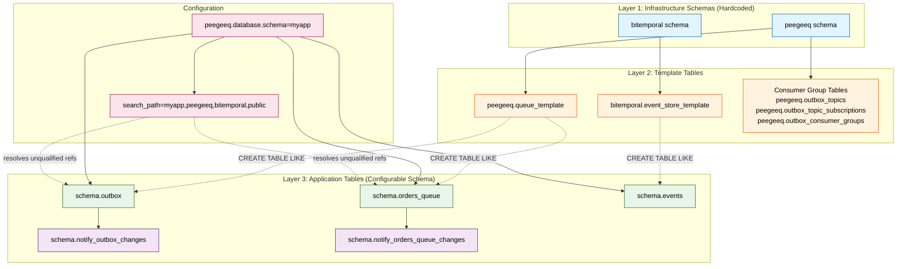

# PeeGeeQ Schema Configuration Design

**Version:** 1.1 (Current Implementation Baseline)
**Date:** December 21, 2025
**Author:** Mark Andrew Ray-Smith Cityline Ltd
**Status:** As-Implemented Documentation (Baseline for Future Improvements)

---

## Document History

| Version | Date | Description |
|---------|------|-------------|
| 1.0 | 2025-12-21 | Initial design document (aspirational) |
| 1.1 | 2025-12-21 | **Updated to reflect actual implementation** - corrected class names, schema defaults, search_path behavior |
| 1.1.1 | 2025-12-21 | **CRITICAL BUG IDENTIFIED** - base templates create infrastructure tables in hardcoded `peegeeq` schema, breaking multi-tenant isolation |

**Purpose of v1.1**: This document now accurately reflects the **current implementation** as a baseline before any code changes. Future improvements will be tracked against this baseline.

**CRITICAL ISSUE DISCOVERED**: The current implementation has a fundamental bug that breaks the intended multi-tenant schema isolation design (see Critical Bug section below).


---

## CRITICAL BUG: Broken Multi-Tenant Schema Isolation

### The Problem

**The current implementation VIOLATES the fundamental design principle of schema-based multi-tenancy.**

#### Intended Design (Multi-Tenant Isolation)

Each application schema should be **completely self-contained and isolated**:

```
myappschema1/
  ├── queue_template (template table)
  ├── event_store_template (template table)
  ├── outbox_topics (infrastructure - ISOLATED to myappschema1)
  ├── outbox_topic_subscriptions (infrastructure - ISOLATED to myappschema1)
  ├── outbox_consumer_groups (infrastructure - ISOLATED to myappschema1)
  ├── queue_messages (application table)
  ├── outbox (application table)
  └── orders_queue (application table)

myappschema2/
  ├── queue_template (template table)
  ├── event_store_template (template table)
  ├── outbox_topics (infrastructure - ISOLATED to myappschema2)
  ├── outbox_topic_subscriptions (infrastructure - ISOLATED to myappschema2)
  ├── outbox_consumer_groups (infrastructure - ISOLATED to myappschema2)
  ├── queue_messages (application table)
  ├── outbox (application table)
  └── orders_queue (application table)
```

**Configuration for complete isolation:**
```properties
# App 1 - completely isolated
peegeeq.database.schema=myappschema1

# App 2 - completely isolated
peegeeq.database.schema=myappschema2
```

**Benefits:**
- Complete data isolation between tenants
- Separate database users with permissions ONLY to their schema
- Independent backup/restore per tenant
- Schema-level security and authorization

#### Actual Implementation (BROKEN)

**Current state creates SHARED infrastructure tables:**

```
peegeeq/  ← SHARED across ALL applications!
  ├── queue_template (template)
  ├── outbox_topics (SHARED - breaks isolation!)
  ├── outbox_topic_subscriptions (SHARED - breaks isolation!)
  └── outbox_consumer_groups (SHARED - breaks isolation!)

bitemporal/  ← SHARED across ALL applications!
  └── event_store_template (template)

myappschema1/
  ├── queue_messages (isolated)
  ├── outbox (isolated)
  └── orders_queue (isolated)

myappschema2/
  ├── queue_messages (isolated)
  ├── outbox (isolated)
  └── orders_queue (isolated)
```

**Problem:** All applications share the same `peegeeq.outbox_topics`, `peegeeq.outbox_topic_subscriptions`, and `peegeeq.outbox_consumer_groups` tables, breaking tenant isolation!

### Root Cause

**File:** `peegeeq-db/src/main/resources/db/templates/base/08a-consumer-table-topics.sql`

```sql
-- WRONG: Hardcoded schema
CREATE TABLE IF NOT EXISTS peegeeq.outbox_topics (
    id BIGSERIAL PRIMARY KEY,
    topic VARCHAR(255) NOT NULL UNIQUE,
    ...
);
```

**Should be:**
```sql
-- CORRECT: Parameterized schema
CREATE TABLE IF NOT EXISTS {schema}.outbox_topics (
    id BIGSERIAL PRIMARY KEY,
    topic VARCHAR(255) NOT NULL UNIQUE,
    ...
);
```

**Same issue in:**
- `08a-consumer-table-topics.sql` - creates `peegeeq.outbox_topics`
- `08b-consumer-table-subscriptions.sql` - creates `peegeeq.outbox_topic_subscriptions`
- `08c-consumer-table-groups.sql` - creates `peegeeq.outbox_consumer_groups`
- `08d-consumer-table-ledger.sql` - creates `peegeeq.processed_ledger`
- `08e-consumer-table-index.sql` - creates `peegeeq.consumer_group_index`

**File:** `peegeeq-db/src/main/java/dev/mars/peegeeq/db/setup/PeeGeeQDatabaseSetupService.java` (line 275)

```java
// WRONG: No schema parameter passed
return templateProcessor.applyTemplateReactive(connection, "base", Map.of())
```

**Should be:**
```java
// CORRECT: Pass schema parameter
return templateProcessor.applyTemplateReactive(connection, "base",
    Map.of("schema", request.getDatabaseConfig().getSchema()))
```

**File:** `peegeeq-db/src/main/java/dev/mars/peegeeq/db/setup/PeeGeeQDatabaseSetupService.java` (line 401-402)

```java
// WRONG: Hardcoded schema verification
EXISTS (SELECT 1 FROM information_schema.tables WHERE table_schema = 'peegeeq' AND table_name = 'queue_template')
EXISTS (SELECT 1 FROM information_schema.tables WHERE table_schema = 'bitemporal' AND table_name = 'event_store_template')
```

**Should be:**
```java
// CORRECT: Verify templates in configured schema
EXISTS (SELECT 1 FROM information_schema.tables WHERE table_schema = ? AND table_name = 'queue_template')
EXISTS (SELECT 1 FROM information_schema.tables WHERE table_schema = ? AND table_name = 'event_store_template')
```

### Impact

**Security:** Multiple tenants can see each other's topic configurations, subscriptions, and consumer group state

**Data Leakage:** Consumer groups from different tenants share the same tracking tables

**Authorization:** Cannot implement schema-level database permissions for tenant isolation

**Multi-Tenancy:** Completely broken - all tenants share infrastructure tables

### Required Fix

1. **Update base template SQL files** to use `{schema}` parameter:
   - `08a-consumer-table-topics.sql`
   - `08b-consumer-table-subscriptions.sql`
   - `08c-consumer-table-groups.sql`
   - `08d-consumer-table-ledger.sql`
   - `08e-consumer-table-index.sql`
   - `05-queue-template.sql`
   - `06-event-store-template.sql`
   - All index files (07a-07o, 09a-09e)

2. **Update `PeeGeeQDatabaseSetupService.applyBaseTemplates()`** to pass schema parameter:
   ```java
   Map<String, String> params = Map.of("schema", request.getDatabaseConfig().getSchema());
   return templateProcessor.applyTemplateReactive(connection, "base", params)
   ```

3. **Update `verifyTemplatesExist()`** to check configured schema instead of hardcoded `peegeeq`/`bitemporal`

4. **Remove hardcoded schema creation** (`03-schemas.sql`, `03b-schemas.sql`) - schemas should be created by application, not PeeGeeQ

5. **Update documentation** to reflect that `peegeeq` and `bitemporal` are NOT special schemas, just naming conventions

### Correct Architecture

**Template schemas are NOT special - they're just the configured schema:**

```properties
# Each tenant gets their own complete PeeGeeQ installation
peegeeq.database.schema=tenant1
peegeeq.database.schema=tenant2
peegeeq.database.schema=tenant3
```

**Each schema contains:**
- Template tables (`queue_template`, `event_store_template`)
- Infrastructure tables (`outbox_topics`, `outbox_topic_subscriptions`, `outbox_consumer_groups`)
- Application tables (`queue_messages`, `outbox`, custom queues)

**No shared infrastructure - complete isolation.**


---

## Table of Contents

- [Executive Summary](#executive-summary)
- [Schema Architecture Overview](#schema-architecture-overview)
- [Schema Types and Purposes](#schema-types-and-purposes)
- [Schema Configuration Flow](#schema-configuration-flow)
- [Template-Based Schema Creation](#template-based-schema-creation)
- [Connection Management and search_path](#connection-management-and-searchpath)
- [Configuration Sources](#configuration-sources)
- [Production vs Test Schema Setup](#production-vs-test-schema-setup)
- [Multi-Tenant and Custom Schema Support](#multi-tenant-and-custom-schema-support)
- [Schema Isolation and Security](#schema-isolation-and-security)
- [Troubleshooting and Common Issues](#troubleshooting-and-common-issues)

---

## Executive Summary

PeeGeeQ is designed with **flexible schema configuration** as a core architectural principle. The system supports deployment to **any PostgreSQL schema**, enabling multi-tenant deployments, namespace isolation, and integration with existing databases.

### Key Design Principles

1. **Schema Flexibility**: PeeGeeQ can be deployed to any schema (not just `public`)
2. **Single-Schema Per Tenant**: Each tenant/application gets a complete PeeGeeQ installation in their own schema
3. **Template-Based Creation**: Uses template tables within the same schema for `CREATE TABLE LIKE` operations
4. **Default Schema Configuration**: Schema parameter defaults to `"public"` if not explicitly configured
5. **search_path Configuration**: Connections set `search_path` to the **literal configured schema value**
6. **Complete Isolation**: All tables (templates, infrastructure, application) reside in the configured schema

**IMPORTANT**: The current implementation is BROKEN and violates principle #2 and #6 (see Critical Bug section above).

### Critical Understanding

**The schema parameter serves TWO distinct purposes:**

1. **Infrastructure Setup**: Where to create template tables (`peegeeq.queue_template`, `bitemporal.event_store_template`)
2. **Application Tables**: Where to create actual queue/event store tables (e.g., `public.outbox`, `myapp.orders_queue`)

---

## Schema Architecture Overview

### Three-Layer Schema Model



**Legend:**
- **Blue boxes**: Hardcoded infrastructure schemas (peegeeq, bitemporal)
- **Orange boxes**: Template tables and consumer group tables
- **Green boxes**: Application tables (created in configurable schema)
- **Purple boxes**: Trigger functions (created in same schema as tables)
- **Pink boxes**: Configuration parameters
- **Solid arrows**: Direct creation/ownership
- **Dotted arrows**: Template inheritance or resolution

### Why This Design?

**Problem**: PostgreSQL's `CREATE TABLE LIKE` requires the template table to exist in a known location.

**Solution**:
- **Hardcoded schemas** (`peegeeq`, `bitemporal`) provide stable locations for templates
- **Configurable schema** parameter allows flexible deployment of actual tables
- **Template inheritance** (`LIKE peegeeq.queue_template INCLUDING ALL`) ensures consistency

**Benefits**:
- Multi-tenant deployments: Each tenant gets tables in their own schema
- Namespace isolation: Multiple applications can coexist in same database
- Security segregation: Different schemas can have different permissions
- Schema-based sharding: Horizontal scaling using schema partitioning

---

## Schema Types and Purposes

### 1. Infrastructure Schemas (Hardcoded)

#### `peegeeq` Schema

**Purpose**: Queue infrastructure and consumer group management

**Contains**:
- `queue_template` - Template for all queue tables
- `outbox_topics` - Topic registry for consumer groups
- `outbox_topic_subscriptions` - Consumer group subscriptions
- `outbox_consumer_groups` - Consumer group metadata
- `processed_ledger` - Message processing tracking
- `consumer_group_index` - Consumer group indexing

**Created by**: `base/03-schemas.sql`

**Why hardcoded?**
- Consumer group tables are shared across all queues
- Template tables must be in predictable location
- Provides stable reference point for `CREATE TABLE LIKE`

#### `bitemporal` Schema

**Purpose**: Bi-temporal event sourcing infrastructure

**Contains**:
- `event_store_template` - Template for all event store tables

**Created by**: `base/03b-schemas.sql`

**Why hardcoded?**
- Event store template must be in predictable location
- Separates event sourcing from queue operations
- Enables independent backup/restore strategies

### 2. Application Schemas (Configurable)

**Purpose**: Actual queue and event store tables used by applications

**Configured via**: `peegeeq.database.schema` property

**Default value**: `public`

**Examples**:
- `public.outbox` - Default outbox table
- `myapp.orders_queue` - Custom queue in myapp schema
- `tenant_a.outbox` - Multi-tenant outbox
- `acme_messaging.events` - Namespace-isolated event store

**Created by**: `queue/` and `eventstore/` templates with `{schema}` parameter

---

## Schema Configuration Flow

### Initial Setup (First Time)

```
1. Database Creation
   └─> CREATE DATABASE myapp_db

2. Base Template Application (via PeeGeeQDatabaseSetupService)
   ├─> Execute base/.manifest files in order:
   │   ├─> 01a-extension-uuid.sql        (CREATE EXTENSION uuid-ossp)
   │   ├─> 01b-extension-pgstat.sql      (CREATE EXTENSION pg_stat_statements)
   │   ├─> 03-schemas.sql                (CREATE SCHEMA peegeeq)
   │   ├─> 03b-schemas.sql               (CREATE SCHEMA bitemporal)
   │   ├─> 04-search-path.sql            (SET search_path TO peegeeq, bitemporal, public)
   │   ├─> 05-queue-template.sql         (CREATE TABLE peegeeq.queue_template)
   │   ├─> 06-event-store-template.sql   (CREATE TABLE bitemporal.event_store_template)
   │   ├─> 07a-07o (template indexes)
   │   ├─> 08a-08e (consumer group tables in peegeeq schema)
   │   └─> 09a-09e (consumer group indexes)

3. Queue Table Creation (per queue)
   └─> Execute queue/.manifest with parameters {queueName, schema}:
       ├─> 01-table.sql                  (CREATE TABLE {schema}.{queueName} LIKE peegeeq.queue_template)
       ├─> 02a-02e (queue-specific indexes)
       ├─> 03-function.sql               (CREATE FUNCTION {schema}.notify_{queueName}_changes())
       └─> 04-trigger.sql                (CREATE TRIGGER on {schema}.{queueName})

4. Event Store Table Creation (per event store)
   └─> Execute eventstore/.manifest with parameters {tableName, schema, notificationPrefix}:
       ├─> 01-table.sql                  (CREATE TABLE {schema}.{tableName} LIKE bitemporal.event_store_template)
       ├─> 02a-02j (event store indexes)
       ├─> 03-function.sql               (CREATE FUNCTION {schema}.notify_{tableName}_events())
       └─> 04-trigger.sql                (CREATE TRIGGER on {schema}.{tableName})
```


### Client Connection Flow

```
1. Application Startup
   └─> Load configuration (application.properties, environment variables, etc.)
       └─> peegeeq.database.schema = "myapp"

2. Connection Pool Initialization (PgConnectionManager)
   ├─> Create HikariDataSource with base connection properties
   └─> Configure connection initialization SQL:
       └─> SET search_path TO {schema}, peegeeq, bitemporal, public

3. Every Connection Checkout
   └─> HikariCP executes: SET search_path TO myapp, peegeeq, bitemporal, public
       ├─> Unqualified table references resolve to myapp schema first
       ├─> Template references (peegeeq.queue_template) remain qualified
       └─> Consumer group tables (peegeeq.outbox_topics) remain qualified

4. Queue/EventStore Factory Usage
   ├─> PgNativeQueueFactory.createQueue("orders")
   │   └─> Uses schema from PgConnectionManager configuration
   │       └─> Creates/accesses myapp.orders table
   └─> BiTemporalEventStoreFactory.createEventStore("events")
       └─> Uses schema from PgConnectionManager configuration
           └─> Creates/accesses myapp.events table
```

---

## Template-Based Schema Creation

### Template Inheritance Pattern

PeeGeeQ uses PostgreSQL's `CREATE TABLE LIKE ... INCLUDING ALL` to ensure consistency:

```sql
-- Template table (in hardcoded schema)
CREATE TABLE peegeeq.queue_template (
    id UUID PRIMARY KEY DEFAULT uuid_generate_v4(),
    topic VARCHAR(255) NOT NULL,
    payload JSONB NOT NULL,
    -- ... 20+ columns
);

-- Actual table (in configurable schema)
CREATE TABLE {schema}.{queueName} (
    LIKE peegeeq.queue_template INCLUDING ALL
);
```

**What gets inherited:**
- Column definitions (names, types, constraints)
- Default values (e.g., `DEFAULT uuid_generate_v4()`)
- NOT NULL constraints
- CHECK constraints
- Column storage parameters

**What does NOT get inherited:**
- Indexes (created separately via 02a-02e templates)
- Triggers (created separately via 04-trigger.sql)
- Foreign keys (not used in PeeGeeQ)

### Template Parameter Substitution

**SqlTemplateProcessor** performs string replacement on template files:

```java
Map<String, String> params = Map.of(
    "queueName", "orders",
    "schema", "myapp"
);

String sql = templateProcessor.processTemplate("queue/01-table.sql", params);
// Result: CREATE TABLE myapp.orders (LIKE peegeeq.queue_template INCLUDING ALL);
```

**Available parameters:**

| Parameter | Used In | Example Value | Description |
|-----------|---------|---------------|-------------|
| `{schema}` | queue/, eventstore/ | `myapp` | Target schema for table creation |
| `{queueName}` | queue/ | `orders` | Queue table name |
| `{tableName}` | eventstore/ | `events` | Event store table name |
| `{notificationPrefix}` | eventstore/ | `events` | Prefix for NOTIFY channel |

### Trigger Function Schema Placement

**Critical Design Decision**: Trigger functions are created in the **same schema as the table**.

```sql
-- Function in application schema (NOT peegeeq schema)
CREATE OR REPLACE FUNCTION {schema}.notify_{queueName}_changes()
RETURNS TRIGGER AS $$
BEGIN
    PERFORM pg_notify('{queueName}_changes', NEW.id::text);
    RETURN NEW;
END;
$$ LANGUAGE plpgsql;

-- Trigger references function in same schema
CREATE TRIGGER {queueName}_notify_trigger
AFTER INSERT OR UPDATE ON {schema}.{queueName}
FOR EACH ROW EXECUTE FUNCTION {schema}.notify_{queueName}_changes();
```

**Why same schema?**
- Avoids cross-schema function references
- Simplifies permission management
- Enables schema-level backup/restore
- Supports schema-based multi-tenancy

---

## Connection Management and search_path

### search_path Configuration

**Current Implementation**: `PgConnectionManager` sets `search_path` to the **literal configured schema value**.

**How it works:**

1. **Configuration**: User specifies schema via `peegeeq.database.schema` property (defaults to `"public"`)
2. **Connection Setup**: `PgConnectionManager` stores the literal schema value per service ID
3. **Per-Connection Enforcement**: Every connection executes `SET search_path TO {configured_schema}`
4. **Multi-Schema Support**: User can configure comma-separated schemas for multi-schema access

**Example - Single Schema:**
```java
// Configuration
PgConnectionConfig config = new PgConnectionConfig.Builder()
    .schema("myapp")
    .build();

// PgConnectionManager sets on every connection:
// SET search_path TO myapp
```

**Example - Multi-Schema (Required for Infrastructure Access):**
```java
// Configuration for accessing both application and infrastructure tables
PgConnectionConfig config = new PgConnectionConfig.Builder()
    .schema("myapp,peegeeq,bitemporal,public")
    .build();

// PgConnectionManager sets on every connection:
// SET search_path TO myapp, peegeeq, bitemporal, public
```

**CRITICAL**: If your application uses `TopicConfigService`, `SubscriptionService`, or consumer groups, you **must** include `peegeeq` in your schema configuration because these services use unqualified references to tables in the `peegeeq` schema (e.g., `outbox_topics`, `outbox_topic_subscriptions`).

### Schema Resolution Order

When executing unqualified SQL (e.g., `SELECT * FROM orders`) with `schema="myapp,peegeeq,bitemporal,public"`:

1. **First**: Search in `myapp` schema
2. **Second**: Search in `peegeeq` schema (for consumer group tables)
3. **Third**: Search in `bitemporal` schema (for event store templates)
4. **Fourth**: Search in `public` schema (PostgreSQL default)

**Note**: If you configure `schema="myapp"` (single schema), only the `myapp` schema will be searched, and queries to infrastructure tables will fail unless you use fully qualified names.

### Qualified vs Unqualified References

**Unqualified** (resolved via search_path):
```sql
INSERT INTO orders (topic, payload) VALUES ('order.created', '{}');
-- Resolves to: myapp.orders
```

**Qualified** (explicit schema):
```sql
CREATE TABLE myapp.orders (LIKE peegeeq.queue_template INCLUDING ALL);
-- Always uses peegeeq.queue_template regardless of search_path
```

### Why search_path is Critical

**Scenario 1: Single schema configuration (schema="myapp")**
```sql
SET search_path TO myapp;
SELECT * FROM orders;  -- SUCCESS: Resolves to myapp.orders
SELECT * FROM outbox_topics;  -- ERROR: relation "outbox_topics" does not exist
```

**Scenario 2: Multi-schema configuration (schema="myapp,peegeeq,bitemporal,public")**
```sql
SET search_path TO myapp, peegeeq, bitemporal, public;
SELECT * FROM orders;  -- SUCCESS: Resolves to myapp.orders
SELECT * FROM outbox_topics;  -- SUCCESS: Resolves to peegeeq.outbox_topics
```

**Best Practice**: Always use fully qualified table names in application code to avoid search_path ambiguity:
```sql
-- Recommended: Explicit schema qualification
SELECT * FROM myapp.orders;
SELECT * FROM peegeeq.outbox_topics;
```


---

## Configuration Sources

### 1. Application Properties (Spring Boot)

**File**: `application.properties` or `application.yml`

```properties
# Database connection
peegeeq.database.host=localhost
peegeeq.database.port=5432
peegeeq.database.name=myapp_db
peegeeq.database.username=myapp_user
peegeeq.database.password=secret

# Schema configuration (defaults to "public" if not specified)
# For single schema:
peegeeq.database.schema=myapp

# For multi-schema (required for TopicConfigService/SubscriptionService):
peegeeq.database.schema=myapp,peegeeq,bitemporal,public

# Connection pool
peegeeq.database.pool.max-size=32
peegeeq.database.pool.min-size=5
```

**Loaded by**: `PeeGeeQConfiguration.getDatabaseConfig()` returns `PgConnectionConfig` instance

### 2. Environment Variables

```bash
export PEEGEEQ_DATABASE_HOST=localhost
export PEEGEEQ_DATABASE_PORT=5432
export PEEGEEQ_DATABASE_NAME=myapp_db
export PEEGEEQ_DATABASE_USERNAME=myapp_user
export PEEGEEQ_DATABASE_PASSWORD=secret

# Single schema
export PEEGEEQ_DATABASE_SCHEMA=myapp

# Multi-schema (for infrastructure access)
export PEEGEEQ_DATABASE_SCHEMA=myapp,peegeeq,bitemporal,public
```

**Spring Boot mapping**: Automatically maps `PEEGEEQ_DATABASE_SCHEMA` to `peegeeq.database.schema`
**Default**: If not set, defaults to `"public"`

### 3. Programmatic Configuration (Non-Spring)

```java
// Single schema configuration
PgConnectionConfig config = new PgConnectionConfig.Builder()
    .host("localhost")
    .port(5432)
    .database("myapp_db")
    .username("myapp_user")
    .password("secret")
    .schema("myapp")  // Optional, defaults to null (uses PostgreSQL default)
    .build();

// Multi-schema configuration (for infrastructure access)
PgConnectionConfig config = new PgConnectionConfig.Builder()
    .host("localhost")
    .port(5432)
    .database("myapp_db")
    .username("myapp_user")
    .password("secret")
    .schema("myapp,peegeeq,bitemporal,public")  // Required for TopicConfigService
    .build();

PgConnectionManager connectionManager = new PgConnectionManager(vertx);
connectionManager.getOrCreateReactivePool("myservice", config, poolConfig);
```

### 4. Test Configuration

**JUnit 5 with TestContainers**:

```java
@RegisterExtension
static SharedPostgresExtension postgres = new SharedPostgresExtension();

@Test
void testWithCustomSchema() {
    PgConnectionConfig config = postgres.createConfig();

    // Override schema if needed (defaults to "public")
    PgConnectionConfig customConfig = new PgConnectionConfig.Builder()
        .host(config.getHost())
        .port(config.getPort())
        .database(config.getDatabase())
        .username(config.getUsername())
        .password(config.getPassword())
        .schema("test_schema,peegeeq,bitemporal,public")  // Multi-schema for full functionality
        .build();

    PgConnectionManager connectionManager = new PgConnectionManager(vertx);
    connectionManager.getOrCreateReactivePool("test", customConfig, poolConfig);
    // ...
}
```

### Configuration Validation

**PgConnectionConfig** validation (current implementation):

```java
// In PgConnectionConfig.Builder.build()
private PgConnectionConfig(Builder builder) {
    this.host = Objects.requireNonNull(builder.host, "Host cannot be null");
    this.port = builder.port;
    this.database = Objects.requireNonNull(builder.database, "Database cannot be null");
    this.username = Objects.requireNonNull(builder.username, "Username cannot be null");
    this.password = builder.password;
    this.schema = builder.schema;  // Can be null - no validation
    this.sslEnabled = builder.sslEnabled;
}
```

**Validation occurs**:
- At `PgConnectionConfig.Builder.build()` - validates host, database, username (NOT schema)
- Schema parameter is **optional** and can be null or blank
- If null/blank, PostgreSQL uses its default search_path

**PeeGeeQConfiguration default**:
```java
// In PeeGeeQConfiguration.getDatabaseConfig()
.schema(getString("peegeeq.database.schema", "public"))  // Defaults to "public"
```

---

## Schema Configuration Requirements

### Intended Design (Currently BROKEN - See Critical Bug Above)

**Single Schema Configuration:**

```properties
# Each tenant/application uses ONE schema containing ALL PeeGeeQ tables
peegeeq.database.schema=myapp
```

**What should be in `myapp` schema:**
- Template tables: `queue_template`, `event_store_template`
- Infrastructure tables: `outbox_topics`, `outbox_topic_subscriptions`, `outbox_consumer_groups`
- Application tables: `queue_messages`, `outbox`, custom queues/event stores

**All features work with single schema because:**
- `TopicConfigService` queries `outbox_topics` → resolves to `myapp.outbox_topics`
- `SubscriptionService` queries `outbox_topic_subscriptions` → resolves to `myapp.outbox_topic_subscriptions`
- Consumer groups query `outbox_consumer_groups` → resolves to `myapp.outbox_consumer_groups`
- All tables in same schema, no cross-schema dependencies

### Current Broken Implementation

**Due to the bug documented above, the current implementation requires:**

```properties
# WORKAROUND: Include hardcoded peegeeq schema to access shared infrastructure tables
peegeeq.database.schema=myapp,peegeeq
```

**Why this is wrong:**
- Creates shared `peegeeq.outbox_topics` table across all tenants
- Breaks multi-tenant isolation
- Prevents schema-level security
- Violates single-schema design principle

**This workaround should NOT be used - the bug must be fixed instead.**


---

## Production vs Test Schema Setup

### Production Setup

**Approach**: Use Flyway/Liquibase migrations or manual SQL scripts

```sql
-- 1. Create database
CREATE DATABASE production_db;

-- 2. Run base templates (one-time setup)
\i peegeeq-db/src/main/resources/db/templates/base/01a-extension-uuid.sql
\i peegeeq-db/src/main/resources/db/templates/base/01b-extension-pgstat.sql
\i peegeeq-db/src/main/resources/db/templates/base/03-schemas.sql
\i peegeeq-db/src/main/resources/db/templates/base/03b-schemas.sql
-- ... (all base templates)

-- 3. Create application schema
CREATE SCHEMA production_app;

-- 4. Run queue/eventstore templates with schema parameter
-- (via PeeGeeQDatabaseSetupService or manual substitution)
```

**Configuration (Single Schema)**:
```properties
peegeeq.database.schema=production_app
```

**Configuration (Multi-Schema for Infrastructure Access)**:
```properties
peegeeq.database.schema=production_app,peegeeq,bitemporal,public
```

### Test Setup

**Approach**: Use TestContainers with automatic setup

```java
@RegisterExtension
static SharedPostgresExtension postgres = new SharedPostgresExtension();

@BeforeAll
static void setupDatabase() {
    // TestContainers automatically:
    // 1. Starts PostgreSQL container
    // 2. Creates database
    // 3. Runs base templates (creates peegeeq and bitemporal schemas)
    // 4. Creates tables in "public" schema (default)
}
```

**Default configuration**:
```properties
# Single schema (application tables only)
peegeeq.database.schema=public

# Multi-schema (for TopicConfigService/SubscriptionService)
peegeeq.database.schema=public,peegeeq,bitemporal
```

### Key Differences

| Aspect | Production | Test |
|--------|-----------|------|
| Schema | Custom (e.g., `production_app`) | `public` (default) |
| Setup | Manual migrations | Automatic (TestContainers) |
| Lifecycle | Persistent | Ephemeral (container destroyed after tests) |
| Isolation | Schema-based multi-tenancy | Container-based isolation |
| Performance | Optimized indexes | Minimal indexes for speed |

---

## Multi-Tenant and Custom Schema Support

### Multi-Tenant Deployment Patterns

#### Pattern 1: Schema-per-Tenant

**Architecture**:
```
Database: saas_platform
├── Schema: tenant_acme
│   ├── outbox
│   ├── orders_queue
│   └── events
├── Schema: tenant_globex
│   ├── outbox
│   ├── orders_queue
│   └── events
└── Shared schemas:
    ├── peegeeq (templates + consumer groups)
    └── bitemporal (templates)
```

**Configuration per tenant**:
```java
// Tenant A connection
PgDatabaseConfig tenantAConfig = config.toBuilder()
    .schema("tenant_acme")
    .build();

// Tenant B connection
PgDatabaseConfig tenantBConfig = config.toBuilder()
    .schema("tenant_globex")
    .build();
```

**Benefits**:
- Strong data isolation
- Per-tenant backup/restore
- Per-tenant schema migrations
- Easy tenant offboarding (DROP SCHEMA CASCADE)

**Drawbacks**:
- Connection pool per tenant
- Higher memory usage
- Complex connection routing

#### Pattern 2: Database-per-Tenant

**Architecture**:
```
Database: tenant_acme_db
├── Schema: public (application tables)
├── Schema: peegeeq (templates)
└── Schema: bitemporal (templates)

Database: tenant_globex_db
├── Schema: public (application tables)
├── Schema: peegeeq (templates)
└── Schema: bitemporal (templates)
```

**Configuration per tenant**:
```java
// Tenant A connection
PgDatabaseConfig tenantAConfig = PgDatabaseConfig.builder()
    .url("jdbc:postgresql://localhost:5432/tenant_acme_db")
    .schema("public")
    .build();

// Tenant B connection
PgDatabaseConfig tenantBConfig = PgDatabaseConfig.builder()
    .url("jdbc:postgresql://localhost:5432/tenant_globex_db")
    .schema("public")
    .build();
```

**Benefits**:
- Maximum isolation (database-level)
- Simpler schema management (always use `public`)
- Independent database tuning per tenant

**Drawbacks**:
- Higher resource usage (separate databases)
- More complex backup strategies
- Duplicate template schemas


### Custom Schema Naming Strategies

#### Domain-Based Schemas

```
Database: enterprise_platform
├── Schema: finance_app
│   ├── payment_queue
│   ├── invoice_queue
│   └── transaction_events
├── Schema: inventory_app
│   ├── stock_queue
│   ├── order_queue
│   └── inventory_events
└── Shared schemas:
    ├── peegeeq
    └── bitemporal
```

**Use case**: Separate business domains in same database

#### Environment-Based Schemas

```
Database: myapp_db
├── Schema: dev_myapp
├── Schema: staging_myapp
├── Schema: prod_myapp
└── Shared schemas:
    ├── peegeeq
    └── bitemporal
```

**Use case**: Multiple environments in same database (not recommended for production)

#### Feature-Based Schemas

```
Database: platform_db
├── Schema: messaging_v1
├── Schema: messaging_v2 (blue-green deployment)
├── Schema: analytics
└── Shared schemas:
    ├── peegeeq
    └── bitemporal
```

**Use case**: Feature flags, A/B testing, blue-green deployments

---

## Schema Isolation and Security

### Permission Management

**Principle**: Grant minimal permissions per schema

```sql
-- Create application role
CREATE ROLE myapp_user LOGIN PASSWORD 'secret';

-- Grant usage on schemas
GRANT USAGE ON SCHEMA myapp TO myapp_user;
GRANT USAGE ON SCHEMA peegeeq TO myapp_user;
GRANT USAGE ON SCHEMA bitemporal TO myapp_user;

-- Grant table permissions in application schema
GRANT SELECT, INSERT, UPDATE, DELETE ON ALL TABLES IN SCHEMA myapp TO myapp_user;
ALTER DEFAULT PRIVILEGES IN SCHEMA myapp GRANT SELECT, INSERT, UPDATE, DELETE ON TABLES TO myapp_user;

-- Grant read-only access to template tables
GRANT SELECT ON peegeeq.queue_template TO myapp_user;
GRANT SELECT ON bitemporal.event_store_template TO myapp_user;

-- Grant access to consumer group tables
GRANT SELECT, INSERT, UPDATE, DELETE ON ALL TABLES IN SCHEMA peegeeq TO myapp_user;
```

### Row-Level Security (RLS)

**Use case**: Multi-tenant schema with row-level isolation

```sql
-- Enable RLS on queue table
ALTER TABLE myapp.orders ENABLE ROW LEVEL SECURITY;

-- Create policy for tenant isolation
CREATE POLICY tenant_isolation ON myapp.orders
    USING (headers->>'tenant_id' = current_setting('app.tenant_id'));

-- Set tenant context per connection
SET app.tenant_id = 'tenant_acme';
```

### Schema-Level Backup and Restore

**Backup single schema**:
```bash
pg_dump -h localhost -U postgres -n myapp -n peegeeq -n bitemporal myapp_db > myapp_backup.sql
```

**Restore single schema**:
```bash
psql -h localhost -U postgres myapp_db < myapp_backup.sql
```

**Benefits**:
- Tenant-specific backups
- Faster backup/restore cycles
- Selective data recovery

---

## Troubleshooting and Common Issues

### Issue 1: "relation does not exist" Error

**Symptom**:
```
ERROR: relation "orders" does not exist
```

**Cause**: search_path not configured to include the schema containing the table

**Diagnosis**:
```sql
-- Check current search_path
SHOW search_path;

-- Verify table exists in correct schema
SELECT schemaname, tablename FROM pg_tables WHERE tablename = 'orders';
```

**Solution**:
```properties
# If table is in myapp schema, configure:
peegeeq.database.schema=myapp

# Or use fully qualified table name in SQL:
SELECT * FROM myapp.orders;
```

**Prevention**:
- Configure `peegeeq.database.schema` to include all schemas your application needs
- Use fully qualified table names (schema.table) in application code

### Issue 2: Template Table Not Found

**Symptom**:
```
ERROR: relation "peegeeq.queue_template" does not exist
```

**Cause**: Base templates not executed

**Solution**:
```java
// Run complete database setup (includes base templates)
DatabaseSetupService setupService = new PeeGeeQDatabaseSetupService(...);
DatabaseSetupRequest request = new DatabaseSetupRequest.Builder()
    .setupId("myapp")
    .databaseConfig(databaseConfig)
    .addQueue(queueConfig)
    .build();

setupService.createCompleteSetup(request)
    .toCompletableFuture()
    .get();
```

**Prevention**: Always run `createCompleteSetup()` before creating queues/event stores

### Issue 3: Trigger Function in Wrong Schema

**Symptom**:
```
ERROR: function notify_orders_changes() does not exist
HINT: No function matches the given name and argument types. You might need to add explicit type casts.
```

**Cause**: Trigger function created in wrong schema or search_path issue

**Solution**:
```sql
-- Check where function exists
SELECT n.nspname, p.proname
FROM pg_proc p
JOIN pg_namespace n ON p.pronamespace = n.oid
WHERE p.proname LIKE '%notify%';

-- Drop and recreate in correct schema
DROP FUNCTION IF EXISTS myapp.notify_orders_changes() CASCADE;
-- Re-run queue template with correct schema parameter
```

**Prevention**: Always use qualified function names in trigger definitions

### Issue 4: TopicConfigService Fails with "relation outbox_topics does not exist"

**Symptom**:
```
ERROR: relation "outbox_topics" does not exist
```

**Cause**: CRITICAL BUG - base templates create `peegeeq.outbox_topics` instead of `{schema}.outbox_topics`

**Root Cause**: See "CRITICAL BUG: Broken Multi-Tenant Schema Isolation" section above

**Temporary Workaround** (NOT RECOMMENDED):
```properties
# Include peegeeq schema to access shared infrastructure tables
peegeeq.database.schema=myapp,peegeeq
```

**Proper Solution**: Fix the bug by:
1. Updating base template SQL files to use `{schema}` parameter
2. Passing schema parameter when applying base templates
3. Creating all infrastructure tables in the configured schema

**DO NOT use the workaround in production** - it breaks multi-tenant isolation!

### Issue 5: Consumer Group Tables Not Accessible

**Symptom**:
```
ERROR: permission denied for schema peegeeq
```

**Cause**: Application user lacks permissions on peegeeq schema

**Solution**:
```sql
GRANT USAGE ON SCHEMA peegeeq TO myapp_user;
GRANT SELECT, INSERT, UPDATE, DELETE ON ALL TABLES IN SCHEMA peegeeq TO myapp_user;
```

**Prevention**: Include permission grants in base template setup

### Issue 6: Multiple Schemas with Same Table Names

**Symptom**: Queries return data from wrong schema

**Example**:
```sql
-- Both schemas have "orders" table
CREATE TABLE public.orders (...);
CREATE TABLE myapp.orders (...);

-- Which table does this query use?
SELECT * FROM orders;
```

**Cause**: search_path ambiguity

**Solution**: Always use qualified table names when ambiguity exists
```sql
SELECT * FROM myapp.orders;  -- Explicit schema
```

**Prevention**: Avoid duplicate table names across schemas in search_path

### Issue 7: TestContainers Schema Mismatch

**Symptom**: Tests fail with "relation does not exist" but production works

**Cause**: Test uses `public` schema, production uses custom schema

**Solution**:
```java
@Test
void testWithProductionSchema() {
    PgDatabaseConfig config = postgres.createConfig()
        .toBuilder()
        .schema("myapp")  // Match production schema
        .build();

    // Create schema in test database
    try (Connection conn = DriverManager.getConnection(config.getUrl(), config.getUsername(), config.getPassword())) {
        conn.createStatement().execute("CREATE SCHEMA IF NOT EXISTS myapp");
    }

    // Now run tests...
}
```

**Prevention**: Use consistent schema names across environments or parameterize tests

---

## Summary and Best Practices

### Schema Configuration Checklist

- [ ] **Base templates executed**: `peegeeq` and `bitemporal` schemas created via `createCompleteSetup()`
- [ ] **Application schema created**: `CREATE SCHEMA myapp` (if using custom schema)
- [ ] **Configuration set**: Choose appropriate schema configuration:
  - Single schema: `peegeeq.database.schema=myapp`
  - Multi-schema: `peegeeq.database.schema=myapp,peegeeq,bitemporal,public`
- [ ] **Permissions granted**: Application user has access to all required schemas
- [ ] **search_path configured**: Set via `peegeeq.database.schema` property
- [ ] **Queue/EventStore tables created**: Using correct schema parameter
- [ ] **Trigger functions in correct schema**: Same schema as tables
- [ ] **Infrastructure access verified**: If using TopicConfigService/SubscriptionService, `peegeeq` must be in schema configuration

### Design Principles

1. **Separation of Concerns**: Infrastructure schemas (peegeeq, bitemporal) vs application schemas
2. **Template Inheritance**: Consistent table structure via `CREATE TABLE LIKE`
3. **Flexible Configuration**: Schema parameter defaults to `"public"`, supports comma-separated multi-schema
4. **Connection-Level Isolation**: search_path set per connection via literal configured value
5. **Schema Flexibility**: Support for multi-tenancy, namespacing, and custom deployments
6. **Explicit Over Implicit**: Use fully qualified table names (schema.table) in application code to avoid search_path ambiguity

### When to Use Custom Schemas

**Use custom schemas when:**
- Multi-tenant SaaS application (schema-per-tenant)
- Multiple applications in same database (namespace isolation)
- Domain-driven design (schema-per-bounded-context)
- Blue-green deployments (schema-per-version)
- Security requirements (schema-level permissions)

**Use public schema when:**
- Single-tenant application
- Simple deployment model
- Testing/development environments
- Quick prototyping

### Migration Path

**From public to custom schema:**

1. Create new schema: `CREATE SCHEMA myapp`
2. Copy data: `INSERT INTO myapp.orders SELECT * FROM public.orders`
3. Update configuration: `peegeeq.database.schema=myapp`
4. Restart application
5. Verify functionality
6. Drop old tables: `DROP TABLE public.orders`

**From custom schema to public:**

1. Copy data: `INSERT INTO public.orders SELECT * FROM myapp.orders`
2. Update configuration: `peegeeq.database.schema=public`
3. Restart application
4. Verify functionality
5. Drop old schema: `DROP SCHEMA myapp CASCADE`

---

## Conclusion

PeeGeeQ's schema configuration design provides **maximum flexibility** while maintaining **consistency and safety** through template-based table creation.

### Current State (As-Implemented - BROKEN)

**Configuration Class**: `PgConnectionConfig` (not `PgDatabaseConfig`)

**Schema Behavior**:
- Defaults to `"public"` if not configured
- Sets `search_path` to the **literal configured value**
- **CRITICAL BUG**: Base templates create infrastructure tables in hardcoded `peegeeq` schema instead of configured schema

**Current Broken Requirement**: Due to the bug, applications must configure:
```properties
# WORKAROUND (breaks multi-tenancy)
peegeeq.database.schema=myapp,peegeeq
```

**This is WRONG and must be fixed** - see Critical Bug section for details.

### Architecture Benefits (When Bug is Fixed)

The single-schema-per-tenant architecture enables:
- **Complete multi-tenant isolation**: Each tenant's data in separate schema
- **Schema-level security**: Database users with permissions only to their schema
- **Independent backup/restore**: Per-tenant schema backups
- **Namespace isolation**: No cross-tenant data leakage
- **Schema-based sharding**: Easy to move tenants to different databases

### Critical Understanding

**CORRECT (Intended Design):**
- Each schema is self-contained with ALL PeeGeeQ tables
- Template tables (`queue_template`, `event_store_template`) are in the SAME schema as application tables
- Infrastructure tables (`outbox_topics`, etc.) are in the SAME schema as application tables
- No cross-schema dependencies
- Complete isolation per schema

**INCORRECT (Current Broken Implementation):**
- ❌ `peegeeq` and `bitemporal` are NOT special shared schemas
- ❌ Infrastructure tables should NOT be in a separate `peegeeq` schema
- ❌ Multi-schema configuration (`schema=myapp,peegeeq`) should NOT be needed

### Required Fix

**The bug must be fixed to achieve the intended single-schema-per-tenant design.**

See "CRITICAL BUG: Broken Multi-Tenant Schema Isolation" section for:
- Detailed root cause analysis
- Required code changes
- Impact assessment
- Correct architecture
---

## Implementation Plan: Fixing Critical Multi-Tenant Bug

This plan details the steps to fix the "Critical Bug: Broken Multi-Tenant Schema Isolation" identified in Version 1.1.1. We will move all infrastructure and template tables from hardcoded schemas into the application-configured schema.

### 🛡️ Adherence to Coding Principles

1.  **TestContainers Mandatory**: Phase 1 and Phase 5 will rely entirely on TestContainers with the `-Pintegration-tests` profile. NO mocks or H2 will be used.
2.  **Modern Vert.x 5.x Patterns**: All changes to `PeeGeeQDatabaseSetupService` will use composable `.compose()`, `.onSuccess()`, and `.onFailure()` patterns.
3.  **Investigate Before Implementation**: Phase 1 establish a failing baseline to prove the isolation breach.
4.  **Incremental Validation**: Each phase will be followed by a test run. We will not move to Phase 3 until Phase 2 is verified.
5.  **Scan Logs**: Full `-X` Maven debug logs will be reviewed to ensure schema creation occurs in the correct namespace.

---

### Phase 1: Baseline Verification (Investigation)
**Goal**: Create an integration test that fails when attempting to isolate two tenants.

1.  **[NEW]** `SchemaIsolationIntegrationTest.java` in `peegeeq-db`:
    - Setup two distinct `DatabaseSetupRequest` objects with different schemas (`tenant_a`, `tenant_b`).
    - Run `createCompleteSetup()` for both.
    - **Verify Failure/Leak**: Assert that `tenant_a` can see `tenant_b`'s topic through the shared `peegeeq.outbox_topics` table.
    - Tag with `@Tag(TestCategories.INTEGRATION)`.

### Phase 2: Data Layer Parameterization (Templates)
**Goal**: Remove hardcoded schema references from SQL templates.

1.  **[MODIFY]** `peegeeq-db/src/main/resources/db/templates/base/`:
    - Update `05-queue-template.sql` and `06-event-store-template.sql` to use `{schema}.`.
    - Update `08a` through `08e` (consumer tables) to use `{schema}.`.
    - Update all index files (`07a-07o`, `09a-09e`) to use `{schema}.`.
2.  **[DELETE]** `03-schemas.sql` and `03b-schemas.sql`: Remove hardcoded schema creation logic.
3.  **[MODIFY]** `04-search-path.sql`: Update to `SET search_path TO {schema}, public;`.

### Phase 3: Logic Layer Alignment (Setup Service)
**Goal**: Update the setup service to pass parameters and verify correctly.

1.  **[MODIFY]** `PeeGeeQDatabaseSetupService.java`:
    - Update `applySchemaTemplatesAsync` to pass `Map.of("schema", schema)` to the "base" template processor.
    - Update `verifyTemplatesExist` to use parameterized queries checking the `schema` variable instead of `'peegeeq'`.
    - Ensure `applyMinimalCoreSchemaReactive` also uses the parameterized schema.

### Phase 4: Connection Layer Refinement
**Goal**: Ensure connections naturally resolve to the isolated schema.

1.  **[MODIFY]** `PgConnectionManager.java`:
    - Ensure `SET search_path` only targets the isolated schema (and optionally `public`).
    - Remove utility methods that assume the existence of a global `peegeeq` schema.
2.  **[MODIFY]** `TopicConfigService.java` (and others):
    - Verify that all infrastructure queries now resolve correctly to the local schema via `search_path`.

### Phase 5: Full Integration Verification
**Goal**: Prove the fix and ensure zero regressions.

1.  **Run `SchemaIsolationIntegrationTest`**: Verify that `tenant_a` and `tenant_b` are now completely isolated.
2.  **Run All Tests**: `mvn clean test -Pintegration-tests` across the entire project.
3.  **Audit Logs**: Manually verify that no "relation already exists" warnings occur during concurrent tenant setup.

---

## Conclusion

By moving infrastructure into the application schema, we achieve true **single-schema-per-tenant** isolation. This fulfills the core design promise of PeeGeeQ and enables secure, multi-tenant deployments in production environments.
