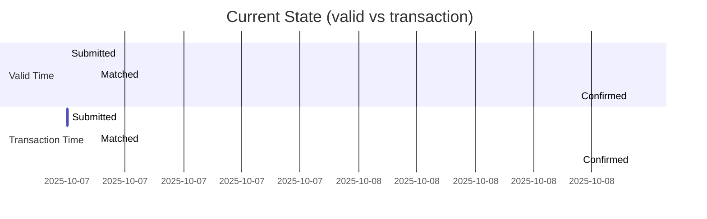
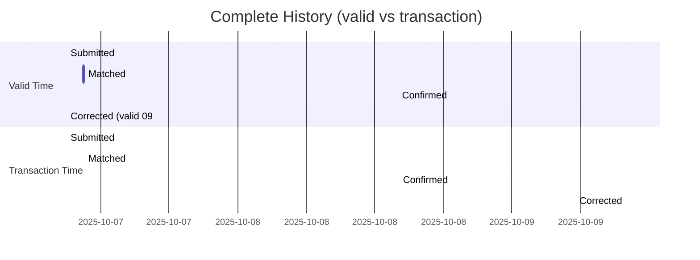
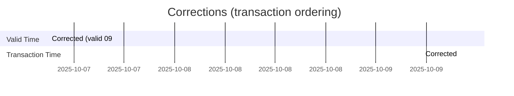

# Reactive Bi-Temporal Event Store Integration Guide

**Purpose**: Guide for integrating PeeGeeQ's bi-temporal event store with reactive applications

**Audience**: Developers implementing bi-temporal event processing for audit trails and historical reconstruction

**Example**: `springboot2bitemporal` - Back office settlement processing

---

## Overview

This guide demonstrates how to use PeeGeeQ's bi-temporal event store for settlement processing with complete audit trails. The focus is on **bi-temporal data processing patterns**, not framework integration.

### Key Concepts

- **Bi-Temporal Event Store** - Track both valid time (when event occurred) and transaction time (when recorded)
- **Valid Time** - When the business event actually happened in the real world
- **Transaction Time** - When we recorded the event in our system
- **Event Correction** - Fix historical data while preserving complete audit trail
- **Point-in-Time Queries** - Reconstruct state as it was known at any moment

---

## Bi-Temporal Concepts

### Valid Time vs Transaction Time

**Valid Time** - When the event occurred in the business domain:
- Settlement instruction submitted on 2025-10-07 at 09:00
- Trade matched with counterparty on 2025-10-07 at 10:30
- Settlement confirmed by custodian on 2025-10-08 at 14:00

**Transaction Time** - When we recorded the event in our system:
- We recorded the submission at 2025-10-07 at 09:01 (1 minute delay)
- We recorded the match at 2025-10-07 at 10:31 (1 minute delay)
- We recorded the confirmation at 2025-10-08 at 14:05 (5 minute delay)

### Why Bi-Temporal Matters for Settlements

**Audit Trail Requirements**:
- Regulatory compliance requires complete history of all changes
- Must prove what we knew at any point in time
- Cannot delete or modify historical records
- Must track corrections separately from original events

**Business Requirements**:
- Correct data errors while preserving original records
- Reconstruct settlement state as known at any time
- Track when information arrived vs when it actually happened
- Support backdated corrections for late-arriving information

**Example Scenario**:
```
Day 1 (2025-10-07):
  09:00 - Settlement instruction submitted (valid time)
  09:01 - We record submission (transaction time)

Day 2 (2025-10-08):
  14:00 - Settlement confirmed (valid time)
  14:05 - We record confirmation (transaction time)

Day 3 (2025-10-09):
  10:00 - Discover wrong counterparty on Day 1 submission
  10:00 - Record correction with valid time = 2025-10-07 09:00
  10:00 - Transaction time = 2025-10-09 10:00 (when we corrected it)

Result: Complete audit trail showing:
  - Original submission with wrong counterparty
  - When we discovered the error
  - Corrected data with original valid time
  - Full history of what we knew when
```

---

## Settlement Event Processing

### Settlement Instruction Lifecycle

**1. Submission** - Instruction sent to custodian:
```java
SettlementEvent submission = new SettlementEvent(
    "SSI-12345",                                    // instructionId
    "TRD-67890",                                    // tradeId
    "CUSTODIAN-XYZ",                                // counterparty
    new BigDecimal("1000000.00"),                   // amount
    "USD",                                          // currency
    LocalDate.of(2025, 10, 10),                     // settlementDate
    SettlementStatus.SUBMITTED,                     // status
    null,                                           // failureReason
    Instant.parse("2025-10-07T09:00:00Z")          // eventTime (valid time)
);

// Record using service method
Mono<BiTemporalEvent<SettlementEvent>> result =
    settlementService.recordSettlement("instruction.settlement.submitted", submission);
```

**2. Matching** - Matched with counterparty:
```java
SettlementEvent matched = new SettlementEvent(
    "SSI-12345",                                    // instructionId
    "TRD-67890",                                    // tradeId
    "CUSTODIAN-XYZ",                                // counterparty
    new BigDecimal("1000000.00"),                   // amount
    "USD",                                          // currency
    LocalDate.of(2025, 10, 10),                     // settlementDate
    SettlementStatus.MATCHED,                       // status
    null,                                           // failureReason
    Instant.parse("2025-10-07T10:30:00Z")          // eventTime (valid time)
);

Mono<BiTemporalEvent<SettlementEvent>> result =
    settlementService.recordSettlement("instruction.settlement.matched", matched);
```

**3. Confirmation** - Confirmed by custodian:
```java
SettlementEvent confirmed = new SettlementEvent(
    "SSI-12345",                                    // instructionId
    "TRD-67890",                                    // tradeId
    "CUSTODIAN-XYZ",                                // counterparty
    new BigDecimal("1000000.00"),                   // amount
    "USD",                                          // currency
    LocalDate.of(2025, 10, 10),                     // settlementDate
    SettlementStatus.CONFIRMED,                     // status
    null,                                           // failureReason
    Instant.parse("2025-10-08T14:00:00Z")          // eventTime (valid time)
);

Mono<BiTemporalEvent<SettlementEvent>> result =
    settlementService.recordSettlement("instruction.settlement.confirmed", confirmed);
```

**4. Failure** - Settlement failed:
```java
SettlementEvent failed = new SettlementEvent(
    "SSI-12345",                                    // instructionId
    "TRD-67890",                                    // tradeId
    "CUSTODIAN-XYZ",                                // counterparty
    new BigDecimal("1000000.00"),                   // amount
    "USD",                                          // currency
    LocalDate.of(2025, 10, 10),                     // settlementDate
    SettlementStatus.FAILED,                        // status
    "Insufficient cash in settlement account",      // failureReason
    Instant.parse("2025-10-08T14:00:00Z")          // eventTime (valid time)
);

Mono<BiTemporalEvent<SettlementEvent>> result =
    settlementService.recordSettlement("instruction.settlement.failed", failed);
```

### Event Naming Pattern

Use `{entity}.{action}.{state}` for hierarchical event names:

- `instruction.settlement.submitted` - Instruction submitted to custodian
- `instruction.settlement.matched` - Matched with counterparty instruction
- `instruction.settlement.confirmed` - Confirmed by custodian
- `instruction.settlement.failed` - Settlement failed (insufficient cash, etc.)
- `instruction.settlement.corrected` - Correction applied to instruction data

**Benefits**:
- **Meaningful** - Each name tells complete story
- **Unique** - Three parts eliminate conflicts across domains
- **Hierarchical** - Can query by entity (`instruction.*`) or action (`*.settlement.*`)
- **Audit Trail** - Clear progression through lifecycle

---

## Temporal Query Patterns

### Get Current State

Get the most recent event for a settlement instruction:

```java
public Mono<SettlementEvent> getCurrentState(String instructionId) {
    CompletableFuture<List<BiTemporalEvent<SettlementEvent>>> future =
        eventStore.query(EventQuery.all());

    return adapter.toFlux(future)
        .filter(e -> instructionId.equals(e.getPayload().getInstructionId()))
        .sort((a, b) -> b.getValidTime().compareTo(a.getValidTime()))
        .next()
        .map(BiTemporalEvent::getPayload);
}
```

**Use Case**: Display current settlement status in operations dashboard

**Visual timeline**:



### Get State As-Of Point in Time

Reconstruct what we knew about a settlement at a specific moment:

```java
public Mono<SettlementEvent> getStateAsOf(String instructionId, Instant asOfTime) {
    CompletableFuture<List<BiTemporalEvent<SettlementEvent>>> future =
        eventStore.query(EventQuery.all());

    return adapter.toFlux(future)
        .filter(e -> instructionId.equals(e.getPayload().getInstructionId()))
        .filter(e -> !e.getValidTime().isAfter(asOfTime))
        .filter(e -> !e.getTransactionTime().isAfter(asOfTime))
        .sort((a, b) -> b.getValidTime().compareTo(a.getValidTime()))
        .next()
        .map(BiTemporalEvent::getPayload);
}
```

**Use Case**: Regulatory inquiry - "What did you know about this settlement on 2025-10-08 at 15:00?"

**Example**:
```
Events in database:
1. Submitted  - valid: 2025-10-07 09:00, transaction: 2025-10-07 09:01
2. Matched    - valid: 2025-10-07 10:30, transaction: 2025-10-07 10:31
3. Confirmed  - valid: 2025-10-08 14:00, transaction: 2025-10-08 14:05
4. Corrected  - valid: 2025-10-07 09:00, transaction: 2025-10-09 10:00

Query: getStateAsOf("SSI-12345", "2025-10-08T15:00:00Z")
Result: Confirmed (event 3)
  - We knew about submission, matching, and confirmation
  - We did NOT know about correction yet (transaction time is 2025-10-09)

Query: getStateAsOf("SSI-12345", "2025-10-09T11:00:00Z")
Result: Corrected (event 4)
  - Now we know about the correction
  - Valid time shows it applies to original submission time
```

**Visual timeline**:
```mermaid
gantt
  dateFormat  YYYY-MM-DD HH:mm
  title State As-Of (valid vs transaction)
  section Valid Time
  Submitted :vt1, 2025-10-07 09:00, 1m
  Matched   :vt2, 2025-10-07 10:30, 1m
  Confirmed :vt3, 2025-10-08 14:00, 1m
  Corrected (valid 09:00) :vt4, 2025-10-07 09:00, 1m
  section Transaction Time
  Submitted :tt1, 2025-10-07 09:01, 1m
  Matched   :tt2, 2025-10-07 10:31, 1m
  Confirmed :tt3, 2025-10-08 14:05, 1m
  Corrected :tt4, 2025-10-09 10:00, 1m
  section Markers
  As-Of 2025-10-08 15:00 :milestone, as1, 2025-10-08 15:00, 0m
  As-Of 2025-10-09 11:00 :milestone, as2, 2025-10-09 11:00, 0m
```


### Get Complete History

Get all events for a settlement instruction in chronological order:

```java
public Flux<BiTemporalEvent<SettlementEvent>> getCompleteHistory(String instructionId) {
    CompletableFuture<List<BiTemporalEvent<SettlementEvent>>> future =
        eventStore.query(EventQuery.all());

    return adapter.toFlux(future)
        .filter(e -> instructionId.equals(e.getPayload().getInstructionId()))
        .sort(Comparator.comparing(BiTemporalEvent::getValidTime));
}
```

**Use Case**: Audit trail report showing complete settlement lifecycle

**Visual timeline**:



### Find All Corrections

Find all correction events for audit purposes:

```java
public Flux<BiTemporalEvent<SettlementEvent>> getCorrections(String instructionId) {
    CompletableFuture<List<BiTemporalEvent<SettlementEvent>>> future =
        eventStore.query(EventQuery.all());

    return adapter.toFlux(future)
        .filter(e -> instructionId.equals(e.getPayload().getInstructionId()))
        .filter(e -> "instruction.settlement.corrected".equals(e.getEventType()))
        .sort(Comparator.comparing(BiTemporalEvent::getTransactionTime));
}
```

**Use Case**: Compliance report showing all data corrections made

**Visual timeline**:



---

## Event Correction Patterns

### When to Correct vs Append New Event

**Append New Event** - When business state changes:
- Settlement matched → confirmed
- Settlement confirmed → failed
- New information about current state

**Correct Existing Event** - When original data was wrong:
- Wrong counterparty recorded
- Wrong amount recorded
- Wrong settlement date
- Late-arriving information that changes past state

### Correction with Audit Trail

**Scenario**: Wrong counterparty recorded on submission

```java
// Original submission (2025-10-07 09:00)
SettlementEvent original = new SettlementEvent(
    "SSI-12345",                                    // instructionId
    "TRD-67890",                                    // tradeId
    "CUSTODIAN-XYZ",                                // counterparty - WRONG!
    new BigDecimal("1000000.00"),                   // amount
    "USD",                                          // currency
    LocalDate.of(2025, 10, 10),                     // settlementDate
    SettlementStatus.SUBMITTED,                     // status
    null,                                           // failureReason
    Instant.parse("2025-10-07T09:00:00Z")          // eventTime (valid time)
);

settlementService.recordSettlement("instruction.settlement.submitted", original)
    .subscribe();

// Discovered error on 2025-10-09 10:00
// Record correction with ORIGINAL valid time but CURRENT transaction time
SettlementEvent corrected = new SettlementEvent(
    "SSI-12345",                                    // instructionId
    "TRD-67890",                                    // tradeId
    "CUSTODIAN-ABC",                                // counterparty - CORRECT!
    new BigDecimal("1000000.00"),                   // amount
    "USD",                                          // currency
    LocalDate.of(2025, 10, 10),                     // settlementDate
    SettlementStatus.CORRECTED,                     // status
    null,                                           // failureReason
    Instant.parse("2025-10-07T09:00:00Z")          // eventTime - Original valid time!
);

settlementService.correctSettlement("SSI-12345", corrected)
    .subscribe();
```

**Result**:
- Original event preserved (transaction time: 2025-10-07 09:01)
- Correction event recorded (transaction time: 2025-10-09 10:00)
- Both events have same valid time (2025-10-07 09:00)
- Complete audit trail of what changed and when

### Backdated Corrections

**Scenario**: Late-arriving information changes past state

```java
// We thought settlement confirmed on 2025-10-08
SettlementEvent confirmed = new SettlementEvent(
    "SSI-12345",                                    // instructionId
    "TRD-67890",                                    // tradeId
    "CUSTODIAN-XYZ",                                // counterparty
    new BigDecimal("1000000.00"),                   // amount
    "USD",                                          // currency
    LocalDate.of(2025, 10, 10),                     // settlementDate
    SettlementStatus.CONFIRMED,                     // status
    null,                                           // failureReason
    Instant.parse("2025-10-08T14:00:00Z")          // eventTime (valid time)
);

settlementService.recordSettlement("instruction.settlement.confirmed", confirmed)
    .subscribe();

// Later discover it actually failed on 2025-10-08
// Record correction with valid time = when it actually failed
SettlementEvent corrected = new SettlementEvent(
    "SSI-12345",                                    // instructionId
    "TRD-67890",                                    // tradeId
    "CUSTODIAN-XYZ",                                // counterparty
    new BigDecimal("1000000.00"),                   // amount
    "USD",                                          // currency
    LocalDate.of(2025, 10, 10),                     // settlementDate
    SettlementStatus.FAILED,                        // status - corrected!
    "Insufficient cash - discovered during reconciliation",  // failureReason
    Instant.parse("2025-10-08T14:00:00Z")          // eventTime - when it actually failed
);

settlementService.correctSettlement("SSI-12345", corrected)
    .subscribe();
```

**Audit Trail Shows**:
- What we thought happened (confirmed)
- When we thought it happened (2025-10-08 14:00)
- What actually happened (failed)
- When we discovered the truth (transaction time of correction)

### Correction Scenarios

**Wrong Amount**:
```java
SettlementEvent corrected = new SettlementEvent(
    original.getInstructionId(),
    original.getTradeId(),
    original.getCounterparty(),
    new BigDecimal("1500000.00"),                   // Corrected amount
    original.getCurrency(),
    original.getSettlementDate(),
    SettlementStatus.CORRECTED,
    null,
    original.getEventTime()                         // Keep original valid time
);
```

**Wrong Settlement Date**:
```java
SettlementEvent corrected = new SettlementEvent(
    original.getInstructionId(),
    original.getTradeId(),
    original.getCounterparty(),
    original.getAmount(),
    original.getCurrency(),
    LocalDate.of(2025, 10, 11),                     // Corrected date
    SettlementStatus.CORRECTED,
    null,
    original.getEventTime()                         // Keep original valid time
);
```

**Multiple Fields Wrong**:
```java
SettlementEvent corrected = new SettlementEvent(
    original.getInstructionId(),
    original.getTradeId(),
    "CUSTODIAN-ABC",                                // Corrected counterparty
    new BigDecimal("1500000.00"),                   // Corrected amount
    original.getCurrency(),
    LocalDate.of(2025, 10, 11),                     // Corrected date
    SettlementStatus.CORRECTED,
    null,
    original.getEventTime()                         // Keep original valid time
);
```

---

## Reactive Adapter Pattern

### Converting CompletableFuture to Mono/Flux

PeeGeeQ's public API returns `CompletableFuture`. For reactive applications using Project Reactor, convert to `Mono`/`Flux`:

```java
@Component
public class ReactiveBiTemporalAdapter {

    public <T> Mono<BiTemporalEvent<T>> toMono(
            CompletableFuture<BiTemporalEvent<T>> future) {
        return Mono.fromFuture(future)
            .doOnError(error -> log.error("Error in bi-temporal operation", error));
    }

    public <T> Flux<BiTemporalEvent<T>> toFlux(
            CompletableFuture<List<BiTemporalEvent<T>>> future) {
        return Mono.fromFuture(future)
            .flatMapMany(Flux::fromIterable)
            .doOnError(error -> log.error("Error in bi-temporal query", error));
    }
}
```

### Using the Adapter

```java
@Service
public class SettlementService {

    private final EventStore<SettlementEvent> eventStore;
    private final ReactiveBiTemporalAdapter adapter;

    public Mono<BiTemporalEvent<SettlementEvent>> recordSettlement(
            String eventType, SettlementEvent event) {

        CompletableFuture<BiTemporalEvent<SettlementEvent>> future =
            eventStore.append(eventType, event, event.getEventTime());

        return adapter.toMono(future);
    }

    public Flux<BiTemporalEvent<SettlementEvent>> getHistory(String instructionId) {
        CompletableFuture<List<BiTemporalEvent<SettlementEvent>>> future =
            eventStore.query(EventQuery.all());

        return adapter.toFlux(future)
            .filter(e -> instructionId.equals(e.getPayload().getInstructionId()));
    }
}
```

### Error Handling in Reactive Streams

```java
public Mono<SettlementEvent> getCurrentStateWithFallback(String instructionId) {
    return getCurrentState(instructionId)
        .onErrorResume(error -> {
            log.error("Failed to get current state for {}", instructionId, error);
            return Mono.empty();
        })
        .doOnSuccess(state -> log.info("Retrieved state for {}: {}",
            instructionId, state.getStatus()));
}
```

### Backpressure Considerations

When processing large event histories, use reactive operators to control backpressure:

```java
public Flux<SettlementEvent> processLargeHistory(String instructionId) {
    return getCompleteHistory(instructionId)
        .map(BiTemporalEvent::getPayload)
        .buffer(100)  // Process in batches of 100
        .flatMap(batch -> processBatch(batch), 4);  // Max 4 concurrent batches
}
```

---

## Settlement Processing Examples

### Complete Settlement Lifecycle

**Day 1 - Submission**:
```java
// 09:00 - Submit settlement instruction
SettlementEvent submission = new SettlementEvent(
    "SSI-12345",                                    // instructionId
    "TRD-67890",                                    // tradeId
    "CUSTODIAN-XYZ",                                // counterparty
    new BigDecimal("1000000.00"),                   // amount
    "USD",                                          // currency
    LocalDate.of(2025, 10, 10),                     // settlementDate
    SettlementStatus.SUBMITTED,                     // status
    null,                                           // failureReason
    Instant.parse("2025-10-07T09:00:00Z")          // eventTime (valid time)
);

Mono<BiTemporalEvent<SettlementEvent>> result =
    settlementService.recordSettlement("instruction.settlement.submitted", submission);
```

**Day 1 - Matching**:
```java
// 10:30 - Settlement matched with counterparty
SettlementEvent matched = new SettlementEvent(
    "SSI-12345",                                    // instructionId
    "TRD-67890",                                    // tradeId
    "CUSTODIAN-XYZ",                                // counterparty
    new BigDecimal("1000000.00"),                   // amount
    "USD",                                          // currency
    LocalDate.of(2025, 10, 10),                     // settlementDate
    SettlementStatus.MATCHED,                       // status
    null,                                           // failureReason
    Instant.parse("2025-10-07T10:30:00Z")          // eventTime (valid time)
);

settlementService.recordSettlement("instruction.settlement.matched", matched);
```

**Day 2 - Confirmation**:
```java
// 14:00 - Settlement confirmed by custodian
SettlementEvent confirmed = new SettlementEvent(
    "SSI-12345",                                    // instructionId
    "TRD-67890",                                    // tradeId
    "CUSTODIAN-XYZ",                                // counterparty
    new BigDecimal("1000000.00"),                   // amount
    "USD",                                          // currency
    LocalDate.of(2025, 10, 10),                     // settlementDate
    SettlementStatus.CONFIRMED,                     // status
    null,                                           // failureReason
    Instant.parse("2025-10-08T14:00:00Z")          // eventTime (valid time)
);

settlementService.recordSettlement("instruction.settlement.confirmed", confirmed);
```

**Day 3 - Correction**:
```java
// 10:00 - Discover wrong counterparty, correct it
SettlementEvent corrected = new SettlementEvent(
    "SSI-12345",                                    // instructionId
    "TRD-67890",                                    // tradeId
    "CUSTODIAN-ABC",                                // counterparty - CORRECTED!
    new BigDecimal("1000000.00"),                   // amount
    "USD",                                          // currency
    LocalDate.of(2025, 10, 10),                     // settlementDate
    SettlementStatus.CORRECTED,                     // status
    null,                                           // failureReason
    Instant.parse("2025-10-07T09:00:00Z")          // eventTime - Original valid time!
);

settlementService.recordSettlement("instruction.settlement.corrected", corrected);
```

### Query Settlement History

```java
// Get complete history
Flux<BiTemporalEvent<SettlementEvent>> history =
    settlementService.getSettlementHistory("SSI-12345");

history.subscribe(event -> {
    System.out.println("Event: " + event.getEventType());
    System.out.println("Valid Time: " + event.getValidTime());
    System.out.println("Transaction Time: " + event.getTransactionTime());
    System.out.println("Status: " + event.getPayload().getStatus());
    System.out.println("---");
});

// Output:
// Event: instruction.settlement.submitted
// Valid Time: 2025-10-07T09:00:00Z
// Transaction Time: 2025-10-07T09:01:00Z
// Status: SUBMITTED
// ---
// Event: instruction.settlement.matched
// Valid Time: 2025-10-07T10:30:00Z
// Transaction Time: 2025-10-07T10:31:00Z
// Status: MATCHED
// ---
// Event: instruction.settlement.confirmed
// Valid Time: 2025-10-08T14:00:00Z
// Transaction Time: 2025-10-08T14:05:00Z
// Status: CONFIRMED
// ---
// Event: instruction.settlement.corrected
// Valid Time: 2025-10-07T09:00:00Z
// Transaction Time: 2025-10-09T10:00:00Z
// Status: CORRECTED
// ---
```

### Reconstruct State at Point in Time

```java
// What did we know on 2025-10-08 at 15:00?
Mono<SettlementEvent> stateAt =
    settlementService.getSettlementStateAt("SSI-12345",
        Instant.parse("2025-10-08T15:00:00Z"));

stateAt.subscribe(state -> {
    System.out.println("Status: " + state.getStatus());  // CONFIRMED
    System.out.println("Counterparty: " + state.getCounterparty());  // CUSTODIAN-XYZ (wrong!)
});

// What do we know now (after correction)?
Mono<SettlementEvent> currentState =
    settlementService.getSettlementHistory("SSI-12345")
        .sort((a, b) -> b.getValidTime().compareTo(a.getValidTime()))
        .next()
        .map(BiTemporalEvent::getPayload);

currentState.subscribe(state -> {
    System.out.println("Status: " + state.getStatus());  // CORRECTED
    System.out.println("Counterparty: " + state.getCounterparty());  // CUSTODIAN-ABC (correct!)
});
```

### Find All Corrections

```java
Flux<BiTemporalEvent<SettlementEvent>> corrections =
    settlementService.getCorrections("SSI-12345");

corrections.subscribe(event -> {
    SettlementEvent original = /* get original event */;
    SettlementEvent corrected = event.getPayload();

    System.out.println("Correction made at: " + event.getTransactionTime());
    System.out.println("Original counterparty: " + original.getCounterparty());
    System.out.println("Corrected counterparty: " + corrected.getCounterparty());
});
```

---

## Audit Trail Reconstruction

### Scenario: Regulatory Inquiry

**Question**: "What did you know about settlement SSI-12345 on 2025-10-08 at 15:00?"

**Answer**:
```java
Mono<SettlementEvent> stateAt = getStateAsOf("SSI-12345",
    Instant.parse("2025-10-08T15:00:00Z"));

stateAt.subscribe(state -> {
    // At 2025-10-08 15:00, we knew:
    // - Instruction submitted on 2025-10-07 09:00
    // - Matched with counterparty on 2025-10-07 10:30
    // - Confirmed by custodian on 2025-10-08 14:00
    // - Counterparty was CUSTODIAN-XYZ (later discovered to be wrong)

    // We did NOT know:
    // - The correction made on 2025-10-09 10:00
    // - The correct counterparty is CUSTODIAN-ABC
});
```

### Scenario: Correction Audit

**Question**: "Show all corrections made to settlement SSI-12345"

**Answer**:
```java
Flux<BiTemporalEvent<SettlementEvent>> corrections = getCorrections("SSI-12345");

corrections.subscribe(event -> {
    // Correction 1:
    // - Made at: 2025-10-09 10:00:00 (transaction time)
    // - Applies to: 2025-10-07 09:00:00 (valid time)
    // - Changed: counterparty from CUSTODIAN-XYZ to CUSTODIAN-ABC
    // - Reason: Data entry error discovered during reconciliation
});
```

### Scenario: Timeline Reconstruction

**Question**: "Show complete timeline of what happened and when we knew it"

**Answer**:
```java
Flux<BiTemporalEvent<SettlementEvent>> history = getCompleteHistory("SSI-12345");

history.subscribe(event -> {
    // Timeline:
    //
    // 2025-10-07 09:00 (valid) / 09:01 (transaction)
    //   - Submitted with counterparty CUSTODIAN-XYZ
    //
    // 2025-10-07 10:30 (valid) / 10:31 (transaction)
    //   - Matched with counterparty
    //
    // 2025-10-08 14:00 (valid) / 14:05 (transaction)
    //   - Confirmed by custodian
    //
    // 2025-10-07 09:00 (valid) / 2025-10-09 10:00 (transaction)
    //   - Corrected counterparty to CUSTODIAN-ABC
    //   - Note: Valid time is original submission time
    //   - Transaction time is when we made the correction
});
```

---

## Best Practices

### 1. Valid Time Selection
- Use the time when the business event actually occurred
- For corrections, use the original event's valid time
- For new state changes, use current time
- Be consistent across your domain

### 2. Event Naming
- Use `{entity}.{action}.{state}` pattern
- Make names meaningful and unique
- Enable hierarchical queries
- Document your naming conventions

### 3. Correction Strategy
- Never modify existing events
- Always append correction events
- Preserve original valid time in corrections
- Document reason for correction

### 4. Query Patterns
- Use `getCurrentState()` for current view
- Use `getStateAsOf()` for regulatory inquiries
- Use `getCompleteHistory()` for audit trails
- Use `getCorrections()` for compliance reports

### 5. Reactive Patterns
- Use `Mono` for single results
- Use `Flux` for multiple results
- Handle errors with `.onErrorResume()`
- Add logging with `.doOnSuccess()` and `.doOnError()`
- Control backpressure with `.buffer()` and `.flatMap()`

---

## Summary

### Key Takeaways

1. **Bi-Temporal Storage** - Track both valid time (when event occurred) and transaction time (when recorded)
2. **Event Correction** - Fix historical data while preserving complete audit trail
3. **Point-in-Time Queries** - Reconstruct state as it was known at any moment
4. **Audit Trail** - Complete history of all changes for regulatory compliance
5. **Reactive Adapter** - Simple wrapper converts CompletableFuture to Mono/Flux

### When to Use Bi-Temporal Event Store

- ✅ Regulatory compliance requiring complete audit trails
- ✅ Need to reconstruct historical state at any point in time
- ✅ Data corrections must preserve original records
- ✅ Track when events occurred vs when you learned about them
- ✅ Settlement processing, trade lifecycle, financial transactions

### When NOT to Use Bi-Temporal Event Store

- ❌ Simple CRUD operations without audit requirements
- ❌ No need for historical reconstruction
- ❌ Data corrections can overwrite original records
- ❌ Current state is all that matters

### Reference Implementation

See `peegeeq-examples/src/main/java/dev/mars/peegeeq/examples/springboot2bitemporal/` for complete working example.

---

## License

Copyright 2025 Mark Andrew Ray-Smith Cityline Ltd

Licensed under the Apache License, Version 2.0

