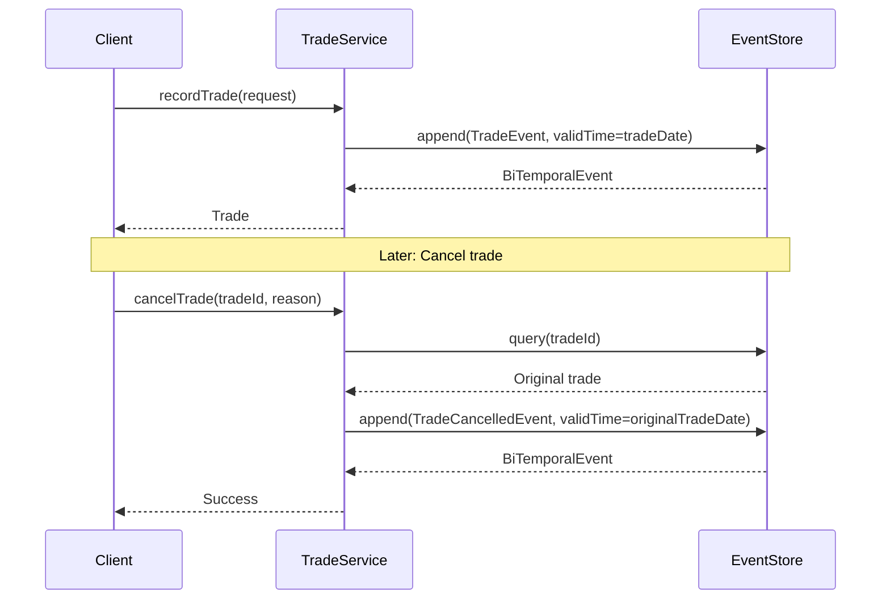

# Funds & Custody Example - Phase 1: Trade & Position Management

This example demonstrates **minimal, production-ready** bi-temporal event sourcing for middle office and back office transaction processing in funds management and custody operations using PeeGeeQ.

## Overview

Phase 1 implements the foundation for trade lifecycle management and position tracking with:
- ✅ Trade recording with bi-temporal tracking (trade date vs confirmation time)
- ✅ Trade cancellation with full audit trail
- ✅ Position calculation as of any date
- ✅ Late trade confirmation detection
- ✅ Position history over time ranges
- ✅ **No Spring Framework** - Plain Java with constructor injection
- ✅ **Minimal dependencies** - Only PeeGeeQ core + SLF4J

## Architecture

### Design Principles

1. **No Spring** - Plain Java services with constructor injection
2. **Minimal Dependencies** - Only PeeGeeQ core + SLF4J logging
3. **Simple Domain Model** - POJOs with Java records
4. **Direct Testing** - JUnit 5 with TestContainers, no Spring Test
5. **Async/Non-Blocking** - All service methods return `CompletableFuture`
6. **Bi-Temporal** - Track both business time (trade date) and system time (confirmation time)

### Package Structure

```
dev.mars.peegeeq.examples.fundscustody/
├── domain/
│   ├── Trade.java                    // Domain model (record)
│   ├── Position.java                 // Domain model (record)
│   ├── TradeType.java                // Enum: BUY, SELL
│   └── Currency.java                 // Enum: USD, EUR, GBP
├── events/
│   ├── TradeEvent.java               // Event payload (record)
│   └── TradeCancelledEvent.java      // Cancellation event (record)
├── model/
│   ├── TradeRequest.java             // DTO for trade requests
│   ├── CancellationRequest.java      // DTO for cancellation requests
│   └── PositionSnapshot.java         // DTO for position snapshots
└── service/
    ├── TradeService.java             // Trade lifecycle management
    └── PositionService.java          // Position calculation & queries
```

## Key Concepts

### Bi-Temporal Event Store

The example uses PeeGeeQ's bi-temporal event store to track **two time dimensions**:

1. **Valid Time (Business Time)** - When the event actually occurred
   - Trade date for trades
   - Original trade date for cancellations (backdated)
   
2. **Transaction Time (System Time)** - When the event was recorded
   - Confirmation time for trades
   - Cancellation time for cancellations

This enables powerful capabilities:
- ✅ **Late Trade Detection** - Identify trades confirmed after NAV cut-off
- ✅ **Point-in-Time Queries** - Calculate positions as of any date
- ✅ **Complete Audit Trail** - Track all changes with timestamps
- ✅ **Backdated Corrections** - Cancel trades with original trade date as valid time

### Trade Lifecycle



### Position Calculation

Positions are calculated on-demand by querying all trades up to a specific date:

```java
// Get all trades for fund/security up to asOfDate
List<BiTemporalEvent<TradeEvent>> trades = tradeEventStore.query(
    EventQuery.builder()
        .aggregateId(fundId)
        .validTimeRange(TemporalRange.until(asOfInstant))
        .build()
).get();

// Calculate position: sum signed quantities, weighted average price
BigDecimal totalQuantity = BigDecimal.ZERO;
BigDecimal totalCost = BigDecimal.ZERO;

for (BiTemporalEvent<TradeEvent> event : trades) {
    Trade trade = event.getPayload().toDomain();
    BigDecimal signedQty = trade.signedQuantity(); // BUY=+, SELL=-
    totalQuantity = totalQuantity.add(signedQty);
    totalCost = totalCost.add(trade.grossAmount());
}

BigDecimal avgPrice = totalCost.divide(totalQuantity.abs(), ...);
```

## Usage Examples

### Recording a Trade

```java
TradeService tradeService = new TradeService(tradeEventStore, cancellationEventStore);

TradeRequest request = new TradeRequest(
    "FUND-001",                          // fundId
    "AAPL",                              // securityId
    TradeType.BUY,                       // tradeType
    new BigDecimal("100"),               // quantity
    new BigDecimal("150.00"),            // price
    Currency.USD,                        // currency
    LocalDate.of(2024, 11, 15),         // tradeDate
    LocalDate.of(2024, 11, 17)          // settlementDate (T+2)
);

Trade trade = tradeService.recordTrade(request).get();
```

### Cancelling a Trade

```java
CancellationRequest cancellation = new CancellationRequest(
    "Trade entered in error",            // reason
    "john.doe@example.com"               // cancelledBy
);

tradeService.cancelTrade(trade.tradeId(), cancellation).get();
```

### Querying Positions

```java
PositionService positionService = new PositionService(tradeEventStore, cancellationEventStore);

// Get position as of specific date
Position position = positionService.getPositionAsOf(
    "FUND-001",                          // fundId
    "AAPL",                              // securityId
    LocalDate.of(2024, 11, 15)          // asOfDate
).get();

System.out.println("Quantity: " + position.quantity());
System.out.println("Avg Price: " + position.averagePrice());
System.out.println("Market Value: " + position.marketValue());

// Get all positions for a fund
List<Position> positions = positionService.getPositionsByFund(
    "FUND-001",
    LocalDate.of(2024, 11, 15)
).get();

// Get position history over time
List<PositionSnapshot> history = positionService.getPositionHistory(
    "FUND-001",
    "AAPL",
    LocalDate.of(2024, 11, 1),
    LocalDate.of(2024, 11, 30)
).get();
```

### Detecting Late Trade Confirmations

```java
// Get trades confirmed after NAV cut-off (18:00)
List<Trade> lateTrades = tradeService.getLateTradeConfirmations(
    "FUND-001",
    LocalDate.of(2024, 11, 15),
    LocalTime.of(18, 0)                  // NAV cut-off time
).get();

// These trades were executed on Nov 15 but confirmed after 18:00
// NAV calculated at 18:00 did not include these trades
// Correction required
```

## Testing

All tests use **TestContainers** with PostgreSQL and **no Spring framework**:

```java
@Test
void testRecordTrade() throws Exception {
    // Given: A trade request
    TradeRequest request = new TradeRequest(...);
    
    // When: Recording the trade
    Trade trade = tradeService.recordTrade(request).get();
    
    // Then: Trade is recorded with correct details
    assertEquals("FUND-001", trade.fundId());
    assertEquals(TradeType.BUY, trade.tradeType());
    
    // And: Can query the trade
    List<Trade> trades = tradeService.queryTradesByFund("FUND-001").get();
    assertEquals(1, trades.size());
}
```

### Running Tests

```bash
# Run all Phase 1 tests
mvn test -pl peegeeq-examples -Dtest="TradeServiceTest,PositionServiceTest"

# Run specific test class
mvn test -pl peegeeq-examples -Dtest=TradeServiceTest
mvn test -pl peegeeq-examples -Dtest=PositionServiceTest
```

## Real-World Scenario: Late Trade Confirmation

```
Timeline:
10:30 - Trade executed (Valid Time: Nov 15)
18:00 - NAV cut-off
20:00 - Trade confirmed (Transaction Time: Nov 15) ⚠️ LATE
22:00 - NAV calculated without trade → 100.50
Next day 09:00 - NAV corrected → 100.48

Queries:
- getNAVAsReported() → 100.50 (what investors saw)
- getNAVCorrected() → 100.48 (with late trade)
- getLateTradeConfirmations() → [TRADE-123]
```

## Phase 1 Success Criteria

- ✅ Can record trades with trade date as valid time
- ✅ Can cancel trades with audit trail
- ✅ Can query trades by fund efficiently
- ✅ Can detect late trade confirmations
- ✅ Can calculate positions as of any date
- ✅ Can get position history over time
- ✅ All tests pass with no Spring dependencies
- ✅ Clean, minimal code with good documentation

## Next Phases

- **Phase 2**: NAV & Corporate Actions (Weeks 3-4)
- **Phase 3**: Reconciliation (Weeks 5-6)
- **Phase 4**: Regulatory & Reporting (Weeks 7-8)

## Dependencies

```xml
<dependencies>
    <!-- PeeGeeQ Core -->
    <dependency>
        <groupId>dev.mars</groupId>
        <artifactId>peegeeq-bitemporal</artifactId>
    </dependency>
    
    <!-- Logging -->
    <dependency>
        <groupId>org.slf4j</groupId>
        <artifactId>slf4j-api</artifactId>
    </dependency>
</dependencies>
```

**No Spring dependencies required!**

## See Also

- [Bi-Temporal Domain Use Cases](../../../docs/FUNDS_CUSTODY_BITEMPORAL_USE_CASES.md)
- [Quick Start Guide](../../../docs/FUNDS_CUSTODY_QUICK_START.md)
- [PeeGeeQ Documentation](https://github.com/mars-research/peegeeq)

