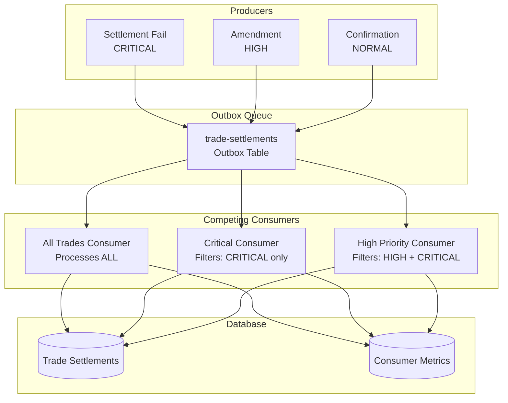

# Spring Boot Priority and Filtering Example

This example demonstrates **message priority and filtering** in a Spring Boot application using PeeGeeQ's transactional outbox pattern for trade settlement processing.

## Overview

This example shows:
- **Priority-Based Message Processing** - CRITICAL, HIGH, and NORMAL priority levels
- **Application-Level Filtering** - Multiple consumers with different priority filters
- **Competing Consumers Pattern** - Multiple consumers competing for messages from the same queue
- **Trade Settlement Use Case** - Settlement fails, amendments, and confirmations
- **Consumer Monitoring** - REST endpoints for metrics and health checks

## Architecture



## Key Features

### 1. Priority Levels

Three priority levels for trade settlement events:
- **CRITICAL (10)** - Settlement fails requiring immediate attention
- **HIGH (7)** - Trade amendments needing prompt processing
- **NORMAL (5)** - Standard trade confirmations

### 2. Consumer Patterns

**Pattern A: All-Trades Consumer**
- Processes all messages regardless of priority
- Tracks metrics separately by priority level
- Useful for audit trails and reporting

**Pattern B: Priority-Specific Consumers**
- Critical Consumer: Only processes CRITICAL priority messages
- High-Priority Consumer: Processes HIGH and CRITICAL messages
- Filters out non-matching priorities

### 3. Competing Consumers

All consumers compete for messages from the same queue:
- Each message is processed by ONE consumer
- Automatic load balancing across consumers
- Consumers filter messages they don't want to process

### 4. Trade Settlement Use Case

Real-world middle/back office trade processing:
- **Settlement Fails (CRITICAL)**: Failed settlements requiring immediate investigation
- **Amendments (HIGH)**: Trade corrections needing prompt processing
- **Confirmations (NORMAL)**: Standard trade confirmations

## Configuration

### Application Properties

```yaml
# Server Configuration
server:
  port: 8084

# PeeGeeQ Configuration
peegeeq:
  database:
    host: localhost
    port: 5432
    name: peegeeq_priority_example
  queue:
    polling-interval: PT0.5S
    max-retries: 3
    batch-size: 10

# Priority Consumer Configuration
priority:
  consumers:
    all-trades:
      enabled: true
      instance-id: all-trades-consumer-1
    critical:
      enabled: true
      instance-id: critical-consumer-1
    high-priority:
      enabled: true
      instance-id: high-priority-consumer-1
```

## Running the Example

### Prerequisites
- Java 17 or higher
- PostgreSQL 15 or higher
- Maven 3.8 or higher

### Start PostgreSQL
```bash
docker run -d \
  --name peegeeq-postgres \
  -e POSTGRES_DB=peegeeq_priority_example \
  -e POSTGRES_USER=postgres \
  -e POSTGRES_PASSWORD=password \
  -p 5432:5432 \
  postgres:15-alpine
```

### Run the Application
```bash
mvn spring-boot:run -Dspring-boot.run.profiles=springboot-priority
```

## Testing

### Run Tests
```bash
mvn test -Dtest=SpringBootPriorityApplicationTest
```

### Send Test Messages

**Send Settlement Fail (CRITICAL)**
```bash
curl -X POST http://localhost:8084/api/trades/settlement-fail \
  -H "Content-Type: application/json" \
  -d '{
    "tradeId": "TRADE-001",
    "counterparty": "BANK-XYZ",
    "amount": 1000000.00,
    "currency": "USD",
    "settlementDate": "2025-10-07",
    "failureReason": "Insufficient funds"
  }'
```

**Send Amendment (HIGH)**
```bash
curl -X POST http://localhost:8084/api/trades/amendment \
  -H "Content-Type: application/json" \
  -d '{
    "tradeId": "TRADE-002",
    "counterparty": "BANK-ABC",
    "amount": 500000.00,
    "currency": "EUR",
    "settlementDate": "2025-10-08"
  }'
```

**Send Confirmation (NORMAL)**
```bash
curl -X POST http://localhost:8084/api/trades/confirmation \
  -H "Content-Type: application/json" \
  -d '{
    "tradeId": "TRADE-003",
    "counterparty": "BANK-DEF",
    "amount": 250000.00,
    "currency": "GBP",
    "settlementDate": "2025-10-09"
  }'
```

### Check Metrics

**Producer Metrics**
```bash
curl http://localhost:8084/api/trades/metrics
```

**All Consumers Metrics**
```bash
curl http://localhost:8084/api/monitoring/metrics
```

**Individual Consumer Metrics**
```bash
# All-trades consumer
curl http://localhost:8084/api/monitoring/consumers/all-trades

# Critical consumer
curl http://localhost:8084/api/monitoring/consumers/critical

# High-priority consumer
curl http://localhost:8084/api/monitoring/consumers/high-priority
```

**Health Check**
```bash
curl http://localhost:8084/api/monitoring/health
```

## Code Structure

```
springbootpriority/
├── config/
│   ├── PeeGeeQPriorityConfig.java       # PeeGeeQ configuration
│   └── PeeGeeQPriorityProperties.java   # Configuration properties
├── controller/
│   ├── TradeProducerController.java     # REST endpoints for sending trades
│   └── PriorityMonitoringController.java # Monitoring endpoints
├── events/
│   └── TradeSettlementEvent.java        # Event model
├── model/
│   ├── Trade.java                       # Domain model
│   └── Priority.java                    # Priority enum
├── service/
│   ├── TradeProducerService.java        # Producer service
│   ├── AllTradesConsumerService.java    # All-trades consumer
│   ├── CriticalTradeConsumerService.java # Critical-only consumer
│   └── HighPriorityConsumerService.java  # High+Critical consumer
└── SpringBootPriorityApplication.java    # Main application
```

## Key Implementation Details

### 1. Priority Enum (Priority.java)

```java
public enum Priority {
    CRITICAL(10, "Critical priority - settlement fails"),
    HIGH(7, "High priority - amendments"),
    NORMAL(5, "Normal priority - confirmations");
    
    private final int level;
    private final String description;
}
```

### 2. Sending Messages with Priority (TradeProducerService.java)

```java
Map<String, String> headers = new HashMap<>();
headers.put("priority", priority.name());
headers.put("priority-level", String.valueOf(priority.getLevel()));

producer.send(event, headers)
    .thenAccept(v -> {
        log.info("Trade event sent: tradeId={}, priority={}", 
            event.getTradeId(), priority);
    });
```

### 3. Application-Level Filtering (CriticalTradeConsumerService.java)

```java
private CompletableFuture<Void> processMessage(Message<TradeSettlementEvent> message) {
    Priority priority = extractPriority(message);
    
    // Filter non-critical messages
    if (priority != Priority.CRITICAL) {
        messagesFiltered.incrementAndGet();
        return CompletableFuture.completedFuture(null);
    }
    
    // Process critical message
    return processCriticalTrade(message);
}
```

## Monitoring

### Metrics Available

**Producer Metrics**
- `totalSent` - Total messages sent
- `criticalSent` - Critical priority messages sent
- `highSent` - High priority messages sent
- `normalSent` - Normal priority messages sent

**Consumer Metrics (All-Trades)**
- `messagesProcessed` - Total messages processed
- `criticalProcessed` - Critical messages processed
- `highProcessed` - High messages processed
- `normalProcessed` - Normal messages processed

**Consumer Metrics (Priority-Specific)**
- `messagesProcessed` - Messages processed (matching priority)
- `messagesFiltered` - Messages filtered out (non-matching priority)
- `criticalProcessed` / `highProcessed` - By priority level

## Best Practices

1. **Use Appropriate Priority Levels** - Reserve CRITICAL for truly urgent messages
2. **Monitor Filter Rates** - High filter rates may indicate misconfiguration
3. **Balance Consumer Distribution** - Ensure critical messages get processed quickly
4. **Track Metrics by Priority** - Monitor processing times for each priority level
5. **Use Competing Consumers** - For load balancing and fault tolerance

## Related Examples

- **springboot-consumer** - Basic consumer patterns
- **springboot-dlq** - Dead letter queue handling
- **springboot-retry** - Retry strategies

## References

- [Spring Boot Integration Guide](../../../../../../../docs/SPRING_BOOT_INTEGRATION_GUIDE.md)
- [PeeGeeQ Documentation](https://github.com/mars-research/peegeeq)

