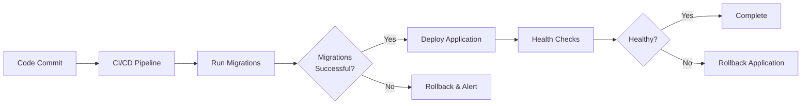

# PeeGeeQ Database Migrations

## Overview

This module contains database migration scripts for PeeGeeQ. It is **completely separate** from the application runtime and should only be used during deployment or database setup.

## Architecture Decision

**Why Separate Module?**

- **Safety**: Application cannot accidentally drop/recreate production schema
- **Control**: Explicit, auditable migration step in deployment pipeline
- **Rollback**: Can rollback migrations independently of application deployment
- **Zero Downtime**: Run migrations before deploying new application version
- **Separation of Concerns**: Schema management is separate from application logic

## Migration Files

All migration scripts are located in `src/main/resources/db/migration/` and follow Flyway's naming convention:

```
V<VERSION>__<DESCRIPTION>.sql
```

### Current Migrations

| Version | File | Description |
|---------|------|-------------|
| V001 | `V001__Create_Base_Tables.sql` | Creates all base tables, indexes, views, functions, and triggers for PeeGeeQ |

### What V001 Creates

**Tables:**
- `schema_version` - Tracks schema version history
- `outbox` - Outbox pattern for transactional messaging
- `outbox_consumer_groups` - Consumer group tracking for outbox
- `queue_messages` - Native queue messages
- `message_processing` - Message processing state tracking
- `dead_letter_queue` - Failed messages
- `queue_metrics` - Queue performance metrics
- `connection_pool_metrics` - Connection pool statistics
- `bitemporal_event_log` - Bi-temporal event store

**Indexes:**
- Performance indexes on all tables
- Concurrent indexes for bitemporal queries
- Composite indexes for common query patterns

**Views:**
- `bitemporal_current_state` - Current state of bi-temporal events
- `bitemporal_latest_events` - Latest events per entity
- `bitemporal_event_stats` - Event statistics
- `bitemporal_event_type_stats` - Statistics by event type

**Functions:**
- `notify_message_inserted()` - LISTEN/NOTIFY trigger for queue messages
- `update_message_processing_updated_at()` - Automatic timestamp updates
- `cleanup_completed_message_processing()` - Cleanup old processing records
- `register_consumer_group_for_existing_messages()` - Consumer group registration
- `create_consumer_group_entries_for_new_message()` - Auto-create consumer entries
- `cleanup_completed_outbox_messages()` - Cleanup processed outbox messages
- `notify_bitemporal_event()` - LISTEN/NOTIFY for bi-temporal events
- `cleanup_old_metrics()` - Cleanup old metric records
- `get_events_as_of_time()` - Query bi-temporal state at specific time

## Running Migrations

### Local Development

```bash
cd peegeeq-migrations

# Run migrations
mvn flyway:migrate -Plocal

# Check status
mvn flyway:info -Plocal

# Validate migrations
mvn flyway:validate -Plocal
```

**Local Profile Defaults:**
- URL: `jdbc:postgresql://localhost:5432/peegeeq_dev`
- User: `peegeeq_dev`
- Password: `peegeeq_dev`

### Test Environment

```bash
mvn flyway:migrate -Ptest
```

**Test Profile Defaults:**
- URL: `jdbc:postgresql://localhost:5432/peegeeq_test`
- User: `peegeeq_test`
- Password: `peegeeq_test`

### Production

**From CI/CD Pipeline:**

```bash
# Set environment variables
export DB_URL=jdbc:postgresql://prod-db:5432/peegeeq
export DB_USER=peegeeq_admin
export DB_PASSWORD=<secure-password>

# Run migrations
mvn flyway:migrate -Pproduction
```

**Or pass credentials directly:**

```bash
mvn flyway:migrate \
  -Dflyway.url=jdbc:postgresql://prod-db:5432/peegeeq \
  -Dflyway.user=peegeeq_admin \
  -Dflyway.password=<secure-password>
```

## Deployment Process

### Recommended Production Flow



**Steps:**

1. **Run migrations FIRST** (before app deployment)
2. **Verify migration success** (check exit code)
3. **Deploy application** (only if migrations succeed)
4. **Run health checks** (verify app can connect to DB)

### CI/CD Integration Example

**GitLab CI:**

```yaml
deploy-production:
  stage: deploy
  script:
    # Step 1: Run database migrations
    - cd peegeeq-migrations
    - mvn flyway:migrate -Pproduction
    
    # Step 2: Deploy application (only if migrations succeed)
    - cd ..
    - kubectl apply -f k8s/production/
```

**GitHub Actions:**

```yaml
- name: Run Database Migrations
  run: |
    cd peegeeq-migrations
    mvn flyway:migrate -Pproduction
  env:
    DB_URL: ${{ secrets.DB_URL }}
    DB_USER: ${{ secrets.DB_USER }}
    DB_PASSWORD: ${{ secrets.DB_PASSWORD }}

- name: Deploy Application
  run: kubectl apply -f k8s/production/
```

## Adding New Migrations

### Step 1: Create Migration File

```bash
cd peegeeq-migrations/src/main/resources/db/migration
touch V002__Add_New_Feature.sql
```

### Step 2: Write SQL

```sql
-- V002__Add_New_Feature.sql
-- Add new column to queue_messages
ALTER TABLE queue_messages ADD COLUMN priority_boost INT DEFAULT 0;

-- Create index for new column
CREATE INDEX idx_queue_messages_priority_boost ON queue_messages(priority_boost);

-- Update existing rows
UPDATE queue_messages SET priority_boost = 0 WHERE priority_boost IS NULL;
```

### Step 3: Test Locally

```bash
cd peegeeq-migrations
mvn flyway:migrate -Plocal
mvn flyway:info -Plocal
```

### Step 4: Commit and Deploy

```bash
git add src/main/resources/db/migration/V002__Add_New_Feature.sql
git commit -m "Add priority boost feature to queue messages"
git push
```

## Troubleshooting

### Migration Failed

If a migration fails, Flyway marks it as failed:

```bash
# Check status
mvn flyway:info -Plocal

# Fix the SQL file, then repair
mvn flyway:repair -Plocal

# Try again
mvn flyway:migrate -Plocal
```

### Baseline Existing Database

If you have an existing database without Flyway metadata:

```bash
mvn flyway:baseline -Plocal
```

### Check Migration History

```bash
mvn flyway:info -Plocal
```

Output shows:
- Version number
- Description
- Installed date
- State (Success/Failed/Pending)
- Checksum

## Flyway Configuration

### Safety Features

- **`cleanDisabled=true`** - Prevents `flyway:clean` from dropping database
- **`validateOnMigrate=true`** - Validates checksums before migrating
- **`baselineOnMigrate=true`** - Allows migrating existing databases
- **`outOfOrder=false`** - Enforces sequential migration order

### Available Commands

| Command | Description |
|---------|-------------|
| `flyway:migrate` | Apply pending migrations |
| `flyway:info` | Show migration status and history |
| `flyway:validate` | Validate applied migrations against available ones |
| `flyway:baseline` | Baseline an existing database |
| `flyway:repair` | Repair metadata table after failed migration |

## Best Practices

### DO

✅ Always test migrations locally first  
✅ Keep migrations small and focused  
✅ Use descriptive migration names  
✅ Run migrations before deploying application  
✅ Use transactions (Flyway default for PostgreSQL)  
✅ Add rollback scripts in comments for reference  
✅ Version control all migration files  

### DON'T

❌ Never modify applied migrations (create new ones instead)  
❌ Never run migrations from application code  
❌ Never use `flyway:clean` in production  
❌ Never skip version numbers  
❌ Never commit untested migrations  
❌ Never include environment-specific data in migrations  

## Module Dependencies

**NONE** - This module has no dependencies on other PeeGeeQ modules and is not a dependency of any other module.

The application runtime does **NOT** include this module or its migration scripts.

## Testing

### Test Schema Initialization

Tests use JDBC-based schema initialization directly in test setup methods, not migrations:

```java
// Example from NativeQueueIntegrationTest
private void clearQueueBeforeSetup() {
    try (Connection conn = DriverManager.getConnection(
            postgres.getJdbcUrl(), 
            postgres.getUsername(), 
            postgres.getPassword());
         Statement stmt = conn.createStatement()) {
        
        stmt.execute("CREATE TABLE IF NOT EXISTS queue_messages (...)");
        stmt.execute("TRUNCATE TABLE queue_messages");
    }
}
```

This approach:
- Keeps tests fast and isolated
- Avoids migration complexity in test environments
- Allows tests to run without Flyway dependency

## Support

For questions or issues with migrations:

1. Check Flyway documentation: https://flywaydb.org/documentation/
2. Review migration logs in CI/CD pipeline
3. Validate migration SQL syntax locally before committing
4. Use `flyway:info` to check migration state

