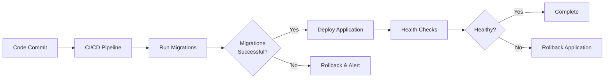

# PeeGeeQ Database Migrations and Installation

Date: 2025-11-17  
Author: Mark Andrew Ray-Smith  
Version: 2.0.0  


## Module Overview

**Module**: `peegeeq-migrations`  
**Purpose**: Database migration scripts and schema management for PeeGeeQ  
**Type**: Deployment-only module (not included in application runtime)  
**Location**: `peegeeq/peegeeq-migrations/`

This module contains Flyway database migration scripts that create and manage the complete PeeGeeQ database schema. Migration scripts are located in:
- **Production migrations**: `src/main/resources/db/migration/`
- **Test migrations**: `src/test/resources/db/migration/`
- **Test classes**: `src/test/java/dev/mars/peegeeq/migrations/`

**Example Key Files**:
- `V001__Create_Base_Tables.sql` - Base schema (575 lines)
- `V010__Create_Consumer_Group_Fanout_Tables.sql` - Consumer group fanout (442 lines)
- `MigrationIntegrationTest.java` - 17 integration tests validating migrations

---

## ⚠️ CRITICAL: Database Setup Required

**Before using PeeGeeQ**, you **MUST** run database migrations to create required tables. This is the #1 issue reported by new users.

**Common errors if you skip this step:**
```
FATAL: dead_letter_queue table does not exist - schema not initialized properly
FATAL: bitemporal_event_log table does not exist - schema not initialized properly
FATAL: queue_messages table does not exist - schema not initialized properly
```

**Solution**: Follow the [Running Migrations](#running-migrations) section below.

## Overview

### What This Module Does

The `peegeeq-migrations` module contains Flyway database migration scripts that create and manage the complete PeeGeeQ database schema. It is **completely separate** from the application runtime and serves a specific purpose in your deployment workflow.

**Key Characteristics**:
- **Deployment-Only Module**: Never included in application runtime classpath
- **Flyway-Based**: Uses Flyway migration tool for version-controlled schema changes
- **Separate Deployment Step**: Runs independently, before application deployment
- **Version Tracked**: Maintains schema version history in `flyway_schema_history` table

### Why Separate Module?

**Safety & Control**:
- Application cannot accidentally drop/recreate production schema
- Explicit, auditable migration step in deployment pipeline
- Can rollback migrations independently of application deployment
- Zero-downtime deployments (run migrations before deploying new app version)

**Separation of Concerns**:
- Schema management separate from application logic
- DevOps controls when/how migrations run
- Different access permissions (migration user vs app user)

### Module vs Application Dependency

**Important Distinction**:

```
peegeeq-migrations (THIS MODULE)
├── Contains: Flyway migration SQL scripts
├── Purpose: Create/update database schema
├── Used by: DevOps/CI-CD during deployment
└── NOT a runtime dependency

peegeeq-db (APPLICATION DEPENDENCY)  
├── Contains: PeeGeeQ runtime code (connection management, queues, etc.)
├── Purpose: Application uses this to interact with database
├── Used by: Your application at runtime
└── Requires: Database schema already exists (created by migrations)
```

**The Workflow**:
1. **First**: Run `peegeeq-migrations` → Creates database tables
2. **Then**: Deploy application with `peegeeq-db` dependency → Uses existing tables

## Quick Start (3 Steps)

### 1. Add Maven Dependency (Application)

Add this dependency to **your application** (not the migrations module):

```xml
<dependency>
    <groupId>dev.mars.peegeeq</groupId>
    <artifactId>peegeeq-db</artifactId>
    <version>1.0.0</version>
</dependency>
```

**Note**: You do **NOT** add `peegeeq-migrations` as a dependency. It's a separate deployment tool.

### 2. Run Database Migrations (REQUIRED!)

See [Running Migrations](#running-migrations) section below for detailed instructions.

### 3. Configure Connection

```java
// Using system properties
System.setProperty("peegeeq.database.host", "localhost");
System.setProperty("peegeeq.database.port", "5432");
System.setProperty("peegeeq.database.name", "yourdb");
System.setProperty("peegeeq.database.username", "youruser");
System.setProperty("peegeeq.database.password", "yourpassword");

// Or using configuration file
PeeGeeQConfiguration config = new PeeGeeQConfiguration("production");
PeeGeeQManager manager = new PeeGeeQManager(config, new SimpleMeterRegistry());
manager.start();
```

## Architecture Decision

**Why Separate Module?**

- **Safety**: Application cannot accidentally drop/recreate production schema
- **Control**: Explicit, auditable migration step in deployment pipeline
- **Rollback**: Can rollback migrations independently of application deployment
- **Zero Downtime**: Run migrations before deploying new application version
- **Separation of Concerns**: Schema management is separate from application logic

## Migration Files

All migration scripts are located in `src/main/resources/db/migration/` and follow Flyway's naming convention:

```
V<VERSION>__<DESCRIPTION>.sql
```

### Current Migrations

| Version | File | Description |
|---------|------|-------------|
| V001 | `V001__Create_Base_Tables.sql` | Creates base tables, indexes, views, functions, and triggers for PeeGeeQ |
| V010 | `V010__Create_Consumer_Group_Fanout_Tables.sql` | Creates consumer group fanout tables, functions, and triggers |

### What V001 Creates

**Tables:**
- `schema_version` - Tracks schema version history
- `outbox` - Outbox pattern for transactional messaging
- `outbox_consumer_groups` - Consumer group tracking for outbox
- `queue_messages` - Native queue messages
- `message_processing` - Message processing state tracking
- `dead_letter_queue` - Failed messages
- `queue_metrics` - Queue performance metrics
- `connection_pool_metrics` - Connection pool statistics
- `bitemporal_event_log` - Bi-temporal event store

**Indexes:**
- Performance indexes on all tables
- Concurrent indexes for bitemporal queries
- Composite indexes for common query patterns

**Views:**
- `bitemporal_current_state` - Current state of bi-temporal events
- `bitemporal_latest_events` - Latest events per entity
- `bitemporal_event_stats` - Event statistics
- `bitemporal_event_type_stats` - Statistics by event type

**Functions:**
- `notify_message_inserted()` - LISTEN/NOTIFY trigger for queue messages
- `update_message_processing_updated_at()` - Automatic timestamp updates
- `cleanup_completed_message_processing()` - Cleanup old processing records
- `register_consumer_group_for_existing_messages()` - Consumer group registration
- `create_consumer_group_entries_for_new_message()` - Auto-create consumer entries
- `cleanup_completed_outbox_messages()` - Cleanup processed outbox messages
- `notify_bitemporal_event()` - LISTEN/NOTIFY for bi-temporal events
- `cleanup_old_metrics()` - Cleanup old metric records
- `get_events_as_of_time()` - Query bi-temporal state at specific time

## Running Migrations

### Local Development

```bash
cd peegeeq-migrations

# Run migrations
mvn flyway:migrate -Plocal

# Check status
mvn flyway:info -Plocal

# Validate migrations
mvn flyway:validate -Plocal
```

**Local Profile Defaults:**
- URL: `jdbc:postgresql://localhost:5432/peegeeq_dev`
- User: `peegeeq_dev`
- Password: `peegeeq_dev`

### Test Environment

```bash
mvn flyway:migrate -Ptest
```

**Test Profile Defaults:**
- URL: `jdbc:postgresql://localhost:5432/peegeeq_test`
- User: `peegeeq_test`
- Password: `peegeeq_test`

### Production

**From CI/CD Pipeline:**

```bash
# Set environment variables
export DB_URL=jdbc:postgresql://prod-db:5432/peegeeq
export DB_USER=peegeeq_admin
export DB_PASSWORD=<secure-password>

# Run migrations
mvn flyway:migrate -Pproduction
```

**Or pass credentials directly:**

```bash
mvn flyway:migrate \
  -Dflyway.url=jdbc:postgresql://prod-db:5432/peegeeq \
  -Dflyway.user=peegeeq_admin \
  -Dflyway.password=<secure-password>
```

## Deployment Process

### Recommended Production Flow



**Steps:**

1. **Run migrations FIRST** (before app deployment)
2. **Verify migration success** (check exit code)
3. **Deploy application** (only if migrations succeed)
4. **Run health checks** (verify app can connect to DB)

### CI/CD Integration Example

**GitLab CI:**

```yaml
deploy-production:
  stage: deploy
  script:
    # Step 1: Run database migrations
    - cd peegeeq-migrations
    - mvn flyway:migrate -Pproduction
    
    # Step 2: Deploy application (only if migrations succeed)
    - cd ..
    - kubectl apply -f k8s/production/
```

**GitHub Actions:**

```yaml
- name: Run Database Migrations
  run: |
    cd peegeeq-migrations
    mvn flyway:migrate -Pproduction
  env:
    DB_URL: ${{ secrets.DB_URL }}
    DB_USER: ${{ secrets.DB_USER }}
    DB_PASSWORD: ${{ secrets.DB_PASSWORD }}

- name: Deploy Application
  run: kubectl apply -f k8s/production/
```

## Flyway Migration Patterns: Versioned vs Repeatable

### Understanding Flyway's Design Philosophy

Flyway supports two types of migrations with **fundamentally different purposes**:

#### 1. Versioned Migrations (V* files)

**Purpose**: Applied **exactly once** to track linear schema evolution

**Characteristics**:
- Run in order, exactly once per environment
- Tracked in `flyway_schema_history` table
- **Should NOT be idempotent** - Flyway handles that
- Should NOT use `CREATE TABLE IF NOT EXISTS`
- Should fail loudly if preconditions aren't met

**Official Flyway Guidance** (source: documentation.red-gate.com/flyway):

> "Versioned migrations are applied to a target database in order exactly once."
> 
> "It is best practice not to make changes to existing versioned migrations once they have been applied to a permanent downstream environment."

**Recommended Pattern**:
```sql
-- V002__Add_Priority_Column.sql
-- Clean, declarative migrations that assume proper state

ALTER TABLE queue_messages ADD COLUMN priority_boost INT DEFAULT 0;
CREATE INDEX idx_queue_messages_priority_boost ON queue_messages(priority_boost);
```

**Why NOT use IF NOT EXISTS in versioned migrations?**
- Flyway already tracks which migrations have run
- Conditional logic defeats Flyway's state tracking
- If a CREATE TABLE fails, it indicates a real problem (manual changes, skipped migrations, drift)
- Versioned migrations are a "contract" about what will change - should be declarative, not conditional

#### 2. Repeatable Migrations (R* files)

**Purpose**: Re-applied whenever their content changes

**Characteristics**:
- Run after all versioned migrations
- Re-run when checksum changes
- **MUST be idempotent** - your responsibility
- Perfect for views, procedures, functions
- Uses `CREATE OR REPLACE` patterns

**Official Flyway Guidance**:

> "It is your responsibility to ensure the same repeatable migration can be applied multiple times. This usually involves making use of CREATE OR REPLACE clauses in your DDL statements."

**Recommended Pattern**:
```sql
-- R__Utility_Functions.sql
-- Idempotent by design - can be applied repeatedly

CREATE OR REPLACE FUNCTION calculate_priority(
    base_priority INT,
    boost INT
) RETURNS INT AS $$
BEGIN
    RETURN COALESCE(base_priority, 0) + COALESCE(boost, 0);
END;
$$ LANGUAGE plpgsql IMMUTABLE;

CREATE OR REPLACE VIEW high_priority_messages AS
SELECT * FROM queue_messages 
WHERE calculate_priority(priority, priority_boost) > 10;
```

### Migrate Command Idempotency

The official documentation states:

> "Executing migrate is idempotent and can be done safely regardless of the current version of the schema."

**Important distinction**: The **migrate command** is idempotent (safe to run multiple times), but this doesn't mean individual **versioned migrations** should use defensive coding patterns like `IF NOT EXISTS`.

Flyway achieves idempotency by:
- Tracking applied migrations in `flyway_schema_history`
- Skipping already-applied versioned migrations
- Only running pending migrations
- Re-running repeatable migrations whose checksums changed

### Current PeeGeeQ Migrations: Pattern Assessment

**Current V001 Pattern** (for discussion):
```sql
-- V001__Create_Base_Tables.sql
CREATE TABLE IF NOT EXISTS outbox (...)
CREATE TABLE IF NOT EXISTS queue_messages (...)
```

**Assessment**:
- ✅ **Data-safe**: No DROP TABLE or TRUNCATE statements
- ✅ **Works correctly**: Tables are created successfully
- ⚠️ **Not standard Flyway pattern**: Versioned migrations should not use IF NOT EXISTS
- ⚠️ **Defeats Flyway's purpose**: Conditional logic makes state tracking less reliable

**Flyway-recommended Pattern**:
```sql
-- V001__Create_Base_Tables.sql
CREATE TABLE outbox (...);
CREATE TABLE queue_messages (...);
```

**Why this is better**:
- Fails fast if tables already exist (indicates manual changes or migration issues)
- Clear contract: "This migration creates these tables"
- Leverages Flyway's tracking: Won't run twice anyway
- Easier to debug: Errors indicate real state problems

### Trigger Recreation Pattern

**Current pattern** (acceptable):
```sql
DROP TRIGGER IF EXISTS trigger_outbox_notify ON outbox;
CREATE TRIGGER trigger_outbox_notify ...
```

**This is fine** because:
- Triggers can't be modified in-place (no CREATE OR REPLACE TRIGGER)
- DROP IF EXISTS followed by CREATE is the standard pattern
- Could alternatively be a repeatable migration

## Adding New Migrations

### Step 1: Decide Migration Type

**Use Versioned Migration (V*) for:**
- Creating/altering/dropping tables
- Adding/modifying columns
- Creating/dropping indexes
- Schema structure changes
- One-time data corrections

**Use Repeatable Migration (R*) for:**
- Views that may need updates
- Stored procedures/functions
- Triggers (alternative to versioned)
- Reference data that changes

### Step 2: Create Migration File

**For Versioned Migration:**
```bash
cd peegeeq-migrations/src/main/resources/db/migration
touch V002__Add_Priority_Feature.sql
```

**For Repeatable Migration:**
```bash
cd peegeeq-migrations/src/main/resources/db/migration
touch R__Priority_Functions.sql
```

### Step 3: Write SQL

**Versioned Migration Example** (V002):
```sql
-- V002__Add_Priority_Feature.sql
-- Add priority columns to queue_messages

ALTER TABLE queue_messages ADD COLUMN priority INT DEFAULT 0;
ALTER TABLE queue_messages ADD COLUMN priority_boost INT DEFAULT 0;

CREATE INDEX idx_queue_messages_priority 
ON queue_messages(priority, priority_boost);

-- One-time data update
UPDATE queue_messages 
SET priority = 5 
WHERE priority IS NULL;
```

**Repeatable Migration Example** (R__Priority_Functions.sql):
```sql
-- R__Priority_Functions.sql
-- Priority calculation functions - can be updated over time

CREATE OR REPLACE FUNCTION calculate_total_priority(
    base_priority INT,
    boost INT
) RETURNS INT AS $$
BEGIN
    RETURN COALESCE(base_priority, 0) + COALESCE(boost, 0);
END;
$$ LANGUAGE plpgsql IMMUTABLE;

CREATE OR REPLACE VIEW high_priority_messages AS
SELECT 
    id,
    topic,
    payload,
    calculate_total_priority(priority, priority_boost) as total_priority
FROM queue_messages 
WHERE calculate_total_priority(priority, priority_boost) > 10;
```

### Step 4: Test Locally

```bash
cd peegeeq-migrations
mvn flyway:migrate -Plocal
mvn flyway:info -Plocal
```

### Step 5: Commit and Deploy

```bash
git add src/main/resources/db/migration/V002__Add_Priority_Feature.sql
git add src/main/resources/db/migration/R__Priority_Functions.sql
git commit -m "Add priority feature with calculations"
git push
```

## Troubleshooting

### Issue #1: Missing Tables Errors

**Symptom**:
```
ERROR: FATAL: dead_letter_queue table does not exist - schema not initialized properly
ERROR: FATAL: bitemporal_event_log table does not exist - schema not initialized properly
ERROR: FATAL: queue_messages table does not exist - schema not initialized properly
```

**Cause**: You skipped database migrations

**Solution**: Run the migrations:
```bash
cd peegeeq-migrations
mvn flyway:migrate -Dflyway.url=jdbc:postgresql://localhost:5432/yourdb \
                    -Dflyway.user=youruser \
                    -Dflyway.password=yourpassword
```

### Issue #2: Connection Refused

**Symptom**:
```
Connection refused: localhost:5432
```

**Solutions**:
1. Check PostgreSQL is running: `systemctl status postgresql` (Linux) or `brew services list` (Mac)
2. Verify port: `netstat -an | grep 5432`
3. Check pg_hba.conf allows connections from your IP

### Issue #3: Permission Denied

**Symptom**:
```
ERROR: permission denied for schema public
```

**Solution**: Grant permissions to your database user:
```sql
GRANT ALL PRIVILEGES ON DATABASE yourdb TO youruser;
GRANT ALL PRIVILEGES ON SCHEMA public TO youruser;
```

### Issue #4: Migration Checksum Mismatch

**Symptom**:
```
Migration checksum mismatch
```

**Cause**: Migration file was modified after being applied

**Solution**: 
```bash
# WARNING: Only do this in development!
mvn flyway:repair -Dflyway.url=jdbc:postgresql://localhost:5432/yourdb \
                   -Dflyway.user=youruser \
                   -Dflyway.password=yourpassword
```

### Issue #5: Migration Failed

If a migration fails, Flyway marks it as failed:

```bash
# Check status
mvn flyway:info -Plocal

# Fix the SQL file, then repair
mvn flyway:repair -Plocal

# Try again
mvn flyway:migrate -Plocal
```

### Baseline Existing Database

If you have an existing database without Flyway metadata:

```bash
mvn flyway:baseline -Plocal
```

### Check Migration History

```bash
mvn flyway:info -Plocal
```

Output shows:
- Version number
- Description
- Installed date
- State (Success/Failed/Pending)
- Checksum

## Verification Steps

After running migrations, verify everything works:

### 1. Check Tables Exist

```bash
psql -h localhost -U youruser -d yourdb -c "\dt"
```

Should show:
```
                   List of relations
 Schema |           Name            | Type  |  Owner
--------+---------------------------+-------+---------
 public | bitemporal_event_log      | table | youruser
 public | connection_pool_metrics   | table | youruser
 public | dead_letter_queue         | table | youruser
 public | outbox                    | table | youruser
 public | outbox_consumer_groups    | table | youruser
 public | queue_messages            | table | youruser
 public | queue_metrics             | table | youruser
```

### 2. Run Hello World Test

```java
import dev.mars.peegeeq.db.PeeGeeQManager;
import dev.mars.peegeeq.db.config.PeeGeeQConfiguration;
import io.micrometer.core.instrument.simple.SimpleMeterRegistry;

public class InstallationTest {
    public static void main(String[] args) throws Exception {
        PeeGeeQConfiguration config = new PeeGeeQConfiguration("development");
        PeeGeeQManager manager = new PeeGeeQManager(config, new SimpleMeterRegistry());
        
        try {
            manager.start();
            System.out.println("✅ PeeGeeQ started successfully!");
            System.out.println("✅ Database connection verified!");
            System.out.println("✅ All tables accessible!");
        } finally {
            manager.close();
        }
    }
}
```

Expected output:
```
✅ PeeGeeQ started successfully!
✅ Database connection verified!
✅ All tables accessible!
```

### 3. Check Health Status

```bash
# If using REST API
curl http://localhost:8080/api/health

# Should return:
{
  "status": "UP",
  "checks": {
    "database": "UP",
    "outbox-queue": "UP",
    "native-queue": "UP",
    "dead-letter-queue": "UP"
  }
}
```

### 4. Disable Health Checks (Not Recommended)

If you only need specific tables (e.g., only `bitemporal_event_log`), you can disable queue health checks:

```java
System.setProperty("peegeeq.health-check.queue-checks-enabled", "false");
```

**However**, the better solution is to run the full migrations so all tables exist and you can use all PeeGeeQ features.

## Flyway Configuration

### Safety Features

- **`cleanDisabled=true`** - Prevents `flyway:clean` from dropping database
- **`validateOnMigrate=true`** - Validates checksums before migrating
- **`baselineOnMigrate=true`** - Allows migrating existing databases
- **`outOfOrder=false`** - Enforces sequential migration order

### Schema Configuration

By default, PeeGeeQ migrations create tables in PostgreSQL's **`public` schema**. To use a named schema:

#### Option 1: JDBC URL Parameter (Recommended)

```bash
mvn flyway:migrate \
  -Dflyway.url="jdbc:postgresql://localhost:5432/yourdb?currentSchema=peegeeq" \
  -Dflyway.user=youruser \
  -Dflyway.password=yourpassword
```

This creates all tables in the `peegeeq` schema:
- `peegeeq.outbox`
- `peegeeq.queue_messages`
- `peegeeq.flyway_schema_history`
- etc.

#### Option 2: Add Profile to pom.xml

Add a new profile for named schema deployment:

```xml
<profile>
    <id>custom-schema</id>
    <properties>
        <flyway.url>jdbc:postgresql://localhost:5432/yourdb?currentSchema=peegeeq</flyway.url>
        <flyway.defaultSchema>peegeeq</flyway.defaultSchema>
        <flyway.user>youruser</flyway.user>
        <flyway.password>yourpassword</flyway.password>
    </properties>
</profile>
```

Then run:
```bash
mvn flyway:migrate -Pcustom-schema
```

#### Option 3: Modify Migration Script

Add to the top of `V001__Create_Base_Tables.sql`:

```sql
-- Create and use custom schema
CREATE SCHEMA IF NOT EXISTS peegeeq;
SET search_path TO peegeeq, public;

-- All tables will be created in peegeeq schema
CREATE TABLE IF NOT EXISTS outbox (
    ...
);
```

**Note**: This modifies the migration checksum and should only be done before first deployment.

#### Option 4: Set User's Default Schema

```sql
-- As PostgreSQL superuser
ALTER ROLE youruser SET search_path TO peegeeq, public;
```

This affects all connections by that user.

### Schema Behavior

**Current Setup:**
- No explicit schema specified = uses PostgreSQL default (`public`)
- All tables created in `public.tablename`
- Flyway history table at `public.flyway_schema_history`

**With Named Schema:**
- Tables created in `schemaname.tablename`
- Flyway history table at `schemaname.flyway_schema_history`
- Application connections must also use correct schema

**Important**: If you use a named schema, ensure your application connection string also specifies it:
```properties
# In application configuration
peegeeq.database.url=jdbc:postgresql://localhost:5432/yourdb?currentSchema=peegeeq
```

Or set the schema in your connection pool configuration.

### Available Commands

| Command | Description |
|---------|-------------|
| `flyway:migrate` | Apply pending migrations |
| `flyway:info` | Show migration status and history |
| `flyway:validate` | Validate applied migrations against available ones |
| `flyway:baseline` | Baseline an existing database |
| `flyway:repair` | Repair metadata table after failed migration |

## Best Practices

### DO: Versioned Migrations

✅ **Always test migrations locally first**  
✅ **Keep migrations small and focused**  
✅ **Use descriptive migration names**  
✅ **Run migrations before deploying application**  
✅ **Use transactions** (Flyway default for PostgreSQL)  
✅ **Add rollback scripts in comments for reference**  
✅ **Version control all migration files**  
✅ **Use clean CREATE/ALTER statements** - trust Flyway's tracking
✅ **Let migrations fail loudly** - errors indicate real problems
✅ **Write declarative, not defensive SQL** - assume proper state

### DO: Repeatable Migrations

✅ **Use CREATE OR REPLACE** for functions, procedures, views  
✅ **Make scripts truly idempotent** - safe to run multiple times  
✅ **Use for database objects that change frequently**  
✅ **Test by running twice** - should succeed both times  
✅ **Use DROP IF EXISTS + CREATE** when CREATE OR REPLACE isn't available

### DON'T: Versioned Migrations

❌ **Never modify applied migrations** (create new ones instead)  
❌ **Never use CREATE TABLE IF NOT EXISTS** - defeats Flyway's purpose
❌ **Never use ALTER TABLE IF EXISTS** - conditional logic hides problems
❌ **Never run migrations from application code** - use separate deployment step
❌ **Never use `flyway:clean` in production**  
❌ **Never skip version numbers**  
❌ **Never commit untested migrations**  
❌ **Never include environment-specific data in migrations**  

### Pattern Examples

**❌ Avoid in versioned migrations:**
```sql
-- V003__Bad_Pattern.sql
CREATE TABLE IF NOT EXISTS new_table (...);  -- NO! Not for versioned
ALTER TABLE existing_table ADD COLUMN IF NOT EXISTS new_col INT;  -- NO!
```

**✅ Recommended for versioned migrations:**
```sql
-- V003__Good_Pattern.sql
CREATE TABLE new_table (...);  -- Simple, declarative
ALTER TABLE existing_table ADD COLUMN new_col INT;  -- Will fail if column exists (good!)
```

**✅ For objects that need updates, use repeatable:**
```sql
-- R__Views_And_Functions.sql
CREATE OR REPLACE VIEW my_view AS ...;  -- Can be updated
CREATE OR REPLACE FUNCTION my_func() RETURNS INT AS $$ ... $$;  -- Can be updated
```

### Why This Matters

1. **State Tracking**: Flyway's `flyway_schema_history` table tracks exactly which migrations have run. Using `IF NOT EXISTS` suggests uncertainty about state, which defeats Flyway's core purpose.

2. **Error Detection**: If `CREATE TABLE` fails because the table exists, that's valuable information indicating:
   - Manual database changes were made
   - Migrations were applied out of order
   - Database drift occurred
   - Someone skipped Flyway and modified the database directly

3. **Clear Contracts**: Each versioned migration is a contract: "When run, this migration will make these specific changes." Conditional logic makes that contract fuzzy.

4. **Debugging**: When migrations fail, you want clear errors that help diagnose the real problem, not silent passes that hide issues.

### Migration Safety

**PeeGeeQ's Current Migrations ARE Data-Safe**:
- ✅ No `DROP TABLE` statements
- ✅ No `TRUNCATE` statements
- ✅ No `DELETE FROM` without WHERE clauses
- ✅ All changes are additive

**The Pattern Discussion**:
- The use of `CREATE TABLE IF NOT EXISTS` makes migrations safe to re-run
- But this is unnecessary because Flyway already prevents re-running versioned migrations
- The pattern works, but doesn't follow Flyway's intended design
- Consider for future migrations: use standard CREATE TABLE and trust Flyway's tracking  

## Module Dependencies

**NONE** - This module has no dependencies on other PeeGeeQ modules and is not a dependency of any other module.

The application runtime does **NOT** include this module or its migration scripts.

## Testing

### Test Schema Initialization

Tests use JDBC-based schema initialization directly in test setup methods, not migrations:

```java
// Example from NativeQueueIntegrationTest
private void clearQueueBeforeSetup() {
    try (Connection conn = DriverManager.getConnection(
            postgres.getJdbcUrl(), 
            postgres.getUsername(), 
            postgres.getPassword());
         Statement stmt = conn.createStatement()) {
        
        stmt.execute("CREATE TABLE IF NOT EXISTS queue_messages (...)");
        stmt.execute("TRUNCATE TABLE queue_messages");
    }
}
```

This approach:
- Keeps tests fast and isolated
- Avoids migration complexity in test environments
- Allows tests to run without Flyway dependency

## Support

For questions or issues with migrations:

1. Check Flyway documentation: https://flywaydb.org/documentation/
2. Review migration logs in CI/CD pipeline
3. Validate migration SQL syntax locally before committing
4. Use `flyway:info` to check migration state

