# Queue Message Generator — Feature Design

## 1. Overview

The Queue Message Generator is the first major feature of `peegeeq-utilities-ui`. It provides
a browser-based tool for generating and publishing controlled streams of test messages to any
PeeGeeQ queue, backed by either `peegeeq-native` or `peegeeq-outbox`, at a fully configurable
rate with configurable safety guards, named message templates with placeholder variables, and
real-time progress feedback.

Primary use cases:

- Functional testing — verify that a queue, consumer group, or event store processes messages
  correctly under known conditions.
- Load and breaking-point testing — find the point at which a queue, consumer, or the database
  becomes saturated. There is intentionally no upper rate limit.
- Template development — build and preview realistic message payloads before integrating them
  into application code.

---

## 2. Goals

- Publish messages to any PeeGeeQ queue at a user-defined rate (messages/second) for a
  user-defined duration, or until the user stops the run.
- No upper rate limit. Rate is fully user-configurable. A configurable warning threshold
  (non-blocking) advises the user when the rate is high, but never prevents the run.
- Create, save, edit, duplicate, and import/export named **message templates** with typed
  placeholder variables that resolve at publish time.
- Produce messages that are structurally compatible with `peegeeq-native` (`PgNativeMessage<T>`)
  and `peegeeq-outbox` (`OutboxMessage<T>`) via the shared `MessageRequest` REST contract.
- Configurable auto-stop after N consecutive errors (0 = disabled — run continues regardless).
- Dry-run **Preview** mode: resolve the template at a user-specified message index and show
  the exact JSON that would be sent, without making any HTTP call.
- Real-time progress: messages sent, elapsed time, current throughput rate, error count.

---

## 3. Non-Goals (v1)

- Consumer / message-browser functionality.
- Scheduled (cron-style) future runs.
- CSV / file-based payload import.
- Authentication / authorisation configuration (deferred to a future Settings page).
- Backend-side generator endpoint (client drives rate in v1).

---

## 4. Message Format Compatibility

Both backends are reached via the same REST endpoint. The UI never needs to distinguish
between `peegeeq-native` and `peegeeq-outbox` when publishing — the publish endpoint is
identical regardless of a queue's implementation type.

> **Domain model (corrected).** `implementationType` (`native` / `outbox`) is an attribute of
> a **queue**, not of a setup. A setup is an isolated database/schema container that starts
> with **zero queues**; queues are created separately and each queue carries its own
> implementation type. There is no setup-level implementation type. See §6.5 for queue
> management and the backend gap that must be closed before per-queue type selection works
> end-to-end.

Primary endpoint used by the generator:

```
POST /api/v1/queues/{setupId}/{queueName}/messages/batch
```

Fallback (if batch endpoint returns 404 — older backend versions):

```
POST /api/v1/queues/{setupId}/{queueName}/messages
```

### `MessageRequest` body fields

| Field           | Type                  | Required | Notes                                         |
|-----------------|-----------------------|----------|-----------------------------------------------|
| `payload`       | `object`              | yes      | Arbitrary JSON — the resolved template body   |
| `headers`       | `map<string, string>` | no       | Custom metadata key/value pairs               |
| `messageType`   | `string`              | no       | Logical type label, e.g. `"order.created"`    |
| `correlationId` | `string`              | no       | Per-run UUID; use `{{correlationId}}` token   |
| `priority`      | `integer` 1–10        | no       | Default 5                                     |
| `delaySeconds`  | `long` >= 0           | no       | Default 0                                     |
| `messageGroup`  | `string`              | no       | For FIFO queue ordering                       |

### `BatchMessageRequest` body fields

| Field          | Type                    | Notes                                  |
|----------------|-------------------------|----------------------------------------|
| `messages`     | `MessageRequest[]`      | At least 1, at most 100 per request    |
| `failOnError`  | `boolean`               | Default true                           |
| `maxBatchSize` | `integer`               | Default 100                            |

### Underlying message types (for reference — not sent directly by the UI)

`PgNativeMessage<T>`: `id`, `payload`, `createdAt`, `headers`

`OutboxMessage<T>`: `id`, `payload`, `createdAt`, `headers`, `correlationId`

`SimpleMessage<T>` (API layer): `id`, `topic`, `payload`, `headers`, `correlationId`,
`messageGroup`, `createdAt`

---

## 5. Template System

### 5.1 Template Storage

Templates are stored in browser `localStorage` under the key `peegeeq_msg_templates` as a
JSON array. No backend persistence in v1. Templates can be exported individually or in bulk as
`.json` files, and imported from `.json` files (validated on import; duplicate IDs are rejected
with a user-visible warning).

### 5.2 Template Data Structure

```typescript
interface MessageTemplate {
  id: string                        // UUID, generated on creation
  name: string                      // Display name (unique within localStorage)
  description?: string
  messageType: string               // Populates MessageRequest.messageType
  payloadSchema: string             // JSON string containing {{placeholder}} tokens
  headers: Record<string, string>   // Static or templated header values
  priority: number                  // 1–10, default 5
  delaySeconds: number              // >= 0, default 0
  messageGroup?: string
  createdAt: string                 // ISO 8601 timestamp
  updatedAt: string                 // ISO 8601 timestamp
}
```

### 5.3 Placeholder Variables

Placeholders use `{{variableName}}` syntax. They are valid inside `payloadSchema` and in
header values. Resolution is purely client-side — no backend involvement.

| Placeholder           | Scope      | Resolves to                                                              |
|-----------------------|------------|--------------------------------------------------------------------------|
| `{{messageId}}`       | per-message | Auto-incrementing integer, zero-padded to 8 digits (`00000001`)         |
| `{{sequenceId}}`      | per-message | Alias for `{{messageId}}`                                                |
| `{{uuid}}`            | per-message | Fresh `crypto.randomUUID()` for each individual message                  |
| `{{timestamp}}`       | per-message | ISO 8601 UTC datetime at publish time, e.g. `2026-05-30T14:23:00.000Z` |
| `{{unixMs}}`          | per-message | Unix epoch milliseconds as integer string                                |
| `{{index}}`           | per-message | 0-based position of the message within the entire run                    |
| `{{random:N}}`        | per-message | Random integer in range 0 to N (exclusive), as string                   |
| `{{randomAlpha:N}}`   | per-message | Random alphanumeric string of length N                                   |
| `{{list:name}}`       | per-message | Uniformly random element picked from the named value list (see §5.5)     |
| `{{correlationId}}`   | per-run     | Single UUID generated once per run, shared across all messages           |
| `{{runId}}`           | per-run     | UUID generated once per run (same value for all messages in that run)   |

Resolution order: per-message tokens (including `{{list:...}}` lookups) are resolved first;
per-run tokens second. All other text in `payloadSchema` is emitted literally. After
substitution, the result is parsed with `JSON.parse` — the Preview action surfaces any parse
errors before a run starts.

If a `{{list:name}}` token references a list that does not exist or is empty, it resolves to
an empty string `""`. The Preview modal and the pre-run validation step both warn the user
about unresolved list references before any messages are sent.

### 5.4 Example Template

```json
{
  "eventType": "order.created",
  "orderId": "ORD-{{messageId}}",
  "runId": "{{runId}}",
  "correlationId": "{{correlationId}}",
  "customerId": "CUST-{{random:9000}}",
  "firstName": "{{list:first_names}}",
  "country": "{{list:countries}}",
  "amount": "{{random:500}}",
  "currency": "USD",
  "status": "PENDING",
  "timestamp": "{{timestamp}}",
  "traceId": "{{uuid}}"
}
```

---

### 5.5 Value Lists

A **value list** is a named array of string values that `{{list:name}}` tokens draw from.
Each resolved message picks one element uniformly at random from the array.

#### Storage

Value lists are stored in `localStorage` under the key `peegeeq_value_lists` as a
`Record<string, string[]>` object:

```json
{
  "first_names": ["Mark", "Dave", "Janet", "Sophie", "Carlos", "Yuki", "Omar", "Priya", "Lars", "Amara"],
  "countries":   ["GB", "US", "DE", "FR", "JP", "AU", "CA", "BR", "IN", "ZA"],
  "currencies":  ["GBP", "USD", "EUR", "JPY"]
}
```

The list name used as the object key is exactly the name referenced in `{{list:name}}`.
Names are case-sensitive. Allowed characters: letters, digits, underscores, hyphens.

#### Import from JSON file

A list can be populated by uploading a `.json` file that contains a JSON array of strings:

```json
["Mark", "Dave", "Janet", "Sophie", "Carlos", "Yuki", "Omar", "Priya", "Lars", "Amara"]
```

On import:
1. The file is parsed and validated (must be a non-empty array of string or number primitives;
   numbers are coerced to strings).
2. The default list name is the file's base name without extension (e.g. `first_names` from
   `first_names.json`). The user can edit the name before confirming.
3. If a list with that name already exists the user is asked: **Overwrite / Merge / Cancel**.
   Merge appends new values and deduplicates.

#### Manual editing

Any list can also be created or edited directly in the Value List Manager (§6.3) using a
textarea — one value per line. The UI converts between the line-separated display and the
underlying JSON array transparently.

#### Validation at template use time

- **Preview**: if any `{{list:name}}` token in the template references a list that does not
  exist or is empty, the Preview modal shows a warning banner listing the unresolved names.
  The preview proceeds with `""` substituted so the user can see the overall payload shape.
- **Start**: the same validation runs as a pre-flight check. An Ant Design `Modal.confirm`
  warns the user about missing lists and asks whether to proceed or cancel. The run is not
  blocked — the user can choose to proceed, accepting `""` substitutions.

---

## 6. UI Pages and Components

### 6.0 Page mockups (visual reference)

One ASCII mockup per page, so the intended layout of every screen is visible at a glance.
These reflect the current design decisions and **supersede any older inline wireframe below where
they differ**: the Overview is a master-detail setup browser (no global aggregates or charts), and
queue implementation type is shown as **plain text, not a coloured badge**.

A fixed left sidebar is present on every page (not repeated in each mockup):

```
┌────────────────────┐
│ PeeGeeQ Utilities  │
│  ▸ Overview        │
│  ▸ Tools           │
│  ▸ Setups          │
│  ▸ Message Generator
│      Templates     │
│      Value Lists   │
└────────────────────┘
```

#### Overview — route `/` (built)

```
System Overview

┌─ Setups ─────────────────────────────────── [⟳ Refresh]  [+ Create Setup] ┐
│  Setup ID          Status      Queues                                      │
│ ▸ demo-setup       ACTIVE      2            ← click a row to select        │
│   staging-tenant   ACTIVE      1                                           │
│   dev-local        ACTIVE      0                                           │
└────────────────────────────────────────────────────────────────────────────┘

┌─ demo-setup ──────────────────────────────────────────────────────────────┐
│  Queues (2)                                                                │
│  ┌──────────────────────────────────────────────────────────────────────┐ │
│  │ orders   native            120 msgs · 4.2 msg/s                       │ │
│  │    Consumer groups: payment-proc (active) · archiver (paused)         │ │
│  │──────────────────────────────────────────────────────────────────────│ │
│  │ events   outbox             30 msgs · 0.0 msg/s                       │ │
│  │    Consumer groups: audit-writer (active)                             │ │
│  └──────────────────────────────────────────────────────────────────────┘ │
│  Event stores                                                              │
│  ┌──────────────────────────────────────────────────────────────────────┐ │
│  │ (No event stores in this setup)                                       │ │
│  └──────────────────────────────────────────────────────────────────────┘ │
└────────────────────────────────────────────────────────────────────────────┘
```

#### Message Generator — route `/generator` (Zones A–E; unbuilt)

```
Queue Message Generator

[A] Target
    Setup: [ demo-setup ▾ ]   Queue: [ orders (native) ▾ ]   [Manage queues →]

[B] Rate, Duration & Guards
    Rate (msg/s): [ 10 ]   Duration (s): [ 60 ]   Total: 600  (read-only)
    Max batch: [ 10 ]      Warn above (msg/s): [ 500 ]
    Auto-stop after N consecutive errors: [ 10 ]   (0 = disabled)

[C] Template
    Template: [ order.created ▾ ]   [New] [Edit] [Save] [Export]
    ┌ Payload (JSON with {{placeholders}}) ──────────────────────────────┐
    │ {                                                                   │
    │   "orderId": "ORD-{{messageId}}",                                   │
    │   "customerId": "CUST-{{random:9000}}",                            │
    │   "country": "{{list:countries}}",                                  │
    │   "timestamp": "{{timestamp}}"                                      │
    │ }                                                                   │
    └─────────────────────────────────────────────────────────────────────┘
    Message Type: [ order.created ]  Priority: [5]  Delay: [0]  Group: [    ]
    Headers:  [+ Add header]     key:[        ] value:[        ] [x]
    ▸ Placeholder reference

[D] Actions
    Preview message #: [ 1 ]     [Preview]     [Start]     [Stop]

[E] Progress & Results
    Sent: 0 / 600   Elapsed: 0s / 60s   Rate: 0 msg/s   Errors: 0
    [████████░░░░░░░░░░░░░░░] 40%    Status: RUNNING
    ▸ Recent errors (hidden when 0)
```

#### Template Manager — route `/generator/templates` (unbuilt)

```
Template Manager                                    [+ New Template]  [Import]

┌────────────────────────────────────────────────────────────────────────────┐
│ Name           Message Type     Description         Updated   Actions       │
│ order.created  order.created    Creates an order…   3m ago    Edit·Dup·Del·Export
│ payment.v2     payment.settled  Settlement event    1h ago    Edit·Dup·Del·Export
└────────────────────────────────────────────────────────────────────────────┘
  (Name is a link → opens the template in the generator editor)
  (Import validates each entry; duplicate IDs are rejected with a named warning)
```

#### Value List Manager — route `/generator/value-lists` (unbuilt)

```
Value List Manager                                 [+ New List]  [Import JSON]

┌────────────────────────────────────────────────────────────────────────────┐
│ Name          Values (preview)            Count   Actions                   │
│ first_names   Mark, Dave, Janet, …         10     Edit · Export · Delete     │
│ countries     GB, US, DE, FR, …             4     Edit · Export · Delete     │
└────────────────────────────────────────────────────────────────────────────┘

┌─ Edit: first_names ───────────────────────────────────────── Count: 10 ────┐
│  Values (one per line):                                                     │
│  ┌──────────────────────────────┐                                          │
│  │ Mark                         │                                          │
│  │ Dave                         │                                          │
│  │ Janet                        │                                          │
│  │ …                            │                                          │
│  └──────────────────────────────┘                                          │
│  List name: [ first_names ]                            [Cancel]   [Save]    │
└─────────────────────────────────────────────────────────────────────────────┘
```

#### Setups list — route `/setups` (built)

```
Setups

┌─ Database Setups ────────────────────────── [⟳ Refresh]  [+ Create Setup] ┐
│  Setup ID       Queues   Event Stores   Status     Actions                 │
│  demo-setup     2        0              ACTIVE     Details · Delete         │
│  staging        1        0              ACTIVE     Details · Delete         │
└────────────────────────────────────────────────────────────────────────────┘
```

#### Setup Detail — route `/setups/:setupId` (built)

```
← Back to setups
🗄 demo-setup

┌─ Setup details ────────────────────────────── [⟳ Refresh]  [Delete] ┐
│  Setup ID        demo-setup                                          │
│  Status          ACTIVE                                              │
│  Queue count     2                                                   │
│  Event stores    0                                                   │
│                                                                      │
│  Queues                                            [+ Create queue]  │
│  ┌────────────────────────────────────────────────────────────────┐ │
│  │ orders   native                                          [🗑]   │ │
│  │ events   outbox                                          [🗑]   │ │
│  └────────────────────────────────────────────────────────────────┘ │
│  Event stores                                                        │
│  ┌────────────────────────────────────────────────────────────────┐ │
│  │ (No event stores in this setup)                                │ │
│  └────────────────────────────────────────────────────────────────┘ │
└──────────────────────────────────────────────────────────────────────┘
```

#### Create Setup — route `/generator/setup/new` (built)

```
← Back
Create Setup

┌──────────────────────────────────────────────────────────┐
│ ⚠ Creating a setup creates a new PostgreSQL database      │
│   (the DB user needs CREATEDB).                           │
│                                                           │
│  Setup name *        [ my-test-setup                 ]    │
│  Database name *     [ peegeeq_dev                    ]    │
│  Database password * [ **********                     ]    │
│                                                           │
│  ▸ Connection details   (host · port · username · schema) │
│                                                           │
│                            [Cancel]     [Create setup]    │
└──────────────────────────────────────────────────────────┘
```

#### Create Queue — route `/setups/:setupId/queues/new` (built)

```
← Back
Create Queue in demo-setup

┌──────────────────────────────────────────────────────────┐
│  Queue name *           [ orders                     ]    │
│  Implementation type *  [ native ▾ ]                      │
│                                                           │
│  ▸ Advanced  (maxRetries · visibilityTimeout · batchSize  │
│                · deadLetterEnabled · fifoEnabled)         │
│                                                           │
│                            [Cancel]     [Create queue]    │
└──────────────────────────────────────────────────────────┘
```

---

### 6.1 Page: `/generator` — Message Generator

The main page. Five zones stacked vertically inside an Ant Design `Space` with `size="large"`.

```
+-----------------------------------------------------------------------------+
|  [A] Target                                                                 |
|  Setup: [dropdown ▾]   Queue: [dropdown ▾]                                 |
+-----------------------------------------------------------------------------+
|  [B] Rate, Duration & Guards                                                |
|  Rate (msg/s): [_____]   Duration (s): [_____]   Total: [read-only]        |
|  Max batch size: [__]    Warn above (msg/s): [_____]                        |
|  Auto-stop after N consecutive errors: [__]  (0 = disabled)                |
+-----------------------------------------------------------------------------+
|  [C] Template                                                               |
|  Template: [dropdown ▾]  [New]  [Edit]  [Save]  [Export]                  |
|  +-- Payload (JSON with {{placeholders}}) --------------------------------+ |
|  |  {                                                                     | |
|  |    "eventType": "order.created",                                       | |
|  |    "orderId": "ORD-{{messageId}}",  ...                                | |
|  |  }                                                                     | |
|  +------------------------------------------------------------------------+ |
|  Message Type: [________]  Priority: [_]  Delay (s): [_]  Group: [______] |
|  Headers:  [+ Add header]                                                  |
|    key: [__________]   value: [__________]   [x]                          |
|                                                                             |
|  [v] Placeholder reference  (collapsible)                                  |
+-----------------------------------------------------------------------------+
|  [D] Actions                                                                |
|  Preview message #: [___]    [Preview]    [Start]    [Stop]                |
+-----------------------------------------------------------------------------+
|  [E] Progress & Results                                                     |
|  Sent: 0 / 600   Elapsed: 0s / 60s   Rate: 0 msg/s   Errors: 0            |
|  [████████████░░░░░░░░░░] 40%                                              |
|  Status: RUNNING                                                            |
|  Recent errors: [scrollable list, collapsed when count = 0]                |
+-----------------------------------------------------------------------------+
```

#### Zone A — Target selector

- **Setup** dropdown: populated from `GET /api/v1/setups`. Each option shows the `setupId`.
  (No implementation-type badge here — type is a per-queue attribute, not a setup attribute.)
- **Queue** dropdown: populated from `GET /api/v1/setups/{setupId}/queues` when a setup is
  selected. Each option shows the queue name plus a badge indicating that queue's
  `implementationType` (`native` or `outbox`). Clears and reloads whenever the setup changes.

#### Zone B — Rate, Duration & Guards

| Control | Default | Constraints | Notes |
|---|---|---|---|
| Rate (msg/s) | 10 | Any positive integer | No upper cap |
| Duration (seconds) | 60 | 1 – 3 600 | |
| Max batch size | 10 | 1 – 100 | Matches `BatchMessageRequest` cap |
| Warn above (msg/s) | 500 | 0 = no warning | Non-blocking advisory only |
| Auto-stop after N consecutive errors | 10 | 0 = disabled | |

**Derived display (read-only):** Total messages = rate × duration. Updates live.

**Rate warning:** when Rate > Warn threshold (and threshold > 0), a non-blocking yellow `Alert`
banner appears:

> _"Rate exceeds the warning threshold of {warnThreshold} msg/s. This may stress the target
> queue or saturate the local browser tab. The run will proceed — this is advisory only."_

The alert has a dismiss (×) button. The Start button remains fully enabled.

**Consecutive-error auto-stop:** when N consecutive batch requests all fail and
`maxConsecErrors > 0`, the engine transitions to `ERROR` and stops. The counter resets to zero
on every successful batch response, so transient error bursts do not cause premature auto-stop
unless they truly are consecutive without any success in between.

#### Zone C — Template editor

- **Template dropdown**: lists all templates saved in localStorage. Selecting one populates the
  textarea, message type, priority, delay, group, and headers fields.
- **New / Edit / Save / Export**: Create a new blank template; open the selected template in
  an editable state; save changes back to localStorage; download the template as a `.json` file.
- **Payload textarea**: monospace font, full-width, ~15 lines tall. Validated as JSON on blur.
  An inline error shows the parse error message if invalid. Placeholder tokens (`{{...}}`) are
  visually distinct (bold or accent colour via CSS `::before`/`::after` tricks, or plain
  highlighting achieved with a `<pre>`-based display layer in v1).
- **Fields row**: Message Type (text), Priority (number input 1–10), Delay (number input ≥ 0),
  Group (text, optional).
- **Headers list**: add/remove key-value string pairs. Both key and value support placeholder
  tokens. Max 20 header pairs.
- **Placeholder reference**: Ant Design `Collapse` panel listing every `{{...}}` token with
  its scope (per-message / per-run) and description. Always available inline — no page
  navigation required.

#### Zone D — Actions

| Control | Description |
|---|---|
| Preview message # | Number input (default 1, any positive integer). The `messageId` to resolve for preview. |
| Preview | Resolves the template at the given index (with a fresh `runId` and `correlationId` for display). Opens a Modal showing the resolved `MessageRequest` JSON. No HTTP call. Any template parse error is shown inline before the modal. |
| Start | Enabled when status is `idle` and setup, queue, and template are all set. Begins the publication run. |
| Stop | Enabled when status is `running`. Immediately cancels the run; transitions to `stopped`; partial results remain in Zone E. |

#### Zone E — Progress and Results

Live counters (refreshed every 500 ms during a run):

- **Sent** / Total
- **Elapsed** / Duration
- **Current rate** — rolling 1-second window (actual messages acknowledged / second)
- **Errors** — total failed batch requests

Progress bar: `(sent / total) * 100` percent.

Status label: `IDLE` / `RUNNING` / `COMPLETED` / `STOPPED` / `ERROR (auto-stop: N consecutive errors)`

**Error list**: scrollable list of up to 20 most-recent `PublishError` entries showing
`messageIndex`, HTTP status code, and error message. The list section is hidden (collapsed)
when error count is zero.

**On completion or stop**: a summary card replaces the progress bar:

| Summary field | Value |
|---|---|
| Total sent | integer |
| Target total | integer |
| Actual average rate | msg/s (sent / elapsed) |
| Run duration | seconds |
| Total errors | integer |
| Final status | COMPLETED / STOPPED / ERROR |

A **Download results** button exports the summary plus all recorded errors as a `.json` file.

---

### 6.2 Page: `/generator/templates` — Template Manager

An Ant Design `Table` of all templates saved in localStorage.

| Column | Detail |
|---|---|
| Name | Clickable link — opens template in the generator editor (navigates to `/generator`) |
| Message Type | Plain text |
| Description | Truncated at 80 chars; full text in tooltip |
| Updated | Relative time (e.g. "3 minutes ago") |
| Actions | Edit \| Duplicate \| Delete \| Export |

**Top toolbar:** **New Template** button + **Import** button.

Import accepts a `.json` file. On load, each template is validated against the
`MessageTemplate` schema. Templates with IDs already in localStorage are rejected with a named
warning (no silent overwrites). Templates with new IDs are appended.

---

### 6.3 Page: `/generator/value-lists` — Value List Manager

Manages the named value lists used by `{{list:name}}` placeholder tokens.

**Layout:**

```
+-----------------------------------------------------------------------------+
|  Value Lists                               [+ New List]  [Import JSON file] |
+-----------------------------------------------------------------------------+
|  Name          | Values (preview)          | Count | Actions               |
|----------------|---------------------------|-------|-----------------------|
|  first_names   | Mark, Dave, Janet, ...    |  10   | Edit | Export | Delete |
|  countries     | GB, US, DE, FR, ...       |   4   | Edit | Export | Delete |
+-----------------------------------------------------------------------------+
|  [Selected: first_names]                                                    |
|  +-- Edit values (one per line) ----------------------------------------+  |
|  |  Mark                                                                  |  |
|  |  Dave                                                                  |  |
|  |  Janet                                                                 |  |
|  |  ...                                                                   |  |
|  +------------------------------------------------------------------------+  |
|  List name: [first_names]   [Save]  [Cancel]                               |
+-----------------------------------------------------------------------------+
```

**Toolbar actions:**

| Action | Behaviour |
|---|---|
| New List | Creates an empty list; user enters name and values in the edit panel |
| Import JSON file | Opens file picker; accepts `.json` array; prompts for name and Overwrite/Merge/Cancel on collision |

**Row actions:**

| Action | Behaviour |
|---|---|
| Edit | Opens the list's values in the edit panel below the table |
| Export | Downloads `{name}.json` containing the array |
| Delete | Confirmation dialog; warns if any saved template references this list name |

**Edit panel:**
- Name field (editable; rename renames the localStorage key and updates all in-memory references).
- Values textarea — one value per line. Blank lines are ignored. Leading/trailing whitespace
  is trimmed from each value.
- Live count badge updates as the user types.
- Save persists to localStorage. Cancel discards changes.

---

### 6.4 Create Setup page

#### Purpose and scope

The utilities UI is a test tool. It **assumes** a setup and at least one queue already exist.
When no setup exists a user would be stuck at Zone A with empty dropdowns. The Create Setup
page closes that gap with the absolute minimum required to create a working setup. Queues are
created and managed via **Queue Management** (§6.5, on the setup detail page) — not here.

**What it is NOT:**
- Not a management UI. No table of setups, no statistics, no status monitoring, no delete,
  no edit, no event stores, no consumer groups, no queue creation.
- The full management surface lives in `peegeeq-management-ui`. Create Setup is purely a
  "get me a setup so I can then create queues and publish" helper.

#### Zone A — empty state (no setups found)

When `GET /api/v1/setups` returns zero setups, Zone A replaces its dropdowns with an info
banner and a single action button:

```
+-- Zone A: Target (no setups exist) ------------------------------------------+
|                                                                               |
|  +-----------------------------------------------------------------------+   |
|  |  i  No PeeGeeQ setups found                                           |   |
|  |                                                                        |   |
|  |  You need at least one setup with at least one queue before           |   |
|  |  publishing messages. Create a setup here, then add queues from       |   |
|  |  the setup detail page.                                               |   |
|  |                                                                        |   |
|  |                       [+ Create Setup]                                 |   |
|  +-----------------------------------------------------------------------+   |
|                                                                               |
+-------------------------------------------------------------------------------+
```

Clicking **Create Setup** navigates to `/generator/setup/new`.

#### Zone A — normal state (setups exist)

When setups exist, Zone A shows the normal dropdowns. A **Manage queues →** link navigates to
the setup detail page (§6.5). Queue creation is not done from Zone A.

```
+-- Zone A: Target (setups exist) ---------------------------------------------+
|  Setup:  [my-test-setup  v]   Queue:  [orders  v]   [Manage queues →]       |
+------------------------------------------------------------------------------+
```

#### Create Setup page — route `/generator/setup/new`

A full page (not a modal) containing a single form. Maximum width 520 px.

```
+-- Create Setup --------------------------------------------------------------+
|  <- Back                                                                      |
|                                                                               |
|  Create Setup                                                                 |
|  +-------------------------------------------------------------------------+ |
|  |  Setup name *                                                           | |
|  |  [my-test-setup                                                     ]   | |
|  |  Unique identifier, e.g. dev, local-test, staging                       | |
|  |                                                                         | |
|  |  Database name *                                                        | |
|  |  [peegeeq_dev                                                       ]   | |
|  |  A new PostgreSQL database will be created with this name               | |
|  |                                                                         | |
|  |  Database password *                                                    | |
|  |  [**********                                                        ]   | |
|  |                                                                         | |
|  |  [> Connection details]   <- collapsed by default                       | |
|  |                                                                         | |
|  |  [Cancel]     [Create setup]                                            | |
|  +-------------------------------------------------------------------------+ |
+-------------------------------------------------------------------------------+
```

**Connection details** (Ant Design `Collapse`, hidden by default):

```
  [v Connection details]
  +--------------------------------------------------------------------+
  |  Host      [localhost      ]       Port    [5432              ]    |
  |  Username  [peegeeq        ]       Schema  [public            ]    |
  +--------------------------------------------------------------------+
```

All four fields are pre-filled with defaults. Users expand this panel only when their
PostgreSQL is on a non-standard host/port or uses a non-default username or schema — which
is rare in dev/test environments.

**Behaviour:**
- Calls `POST /api/v1/database-setup/create` with a 120-second timeout (database creation
  is slow — same behaviour as management-ui).
- On success: navigates back to `/generator`; Zone A reloads and shows the new setup
  selected in no-queues state.
- On cancel / Back: navigates back to `/generator` without creating anything.
- On error: inline `Alert type="error"` on the page; user stays on the form for retry.

#### Deliberate omissions vs peegeeq-management-ui

| management-ui has                     | Quick Setup omits | Reason                                          |
|---------------------------------------|-------------------|-------------------------------------------------|
| Full CRUD table of setups             | omitted           | Lifecycle management belongs in management-ui   |
| Setup status monitoring               | omitted           | Irrelevant to publishing test messages          |
| Event store configuration             | omitted           | Out of scope for utilities UI                   |
| SSL toggle                            | omitted           | Dev/test environments rarely need it            |
| Delete setup / delete queue           | omitted           | Destructive operations belong in management-ui  |
| Edit setup connection details         | omitted           | Config mutations are management-ui territory    |
| Queue creation                        | provided (§6.5)   | Minimal create/list/delete — the generator needs a queue to target |

---

### 6.5 Queue Management page

#### Purpose and scope

The generator publishes to a **queue**, and a freshly created setup has **zero queues**. So a
setup, on its own, is not enough — the user must be able to create at least one queue inside the
utilities UI before any message can be published. This page closes that gap.

Route: `/setups/:setupId/queues/new` (dedicated page — **no modal**) for creation; queue
listing, type badges, and delete live inside the existing `SetupDetailPage`
(`/setups/:setupId`).

**In scope:**
- Create a queue under a setup, choosing its implementation type (`native` / `outbox`).
- List a setup's queues with a per-queue implementation-type badge.
- Delete a queue (with confirmation).

**Out of scope (belongs to `peegeeq-management-ui`):** consumer groups, bindings, message
browsing, purge, statistics dashboards, pause/resume.

#### The backend gap that must be closed first

This is a **pre-existing design gap**, confirmed by tracing the create path end to end:

- `QueueConfig` (peegeeq-api) has **no** `implementationType` field.
- `ConfigParser.parseQueueConfig` (peegeeq-rest) never reads `type` / `implementationType`.
- `PeeGeeQDatabaseSetupService.createQueueFactories` calls `getBestAvailableType()` **once**
  and applies that single type to every queue in the setup (native-first, classpath-driven).
- `PgQueueFactoryProvider.createFactory(implementationType, …)` **already** accepts a type
  parameter, and the REST server registers **both** native and outbox creators at boot
  (`PeeGeeQRuntime`). So the provider can build either type on demand — only the wiring from
  the request down to `createFactory` is missing.

Net effect today: the `type` field that `peegeeq-management-ui` sends on create is **silently
ignored**; type is effectively setup-wide. Per-queue selection requires the backend change
below. (Queue/setup state is in-memory only — `activeSetups` — so this is **runtime metadata**;
no database migration is required.)

#### Backend changes (peegeeq-api, peegeeq-rest, peegeeq-db)

1. **`QueueConfig`** — add a nullable `implementationType` field + getter +
   `Builder.implementationType(...)`. Add a new `@JsonCreator` constructor that includes it;
   **keep** the existing constructor delegating with `null` so current callers compile unchanged.
2. **`ConfigParser.parseQueueConfig`** — read optional `implementationType` (fallback `type`);
   validate `∈ {native, outbox}` → otherwise `400`; leave `null` when absent.
3. **`createQueueFactories`** — resolve the type **per queue**:
   `queueConfig.getImplementationType()` when present, else `getBestAvailableType()` (preserves
   backward-compatible default). Validate `isTypeSupported`; if a *requested* type is
   unsupported, fail that queue with a clear message instead of silently skipping.
4. **Handlers** (`DatabaseSetupHandler.addQueue`, `ManagementApiHandler.createQueue`) — map an
   unsupported-type failure to `400`; echo the created queue's `implementationType` in the
   response.
5. **`GET /api/v1/setups/{setupId}/queues`** — enrich **additively**: keep `count` + `queues`
   (string names, back-compat) and add `queueDetails: [{ name, implementationType }]` read from
   each factory's `getImplementationType()`.

#### Frontend (peegeeq-utilities-ui)

- `src/types/queue.ts` — `QueueImplementationType`, `CreateQueueRequest`, `QueueSummary` (§10).
- `src/services/queueService.ts` — `createQueue(setupId, req)`, `deleteQueue(setupId, name)`,
  `listQueueDetails(setupId): Promise<QueueSummary[]>`.
- `src/pages/CreateQueuePage.tsx` (route `/setups/:setupId/queues/new`) — full-page form:
  queue name + **implementation type `Select` (native / outbox)** + a collapsed "Advanced"
  panel (`maxRetries`, `visibilityTimeoutSeconds`, `batchSize`, `deadLetterEnabled`,
  `fifoEnabled`). On success, navigate back to the setup detail page.
- `SetupDetailPage.tsx` — render a per-queue type badge (green = native, orange = outbox), add a
  **Create queue** button, and a per-row **Delete** with `Popconfirm`.
- `App.tsx` — register the `CreateQueuePage` route.
- `TargetSelector.tsx` — point the currently-dead "Manage queues →" link at the setup detail page (`/setups/:setupId`).

**`CreateQueuePage.tsx` wireframe:**

```
+-- Create Queue ---------------------------------------------------------------+
|  <- Back to setup                                                             |
|                                                                               |
|  Create Queue                                                                 |
|  +-------------------------------------------------------------------------+ |
|  |  Queue name *                                                           | |
|  |  [orders                                                            ]   | |
|  |                                                                         | |
|  |  Implementation type *                                                  | |
|  |  [native ▾]                                                             | |
|  |                                                                         | |
|  |  [> Advanced]   <- collapsed by default                                 | |
|  |                                                                         | |
|  |  [Cancel]     [Create queue]                                            | |
|  +-------------------------------------------------------------------------+ |
+-------------------------------------------------------------------------------+
```

**Advanced** (Ant Design `Collapse`, closed by default): `maxRetries` (default 3),
`visibilityTimeoutSeconds` (default 300), `batchSize` (default 10), `deadLetterEnabled`
(default true), `fifoEnabled` (default false).

**Behaviour:** `POST /api/v1/setups/{setupId}/queues` with the parsed config; on success
`navigate('/setups/{setupId}')`; on error inline `Alert type="error"` and stay for retry.

---

### 6.6 Page: `/` — Overview (redesigned)

#### Purpose

The Overview page is the entry point for understanding the current state of all PeeGeeQ setups and their queues. It provides a clear, hierarchical, and actionable summary—without misleading global aggregates or system-wide statistics.

**Key principles:**
- **Setups are the top-level entity.** Each setup is an isolated database/schema container.
- **Queues are always per-setup.** Each queue has its own implementation type (`native` or `outbox`).
- **Consumer groups and message stats are always shown in the context of their parent queue.**
- **No global message/queue/consumer aggregates.** All metrics are per-setup and per-queue only.

#### Hierarchy

- **Setups** (one card per setup)
  - Setup ID (primary label)
  - Database name (secondary)
  - Queue count (badge)
  - [Manage queues →] link
  - For each queue in the setup:
    - **Queue name** (badge: implementation type — green for native, orange for outbox)
    - Consumer group count (if present)
    - [View details] link
    - For each consumer group (if present):
      - Consumer group name
      - Status (active/paused)
    - **Message stats** (if available):
      - Recent message count (last N minutes)
      - Error count (last N minutes)
      - Last published message timestamp

#### Wireframe

```
+---------------------------------------------------------------+
|  dev-tenant-1                              [3 queues]         |
|  Database: peegeeq_dev          [Manage queues ->]            |
+---------------------------------------------------------------+
|  orders  [native]                         [View details ->]   |
|  Consumer groups: 2                                           |
|    * payment-processor  [active]                              |
|    * order-archiver     [paused]                              |
|---------------------------------------------------------------|
|  events  [outbox]                         [View details ->]   |
|  Consumer groups: 1                                           |
|    * audit-writer  [active]                                   |
+---------------------------------------------------------------+

+---------------------------------------------------------------+
|  staging-tenant-2                          [1 queue]          |
|  Database: peegeeq_staging      [Manage queues ->]            |
+---------------------------------------------------------------+
|  events  [outbox]                         [View details ->]   |
|  Consumer groups: 1                                           |
|    * event-logger  [active]                                   |
+---------------------------------------------------------------+
```

#### Hierarchy Diagram

```
Setup: dev-tenant-1
├── Queue: orders  [native]
│   ├── Consumer group: payment-processor  [active]
│   └── Consumer group: order-archiver     [paused]
└── Queue: events  [outbox]
    └── Consumer group: audit-writer       [active]

Setup: staging-tenant-2
└── Queue: events  [outbox]
    └── Consumer group: event-logger       [active]
```

#### Design Notes

- **No system-wide totals or misleading "global" metrics.**
- **No cross-setup aggregation.**
- **All actions (manage queues, view details) are per-setup or per-queue.**
- **Consumer groups and stats are only shown if present.**
- **If no setups exist:** show a prominent empty state with a call to action to create a setup.

#### [Placeholder for updated screenshot — to be replaced after UI implementation]

<!-- 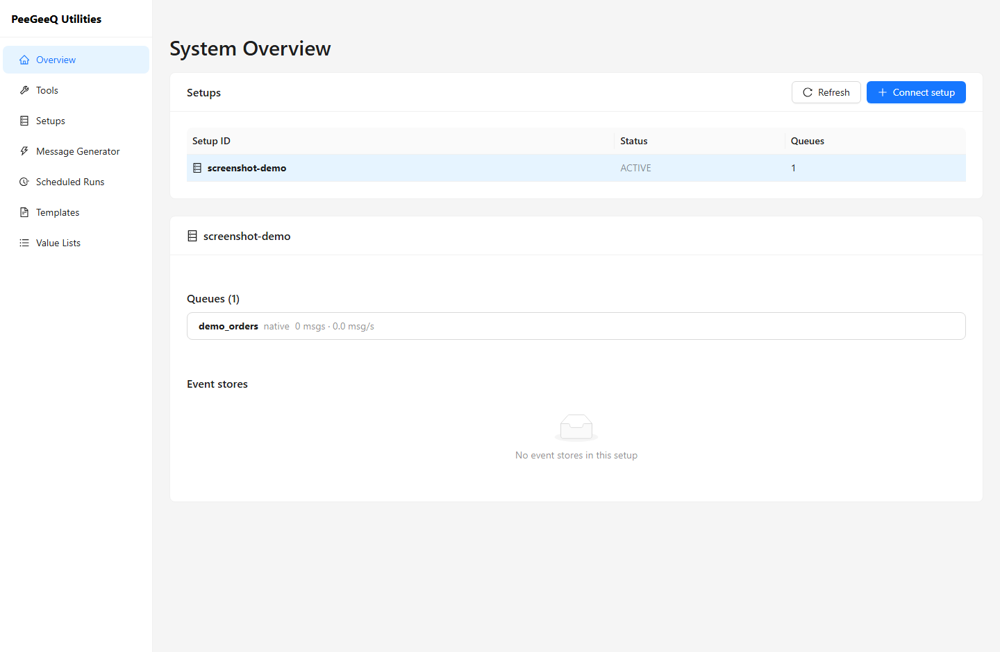 -->

---

## 7. Client-Side Publication Engine

The engine runs in the browser main thread using a `setInterval`-based tick loop. A Web Worker is deferred to v2.

### 7.1 Tick Algorithm

```
given:
  rate             (msg/s, positive integer, no upper limit)
  durationSecs
  maxBatchSize     (1–100, matches BatchMessageRequest cap)
  warnThreshold    (0 = no warning, non-blocking)
  maxConsecErrors  (0 = disabled)

batchSize   = min(maxBatchSize, max(1, floor(rate)))
tickMs      = (batchSize / rate) * 1000

runId         = randomUUID()       // generated once per run
correlationId = randomUUID()       // generated once per run
messageId     = 1                  // 1-based, increments per message
consecErrors  = 0

on each tick:
  if (Date.now() - startedAt) >= durationSecs * 1000:
    clearInterval
    transition to COMPLETED

  generate batchSize MessageRequests from template
    (messageId increments 1 per message; index = messageId - 1)

  for rates requiring multiple batches per tick (rate > maxBatchSize):
    split messages into groups of maxBatchSize
    fire all groups concurrently with Promise.allSettled

  for each batch response:
    on success (2xx):
      sent += batch.length
      consecErrors = 0
    on error:
      errors.push(PublishError)
      consecErrors += 1
      if maxConsecErrors > 0 && consecErrors >= maxConsecErrors:
        clearInterval
        transition to ERROR
        set autoStopReason = "Auto-stopped: {N} consecutive errors. Last: {message}"
        return

  update Zone E counters
```

### 7.2 State Machine

```
IDLE ──[Start]──────────────> RUNNING ──[duration elapsed]──────────> COMPLETED
                                  │
                               [Stop]──────────────────────────────> STOPPED
                                  │
                               [N consecutive errors, maxConsecErrors > 0]
                                  │
                                  └────────────────────────────────> ERROR
```

All transitions are reflected immediately in Zone D (button enabled states) and Zone E
(status label and summary card).

---

## 8. Template Resolution

Resolution is a pure TypeScript function with no side effects and no HTTP calls.

```typescript
// src/engine/templateResolver.ts

function randomAlpha(n: number): string {
  const chars = 'ABCDEFGHIJKLMNOPQRSTUVWXYZabcdefghijklmnopqrstuvwxyz0123456789'
  return Array.from({ length: n }, () => chars[Math.floor(Math.random() * chars.length)]).join('')
}

function pickFromList(name: string, valueLists: Record<string, string[]>): string {
  const list = valueLists[name]
  if (!list || list.length === 0) return ''   // missing/empty list → empty string
  return list[Math.floor(Math.random() * list.length)]
}

export function resolveTemplate(
  templateJson: string,
  context: {
    messageId: number                         // 1-based
    index: number                             // 0-based (messageId - 1)
    runId: string
    correlationId: string
    now: Date
    valueLists: Record<string, string[]>      // loaded from localStorage at run/preview start
  }
): object {
  const resolved = templateJson
    .replaceAll('{{messageId}}',     String(context.messageId).padStart(8, '0'))
    .replaceAll('{{sequenceId}}',    String(context.messageId).padStart(8, '0'))
    .replaceAll('{{uuid}}',          crypto.randomUUID())
    .replaceAll('{{timestamp}}',     context.now.toISOString())
    .replaceAll('{{unixMs}}',        String(context.now.getTime()))
    .replaceAll('{{correlationId}}', context.correlationId)
    .replaceAll('{{runId}}',         context.runId)
    .replaceAll('{{index}}',         String(context.index))
    .replace(/\{\{random:(\d+)\}\}/g,       (_, n) => String(Math.floor(Math.random() * Number(n))))
    .replace(/\{\{randomAlpha:(\d+)\}\}/g,  (_, n) => randomAlpha(Number(n)))
    .replace(/\{\{list:([A-Za-z0-9_-]+)\}\}/g, (_, name) => pickFromList(name, context.valueLists))

  return JSON.parse(resolved)
  // JSON.parse is intentional: surfaces template authoring errors before publish time.
  // The Preview action calls this with a try/catch and shows the parse error inline.
}

/**
 * Scans a template string and returns the names of any {{list:name}} tokens
 * whose list is missing or empty in the provided valueLists map.
 * Used by the pre-flight validation in Preview and Start.
 */
export function findMissingLists(
  templateJson: string,
  valueLists: Record<string, string[]>
): string[] {
  const names = [...templateJson.matchAll(/\{\{list:([A-Za-z0-9_-]+)\}\}/g)].map(m => m[1])
  return [...new Set(names)].filter(name => !valueLists[name] || valueLists[name].length === 0)
}
```

`JSON.parse` after substitution means the template author is responsible for valid JSON after
placeholder expansion. The Preview action wraps this in a `try/catch` and shows the error
inline so bad templates are caught before any HTTP calls are made.

The `valueLists` map is loaded once from localStorage at the start of each Preview or run;
it is not reloaded between ticks. Changes to value lists mid-run take effect on the next run.

---

## 9. Data Flow

```
User selects setup
  -> GET /api/v1/setups
     populates Setup dropdown

User selects queue
  -> GET /api/v1/setups/{setupId}/queues
     populates Queue dropdown (each queue shows its own implementationType badge)

User edits template, sets rate/duration/guards

  [Preview]
  -> resolveTemplate(template, { messageId: previewIndex, runId: newUUID(), ... })
     JSON shown in Modal — zero HTTP calls


```
---------------------------------------------------------------
                 if consecErrors >= maxConsecErrors (and > 0): auto-stop -> ERROR
---------------------------------------------------------------
       Zone E counters updated every 500ms

  duration elapsed  ->  COMPLETED  ->  summary card + download button
  [Stop] pressed    ->  STOPPED    ->  summary card + download button
  N consec errors   ->  ERROR      ->  summary card + auto-stop reason
```

---

## 10. Type Definitions

---------------------------------------------------------------
### `src/types/generator.ts`
---------------------------------------------------------------

```typescript
export type RunStatus = 'idle' | 'running' | 'completed' | 'stopped' | 'error'
---------------------------------------------------------------
```

/** A named list of string values used by {{list:name}} placeholder tokens. */
export interface ValueList {
  name: string          // localStorage key; must match [A-Za-z0-9_-]+
  values: string[]      // the actual string values
  createdAt: string     // ISO 8601
  updatedAt: string     // ISO 8601
}

export interface MessageTemplate {
  id: string
  name: string
  description?: string
  messageType: string
  payloadSchema: string
  headers: Record<string, string>
  priority: number
  delaySeconds: number
  messageGroup?: string
  createdAt: string
  updatedAt: string
}

export interface RunConfig {
  setupId: string
  queueName: string
  rate: number                // msg/s, no upper cap
  durationSecs: number
  maxBatchSize: number        // 1–100
  warnThreshold: number       // 0 = no warning (non-blocking)
  maxConsecErrors: number     // 0 = disabled
  template: MessageTemplate
  previewIndex: number        // messageId to use for Preview (default 1)
}

export interface PublishError {
  messageIndex: number
  httpStatus?: number
  message: string
  timestamp: string
}

export interface RunState {
  status: RunStatus
  totalToSend: number
  sent: number
  errors: PublishError[]
  elapsedMs: number
  currentRate: number         // rolling 1-second window
  consecErrors: number        // current consecutive error streak
  runId: string | null
  startedAt: number | null
  autoStopReason?: string     // populated when status === 'error'
}

export interface RunSummary {
  totalSent: number
  targetTotal: number
  avgRate: number
  durationMs: number
  totalErrors: number
  finalStatus: RunStatus
  runId: string
  errors: PublishError[]
}
```

### `src/types/queue.ts`

```typescript
export type QueueImplementationType = 'native' | 'outbox'

export interface SetupInfo {
  setupId: string
  status: string
  queueCount: number
  createdAt: number
}

export interface QueueInfo {
  name: string
  implementationType: QueueImplementationType   // per-queue, chosen at creation
  maxRetries: number
  visibilityTimeoutSeconds: number
  deadLetterEnabled: boolean
  batchSize: number
  fifoEnabled: boolean
}

/** Lightweight per-queue summary from GET /api/v1/setups/{id}/queues queueDetails[]. */
export interface QueueSummary {
  name: string
  implementationType: QueueImplementationType
}

/** Body for POST /api/v1/setups/{setupId}/queues. */
export interface CreateQueueRequest {
  queueName: string
  implementationType: QueueImplementationType
  maxRetries?: number
  visibilityTimeoutSeconds?: number
  batchSize?: number
  deadLetterEnabled?: boolean
  fifoEnabled?: boolean
}

export interface MessageRequest {
  payload: object
  headers?: Record<string, string>
  messageType?: string
  correlationId?: string
  priority?: number
  delaySeconds?: number
  messageGroup?: string
}

export interface BatchMessageRequest {
  messages: MessageRequest[]
  failOnError?: boolean
  maxBatchSize?: number
}
```

---

## 11. Zustand Stores

### `generatorStore` — run state

```typescript
// src/stores/generatorStore.ts

interface GeneratorState {
  config: RunConfig | null
  runState: RunState
  setConfig: (config: RunConfig) => void
  startRun: () => void
  stopRun: () => void
  resetRun: () => void
  tickUpdate: (sent: number, errors: PublishError[], consecErrors: number, elapsedMs: number) => void
  transitionTo: (status: RunStatus, autoStopReason?: string) => void
}
```

### `templateStore` — template management

```typescript
// src/stores/templateStore.ts

interface TemplateState {
  templates: MessageTemplate[]
  selected: MessageTemplate | null
  loadFromStorage: () => void
  saveToStorage: () => void
  add: (template: MessageTemplate) => void
  update: (template: MessageTemplate) => void
  remove: (id: string) => void
  duplicate: (id: string) => void
  select: (id: string | null) => void
  importTemplates: (incoming: MessageTemplate[]) => { added: number; skipped: string[] }
}
```

### `valueListStore` — value list management

```typescript
// src/stores/valueListStore.ts

interface ValueListState {
  lists: ValueList[]
  selected: ValueList | null
  loadFromStorage: () => void
  saveToStorage: () => void
  add: (list: ValueList) => void
  update: (list: ValueList) => void
  remove: (name: string) => void
  select: (name: string | null) => void
  /**
   * Returns a plain map suitable for passing directly to resolveTemplate.
   * Snapshot is taken at call time; changes during a run are not reflected mid-run.
   */
  snapshot: () => Record<string, string[]>
  /**
   * Import from a parsed JSON array. Handles Overwrite / Merge / Skip.
   * Returns a summary of what changed.
   */
  importList: (
    name: string,
    values: string[],
    mode: 'overwrite' | 'merge'
  ) => { name: string; added: number; total: number }
}
```

---

## 12. Service Layer

### `src/services/queueService.ts`

```typescript
getSetups(): Promise<SetupInfo[]>
  // GET /api/v1/setups

getQueues(setupId: string): Promise<QueueInfo[]>
  // GET /api/v1/setups/{setupId}/queues
```

### `src/services/publishService.ts`

```typescript
publishBatch(setupId: string, queueName: string, req: BatchMessageRequest): Promise<BatchResponse>
  // POST /api/v1/queues/{setupId}/{queueName}/messages/batch
  // Falls back to POST .../messages (single) if batch returns 404

publishSingle(setupId: string, queueName: string, req: MessageRequest): Promise<MessageResponse>
  // POST /api/v1/queues/{setupId}/{queueName}/messages
```

### `src/services/templateService.ts`

```typescript
loadAll(): MessageTemplate[]
  // Reads peegeeq_msg_templates from localStorage

saveAll(templates: MessageTemplate[]): void
  // Writes to localStorage

exportTemplate(template: MessageTemplate): void
  // Triggers browser download of single-template JSON file

exportAll(templates: MessageTemplate[]): void
  // Triggers browser download of all-templates JSON file

importFromFile(file: File): Promise<{ templates: MessageTemplate[]; errors: string[] }>
  // Parses and validates JSON file; returns valid templates and any error messages
```

### `src/services/valueListService.ts`

```typescript
loadAll(): Record<string, string[]>
  // Reads peegeeq_value_lists from localStorage; returns {} if absent

saveAll(lists: Record<string, string[]>): void
  // Writes to localStorage

/**
 * Parse a .json file upload into a string array.
 * Accepts a JSON array of strings or numbers (numbers coerced to strings).
 * Rejects objects, nested arrays, and null values.
 */
importFromFile(file: File): Promise<{
  values: string[]
  defaultName: string   // file base name without extension
  errors: string[]      // non-fatal warnings (e.g. coerced numbers)
}>

exportList(name: string, values: string[]): void
  // Triggers browser download of {name}.json containing the array

/**
 * Scan a template payload string for {{list:name}} tokens and return
 * the distinct list names referenced.
 */
extractListNames(payloadSchema: string): string[]
```

---

## 13. Publication Engine Interface

### `src/engine/publicationEngine.ts`

```typescript
interface PublicationEngine {
  start(config: RunConfig, callbacks: EngineCallbacks): void
  stop(): void
}

interface EngineCallbacks {
  onTick(sent: number, errors: PublishError[], consecErrors: number, elapsedMs: number): void
  onComplete(summary: RunSummary): void
  onStop(summary: RunSummary): void
  onError(summary: RunSummary, reason: string): void
}
```

The engine is instantiated fresh for each run and discarded on completion. It holds no
persistent state. The `generatorStore` owns all state; the engine only calls back into it.

---

## 14. Proposed File Structure

```
peegeeq-utilities-ui/
  docs/
    PEEGEEQ_QUEUE_MESSAGE_GENERATOR_DESIGN.md    (this document)
  src/
    pages/
      Overview.tsx                        (existing)
      CreateSetupPage.tsx                 (Create Setup form — §6.4)
      CreateQueuePage.tsx                 (Create Queue form — §6.5)
      SetupDetailPage.tsx                 (setup detail + queue list/create/delete — §6.5)
      generator/
        MessageGeneratorPage.tsx          (root page — assembles Zones A–E)
        TargetSelector.tsx                (Zone A)
        RateControls.tsx                  (Zone B)
        TemplateEditor.tsx                (Zone C)
        GeneratorActions.tsx              (Zone D)
        ProgressPanel.tsx                 (Zone E)
      templates/
        TemplateManagerPage.tsx           (CRUD template list)
      value-lists/
        ValueListManagerPage.tsx          (CRUD value list manager — §6.3)
    services/
      apiConstants.ts                     (existing)
      configService.ts                    (existing)
      setupService.ts                     (create setup — §6.4)
      queueService.ts                     (create/list/delete queues — §6.5)
      publishService.ts                   (POST single + batch, with fallback)
      templateService.ts                  (localStorage CRUD + file import/export)
      valueListService.ts                 (localStorage CRUD + file import/export for lists)

  ```
  ---------------------------------------------------------------
      valueListStore.ts                   (value list CRUD + snapshot for resolver)
  ---------------------------------------------------------------
    services/
      valueListService.ts                 (localStorage CRUD + file import/export for lists)
    types/
      generator.ts                        (MessageTemplate, ValueList, RunConfig, RunState, RunSummary, PublishError)
      queue.ts                            (SetupInfo, QueueInfo, MessageRequest, BatchMessageRequest)
```

---

## 15. Navigation Changes

  ---------------------------------------------------------------
Two new sidebar entries added to `App.tsx`:
  ---------------------------------------------------------------

| Label             | Route                       | Icon                  | Position in sidebar     |
|-------------------|-----------------------------|-----------------------|-------------------------|
  ---------------------------------------------------------------
  ```
| Message Generator | `/generator`                | `ThunderboltOutlined` | Below Overview          |
| Templates         | `/generator/templates`      | `FileTextOutlined`    | Below Message Generator |
| Value Lists       | `/generator/value-lists`    | `UnorderedListOutlined` | Below Templates       |

---

## 16. API Integration Summary

| Operation              | Method | Path                                                              |
|------------------------|--------|-------------------------------------------------------------------|
| List setups            | GET    | `/api/v1/setups`                                                  |
| List queues for setup  | GET    | `/api/v1/setups/{setupId}/queues`  *(enriched with `queueDetails[]` — §6.5)* |
| Create setup           | POST   | `/api/v1/database-setup/create`  *(Create Setup page — §6.4)*    |
| Create queue           | POST   | `/api/v1/setups/{setupId}/queues`  *(Queue Management — §6.5; carries `implementationType`)* |
| Delete queue           | DELETE | `/api/v1/setups/{setupId}/queues/{queueName}`  *(Queue Management — §6.5)* |
| Publish single message | POST   | `/api/v1/queues/{setupId}/{queueName}/messages`                   |
| Publish batch          | POST   | `/api/v1/queues/{setupId}/{queueName}/messages/batch`             |

---

## 17. v1 Constraints and Future Work

| v1 Constraint                                      | Future (v2+)                                          |
|----------------------------------------------------|-------------------------------------------------------|
| `localStorage` template persistence                | REST-backed template storage in backend               |
| Browser main-thread rate control (setInterval)     | Web Worker for very high rates (> 500 msg/s)          |
| Plain monospace textarea JSON editor               | Monaco editor with JSON schema + token highlighting   |
| No authentication on API calls                     | Bearer token / API key via a Settings page            |
| `{{list:name}}` values are plain strings only      | Typed lists (integers, decimals, booleans, nested JSON objects) |
| Fixed built-in placeholder set                     | User-defined JavaScript expression placeholders       |
| No message consumer or reader panel                | Paired consumer panel for round-trip testing          |
| Max 20 errors stored in run summary                | Configurable error retention + downloadable full log  |
| No multi-queue fan-out                             | Publish to multiple queues simultaneously in one run  |

---

## 18. Implementation Plan

Each phase is independently shippable and builds on the previous. Within each phase, items are
ordered so that foundational pieces (types, services) come before the UI components that
consume them.

---

### Phase 1 — Quick Setup Wizard

**Goal:** A user with a fresh PeeGeeQ backend and no existing setup can create one entirely
inside the utilities UI. Queues are created and managed in Phase 1B (§6.5), not here.

#### Step 1.1 — Types

File: `src/types/setup.ts` *(new)*

```typescript
export interface CreateSetupRequest {
  setupId: string
  databaseConfig: {
    host: string
    port: number
    databaseName: string
    username: string
    password: string
    schema: string
    sslEnabled: false
    templateDatabase: 'template0'
    encoding: 'UTF8'
  }
  queues: []
  eventStores: []
}
```

No `CreateQueueRequest` here — queue creation lives in `queueService.ts` (§6.5 / Phase 1B).
No runtime behaviour — pure type definitions. Derive defaults from these in the service layer,
not in the component.

#### Step 1.2 — Service layer

File: `src/services/setupService.ts` *(new)*

```typescript
createSetup(req: CreateSetupRequest): Promise<void>
  // POST /api/v1/database-setup/create
  // timeout: 120 000 ms (database creation is slow)
  // throws AxiosError on non-2xx; caller handles error display

getSetups(): Promise<string[]>
  // GET /api/v1/setups → string[]

getQueues(setupId: string): Promise<string[]>
  // GET /api/v1/setups/{setupId}/queues → string[]
```

No `createQueue` here — that lives in `queueService.ts` (§6.5 / Phase 1B).
Keep this service stateless and side-effect-free beyond the HTTP calls. No store access.

#### Step 1.3 — CreateSetupPage component

File: `src/pages/CreateSetupPage.tsx` *(new)*

A full-page form at route `/generator/setup/new` — no modal or overlay.
Maximum width 520 px, wrapped in an Ant Design `Card`.

**No props** — navigation is handled via React Router `useNavigate`.

**Internal state:**
```typescript
loading: boolean
error: string | null
```

**Form fields:**

| Field | Ant Design component | Default | Required |
|---|---|---|---|
| Setup name (`setupId`) | `Input` | — | yes |
| Database name (`databaseName`) | `Input` | — | yes |
| Database password (`password`) | `Input.Password` | — | yes |
| *(collapsed)* Host | `Input` | `localhost` | no |
| *(collapsed)* Port | `InputNumber` | `5432` | no |
| *(collapsed)* Username | `Input` | `peegeeq` | no |
| *(collapsed)* Schema | `Input` | `public` | no |

The four optional fields are wrapped in a single `Collapse` panel labelled
"Connection details". The panel is closed by default.

**Submit logic:**
1. `form.validateFields()` — required fields only.
2. Set `loading = true`, clear `error`.
3. Call `setupService.createSetup(...)` with 120 s timeout.
4. On success: `navigate('/generator')`. Zone A re-mounts and reloads setups.
5. On error: set `error` to `axiosError.response?.data?.error ?? axiosError.message`;
   render as `<Alert type="error" message={error} />` above the form buttons.
   Stay on the page for retry.

**Cancel / Back:** both call `navigate('/generator')` without creating anything.

#### Step 1.4 — TargetSelector component

File: `src/components/TargetSelector.tsx` *(new)*

Zone A of the Message Generator page. Renders one of three states:

**Empty state — no setups** (`setups.length === 0` after initial load):
- Ant Design `Alert type="info"` with message, description, and an `action` prop containing
  the `[+ Create Setup]` button.
- Clicking navigates to `/generator/setup/new`.
- On return from the Create Setup page, Zone A re-mounts and reloads setups automatically.

**No-queues state** (setup selected but `queues.length === 0`):
- Ant Design `Alert type="info"` explaining that at least one queue must be created on the
  setup detail page before publishing.
- A `[Manage queues →]` link (`Typography.Link` or React Router `Link`) navigates to
  `/setups/{setupId}`.

**Normal state** (setup selected and `queues.length > 0`):
- Setup `Select` dropdown populated from `GET /api/v1/setups`.
- Queue `Select` dropdown populated from `GET /api/v1/setups/{setupId}/queues` when setup
  changes; clears queue selection on setup change.
- `[Manage queues →]` link navigates to `/setups/{setupId}` (React Router `Link`).
- Calls `props.onTargetSelected(setupId, queueName)` whenever both are selected.

**Props:**
```typescript
interface TargetSelectorProps {
  onTargetSelected: (setupId: string, queueName: string) => void
}
```

**Data fetching:**
- Fetch setups on mount.
- No polling in this component (polling lives in the Overview page).
- Show `Spin` while loading; show `Alert type="error"` on fetch failure (not empty-state).

#### Step 1.5 — Wire into App.tsx

- Add `/generator` route rendering `MessageGeneratorPage` (stub page is fine for now —
  just renders `<TargetSelector />` plus placeholder zones B–E).
- Add sidebar entries per §15 (Navigation Changes).

#### Step 1.6 — Verification

1. **Banned-patterns grep** on every touched file — no `.recover`, `.otherwise`, blocking
   bridges, or JDBC patterns.
2. `npm run build` — must produce zero TypeScript errors.
3. Manual smoke test (browser):
   - Backend with zero setups: Zone A shows info banner + `[+ Create Setup]` button.
   - Complete wizard: Zone A updates to show new setup selected; no-queues banner appears with
     `[Manage queues →]` link.
   - Backend with existing setups but no queues for selected setup: no-queues banner shown.
   - Backend with existing setups and queues: Zone A shows dropdowns + `[Manage queues →]` link.

---

### Phase 1B — Queue Management (backend gap + UI)

**Goal:** A user can create at least one queue under a setup, choosing its implementation type
(`native` / `outbox`), and the chosen type is actually honoured end to end. Without this the
generator has nothing to publish to. See §6.5 for the full design and the verified backend gap.

> This phase spans Java modules (peegeeq-api, peegeeq-rest, peegeeq-db) **and** the React app.
> The Java change is a multi-module change, so the validation command is
> `mvn clean test -Pall-tests` (provide the command; the user runs it).

#### Backend (do first — the wiring must exist before the UI can rely on it)

| Step | File | What to build |
|---|---|---|
| 1B.1 | `QueueConfig.java` (peegeeq-api) | Add nullable `implementationType` field + getter + `Builder.implementationType(...)`; new `@JsonCreator` ctor incl. the field; **keep** the existing ctor delegating `null`. |
| 1B.2 | `ConfigParser.java` (peegeeq-rest) | Read optional `implementationType` (fallback `type`); validate `∈ {native, outbox}` → else `IllegalArgumentException` (→ 400); `null` when absent. |
| 1B.3 | `PeeGeeQDatabaseSetupService.createQueueFactories` (peegeeq-db) | Resolve type **per queue**: `qc.getImplementationType()` else `getBestAvailableType()`; validate `isTypeSupported`; fail a *requested* unsupported type clearly. |
| 1B.4 | `DatabaseSetupHandler.addQueue`, `ManagementApiHandler.createQueue` (peegeeq-rest) | Map unsupported-type failure → `400`; echo created queue `implementationType` in the response. |
| 1B.5 | `DatabaseSetupHandler.listQueues` (peegeeq-rest) | Additively add `queueDetails: [{ name, implementationType }]`; keep `count` + `queues` for back-compat. |

*Read `docs-design/dev/pgq-coding-principles.md` and the testing antipatterns doc first.
Vert.x reactive-only; no `.recover`/`.otherwise`/`.await`/`CompletableFuture`/blocking bridges.
Add/extend integration tests for per-queue type selection (`@Tag(INTEGRATION)`,
`@Testcontainers`, `PostgreSQLTestConstants`).*

#### Frontend

| Step | File | What to build |
|---|---|---|
| 1B.6 | `src/types/queue.ts` | `QueueImplementationType`, `QueueSummary`, `CreateQueueRequest` (§10). |
| 1B.7 | `src/services/queueService.ts` | `createQueue(setupId, req)`, `deleteQueue(setupId, name)`, `listQueueDetails(setupId)`. |
| 1B.8 | `src/pages/CreateQueuePage.tsx` | Full-page form at `/setups/:setupId/queues/new` — name + type `Select` + Advanced panel (§6.5). **No modal.** |
| 1B.9 | `SetupDetailPage.tsx` | Per-queue type badge (green native / orange outbox), Create-queue button, per-row Delete (`Popconfirm`). |
| 1B.10 | `App.tsx` / `TargetSelector.tsx` | Register the route; wire the `Manage queues →` link to the setup queues view. |

#### Verification

1. Banned-patterns grep on every touched file (Java **and** TS).
2. Java: `mvn clean test -Pall-tests` (multi-module change) — provide command, user runs it.
3. Frontend: `npm run build` clean; Vitest for `queueService`; Playwright create-queue happy path.

---

### Phase 2 — Foundation: types, engine, stores, services

*Prerequisite: Phase 1 complete.*

| Step | File | What to build |
|---|---|---|
| 2.1 | `src/types/generator.ts` | `RunStatus`, `ValueList`, `MessageTemplate`, `RunConfig`, `RunState`, `RunSummary`, `PublishError` (§10) |
| 2.2 | `src/types/queue.ts` | `SetupInfo`, `QueueInfo`, `MessageRequest`, `BatchMessageRequest` (§10) |
| 2.3 | `src/engine/templateResolver.ts` | `resolveTemplate`, `findMissingLists`, `pickFromList` (§8) |
| 2.4 | `src/services/templateService.ts` | localStorage CRUD + file import/export (§12) |
| 2.5 | `src/services/valueListService.ts` | localStorage CRUD + file import/export (§12) |
| 2.6 | `src/services/publishService.ts` | `publishBatch` + `publishSingle` with batch→10 fallback (§12) |
| 2.7 | `src/stores/templateStore.ts` | Zustand store (§11) |
| 2.8 | `src/stores/valueListStore.ts` | Zustand store with `snapshot()` (§11) |
| 2.9 | `src/stores/generatorStore.ts` | Zustand store for run state (§11) |
| 2.10 | `src/engine/publicationEngine.ts` | `setInterval` tick loop + state machine + callbacks (§7, §13) |

Each step should be followed by `npm run build` to keep the compile clean. Steps 2.1–2.6 have
no inter-dependencies and can be created in parallel. Steps 2.7–2.9 depend on 2.1–2.2.
Step 2.10 depends on all preceding steps.

---

### Phase 3 — Generator page UI (Zone A already done in Phase 1)

*Prerequisite: Phase 2 complete.*

| Step | File | Zone |
|---|---|---|
| 3.1 | `src/pages/generator/RateControls.tsx` | Zone B — rate, duration, guards |
| 3.2 | `src/pages/generator/TemplateEditor.tsx` | Zone C — template selector + JSON editor + headers |
| 3.3 | `src/pages/generator/GeneratorActions.tsx` | Zone D — preview index, Preview / Start / Stop buttons |
| 3.4 | `src/pages/generator/ProgressPanel.tsx` | Zone E — progress bar, counters, error list, summary card |
| 3.5 | `src/pages/generator/MessageGeneratorPage.tsx` | Assembles Zones A–E, owns `generatorStore` subscription |

Build in the order listed: B before C (C reads rate for validation hints), D after C, E last.

---

### Phase 4 — Template Manager page

*Prerequisite: Phase 2 complete. Can run in parallel with Phase 3.*

| Step | File | What to build |
|---|---|---|
| 4.1 | `src/pages/templates/TemplateManagerPage.tsx` | Table of templates, New / Import toolbar, Edit / Duplicate / Delete / Export row actions (§6.2) |

---

### Phase 5 — Value List Manager page

*Prerequisite: Phase 2 complete. Can run in parallel with Phases 3–4.*

| Step | File | What to build |
|---|---|---|
| 5.1 | `src/pages/value-lists/ValueListManagerPage.tsx` | Table + edit panel + upload/export (§6.3) |

---

### Phase 6 — Integration and end-to-end testing

| Step | What |
|---|---|
| 6.1 | Vitest unit tests for `templateResolver.ts` — all placeholder types including `{{list:name}}` miss/hit cases |
| 6.2 | Vitest unit tests for `templateService.ts` and `valueListService.ts` — localStorage round-trips |
| 6.3 | Vitest unit tests for `publicationEngine.ts` — tick count, COMPLETED/STOPPED/ERROR transitions |
| 6.4 | Playwright E2E: Quick Setup Wizard happy path (requires live backend) |
| 6.5 | Playwright E2E: Generator run — start, observe Zone E counters increment, stop |
| 6.6 | `mvn test -pl :peegeeq-utilities-ui -Pall-tests` — run all profiles; provide command for user |

---

### Build order summary

```
Phase 1 (Quick Setup Wizard)
  └── Phase 1B (Queue Management: backend gap + UI)
        └── Phase 2 (Foundation)
              ├── Phase 3 (Generator UI)
              ├── Phase 4 (Template Manager)   <- parallel with Phase 3
              └── Phase 5 (Value List Manager)  <- parallel with Phases 3 & 4
                    └── Phase 6 (Tests)
```

---

## 19. Generation Tool Suite

These are the utilities-ui's legitimate additional tools. All are **generation-side** — they
produce controlled message load — and therefore sit on the correct side of the boundary with
`peegeeq-management-ui` (utilities-ui *writes load in*; management-ui *reads and operates* what is
there). None duplicate a management-ui screen; where a run needs to be inspected afterwards, that
inspection happens in management-ui (MessageBrowser, CausationTree, Events, Monitoring).

**Shared foundation.** Every tool below is built on the pieces this document already defines — the
`publicationEngine` (§7, §13), `publishService` batch/single publish (§12), `RunConfig`/`RunState`
(§10), templates (§5), and value lists (§5.5). They extend the generator rather than replacing it.
Because `MessageRequest` already carries `delaySeconds`, `priority`, and `messageGroup`, and the
template system already provides `{{correlationId}}`/`{{runId}}`, most tools need **little or no new
backend work** — they are new *drivers* over the existing engine.

**Telemetry.** What instrumentation these tools require from PeeGeeQ — what the client meters itself,
what the backend already exposes, and the gaps to close — is specified in
[PEEGEEQ_TELEMETRY_REQUIREMENTS.md](PEEGEEQ_TELEMETRY_REQUIREMENTS.md). Only two tools carry a real backend
dependency: Native-vs-Outbox comparison (§19.2) and rich breaking-point attribution (§19.1).

**Presentation.** These surface as **modes of the Message Generator** (a mode selector: Flat rate ·
Ramp · Compare · Profile), not as separate management-style pages. If a landing is wanted, the
otherwise-dead `/tools` route is repurposed as the launcher for this suite (never as a duplicate of
Overview).

### 19.0 Mode mockups (visual reference)

All modes share the generator frame (Zone A target, Zone C template, Zone D actions). Only the
control block (Zone B) and the results block (Zone E) change per mode. A mode selector sits at the
top; a Scenario bar (§19.4) is available in every mode.

```
Queue Message Generator
Mode:  ( • Flat rate ) ( Ramp ) ( Compare ) ( Profile ) ( Delay/Prio/FIFO ) ( Trace seed )
Scenario: [ nightly-soak ▾ ]   [Load]  [Save as…]  [Export]  [Import]
```

#### 19.1 — Ramp (breaking-point) mode

```
Mode:  ( Flat ) ( • Ramp ) ( Compare ) ( Profile ) ( Delay/Prio/FIFO ) ( Trace )

[A] Target    Setup: [ demo-setup ▾ ]    Queue: [ orders  native ▾ ]

[B] Ramp settings
    Start rate: [ 10 ] msg/s    Step: [ +50 ] msg/s    Step every: [ 10 ] s
    Stop when:  ( • error rate > [ 5 ]% )  ( acked-rate plateau )  ( latency rise )
    Max rate cap (optional): [ 5000 ]

[D]  [Preview]   [Start ramp]   [Stop]

[E] Ramp progress                         Step 6   Requested 260/s   Acked 244/s
    msg/s ┤                    ....•••••  ← knee
          ┤            ..••••••
          ┤     ..•••••
          ┤ ..••
          └──────────────────────────────── requested rate →
    ► Saturation point ≈ 300 msg/s   (acked plateaued at ~290, errors began climbing)
```

#### 19.2 — Compare (native vs outbox) mode

```
Mode:  ( Flat ) ( Ramp ) ( • Compare ) ( Profile ) ( Delay/Prio/FIFO ) ( Trace )

[A] Targets
    Native queue:  [ demo-setup ▾ ] / [ orders  native ▾ ]
    Outbox queue:  [ demo-setup ▾ ] / [ events  outbox ▾ ]
[B] Shared load   Rate: [ 200 ] msg/s   Duration: [ 60 ] s   Template: [ order.created ▾ ]

[D]  [Start comparison]   [Stop]

[E] Results
    ┌─────────────────┬─────────────────┐
    │ native          │ outbox          │
    │ sent    12,000  │ sent    12,000  │
    │ acked   11,980  │ acked   11,400  │
    │ rate    199/s   │ rate    190/s   │
    │ errors  0       │ errors  12      │
    │ p95     4 ms    │ p95     28 ms   │
    └─────────────────┴─────────────────┘
    ► native sustained 200 msg/s better (lower p95, no errors)
```

#### 19.3 — Profile (traffic shape) mode

```
Mode:  ( Flat ) ( Ramp ) ( Compare ) ( • Profile ) ( Delay/Prio/FIFO ) ( Trace )

[A] Target    Setup: [ demo-setup ▾ ]    Queue: [ orders  native ▾ ]
[B] Phases                                                   [+ Add phase]
    #  Phase     Rate (msg/s)   Duration (s)
    1  burst     [ 500 ]        [ 10 ]        [x]
    2  steady    [ 100 ]        [ 60 ]        [x]
    3  spike     [ 800 ]        [ 5  ]        [x]
    4  idle      [ 0   ]        [ 15 ]        [x]

[D]  [Start profile]   [Stop]

[E] Achieved vs requested
    msg/s ┤ █                █
          ┤ █    ▁▁▁▁▁▁▁▁    █
          ┤ █▁▁▁▁█▁▁▁▁▁▁▁▁▁▁▁█▁▁▁▁
          └──────────────────────────── time →   requested ░  achieved █
    Per phase:  burst 4,980/5,000 · steady 6,000/6,000 · spike 3,900/4,000 · idle 0/0
```

#### 19.4 — Saved scenarios (manager)

```
Scenario bar (every mode):  Scenario: [ nightly-soak ▾ ]  [Load] [Save as…] [Export] [Import]

┌─ Scenarios ──────────────────────────────────────────── [+ New]  [Import] ┐
│  Name          Target          Mode     Rate / Profile    Updated          │
│  nightly-soak  demo / orders    Flat     100/s · 1h        2d ago   Load·Export·Del
│  spike-repro   demo / orders    Profile  4 phases          1h ago   Load·Export·Del
│  native-vs-ob  demo / o + e     Compare  200/s · 60s       5m ago   Load·Export·Del
└─────────────────────────────────────────────────────────────────────────────┘
   (A scenario is a saved RunConfig (+profile); Load populates the generator, Run replays it.)
```

#### 19.5 — Delay / Priority / FIFO exerciser mode

```
Mode:  ( … ) ( • Delay/Prio/FIFO ) ( … )

[A] Target    Setup: [ demo-setup ▾ ]    Queue: [ orders  native ▾ ]
[B] Ordering & scheduling
    Delay:     ( fixed [ 5 ]s )  ( random 0–[ 10 ]s )  ( per-index ramp )
    Priority:  ( fixed [ 5 ] )   ( round-robin 1–10 )
    Group:     ( single [ orders ] )  ( round-robin [ 4 ] groups )  ( per-key {{customerId}} )
[B] Rate: [ 50 ] msg/s    Duration: [ 30 ] s

[D]  [Start]   [Stop]   [Download manifest]

[E] Sent manifest   (id → group · priority · delay)
    00000001   grp-0   p5   d5s
    00000002   grp-1   p6   d0s
    00000003   grp-2   p3   d8s     …
    ► Verify ordering downstream in management-ui → MessageBrowser
```

#### 19.6 — Correlation / trace seed mode

```
Mode:  ( … ) ( • Trace seed ) ( … )

[A] Target    Setup: [ demo-setup ▾ ]    Queue: [ orders  native ▾ ]
[B] Correlation strategy
    correlationId:  ( one per run )  ( per batch )  ( every [ 100 ] msgs )
    Seed causation chains: [✓]   parent → child   ([ 3 ] children per parent)
[B] Rate: [ 50 ] msg/s    Duration: [ 30 ] s    Template: [ order.created ▾ ]

[D]  [Start]   [Stop]   [Copy ids]

[E] Emitted ids   (paste into management-ui → CausationTree / Events)
    runId:          5f2c…e9
    correlationIds: a1b2… (root) → c3d4…, e5f6…, 07a8…
    ► 1,200 messages under 12 correlation ids / 3 causation chains
```

---

### 19.1 Breaking-point / ramp load test

Auto-increases the publish rate in steps until errors or backpressure appear, then reports the
saturation point. Directly serves the "load and breaking-point testing" goal in §2.

- **Controls:** start rate, step size, step duration, stop condition (error-rate threshold, or
  observed acked-rate plateau / latency rise).
- **Mechanics:** wraps `publicationEngine` in a stepper that raises `RunConfig.rate` each interval;
  monitors `RunState` (acked rate, errors, consecutive errors) to detect the knee.
- **Output:** a rate-vs-throughput/error curve and the reported max sustained rate.

### 19.2 Native-vs-Outbox comparison run

Fires identical load at one `native` and one `outbox` queue at the same time and compares
throughput and latency. PeeGeeQ-specific (two implementation types); nothing in management-ui does
this.

- **Controls:** two targets (native queue + outbox queue), shared rate/duration/template.
- **Mechanics:** two engine instances driven from one config; per-target `RunState` collected side
  by side.
- **Output:** side-by-side sent/acked-rate/error/latency, and a summary of which implementation
  sustained the load better.

### 19.3 Traffic-profile / scenario runner

Sequences generation phases (e.g. burst → steady → spike → idle) to reproduce a realistic traffic
shape instead of one flat rate.

- **Controls:** an ordered list of phases, each `{ rate, durationSecs }` (optionally per-phase
  template).
- **Mechanics:** runs phases back to back against one target, reconfiguring the engine per phase;
  one continuous `RunState` timeline.
- **Output:** the achieved rate timeline vs the requested profile, plus per-phase totals/errors.

### 19.4 Saved scenarios

Persists a full run config (target + rate/duration/guards + template ref + profile) as a named
scenario and re-runs it. The generation-side companion to templates (§5) and value lists (§5.5).

- **Storage:** `localStorage` (key e.g. `peegeeq_scenarios`), same pattern/service shape as
  `templateService`/`valueListService`; export/import as `.json`.
- **Mechanics:** a scenario is a serialised `RunConfig` (+ profile for §19.3); loading one populates
  the generator; running one replays it.

### 19.5 Delay / Priority / FIFO exerciser

Deliberately drives `delaySeconds`, `priority`, and `messageGroup` to test scheduling and ordering,
then the result is verified in management-ui's browser.

- **Controls:** per-message or per-batch delay/priority; a `messageGroup` strategy (single group,
  round-robin N groups, or per-key) to exercise FIFO ordering.
- **Mechanics:** sets the corresponding `MessageRequest` fields at build time — no backend change.
- **Output:** a manifest of what was sent (id → group/priority/delay) so ordering can be checked
  downstream.

### 19.6 Correlation / trace seed generator

Emits messages carrying structured `correlationId`/`runId` patterns so a run can be traced
afterwards in management-ui's CausationTree/Events views.

- **Controls:** correlation strategy (one id per run, per batch, or per N messages), and whether to
  seed causation chains (parent → child ids).
- **Mechanics:** reuses the `{{correlationId}}`/`{{runId}}` tokens (§5.3) plus a small id-scheme
  option; purely template/header population.
- **Output:** the list of correlation/run ids emitted, ready to paste into management-ui's trace
  search.

---

## Appendix A — UI Screenshots

Full-page screenshots of every page and primary action in the PeeGeeQ Utilities UI.

These images are generated automatically and are kept in sync with the implementation.
To regenerate them after a UI change, run from the `peegeeq-utilities-ui` directory:

```powershell
npx playwright test --config=playwright.screenshots.config.ts
```

The capture spec (`src/tests/e2e/specs/screenshots.spec.ts`) starts a TestContainers
PostgreSQL instance and a PeeGeeQ REST backend, walks each page, creates and deletes a
throwaway `screenshot-demo` setup and `demo_orders` queue to populate the data-bearing
pages, and writes each full-page PNG into `docs/screenshots/`.

### A.1 Pages

#### 01 — Overview (`/`)


#### 02 — Tools (`/tools`)

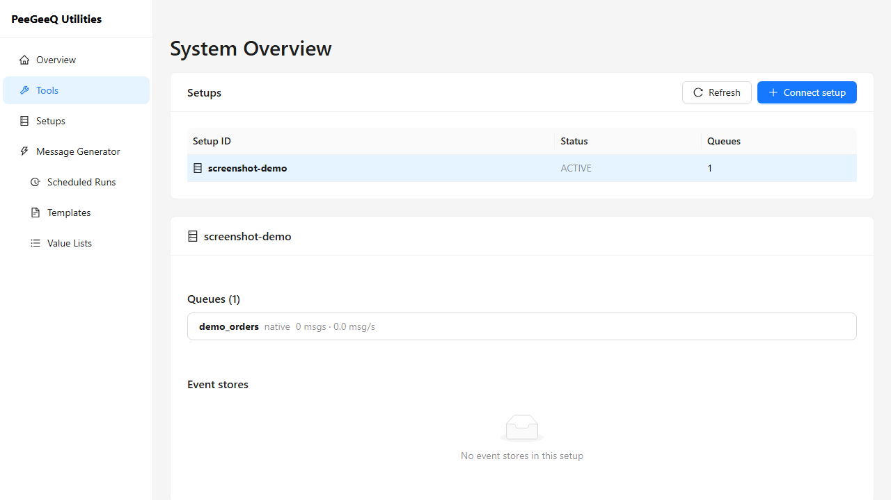

#### 03 — Message Generator (`/generator`)

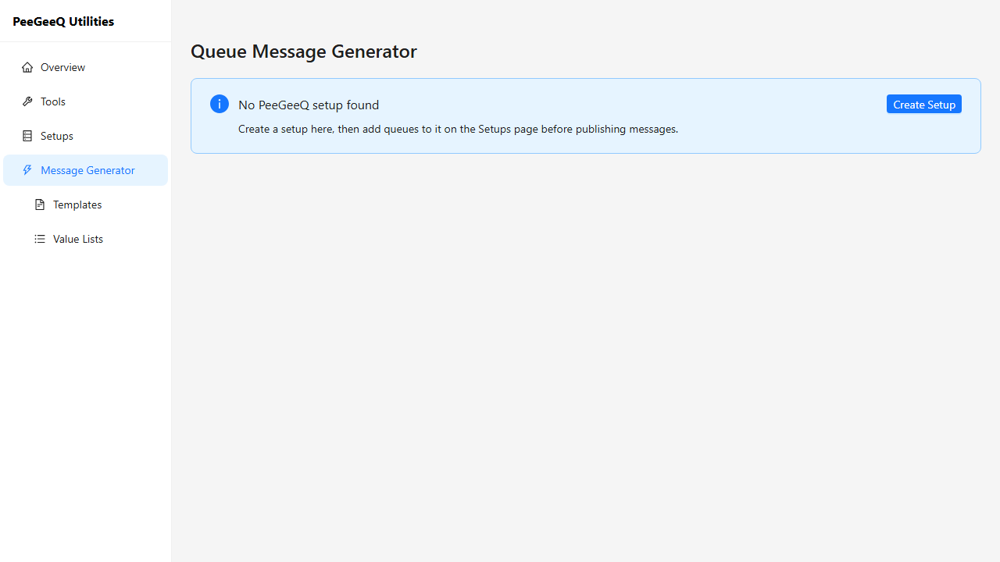

#### 04 — Templates (Phase 3 placeholder) (`/generator/templates`)

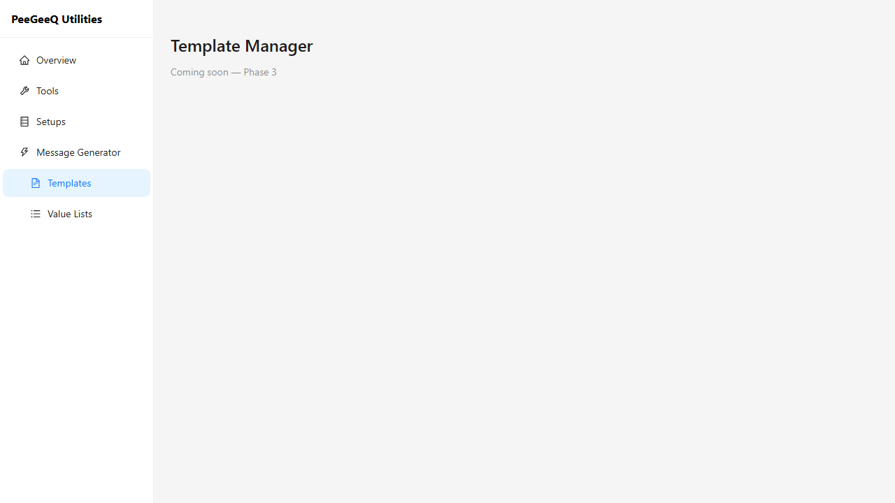

#### 05 — Value Lists (Phase 3 placeholder) (`/generator/value-lists`)

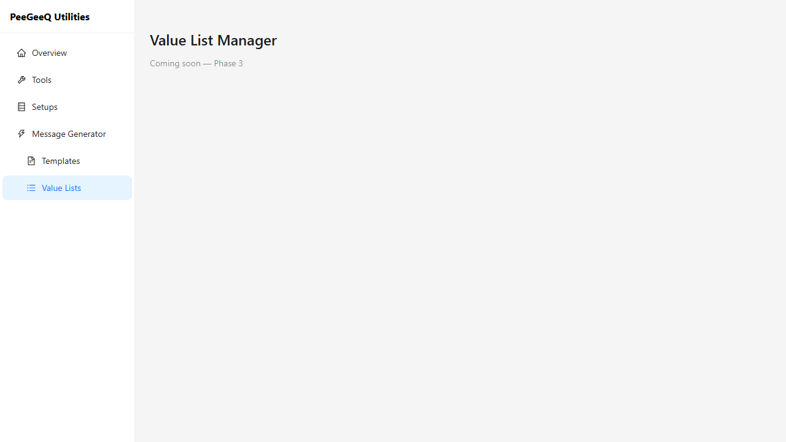

#### 06 — Setups list (`/setups`)

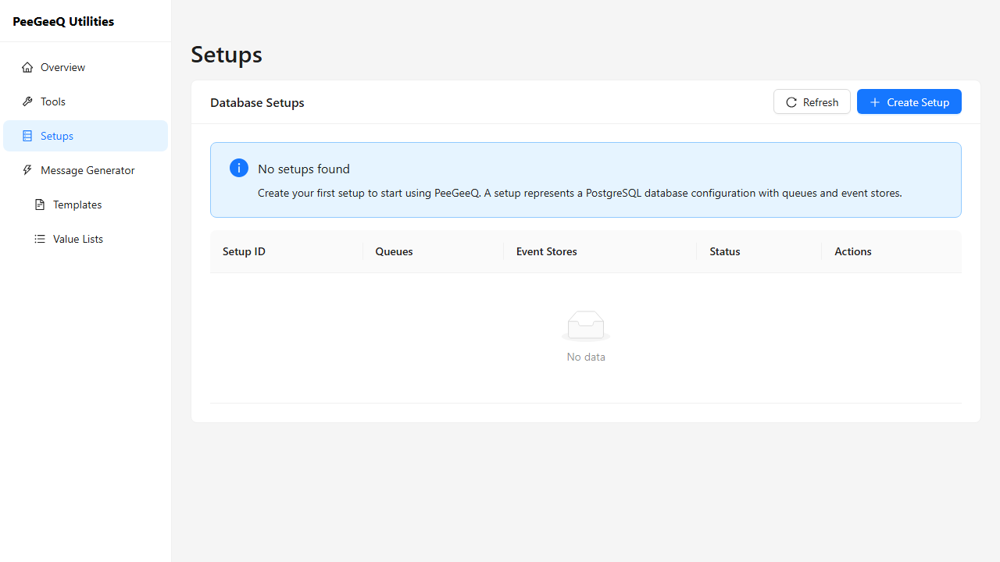

#### 10 — Setup detail, no queues (`/setups/:setupId`)

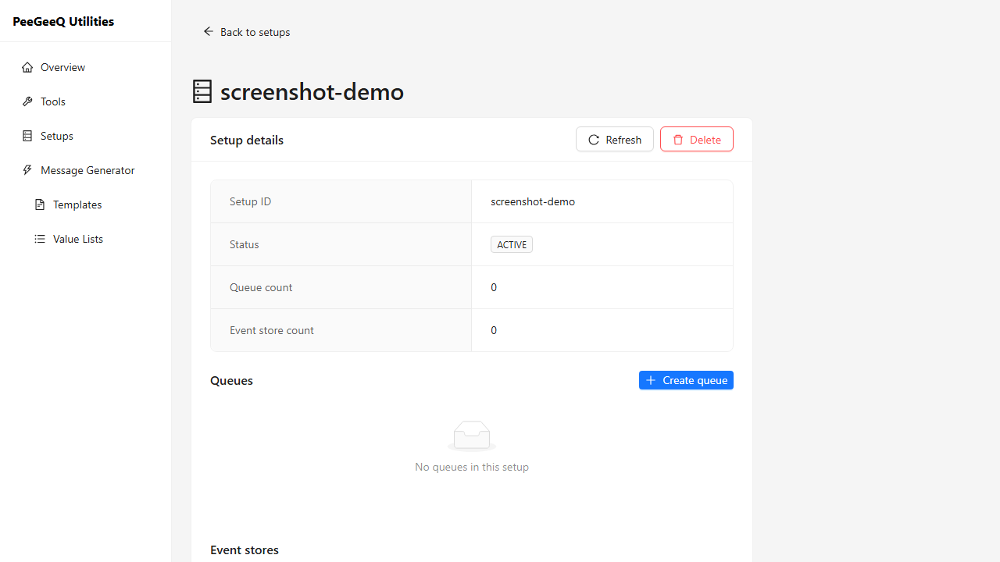

#### 13 — Setup detail, with queue (`/setups/:setupId`)

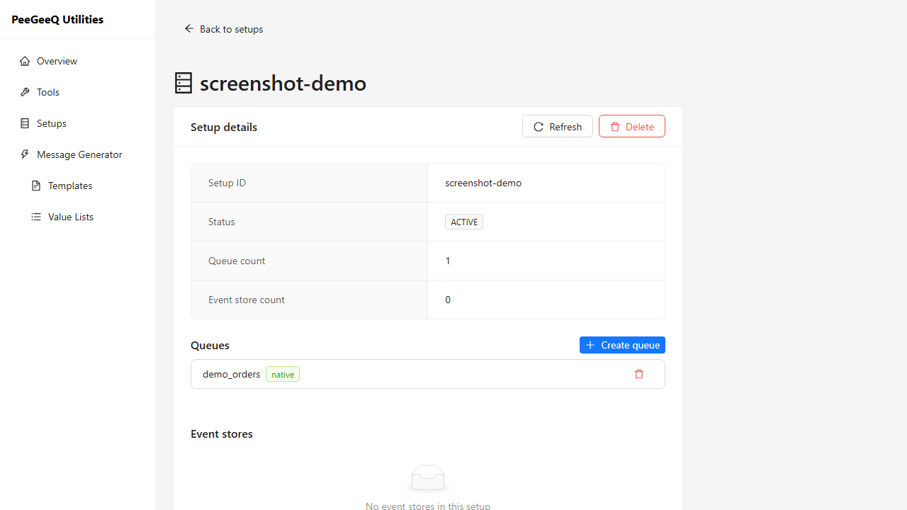

### A.2 Actions

#### 07 — Create Setup, empty form

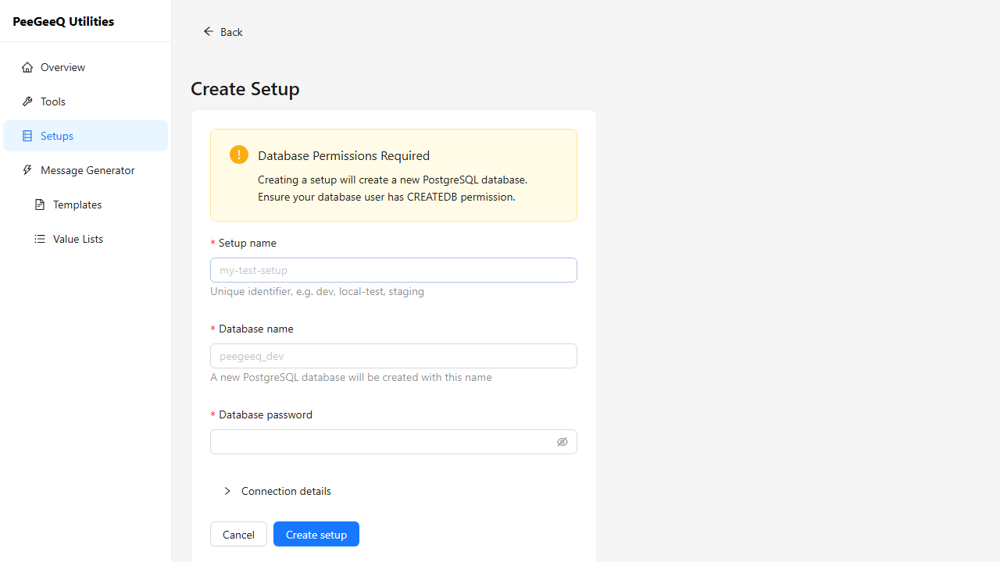

#### 08 — Create Setup, filled with connection details expanded

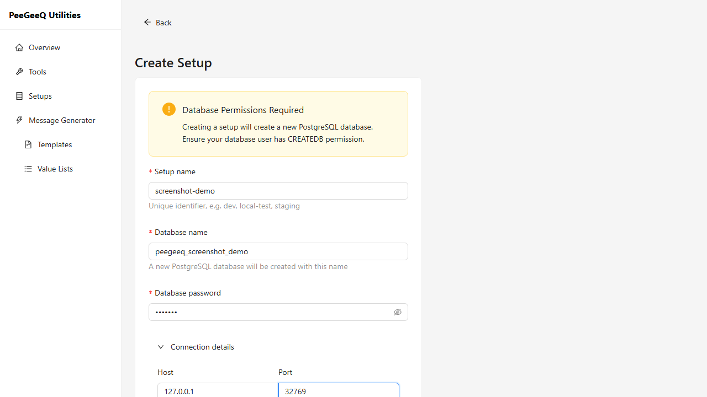

#### 09 — Setups list, populated after creation

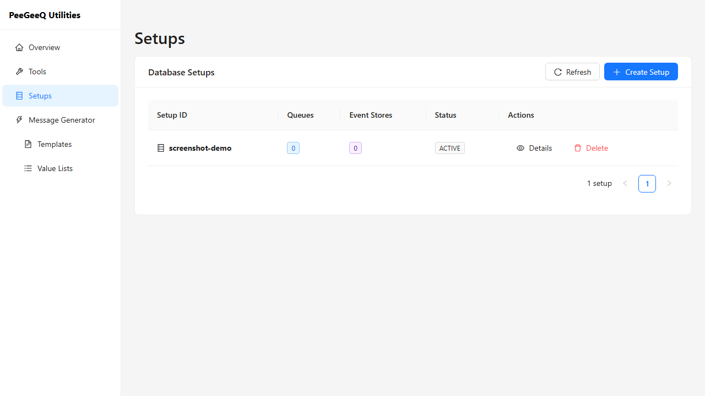

#### 11 — Create Queue, empty form

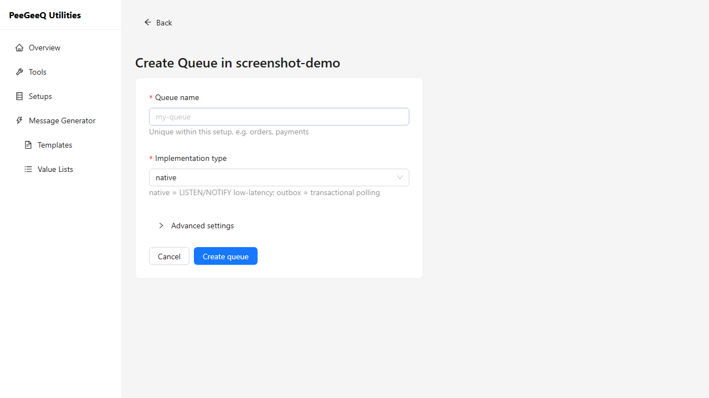

#### 12 — Create Queue, filled with advanced settings expanded

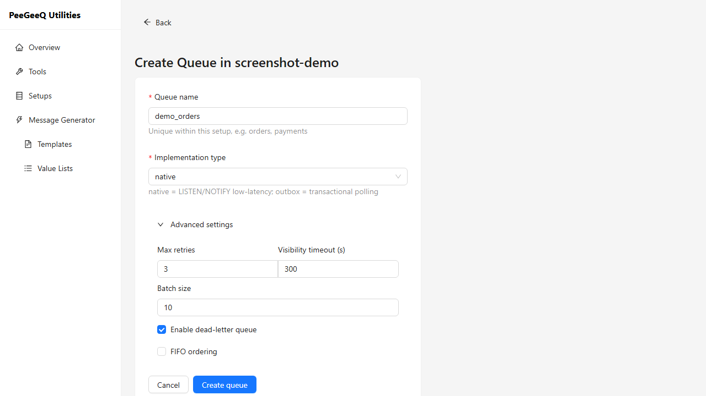

#### 14 — Delete queue, confirmation popover

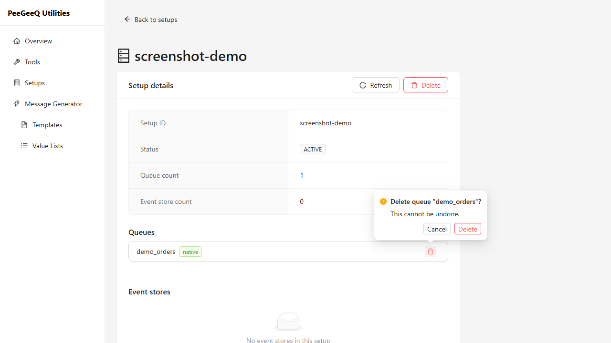

#### 15 — Delete setup, confirmation popover

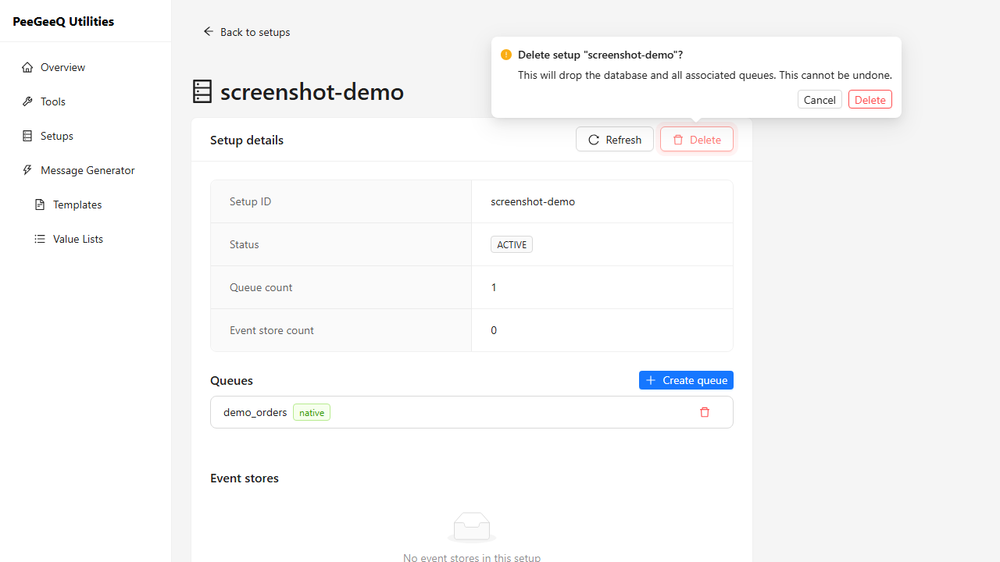
